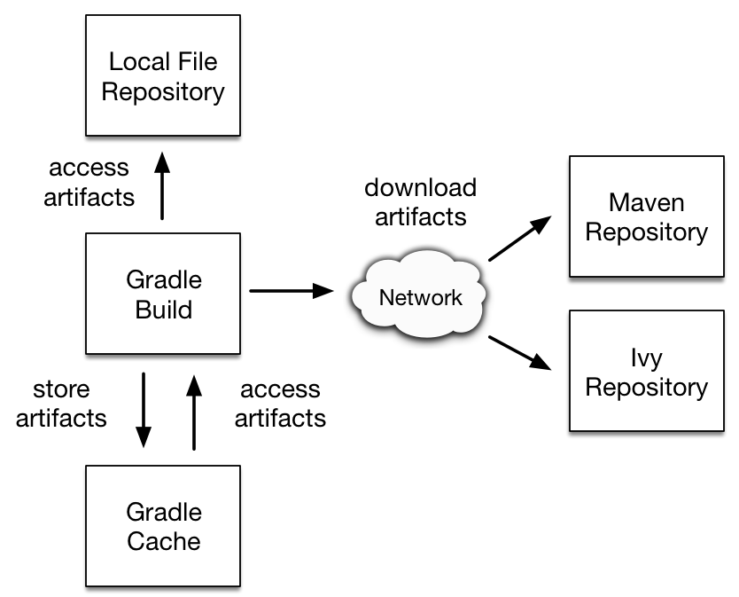

[ Gradle ](https://docs.gradle.org "Gradle Docs")

User Manual

  * Community Open Community Menu

[ Community Home ](https://gradle.org/)

[ Community Forums ](https://discuss.gradle.org/)

[ Community Plugins ](https://plugins.gradle.org)

  * [Training](https://gradle.com/training/)
  * News Open Community Menu

[ Newsletter ](https://newsletter.gradle.com)

[ Blog ](https://blog.gradle.org)

[ Twitter ](https://twitter.com/gradle)

  * [Enterprise](https://gradle.com)
  * [github](https://github.com/gradle/gradle "Gradle on GitHub")

  * [Docs Home](../userguide/userguide.html)
  * [Samples](../samples/index.html)
  * [Release Notes](../release-notes.html)
  * Gradle API
    * [Javadoc](../javadoc/index.html?overview-summary.html)
    * [Groovy DSL Reference](../dsl/index.html)
    * [Groovy DSL Primer](../userguide/groovy_build_script_primer.html)
    * [Kotlin DSL API](https://gradle.github.io/kotlin-dsl-docs/api/)
    * [Kotlin DSL Primer](../userguide/kotlin_dsl.html)

### User Manual

[ PDF ](../userguide/userguide.pdf)

  * [What is Gradle?](../userguide/what_is_gradle.html)
  * [Getting Started](../userguide/getting_started.html)
  * [Installing Gradle](../userguide/installation.html)
  * Upgrading Gradle...
    * [version 6.X to latest](../userguide/upgrading_version_6.html)
    * [version 5.X to 6.0](../userguide/upgrading_version_5.html)
    * [version 4.X to 5.0](../userguide/upgrading_version_4.html)
    * [Gradle's Feature Lifecycle](../userguide/feature_lifecycle.html)
  * Migrating to Gradle...
    * [from Maven](../userguide/migrating_from_maven.html)
    * [from Ant](../userguide/migrating_from_ant.html)
  * [Compatibility Notes](../userguide/compatibility.html)
  * [Troubleshooting Builds](../userguide/troubleshooting.html)

### Running Gradle Builds

  * Customizing Execution
    * [Configuring the Build Environment](../userguide/build_environment.html)
    * [Configuring the Gradle Daemon](../userguide/gradle_daemon.html)
    * [Using Initialization Scripts](../userguide/init_scripts.html)
  * [Executing Multi-Project Builds](../userguide/intro_multi_project_builds.html)
  * [Inspecting Gradle Builds](https://scans.gradle.com/)
  * Optimizing Build Times
    * [Build Performance Guide](https://guides.gradle.org/performance/)
    * [Enabling and Configuring the Build Cache](../userguide/build_cache.html)
    * [Using the Configuration Cache](../userguide/configuration_cache.html)

### Authoring Gradle Builds

  * Learning the Basics
    * [Introducing the Basics of Build Scripts](../userguide/tutorial_using_tasks.html)
    * [Working with Tasks](../userguide/more_about_tasks.html)
    * [Learning More About Build Scripts](../userguide/writing_build_scripts.html)
    * [Working with Files](../userguide/working_with_files.html)
    * [Using Gradle Plugins](../userguide/plugins.html)
    * [Understanding the Build Lifecycle](../userguide/build_lifecycle.html)
    * [Working with Logging](../userguide/logging.html)
    * [Avoiding Traps](../userguide/potential_traps.html)
  * Authoring Multi-Project Builds
    * [Creating a Basic Multi-Project Build](../userguide/multi_project_builds.html)
    * [Declaring Dependencies between Subprojects](../userguide/declaring_dependencies_between_subprojects.html)
    * [Sharing Build Logic between Subprojects](../userguide/sharing_build_logic_between_subprojects.html)
    * [Fine Tuning the Project Layout](../userguide/fine_tuning_project_layout.html)
    * [Understanding Configuration and Execution](../userguide/multi_project_configuration_and_execution.html)
  * Authoring Sustainable Builds
    * [Organizing Build Logic](../userguide/organizing_gradle_projects.html)
    * [Following Best Practices](../userguide/authoring_maintainable_build_scripts.html)
  * Advanced Techniques
    * [Developing Parallel Tasks](https://guides.gradle.org/using-the-worker-api/)
    * [Testing a Build with TestKit](../userguide/test_kit.html)
    * [Using Ant from Gradle](../userguide/ant.html)

### Authoring JVM Builds

  * [Building Java & JVM projects](../userguide/building_java_projects.html)
  * [Testing Java & JVM projects](../userguide/java_testing.html)
  * [Toolchains for Java projects](../userguide/toolchains.html)
  * [Managing Dependencies](../userguide/dependency_management_for_java_projects.html)
  * JVM Plugins
    * [Java Library Plugin](../userguide/java_library_plugin.html)
    * [Java Application Plugin](../userguide/application_plugin.html)
    * [Java Platform Plugin](../userguide/java_platform_plugin.html)
    * [Groovy Plugin](../userguide/groovy_plugin.html)
    * [Scala Plugin](../userguide/scala_plugin.html)

### Authoring C++/Swift Builds

  * [Building C++ projects](../userguide/building_cpp_projects.html)
  * [Testing C++ projects](../userguide/cpp_testing.html)
  * [Building Swift projects](../userguide/building_swift_projects.html)
  * [Testing Swift projects](../userguide/swift_testing.html)

### Working with Dependencies

  * Learning the Basics
    * [What is Dependency Management?](../userguide/core_dependency_management.html)
    * [Declaring Repositories](../userguide/declaring_repositories.html)
    * [Declaring Dependencies](../userguide/declaring_dependencies.html)
    * [Understanding Library and Application Differences](../userguide/library_vs_application.html)
    * [Viewing and Debugging Dependencies](../userguide/viewing_debugging_dependencies.html)
    * [Understanding Resolution](../userguide/dependency_resolution.html)
    * [Verifying dependencies](../userguide/dependency_verification.html)
  * Declaring Versions
    * [Declaring Versions and Ranges](../userguide/single_versions.html)
    * [Declaring Rich Versions](../userguide/rich_versions.html)
    * [Handling Changing Versions](../userguide/dynamic_versions.html)
    * [Locking Versions](../userguide/dependency_locking.html)
  * Controlling Transitives
    * [Upgrading Versions](../userguide/dependency_constraints.html)
    * [Downgrading and Excluding](../userguide/dependency_downgrade_and_exclude.html)
    * [Sharing Versions](../userguide/platforms.html)
    * [Aligning Dependencies](../userguide/dependency_version_alignment.html)
    * [Handling Mutually Exclusive Dependencies](../userguide/dependency_capability_conflict.html)
    * [Fixing Metadata](../userguide/component_metadata_rules.html)
    * [Customizing Resolution](../userguide/resolution_rules.html)
    * [Preventing accidental upgrades](../userguide/resolution_strategy_tuning.html)
  * Producing and Consuming Variants of Libraries
    * [Declaring Capabilities of a Library](../userguide/component_capabilities.html)
    * [Modeling Feature Variants and Optional Dependencies](../userguide/feature_variants.html)
    * [Understanding Variant Selection](../userguide/variant_model.html)
    * [Declaring Variant Attributes](../userguide/variant_attributes.html)
    * [Sharing Outputs of Projects](../userguide/cross_project_publications.html)
    * [Transforming Artifacts](../userguide/artifact_transforms.html)
  * Working in a Multi-repo Environment
    * [Composing Builds](../userguide/composite_builds.html)
  * Publishing Libraries
    * [Setting up Publishing](../userguide/publishing_setup.html)
    * [Understanding Gradle Module Metadata](../userguide/publishing_gradle_module_metadata.html)
    * [Signing Artifacts](../userguide/publishing_signing.html)
    * [Customizing Publishing](../userguide/publishing_customization.html)
    * [Maven Publish Plugin](../userguide/publishing_maven.html)
    * [Ivy Publish Plugin](../userguide/publishing_ivy.html)
  * [Terminology](../userguide/dependency_management_terminology.html)

### Extending Gradle

  * [Plugin Development Tutorials](https://gradle.org/guides/?q=Plugin%20Development)
  * [Writing Gradle Task Types](../userguide/custom_tasks.html)
  * [Writing Gradle Plugins](../userguide/custom_plugins.html)
  * [Writing Custom Gradle Types](../userguide/custom_gradle_types.html)
  * [Configuring Tasks Lazily](../userguide/lazy_configuration.html)
  * [Using Task Configuration Avoidance](../userguide/task_configuration_avoidance.html)

### Reference

  * [Core Plugins](../userguide/plugin_reference.html)
  * [Command-Line Interface](../userguide/command_line_interface.html)
  * [Gradle & Third-party Tools](../userguide/third_party_integration.html)
  * [The Gradle Wrapper](../userguide/gradle_wrapper.html)
  * [Gradle-managed Directories](../userguide/directory_layout.html)

# Dependency management in Gradle

version 6.7.1

Contents

  * What is dependency management?
  * Dependency management in Gradle

## What is dependency management?

Software projects rarely work in isolation. In most cases, a project relies on
reusable functionality in the form of libraries or is broken up into
individual components to compose a modularized system. Dependency management
is a technique for declaring, resolving and using dependencies required by the
project in an automated fashion.

__ |

For a general overview on the terms used throughout the user guide, refer to
[Dependency Management Terminology](dependency_management_terminology.html).  
  
---|---  
  
## Dependency management in Gradle

Gradle has built-in support for dependency management and lives up to the task
of fulfilling typical scenarios encountered in modern software projects. We’ll
explore the main concepts with the help of an example project. The
illustration below should give you an rough overview on all the moving parts.

Figure 1. Dependency management big picture

The example project builds Java source code. Some of the Java source files
import classes from [Google Guava](https://github.com/google/guava), a open-
source library providing a wealth of utility functionality. In addition to
Guava, the project needs the [JUnit](http://junit.org/junit5/) libraries for
compiling and executing test code.

Guava and JUnit represent the _dependencies_ of this project. A build script
developer can [declare dependencies](declaring_dependencies.html#declaring-
dependencies) for different scopes e.g. just for compilation of source code or
for executing tests. In Gradle, the [scope of a
dependency](declaring_dependencies.html#sec:what-are-dependency-
configurations) is called a _configuration_. For a full overview, see the
reference material on [dependency
types](declaring_dependencies.html#sec:dependency-types).

Often times dependencies come in the form of
[modules](dependency_management_terminology.html#sub:terminology_module).
You’ll need to tell Gradle where to find those modules so they can be consumed
by the build. The location for storing modules is called a _repository_. By
[declaring repositories](declaring_repositories.html#declaring-repositories)
for a build, Gradle will know how to find and retrieve modules. Repositories
can come in different forms: as local directory or a remote repository. The
reference on [repository types](declaring_repositories.html#sec:repository-
types) provides a broad coverage on this topic.

At runtime, Gradle will locate the declared dependencies if needed for
operating a specific task. The dependencies might need to be downloaded from a
remote repository, retrieved from a local directory or requires another
project to be built in a multi-project setting. This process is called
_dependency resolution_. You can find a detailed discussion in [How Gradle
downloads dependencies](dependency_resolution.html#sec:how-gradle-downloads-
deps).

Once resolved, the resolution mechanism [stores the underlying files of a
dependency in a local cache](dependency_resolution.html#sec:dependency_cache),
also referred to as the _dependency cache_. Future builds reuse the files
stored in the cache to avoid unnecessary network calls.

Modules can provide additional metadata. Metadata is the data that describes
the module in more detail e.g. the coordinates for finding it in a repository,
information about the project, or its authors. As part of the metadata, a
module can define that other modules are needed for it to work properly. For
example, the JUnit 5 platform module also requires the platform commons
module. Gradle automatically resolves those additional modules, so called
_transitive dependencies_. If needed, you can [customize the behavior the
handling of transitive dependencies](dependency_constraints.html) to your
project's requirements.

Projects with tens or hundreds of declared dependencies can easily suffer from
dependency hell. Gradle provides sufficient tooling to visualize, navigate and
analyze the dependency graph of a project either with the help of a [build
scan](https://scans.gradle.com/get-started) or built-in tasks. Learn more in
[Viewing and debugging
dependencies](viewing_debugging_dependencies.html#viewing-debugging-
dependencies).

Figure 2. Build scan dependencies report

**Docs**

  * [User Manual](/userguide/userguide.html)
  * [DSL Reference](/dsl/)
  * [Release Notes](/release-notes.html)
  * [Javadoc](/javadoc/)

**News**

  * [Blog](https://blog.gradle.org/)
  * [Newsletter](https://newsletter.gradle.com/)
  * [Twitter](https://twitter.com/gradle)
  * [Status Page](https://status.gradle.com/)

**Products**

  * [Build Scans](https://gradle.com/build-scans/)
  * [Build Cache](https://gradle.com/build-cache/)
  * [Enterprise Docs](https://gradle.com/enterprise/resources/)

**Get Help**

  * [Forums](https://discuss.gradle.org/c/help-discuss)
  * [GitHub](https://github.com/gradle/)
  * [Training](https://gradle.com/training/)
  * [Services](https://gradle.org/services/)

##### Stay `UP-TO-DATE` on new features and news

By entering your email, you agree to our
[Terms](https://gradle.com/legal/terms-of-service/) and [Privacy
Policy](https://gradle.com/legal/privacy/), including receipt of emails. You
can unsubscribe at any time.

Subscribe

© [Gradle Inc.](https://gradle.com) 2020 All rights reserved.

[ gradle ](/)

[Careers](https://gradle.com/careers/) |
[Privacy](https://gradle.com/legal/privacy/) | [Terms of
Service](https://gradle.com/legal/terms-of-service/) |
[Contact](https://gradle.org/contact/)

