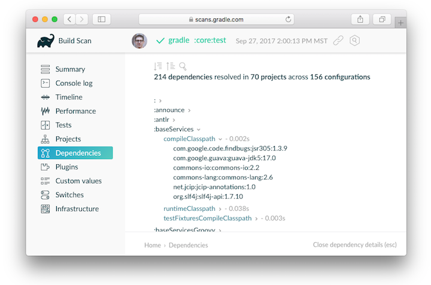

# Gradle中的依赖管理

内容

  * [什么是依赖管理？](#什么是依赖管理？)
  * [Gradle中的依赖管理](#Gradle中的依赖管理)

## [什么是依赖管理？](#什么是依赖管理？)

软件项目很少单独工作。在大多数情况下，项目依赖于库形式的可重用功能，或者分解为单个组件以构成模块化系统。依赖性管理是一种用于以自动化方式声明，解决和使用项目所需依赖性的技术。

╔═════════════════════════════  

有关整个用户指南中使用的术语的一般概述，请参阅“[依赖关系管理术语”](/md/依赖管理术语.md)。  
  
╚═════════════════════════════    
  
## [Gradle中的依赖管理](#Gradle中的依赖管理)

Gradle具有对依赖项管理的内置支持，并且可以完成现代软件项目中遇到的典型方案。我们将在示例项目的帮助下探索主要概念。下图将为您简要概述所有运动部件。

图1.依赖管理大图

该示例项目将构建Java源代码。一些Java源文件从[Google Guava](https://github.com/google/guava)（一个提供大量实用程序功能的开源库）中导入类。除了Guava，该项目还需要[JUnit](http://junit.org/junit5/)库来编译和执行测试代码。

Guava和JUnit表示此项目的 _依赖_
项。构建脚本开发人员可以[声明](/md/声明依赖.md#declaring-dependencies)
不同范围的[依赖关系](/md/声明依赖.md#declaring-dependencies)，例如，仅用于源代码的编译或用于执行测试。
在Gradle中，[依赖项](/md/声明依赖_md#什么是依赖项配置)
的[范围](/md/声明依赖_md#什么是依赖项配置)称为 _configuration_
。有关完整概述，请参见有关[依赖项类型](/md/声明依赖_md#不同种类的依赖)的参考资料。

通常，依赖项以[模块](/md/依赖管理术语_md#模块（module）)的形式出现。您需要告诉Gradle在哪里可以找到那些模块，以便构建可以使用它们。存储模块的位置称为
_存储库_
。通过为构建[声明存储库](/md/声明存储库.md#declaring-repositories)，Gradle将知道如何查找和检索模块。存储库可以采用不同的形式：作为本地目录或远程存储库。有关[存储库类型](/md/声明存储库_md#支持的存储库类型)的参考对此主题进行了广泛介绍。

在运行时，如果需要执行特定任务，Gradle将定位声明的依赖项。依赖项可能需要从远程存储库下载，从本地目录检索，或者需要在多项目设置中构建另一个项目。此过程称为
_依赖关系解析_
。您可以在[Gradle如何下载依赖项中](/md/了解依赖性解析_md#Gradle如何检索依​​赖元数据？)找到详细的讨论。

解决后，解析机制[会将依赖项的基础文件存储在本地缓存](/md/了解依赖性解析_md#依赖缓存)（也称为
_依赖项缓存）中_ 。将来的版本将重复使用存储在缓存中的文件，以避免不必要的网络调用。

模块可以提供其他元数据。元数据是更详细地描述模块的数据，例如用于在存储库中找到模块的坐标，有关项目或其作者的信息。作为元数据的一部分，模块可以定义需要其他模块才能使其正常工作。例如，JUnit
5平台模块还需要平台公共模块。Gradle自动解决这些附加模块，即 _传递依赖_
。如果需要，您可以[自定义行为，](/md/升级传递依赖的版本.md)以根据您的项目需求来[处理传递依赖项](/md/升级传递依赖的版本.md)。

具有数十或数百个已声明依赖项的项目很容易遭受依赖地狱之苦。Gradle提供了足够的工具，可以借助[构建扫描](https://scans.gradle.com/get-started)或内置任务来可视化，导航和分析项目的依赖关系图。在[查看和调试依赖项中](/md/查看和调试依赖项.md#viewing-debugging-dependencies)了解更多信息。

图2.构建扫描依赖性报告

