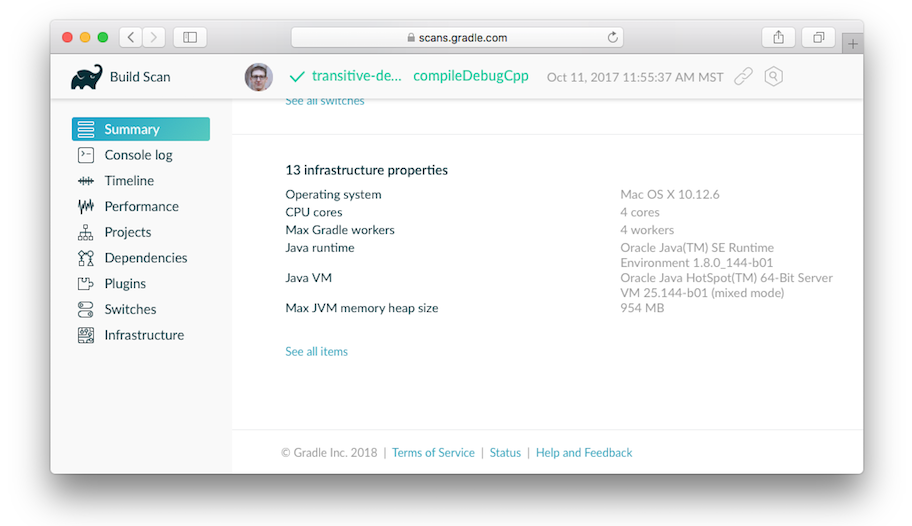

# 搭建环境

version 6.7.1

内容

  * [Gradle属性](#sec:gradle_configuration_properties)
  * [系统属性](#sec:gradle_system_properties)
  * [环境变量](#sec:gradle_environment_variables)
  * [项目性质](#sec:project_properties)
  * [配置JVM内存](#sec:configuring_jvm_memory)
  * [使用项目属性配置任务](#sec:configuring_task_using_project_properties)
  * [通过HTTP代理访问网络](#sec:accessing_the_web_via_a_proxy)

Gradle提供了多种机制来配置Gradle本身和特定项目的行为。以下是使用这些机制的参考。

在配置Gradle行为时，您可以使用以下方法，按从高到低的优先顺序列出：

  * [命令行标志](/md/命令行界面.md#command_line_interface)
  例如`--build-cache`。这些优先于属性和环境变量。

  * [系统属性](#sec:gradle_system_properties)
  例如`systemProp.http.proxyHost=somehost.org`存储在`gradle.properties`文件中。

  * [Gradle属性](#sec:gradle_configuration_properties)
  例如`org.gradle.caching=true`通常存储在`gradle.properties`项目根目录或`GRADLE_USER_HOME`环境变量中的文件中的[属性](#sec:gradle_configuration_properties)。

  * [环境变量](#sec:gradle_environment_variables)
  例如`GRADLE_OPTS`由执行Gradle的环境派生的。

除了配置构建环境外，您还可以使用[Project属性](#sec:project_properties)
（例如）配置给定的项目构建`-PreleaseType=final`。

## [Gradle属性](#sec:gradle_configuration_properties)

Gradle提供了多个选项，可以轻松配置将用于执行构建的Java流程。尽管可以通过`GRADLE_OPTS`或在本地环境中配置这些`JAVA_OPTS`设置，但将某些设置（例如JVM内存配置和Java主目录位置）存储在版本控制中非常有用，这样整个团队就可以在一致的环境中工作。

为构建建立一致的环境就像将这些设置放入`gradle.properties`文件一样简单。该配置是您所有`gradle.properties`文件的组合，但是如果在多个位置配置了一个选项，则
_取第一个_ ：

  * 系统属性，例如在`-Dgradle.user.home`命令行上设置的时间。

  * `gradle.properties`在`GRADLE_USER_HOME`目录中。

  * `gradle.properties` 在项目根目录中。

  * `gradle.properties` 在Gradle安装目录中。

以下属性可用于配置Gradle构建环境：

`org.gradle.caching=(true,false)`

    

当设置为true时，Gradle将在可能的情况下重用任何先前构建的任务输出，从而使构建速度更快。了解有关[使用构建缓存的](/md/构建缓存.md#build_cache)更多信息。

`org.gradle.caching.debug=(true,false)`

    

设置为true时，单个输入属性哈希值和每个任务的构建缓存键都记录在控制台上。了解有关[任务输出缓存的](/md/构建缓存.md#sec:task_output_caching)更多信息。

`org.gradle.configureondemand=(true,false)`

    

启用[按需](/md/配置时间和执行时间.md#sec:configuration_on_demand)孵化[配置](/md/配置时间和执行时间.md#sec:configuration_on_demand)，Gradle将尝试仅配置必要的项目。

`org.gradle.console=(auto,plain,rich,verbose)`

    

自定义控制台输出的颜色或详细程度。默认值取决于Gradle的调用方式。有关其他详细信息，请参见[命令行日志记录](/md/命令行界面.md#sec:command_line_logging)。

`org.gradle.daemon=(true,false)`

    

当设置`true`的[Gradle守护进程](/md/Gradle守护程序.md#gradle_daemon)来运行构建。默认值为`true`。

`org.gradle.daemon.idletimeout=(# of idle millis)`

    

在指定的空闲毫秒数后，Gradle守护程序将自行终止。默认值为`10800000`（3小时）。

`org.gradle.debug=(true,false)`

    

设置`true`为时，Gradle将在启用远程调试的情况下运行构建，侦听端口5005。请注意，这等同于添加`-agentlib:jdwp=transport=dt_socket,server=y,suspend=y,address=5005`到JVM命令行，并且将挂起虚拟机，直到连接了调试器。默认值为`false`。

`org.gradle.java.home=(path to JDK home)`

    

指定用于Gradle构建过程的Java主页。可以将值设置为`jdk`或`jre`位置，但是，根据您的构建方式，使用JDK更安全。如果未指定设置，则从您的环境（`JAVA_HOME`或的路径`java`）派生合理的默认值。这不会影响用于启动Gradle客户端VM的Java版本（[请参阅环境变量](#sec:gradle_environment_variables)）。

`org.gradle.jvmargs=(JVM arguments)`

    

指定用于Gradle守护程序的JVM参数。该设置对于[配置JVM内存设置](#sec:configuring_jvm_memory)以提高构建性能特别有用。这不会影响Gradle客户端VM的JVM设置。

`org.gradle.logging.level=(quiet,warn,lifecycle,info,debug)`

    

当设置为安静，警告，生命周期，信息或调试时，Gradle将使用此日志级别。这些值不区分大小写。该`lifecycle`级别是默认级别。请参阅[选择日志级别](/md/使用记录.md#sec:choosing_a_log_level)。

`org.gradle.parallel=(true,false)`

    

配置后，Gradle将分叉到`org.gradle.workers.max`JVM以并行执行项目。要了解有关并行任务执行的更多信息，请参阅[Gradle性能指南](https://guides.gradle.org/performance/#parallel_execution)。

`org.gradle.priority=(low,normal)`

    

指定Gradle守护程序及其启动的所有进程的调度优先级。默认值为`normal`。另请参阅[性能命令行选项](/md/命令行界面.md#sec:command_line_performance)。

`org.gradle.vfs.verbose=(true,false)`

    

在[监视文件系统](/md/Gradle守护程序.md#sec:daemon_watch_fs)时配置详细日志记录。
_默认为关闭_ 。

`org.gradle.vfs.watch=(true,false)`

    
切换[观看文件系统](/md/Gradle守护程序.md#sec:daemon_watch_fs)。允许Gradle在下一个版本中重用有关文件系统的信息。
_默认为关闭_ 。

`org.gradle.warning.mode=(all,fail,summary,none)`

    

当设置为`all`，`summary`或者`none`，Gradle会使用不同的预警类型的显示器。有关详细信息，请参见[命令行日志记录选项](/md/命令行界面.md#sec:command_line_logging)。

`org.gradle.workers.max=(max # of worker processes)`

    

配置后，Gradle将最多使用给定数量的工人。默认值为CPU处理器数。另请参阅[性能命令行选项](/md/命令行界面.md#sec:command_line_performance)。

下面的示例演示各种属性的用法。

例子1.用gradle.properties文件设置属性

gradle.properties

    
    
    gradlePropertiesProp=gradlePropertiesValue
    sysProp=shouldBeOverWrittenBySysProp
    systemProp.system=systemValue

`Groovy``Kotlin`

build.gradle

    
    
    task printProps {
        doLast {
            println commandLineProjectProp
            println gradlePropertiesProp
            println systemProjectProp
            println System.properties['system']
        }
    }

build.gradle.kts

    
    
    // Project properties can be accessed via delegation
    val commandLineProjectProp: String by project
    val gradlePropertiesProp: String by project
    val systemProjectProp: String by project
    
    tasks.register("printProps") {
        doLast {
            println(commandLineProjectProp)
            println(gradlePropertiesProp)
            println(systemProjectProp)
            println(System.getProperty("system"))
        }
    }
    
    
    $ gradle -q -PcommandLineProjectProp = commandLineProjectPropValue -Dorg.gradle.project.systemProjectProp = systemPropertyValue printProps
    commandLineProjectPropValue
    gradlePropertiesValue
    systemPropertyValue
    systemValue

## [系统属性](#sec:gradle_system_properties)

使用`-D`命令行选项，可以将系统属性传递给运行Gradle的JVM。在`-D`该选项的`gradle`命令有作为的效果相同`-D`的选项的`java`命令。

您还可以在`gradle.properties`带有前缀的文件中设置系统属性`systemProp.`

在中指定系统属性 `gradle.properties`

    
    
    systemProp.gradle.wrapperUser = myuser
    systemProp.gradle.wrapperPassword = mypassword

以下系统属性可用。请注意，命令行选项优先于系统属性。

`gradle.wrapperUser=(myuser)`

    

指定用户名以使用HTTP基本认证从服务器下载Gradle发行版。在[身份验证的包装下载中](/md/gradle_wrapper.md#sec:authenticated_download)了解更多信息。

`gradle.wrapperPassword=(mypassword)`

    

指定使用Gradle包装器下载Gradle发行版的密码。

`gradle.user.home=(path to directory)`

    

指定Gradle用户的主目录。

在多项目构建中，`systemProp.`除根目录以外的任何项目中设置的“
”属性都将被忽略。也就是说，`gradle.properties`将仅检查根项目的文件中以“ `systemProp.`”开头的属性。

## [环境变量](#sec:gradle_environment_variables)

以下环境变量可用于该`gradle`命令。请注意，命令行选项和系统属性优先于环境变量。

`GRADLE_OPTS`

    

指定启动Gradle客户端VM时要使用的JVM参数。客户端VM仅处理命令行输入/输出，因此很少需要更改其VM选项。实际的构建由Gradle守护程序运行，不受此环境变量的影响。

`GRADLE_USER_HOME`

    

指定Gradle用户的主目录（`$USER_HOME/.gradle`如果未设置，则默认为）。

`JAVA_HOME`

    

指定要用于客户端VM的JDK安装目录。除非使用Gradle属性文件指定了另一个虚拟机，否则此虚拟机也用于守护程序`org.gradle.java.home`。

## [项目性质](#sec:project_properties)

您可以通过命令行选项将属性直接添加到[Project](https://docs.gradle.org/6.7.1/dsl/org.gradle.api.Project.html)对象`-P`。

当Gradle看到特别命名的系统属性或环境变量时，它也可以设置项目属性。如果环境变量名称看起来像，则Gradle将在项目对象上设置一个属性，值为。Gradle也为系统属性支持此功能，但是具有不同的命名模式，看起来像。以下两项都将Project对象上的属性设置为。`ORG_GRADLE_PROJECT
__prop_ =somevalue``prop``somevalue``org.gradle.project. _prop_``foo``"bar"`

通过系统属性设置项目属性

    
    
    org.gradle.project.foo = bar

通过环境变量设置项目属性

    
    
    ORG_GRADLE_PROJECT_foo=bar

> 用户主目录中的属性文件优先于项目目录中的属性文件。  
  

  
当您没有连续集成服务器的管理员权限并且需要设置不容易看到的属性值时，此功能非常有用。由于您不能`-P`在该方案中使用该选项，也不能更改系统级配置文件，因此正确的策略是更改连续集成构建作业的配置，并添加与预期模式匹配的环境变量设置。这对于系统上的普通用户是不可见的。

您可以像使用变量一样使用名称来访问构建脚本中的项目属性。

Tip：
  如果引用了项目属性但不存在，则将引发异常，并且构建将失败。  
  在使用[Project.hasProperty（java.lang.String）](https://docs.gradle.org/6.7.1/dsl/org.gradle.api.Project.html#org.gradle.api.Project:hasProperty\(java.lang.String\))方法访问可选项目属性之前，应检查其是否存在。  
      

  
## [配置JVM内存](#sec:configuring_jvm_memory)

您可以通过以下方式调整Gradle的JVM选项：

该`org.gradle.jvmargs`Gradle属性控制虚拟机上运行的版本。默认为`-Xmx512m "-XX:MaxMetaspaceSize=256m"`

更改构建VM的JVM设置

    
    
    org.gradle.jvmargs = -Xmx2g -XX：MaxMetaspaceSize = 512m -XX：+ HeapDumpOnOutOfMemoryError -Dfile.encoding = UTF-8

在`JAVA_OPTS`环境变量控制命令行客户机，其仅用于显示控制台输出。默认为`-Xmx64m`

更改客户端VM的JVM设置

    
    
    JAVA_OPTS =“-Xmx64m -XX：MaxPermSize = 64m -XX：+ HeapDumpOnOutOfMemoryError -Dfile.encoding = UTF-8”
  在一种情况下，客户端VM也可以用作构建VM：如果停用[Gradle Daemon](/md/Gradle守护程序.md#gradle_daemon)，并且客户端VM具有与构建VM相同的设置，则客户端VM将直接运行构建。否则，客户端虚拟机将派生一个新的虚拟机来运行实际的构建，以便采用不同的设置。  
      
 
  
某些任务（如`test`任务）也会派生其他JVM进程。您可以通过任务本身来配置它们。它们`-Xmx512m`默认都使用。

示例2.为[JavaCompile](https://docs.gradle.org/6.7.1/dsl/org.gradle.api.tasks.compile.JavaCompile.html)任务设置Java编译选项

`Groovy``Kotlin`

build.gradle

    
    
    plugins {
        id 'java'
    }
    
    tasks.withType(JavaCompile) {
        options.compilerArgs += ['-Xdoclint:none', '-Xlint:none', '-nowarn']
    }

build.gradle.kts

    
    
    plugins {
        java
    }
    
    tasks.withType<JavaCompile>().configureEach {
        options.compilerArgs = listOf("-Xdoclint:none", "-Xlint:none", "-nowarn")
    }

请参阅[Test](https://docs.gradle.org/6.7.1/dsl/org.gradle.api.tasks.testing.Test.html)
API文档中的其他示例，以及[Java插件参考中的测试执行](/md/在Java和JVM项目中进行测试.md#sec:test_execution)。

使用该`--scan`选项时，[构建扫描](https://scans.gradle.com/)将告诉您有关执行构建的JVM的信息。

## [使用项目属性配置任务](#sec:configuring_task_using_project_properties)

可以根据调用时指定的项目属性来更改任务的行为。

假设您想确保发行版本仅由CI触发。一种简单的处理方法是通过`isCI`项目属性。

例子3.防止释放到CI外

`Groovy``Kotlin`

build.gradle

    
    
    task performRelease {
        doLast {
            if (project.hasProperty("isCI")) {
                println("Performing release actions")
            } else {
                throw new InvalidUserDataException("Cannot perform release outside of CI")
            }
        }
    }

build.gradle.kts

    
    
    tasks.register("performRelease") {
        doLast {
            if (project.hasProperty("isCI")) {
                println("Performing release actions")
            } else {
                throw InvalidUserDataException("Cannot perform release outside of CI")
            }
        }
    }
    
执行 
 
    gradle performRelease -PisCI=true --quiet
    Performing release actions
## [通过HTTP代理访问网络](#sec:accessing_the_web_via_a_proxy)

通过标准的JVM系统属性来配置HTTP或HTTPS代理（例如，用于下载依赖项）。这些属性可以直接在构建脚本中设置。例如，可以使用设置HTTP代理主机`System.setProperty('http.proxyHost',
'www.somehost.org')`。另外，可以[在gradle.properties中指定](#sec:gradle_configuration_properties)属性。

使用配置HTTP代理 `gradle.properties`

    
    
    systemProp.http.proxyHost=www.somehost.org
    systemProp.http.proxyPort=8080
    systemProp.http.proxyUser=userid
    systemProp.http.proxyPassword=password
    systemProp.http.nonProxyHosts=*.nonproxyrepos.com|localhost

HTTPS有单独的设置。

使用配置HTTPS代理 `gradle.properties`

    
    
    systemProp.https.proxyHost=www.somehost.org
    systemProp.https.proxyPort=8080
    systemProp.https.proxyUser=userid
    systemProp.https.proxyPassword=password
    systemProp.http.nonProxyHosts=*.nonproxyrepos.com|localhost

您可能需要设置其他属性才能访问其他网络。这里有2个参考可能会有所帮助：

  * [Ant代码库中的ProxySetup.java](https://git-wip-us.apache.org/repos/asf?p=ant.git;a=blob;f=src/main/org/apache/tools/ant/util/ProxySetup.java;hb=HEAD)

  * [JDK 7网络属性](http://download.oracle.com/javase/7/docs/technotes/guides/net/properties.html)

### [NTLM身份验证](#ntlm_authentication)

如果您的代理服务器需要NTLM身份验证，则可能需要提供身份验证域以及用户名和密码。您可以通过两种方式提供用于向NTLM代理进行身份验证的域：

  * 将`http.proxyUser`系统属性设置为。` _domain_ / _username_`

  * 通过`http.auth.ntlm.domain`system属性提供身份验证域。

