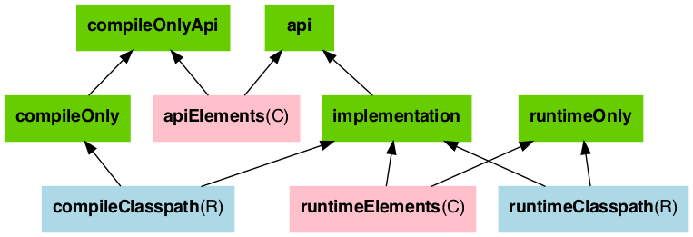
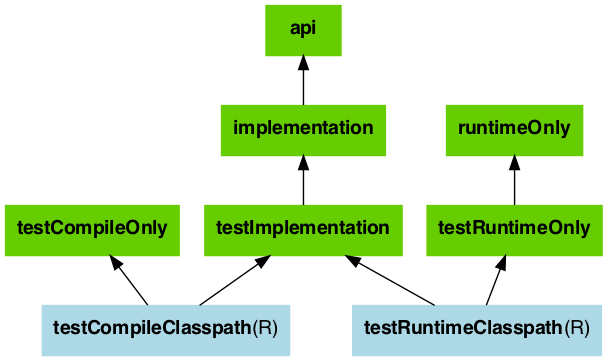

# Java库插件

内容

  * [用法](#sec:java_library_usage)
  * [API与实现分离](#sec:java_library_separation)
  * [识别API和实现依赖性](#sec:java_library_recognizing_dependencies)
  * [Java库插件配置](#sec:java_library_configurations_graph)
  * [Java模块系统的构建模块](#sec:java_library_modular)
  * [使用类而不是jar进行编译](#sec:java_library_classes_usage)
  * [分发图书馆](#sec:library_distribution)

Java库插件扩展的功能[的Java插件，](https://docs.gradle.org/6.7.1/userguide/java_plugin.html)通过提供有关Java库的具体知识。特别是，Java库向使用者（即使用Java或Java库插件的其他项目）公开API。使用此插件时，Java插件公开的所有源集，任务和配置都是隐式可用的。

## [用法](#sec:java_library_usage)

要使用Java库插件，请在构建脚本中包括以下内容：

示例1.使用Java库插件

`Groovy``Kotlin`

build.gradle

    
    
    plugins {
        id 'java-library'
    }

build.gradle.kts

    
    
    plugins {
        `java-library`
    }

## [API与实现分离](#sec:java_library_separation)

标准Java插件和Java库插件之间的主要区别在于，后者引入了向消费者公开的 _API_
的概念。库是一个Java组件，打算由其他组件使用。在多项目构建中，这是一个非常常见的用例，但在您具有外部依赖关系时也是如此。

该插件公开了两个[配置](https://docs.gradle.org/6.7.1/userguide/declaring_dependencies.html#sec:what-
are-dependency-
configurations)可用于声明的依赖性：`api`和`implementation`。该`api`配置应用于声明由库API导出的依赖关系，而该`implementation`配置应用于声明组件内部的依赖关系。

例子2.声明API和实现依赖

`Groovy``Kotlin`

build.gradle

    
    
    dependencies {
        api 'org.apache.httpcomponents:httpclient:4.5.7'
        implementation 'org.apache.commons:commons-lang3:3.5'
    }

build.gradle.kts

    
    
    dependencies {
        api("org.apache.httpcomponents:httpclient:4.5.7")
        implementation("org.apache.commons:commons-lang3:3.5")
    }

`api`配置中出现的依赖关系将传递给库的使用者，并因此出现在使用者的编译类路径上。`implementation`另一方面，在配置中找到的依赖项不会暴露给使用者，因此不会泄漏到使用者的编译类路径中。这有几个好处：

  * 依赖项不会再泄漏到使用者的编译类路径中，因此您永远不会意外地依赖于传递性依赖项

  * 减少类路径大小，加快了编译速度

  * 实施依赖项发生更改时，重新编译次数更少：无需重新编译使用者

  * 更清洁的发布：与新`maven-publish`插件一起使用时，Java库产生的POM文件可以准确地区分针对该库进行编译所需的内容和在运行时使用该库所需的内容（换句话说，请勿混用需要对库本身进行编译以及对库进行编译所需的内容）。

╔═════════════════════════════  

该`compile`配置仍然存在，但不应使用，因为它不能提供`api`和`implementation`配置所提供的保证。  
  
╚═════════════════════════════    
  
如果您的构建使用带有POM元数据的已发布模块，则Java和Java库插件会通过pom中使用的作用域来实现api和实现分离。这意味着编译类路径仅包含`compile`范围内的依赖关系，而运行时类路径也添加`runtime`范围内的依赖关系。

这通常对用Maven发布的模块没有影响，在Maven中，定义项目的POM直接作为元数据发布。在那里，编译范围既包括编译项目所需的依赖关系（即，实现依赖关系），又包括针对已发布库进行编译所需要的依赖关系（即API依赖关系）。对于大多数已发布的库，这意味着所有依赖项都属于编译范围。如果现有库遇到此类问题，则可以考虑使用[组件元数据规则](https://docs.gradle.org/6.7.1/userguide/component_metadata_rules.html#sec:component_metadata_rules)来修复构建中不正确的元数据。但是，如上所述，如果该库与Gradle一起发布，则生成的POM文件只会将`api`依赖项放入编译范围，而将其余`implementation`依赖项放入运行时范围。

如果您的构建使用带有Ivy元数据的模块，则如果所有模块都遵循特定的结构，则可以按[此处](https://docs.gradle.org/6.7.1/userguide/variant_model.html#sub:ivy-
mapping-to-variants)所述激活api和实现分离。

╔═════════════════════════════  

在Gradle
5.0+中，默认情况下，将模块的编译和运行时范围分开是活动的。在Gradle4.6+，你需要通过添加激活它`enableFeaturePreview('IMPROVED_POM_SUPPORT')`在
_settings.gradle_ 。  
  
╚═════════════════════════════    
  
## [识别API和实现依赖性](#sec:java_library_recognizing_dependencies)

本节将帮助您使用简单的经验法则来识别代码中的API和实现依赖性。第一个是：

  * 尽可能优先使用`implementation`配置`api`

这使依赖项脱离使用者的编译类路径。此外，如果任何实现类型意外泄漏到公共API中，使用者将立即无法编译。

那么什么时候应该使用`api`配置？API依赖关系是至少包含一种在库二进制接口（通常称为ABI（应用程序二进制接口））中公开的类型。这包括但不限于：

  * 超类或接口中使用的类型

  * 公共方法参数中使用的类型，包括通用参数类型（其中 _public_ 是编译器可见的东西。即Java世界中的 _public_ ， _protected_ 和 _package private_ 成员）

  * 公共领域中使用的类型

  * 公开注释类型

相比之下，以下列表中使用的任何类型都与ABI不相关，因此应声明为`implementation`依赖项：

  * 方法主体中专门使用的类型

  * 专用于私人会员的类型

  * 内部类专有的类型（将来的Gradle版本将允许您声明哪些包属于公共API）

下列类利用了几个第三方库，其中一个在类的公共API中公开，另一个仅在内部使用。import语句无法帮助我们确定哪个是哪个，因此我们必须查看字段，构造函数和方法：

### [示例：区分API和实现](#example_making_the_difference_between_api_and_implementation)

src / main / java / org / gradle / HttpClientWrapper.java

    
    
    // The following types can appear anywhere in the code
    // but say nothing about API or implementation usage
    import org.apache.commons.lang3.exception.ExceptionUtils;
    import org.apache.http.HttpEntity;
    import org.apache.http.HttpResponse;
    import org.apache.http.HttpStatus;
    import org.apache.http.client.HttpClient;
    import org.apache.http.client.methods.HttpGet;
    
    import java.io.ByteArrayOutputStream;
    import java.io.IOException;
    import java.io.UnsupportedEncodingException;
    
    public class HttpClientWrapper {
    
        private final HttpClient client; // private member: implementation details
    
        // HttpClient is used as a parameter of a public method
        // so "leaks" into the public API of this component
        public HttpClientWrapper(HttpClient client) {
            this.client = client;
        }
    
        // public methods belongs to your API
        public byte[] doRawGet(String url) {
            HttpGet request = new HttpGet(url);
            try {
                HttpEntity entity = doGet(request);
                ByteArrayOutputStream baos = new ByteArrayOutputStream();
                entity.writeTo(baos);
                return baos.toByteArray();
            } catch (Exception e) {
                ExceptionUtils.rethrow(e); // this dependency is internal only
            } finally {
                request.releaseConnection();
            }
            return null;
        }
    
        // HttpGet and HttpEntity are used in a private method, so they don't belong to the API
        private HttpEntity doGet(HttpGet get) throws Exception {
            HttpResponse response = client.execute(get);
            if (response.getStatusLine().getStatusCode() != HttpStatus.SC_OK) {
                System.err.println("Method failed: " + response.getStatusLine());
            }
            return response.getEntity();
        }
    }

用途的 _公共_ 构造函数作为参数，因此它对使用者公开，因此属于API。请注意，和用于 _私有_
方法的签名中，因此它们不计入使HttpClient成为API依赖项。`HttpClientWrapper``HttpClient``HttpGet``HttpEntity`
__

另一方面，`ExceptionUtils`来自`commons-lang`库的类型仅用于方法主体（而不用于其签名），因此它是实现依赖项。

因此，我们可以推断出这`httpclient`是API依赖性，而是`commons-lang`实现依赖性。该结论转化为构建脚本中的以下声明：

例子3.声明API和实现依赖

`Groovy``Kotlin`

build.gradle

    
    
    dependencies {
        api 'org.apache.httpcomponents:httpclient:4.5.7'
        implementation 'org.apache.commons:commons-lang3:3.5'
    }

build.gradle.kts

    
    
    dependencies {
        api("org.apache.httpcomponents:httpclient:4.5.7")
        implementation("org.apache.commons:commons-lang3:3.5")
    }

## [Java库插件配置](#sec:java_library_configurations_graph)

下图描述了使用Java库插件时如何设置配置。

  * _绿色_ 的配置是用户应用来声明依赖项的配置

  * _粉红色_ 的配置是组件编译或针对库运行时使用的配置

  * _蓝色_ 的配置位于组件内部，供其自己使用

下图描述了测试配置设置：

╔═════════════════════════════  

从Java插件继承的 _compile_ ， _testCompile_ ， _runtime_ 和 _testRuntime_
配置仍然可用，但已弃用。您应避免使用它们，因为仅保留它们是为了向后兼容。  
  
╚═════════════════════════════    
  
下表描述了每种配置的作用：

表1. Java库插件-用于声明依赖关系的配置
 
配置名称 | 角色 | 消耗品？ | 可解决的？ | 描述  
---|--- |---|---  |---  
`api`|声明API依赖项|没有|没有|在这里，您可以声明依赖关系，这些依赖关系会在编译时和运行时以可传递方式导出到使用者。  
`implementation`|声明实现依赖|没有|没有|在这里，您可以声明纯属内部的依赖关系，而不是要向使用方公开（在运行时仍向使用方公开）。  
`compileOnly`|声明仅编译依赖项|没有|没有|在这里可以声明在编译时需要的依赖项，而在运行时则不需要。这通常包括在运行时找到时会被阴影化的依赖项。  
`compileOnlyApi`|声明仅编译API依赖项|没有|没有|在这里，您可以声明模块和使用者在编译时需要的依赖项，而在运行时则不需要。这通常包括在运行时找到时会被阴影化的依赖项。  
`runtimeOnly`|声明运行时依赖项|没有|没有|在这里可以声明仅在运行时才需要的依赖关系，而在编译时则不需要。  
`testImplementation`|测试依赖|没有|没有|在这里声明用于编译测试的依赖项。  
`testCompileOnly`|声明测试仅编译依赖项|没有|没有|在这里您可以声明依赖项，这些依赖项仅在测试编译时才需要，但不应泄漏到运行时中。这通常包括在运行时找到时会被阴影化的依赖项。  
`testRuntimeOnly`|声明测试运行时依赖项|没有|没有|在这里，您可以声明仅在测试运行时才需要的依赖关系，而在测试编译时则不需要。  
  
表2. Java库插件—使用者使用的配置
 
 配置名称 | 角色 | 消耗品？ | 可解决的？ | 描述  
---|---|---|---|---  
`apiElements`|用于针对该库进行编译|是|没有|此配置供使用者使用，以检索对该库进行编译所需的所有元素。与`default`配置不同，这不会泄漏实现或运行时依赖项。  
`runtimeElements`|用于执行此库|是|没有|使用者将使用此配置来检索对该库运行所需的所有元素。  
  
  
表3. Java库插件-库本身使用的配置 

配置名称 | 角色 | 消耗？ | 可解决的？ | 描述  
---|---|---|---|--- 
compileClasspath|用于编译该库|没有|是|此配置包含此库的编译类路径，因此在调用java编译器进行编译时使用。  
runtimeClasspath|用于执行此库|没有|是|此配置包含此库的运行时类路径  
testCompileClasspath|用于编译该库的测试|没有|是|此配置包含此库的测试编译类路径。  
testRuntimeClasspath|用于执行此库的测试|没有|是|此配置包含此库的测试运行时类路径  
  
## [Java模块系统的构建模块](#sec:java_library_modular)

从Java 9开始，Java本身提供了一个
 [模块系统](https://www.oracle.com/corporate/features/understanding-java-9-modules.html),
该[模块系统](https://www.oracle.com/corporate/features/understanding-java-9-modules.html)
允许在编译和运行时进行严格的封装。您可以通过在源文件夹中创建文件将Java库变成 _Java模块_
。`module-info.java``main/java`

    
    
    src
    └── main
        └── java
            └── module-info.java

在模块信息文件中，声明 _模块名称_ ，要 _导出的_ 模块包以及 _所需的_ 其他模块。

module-info.java文件

    
    
    module org.gradle.sample {
        exports org.gradle.sample;
        requires com.google.gson;
    }

为了告诉Java编译器Jar是一个模块，而不是传统的Java库，Gradle需要将其放在所谓的 _模块路径上_ 。它是 _classpath_
的替代方法，它是告诉编译器有关已编译依赖项的传统方式。如果满足以下三个条件，则Gradle会自动将您的依赖项Jar放在模块路径上，而不是在类路径上：

  * 通过以下方式打开模块路径推断 `java. modularity.inferModulePath.set(true)`

  * 实际上，我们正在构建一个模块（与传统库相反），通过添加`module-info.java`文件来表示该模块。（另一种选择是添加`Automatic-Module-Name`Jar清单属性，[如](#sec:java_library_modular_auto)后面[所述](#sec:java_library_modular_auto)。）

  * 我们的模块所依赖的Jar本身就是一个模块，Gradles会根据Jar中是否存在`module-info.class` -模块描述符的编译版本来决定。（或者，替代地，存在`Automatic-Module-Name`Jar清单属性）

在下文中，将描述有关定义Java模块以及如何与Gradle的依赖管理进行交互的更多详细信息。您还可以查看一个[现成的示例](https://docs.gradle.org/6.7.1/samples/sample_java_modules_multi_project.html)，直接尝试Java模块支持。

╔═════════════════════════════  

Java Module System支持是一个孵化功能，因此您需要显式打开 _模块路径推断_ ，如下所示。  
  
╚═════════════════════════════    
  
例子4.激活模块路径推断

`Groovy``Kotlin`

build.gradle

    
    
    java {
        modularity.inferModulePath = true
    }

build.gradle.kts

    
    
    java {
        modularity.inferModulePath.set(true)
    }

### [声明模块依赖性](#declaring_module_dependencies)

与您在构建文件中声明的依赖关系和您在`module-info.java`文件中声明的模块依赖关系直接相关。理想情况下，声明应保持同步，如下表所示。

表4. Java模块指令和Gradle配置之间的映射以声明依赖关系 

Java模块指令 | Gradle配置 | 目的  
---|---  |---  
`requires`|`implementation`|声明实现依赖  
`requires transitive`|`api`|声明API依赖项  
`requires static`|`compileOnly`|声明仅编译依赖项  
`requires static transitive`|`compileOnlyApi`|声明仅编译API依赖项  
  
Gradle当前不会自动检查依赖项声明是否同步。这可能会在将来的版本中添加。

有关声明模块依赖关系的更多详细信息，请参阅[Java Module
System上的文档](https://www.oracle.com/corporate/features/understanding-
java-9-modules.html)。

### [声明包的可见性和服务](#declaring_package_visibility_and_services)

与Gradle本身相比，Java模块系统支持更多更精细的颗粒封装概念。例如，您明确需要声明哪些包是API的一部分，哪些仅在模块内部可见。其中一些功能可能会在将来的版本中添加到Gradle本身。现在，请参阅[Java模块系统上的文档](https://www.oracle.com/corporate/features/understanding-
java-9-modules.html)以了解如何在Java模块中使用这些功能。

### [声明模块版本](#declaring_module_versions)

Java模块还具有一个版本，该版本被编码为`module-info.class`文件中模块标识的一部分。运行模块时可以检查此版本。

例子5.在构建脚本中声明模块版本，或直接作为编译任务选项

`Groovy``Kotlin`

build.gradle

    
    
    version = '1.2'
    
    tasks.compileJava {
        // use the project's version or define one directly
        options.javaModuleVersion = provider { project.version }
    }

build.gradle.kts

    
    
    version = "1.2"
    
    tasks.compileJava {
        // use the project's version or define one directly
        options.javaModuleVersion.set(provider { project.version as String })
    }

### [使用不是模块的库](#using_libraries_that_are_not_modules)

您可能想在模块化Java项目中使用外部库，例如Maven
Central的OSS库。某些较新版本的库已经是带有模块描述符的完整模块。例如，`com.google.code.gson:gson:2.8.6`具有模块名`com.google.gson`。

其他的（例如`org.apache.commons:commons-lang3:3.10`）可能不提供完整的模块描述符，但至少会`Automatic-
Module-
Name`在其清单文件中包含一个条目以定义模块的名称（`org.apache.commons.lang3`在示例中）。此类模块仅以模块描述的名称命名，称为
_自动模块_ ，该 _模块_ 导出 **所有** 软件包并可以读取模块路径上的 **所有** 模块。

第三种情况是传统的库，例如根本不提供模块信息`commons-cli:commons-
cli:1.4`。Gradle将此类库放在类路径而不是模块路径上。然后，Java将类路径视为一个模块（所谓的 _未命名_ 模块）。

例子6.对在构建文件中声明的模块和库的依赖

`Groovy``Kotlin`

build.gradle

    
    
    dependencies {
        implementation 'com.google.code.gson:gson:2.8.6'       // real module
        implementation 'org.apache.commons:commons-lang3:3.10' // automatic module
        implementation 'commons-cli:commons-cli:1.4'           // plain library
    }

build.gradle.kts

    
    
    dependencies {
        implementation("com.google.code.gson:gson:2.8.6")       // real module
        implementation("org.apache.commons:commons-lang3:3.10") // automatic module
        implementation("commons-cli:commons-cli:1.4")           // plain library
    }

在module-info.java文件中声明的模块依赖项

    
    
    module org.gradle.sample.lib {
        requires com.google.gson;          // real module
        requires org.apache.commons.lang3; // automatic module
        // commons-cli-1.4.jar is not a module and cannot be required
    }

虽然实际模块不能直接依赖未命名的模块（只能通过添加命令行标志），但是自动模块也可以看到未命名的模块。因此，如果您无法避免没有模块信息的库，则可以将该库包装在自动模块中，作为项目的一部分。下一节将介绍如何执行此操作。

处理非模块的另一种方法是使用[构件转换](https://docs.gradle.org/6.7.1/userguide/artifact_transforms.html)自己使用模块描述符来丰富现有的Jar
。
[此示例](https://docs.gradle.org/6.7.1/samples/sample_java_modules_with_transform.html)包含一个小的
_buildSrc_
插件，该插件注册了您可以使用并根据需要进行调整的转换。如果您想构建一个完全[模块化的应用程序](https://docs.gradle.org/6.7.1/userguide/application_plugin.html#sec:application_modular)并希望Java运行时将所有内容都视为一个真正的模块，那么这可能会很有趣。

### [建立一个自动模块](#sec:java_library_modular_auto)

如果可以的话，应该始终`module-info.java`为模块编写完整的描述符。不过，在某些情况下，您可能会考虑（最初）仅为自动模块提供 _模块名称_ ：

  * 您正在使用的 **不是** 模块的库，但是您希望在下一个发行版中使其可用。添加一个`Automatic-Module-Name`是一个很好的第一步（到目前为止，Maven Central上最流行的OSS库已经做到了）。

  * 如上一节所述，自动模块可以用作您的真实模块和类路径上传统库之间的适配器。

要将普通的Java项目转换为 _自动模块_ ，只需添加带有模块名称的清单条目：

例子7.声明一个自动模块名称为Jar manifest属性

`Groovy``Kotlin`

build.gradle

    
    
    tasks.jar {
        manifest {
            attributes('Automatic-Module-Name': 'org.gradle.sample')
        }
    }

build.gradle.kts

    
    
    tasks.jar {
        manifest {
            attributes("Automatic-Module-Name" to "org.gradle.sample")
        }
    }

╔═════════════════════════════  

您可以将自动模块定义为多项目的一部分，否则将定义实际模块（例如，作为另一个库的适配器）。尽管这在Gradle构建中可以正常工作，但是IDEA /
Eclipse目前无法正确识别此类自动模块项目。您可以通过将为自动模块构建的Jar手动添加到在IDE的UI中找不到它的项目的依赖项中来解决。  
  
╚═════════════════════════════    
  
## [使用类而不是jar进行编译](#sec:java_library_classes_usage)

该`java-
library`插件的一个特点是，使用该库的项目只需要使用classes文件夹进行编译即可，而无需完整的JAR。当在开发过程中仅执行Java代码编译时，由于不再执行资源处理（`processResources`任务）和归档构建（`jar`任务），因此可以减轻项目间的依赖性。

╔═════════════════════════════  

班输出，而不是JAR中的使用与否是 _消费者_ 决定。例如，Groovy使用者将请求类 _和已_ 处理资源，因为在编译过程中执行AST转换可能需要这些类
_和已_ 处理资源。  
  
╚═════════════════════════════    
  
### [消费者使用的内存增加](#sub:java_library_known_issues_memory)

间接的结果是，最新的检查将需要更多的内存，因为Gradle会快照单个类文件而不是单个jar。这可能会导致大型项目的内存消耗增加，并具有`compileJava`在更多情况下使任务为最新状态的好处（例如，更改资源不再更改`compileJava`上游项目任务的输入）

### [Windows上大型项目的构建性能显着下降](#sub:java_library_known_issues_windows_performance)

单个类文件快照的另一个副作用，仅影响W​​indows系统，是在编译类路径上处理大量类文件时，性能可能会大大下降。这仅涉及非常大的多项目，其中通过使用多个`api`（不推荐使用）`compile`依赖项在类路径上存在很多类。为了减轻这种情况，您可以将`org.gradle.java.compile-
classpath-packaging`system属性设置`true`为更改Java
Library插件的行为，以对编译类路径上的所有内容使用jar代替类文件夹。请注意，由于这会带来其他性能影响和潜在的副作用，因此通过在编译时触发所有jar任务，只有在Windows上遇到上述性能问题时，才建议激活此功能。

## [分发图书馆](#sec:library_distribution)

除了将库[发布](https://docs.gradle.org/6.7.1/userguide/publishing_setup.html)到组件存储库之外，有时您可能还需要将库及其依赖项打包在可分发的交付中。该[Java库分布插件](https://docs.gradle.org/6.7.1/userguide/java_library_distribution_plugin.html)是在那里你做到这一点的帮助。

