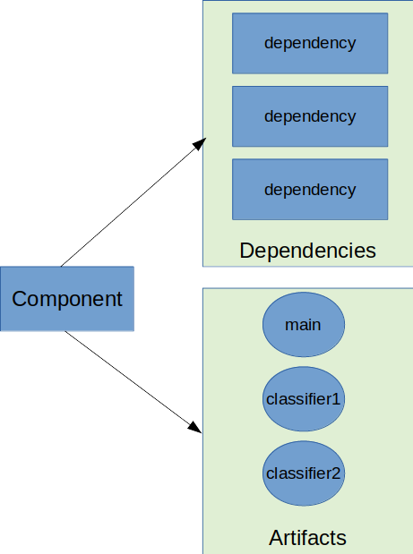
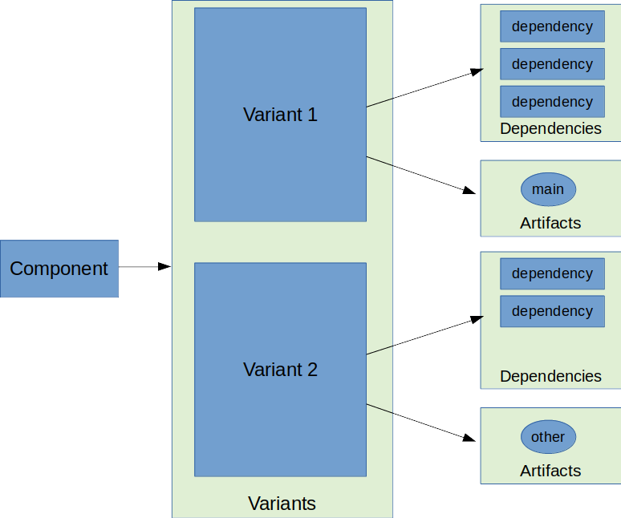

# 了解变体选择

内容

  * [配置和变量属性](#sec_abm_configuration_attributes)
  * [可视化变体信息](#sec_variant-visual)
  * [变体匹配](#sec_variant-aware-matching)
  * [变体选择错误](#sec_variant-select-errors)
  * [从Maven / Ivy映射到变体](#sec_mapping-maven-ivy-to-variants)

Gradle的依赖管理引擎称为 _变体感知_ 。在像Apache
Maven™这样的传统依赖管理引擎中，依赖关系被绑定到在GAV坐标处发布的组件。这意味着组件的传递依赖项集仅由该组件的GAV坐标确定。实际解决什么 _工件_
都没有关系，依赖关系的集合 _始终相同_ 。另外，为组件选择不同的工件（例如，使用`jdk7`工件）很麻烦，因为它需要使用 _分类器_
。该模型的一个问题是它不能保证全局图的一致性，因为没有通用的语义与 _分类器_
。这意味着没有什么可以阻止在类路径上同时使用单个模块的`jdk7`和`jdk8`版本，因为引擎不知道分类器名称与什么语义相关联。

图1. Maven组件模型

除了在GAV坐标处发布的 _模块_ 的概念外，Gradle还介绍了此模块的 _变体_
的概念。变体对应于在相同GAV坐标处发布的组件的不同“视图”。在Gradle模型中，工件被附加到 _变量_ 而不是模块。实际上，这意味着不同的 _工件_
可以具有不同的依赖关系集：

图2. Gradle组件模型

这个中间级别将工件和依赖项与变量关联，而不是直接与组件相关联，使Gradle可以正确地建模每个工件的用途。

但是，这引发了有关如何选择变体的问题：当存在多个变体时，Gradle如何知道要选择哪个变体？实际上，由于使用了[属性](/md/了解变体选择.md)，因此选择了变体，这些[属性](/md/了解变体选择.md)为变体提供了语义，并有助于引擎获得
_一致的解析结果_ 。

由于历史原因，Gradle区分两种组件：

  * 从源构建的本地组件，其[变体映射到传出配置](#sec_abm_configuration_attributes)

  * 外部组件，在存储库上发布，在这种情况下，该模块要么通过Gradle Module Metadata发布，并且本机支持变体，要么该模块使用Ivy / Maven元数据，而[变体则从元数据派生](#sec_mapping-maven-ivy-to-variants)。

在这两种情况下，Gradle都会执行 _变体感知选择_ 。

<h2 id = '#sec_abm_configuration_attributes'> <a href = '#sec_abm_configuration_attributes'>配置和变量属性</a> </h2>

本地组件将变体作为 _外发配置_
公开，这是[消耗性配置](/md/声明依赖.md#sec_resolvable-consumable-configs)。发生依赖关系解决方案时，引擎将通过选择其 _消耗品配置_ 之一来选择输出组件的一种变体。

╔═════════════════════════════  

此规则有2个明显的例外：

  * 只要制作者 _不_ 暴露任何消耗品配置

  * 每当使用者 _明确选择目标配置时_

在这种情况下， _绕过变体感知分辨率_ 。  
  
╚═════════════════════════════    
  
在 _可解析配置_ （也称为 _使用者_ ）和 _消耗性配置_ （在 _生产者_
）上都使用属性。将属性添加到其他类型的配置中根本没有效果，因为属性不会在配置之间继承。

依赖解析引擎的作用是寻找合适的 _变种_ a的 _生产商_ 给定一个表示的约束 _消费者_ 。

这就是属性发挥作用的地方：它们的作用是执行组件的正确 _变体_ 的选择。

╔═════════════════════════════  

变体与配置

对于外部组件，术语是使用“ _变体_ ”一词，而不是“ _配置_ ”一词。配置是变体的超集。

这意味着外部组件提供了 _variants_ ，它们也具有属性。但是，有时由于历史原因或由于您使用也具有这种 _配置_ 概念的Ivy，术语 _配置_
可能会泄漏到DSL中。 __  
  
╚═════════════════════════════    
  
<h2 id = '#sec_variant-visual'> <a href = '#sec_variant-visual'>可视化变体信息</a> </h2>

Gradle提供了一个名为Report的报告任务`outgoingVariants`，该任务显示项目的变体及其功能，属性和工件。从概念上讲，它类似于`dependencyInsight`
[报告任务](/md/查看和调试依赖项.md#sec_identifying_reason_dependency_selection)。

默认情况下，`outgoingVariants`打印有关所有变体的信息。它提供了可选参数`--variant
<variantName>`以选择要显示的单个变体。它还接受该`--all`标志以包含有关旧配置和不建议使用的配置的信息。

这是`outgoingVariants`新生成的`java-library`项目上的任务输出：

    
    
    > Task :outgoingVariants
    --------------------------------------------------
    Variant apiElements
    --------------------------------------------------
    Description = API elements for main.
    
    Capabilities
        - [default capability]
    Attributes
        - org.gradle.category            = library
        - org.gradle.dependency.bundling = external
        - org.gradle.jvm.version         = 8
        - org.gradle.libraryelements     = jar
        - org.gradle.usage               = java-api
    
    Artifacts
        - build/libs/variant-report.jar (artifactType = jar)
    
    Secondary variants (*)
        - Variant : classes
           - Attributes
              - org.gradle.category            = library
              - org.gradle.dependency.bundling = external
              - org.gradle.jvm.version         = 8
              - org.gradle.libraryelements     = classes
              - org.gradle.usage               = java-api
           - Artifacts
              - build/classes/java/main (artifactType = java-classes-directory)
    
    --------------------------------------------------
    Variant runtimeElements
    --------------------------------------------------
    Description = Elements of runtime for main.
    
    Capabilities
        - [default capability]
    Attributes
        - org.gradle.category            = library
        - org.gradle.dependency.bundling = external
        - org.gradle.jvm.version         = 8
        - org.gradle.libraryelements     = jar
        - org.gradle.usage               = java-runtime
    
    Artifacts
        - build/libs/variant-report.jar (artifactType = jar)
    
    Secondary variants (*)
        - Variant : classes
           - Attributes
              - org.gradle.category            = library
              - org.gradle.dependency.bundling = external
              - org.gradle.jvm.version         = 8
              - org.gradle.libraryelements     = classes
              - org.gradle.usage               = java-runtime
           - Artifacts
              - build/classes/java/main (artifactType = java-classes-directory)
        - Variant : resources
           - Attributes
              - org.gradle.category            = library
              - org.gradle.dependency.bundling = external
              - org.gradle.jvm.version         = 8
              - org.gradle.libraryelements     = resources
              - org.gradle.usage               = java-runtime
           - Artifacts
              - build/resources/main (artifactType = java-resources-directory)
    
    
    (*) Secondary variants are variants created via the Configuration#getOutgoing(): ConfigurationPublications API which also participate in selection, in addition to the configuration itself.
    
从中可以看到java库`apiElements`和公开的两个主要变体`runtimeElements`。请注意，主要区别在于`org.gradle.usage`属性上的值`java-
api`和`java-runtime`。正如他们所指出的，这是消费者的 _编译_ 类路径上需要的内容与 _运行时_ 类路径上需要的内容之间的区别。

它还显示了 _次级_
变体，这些变体是Gradle项目专有的，未发布。例如，`classes`from的第二个变体`apiElements`是让Gradle在针对[`java-library`project进行](/md/Java库插件.md#sec_java_library_classes_usage)编译时跳过JAR创建。

<h2 id = '#sec_variant-aware-matching'> <a href = '#sec_variant-aware-matching'>变体匹配</a> </h2>

让我们以一个`lib`库的示例为例，该库公开了2个变体：其API（通过名为的变体`exposedApi`）和运行时（通过名为的变体`exposedRuntime`）。

╔═════════════════════════════  

关于生产者变体

此处存在变体 _名称_ ，主要用于调试目的并在错误消息中获得更好的显示。特别是，名称不参与变体的 _ID_ ：只有其属性参与。也就是说，要搜索特定的变体，
_必须_ 依靠其属性 _而不是_ 其名称。

组件可以公开的变体数量没有限制。传统上，一个组件会公开一个API和一个实现，但是例如，我们可能也想公开一个组件的测试装置。也可以为不同的使用者提供
_不同的API_ （考虑一下不同的环境，例如Linux与Windows）。  
  
╚═════════════════════════════    
  
消费者需要解释它需要 _什么_ 变体，这是通过在 _消费者_ 上设置 _属性_ 来完成的。 __

属性由 _名称_ 和 _值_
对组成。例如，Gradle带有一个标准名称，该名称`org.gradle.usage`专门用于处理根据使用者的使用情况（编译，运行时...）选择组件的正确变体的概念。但是可以定义任意数量的属性。作为生产者，我们可以通过将`(org.gradle.usage,JAVA_API)`属性附加到变量来表示消耗性配置代表组件的API
。作为使用者，我们可以通过将`(org.gradle.usage,JAVA_API)`属性附加到可解析配置的依赖关系中来表达它。为此，Gradle可以通过查看配置属性来
_自动选择适当的变体_ ：

  * 消费者想要 `org.gradle.usage=JAVA_API`

  * 生产者，`lib`展示了2种不同的变体。一个带`org.gradle.usage=JAVA_API`，另一个带`org.gradle.usage=JAVA_RUNTIME`。

  * Gradle选择`org.gradle.usage=JAVA_API`生产者的变体，因为它 _与消费者属性匹配_

换句话说：属性用于根据属性的值执行选择。

一个更详细的示例涉及多个属性。通常，Gradle中的Java库项目将涉及4个不同的属性，在生产者和消费者方面都可以找到：

  * `org.gradle.usage`，说明变体是组件的API还是其实现

  * `org.gradle.dependency.bundling`，它声明如何捆绑组件的依赖项（例如，如果工件是一个胖子，那么捆绑是`EMBEDDED`）

  * `org.gradle.libraryelements`，用于说明变体包含库的哪些 _部分_ （类，资源或所有内容）

  * `org.gradle.jvm.version`，用于说明此变体针对的 _最低_ Java _版本_

现在，假设我们的库具有两种不同的风格：

  * 一个用于JDK 8

  * 一个用于JDK 9+

在Maven中，这通常是通过生成2种不同的工件（“主”工件和“分类”工件）来实现的。但是，在Maven中，使用者无法表达其需要基于运行时的 _最合适_
版本的库这一事实。

使用Gradle，可以通过让生产者声明两个变体来优雅地解决此问题：

  * 一个`org.gradle.jvm.version=8`， _至少在JDK 8上运行的用户_

  * 一个用`org.gradle.jvm.version=9`，为消费者从JDK 9开始

注意，这两个变体的工件会有所不同，但它们的依存关系 _也可能_ 会有所不同。通常，JDK 8变体可能需要JDK 9+的“反向端口”库才能起作用，只有在JDK
8上运行的使用者才能使用。

在使用者方面， _可解析配置_ 将在上面设置所有四个属性，并且根据运行时将其设置`org.gradle.jvm.version`为8或更多。

╔═════════════════════════════  

有关变体兼容性的说明

如果消费者设置`org.gradle.jvm.version`为7怎么办？

然后解析将 _失败，_ 并显示一条错误消息，说明生产者没有匹配的变体。这是因为Gradle认识到消费者需要Java 7兼容的库，但是生产者上可用的Java的
_最低_ 版本是8。如果另一方面，消费者需要 _11_ ，则Gradle知道 _8_ 和 _9_ 变体都会可以，但是它将选择 _9，_
因为它是最高兼容版本。  
  
╚═════════════════════════════    
  
<h2 id = '#sec_variant-select-errors'> <a href = '#sec_variant-select-errors'>变体选择错误</a> </h2>

在标识组件的正确变体的过程中，两种情况将导致分辨率错误：

  * 生产者的多个变体与消费者属性相匹配，存在变体歧义

  * 生产者的任何变体都不符合消费者的属性

<h3 id = '#sub_variant-ambiguity'> <a href = '#sub_variant-ambiguity'>处理模棱两可的变量选择错误</a> </h3>

模棱两可的变量选择看起来如下所示：

    
    
    > Could not resolve all files for configuration ':compileClasspath'.
       > Could not resolve project :lib.
         Required by:
             project :ui
          > Cannot choose between the following variants of project :lib:
              - feature1ApiElements
              - feature2ApiElements
            All of them match the consumer attributes:
              - Variant 'feature1ApiElements' capability org.test:test-capability:1.0:
                  - Unmatched attribute:
                      - Found org.gradle.category 'library' but wasn't required.
                  - Compatible attributes:
                      - Provides org.gradle.dependency.bundling 'external'
                      - Provides org.gradle.jvm.version '11'
                      - Required org.gradle.libraryelements 'classes' and found value 'jar'.
                      - Provides org.gradle.usage 'java-api'
              - Variant 'feature2ApiElements' capability org.test:test-capability:1.0:
                  - Unmatched attribute:
                      - Found org.gradle.category 'library' but wasn't required.
                  - Compatible attributes:
                      - Provides org.gradle.dependency.bundling 'external'
                      - Provides org.gradle.jvm.version '11'
                      - Required org.gradle.libraryelements 'classes' and found value 'jar'.
                      - Provides org.gradle.usage 'java-api'

可以看到，显示了所有 _兼容的_ 候选变体及其属性。然后将它们分为两个部分：

  * 首先介绍不匹配的属性，因为它们可能是选择适当变体时缺少的部分。

  * 其次显示兼容的属性，因为它们指示消费者想要什么以及这些变体如何匹配该请求。

不能有任何不匹配的属性，因为那时变体将不是候选者。同样，显示的变体集也排除了已消除歧义的变体。

在上面的示例中，解决方法不在于属性匹配，而在于[功能匹配](/md/处理互斥依赖性.md#sub:selecting-
between-
candidates)，该功能显示在变量名称旁边。因为这两个变体有效地提供了相同的属性和功能，所以它们不会被歧义。因此，在这种情况下，此修补程序最有可能在生产者端（`project
:lib`）提供不同的功能，并在消费者端（`project :ui`）表达功能的选择。

<h3 id = '#sub_variant-no-match'> <a href = '#sub_variant-no-match'>处理无匹配的变体错误</a> </h3>

没有匹配的变体错误看起来类似于以下内容：

    
    > No variants of project :lib match the consumer attributes:
      - Configuration ':lib:compile':
          - Incompatible attribute:
              - Required artifactType 'dll' and found incompatible value 'jar'.
          - Other compatible attribute:
              - Provides usage 'api'
      - Configuration ':lib:compile' variant debug:
          - Incompatible attribute:
              - Required artifactType 'dll' and found incompatible value 'jar'.
          - Other compatible attributes:
              - Found buildType 'debug' but wasn't required.
              - Provides usage 'api'
      - Configuration ':lib:compile' variant release:
          - Incompatible attribute:
              - Required artifactType 'dll' and found incompatible value 'jar'.
          - Other compatible attributes:
              - Found buildType 'release' but wasn't required.
              - Provides usage 'api'
可以看到，显示了 _所有_ 候选变体及其属性。然后将它们分为两个部分：

  * 首先介绍不兼容的属性，因为它们通常是理解为什么无法选择变体的关键。

  * 其次显示其他属性，其中包括 _必需的_ 和 _兼容_ 的属性，以及消费者不要求的所有其他 _生产者_ 属性。

与模棱两可的变量错误类似，目标是了解要选择哪个变量，并查看可以针对使用者调整哪些属性或功能以实现此目的。

<h2 id = '#sec_mapping-maven-ivy-to-variants'> <a href = '#sec_mapping-maven-ivy-to-variants'>从Maven /Ivy映射到变体</a> </h2>

既不的Maven也不Ivy具有的概念 _的变体_ ，其仅由本机模块Gradle元数据的支持。但是，由于不同的策略，它不会阻止Gradle与他们合作。

╔═════════════════════════════  

与Gradle模块元数据的关系

Gradle模块元数据是在Maven，Ivy或其他类型的存储库上发布的模块的元数据格式。它类似于`pom.xml`或`ivy.xml`文件，但是这种格式可以
_识别变体_ 。这意味着，如果您的项目产生其他变体，则这些变体将作为模块元数据的一部分提供并发布，从而极大地改善用户体验。

有关更多信息，请参见[Gradle模块元数据规范](https://github.com/gradle/gradle/blob/master/subprojects/docs/src/docs/design/gradle-module-metadata-latest-specification.md)。  
  
╚═════════════════════════════    
  
<h3 id = '#sub_maven-mapping-to-variants'> <a href = '#sub_maven-mapping-to-variants'>将POM文件映射到变体</a> </h3>

在Maven存储库中发布的模块将转换为可识别变体的模块。Maven模块的特殊之处在于，无法知道发布了哪种组件。特别是，无法在代表 _平台_
的BOM和用作超级POM的BOM之间进行区分。有时，POM文件甚至有可能同时充当平台 _和_ 库。

因此，Maven模块分为6个不同的变体，使Gradle用户可以准确地解释它们所依赖的内容：

  * 2个“库”变体（属性`org.gradle.category`= `library`）

    * 该`compile`变种映射的`<scope>compile</scope>`依赖关系。此变体等效于[Java库插件](/md/Java库插件.md)的`apiElements`变体。此范围的所有依赖项均被视为 _API依赖项_ 。 __

    * 该`runtime`变种都映射在`<scope>compile</scope>`和`<scope>runtime</scope>`依赖性。此变体等效于[Java库插件](/md/Java库插件.md)的`runtimeElements`变体。这些作用域的所有依赖关系都被视为 _运行时依赖关系_ 。 __

      * 在两种情况下，`<dependencyManagement>`依赖关系都 _不会转换为约束_

  * 从该`<dependencyManagement>`块派生的4个“平台”变体（属性`org.gradle.category`= `platform`）：

    * 该`platform-compile`变量将`<scope>compile</scope>`依赖管理依赖映射 为 _依赖约束_ 。

    * 该`platform-runtime`变体将`<scope>compile</scope>`和`<scope>runtime</scope>`依赖管理依赖都映射为 _依赖约束_ 。

    * 在`enforced-platform-compile`类似于`platform-compile`但所有的约束 _强制_

    * 在`enforced-platform-runtime`类似于`platform-runtime`但所有的约束 _强制_

通过查看手册的“[导入BOM表”](/md/在项目之间共享依赖版本.md#sub_bom_import)部分，您可以了解有关平台和强制平台变体用法的更多信息。默认情况下，每当您声明对Maven模块的依赖关系时，Gradle都会查找`library`变体。但是，使用`platform`or`enforcedPlatform`关键字，Gradle现在正在寻找“平台”变体之一，它允许您从POM文件中导入约束，而不是依赖关系。

<h3 id = '#sub_ivy-mapping-to-variants'> <a href = '#sub_ivy-mapping-to-variants'>将Ivy文件映射到变体</a> </h3>

与[Maven](#sub_maven-mapping-to-variants)相反，默认情况下没有为Ivy文件实现派生策略。这样做的原因是，与pom相反，Ivy是一种灵活的格式，允许您发布任意多个自定义 _配置_
。因此，通常在Ivy中没有编译/运行时范围或编译/运行时变体的概念。仅当您使用[Gravy发行版](/md/Ivy发布插件.md#publishing_ivy)的[ivy-publish插件](/md/Ivy发布插件.md#publishing_ivy)发布ivy文件时，您才能获得与pom文件类似的结构。但是，由于不能保证构建使用的
**所有** Ivy元数据文件都遵循此模式，因此Gradle无法基于该模式实施派生策略。

但是，如果要为Ivy的 _编译_ 和 _运行时_
变体实现派生策略，则可以使用[组件元数据rule来实现](/md/使用组件元数据规则修复元数据.md#sec:component_metadata_rules)。组件元数据规则API允许您[访问ivy配置](/md/使用组件元数据规则修复元数据.md#sec_component_metadata_rules_details)并基于它们创建变体。如果您知道您使用的所有ivy模块都已通过Gradle发布，而无需对该`ivy.xml`文件进行进一步的自定义，则可以在构建中添加以下规则：

例子1.派生Ivy元数据的编译和运行时变体

`Groovy``Kotlin`

build.gradle

    
    
    class IvyVariantDerivationRule implements ComponentMetadataRule {
        @Inject ObjectFactory getObjects() { }
    
        void execute(ComponentMetadataContext context) {
            // This filters out any non Ivy module
            if(context.getDescriptor(IvyModuleDescriptor) == null) {
                return
            }
    
            context.details.addVariant("runtimeElements", "default") {
                attributes {
                    attribute(LibraryElements.LIBRARY_ELEMENTS_ATTRIBUTE, getObjects().named(LibraryElements, LibraryElements.JAR))
                    attribute(Category.CATEGORY_ATTRIBUTE, getObjects().named(Category, Category.LIBRARY))
                    attribute(Usage.USAGE_ATTRIBUTE, getObjects().named(Usage, Usage.JAVA_RUNTIME))
                }
            }
            context.details.addVariant("apiElements", "compile") {
                attributes {
                    attribute(LibraryElements.LIBRARY_ELEMENTS_ATTRIBUTE, getObjects().named(LibraryElements, LibraryElements.JAR))
                    attribute(Category.CATEGORY_ATTRIBUTE, getObjects().named(Category, Category.LIBRARY))
                    attribute(Usage.USAGE_ATTRIBUTE, getObjects().named(Usage, Usage.JAVA_API))
                }
            }
        }
    }
    
    dependencies {
        components { all(IvyVariantDerivationRule) }
    }

build.gradle.kts

    
    
    open class IvyVariantDerivationRule : ComponentMetadataRule {
        @Inject open fun getObjects(): ObjectFactory = throw UnsupportedOperationException()
    
        override fun execute(context: ComponentMetadataContext) {
            // This filters out any non Ivy module
            if(context.getDescriptor(IvyModuleDescriptor::class) == null) {
                return
            }
    
            context.details.addVariant("runtimeElements", "default") {
                attributes {
                    attribute(LibraryElements.LIBRARY_ELEMENTS_ATTRIBUTE, getObjects().named(LibraryElements.JAR))
                    attribute(Category.CATEGORY_ATTRIBUTE, getObjects().named(Category.LIBRARY))
                    attribute(Usage.USAGE_ATTRIBUTE, getObjects().named(Usage.JAVA_RUNTIME))
                }
            }
            context.details.addVariant("apiElements", "compile") {
                attributes {
                    attribute(LibraryElements.LIBRARY_ELEMENTS_ATTRIBUTE, getObjects().named(LibraryElements.JAR))
                    attribute(Category.CATEGORY_ATTRIBUTE, getObjects().named(Category.LIBRARY))
                    attribute(Usage.USAGE_ATTRIBUTE, getObjects().named(Usage.JAVA_API))
                }
            }
        }
    }
    
    dependencies {
        components { all<IvyVariantDerivationRule>() }
    }

该规则`apiElements`基于每个Ivy模块的配置创建一个变量，并基于`compile`配置创建变量。对于每个变体，它设置相应的[Java生态系统属性](#sec_variant-aware-matching)。变体的依赖关系和工件来自基础配置。如果不是所有消耗的Ivy模块都遵循此模式，则可以调整规则或仅将规则应用于选定的一组模块。`runtimeElements``default`

对于没有体都Ivy模块，Gradle回落到原有配置选择（即Gradle并 _没有_
执行这些模块的变体意识到分辨率）。这意味着将选择`default`配置或在对相应模块的依赖性中显式定义的配置。（请注意，只能从构建脚本或Ivy元数据中进行显式配置选择，应避免选择变体。）

