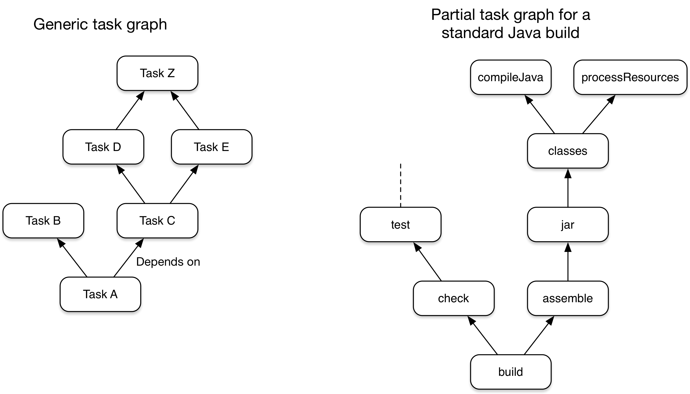

[ Gradle ](https://docs.gradle.org "Gradle Docs")

User Manual

  * Community Open Community Menu

[ Community Home ](https://gradle.org/)

[ Community Forums ](https://discuss.gradle.org/)

[ Community Plugins ](https://plugins.gradle.org)

  * [Training](https://gradle.com/training/)
  * News Open Community Menu

[ Newsletter ](https://newsletter.gradle.com)

[ Blog ](https://blog.gradle.org)

[ Twitter ](https://twitter.com/gradle)

  * [Enterprise](https://gradle.com)
  * [github](https://github.com/gradle/gradle "Gradle on GitHub")

  * [Docs Home](../userguide/userguide.html)
  * [Samples](../samples/index.html)
  * [Release Notes](../release-notes.html)
  * Gradle API
    * [Javadoc](../javadoc/index.html?overview-summary.html)
    * [Groovy DSL Reference](../dsl/index.html)
    * [Groovy DSL Primer](../userguide/groovy_build_script_primer.html)
    * [Kotlin DSL API](https://gradle.github.io/kotlin-dsl-docs/api/)
    * [Kotlin DSL Primer](../userguide/kotlin_dsl.html)

### User Manual

[ PDF ](../userguide/userguide.pdf)

  * [What is Gradle?](../userguide/what_is_gradle.html)
  * [Getting Started](../userguide/getting_started.html)
  * [Installing Gradle](../userguide/installation.html)
  * Upgrading Gradle...
    * [version 6.X to latest](../userguide/upgrading_version_6.html)
    * [version 5.X to 6.0](../userguide/upgrading_version_5.html)
    * [version 4.X to 5.0](../userguide/upgrading_version_4.html)
    * [Gradle's Feature Lifecycle](../userguide/feature_lifecycle.html)
  * Migrating to Gradle...
    * [from Maven](../userguide/migrating_from_maven.html)
    * [from Ant](../userguide/migrating_from_ant.html)
  * [Compatibility Notes](../userguide/compatibility.html)
  * [Troubleshooting Builds](../userguide/troubleshooting.html)

### Running Gradle Builds

  * Customizing Execution
    * [Configuring the Build Environment](../userguide/build_environment.html)
    * [Configuring the Gradle Daemon](../userguide/gradle_daemon.html)
    * [Using Initialization Scripts](../userguide/init_scripts.html)
  * [Executing Multi-Project Builds](../userguide/intro_multi_project_builds.html)
  * [Inspecting Gradle Builds](https://scans.gradle.com/)
  * Optimizing Build Times
    * [Build Performance Guide](https://guides.gradle.org/performance/)
    * [Enabling and Configuring the Build Cache](../userguide/build_cache.html)
    * [Using the Configuration Cache](../userguide/configuration_cache.html)

### Authoring Gradle Builds

  * Learning the Basics
    * [Introducing the Basics of Build Scripts](../userguide/tutorial_using_tasks.html)
    * [Working with Tasks](../userguide/more_about_tasks.html)
    * [Learning More About Build Scripts](../userguide/writing_build_scripts.html)
    * [Working with Files](../userguide/working_with_files.html)
    * [Using Gradle Plugins](../userguide/plugins.html)
    * [Understanding the Build Lifecycle](../userguide/build_lifecycle.html)
    * [Working with Logging](../userguide/logging.html)
    * [Avoiding Traps](../userguide/potential_traps.html)
  * Authoring Multi-Project Builds
    * [Creating a Basic Multi-Project Build](../userguide/multi_project_builds.html)
    * [Declaring Dependencies between Subprojects](../userguide/declaring_dependencies_between_subprojects.html)
    * [Sharing Build Logic between Subprojects](../userguide/sharing_build_logic_between_subprojects.html)
    * [Fine Tuning the Project Layout](../userguide/fine_tuning_project_layout.html)
    * [Understanding Configuration and Execution](../userguide/multi_project_configuration_and_execution.html)
  * Authoring Sustainable Builds
    * [Organizing Build Logic](../userguide/organizing_gradle_projects.html)
    * [Following Best Practices](../userguide/authoring_maintainable_build_scripts.html)
  * Advanced Techniques
    * [Developing Parallel Tasks](https://guides.gradle.org/using-the-worker-api/)
    * [Testing a Build with TestKit](../userguide/test_kit.html)
    * [Using Ant from Gradle](../userguide/ant.html)

### Authoring JVM Builds

  * [Building Java & JVM projects](../userguide/building_java_projects.html)
  * [Testing Java & JVM projects](../userguide/java_testing.html)
  * [Toolchains for Java projects](../userguide/toolchains.html)
  * [Managing Dependencies](../userguide/dependency_management_for_java_projects.html)
  * JVM Plugins
    * [Java Library Plugin](../userguide/java_library_plugin.html)
    * [Java Application Plugin](../userguide/application_plugin.html)
    * [Java Platform Plugin](../userguide/java_platform_plugin.html)
    * [Groovy Plugin](../userguide/groovy_plugin.html)
    * [Scala Plugin](../userguide/scala_plugin.html)

### Authoring C++/Swift Builds

  * [Building C++ projects](../userguide/building_cpp_projects.html)
  * [Testing C++ projects](../userguide/cpp_testing.html)
  * [Building Swift projects](../userguide/building_swift_projects.html)
  * [Testing Swift projects](../userguide/swift_testing.html)

### Working with Dependencies

  * Learning the Basics
    * [What is Dependency Management?](../userguide/core_dependency_management.html)
    * [Declaring Repositories](../userguide/declaring_repositories.html)
    * [Declaring Dependencies](../userguide/declaring_dependencies.html)
    * [Understanding Library and Application Differences](../userguide/library_vs_application.html)
    * [Viewing and Debugging Dependencies](../userguide/viewing_debugging_dependencies.html)
    * [Understanding Resolution](../userguide/dependency_resolution.html)
    * [Verifying dependencies](../userguide/dependency_verification.html)
  * Declaring Versions
    * [Declaring Versions and Ranges](../userguide/single_versions.html)
    * [Declaring Rich Versions](../userguide/rich_versions.html)
    * [Handling Changing Versions](../userguide/dynamic_versions.html)
    * [Locking Versions](../userguide/dependency_locking.html)
  * Controlling Transitives
    * [Upgrading Versions](../userguide/dependency_constraints.html)
    * [Downgrading and Excluding](../userguide/dependency_downgrade_and_exclude.html)
    * [Sharing Versions](../userguide/platforms.html)
    * [Aligning Dependencies](../userguide/dependency_version_alignment.html)
    * [Handling Mutually Exclusive Dependencies](../userguide/dependency_capability_conflict.html)
    * [Fixing Metadata](../userguide/component_metadata_rules.html)
    * [Customizing Resolution](../userguide/resolution_rules.html)
    * [Preventing accidental upgrades](../userguide/resolution_strategy_tuning.html)
  * Producing and Consuming Variants of Libraries
    * [Declaring Capabilities of a Library](../userguide/component_capabilities.html)
    * [Modeling Feature Variants and Optional Dependencies](../userguide/feature_variants.html)
    * [Understanding Variant Selection](../userguide/variant_model.html)
    * [Declaring Variant Attributes](../userguide/variant_attributes.html)
    * [Sharing Outputs of Projects](../userguide/cross_project_publications.html)
    * [Transforming Artifacts](../userguide/artifact_transforms.html)
  * Working in a Multi-repo Environment
    * [Composing Builds](../userguide/composite_builds.html)
  * Publishing Libraries
    * [Setting up Publishing](../userguide/publishing_setup.html)
    * [Understanding Gradle Module Metadata](../userguide/publishing_gradle_module_metadata.html)
    * [Signing Artifacts](../userguide/publishing_signing.html)
    * [Customizing Publishing](../userguide/publishing_customization.html)
    * [Maven Publish Plugin](../userguide/publishing_maven.html)
    * [Ivy Publish Plugin](../userguide/publishing_ivy.html)
  * [Terminology](../userguide/dependency_management_terminology.html)

### Extending Gradle

  * [Plugin Development Tutorials](https://gradle.org/guides/?q=Plugin%20Development)
  * [Writing Gradle Task Types](../userguide/custom_tasks.html)
  * [Writing Gradle Plugins](../userguide/custom_plugins.html)
  * [Writing Custom Gradle Types](../userguide/custom_gradle_types.html)
  * [Configuring Tasks Lazily](../userguide/lazy_configuration.html)
  * [Using Task Configuration Avoidance](../userguide/task_configuration_avoidance.html)

### Reference

  * [Core Plugins](../userguide/plugin_reference.html)
  * [Command-Line Interface](../userguide/command_line_interface.html)
  * [Gradle & Third-party Tools](../userguide/third_party_integration.html)
  * [The Gradle Wrapper](../userguide/gradle_wrapper.html)
  * [Gradle-managed Directories](../userguide/directory_layout.html)

# What is Gradle?

version 6.7.1

Contents

  * Overview
  * Five things you need to know about Gradle

## Overview

Gradle is an open-source [build
automation](https://en.wikipedia.org/wiki/Build_automation) tool that is
designed to be flexible enough to build almost any type of software. The
following is a high-level overview of some of its most important features:

High performance

    

Gradle avoids unnecessary work by only running the tasks that need to run
because their inputs or outputs have changed. You can also use a build cache
to enable the reuse of task outputs from previous runs or even from a
different machine (with a shared build cache).

There are many other optimizations that Gradle implements and the development
team continually work to improve Gradle's performance.

JVM foundation

    

Gradle runs on the JVM and you must have a Java Development Kit (JDK)
installed to use it. This is a bonus for users familiar with the Java platform
as you can use the standard Java APIs in your build logic, such as custom task
types and plugins. It also makes it easy to run Gradle on different platforms.

Note that Gradle isn't limited to building just JVM projects, and it even
comes packaged with support for building native projects.

Conventions

    

Gradle takes a leaf out of Maven's book and makes common types of projects —
such as Java projects — easy to build by implementing conventions. Apply the
appropriate plugins and you can easily end up with slim build scripts for many
projects. But these conventions don't limit you: Gradle allows you to override
them, add your own tasks, and make many other customizations to your
convention-based builds.

Extensibility

    

You can readily extend Gradle to provide your own task types or even build
model. See the Android build support for an example of this: it adds many new
build concepts such as flavors and build types.

IDE support

    

Several major IDEs allow you to import Gradle builds and interact with them:
Android Studio, IntelliJ IDEA, Eclipse, and NetBeans. Gradle also has support
for generating the solution files required to load a project into Visual
Studio.

Insight

    

[Build scans](https://scans.gradle.com/) provide extensive information about a
build run that you can use to identify build issues. They are particularly
good at helping you to identify problems with a build's performance. You can
also share build scans with others, which is particularly useful if you need
to ask for advice in fixing an issue with the build.

## Five things you need to know about Gradle

Gradle is a flexible and powerful build tool that can easily feel intimidating
when you first start. However, understanding the following core principles
will make Gradle much more approachable and you will become adept with the
tool before you know it.

### 1\. Gradle is a general-purpose build tool

Gradle allows you to build any software, because it makes few assumptions
about what you're trying to build or how it should be done. The most notable
restriction is that dependency management currently only supports Maven- and
Ivy-compatible repositories and the filesystem.

This doesn't mean you have to do a lot of work to create a build. Gradle makes
it easy to build common types of project — say Java libraries — by adding a
layer of conventions and prebuilt functionality through
[_plugins_](plugins.html#plugins). You can even create and publish custom
plugins to encapsulate your own conventions and build functionality.

### 2\. The core model is based on tasks

Gradle models its builds as Directed Acyclic Graphs (DAGs) of tasks (units of
work). What this means is that a build essentially configures a set of tasks
and wires them together — based on their dependencies — to create that DAG.
Once the task graph has been created, Gradle determines which tasks need to be
run in which order and then proceeds to execute them.

This diagram shows two example task graphs, one abstract and the other
concrete, with the dependencies between the tasks represented as arrows:

Figure 1. Two examples of Gradle task graphs

Almost any build process can be modeled as a graph of tasks in this way, which
is one of the reasons why Gradle is so flexible. And that task graph can be
defined by both plugins and your own build scripts, with tasks linked together
via the [task dependency
mechanism](tutorial_using_tasks.html#sec:task_dependencies).

Tasks themselves consist of:

  * Actions — pieces of work that do something, like copy files or compile source

  * Inputs — values, files and directories that the actions use or operate on

  * Outputs — files and directories that the actions modify or generate

In fact, all of the above are optional depending on what the task needs to do.
Some tasks — such as the [standard lifecycle
tasks](base_plugin.html#sec:base_tasks) — don't even have any actions. They
simply aggregate multiple tasks together as a convenience.

__ |  You choose which task to run. Save time by specifying the task that does
what you need, but no more than that. If you just want to run the unit tests,
choose the task that does that — typically `test`. If you want to package an
application, most builds have an `assemble` task for that.  
---|---  
  
One last thing: Gradle's [incremental
build](more_about_tasks.html#sec:up_to_date_checks) support is robust and
reliable, so keep your builds running fast by avoiding the `clean` task unless
you actually do want to perform a clean.

### 3\. Gradle has several fixed build phases

It's important to understand that Gradle evaluates and executes build scripts
in three phases:

  1. Initialization

Sets up the environment for the build and determine which projects will take
part in it.

  2. Configuration

Constructs and configures the task graph for the build and then determines
which tasks need to run and in which order, based on the task the user wants
to run.

  3. Execution

Runs the tasks selected at the end of the configuration phase.

These phases form Gradle's [Build
Lifecycle](build_lifecycle.html#build_lifecycle).

__ |

Comparison to Apache Maven terminology

Gradle's build phases are not like Maven's phases. Maven uses its phases to
divide the build execution into multiple stages. They serve a similar role to
Gradle's task graph, although less flexibly.

Maven's concept of a build lifecycle is loosely similar to Gradle's [lifecycle
tasks](base_plugin.html#sec:base_tasks).  
  
---|---  
  
Well-designed build scripts consist mostly of [declarative configuration
rather than imperative
logic](authoring_maintainable_build_scripts.html#sec:avoid_imperative_logic_in_scripts).
That configuration is understandably evaluated during the configuration phase.
Even so, many such builds also have task actions — for example via `doLast {}`
and `doFirst {}` blocks — which are evaluated during the execution phase. This
is important because code evaluated during the configuration phase won't see
changes that happen during the execution phase.

Another important aspect of the configuration phase is that everything
involved in it is evaluated _every time the build runs_. That is why it's best
practice to [avoid expensive work during the configuration
phase](authoring_maintainable_build_scripts.html#sec:minimize_logic_executed_configuration_phase).
[Build scans](https://scans.gradle.com/) can help you identify such hotspots,
among other things.

### 4\. Gradle is extensible in more ways than one

It would be great if you could build your project using only the build logic
bundled with Gradle, but that's rarely possible. Most builds have some special
requirements that mean you need to add custom build logic.

Gradle provides several mechanisms that allow you to extend it, such as:

  * [Custom task types](custom_tasks.html).

When you want the build to do some work that an existing task can't do, you
can simply write your own task type. It's typically best to put the source
file for a custom task type in the
[_buildSrc_](organizing_gradle_projects.html#sec:build_sources) directory or
in a packaged plugin. Then you can use the custom task type just like any of
the Gradle-provided ones.

  * Custom task actions.

You can attach custom build logic that executes before or after a task via the
[Task.doFirst()](../dsl/org.gradle.api.Task.html#org.gradle.api.Task:doFirst\(org.gradle.api.Action\))
and
[Task.doLast()](../dsl/org.gradle.api.Task.html#org.gradle.api.Task:doLast\(org.gradle.api.Action\))
methods.

  * [Extra properties](writing_build_scripts.html#sec:extra_properties) on projects and tasks.

These allows you to add your own properties to a project or task that you can
then use from your own custom actions or any other build logic. Extra
properties can even be applied to tasks that aren't explicitly created by you,
such as those created by Gradle's core plugins.

  * Custom conventions.

Conventions are a powerful way to simplify builds so that users can understand
and use them more easily. This can be seen with builds that use standard
project structures and naming conventions, such as [Java
builds](building_java_projects.html#building_java_projects). You can write
your own plugins that provide conventions — they just need to configure
default values for the relevant aspects of a build.

  * [A custom model](https://guides.gradle.org/implementing-gradle-plugins/#modeling_dsl_like_apis).

Gradle allows you to introduce new concepts into a build beyond tasks, files
and dependency configurations. You can see this with most language plugins,
which add the concept of [_source
sets_](building_java_projects.html#sec:java_source_sets) to a build.
Appropriate modeling of a build process can greatly improve a build's ease of
use and its efficiency.

### 5\. Build scripts operate against an API

It's easy to view Gradle's build scripts as executable code, because that's
what they are. But that's an implementation detail: well-designed build
scripts describe _what_ steps are needed to build the software, not _how_
those steps should do the work. That's a job for custom task types and
plugins.

__ |

There is a common misconception that Gradle's power and flexibility come from
the fact that its build scripts are code. This couldn't be further from the
truth. It's the underlying model and API that provide the power. As we
recommend in our best practices, you should [avoid putting much, if any,
imperative logic in your build
scripts](authoring_maintainable_build_scripts.html#sec:avoid_imperative_logic_in_scripts).  
  
---|---  
  
Yet there is one area in which it is useful to view a build script as
executable code: in understanding how the syntax of the build script maps to
Gradle's API. The API documentation — formed of the [Groovy DSL
Reference](../dsl/) and the [Javadocs](../javadoc/) — lists methods and
properties, and refers to closures and actions. What do these mean within the
context of a build script? Check out the [Groovy Build Script
Primer](groovy_build_script_primer.html#groovy_build_script_primer) to learn
the answer to that question so that you can make effective use of the API
documentation.

__ |  As Gradle runs on the JVM, build scripts can also use the standard [Java
API](https://docs.oracle.com/javase/8/docs/api). Groovy build scripts can
additionally use the Groovy APIs, while Kotlin build scripts can use the
Kotlin ones.  
---|---  
  
**Docs**

  * [User Manual](/userguide/userguide.html)
  * [DSL Reference](/dsl/)
  * [Release Notes](/release-notes.html)
  * [Javadoc](/javadoc/)

**News**

  * [Blog](https://blog.gradle.org/)
  * [Newsletter](https://newsletter.gradle.com/)
  * [Twitter](https://twitter.com/gradle)
  * [Status Page](https://status.gradle.com/)

**Products**

  * [Build Scans](https://gradle.com/build-scans/)
  * [Build Cache](https://gradle.com/build-cache/)
  * [Enterprise Docs](https://gradle.com/enterprise/resources/)

**Get Help**

  * [Forums](https://discuss.gradle.org/c/help-discuss)
  * [GitHub](https://github.com/gradle/)
  * [Training](https://gradle.com/training/)
  * [Services](https://gradle.org/services/)

##### Stay `UP-TO-DATE` on new features and news

By entering your email, you agree to our
[Terms](https://gradle.com/legal/terms-of-service/) and [Privacy
Policy](https://gradle.com/legal/privacy/), including receipt of emails. You
can unsubscribe at any time.

Subscribe

© [Gradle Inc.](https://gradle.com) 2020 All rights reserved.

[ gradle ](/)

[Careers](https://gradle.com/careers/) |
[Privacy](https://gradle.com/legal/privacy/) | [Terms of
Service](https://gradle.com/legal/terms-of-service/) |
[Contact](https://gradle.org/contact/)

