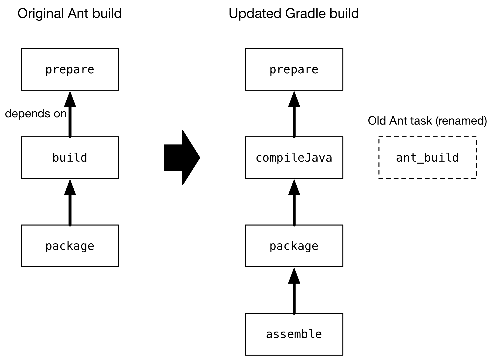

# 从Apache Ant迁移构建

version 6.7.1

内容

  * [一般准则](#%E4%B8%80%E8%88%AC%E5%87%86%E5%88%99)
  * [使用导入的版本](#%E4%BD%BF%E7%94%A8%E5%AF%BC%E5%85%A5%E7%9A%84%E7%89%88%E6%9C%AC)
  * [管理依赖](#%E7%AE%A1%E7%90%86%E4%BE%9D%E8%B5%96)
  * [发布工件](#%E5%8F%91%E5%B8%83%E5%B7%A5%E4%BB%B6)
  * [处理自定义Ant任务](#%E5%A4%84%E7%90%86%E8%87%AA%E5%AE%9A%E4%B9%89Ant%E4%BB%BB%E5%8A%A1)
  * [处理文件](#%E5%A4%84%E7%90%86%E6%96%87%E4%BB%B6)
  * [迁移Ant属性](#%E8%BF%81%E7%A7%BBAnt%E5%B1%9E%E6%80%A7)
  * [迁移多项目构建](#%E8%BF%81%E7%A7%BB%E5%A4%9A%E9%A1%B9%E7%9B%AE%E6%9E%84%E5%BB%BA)
  * [进一步阅读](#%E8%BF%9B%E4%B8%80%E6%AD%A5%E9%98%85%E8%AF%BB)

[Apache Ant](https://ant.apache.org/)是一个在Java世界中具有悠久历史的构建工具，尽管使用的团队越来越少，但它仍被广泛使用。虽然灵活，但缺少约定和Gradle可以提供的许多强大功能。迁移到Gradle是值得的，因此您的构建可以变得更苗条，更简单和更快，同时仍保留您使用Ant所享有的灵活性。您还将受益于对多项目构建的强大支持以及易于使用的灵活依赖管理。

从Ant迁移到Gradle的最大挑战是，没有标准的Ant构建之类的东西。这使得很难提供具体说明。幸运的是，Gradle具有与Ant的强大集成功能，可以使过程相对平稳。甚至从基于[Ivy](https://ant.apache.org/ivy/)的依赖项管理迁移也不是特别困难，因为Gradle具有基于[依赖项配置](/md/%E4%BE%9D%E8%B5%96%E7%AE%A1%E7%90%86%E6%9C%AF%E8%AF%AD.md%23%E9%85%8D%E7%BD%AE%EF%BC%88configuration%EF%BC%89)的类似模型，该模型可与Ivy兼容的存储库一起使用。

我们将首先概述在将构建从Ant迁移到Gradle时应考虑的事项，并提供一些有关如何进行的一般指导。

## [一般准则](#%E4%B8%80%E8%88%AC%E5%87%86%E5%88%99)

当您承诺将构建从Ant迁移到Gradle时，应牢记既有内容又要在何处结束的性质。您是否需要Gradle构建来反映现有Ant构建的结构？还是您想改用Gradle惯用的方法？您正在寻找的主要好处是什么？

要了解其含义，请考虑您可以针对的两个极端端点：

  * 通过导入的构建 [`ant.importBuild()`](/md/%E4%BB%8EGradle%E4%BD%BF%E7%94%A8Ant.md%23%E5%AF%BC%E5%85%A5Ant%E6%9E%84%E5%BB%BA)

这种方法快速，简单，并且适用于许多基于Ant的构建。您最终得到的构建实际上与原始Ant构建相同，不同的是，您的Ant目标变成了Gradle任务。甚至保留了目标之间的依赖关系。

缺点是您仍在使用Ant构建，必须继续对其进行维护。您还将失去Gradle约定，许多插件，依赖管理等优点。您仍然可以使用[增量构建信息](/md/%E5%A4%84%E7%90%86%E4%BB%BB%E5%8A%A1.md%23%E6%9C%80%E6%96%B0%E6%A3%80%E6%9F%A5%EF%BC%88%E5%8F%88%E7%A7%B0%E5%A2%9E%E9%87%8F%E6%9E%84%E5%BB%BA%EF%BC%89)来增强构建，但是比正常的Gradle构建要付出更多的努力。

  * 惯用的Gradle构建

如果您想将来对构建进行验证，那么这里就是您要结束的地方。利用Gradle的约定和插件将导致更小，更易于维护的构建，其结构对于许多Java开发人员来说都是熟悉的。您还将发现更容易利用Gradle的强大功能来提高构建性能。

主要缺点是执行迁移所需的额外工作，尤其是在现有构建很复杂且具有许多项目间依赖关系的情况下。但是，这种构建通常会从转向idomatic
Gradle的过程中受益最多。另外，Gradle提供了许多可以简化迁移的功能，例如直接从Gradle构建中[使用核心和自定义Ant任务的功能](/md/%E4%BB%8EGradle%E4%BD%BF%E7%94%A8Ant.md%23%E5%9C%A8%E6%9E%84%E5%BB%BA%E4%B8%AD%E4%BD%BF%E7%94%A8Ant%E4%BB%BB%E5%8A%A1%E5%92%8C%E7%B1%BB%E5%9E%8B)。

从长远来看，理想情况下，您希望最终接近第二种选择，但是您不必一蹴而就。

接下来是一系列步骤，可帮助您确定要采用的方法以及如何执行该方法：

  1. 并排保留旧的Ant构建和新的Gradle构建

您知道Ant构建是可行的，因此您应该保留它，直到您确信Gradle构建会生成所有相同的工件，然后再做您需要的事情。这也意味着用户无需获取源树的新副本即可尝试Gradle构建。

在准备好进行切换之前，请勿尝试更改构建的目录和文件结构。

  2. 开发一种机制来验证两个构建产生相同的工件

这是确保您的部署和测试不中断的至关重要的一步。即使是很小的更改，例如JAR中清单文件的内容，也会引起问题。如果您的Gradle构建产生与Ant构建相同的输出，这将使您和其他人对切换充满信心，并使更容易实施将带来最大收益的重大更改。

  3. 确定您是否具有多项目构建

与单项目构建相比，多项目构建通常更难迁移且需要更多的工作。我们在[迁移多项目构建](#%E8%BF%81%E7%A7%BB%E5%A4%9A%E9%A1%B9%E7%9B%AE%E6%9E%84%E5%BB%BA)部分中提供了一些专用的建议，以帮助完成该过程。

  4. 找出每个项目要使用哪些插件

我们期望绝大多数的Ant构建都是基于[JVM的项目](/md/构建Java和JVM项目.md#building_java_projects)，为此，有大量的插件可提供您所需的许多功能。Gradle不仅随附了[核心插件](/md/插件参考.md#plugin_reference)，您还可以在[Plugin
Portal](https://plugins.gradle.org/)上找到许多有用的[插件](https://plugins.gradle.org/)。

即使[Java插件](https://docs.gradle.org/6.7.1/userguide/java_plugin.html#java_plugin)或其派生工具之一（例如[Java库插件](/md/Java库插件.md#java_library_plugin)）与您的构建不是很好的匹配，您也应至少考虑将其生命周期任务视为[基础插件](https://docs.gradle.org/6.7.1/userguide/base_plugin.html#base_plugin)。

  5. 导入Ant构建或从头开始创建Gradle构建

此步骤很大程度上取决于构建的要求。如果精选的Gradle插件可以完成您的Ant构建所做的大部分工作，那么创建一个不依赖于Ant构建的新鲜Gradle构建脚本可能是有意义的，或者自己实现缺少的部分或[利用现有的部分Ant任务](/md/%E4%BB%8EGradle%E4%BD%BF%E7%94%A8Ant.md%23%E5%9C%A8%E6%9E%84%E5%BB%BA%E4%B8%AD%E4%BD%BF%E7%94%A8Ant%E4%BB%BB%E5%8A%A1%E5%92%8C%E7%B1%BB%E5%9E%8B)。

另一种方法是[将Ant构建](/md/%E4%BB%8EGradle%E4%BD%BF%E7%94%A8Ant.md%23%E5%AF%BC%E5%85%A5Ant%E6%9E%84%E5%BB%BA)导入到Gradle构建脚本中，并逐步替换Ant构建功能。这样可以使您在每个阶段都有一个有效的Gradle构建，但是要使Gradle任务与Ant任务一起正常工作还需要一些工作。您可以在[使用导入的版本中](#%E4%BD%BF%E7%94%A8%E5%AF%BC%E5%85%A5%E7%9A%84%E7%89%88%E6%9C%AC)了解有关此方法的更多信息。

  6. 为现有目录和文件结构配置构建

Gradle利用约定来消除与旧版本相关联的许多样板，并使用户一旦熟悉这些约定，就可以更轻松地使用新版本。但这并不意味着您必须遵循它们。

Gradle提供了许多配置选项，可以实现高度的自定义。这些选项通常可以通过提供约定的插件来使用。例如，`src/main/java`Java插件提供了用于生产Java代码的标准源目录结构
，它允许您[配置其他源路径](/md/%E6%9E%84%E5%BB%BAJava%E5%92%8CJVM%E9%A1%B9%E7%9B%AE.md%23%E8%87%AA%E5%AE%9A%E4%B9%89%E6%96%87%E4%BB%B6%E5%92%8C%E7%9B%AE%E5%BD%95%E4%BD%8D%E7%BD%AE)。可以通过[Project](https://docs.gradle.org/6.7.1/dsl/org.gradle.api.Project.html)对象上的属性修改许多路径。

  7. 如果愿意，可以迁移到标准Gradle约定

一旦确信Gradle构建会产生与Ant构建相同的工件和其他资源，就可以考虑迁移到标准约定，例如源目录路径。这样做将允许您删除覆盖这些约定所需的额外配置。新的团队成员还将发现更改后更容易使用构建。

由您决定此步骤是否值得花费时间，精力和可能造成的潜在中断，而这又取决于您的特定构建和团队。

本章的其余部分介绍了您在迁移期间可能要处理的一些常见方案，例如依赖关系管理和使用Ant任务。

## [使用导入的版本](#%E4%BD%BF%E7%94%A8%E5%AF%BC%E5%85%A5%E7%9A%84%E7%89%88%E6%9C%AC)

许多迁移的第一步将[导入一个Ant build](/md/%E4%BB%8EGradle%E4%BD%BF%E7%94%A8Ant.md%23%E5%AF%BC%E5%85%A5Ant%E6%9E%84%E5%BB%BA)使用`ant.importBuild()`。如果这样做，那么如何在不立即替换所有内容的情况下过渡到标准Gradle构建？

要记住的重要一点是，Ant目标变成了真正的Gradle任务，这意味着您可以执行诸如修改其任务依赖性，附加额外的任务动作等操作。这样，您就可以用本地Gradle任务替代等效的Ant任务，并保持与其他现有任务的任何链接。

例如，假设您有一个Java库项目要从Ant迁移到Gradle。Gradle构建脚本中包含导入Ant构建的行，现在想使用标准Gradle机制来编译Java源文件。但是，您想继续使用`package`创建库的JAR文件的现有任务。

以示意图的形式，场景如下所示，其中每个框代表一个目标/任务：

这个想法是用标准Gradle`compileJava`任务代替Ant`build`任务。此替换涉及几个步骤：

  1. 应用[Java库插件](/md/Java库插件.md#java_library_plugin)

这提供了`compileJava`图中所示的任务。

  2. 重命名旧`build`任务

该名称`build`与[基本插件](https://docs.gradle.org/6.7.1/userguide/base_plugin.html#base_plugin)（通过Java库插件）`build`提供的标准任务冲突。

  3. 配置编译以使用现有目录结构

Ant构建很可能不符合标准Gradle目录结构，因此您需要告诉Gradle在哪里可以找到源文件以及在哪里放置编译好的类，以便`package`可以找到它们。

  4. 更新任务依赖项

`compileJava`必须依赖`prepare`，`package`必须依赖`compileJava`而不是`ant_build`，并且`assemble`必须依赖`package`而不是标准Gradle`jar`任务。

应用插件就像`plugins {}`在Gradle构建脚本的开头（即之前）插入一个块一样简单
`ant.importBuild()`。这是应用Java库插件的方法：

例子1.应用Java库插件

`Groovy``Kotlin`

build.gradle

    
    
    plugins {
        id 'java-library'
    }

build.gradle.kts

    
    
    plugins {
        `java-library`
    }

要重命名`build`任务，请使用[AntBuilder.importBuild（）](https://docs.gradle.org/6.7.1/javadoc/org/gradle/api/AntBuilder.html#importBuild-
java.lang.Object-org.gradle.api.Transformer-)的变体，它接受一个转换器，如下所示：

例子2.重命名导入目标

`Groovy``Kotlin`

build.gradle

    
    
    ant.importBuild('build.xml') { String oldTargetName ->
        return oldTargetName == 'build' ? 'ant_build' : oldTargetName  __**( 1)**
    }

build.gradle.kts

    
    
    ant.importBuild("build.xml") { oldTargetName ->
        if (oldTargetName == "build") "ant_build" else oldTargetName  __**( 1)**
    }

> 将`build`目标重命名为`ant_build`并使所有其他目标保持不变  

  
在[构建Java和JVM项目](/md/%E6%9E%84%E5%BB%BAJava%E5%92%8CJVM%E9%A1%B9%E7%9B%AE.md%23%E8%87%AA%E5%AE%9A%E4%B9%89%E6%96%87%E4%BB%B6%E5%92%8C%E7%9B%AE%E5%BD%95%E4%BD%8D%E7%BD%AE)一章中介绍了为源配置不同的路径，同时您可以以类似的方式更改已编译类的输出目录。

假设原始的Ant构建将这些路径存储在Ant属性中，`src.dir`用于Java源文件和`classes.dir`输出。这是配置Gradle使用这些路径的方法：

例子3.配置源集

`Groovy``Kotlin`

build.gradle
    
    sourceSets {
        main {
            java {
                srcDirs = [ ant.properties['src.dir'] ]
                outputDir = file(ant.properties['classes.dir'])
            }
        }
    }

build.gradle.kts

    
    
    sourceSets {
        main {
            java.setSrcDirs(listOf(ant.properties["src.dir"]))
            java.outputDir = file(ant.properties["classes.dir"] ?: "$buildDir/classes")
        }
    }

最终，您应该尽可能地针对您的项目类型切换标准目录结构，然后就可以删除此自定义设置。

最后一步也很简单，涉及使用[Task.dependsOn](https://docs.gradle.org/6.7.1/dsl/org.gradle.api.Task.html#org.gradle.api.Task:dependsOn)属性和[Task.dependsOn（）](https://docs.gradle.org/6.7.1/dsl/org.gradle.api.Task.html#org.gradle.api.Task:dependsOn\(java.lang.Object\[\]\))方法分离和链接任务。该属性适合
_replacing_ 依赖，而该方法是添加到现有依赖关系的首选方法。

这是示例场景所需的必需任务依赖项配置，该配置应在Ant构建导入之后进行：

例子4.配置任务依赖性

`Groovy``Kotlin`

build.gradle

    
    
    compileJava.dependsOn 'prepare'  __**( 1)**
    package.dependsOn = [ 'compileJava' ]  __**( 2)**
    assemble.dependsOn = [ 'package' ]  __**( 3)**

build.gradle.kts

    
    
    tasks {
        compileJava {
            dependsOn("prepare")  __**( 1)**
        }
        named("package") {
            setDependsOn(listOf(compileJava))  __**( 2)**
        }
        assemble {
            setDependsOn(listOf("package"))  __**( 3)**
        }
    }
   
操作  
    1⃣️ 使编译取决于`prepare`任务  
    2⃣️ 分离`package`从`ant_build`它取决于任务，使`compileJava`  
    3⃣️ 分离`assemble`从标准Gradle`jar`任务，并使其依赖于`package`代替  
  
而已！这四个步骤将用Gradle实现成功替换旧的Ant编译。即使是很小的迁移也将有很大帮助，因为您将能够利用Gradle的[增量Java编译](https://docs.gradle.org/6.7.1/userguide/java_plugin.html#sec:incremental_compile)来加快构建速度。

> 这只是如何逐步执行迁移的演示。由于这三个方面都已很好地集成在Gradle中，因此在此阶段包含资源处理（如属性文件）和打包与编译可能更有意义。  
    
  
您必须问自己的一个重要问题是，每个阶段要迁移多少任务。您可以一次迁移的块越大越好，但是必须抵消更改会影响Ant构建中的自定义步骤的数量。

例如，如果Ant构建遵循相当标准的方法进行编译，静态资源，打包和单元测试，则可能值得将所有这些一起迁移。但是，如果构建对编译后的类执行了一些额外的处理，或者在处理静态资源时执行了一些独特的处理，则可能值得将这些任务分成单独的阶段。

## [管理依赖](#%E7%AE%A1%E7%90%86%E4%BE%9D%E8%B5%96)

Ant构建通常采用以下两种方法之一来处理二进制[依赖性](/md/%E4%BE%9D%E8%B5%96%E7%AE%A1%E7%90%86%E6%9C%AF%E8%AF%AD.md%23%E4%BE%9D%E8%B5%96%EF%BC%88dependency%EF%BC%89)（例如库）：

  * 将它们与项目一起存储在本地“ lib”目录中

  * 使用[Apache Ivy](https://ant.apache.org/ivy/)来管理它们

他们每个人都需要使用不同的技术来迁移到Gradle，但是无论哪种情况，您都会发现过程很简单。我们将在以下各节中详细介绍每种方案。

### [从目录服务依赖项](#%E4%BB%8E%E7%9B%AE%E5%BD%95%E6%9C%8D%E5%8A%A1%E4%BE%9D%E8%B5%96%E9%A1%B9)

当您尝试迁移将其依赖项存储在本地或网络上的文件系统上的构建时，应考虑是否最终要使用远程存储库移至托管依赖项。这是因为您可以通过以下两种方式之一将文件系统依赖项合并到Gradle构建中：

  * 定义[平面目录存储库](/md/%E5%A3%B0%E6%98%8E%E5%AD%98%E5%82%A8%E5%BA%93.md%23%E5%B9%B3%E9%9D%A2%E7%9B%AE%E5%BD%95%E5%AD%98%E5%82%A8%E5%BA%93)并使用标准依赖项声明

  * 将文件直接附加到适当的依赖项配置（[文件依赖项](/md/%E5%A3%B0%E6%98%8E%E4%BE%9D%E8%B5%96.md%23%E6%96%87%E4%BB%B6%E4%BE%9D%E8%B5%96)）

如果采用第一种方法，则更容易迁移到从Maven或Ivy兼容存储库提供的托管依赖项，但是这样做要求所有文件都遵循命名约定`"<moduleName>-<version>.<extension>".`

>如果将依赖项存储在标准的Maven存储库布局中， `<repoDir>/<group>/<module>/<version>`则可以使用“"file://"
 URL定义[自定义Maven存储库](/md/%E5%A3%B0%E6%98%8E%E5%AD%98%E5%82%A8%E5%BA%93.md%23%E9%80%9A%E8%BF%87URL%E5%A3%B0%E6%98%8E%E8%87%AA%E5%AE%9A%E4%B9%89%E5%AD%98%E5%82%A8%E5%BA%93)。  
 
  
为了演示这两种技术，请考虑一个`libs`目录中具有以下库JAR的项目：

    
    
    库
    ├──our-custom.jar
    ├──log4j-1.2.8.jar
    └──commons-io-2.1.jar

该文件`our-
custom.jar`缺少版本号，因此必须作为文件依赖项添加。但是其他两个JAR匹配所需的命名约定，因此可以声明为从平面目录存储库检索的常规[模块依赖项](/md/%E5%A3%B0%E6%98%8E%E4%BE%9D%E8%B5%96.md%23%E6%A8%A1%E5%9D%97%E4%BE%9D%E8%B5%96)。

以下示例构建脚本演示了如何将所有这些库合并到构建中：

例子5.声明文件系统提供的依赖

`Groovy``Kotlin`

build.gradle

    
    
    repositories {
        flatDir {
            name = 'libs dir'
            dir file('libs')  __**( 1)**
        }
    }
    
    dependencies {
        implementation files('libs/our-custom.jar')  __**( 2)**
        implementation ':log4j:1.2.8', ':commons-io:2.1'  __**( 3)**
    }

build.gradle.kts

    
    
    repositories {
        flatDir {
            name = "libs dir"
            dir(file("libs"))  __**( 1)**
        }
    }
    
    dependencies {
        implementation(files("libs/our-custom.jar"))  __**( 2)**
        implementation(":log4j:1.2.8")     __**( 3)**
        implementation(":commons-io:2.1")  __**( 3)**
    }

1⃣️ 指定包含JAR文件的目录的路径  
2⃣️ 声明未版本化JAR的 _文件依赖关系_  
3⃣️ 使用标准依赖关系坐标声明依赖关系-请注意，未指定任何组，但是每个标识符都有一个前导`:`，表示一个空的组  

上述样品将增加`our-custom.jar`，`log4j-1.2.8.jar`并且`commons-
io-2.1.jar`到`implementation`的配置，这是用来编译项目的代码。

__ |

您也可以在这些模块依赖项中指定一个组，即使它们实际上没有组。这是因为平面目录存储库只是忽略了信息。

如果以后再添加一个与Maven或Ivy兼容的常规存储库，则Gradle将优先从该存储库中下载用组声明的模块依赖关系，而不是从平面目录中下载。  
  
---|---  
  
### [迁移Ivy依赖](#%E8%BF%81%E7%A7%BBIvy%E4%BE%9D%E8%B5%96)

Apache Ivy是一个独立的依赖项管理工具，已与Ant一起广泛使用。它的工作方式与Gradle类似。实际上，它们都允许您

  * 定义自己的[配置](/md/%E4%BE%9D%E8%B5%96%E7%AE%A1%E7%90%86%E6%9C%AF%E8%AF%AD.md%23%E9%85%8D%E7%BD%AE%EF%BC%88configuration%EF%BC%89)

  * 互相扩展配置

  * 将依赖项附加到配置

  * 解决来自Ivy兼容存储库的依赖关系

  * 将工件发布到兼容Ivy的存储库

最明显的区别是Gradle具有针对特定项目类型的标准配置。例如，[Java插件](https://docs.gradle.org/6.7.1/userguide/java_plugin.html#tab:configurations)限定状结构`implementation`，`testImplementation`和`runtimeOnly`。不过，您仍然可以[定义自己的依赖项配置](/md/声明依赖.md#sec:defining-
custom-configurations)。

这种相似性意味着从Ivy迁移到Gradle通常非常简单：

  * 将模块声明中的依赖项声明翻译为Gradle构建脚本的[依赖项{}](https://docs.gradle.org/6.7.1/dsl/org.gradle.api.Project.html#org.gradle.api.Project:dependencies\(groovy.lang.Closure\))块，最好使用您所应用的任何插件提供的标准配置。

  * 将模块描述符中的所有配置声明转录到构建脚本的[configuration {}](https://docs.gradle.org/6.7.1/dsl/org.gradle.api.Project.html#org.gradle.api.Project:configurations\(groovy.lang.Closure\))块中，以获取任何无法用Gradle的标准配置替代的自定义配置。

  * 将解析器从您的Ivy设置文件转录到构建脚本的[存储库{}](https://docs.gradle.org/6.7.1/dsl/org.gradle.api.Project.html#org.gradle.api.Project:repositories\(groovy.lang.Closure\))块中。

有关更多信息，请参见有关[管理依赖关系配置](/md/%E5%A3%B0%E6%98%8E%E4%BE%9D%E8%B5%96.md%23%E4%BB%80%E4%B9%88%E6%98%AF%E4%BE%9D%E8%B5%96%E9%A1%B9%E9%85%8D%E7%BD%AE)，
[声明依赖关系](/md/%E5%A3%B0%E6%98%8E%E4%BE%9D%E8%B5%96.md%23%E4%B8%8D%E5%90%8C%E7%A7%8D%E7%B1%BB%E7%9A%84%E4%BE%9D%E8%B5%96)和
[声明存储库](/md/声明存储库.md#declaring-repositories)的章节。

Ivy提供了一些Ant任务，这些任务处理Ivy的获取依赖项的过程。该过程的基本步骤包括：

  1. _Configure(配置)_ -应用Ivy设置文件中定义的配置

  2. _Resolve(解决)_ -找到声明的依赖项，并在必要时将其下载到缓存

  3. _Retrieve(检索)_ -将缓存的依赖项复制到另一个目录

Gradle的过程与此类似，但是您无需显式调用前两个步骤，因为它会自动执行它们。第三步根本不会发生-除非您创建要执行的任务-
因为Gradle通常通常直接在类路径中使用依赖项缓存中的文件，并将其用作组装应用程序包的源。

让我们更详细地了解Ivy的步骤如何映射到Gradle：

组态

    

正如您在`dependencies{}`块之类的元素中所见，Gradle的大多数与依赖项相关的配置都包含在构建脚本中。另一个特别重要的配置元素是[resolutionStrategy](https://docs.gradle.org/6.7.1/dsl/org.gradle.api.artifacts.ResolutionStrategy.html)，可以从依赖项配置中访问它。这提供了您可能从Ivy的冲突管理器中获得的许多功能，并且是控制可传递依赖项和缓存的有效方法。

一些Ivy配置选项在Gradle中没有等效项。例如，由于Gradle确保其依赖项缓存是并发安全的，因此没有锁定策略。也没有“最新策略”，因为拥有可靠的单一解决冲突的策略比较容易。如果选择了“错误”版本，则可以使用强制版本或其他解决方案策略选项轻松覆盖它。

有关Gradle这方面的更多信息，请参见[控制传递依赖](/md/升级传递依赖的版本.md)的章节。

解析度

    

在构建开始时，Gradle将自动解决您声明的所有依赖项并将其下载到其缓存中。它在存储库中搜索那些依赖项，搜索顺序由[存储库的声明](/md/%E5%A3%B0%E6%98%8E%E5%AD%98%E5%82%A8%E5%BA%93.md%23%E5%A3%B0%E6%98%8E%E5%A4%9A%E4%B8%AA%E5%AD%98%E5%82%A8%E5%BA%93)顺序定义。

值得注意的是，Gradle支持与Ivy相同的动态版本语法，因此您仍然可以使用`1.0.+`。如果需要，还可以使用特殊标签`latest.integration`和`latest.release`标签。如果决定使用这种[动态](/md/%E5%A4%84%E7%90%86%E9%9A%8F%E6%97%B6%E9%97%B4%E5%8F%98%E5%8C%96%E7%9A%84%E7%89%88%E6%9C%AC.md%23%E5%A3%B0%E6%98%8E%E5%8A%A8%E6%80%81%E7%89%88%E6%9C%AC)和[变化的](/md/%E5%A4%84%E7%90%86%E9%9A%8F%E6%97%B6%E9%97%B4%E5%8F%98%E5%8C%96%E7%9A%84%E7%89%88%E6%9C%AC.md%23%E5%A3%B0%E6%98%8E%E7%89%88%E6%9C%AC%E5%8F%98%E6%9B%B4)依赖关系，则可以通过[resolutionStrategy](https://docs.gradle.org/6.7.1/dsl/org.gradle.api.artifacts.ResolutionStrategy.html)为它们配置缓存行为。

如果您使用动态和/或更改依赖关系，则可能还需要考虑[依赖关系锁定](/md/锁定依赖版本.md)。这是使构建更可靠并允许可[复制的构建](https://reproducible-
builds.org/)的一种方法。

恢复

    

如前所述，Gradle不会自动从依赖项缓存中复制文件。它的标准任务通常直接使用文件。如果要将依赖项复制到本地目录，则可以在构建脚本中使用以下[复制](https://docs.gradle.org/6.7.1/dsl/org.gradle.api.tasks.Copy.html)任务：

例子6.将依赖项复制到本地目录

`Groovy``Kotlin`

build.gradle

    
    
    task retrieveRuntimeDependencies(type: Copy) {
        into "$buildDir/libs"
        from configurations.runtimeClasspath
    }

build.gradle.kts
    tasks {
        register<Copy>("retrieveRuntimeDependencies") {
            into("$buildDir/libs")
            from(configurations.runtimeClasspath)
        }
    }

配置也是文件集合，因此为什么可以在`from()`配置中使用它。您可以使用类似的技术将配置附加到编译任务或生成文档的任务。有关更多示例和有关Gradle文件API的信息，请参见[使用文件](/md/编写构建脚本.md#working_with_files)一章。

## [发布工件](#%E5%8F%91%E5%B8%83%E5%B7%A5%E4%BB%B6)

使用Ivy来管理依赖项的项目也经常使用它来将JAR和其他工件发布到存储库。如果您要迁移这样的构建，那么您将很高兴知道Gradle内置了对将工件发布到兼容Ivy的存储库的支持。

在尝试迁移构建的此特定方面之前，请阅读“[发布”](/md/将项目发布为模块.md#publishing_overview)一章，以了解Gradle的发布模型。该章的示例基于Maven存储库，但Ivy存储库也使用相同的模型。

基本的迁移过程如下所示：

  * 将[Ivy发布插件](/md/Ivy发布插件.md#publishing_ivy)应用于您的构建

  * [配置至少一个发布](/md/Ivy%E5%8F%91%E5%B8%83%E6%8F%92%E4%BB%B6.md%23%E5%88%8A%E7%89%A9)，表示将发布的内容（如果需要，还包括其他工件）

  * [配置一个或多个存储库以将工件发布到](/md/Ivy%E5%8F%91%E5%B8%83%E6%8F%92%E4%BB%B6.md%23%E5%82%A8%E5%AD%98%E5%BA%93)

完成所有操作后，您将能够为每个发布生成一个Ivy模块描述符，并将它们发布到一个或多个存储库中。

假设您已经定义了一个名为“ myLibrary”的发布和一个名为“ myRepo”的存储库。然后，Ivy的Ant任务将映射到Gradle任务，如下所示：

  * `<deliver>` → `generateDescriptorFileForMyLibraryPublication`

  * `<publish>` → `publishMyLibraryPublicationToMyRepoRepository`

还有一个方便的`publish`任务，可以将 _所有_ 出版物发布到 _所有_
存储库。如果您想限制哪些出版物进入哪个存储库，请查看[“出版”一章](/md/%E5%AE%9A%E5%88%B6%E5%8F%91%E5%B8%83.md%23%E5%B0%86%E5%87%BA%E7%89%88%E7%89%A9%E9%99%90%E5%88%B6%E4%B8%BA%E7%89%B9%E5%AE%9A%E7%9A%84%E5%AD%98%E5%82%A8%E5%BA%93)的[相关部分](/md/%E5%AE%9A%E5%88%B6%E5%8F%91%E5%B8%83.md%23%E5%B0%86%E5%87%BA%E7%89%88%E7%89%A9%E9%99%90%E5%88%B6%E4%B8%BA%E7%89%B9%E5%AE%9A%E7%9A%84%E5%AD%98%E5%82%A8%E5%BA%93)。

    关于依赖版本
    
    在默认情况下，Ivy在生成模块描述符时会自动将动态依赖关系的版本替换为已解析的“静态”版本。Gradle确实 _不是_ 模仿这种行为：宣告依赖版本保持不变。
    
    您可以使用[Nebula Ivy Resolved
    Plugin](https://plugins.gradle.org/plugin/nebula.ivy-resolved-dependencies)复制默认的Ivy行为。或者，您可以[自定义描述符文件](https://docs.gradle.org/6.7.1/dsl/org.gradle.api.publish.ivy.IvyModuleDescriptorSpec.html#org.gradle.api.publish.ivy.IvyModuleDescriptorSpec:withXml\(org.gradle.api.Action\))，使其包含所需的版本。  
      

  
## [处理自定义Ant任务](#%E5%A4%84%E7%90%86%E8%87%AA%E5%AE%9A%E4%B9%89Ant%E4%BB%BB%E5%8A%A1)

Ant的优点之一是创建自定义任务并将其合并到构建中相当容易。如果您有这样的任务，那么有两个主要选项可将它们迁移到Gradle构建：

  * [使用](/md/%E4%BB%8EGradle%E4%BD%BF%E7%94%A8Ant.md%23%E5%9C%A8%E6%9E%84%E5%BB%BA%E4%B8%AD%E4%BD%BF%E7%94%A8%E5%AE%9A%E5%88%B6%E7%9A%84Ant%E4%BB%BB%E5%8A%A1)Gradle构建中[的定制Ant任务](/md/%E4%BB%8EGradle%E4%BD%BF%E7%94%A8Ant.md%23%E5%9C%A8%E6%9E%84%E5%BB%BA%E4%B8%AD%E4%BD%BF%E7%94%A8%E5%AE%9A%E5%88%B6%E7%9A%84Ant%E4%BB%BB%E5%8A%A1)

  * 将任务重写为[自定义Gradle任务类型](/md/开发自定义Gradle任务类型.md#custom_tasks)

第一个选项通常快速简便，但并非总是如此。而且，如果要将任务集成到增量构建中，则必须使用[增量构建运行时API](/md/%E5%A4%84%E7%90%86%E4%BB%BB%E5%8A%A1.md%23%E8%BF%90%E8%A1%8C%E6%97%B6API)。您还经常需要处理笨拙的Ant路径和文件集。

如果有时间，从长远来看，第二个选项是可取的。Gradle任务类型往往比Ant任务更简单，因为它们不必使用基于XML的接口。您还可以访问Gradle的丰富API。最后，这种方法可以利用基于类型化属性的[类型安全增量构建API](/md/%E5%A4%84%E7%90%86%E4%BB%BB%E5%8A%A1.md%23%E8%87%AA%E5%AE%9A%E4%B9%89%E4%BB%BB%E5%8A%A1%E7%B1%BB%E5%9E%8B)。

## [处理文件](#%E5%A4%84%E7%90%86%E6%96%87%E4%BB%B6)

Ant有许多处理文件的任务，其中大多数具有Gradle等效项。与从Ant到Gradle迁移的其他区域一样，您可以在Gradle构建中[使用这些Ant任务](/md/%E4%BB%8EGradle%E4%BD%BF%E7%94%A8Ant.md%23%E5%9C%A8%E6%9E%84%E5%BB%BA%E4%B8%AD%E4%BD%BF%E7%94%A8Ant%E4%BB%BB%E5%8A%A1%E5%92%8C%E7%B1%BB%E5%9E%8B)。但是，我们强烈建议在可能的情况下迁移到本地Gradle构造，以便使该构造受益于：

  * [增量构建](/md/%E5%A4%84%E7%90%86%E4%BB%BB%E5%8A%A1.md%23%E6%9C%80%E6%96%B0%E6%A3%80%E6%9F%A5%EF%BC%88%E5%8F%88%E7%A7%B0%E5%A2%9E%E9%87%8F%E6%9E%84%E5%BB%BA%EF%BC%89)

  * 易于与构建的其他部分集成，例如依赖项配置

  * 更多惯用的构建脚本

也就是说，使用没有直接等效项的Ant任务（例如`<checksum>`和）会很方便`<chown>`。即使这样，从长远来看，最好将它们转换为使用标准Java
API或第三方库来实现同一目的的本地Gradle任务类型。

这是Ant构建所使用的最常见的文件相关元素，以及Gradle等效项：

  * `<copy>`-更喜欢Gradle [Copy](https://docs.gradle.org/6.7.1/dsl/org.gradle.api.tasks.Copy.html)任务类型

  * `<zip>`（加上Java变体）-首选[Zip](https://docs.gradle.org/6.7.1/dsl/org.gradle.api.tasks.bundling.Zip.html)任务类型（加上[Jar](https://docs.gradle.org/6.7.1/dsl/org.gradle.api.tasks.bundling.Jar.html)，[War](https://docs.gradle.org/6.7.1/dsl/org.gradle.api.tasks.bundling.War.html)和[Ear](https://docs.gradle.org/6.7.1/dsl/org.gradle.plugins.ear.Ear.html)）

  * `<unzip>`—更喜欢将[Project.zipTree（）](https://docs.gradle.org/6.7.1/dsl/org.gradle.api.Project.html#org.gradle.api.Project:zipTree\(java.lang.Object\))方法用于`Copy`任务

您可以看到Gradle文件API的几个示例，并在“[使用文件”](/md/编写构建脚本.md#working_with_files)一章中了解有关它的更多信息。

    在路径和文件集上
    
    Ant利用类路径结构和文件集的概念来使用户能够处理文件和目录的集合。Gradle有一个基于[FileCollection](https://docs.gradle.org/6.7.1/javadoc/org/gradle/api/file/FileCollection.html)和[FileTree](https://docs.gradle.org/6.7.1/javadoc/org/gradle/api/file/FileTree.html)的更简单，更强大的模型，可以将其视为内部版本的对象。两种类型均允许基于Ant的glob语法进行过滤，例如`**/books_*`。在“[使用文件”](/md/编写构建脚本.md#working_with_files)一章中了解有关Gradle文件API的这些类型和其他方面的更多信息。
    
    `ant`如果需要与需要它们的Ant任务进行交互，您仍然可以通过该对象在构建中构建Ant路径和文件集。有关[Ant集成](/md/从Gradle使用Ant.md#ant)的章节提供了同时使用`<path>`和的示例`<fileset>`。甚至还有[一种方法`FileCollection`](https://docs.gradle.org/6.7.1/javadoc/org/gradle/api/file/FileCollection.html#addToAntBuilder-java.lang.Object-java.lang.String-org.gradle.api.file.FileCollection.AntType-)可以将文件集合转换为文件集或类似的Ant类型。  
  

  
## [迁移Ant属性](#%E8%BF%81%E7%A7%BBAnt%E5%B1%9E%E6%80%A7)

Ant利用属性映射来存储可在整个构建过程中重复使用的值。这种方法的最大缺点是属性值都是字符串，并且属性本身的行为类似于全局变量。

    与Gradle中的Ant属性交互
    
    有时，您可能想直接从Gradle构建中使用Ant任务，而该任务需要设置一个或多个Ant属性。如果是这样，您可以通过`ant`对象轻松设置这些属性，如[使用Gradle](/md/%E4%BB%8EGradle%E4%BD%BF%E7%94%A8Ant.md%23Ant%E5%B1%9E%E6%80%A7%E5%92%8C%E5%8F%82%E8%80%83)中的[Ant](/md/%E4%BB%8EGradle%E4%BD%BF%E7%94%A8Ant.md%23Ant%E5%B1%9E%E6%80%A7%E5%92%8C%E5%8F%82%E8%80%83)一章所述。  

  
Gradle以[项目属性](/md/Gradle%E7%8E%AF%E5%A2%83%E6%90%AD%E5%BB%BA.md%23%E9%A1%B9%E7%9B%AE%E6%80%A7%E8%B4%A8)的形式使用了类似的东西，这是参数化构建的合理方法。可以从命令行，[`gradle.properties`文件](/md/Gradle%E7%8E%AF%E5%A2%83%E6%90%AD%E5%BB%BA.md%23Gradle%E5%B1%9E%E6%80%A7)或甚至通过特殊命名的系统属性和环境变量来设置它们。

如果您已有现有的Ant属性文件，则可以将其内容复制到项目的`gradle.properties`文件中。请注意以下两点：

  * 设置的属性`gradle.properties` **不会** 覆盖在构建脚本中定义的具有相同名称的其他[项目属性](/md/%E7%BC%96%E5%86%99%E6%9E%84%E5%BB%BA%E8%84%9A%E6%9C%AC.md%23%E9%A2%9D%E5%A4%96%E7%9A%84%E5%B1%9E%E6%80%A7)

  * 导入的Ant任务不会自动“查看” Gradle项目属性-您必须将它们复制到Ant属性映射中才能实现

要理解的另一个重要因素是，Gradle构建脚本可与面向对象的API一起使用，并且通常最好在可能的情况下使用任务，源集和其他对象的属性。例如，此构建脚本片段创建用于将Javadoc文档打包为JAR并将其解压缩的任务，并通过其属性链接任务：

例子7.使用任务属性代替项目属性

`Groovy``Kotlin`

build.gradle

    
    
    ext {
        tmpDistDir = file("$buildDir/dist")
    }
    
    task javadocJarArchive(type: Jar) {
        from javadoc  __**( 1)**
        archiveClassifier = 'javadoc'
    }
    
    task unpackJavadocs(type: Copy) {
        from zipTree(javadocJarArchive.archiveFile)  __**( 2)**
        into tmpDistDir  __**( 3)**
    }

build.gradle.kts

    
    
    val tmpDistDir by extra { file("$buildDir/dist") }
    
    tasks {
        register<Jar>("javadocJarArchive") {
            from(javadoc)  __**( 1)**
            archiveClassifier.set("javadoc")
        }
    
        register<Copy>("unpackJavadocs") {
            from(zipTree(named<Jar>("javadocJarArchive").get().archiveFile))  __**( 2)**
            into(tmpDistDir)  __**( 3)**
        }
    }

1⃣️ `javadoc`打包all的输出文件-等效于`from javadoc.destinationDir`  
2⃣️ 使用`javadocJar`任务持有的Javadoc JAR的位置  
3⃣️ 使用一个额外的项目属性`tmpDistDir`来定义“ dist”目录的位置  
  
从使用的示例中可以看到`tmpDistDir`，经常仍然需要通过属性定义路径等，这就是为什么Gradle还提供了可以附加到项目，任务和某些其他类型的对象上的[额外属性](/md/%E7%BC%96%E5%86%99%E6%9E%84%E5%BB%BA%E8%84%9A%E6%9C%AC.md%23%E9%A2%9D%E5%A4%96%E7%9A%84%E5%B1%9E%E6%80%A7)。

## [迁移多项目构建](#%E8%BF%81%E7%A7%BB%E5%A4%9A%E9%A1%B9%E7%9B%AE%E6%9E%84%E5%BB%BA)

多项目构建对于迁移是一个特殊的挑战，因为Ant中没有用于构建它们或处理项目间依赖关系的标准方法。他们中的大多数人可能`<ant>`以某种方式使用任务，但这仅是一个人能说的。

幸运的是，Gradle的多项目支持可以处理相当不同的项目结构，并且在构建和维护多项目构建方面比Ant提供了更强大和有用的支持。该`ant.importBuild()`方法还透明地处理`<ant>`和`<antcall>`任务，从而允许分阶段迁移。

我们将在此处建议一种迁移过程，并希望该迁移过程适合您的情况，或者至少给您一些想法。它像这样分解：

  1. 首先学习[Gradle如何配置多项目构建](/md/Gradle中的多项目构建.md#multi_project_builds)。

  2. 在构建的每个项目中创建一个Gradle构建脚本，将其内容设置为此行：

`Groovy``Kotlin`

    
        ant.importBuild 'build.xml'
    
        ant.importBuild("build.xml")

用`build.xml`与项目对应的实际Ant构建文件的路径替换。如果没有相应的Ant构建文件，请将Gradle构建脚本保留为空。在这种情况下，您的构建可能不适合这种迁移方法，但是请继续执行这些步骤，以查看是否仍然可以进行分阶段迁移。

  3. 创建一个[包含所有](https://docs.gradle.org/6.7.1/dsl/org.gradle.api.initialization.Settings.html#org.gradle.api.initialization.Settings:include\(java.lang.String\[\]\))现在具有Gradle构建脚本[的项目](https://docs.gradle.org/6.7.1/dsl/org.gradle.api.initialization.Settings.html#org.gradle.api.initialization.Settings:include\(java.lang.String\[\]\))的设置文件。

  4. 实现项目间的依赖关系。

多项目构建中的某些项目将取决于该构建中一个或多个其他项目产生的工件。这样的项目需要确保它们所依赖的那些项目已经产生了工件，并且它们知道通往这些工件的路径。

确保所需工件的生产通常意味着通过`<ant>`任务调用其他项目的构建。不幸的是，这会绕过Gradle构建，而忽略了您对Gradle构建脚本所做的任何更改。您将需要使用`<ant>`Gradle[任务依赖项](/md/%E5%A4%84%E7%90%86%E4%BB%BB%E5%8A%A1.md%23%E5%90%91%E4%BB%BB%E5%8A%A1%E6%B7%BB%E5%8A%A0%E4%BE%9D%E8%B5%96%E9%A1%B9)替换使用任务的目标。

例如，假设您有一个Web项目，该项目依赖于同一构建中的“ util”库。“ web”的Ant构建文件可能具有如下目标：

web / build.xml

    
            <target name="buildRequiredProjects">
            <ant dir="${root.dir}/util" target="build"/>  __**(1)**
        </target>

1⃣️`root.dir` 必须由构建定义  
---|---  
  
如下面的示例所示，假定“ web”项目的“ compile”任务是需要事先构建“
util”的事物，可以用相应的Gradle构建脚本中的项目间任务依赖关系代替。

`Groovy``Kotlin`

web / build.gradle

    
        ant.importBuild 'build.xml'
    
    compile.dependsOn = [ ':util:build' ]

web/build.gradle.kts

    
        ant.importBuild("build.xml")
    
    tasks {
        named<Task>("compile") {
            setDependsOn(listOf(":util:build"))
        }
    }

它不像Gradle的[项目依赖项](/md/%E5%A3%B0%E6%98%8E%E5%AD%90%E9%A1%B9%E7%9B%AE%E4%B9%8B%E9%97%B4%E7%9A%84%E4%BE%9D%E8%B5%96%E5%85%B3%E7%B3%BB.md%23%E9%A1%B9%E7%9B%AE%E4%BE%9D%E8%B5%96)那样健壮或强大，但是它解决了当前的问题，而无需对构建进行大的更改。只要小心删除或覆盖对委派给其他子项目的`buildRequiredProjects`任务（如任务）的任何依赖关系即可。

  5. 确定不依赖于其他项目的项目，并将其迁移到惯用的Gradle构建脚本。

只需遵循本指南其余部分中的建议即可迁移单个项目构建。如其他地方所述，理想情况下，应尽可能使用Gradle标准插件。这可能意味着您需要为每个构建添加一个额外的复制任务，以将生成的工件复制到其余Ant构建所期望的位置。

  6. 当项目完全依赖于具有完全迁移的Gradle构建的项目时，即可进行迁移。

此时，您应该能够切换到使用附加到适当的依赖性配置的适当的项目依赖性。

  7. 一旦没有任何Ant构建依赖项目，请清理它们。

在第5步中，我们提到您可能需要添加复制任务才能满足从属Ant构建的要求。迁移完这些构建后，将不再需要这种构建逻辑，应将其删除。

在该过程的最后，您应该拥有一个Gradle构建，您可以确信它可以按预期工作，并且构建逻辑比以前少得多。

## [进一步阅读](#%E8%BF%9B%E4%B8%80%E6%AD%A5%E9%98%85%E8%AF%BB)

本章涵盖了特定于将Ant构建迁移到Gradle的主要主题。剩下的就是迁移期间或迁移之后可能有用的其他一些方面：

  * 了解如何配置Gradle的[构建环境](/md/Gradle环境搭建.md#build_environment)，包括用于运行Gradle的JVM设置

  * 了解如何[有效构建构建](/md/组织Gradle项目.md#organizing_gradle_projects)

  * [配置Gradle的日志记录](/md/使用记录.md#logging)并在构建中使用它

最后，本指南仅涉及Gradle的一些功能，我们鼓励您从用户手册的其他章节以及[分步示例中](https://docs.gradle.org/6.7.1/samples/index.html)学习其余内容。

