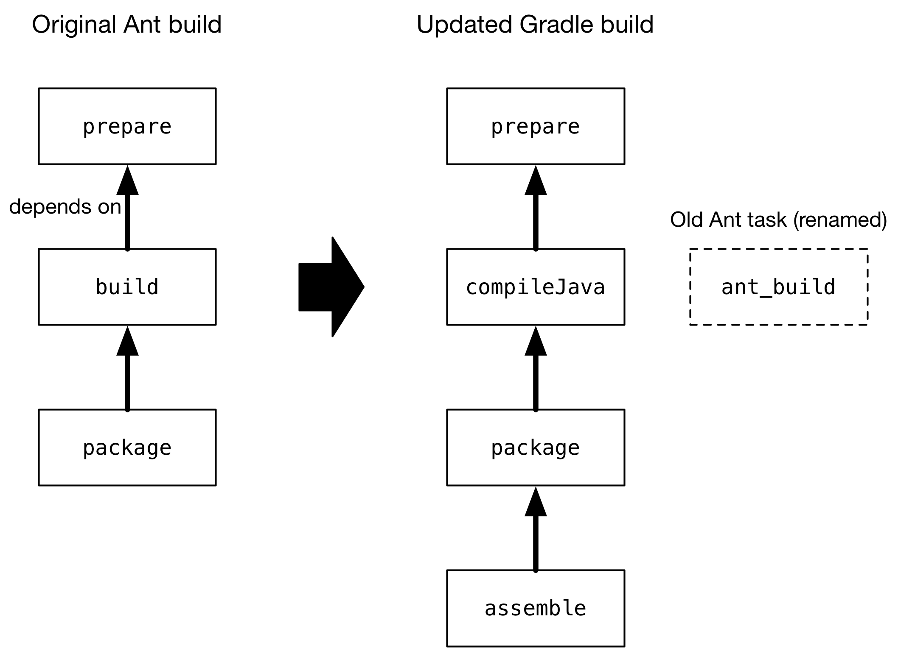

[ Gradle ](https://docs.gradle.org "Gradle Docs")

User Manual

  * Community Open Community Menu

[ Community Home ](https://gradle.org/)

[ Community Forums ](https://discuss.gradle.org/)

[ Community Plugins ](https://plugins.gradle.org)

  * [Training](https://gradle.com/training/)
  * News Open Community Menu

[ Newsletter ](https://newsletter.gradle.com)

[ Blog ](https://blog.gradle.org)

[ Twitter ](https://twitter.com/gradle)

  * [Enterprise](https://gradle.com)
  * [github](https://github.com/gradle/gradle "Gradle on GitHub")

  * [Docs Home](../userguide/userguide.html)
  * [Samples](../samples/index.html)
  * [Release Notes](../release-notes.html)
  * Gradle API
    * [Javadoc](../javadoc/index.html?overview-summary.html)
    * [Groovy DSL Reference](../dsl/index.html)
    * [Groovy DSL Primer](../userguide/groovy_build_script_primer.html)
    * [Kotlin DSL API](https://gradle.github.io/kotlin-dsl-docs/api/)
    * [Kotlin DSL Primer](../userguide/kotlin_dsl.html)

### User Manual

[ PDF ](../userguide/userguide.pdf)

  * [What is Gradle?](../userguide/what_is_gradle.html)
  * [Getting Started](../userguide/getting_started.html)
  * [Installing Gradle](../userguide/installation.html)
  * Upgrading Gradle...
    * [version 6.X to latest](../userguide/upgrading_version_6.html)
    * [version 5.X to 6.0](../userguide/upgrading_version_5.html)
    * [version 4.X to 5.0](../userguide/upgrading_version_4.html)
    * [Gradle's Feature Lifecycle](../userguide/feature_lifecycle.html)
  * Migrating to Gradle...
    * [from Maven](../userguide/migrating_from_maven.html)
    * [from Ant](../userguide/migrating_from_ant.html)
  * [Compatibility Notes](../userguide/compatibility.html)
  * [Troubleshooting Builds](../userguide/troubleshooting.html)

### Running Gradle Builds

  * Customizing Execution
    * [Configuring the Build Environment](../userguide/build_environment.html)
    * [Configuring the Gradle Daemon](../userguide/gradle_daemon.html)
    * [Using Initialization Scripts](../userguide/init_scripts.html)
  * [Executing Multi-Project Builds](../userguide/intro_multi_project_builds.html)
  * [Inspecting Gradle Builds](https://scans.gradle.com/)
  * Optimizing Build Times
    * [Build Performance Guide](https://guides.gradle.org/performance/)
    * [Enabling and Configuring the Build Cache](../userguide/build_cache.html)
    * [Using the Configuration Cache](../userguide/configuration_cache.html)

### Authoring Gradle Builds

  * Learning the Basics
    * [Introducing the Basics of Build Scripts](../userguide/tutorial_using_tasks.html)
    * [Working with Tasks](../userguide/more_about_tasks.html)
    * [Learning More About Build Scripts](../userguide/writing_build_scripts.html)
    * [Working with Files](../userguide/working_with_files.html)
    * [Using Gradle Plugins](../userguide/plugins.html)
    * [Understanding the Build Lifecycle](../userguide/build_lifecycle.html)
    * [Working with Logging](../userguide/logging.html)
    * [Avoiding Traps](../userguide/potential_traps.html)
  * Authoring Multi-Project Builds
    * [Creating a Basic Multi-Project Build](../userguide/multi_project_builds.html)
    * [Declaring Dependencies between Subprojects](../userguide/declaring_dependencies_between_subprojects.html)
    * [Sharing Build Logic between Subprojects](../userguide/sharing_build_logic_between_subprojects.html)
    * [Fine Tuning the Project Layout](../userguide/fine_tuning_project_layout.html)
    * [Understanding Configuration and Execution](../userguide/multi_project_configuration_and_execution.html)
  * Authoring Sustainable Builds
    * [Organizing Build Logic](../userguide/organizing_gradle_projects.html)
    * [Following Best Practices](../userguide/authoring_maintainable_build_scripts.html)
  * Advanced Techniques
    * [Developing Parallel Tasks](https://guides.gradle.org/using-the-worker-api/)
    * [Testing a Build with TestKit](../userguide/test_kit.html)
    * [Using Ant from Gradle](../userguide/ant.html)

### Authoring JVM Builds

  * [Building Java & JVM projects](../userguide/building_java_projects.html)
  * [Testing Java & JVM projects](../userguide/java_testing.html)
  * [Toolchains for Java projects](../userguide/toolchains.html)
  * [Managing Dependencies](../userguide/dependency_management_for_java_projects.html)
  * JVM Plugins
    * [Java Library Plugin](../userguide/java_library_plugin.html)
    * [Java Application Plugin](../userguide/application_plugin.html)
    * [Java Platform Plugin](../userguide/java_platform_plugin.html)
    * [Groovy Plugin](../userguide/groovy_plugin.html)
    * [Scala Plugin](../userguide/scala_plugin.html)

### Authoring C++/Swift Builds

  * [Building C++ projects](../userguide/building_cpp_projects.html)
  * [Testing C++ projects](../userguide/cpp_testing.html)
  * [Building Swift projects](../userguide/building_swift_projects.html)
  * [Testing Swift projects](../userguide/swift_testing.html)

### Working with Dependencies

  * Learning the Basics
    * [What is Dependency Management?](../userguide/core_dependency_management.html)
    * [Declaring Repositories](../userguide/declaring_repositories.html)
    * [Declaring Dependencies](../userguide/declaring_dependencies.html)
    * [Understanding Library and Application Differences](../userguide/library_vs_application.html)
    * [Viewing and Debugging Dependencies](../userguide/viewing_debugging_dependencies.html)
    * [Understanding Resolution](../userguide/dependency_resolution.html)
    * [Verifying dependencies](../userguide/dependency_verification.html)
  * Declaring Versions
    * [Declaring Versions and Ranges](../userguide/single_versions.html)
    * [Declaring Rich Versions](../userguide/rich_versions.html)
    * [Handling Changing Versions](../userguide/dynamic_versions.html)
    * [Locking Versions](../userguide/dependency_locking.html)
  * Controlling Transitives
    * [Upgrading Versions](../userguide/dependency_constraints.html)
    * [Downgrading and Excluding](../userguide/dependency_downgrade_and_exclude.html)
    * [Sharing Versions](../userguide/platforms.html)
    * [Aligning Dependencies](../userguide/dependency_version_alignment.html)
    * [Handling Mutually Exclusive Dependencies](../userguide/dependency_capability_conflict.html)
    * [Fixing Metadata](../userguide/component_metadata_rules.html)
    * [Customizing Resolution](../userguide/resolution_rules.html)
    * [Preventing accidental upgrades](../userguide/resolution_strategy_tuning.html)
  * Producing and Consuming Variants of Libraries
    * [Declaring Capabilities of a Library](../userguide/component_capabilities.html)
    * [Modeling Feature Variants and Optional Dependencies](../userguide/feature_variants.html)
    * [Understanding Variant Selection](../userguide/variant_model.html)
    * [Declaring Variant Attributes](../userguide/variant_attributes.html)
    * [Sharing Outputs of Projects](../userguide/cross_project_publications.html)
    * [Transforming Artifacts](../userguide/artifact_transforms.html)
  * Working in a Multi-repo Environment
    * [Composing Builds](../userguide/composite_builds.html)
  * Publishing Libraries
    * [Setting up Publishing](../userguide/publishing_setup.html)
    * [Understanding Gradle Module Metadata](../userguide/publishing_gradle_module_metadata.html)
    * [Signing Artifacts](../userguide/publishing_signing.html)
    * [Customizing Publishing](../userguide/publishing_customization.html)
    * [Maven Publish Plugin](../userguide/publishing_maven.html)
    * [Ivy Publish Plugin](../userguide/publishing_ivy.html)
  * [Terminology](../userguide/dependency_management_terminology.html)

### Extending Gradle

  * [Plugin Development Tutorials](https://gradle.org/guides/?q=Plugin%20Development)
  * [Writing Gradle Task Types](../userguide/custom_tasks.html)
  * [Writing Gradle Plugins](../userguide/custom_plugins.html)
  * [Writing Custom Gradle Types](../userguide/custom_gradle_types.html)
  * [Configuring Tasks Lazily](../userguide/lazy_configuration.html)
  * [Using Task Configuration Avoidance](../userguide/task_configuration_avoidance.html)

### Reference

  * [Core Plugins](../userguide/plugin_reference.html)
  * [Command-Line Interface](../userguide/command_line_interface.html)
  * [Gradle & Third-party Tools](../userguide/third_party_integration.html)
  * [The Gradle Wrapper](../userguide/gradle_wrapper.html)
  * [Gradle-managed Directories](../userguide/directory_layout.html)

# Migrating Builds From Apache Ant

version 6.7.1

Contents

  * General guidelines
  * Working with an imported build
  * Managing dependencies
  * Publishing artifacts
  * Dealing with custom Ant tasks
  * Working with files
  * Migrating Ant properties
  * Migrating multi-project builds
  * Further reading

[Apache Ant](https://ant.apache.org/) is a build tool with a long history in
the Java world that is still widely used, albeit by a decreasing number of
teams. While flexible, it lacks conventions and many of the powerful features
that Gradle can provide. Migrating to Gradle is worthwhile so that your builds
can become slimmer, simpler and faster, while still retaining the flexibility
you enjoy with Ant. You'll also benefit from robust support for multi-project
builds and easy-to-use, flexible dependency management.

The biggest challenge in migrating from Ant to Gradle is that there is no such
thing as a standard Ant build. That makes it difficult to provide specific
instructions. Fortunately, Gradle has some great integration features with Ant
that can make the process relatively smooth. And even migrating from
[Ivy](https://ant.apache.org/ivy/)-based dependency management isn't
particularly hard because Gradle has a similar model based on [dependency
configurations](dependency_management_terminology.html#sub:terminology_configuration)
that works with Ivy-compatible repositories.

We will start by outlining the things you should consider at the outset of
migrating a build from Ant to Gradle and offer some general guidelines on how
to proceed.

## General guidelines

When you undertake to migrate a build from Ant to Gradle, you should keep in
mind the nature of both what you already have and where you would like to end
up. Do you want a Gradle build that mirrors the structure of the existing Ant
build? Or do you want to move to something that is more idiomatic to Gradle?
What are the main benefits you are looking for?

To understand the implications, consider the two extreme endpoints that you
could aim for:

  * An imported build via [`ant.importBuild()`](ant.html#sec:import_ant_build)

This approach is quick, simple and works for many Ant-based builds. You end up
with a build that's effectively identical to the original Ant build, except
your Ant targets become Gradle tasks. Even the dependencies between targets
are retained.

The downside is that you're still using the Ant build, which you must continue
to maintain. You also lose the advantages of Gradle's conventions, many of its
plugins, its dependency management, and so on. You can still enhance the build
with [incremental build
information](more_about_tasks.html#sec:up_to_date_checks), but it's more
effort than would be the case for a normal Gradle build.

  * An idiomatic Gradle build

If you want to future proof your build, this is where you want to end up.
Making use of Gradle's conventions and plugins will result in a smaller,
easier-to-maintain build, with a structure that is familiar to many Java
developers. You will also find it easier to take advantage of Gradle's power
features to improve build performance.

The main downside is the extra work required to perform the migration,
particularly if the existing build is complex and has many inter-project
dependencies. But such builds often benefit the most from a switch to idomatic
Gradle. In addition, Gradle provides many features that can ease the
migration, such as the ability to [use core and custom Ant
tasks](ant.html#sec:using_ant_tasks) directly from a Gradle build.

You ideally want to end up somewhere close to the second option in the long
term, but you don't have to get there in one fell swoop.

What follows is a series of steps to help you decide the approach you want to
take and how to go about it:

  1. Keep the old Ant build and new Gradle build side by side

You know the Ant build works, so you should keep it until you are confident
that the Gradle build produces all the same artifacts and otherwise does what
you need. This also means that users can try the Gradle build without getting
a new copy of the source tree.

Don't try to change the directory and file structure of the build until after
you're ready to make the switch.

  2. Develop a mechanism to verify that the two builds produce the same artifacts

This is a vitally important step to ensure that your deployments and tests
don't break. Even small changes, such as the contents of a manifest file in a
JAR, can cause problems. If your Gradle build produces the same output as the
Ant build, this will give you and others confidence in switching over and make
it easier to implement the big changes that will provide the greatest
benefits.

  3. Decide whether you have a multi-project build or not

Multi-project builds are generally harder to migrate and require more work
than single-project ones. We have provided some dedicated advice to help with
the process in the Migrating multi-project builds section.

  4. Work out what plugins to use for each project

We expect that the vast majority of Ant builds are for [JVM-based
projects](building_java_projects.html#building_java_projects), for which there
are a wealth of plugins that provide a lot of the functionality you need. Not
only are there the [core plugins](plugin_reference.html#plugin_reference) that
come packaged with Gradle, but you can also find many useful plugins on the
[Plugin Portal](https://plugins.gradle.org/).

Even if the [Java Plugin](java_plugin.html#java_plugin) or one of its
derivatives (such as the [Java Library
Plugin](java_library_plugin.html#java_library_plugin)) aren't a good match for
your build, you should at least consider the [Base
Plugin](base_plugin.html#base_plugin) for its lifecycle tasks.

  5. Import the Ant build or create a Gradle build from scratch

This step very much depends on the requirements of your build. If a selection
of Gradle plugins can do the vast majority of the work your Ant build does,
then it probably makes sense to create a fresh Gradle build script that
doesn't depend on the Ant build and either implements the missing pieces
itself or [utilizes existing Ant tasks](ant.html#sec:using_ant_tasks).

The alternative approach is to [import the Ant
build](ant.html#sec:import_ant_build) into the Gradle build script and
gradually replace the Ant build functionality. This allows you to have a
working Gradle build at each stage, but it requires a bit of work to get the
Gradle tasks working properly with the Ant ones. You can learn more about this
approach in Working with an imported build.

  6. Configure your build for the existing directory and file structure

Gradle makes use of conventions to eliminate much of the boilerplate
associated with older builds and to make it easier for users to work with new
builds once they are familiar with those conventions. But that doesn't mean
you have to follow them.

Gradle provides many configuration options that allow for a good degree of
customization. Those options are typically made available through the plugins
that provide the conventions. For example, the standard source directory
structure for production Java code — `src/main/java` — is provided by the Java
Plugin, which allows you to [configure a different source
path](building_java_projects.html#sec:custom_java_source_set_paths). Many
paths can be modified via properties on the
[Project](../dsl/org.gradle.api.Project.html) object.

  7. Migrate to standard Gradle conventions if you wish

Once you're confident that the Gradle build is producing the same artifacts
and other resources as the Ant build, you can consider migrating to the
standard conventions, such as for source directory paths. Doing so will allow
you to remove the extra configuration that was required to override those
conventions. New team members will also find it easier to work with the build
after the change.

It's up to you to decide whether this step is worth the time, energy and
potential disruption that it might incur, which in turn depends on your
specific build and team.

The rest of the chapter covers some common scenarios you will likely deal with
during the migration, such as dependency management and working with Ant
tasks.

## Working with an imported build

The first step of many migrations will involve [importing an Ant
build](ant.html#sec:import_ant_build) using `ant.importBuild()`. If you do
that, how do you then move towards a standard Gradle build without replacing
everything at once?

The important thing to remember is that the Ant targets become real Gradle
tasks, meaning you can do things like modify their task dependencies, attach
extra task actions, and so on. This allows you to substitute native Gradle
tasks for the equivalent Ant ones, maintaining any links to other existing
tasks.

As an example, imagine that you have a Java library project that you want to
migrate from Ant to Gradle. The Gradle build script has the line that imports
the Ant build and now want to use the standard Gradle mechanism for compiling
the Java source files. However, you want to keep using the existing `package`
task that creates the library's JAR file.

In diagrammatic form, the scenario looks like the following, where each box
represents a target/task:

The idea is to substitute the standard Gradle `compileJava` task for the Ant
`build` task. There are several steps involved in this substitution:

  1. Applying the [Java Library Plugin](java_library_plugin.html#java_library_plugin)

This provides the `compileJava` task shown in the diagram.

  2. Renaming the old `build` task

The name `build` conflicts with the standard `build` task provided by the
[Base Plugin](base_plugin.html#base_plugin) (via the Java Library Plugin).

  3. Configuring the compilation to use the existing directory structure

There's a good chance the Ant build does not conform to the standard Gradle
directory structure, so you need to tell Gradle where to find the source files
and where to place the compiled classes so `package` can find them.

  4. Updating task dependencies

`compileJava` must depend on `prepare`, `package` must depend on `compileJava`
rather than `ant_build`, and `assemble` must depend on `package` rather than
the standard Gradle `jar` task.

Applying the plugin is as simple as inserting a `plugins {}` block at the
beginning of the Gradle build script, i.e. before `ant.importBuild()`. Here's
how to apply the Java Library Plugin:

Example 1. Applying the Java Library Plugin

build.gradle

    
    
    plugins {
        id 'java-library'
    }

build.gradle.kts

    
    
    plugins {
        `java-library`
    }

To rename the `build` task, use the variant of
[AntBuilder.importBuild()](../javadoc/org/gradle/api/AntBuilder.html#importBuild-
java.lang.Object-org.gradle.api.Transformer-) that accepts a transformer, like
this:

Example 2. Renaming targets on import

build.gradle

    
    
    ant.importBuild('build.xml') { String oldTargetName ->
        return oldTargetName == 'build' ? 'ant_build' : oldTargetName  __**(1)**
    }

build.gradle.kts

    
    
    ant.importBuild("build.xml") { oldTargetName ->
        if (oldTargetName == "build") "ant_build" else oldTargetName  __**(1)**
    }

__**1** | Renames the `build` target to `ant_build` and leaves all other
targets unchanged  
---|---  
  
Configuring a different path for the sources is described in the [Building
Java & JVM
projects](building_java_projects.html#sec:custom_java_source_set_paths)
chapter, while you can change the output directory for the compiled classes in
a similar way.

Let's say the original Ant build stores these paths in Ant properties,
`src.dir` for the Java source files and `classes.dir` for the output. Here's
how you would configure Gradle to use those paths:

Example 3. Configuring the source sets

build.gradle

    
    
    sourceSets {
        main {
            java {
                srcDirs = [ ant.properties['src.dir'] ]
                outputDir = file(ant.properties['classes.dir'])
            }
        }
    }

build.gradle.kts

    
    
    sourceSets {
        main {
            java.setSrcDirs(listOf(ant.properties["src.dir"]))
            java.outputDir = file(ant.properties["classes.dir"] ?: "$buildDir/classes")
        }
    }

You should eventually aim to switch the standard directory structure for your
type of project if possible and then you'll be able to remove this
customization.

The last step is also straightforward and involves using the
[Task.dependsOn](../dsl/org.gradle.api.Task.html#org.gradle.api.Task:dependsOn)
property and
[Task.dependsOn()](../dsl/org.gradle.api.Task.html#org.gradle.api.Task:dependsOn\(java.lang.Object\[\]\))
method to detach and link tasks. The property is appropriate for _replacing_
dependencies, while the method is the preferred way to add to the existing
dependencies.

Here is the required task dependency configuration required by the example
scenario, which should come after the Ant build import:

Example 4. Configuring the task dependencies

build.gradle

    
    
    compileJava.dependsOn 'prepare'  __**(1)**
    package.dependsOn = [ 'compileJava' ]  __**(2)**
    assemble.dependsOn = [ 'package' ]  __**(3)**

build.gradle.kts

    
    
    tasks {
        compileJava {
            dependsOn("prepare")  __**(1)**
        }
        named("package") {
            setDependsOn(listOf(compileJava))  __**(2)**
        }
        assemble {
            setDependsOn(listOf("package"))  __**(3)**
        }
    }

__**1** | Makes compilation depend on the `prepare` task  
---|---  
__**2** | Detaches `package` from the `ant_build` task and makes it depend on
`compileJava`  
__**3** | Detaches `assemble` from the standard Gradle `jar` task and makes it
depend on `package` instead  
  
That's it! These four steps will successfully replace the old Ant compilation
with the Gradle implementation. Even this small migration will be a big help
because you'll be able to take advantage of Gradle's [incremental Java
compilation](java_plugin.html#sec:incremental_compile) for faster builds.

__ |

This is just a demonstration of how to go about performing a migration in
stages. It may make more sense to include resource processing — like with
properties files — and packaging with the compilation in this stage, since all
three aspects are well integrated in Gradle.  
  
---|---  
  
One important question you will have to ask yourself is how many tasks to
migrate in each stage. The larger the chunks you can migrate in one go the
better, but this must be offset against how many custom steps within the Ant
build will be affected by the changes.

For example, if the Ant build follows a fairly standard approach for
compilation, static resources, packaging and unit tests, then it is probably
worth migrating all those together. But if the build performs some extra
processing on the compiled classes, or does something unique when processing
the static resources, it is probably worth splitting those tasks into separate
stages.

## Managing dependencies

Ant builds typically take one of two approaches to dealing with binary
[dependencies](dependency_management_terminology.html#sub:terminology_dependency)
(such as libraries):

  * Storing them with the project in a local "lib" directory

  * Using [Apache Ivy](https://ant.apache.org/ivy/) to manage them

They each require a different technique for the migration to Gradle, but you
will find the process straightforward in either case. We look at the details
of each scenario in the following sections.

### Serving dependencies from a directory

When you are attempting to migrate a build that stores its dependencies on the
filesystem, either locally or on the network, you should consider whether you
want to eventually move to managed dependencies using remote repositories.
That's because you can incorporate filesystem dependencies into a Gradle build
in one of two ways:

  * Define a [flat-directory repository](declaring_repositories.html#sub:flat_dir_resolver) and use standard dependency declarations

  * Attach the files directly to the appropriate dependency configurations ([file dependencies](declaring_dependencies.html#sub:file_dependencies))

It's easier to migrate to managed dependencies served from Maven- or Ivy-
compatible repositories if you take the first approach, but doing so requires
all your files to conform to the naming convention
"<moduleName>-<version>.<extension>".

__ |

If you store your dependencies in the standard Maven repository layout —
`<repoDir>/<group>/<module>/<version>` — then you can define a [custom Maven
repository](declaring_repositories.html#sec:declaring_custom_repository) with
a "file://" URL.  
  
---|---  
  
To demonstrate the two techniques, consider a project that has the following
library JARs in its `libs` directory:

    
    
    libs
    ├── our-custom.jar
    ├── log4j-1.2.8.jar
    └── commons-io-2.1.jar

The file `our-custom.jar` lacks a version number, so it has to be added as a
file dependency. But the other two JARs match the required naming convention
and so can be declared as normal [module
dependencies](declaring_dependencies.html#sub:module_dependencies) that are
retrieved from a flat-directory repository.

The following sample build script demonstrates how you can incorporate all of
these libraries into a build:

Example 5. Declaring dependencies served from the filesystem

build.gradle

    
    
    repositories {
        flatDir {
            name = 'libs dir'
            dir file('libs')  __**(1)**
        }
    }
    
    dependencies {
        implementation files('libs/our-custom.jar')  __**(2)**
        implementation ':log4j:1.2.8', ':commons-io:2.1'  __**(3)**
    }

build.gradle.kts

    
    
    repositories {
        flatDir {
            name = "libs dir"
            dir(file("libs"))  __**(1)**
        }
    }
    
    dependencies {
        implementation(files("libs/our-custom.jar"))  __**(2)**
        implementation(":log4j:1.2.8")     __**(3)**
        implementation(":commons-io:2.1")  __**(3)**
    }

__**1** | Specifies the path to the directory containing the JAR files  
---|---  
__**2** | Declares a _file dependency_ for the unversioned JAR  
__**3** | Declares dependencies using standard dependency coordinates — note
that no group is specified, but each identifier has a leading `:`, implying an
empty group  
  
The above sample will add `our-custom.jar`, `log4j-1.2.8.jar` and `commons-
io-2.1.jar` to the `implementation` configuration, which is used to compile
the project's code.

__ |

You can also specify a group in these module dependencies, even though they
don't actually have a group. That's because the flat-directory repository
simply ignores the information.

If you then add a normal Maven- or Ivy-compatible repository at a later date,
Gradle will preferentially download the module dependencies that are declared
with a group from that repository rather than the flat-directory one.  
  
---|---  
  
### Migrating Ivy dependencies

Apache Ivy is a standalone dependency management tool that is widely used with
Ant. It works in a similar fashion to Gradle. In fact, they both allow you to

  * Define your own [configurations](dependency_management_terminology.html#sub:terminology_configuration)

  * Extend configurations from one another

  * Attach dependencies to configurations

  * Resolve dependencies from Ivy-compatible repositories

  * Publish artifacts to Ivy-compatible repositories

The most notable difference is that Gradle has standard configurations for
specific types of projects. For example, the [Java
Plugin](java_plugin.html#tab:configurations) defines configurations like
`implementation`, `testImplementation` and `runtimeOnly`. You can still
[define your own dependency
configurations](declaring_dependencies.html#sec:defining-custom-
configurations), though.

This similarity means that it's usually quite straightforward to migrate from
Ivy to Gradle:

  * Transcribe the dependency declarations from your module descriptors into the [dependencies {}](../dsl/org.gradle.api.Project.html#org.gradle.api.Project:dependencies\(groovy.lang.Closure\)) block of your Gradle build script, ideally using the standard configurations provided by any plugins you apply.

  * Transcribe any configuration declarations from your module descriptors into the [configurations {}](../dsl/org.gradle.api.Project.html#org.gradle.api.Project:configurations\(groovy.lang.Closure\)) block of the build script for any custom configurations that can't be replaced by Gradle's standard ones.

  * Transcribe the resolvers from your Ivy settings file into the [repositories {}](../dsl/org.gradle.api.Project.html#org.gradle.api.Project:repositories\(groovy.lang.Closure\)) block of the build script.

See the chapters on [Managing Dependency
Configurations](declaring_dependencies.html#sec:what-are-dependency-
configurations), [Declaring
Dependencies](declaring_dependencies.html#sec:dependency-types) and [Declaring
Repositories](declaring_repositories.html#declaring-repositories) for more
information.

Ivy provides several Ant tasks that handle Ivy's process for fetching
dependencies. The basic steps of that process consist of:

  1. _Configure_ — applies the configuration defined in the Ivy settings file

  2. _Resolve_ — locates the declared dependencies and downloads them to the cache if necessary

  3. _Retrieve_ — copies the cached dependencies to another directory

Gradle's process is similar, but you don't have to explicitly invoke the first
two steps as it performs them automatically. The third step doesn't happen at
all — unless you create a task to do it — because Gradle typically uses the
files in the dependency cache directly in classpaths and as the source for
assembling application packages.

Let's look in more detail at how Ivy's steps map to Gradle:

Configuration

    

Most of Gradle's dependency-related configuration is baked into the build
script, as you've seen with elements like the `dependencies {}` block. Another
particularly important configuration element is
[resolutionStrategy](../dsl/org.gradle.api.artifacts.ResolutionStrategy.html),
which can be accessed from dependency configurations. This provides many of
the features you might get from Ivy's conflict managers and is a powerful way
to control transitive dependencies and caching.

Some Ivy configuration options have no equivalent in Gradle. For example,
there are no lock strategies because Gradle ensures that its dependency cache
is concurrency safe, period. Nor are there "latest strategies" because it's
simpler to have a reliable, single strategy for conflict resolution. If the
"wrong" version is picked, you can easily override it using forced versions or
other resolution strategy options.

See the chapter on [controlling transitive
dependencies](dependency_constraints.html) for more information on this aspect
of Gradle.

Resolution

    

At the beginning of the build, Gradle will automatically resolve any
dependencies that you have declared and download them to its cache. It
searches the repositories for those dependencies, with the search order
defined by [the order in which the repositories are
declared](declaring_repositories.html#sec:declaring_multiple_repositories).

It's worth noting that Gradle supports the same dynamic version syntax as Ivy,
so you can still use versions like `1.0.+`. You can also use the special
`latest.integration` and `latest.release` labels if you wish. If you decide to
use such
[dynamic](dynamic_versions.html#sub:declaring_dependency_with_dynamic_version)
and
[changing](dynamic_versions.html#sub:declaring_dependency_with_changing_version)
dependencies, you can configure the caching behavior for them via
[resolutionStrategy](../dsl/org.gradle.api.artifacts.ResolutionStrategy.html).

You might also want to consider [dependency locking](dependency_locking.html)
if you're using dynamic and/or changing dependencies. It's a way to make the
build more reliable and allows for [reproducible builds](https://reproducible-
builds.org/).

Retrieval

    

As mentioned, Gradle does not automatically copy files from the dependency
cache. Its standard tasks typically use the files directly. If you want to
copy the dependencies to a local directory, you can use a
[Copy](../dsl/org.gradle.api.tasks.Copy.html) task like this in your build
script:

Example 6. Copying dependencies to a local directory

build.gradle

    
    
    task retrieveRuntimeDependencies(type: Copy) {
        into "$buildDir/libs"
        from configurations.runtimeClasspath
    }

build.gradle.kts

    
    
    tasks {
        register<Copy>("retrieveRuntimeDependencies") {
            into("$buildDir/libs")
            from(configurations.runtimeClasspath)
        }
    }

A configuration is also a file collection, hence why it can be used in the
`from()` configuration. You can use a similar technique to attach a
configuration to a compilation task or one that produces documentation. See
the chapter on [Working with
Files](working_with_files.html#working_with_files) for more examples and
information on Gradle's file API.

## Publishing artifacts

Projects that use Ivy to manage dependencies often also use it for publishing
JARs and other artifacts to repositories. If you're migrating such a build,
then you'll be glad to know that Gradle has built-in support for publishing
artifacts to Ivy-compatible repositories.

Before you attempt to migrate this particular aspect of your build, read the
[Publishing](publishing_setup.html#publishing_overview) chapter to learn about
Gradle's publishing model. That chapter's examples are based on Maven
repositories, but the same model is used for Ivy repositories as well.

The basic migration process looks like this:

  * Apply the [Ivy Publish Plugin](publishing_ivy.html#publishing_ivy) to your build

  * [Configure at least one publication](publishing_ivy.html#publishing_ivy:publications), representing what will be published (including additional artifacts if desired)

  * [Configure one or more repositories to publish artifacts to](publishing_ivy.html#publishing_ivy:repositories)

Once that's all done, you'll be able to generate an Ivy module descriptor for
each publication and publish them to one or more repositories.

Let's say you have defined a publication named "myLibrary" and a repository
named "myRepo". Ivy's Ant tasks would then map to the Gradle tasks like this:

  * `<deliver>` -> `generateDescriptorFileForMyLibraryPublication`

  * `<publish>` -> `publishMyLibraryPublicationToMyRepoRepository`

There is also a convenient `publish` task that publishes _all_ publications to
_all_ repositories. If you'd prefer to limit which publications go to which
repositories, check out the [relevant section of the Publishing
chapter](publishing_customization.html#sec:publishing_maven:conditional_publishing).

__ |

On dependency versions

Ivy will, by default, automatically replace dynamic versions of dependencies
with the resolved "static" versions when it generates the module descriptor.
Gradle does _not_ mimic this behavior: declared dependency versions are left
unchanged.

You can replicate the default Ivy behavior by using the [Nebula Ivy Resolved
Plugin](https://plugins.gradle.org/plugin/nebula.ivy-resolved-dependencies).
Alternatively, you can [customize the descriptor
file](../dsl/org.gradle.api.publish.ivy.IvyModuleDescriptorSpec.html#org.gradle.api.publish.ivy.IvyModuleDescriptorSpec:withXml\(org.gradle.api.Action\))
so that it contains the versions you want.  
  
---|---  
  
## Dealing with custom Ant tasks

One of the advantages of Ant is that it's fairly easy to create a custom task
and incorporate it into a build. If you have such tasks, then there are two
main options for migrating them to a Gradle build:

  * [Using the custom Ant task](ant.html#sec:using_custom_ant_tasks) from the Gradle build

  * Rewriting the task as a [custom Gradle task type](custom_tasks.html#custom_tasks)

The first option is usually quick and easy, but not always. And if you want to
integrate the task into incremental build, you must use the [incremental build
runtime API](more_about_tasks.html#sec:task_input_output_runtime_api). You
also often have to work with Ant paths and filesets, which are clunky.

The second option is preferable in the long term, if you have the time. Gradle
task types tend to be simpler than Ant tasks because they don't have to work
with an XML-based interface. You also gain access to Gradle's rich APIs.
Lastly, this approach can make use of the [type-safe incremental build
API](more_about_tasks.html#sec:task_input_output_annotations) based on typed
properties.

## Working with files

Ant has many tasks for working with files, most of which have Gradle
equivalents. As with other areas of Ant to Gradle migration, you can [use
those Ant tasks](ant.html#sec:using_ant_tasks) from within your Gradle build.
However, we strongly recommend migrating to native Gradle constructs where
possible so that the build benefits from:

  * [Incremental build](more_about_tasks.html#sec:up_to_date_checks)

  * Easier integration with other parts of the build, such as dependency configurations

  * More idiomatic build scripts

That said, it can be convenient to use those Ant tasks that have no direct
equivalents, such as `<checksum>` and `<chown>`. Even then, in the long run it
may be better to convert these to native Gradle task types that make use of
standard Java APIs or third-party libraries to achieve the same thing.

Here are the most common file-related elements used by Ant builds, along with
the Gradle equivalents:

  * `<copy>` — prefer the Gradle [Copy](../dsl/org.gradle.api.tasks.Copy.html) task type

  * `<zip>` (plus Java variants) — prefer the [Zip](../dsl/org.gradle.api.tasks.bundling.Zip.html) task type (plus [Jar](../dsl/org.gradle.api.tasks.bundling.Jar.html), [War](../dsl/org.gradle.api.tasks.bundling.War.html), and [Ear](../dsl/org.gradle.plugins.ear.Ear.html))

  * `<unzip>` — prefer using the [Project.zipTree()](../dsl/org.gradle.api.Project.html#org.gradle.api.Project:zipTree\(java.lang.Object\)) method with a `Copy` task

You can see several examples of Gradle's file API and learn more about it in
the [Working with Files](working_with_files.html#working_with_files) chapter.

__ |

On paths and filesets

Ant makes use of the concepts of path-like structures and filesets to enable
users to work with collections of files and directories. Gradle has a simpler,
more powerful model based on
[FileCollection](../javadoc/org/gradle/api/file/FileCollection.html)s and
[FileTree](../javadoc/org/gradle/api/file/FileTree.html)s that can be treated
as objects from within the build. Both types allow filtering based on Ant's
glob syntax, e.g. `**/books_*`. Learn more about these types and other aspects
of Gradle's file API in the [Working with
Files](working_with_files.html#working_with_files) chapter.

You can still construct Ant paths and filesets from within your build via the
`ant` object if you need to interact with an Ant task that requires them. The
chapter on [Ant integration](ant.html#ant) has examples that use both `<path>`
and `<fileset>`. There is even [a method on
`FileCollection`](../javadoc/org/gradle/api/file/FileCollection.html#addToAntBuilder-
java.lang.Object-java.lang.String-org.gradle.api.file.FileCollection.AntType-)
that will convert a file collection to a fileset or similar Ant type.  
  
---|---  
  
## Migrating Ant properties

Ant makes use of a properties map to store values that can be reused
throughout the build. The big downsides to this approach are that property
values are all strings and the properties themselves behave like global
variables.

__ |

Interacting with Ant properties in Gradle

Sometimes you will want to make use of an Ant task directly from your Gradle
build and that task requires one or more Ant properties to be set. If that's
the case, you can easily set those properties via the `ant` object, as
described in the [Using Ant from Gradle](ant.html#sec:ant_properties) chapter.  
  
---|---  
  
Gradle does use something similar in the form of [project
properties](build_environment.html#sec:project_properties), which are a
reasonable way to parameterize a build. These can be set from the command
line, in a [`gradle.properties`
file](build_environment.html#sec:gradle_configuration_properties), or even via
specially named system properties and environment variables.

If you have existing Ant properties files, you can copy their contents into
the project's `gradle.properties` file. Just be aware of two important points:

  * Properties set in `gradle.properties` **do not** override [extra project properties](writing_build_scripts.html#sec:extra_properties) defined in the build script with the same name

  * Imported Ant tasks will not automatically "see" the Gradle project properties — you must copy them into the Ant properties map for that to happen

Another important factor to understand is that a Gradle build script works
with an object-oriented API and it's often best to use the properties of
tasks, source sets and other objects where possible. For example, this build
script fragment creates tasks for packaging Javadoc documentation as a JAR and
unpacking it, linking tasks via their properties:

Example 7. Using task properties in place of project properties

build.gradle

    
    
    ext {
        tmpDistDir = file("$buildDir/dist")
    }
    
    task javadocJarArchive(type: Jar) {
        from javadoc  __**(1)**
        archiveClassifier = 'javadoc'
    }
    
    task unpackJavadocs(type: Copy) {
        from zipTree(javadocJarArchive.archiveFile)  __**(2)**
        into tmpDistDir  __**(3)**
    }

build.gradle.kts

    
    
    val tmpDistDir by extra { file("$buildDir/dist") }
    
    tasks {
        register<Jar>("javadocJarArchive") {
            from(javadoc)  __**(1)**
            archiveClassifier.set("javadoc")
        }
    
        register<Copy>("unpackJavadocs") {
            from(zipTree(named<Jar>("javadocJarArchive").get().archiveFile))  __**(2)**
            into(tmpDistDir)  __**(3)**
        }
    }

__**1** | Packages all `javadoc`'s output files — equivalent to `from
javadoc.destinationDir`  
---|---  
__**2** | Uses the location of the Javadoc JAR held by the `javadocJar` task  
__**3** | Uses an extra project property called `tmpDistDir` to define the
location of the 'dist' directory  
  
As you can see from the example with `tmpDistDir`, there is often still a need
to define paths and the like through properties, which is why Gradle also
provides [extra properties](writing_build_scripts.html#sec:extra_properties)
that can be attached to the project, tasks and some other types of objects.

## Migrating multi-project builds

Multi-project builds are a particular challenge to migrate because there is no
standard approach in Ant for either structuring them or handling inter-project
dependencies. Most of them likely use the `<ant>` task in some way, but that's
about all that one can say.

Fortunately, Gradle's multi-project support can handle fairly diverse project
structures and it provides much more robust and helpful support than Ant for
constructing and maintaining multi-project builds. The `ant.importBuild()`
method also handles `<ant>` and `<antcall>` tasks transparently, which allows
for a phased migration.

We will suggest one process for migration here and hope that it either works
for your case or at least gives you some ideas. It breaks down like this:

  1. Start by learning [how Gradle configures multi-project builds](multi_project_builds.html#multi_project_builds).

  2. Create a Gradle build script in each project of the build, setting their contents to this line:
    
        ant.importBuild 'build.xml'
    
        ant.importBuild("build.xml")

Replace `build.xml` with the path to the actual Ant build file that
corresponds to the project. If there is no corresponding Ant build file, leave
the Gradle build script empty. Your build may not be suitable in that case for
this migration approach, but continue with these steps to see whether there is
still a way to do a phased migration.

  3. Create a settings file that [includes all the projects](../dsl/org.gradle.api.initialization.Settings.html#org.gradle.api.initialization.Settings:include\(java.lang.String\[\]\)) that now have a Gradle build script.

  4. Implement inter-project dependencies.

Some projects in your multi-project build will depend on artifacts produced by
one or more other projects in that build. Such projects need to ensure that
those projects they depend on have produced their artifacts and that they know
the paths to those artifacts.

Ensuring the production of the required artifacts typically means calling into
other projects' builds via the `<ant>` task. This unfortunately bypasses the
Gradle build, negating any changes you make to the Gradle build scripts. You
will need to replace targets that use `<ant>` tasks with Gradle [task
dependencies](more_about_tasks.html#sec:adding_dependencies_to_tasks).

For example, imagine you have a web project that depends on a "util" library
that's part of the same build. The Ant build file for "web" might have a
target like this:

web/build.xml

    
            <target name="buildRequiredProjects">
            <ant dir="${root.dir}/util" target="build"/>  __**(1)**
        </target>

__**1** | `root.dir` would have to be defined by the build  
---|---  
  
This can be replaced by an inter-project task dependency in the corresponding
Gradle build script, as demonstrated in the following example that assumes the
"web" project's "compile" task is the thing that requires "util" to be built
beforehand:

web/build.gradle

    
        ant.importBuild 'build.xml'
    
    compile.dependsOn = [ ':util:build' ]

web/build.gradle.kts

    
        ant.importBuild("build.xml")
    
    tasks {
        named<Task>("compile") {
            setDependsOn(listOf(":util:build"))
        }
    }

This is not as robust or powerful as Gradle's [project
dependencies](declaring_dependencies_between_subprojects.html#sec:project_jar_dependencies),
but it solves the immediate problem without big changes to the build. Just be
careful to remove or override any dependencies on tasks that delegate to other
subprojects, like the `buildRequiredProjects` task.

  5. Identify the projects that have no dependencies on other projects and migrate them to idiomatic Gradle builds scripts.

Just follow the advice in the rest of this guide to migrate individual project
builds. As mentioned elsewhere, you should ideally use Gradle standard plugins
where possible. This may mean that you need to add an extra copy task to each
build that copies the generated artifacts to the location expected by the rest
of the Ant builds.

  6. Migrate projects as and when they depend solely on projects with fully migrated Gradle builds.

At this point, you should be able to switch to using proper project
dependencies attached to the appropriate dependency configurations.

  7. Clean up projects once no part of the Ant build depends on them.

We mentioned in step 5 that you might need to add copy tasks to satisfy the
requirements of dependent Ant builds. Once those builds have been migrated,
such build logic will no longer be needed and should be removed.

At the end of the process you should have a Gradle build that you are
confident works as it should, with much less build logic than before.

## Further reading

This chapter has covered the major topics that are specific to migrating Ant
builds to Gradle. All that remain are a few other areas that may be useful
during or after a migration:

  * Learn how to configure Gradle's [build environment](build_environment.html#build_environment), including the JVM settings used to run it

  * Learn how to [structure your builds effectively](organizing_gradle_projects.html#organizing_gradle_projects)

  * [Configure Gradle's logging](logging.html#logging) and use it from your builds

As a final note, this guide has only touched on a few of Gradle's features and
we encourage you to learn about the rest from the other chapters of the user
manual and from our [step-by-step samples](../samples/index.html).

**Docs**

  * [User Manual](/userguide/userguide.html)
  * [DSL Reference](/dsl/)
  * [Release Notes](/release-notes.html)
  * [Javadoc](/javadoc/)

**News**

  * [Blog](https://blog.gradle.org/)
  * [Newsletter](https://newsletter.gradle.com/)
  * [Twitter](https://twitter.com/gradle)
  * [Status Page](https://status.gradle.com/)

**Products**

  * [Build Scans](https://gradle.com/build-scans/)
  * [Build Cache](https://gradle.com/build-cache/)
  * [Enterprise Docs](https://gradle.com/enterprise/resources/)

**Get Help**

  * [Forums](https://discuss.gradle.org/c/help-discuss)
  * [GitHub](https://github.com/gradle/)
  * [Training](https://gradle.com/training/)
  * [Services](https://gradle.org/services/)

##### Stay `UP-TO-DATE` on new features and news

By entering your email, you agree to our
[Terms](https://gradle.com/legal/terms-of-service/) and [Privacy
Policy](https://gradle.com/legal/privacy/), including receipt of emails. You
can unsubscribe at any time.

Subscribe

© [Gradle Inc.](https://gradle.com) 2020 All rights reserved.

[ gradle ](/)

[Careers](https://gradle.com/careers/) |
[Privacy](https://gradle.com/legal/privacy/) | [Terms of
Service](https://gradle.com/legal/terms-of-service/) |
[Contact](https://gradle.org/contact/)

