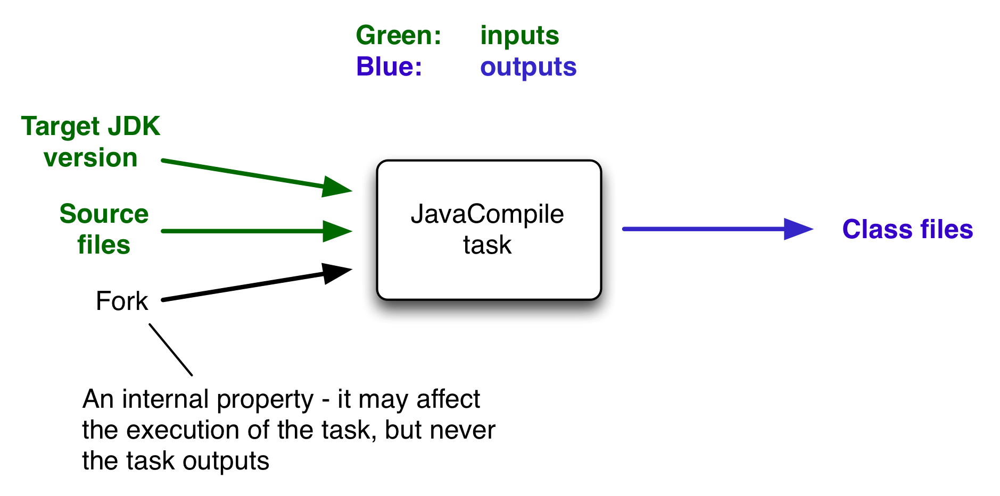

[ Gradle ](https://docs.gradle.org "Gradle Docs")

User Manual

  * Community Open Community Menu

[ Community Home ](https://gradle.org/)

[ Community Forums ](https://discuss.gradle.org/)

[ Community Plugins ](https://plugins.gradle.org)

  * [Training](https://gradle.com/training/)
  * News Open Community Menu

[ Newsletter ](https://newsletter.gradle.com)

[ Blog ](https://blog.gradle.org)

[ Twitter ](https://twitter.com/gradle)

  * [Enterprise](https://gradle.com)
  * [github](https://github.com/gradle/gradle "Gradle on GitHub")

  * [Docs Home](../userguide/userguide.html)
  * [Samples](../samples/index.html)
  * [Release Notes](../release-notes.html)
  * Gradle DSLs and API
    * [Javadoc](../javadoc/index.html?overview-summary.html)
    * [Groovy DSL Reference](../dsl/index.html)
    * [Groovy DSL Primer](../userguide/groovy_build_script_primer.html)
    * [Kotlin DSL API](https://gradle.github.io/kotlin-dsl-docs/api/)
    * [Kotlin DSL Primer](../userguide/kotlin_dsl.html)
    * [Groovy to Kotlin DSL Migration](../userguide/migrating_from_groovy_to_kotlin_dsl.html)

### User Manual

[ PDF ](../userguide/userguide.pdf)

  * [What is Gradle?](../userguide/what_is_gradle.html)
  * [Getting Started](../userguide/getting_started.html)
  * [Installing Gradle](../userguide/installation.html)
  * Upgrading Gradle...
    * [version 6.X to latest](../userguide/upgrading_version_6.html)
    * [version 5.X to 6.0](../userguide/upgrading_version_5.html)
    * [version 4.X to 5.0](../userguide/upgrading_version_4.html)
    * [Gradle's Feature Lifecycle](../userguide/feature_lifecycle.html)
  * Migrating to Gradle...
    * [from Maven](../userguide/migrating_from_maven.html)
    * [from Ant](../userguide/migrating_from_ant.html)
  * [Compatibility Notes](../userguide/compatibility.html)
  * [Troubleshooting Builds](../userguide/troubleshooting.html)

### Running Gradle Builds

  * Customizing Execution
    * [Configuring the Build Environment](../userguide/build_environment.html)
    * [Configuring the Gradle Daemon](../userguide/gradle_daemon.html)
    * [Using Initialization Scripts](../userguide/init_scripts.html)
  * [Executing Multi-Project Builds](../userguide/intro_multi_project_builds.html)
  * [Inspecting Gradle Builds](https://scans.gradle.com/)
  * Using the Build Cache
    * [Enabling and Configuring](../userguide/build_cache.html)
    * [Why use the Build Cache?](../userguide/build_cache_use_cases.html)
    * [Understanding the Impact](../userguide/build_cache_performance.html)
    * [Learning Basic Concepts](../userguide/build_cache_concepts.html)
    * [Caching Java Project](../userguide/caching_java_projects.html)
    * [Caching Android Project](../userguide/caching_android_projects.html)
    * [Debugging Caching Issues](../userguide/build_cache_debugging.html)
    * [Troubleshooting](../userguide/common_caching_problems.html)
  * Optimizing Build Times
    * [Improving Performance of Gradle Builds](../userguide/performance.html)
    * [Using the Configuration Cache](../userguide/configuration_cache.html)

### Authoring Gradle Builds

  * Learning the Basics
    * [Writing Build Scripts](../userguide/tutorial_using_tasks.html)
    * [Working with Tasks](../userguide/more_about_tasks.html)
    * [Learning More About Build Scripts](../userguide/writing_build_scripts.html)
    * [Working with Files](../userguide/working_with_files.html)
    * [Using Gradle Plugins](../userguide/plugins.html)
    * [Understanding the Build Lifecycle](../userguide/build_lifecycle.html)
    * [Working with Logging](../userguide/logging.html)
    * [Avoiding Traps](../userguide/potential_traps.html)
  * Structuring Individual Builds
    * [Creating a Basic Multi-Project Build](../userguide/multi_project_builds.html)
    * [Declaring Dependencies between Subprojects](../userguide/declaring_dependencies_between_subprojects.html)
    * [Sharing Build Logic between Subprojects](../userguide/sharing_build_logic_between_subprojects.html)
    * [Fine Tuning the Project Layout](../userguide/fine_tuning_project_layout.html)
    * [Understanding Configuration and Execution](../userguide/multi_project_configuration_and_execution.html)
  * Structuring Software Products
    * [Structuring large Projects](../userguide/structuring_software_products.html)
    * [Tweaking Project Structure](../userguide/structuring_software_products_details.html)
    * [Composing Builds](../userguide/composite_builds.html)
  * Authoring Sustainable Builds
    * [Organizing Build Logic](../userguide/organizing_gradle_projects.html)
    * [Following Best Practices](../userguide/authoring_maintainable_build_scripts.html)
  * Advanced Techniques
    * [Testing a Build with TestKit](../userguide/test_kit.html)
    * [Using Ant from Gradle](../userguide/ant.html)

### Authoring JVM Builds

  * [Building Java & JVM projects](../userguide/building_java_projects.html)
  * [Testing Java & JVM projects](../userguide/java_testing.html)
  * [Toolchains for Java projects](../userguide/toolchains.html)
  * [Managing Dependencies](../userguide/dependency_management_for_java_projects.html)
  * JVM Plugins
    * [Java Library Plugin](../userguide/java_library_plugin.html)
    * [Java Application Plugin](../userguide/application_plugin.html)
    * [Java Platform Plugin](../userguide/java_platform_plugin.html)
    * [Groovy Plugin](../userguide/groovy_plugin.html)
    * [Scala Plugin](../userguide/scala_plugin.html)

### Authoring C++/Swift Builds

  * [Building C++ projects](../userguide/building_cpp_projects.html)
  * [Testing C++ projects](../userguide/cpp_testing.html)
  * [Building Swift projects](../userguide/building_swift_projects.html)
  * [Testing Swift projects](../userguide/swift_testing.html)

### Working with Dependencies

  * Learning the Basics
    * [What is Dependency Management?](../userguide/core_dependency_management.html)
    * [Declaring Repositories](../userguide/declaring_repositories.html)
    * [Declaring Dependencies](../userguide/declaring_dependencies.html)
    * [Understanding Library and Application Differences](../userguide/library_vs_application.html)
    * [Viewing and Debugging Dependencies](../userguide/viewing_debugging_dependencies.html)
    * [Understanding Resolution](../userguide/dependency_resolution.html)
    * [Verifying dependencies](../userguide/dependency_verification.html)
  * Declaring Versions
    * [Declaring Versions and Ranges](../userguide/single_versions.html)
    * [Declaring Rich Versions](../userguide/rich_versions.html)
    * [Handling Changing Versions](../userguide/dynamic_versions.html)
    * [Locking Versions](../userguide/dependency_locking.html)
  * Controlling Transitives
    * [Upgrading Versions](../userguide/dependency_constraints.html)
    * [Downgrading and Excluding](../userguide/dependency_downgrade_and_exclude.html)
    * [Sharing Versions](../userguide/platforms.html)
    * [Aligning Dependencies](../userguide/dependency_version_alignment.html)
    * [Handling Mutually Exclusive Dependencies](../userguide/dependency_capability_conflict.html)
    * [Fixing Metadata](../userguide/component_metadata_rules.html)
    * [Customizing Resolution](../userguide/resolution_rules.html)
    * [Preventing accidental upgrades](../userguide/resolution_strategy_tuning.html)
  * Producing and Consuming Variants of Libraries
    * [Declaring Capabilities of a Library](../userguide/component_capabilities.html)
    * [Modeling Feature Variants and Optional Dependencies](../userguide/feature_variants.html)
    * [Understanding Variant Selection](../userguide/variant_model.html)
    * [Declaring Variant Attributes](../userguide/variant_attributes.html)
    * [Sharing Outputs of Projects](../userguide/cross_project_publications.html)
    * [Transforming Artifacts](../userguide/artifact_transforms.html)
  * Publishing Libraries
    * [Setting up Publishing](../userguide/publishing_setup.html)
    * [Understanding Gradle Module Metadata](../userguide/publishing_gradle_module_metadata.html)
    * [Signing Artifacts](../userguide/publishing_signing.html)
    * [Customizing Publishing](../userguide/publishing_customization.html)
    * [Maven Publish Plugin](../userguide/publishing_maven.html)
    * [Ivy Publish Plugin](../userguide/publishing_ivy.html)
  * [Terminology](../userguide/dependency_management_terminology.html)

### Extending Gradle

  * Developing Gradle Plugins
    * [Starting Plugin Development](../userguide/custom_plugins.html)
    * [Designing Plugins](../userguide/designing_gradle_plugins.html)
    * [Implementing Plugins](../userguide/implementing_gradle_plugins.html)
    * [Testing Plugins](../userguide/testing_gradle_plugins.html)
    * [Publishing Plugins](../userguide/publishing_gradle_plugins.html)
  * Developing Gradle Tasks
    * [Writing Gradle Task Types](../userguide/custom_tasks.html)
    * [Configuring Tasks Lazily](../userguide/lazy_configuration.html)
    * [Avoiding Unnecessary Task Configuration](../userguide/task_configuration_avoidance.html)
    * [Developing Parallel Tasks](../userguide/worker_api.html)
  * [Writing Custom Gradle Types](../userguide/custom_gradle_types.html)

### Reference

  * [Core Plugins](../userguide/plugin_reference.html)
  * [Command-Line Interface](../userguide/command_line_interface.html)
  * Gradle & Third-party Tools
    * [Third-party Tools](../userguide/third_party_integration.html)
    * [Jenkins](../userguide/jenkins.html)
    * [TeamCity](../userguide/teamcity.html)
    * [Travis CI](../userguide/travis-ci.html)
  * 
  * [The Gradle Wrapper](../userguide/gradle_wrapper.html)
  * [Gradle-managed Directories](../userguide/directory_layout.html)

# Authoring Tasks

version 6.9-20201126230040+0000

Contents

  * Task outcomes
  * Defining tasks
  * Locating tasks
  * Configuring tasks
  * Passing arguments to a task constructor
  * Adding dependencies to a task
  * Ordering tasks
  * Adding a description to a task
  * Skipping tasks
  * Up-to-date checks (AKA Incremental Build)
  * Task rules
  * Finalizer tasks
  * Lifecycle tasks
  * Summary

In the [introductory tutorial](tutorial_using_tasks.html#tutorial_using_tasks)
you learned how to create simple tasks. You also learned how to add additional
behavior to these tasks later on, and you learned how to create dependencies
between tasks. This was all about simple tasks, but Gradle takes the concept
of tasks further. Gradle supports tasks that have their own properties and
methods. Such tasks are either provided by you or built into Gradle.

## Task outcomes

When Gradle executes a task, it can label the task with different outcomes in
the console UI and via the [Tooling
API](third_party_integration.html#embedding). These labels are based on if a
task has actions to execute, if it should execute those actions, if it did
execute those actions and if those actions made any changes.

`(no label)` or `EXECUTED`

    

Task executed its actions.

  * Task has actions and Gradle has determined they should be executed as part of a build.

  * Task has no actions and some dependencies, and any of the dependencies are executed. See also Lifecycle Tasks.

`UP-TO-DATE`

    

Task's outputs did not change.

  * Task has outputs and inputs and they have not changed. See Incremental Builds.

  * Task has actions, but the task tells Gradle it did not change its outputs.

  * Task has no actions and some dependencies, but all of the dependencies are up-to-date, skipped or from cache. See also Lifecycle Tasks.

  * Task has no actions and no dependencies.

`FROM-CACHE`

    

Task's outputs could be found from a previous execution.

  * Task has outputs restored from the build cache. See [Build Cache](build_cache.html#build_cache).

`SKIPPED`

    

Task did not execute its actions.

  * Task has been explicitly excluded from the command-line. See [Excluding tasks from execution](command_line_interface.html#sec:excluding_tasks_from_the_command_line).

  * Task has an `onlyIf` predicate return false. See Using a predicate.

`NO-SOURCE`

    

Task did not need to execute its actions.

  * Task has inputs and outputs, but no sources. For example, source files are `.java` files for [JavaCompile](../dsl/org.gradle.api.tasks.compile.JavaCompile.html).

## Defining tasks

We have already seen how to define tasks using strings for task names in [this
chapter](tutorial_using_tasks.html#tutorial_using_tasks). There are a few
variations on this style, which you may need to use in certain situations.

__ |

The task configuration APIs are described in more detail in the [task
configuration avoidance chapter](task_configuration_avoidance.html).  
  
---|---  
  
Example 1. Defining tasks using strings for task names

build.gradle

    
    
    tasks.register('hello') {
        doLast {
            println 'hello'
        }
    }
    
    tasks.register('copy', Copy) {
        from(file('srcDir'))
        into(buildDir)
    }

build.gradle.kts

    
    
    tasks.register("hello") {
        doLast {
            println("hello")
        }
    }
    
    tasks.register<Copy>("copy") {
        from(file("srcDir"))
        into(buildDir)
    }

We add the tasks to the `tasks` collection. Have a look at
[TaskContainer](../javadoc/org/gradle/api/tasks/TaskContainer.html) for more
variations of the `register()` method.

In the Kotlin DSL there is also a specific [delegated
properties](https://kotlinlang.org/docs/reference/delegated-properties.html)
syntax that is useful if you need the registered task for further reference.

Example 2. Assigning tasks to variables with DSL specific syntax

build.gradle

    
    
    // Assigning registered tasks to a variable in Groovy
    
    def hello = tasks.register('hello') {
        doLast {
            println 'hello'
        }
    }
    
    def copy = tasks.register('copy', Copy) {
        from(file('srcDir'))
        into(buildDir)
    }

build.gradle.kts

    
    
    // Using Kotlin delegated properties
    
    val hello by tasks.registering {
        doLast {
            println("hello")
        }
    }
    
    val copy by tasks.registering(Copy::class) {
        from(file("srcDir"))
        into(buildDir)
    }

__ |

If you look at the API of the _tasks_ container you may notice that there are
additional methods to _create_ tasks. The use of these methods is discouraged
and will be deprecated in future versions. These methods only exist for
backward compatibility as they were introduced before [task configuration
avoidance](task_configuration_avoidance.html) was added to Gradle.  
  
---|---  
  
## Locating tasks

You often need to locate the tasks that you have defined in the build file,
for example, to configure them or use them for dependencies. There are a
number of ways of doing this. Firstly, just like with defining tasks there are
language specific syntaxes for the Groovy and Kotlin DSL:

In general, tasks are available through the `tasks` collection. You should use
of the methods that return a _task provider_ – `register()` or `named()` – to
make sure you do not break [task configuration
avoidance](task_configuration_avoidance.html).

Example 3. Accessing tasks via tasks collection

build.gradle

    
    
    tasks.register('hello')
    tasks.register('copy', Copy)
    
    println tasks.named('hello').get().name
    
    println tasks.named('copy').get().destinationDir

build.gradle.kts

    
    
    tasks.register("hello")
    tasks.register<Copy>("copy")
    
    println(tasks.named("hello").get().name) // or just 'tasks.hello' if the task was added by a plugin
    
    println(tasks.named<Copy>("copy").get().destinationDir)

Tasks of a specific type can also be accessed by using the `tasks.withType()`
method. This enables to easily avoid duplication of code and reduce
redundancy.

Example 4. Accessing tasks by their type

build.gradle

    
    
    tasks.withType(Tar).configureEach {
        enabled = false
    }
    
    tasks.register('test') {
        dependsOn tasks.withType(Copy)
    }

build.gradle.kts

    
    
    tasks.withType<Tar>().configureEach {
        enabled = false
    }
    
    tasks.register("test") {
        dependsOn(tasks.withType<Copy>())
    }

__ |

The following shows how to access a task by path. This is not a recommended
practice anymore as it breaks [task configuration
avoidance](task_configuration_avoidance.html) and project isolation.
Dependencies between projects [should be declared as
dependencies](declaring_dependencies_between_subprojects.html).  
  
---|---  
  
You can access tasks from any project using the task's path using the
`tasks.getByPath()` method. You can call the `getByPath()` method with a task
name, or a relative path, or an absolute path.

Example 5. Accessing tasks by path

project-a/build.gradle

    
    
    tasks.register('hello')

build.gradle

    
    
    tasks.register('hello')
    
    println tasks.getByPath('hello').path
    println tasks.getByPath(':hello').path
    println tasks.getByPath('project-a:hello').path
    println tasks.getByPath(':project-a:hello').path

project-a/build.gradle.kts

    
    
    tasks.register("hello")

build.gradle.kts

    
    
    tasks.register("hello")
    
    println(tasks.getByPath("hello").path)
    println(tasks.getByPath(":hello").path)
    println(tasks.getByPath("project-a:hello").path)
    println(tasks.getByPath(":project-a:hello").path)

Output of **`gradle -q hello`**

    
    
    > gradle -q hello
    :hello
    :hello
    :project-a:hello
    :project-a:hello

Have a look at
[TaskContainer](../javadoc/org/gradle/api/tasks/TaskContainer.html) for more
options for locating tasks.

## Configuring tasks

As an example, let's look at the `Copy` task provided by Gradle. To register a
`Copy` task for your build, you can declare in your build script:

Example 6. Registering a copy task

build.gradle

    
    
    tasks.register('myCopy', Copy)

build.gradle.kts

    
    
    tasks.register<Copy>("myCopy")

This registers a copy task with no default behavior. The task can be
configured using its API (see [Copy](../dsl/org.gradle.api.tasks.Copy.html)).
The following examples show several different ways to achieve the same
configuration.

Just to be clear, realize that the name of this task is `myCopy`, but it is of
_type_ `Copy`. You can have multiple tasks of the same _type_ , but with
different names. You'll find this gives you a lot of power to implement cross-
cutting concerns across all tasks of a particular type.

Example 7. Configuring a task

build.gradle

    
    
    tasks.named('myCopy') {
        from 'resources'
        into 'target'
        include('**/*.txt', '**/*.xml', '**/*.properties')
    }

build.gradle.kts

    
    
    tasks.named<Copy>("myCopy") {
        from("resources")
        into("target")
        include("**/*.txt", "**/*.xml", "**/*.properties")
    }

You can also store the task reference in a variable and use to configure the
task further at a later point in the script.

Example 8. Retrieve a task reference and use it to configuring the task

build.gradle

    
    
    // Configure task through a task provider
    def myCopy = tasks.named('myCopy')  {
        from 'resources'
        into 'target'
    }
    myCopy.configure {
        include('**/*.txt', '**/*.xml', '**/*.properties')
    }

build.gradle.kts

    
    
    // Configure task using Kotlin delegated properties and a lambda
    val myCopy by tasks.existing(Copy::class) {
        from("resources")
        into("target")
    }
    myCopy {
        include("**/*.txt", "**/*.xml", "**/*.properties")
    }

Have a look at
[TaskContainer](../javadoc/org/gradle/api/tasks/TaskContainer.html) for more
options for configuring tasks.

__ |

If you use the _Kotlin DSL_ and the task you want to configure was added by a
plugin, you can use a convenient accessor for the task. That is, instead of
`tasks.named("test")` you can just write `tasks.test`.  
  
---|---  
  
You can also use a configuration block when you define a task.

Example 9. Defining a task with a configuration block

build.gradle

    
    
    tasks.register('copy', Copy) {
       from 'resources'
       into 'target'
       include('**/*.txt', '**/*.xml', '**/*.properties')
    }

build.gradle.kts

    
    
    tasks.register<Copy>("copy") {
       from("resources")
       into("target")
       include("**/*.txt", "**/*.xml", "**/*.properties")
    }

__ |

Don't forget about the build phases

A task has both configuration and actions. When using the `doLast`, you are
simply using a shortcut to define an action. Code defined in the configuration
section of your task will get executed during the configuration phase of the
build regardless of what task was targeted. See [Build
Lifecycle](build_lifecycle.html#build_lifecycle) for more details about the
build lifecycle.  
  
---|---  
  
## Passing arguments to a task constructor

As opposed to configuring the mutable properties of a `Task` after creation,
you can pass argument values to the `Task` class's constructor. In order to
pass values to the `Task` constructor, you must annotate the relevant
constructor with `@javax.inject.Inject`.

Example 10. Task class with `@Inject` constructor

build.gradle

    
    
    abstract class CustomTask extends DefaultTask {
        final String message
        final int number
    
        @Inject
        CustomTask(String message, int number) {
            this.message = message
            this.number = number
        }
    }

build.gradle.kts

    
    
    abstract class CustomTask @Inject constructor(
        private val message: String,
        private val number: Int
    ) : DefaultTask()

You can then create a task, passing the constructor arguments at the end of
the parameter list.

Example 11. Registering a task with constructor arguments using TaskContainer

build.gradle

    
    
    tasks.register('myTask', CustomTask, 'hello', 42)

build.gradle.kts

    
    
    tasks.register<CustomTask>("myTask", "hello", 42)

__ |

It's recommended to use the [Task Configuration
Avoidance](task_configuration_avoidance.html) APIs to improve configuration
time.  
  
---|---  
  
In all circumstances, the values passed as constructor arguments must be non-
null. If you attempt to pass a `null` value, Gradle will throw a
`NullPointerException` indicating which runtime value is `null`.

## Adding dependencies to a task

There are several ways you can define the dependencies of a task. In [Task
dependencies](tutorial_using_tasks.html#sec:task_dependencies) you were
introduced to defining dependencies using task names. Task names can refer to
tasks in the same project as the task, or to tasks in other projects. To refer
to a task in another project, you prefix the name of the task with the path of
the project it belongs to. The following is an example which adds a dependency
from `project-a:taskX` to `project-b:taskY`:

Example 12. Adding dependency on task from another project

build.gradle

    
    
    project('project-a') {
        tasks.register('taskX')  {
            dependsOn ':project-b:taskY'
            doLast {
                println 'taskX'
            }
        }
    }
    
    project('project-b') {
        tasks.register('taskY') {
            doLast {
                println 'taskY'
            }
        }
    }

build.gradle.kts

    
    
    project("project-a") {
        tasks.register("taskX") {
            dependsOn(":project-b:taskY")
            doLast {
                println("taskX")
            }
        }
    }
    
    project("project-b") {
        tasks.register("taskY") {
            doLast {
                println("taskY")
            }
        }
    }

Output of **`gradle -q taskX`**

    
    
    > gradle -q taskX
    taskY
    taskX

Instead of using a task name, you can define a dependency using a
`TaskProvider` object, as shown in this example:

Example 13. Adding dependency using task provider object

build.gradle

    
    
    def taskX = tasks.register('taskX') {
        doLast {
            println 'taskX'
        }
    }
    
    def taskY = tasks.register('taskY') {
        doLast {
            println 'taskY'
        }
    }
    
    taskX.configure {
        dependsOn taskY
    }

build.gradle.kts

    
    
    val taskX by tasks.registering {
        doLast {
            println("taskX")
        }
    }
    
    val taskY by tasks.registering {
        doLast {
            println("taskY")
        }
    }
    
    taskX {
        dependsOn(taskY)
    }

Output of **`gradle -q taskX`**

    
    
    > gradle -q taskX
    taskY
    taskX

For more advanced uses, you can define a task dependency using a lazy block.
When evaluated, the block is passed the task whose dependencies are being
calculated. The lazy block should return a single `Task` or collection of
`Task` objects, which are then treated as dependencies of the task. The
following example adds a dependency from `taskX` to all the tasks in the
project whose name starts with `lib`:

Example 14. Adding dependency using a lazy block

build.gradle

    
    
    def taskX = tasks.register('taskX') {
        doLast {
            println 'taskX'
        }
    }
    
    // Using a Gradle Provider
    taskX.configure {
        dependsOn(provider {
            tasks.findAll { task -> task.name.startsWith('lib') }
        })
    }
    
    tasks.register('lib1') {
        doLast {
            println('lib1')
        }
    }
    
    tasks.register('lib2') {
        doLast {
            println('lib2')
        }
    }
    
    tasks.register('notALib') {
        doLast {
            println('notALib')
        }
    }

build.gradle.kts

    
    
    val taskX by tasks.registering {
        doLast {
            println("taskX")
        }
    }
    
    // Using a Gradle Provider
    taskX {
        dependsOn(provider {
            tasks.filter { task -> task.name.startsWith("lib") }
        })
    }
    
    tasks.register("lib1") {
        doLast {
            println("lib1")
        }
    }
    
    tasks.register("lib2") {
        doLast {
            println("lib2")
        }
    }
    
    tasks.register("notALib") {
        doLast {
            println("notALib")
        }
    }

Output of **`gradle -q taskX`**

    
    
    > gradle -q taskX
    lib1
    lib2
    taskX

For more information about task dependencies, see the
[Task](../dsl/org.gradle.api.Task.html) API.

## Ordering tasks

In some cases it is useful to control the _order_ in which 2 tasks will
execute, without introducing an explicit dependency between those tasks. The
primary difference between a task _ordering_ and a task _dependency_ is that
an ordering rule does not influence which tasks will be executed, only the
order in which they will be executed.

Task ordering can be useful in a number of scenarios:

  * Enforce sequential ordering of tasks: e.g. 'build' never runs before 'clean'.

  * Run build validations early in the build: e.g. validate I have the correct credentials before starting the work for a release build.

  * Get feedback faster by running quick verification tasks before long verification tasks: e.g. unit tests should run before integration tests.

  * A task that aggregates the results of all tasks of a particular type: e.g. test report task combines the outputs of all executed test tasks.

There are two ordering rules available: “ _must run after_ ” and “ _should run
after_ ”.

When you use the “must run after” ordering rule you specify that `taskB` must
always run after `taskA`, whenever both `taskA` and `taskB` will be run. This
is expressed as `taskB.mustRunAfter(taskA)`. The “should run after” ordering
rule is similar but less strict as it will be ignored in two situations.
Firstly if using that rule introduces an ordering cycle. Secondly when using
parallel execution and all dependencies of a task have been satisfied apart
from the “should run after” task, then this task will be run regardless of
whether its “should run after” dependencies have been run or not. You should
use “should run after” where the ordering is helpful but not strictly
required.

With these rules present it is still possible to execute `taskA` without
`taskB` and vice-versa.

Example 15. Adding a 'must run after' task ordering

build.gradle

    
    
    def taskX = tasks.register('taskX') {
        doLast {
            println 'taskX'
        }
    }
    def taskY = tasks.register('taskY') {
        doLast {
            println 'taskY'
        }
    }
    taskY.configure {
        mustRunAfter taskX
    }

build.gradle.kts

    
    
    val taskX by tasks.registering {
        doLast {
            println("taskX")
        }
    }
    val taskY by tasks.registering {
        doLast {
            println("taskY")
        }
    }
    taskY {
        mustRunAfter(taskX)
    }

Output of **`gradle -q taskY taskX`**

    
    
    > gradle -q taskY taskX
    taskX
    taskY

Example 16. Adding a 'should run after' task ordering

build.gradle

    
    
    def taskX = tasks.register('taskX') {
        doLast {
            println 'taskX'
        }
    }
    def taskY = tasks.register('taskY') {
        doLast {
            println 'taskY'
        }
    }
    taskY.configure {
        shouldRunAfter taskX
    }

build.gradle.kts

    
    
    val taskX by tasks.registering {
        doLast {
            println("taskX")
        }
    }
    val taskY by tasks.registering {
        doLast {
            println("taskY")
        }
    }
    taskY {
        shouldRunAfter(taskX)
    }

Output of **`gradle -q taskY taskX`**

    
    
    > gradle -q taskY taskX
    taskX
    taskY

In the examples above, it is still possible to execute `taskY` without causing
`taskX` to run:

Example 17. Task ordering does not imply task execution

Output of **`gradle -q taskY`**

    
    
    > gradle -q taskY
    taskY

To specify a “must run after” or “should run after” ordering between 2 tasks,
you use the
[Task.mustRunAfter(java.lang.Object...)](../dsl/org.gradle.api.Task.html#org.gradle.api.Task:mustRunAfter\(java.lang.Object\[\]\))
and
[Task.shouldRunAfter(java.lang.Object...)](../javadoc/org/gradle/api/Task.html#shouldRunAfter-
java.lang.Object...-) methods. These methods accept a task instance, a task
name or any other input accepted by
[Task.dependsOn(java.lang.Object...)](../dsl/org.gradle.api.Task.html#org.gradle.api.Task:dependsOn\(java.lang.Object\[\]\)).

Note that “`B.mustRunAfter(A)`” or “`B.shouldRunAfter(A)`” does not imply any
execution dependency between the tasks:

  * It is possible to execute tasks `A` and `B` independently. The ordering rule only has an effect when both tasks are scheduled for execution.

  * When run with `--continue`, it is possible for `B` to execute in the event that `A` fails.

As mentioned before, the “should run after” ordering rule will be ignored if
it introduces an ordering cycle:

Example 18. A 'should run after' task ordering is ignored if it introduces an
ordering cycle

build.gradle

    
    
    def taskX = tasks.register('taskX') {
        doLast {
            println 'taskX'
        }
    }
    def taskY = tasks.register('taskY') {
        doLast {
            println 'taskY'
        }
    }
    def taskZ = tasks.register('taskZ') {
        doLast {
            println 'taskZ'
        }
    }
    taskX.configure { dependsOn(taskY) }
    taskY.configure { dependsOn(taskZ) }
    taskZ.configure { shouldRunAfter(taskX) }

build.gradle.kts

    
    
    val taskX by tasks.registering {
        doLast {
            println("taskX")
        }
    }
    val taskY by tasks.registering {
        doLast {
            println("taskY")
        }
    }
    val taskZ by tasks.registering {
        doLast {
            println("taskZ")
        }
    }
    taskX { dependsOn(taskY) }
    taskY { dependsOn(taskZ) }
    taskZ { shouldRunAfter(taskX) }

Output of **`gradle -q taskX`**

    
    
    > gradle -q taskX
    taskZ
    taskY
    taskX

## Adding a description to a task

You can add a description to your task. This description is displayed when
executing `gradle tasks`.

Example 19. Adding a description to a task

build.gradle

    
    
    tasks.register('copy', Copy) {
       description 'Copies the resource directory to the target directory.'
       from 'resources'
       into 'target'
       include('**/*.txt', '**/*.xml', '**/*.properties')
    }

build.gradle.kts

    
    
    tasks.register<Copy>("copy") {
       description = "Copies the resource directory to the target directory."
       from("resources")
       into("target")
       include("**/*.txt", "**/*.xml", "**/*.properties")
    }

## Skipping tasks

Gradle offers multiple ways to skip the execution of a task.

### Using a predicate

You can use the `onlyIf()` method to attach a predicate to a task. The task's
actions are only executed if the predicate evaluates to true. You implement
the predicate as a closure. The closure is passed the task as a parameter, and
should return true if the task should execute and false if the task should be
skipped. The predicate is evaluated just before the task is due to be
executed.

Example 20. Skipping a task using a predicate

build.gradle

    
    
    def hello = tasks.register('hello') {
        doLast {
            println 'hello world'
        }
    }
    
    hello.configure {
        onlyIf { !project.hasProperty('skipHello') }
    }

build.gradle.kts

    
    
    val hello by tasks.registering {
        doLast {
            println("hello world")
        }
    }
    
    hello {
        onlyIf { !project.hasProperty("skipHello") }
    }

Output of **`gradle hello -PskipHello`**

    
    
    > gradle hello -PskipHello
    > Task :hello SKIPPED
    
    BUILD SUCCESSFUL in 0s

### Using StopExecutionException

If the logic for skipping a task can't be expressed with a predicate, you can
use the
[StopExecutionException](../javadoc/org/gradle/api/tasks/StopExecutionException.html).
If this exception is thrown by an action, the further execution of this action
as well as the execution of any following action of this task is skipped. The
build continues with executing the next task.

Example 21. Skipping tasks with StopExecutionException

build.gradle

    
    
    def compile = tasks.register('compile') {
        doLast {
            println 'We are doing the compile.'
        }
    }
    
    compile.configure {
        doFirst {
            // Here you would put arbitrary conditions in real life.
            if (true) {
                throw new StopExecutionException()
            }
        }
    }
    tasks.register('myTask') {
        dependsOn('compile')
        doLast {
            println 'I am not affected'
        }
    }

build.gradle.kts

    
    
    val compile by tasks.registering {
        doLast {
            println("We are doing the compile.")
        }
    }
    
    compile {
        doFirst {
            // Here you would put arbitrary conditions in real life.
            if (true) {
                throw StopExecutionException()
            }
        }
    }
    tasks.register("myTask") {
        dependsOn(compile)
        doLast {
            println("I am not affected")
        }
    }

Output of **`gradle -q myTask`**

    
    
    > gradle -q myTask
    I am not affected

This feature is helpful if you work with tasks provided by Gradle. It allows
you to add _conditional_ execution of the built-in actions of such a task.[1]

### Enabling and disabling tasks

Every task has an `enabled` flag which defaults to `true`. Setting it to
`false` prevents the execution of any of the task's actions. A disabled task
will be labelled SKIPPED.

Example 22. Enabling and disabling tasks

build.gradle

    
    
    def disableMe = tasks.register('disableMe') {
        doLast {
            println 'This should not be printed if the task is disabled.'
        }
    }
    
    disableMe.configure {
        enabled = false
    }

build.gradle.kts

    
    
    val disableMe by tasks.registering {
        doLast {
            println("This should not be printed if the task is disabled.")
        }
    }
    
    disableMe {
        enabled = false
    }

Output of **`gradle disableMe`**

    
    
    > gradle disableMe
    > Task :disableMe SKIPPED
    
    BUILD SUCCESSFUL in 0s

### Task timeouts

Every task has a `timeout` property which can be used to limit its execution
time. When a task reaches its timeout, its task execution thread is
interrupted. The task will be marked as failed. Finalizer tasks will still be
run. If `--continue` is used, other tasks can continue running after it. Tasks
that don't respond to interrupts can't be timed out. All of Gradle's built-in
tasks respond to timeouts in a timely manner.

Example 23. Specifying task timeouts

build.gradle

    
    
    tasks.register("hangingTask") {
        doLast {
            Thread.sleep(100000)
        }
        timeout = Duration.ofMillis(500)
    }

build.gradle.kts

    
    
    tasks.register("hangingTask") {
        doLast {
            Thread.sleep(100000)
        }
        timeout.set(Duration.ofMillis(500))
    }

## Up-to-date checks (AKA Incremental Build)

An important part of any build tool is the ability to avoid doing work that
has already been done. Consider the process of compilation. Once your source
files have been compiled, there should be no need to recompile them unless
something has changed that affects the output, such as the modification of a
source file or the removal of an output file. And compilation can take a
significant amount of time, so skipping the step when it’s not needed saves a
lot of time.

Gradle supports this behavior out of the box through a feature it calls
incremental build. You have almost certainly already seen it in action: it’s
active nearly every time the `UP-TO-DATE` text appears next to the name of a
task when you run a build. Task outcomes are described in Task outcomes.

How does incremental build work? And what does it take to make use of it in
your own tasks? Let’s take a look.

### Task inputs and outputs

In the most common case, a task takes some inputs and generates some outputs.
If we use the compilation example from earlier, we can see that the source
files are the inputs and, in the case of Java, the generated class files are
the outputs. Other inputs might include things like whether debug information
should be included.

Figure 1. Example task inputs and outputs

An important characteristic of an input is that it affects one or more
outputs, as you can see from the previous figure. Different bytecode is
generated depending on the content of the source files and the minimum version
of the Java runtime you want to run the code on. That makes them task inputs.
But whether compilation has 500MB or 600MB of maximum memory available,
determined by the `memoryMaximumSize` property, has no impact on what bytecode
gets generated. In Gradle terminology, `memoryMaximumSize` is just an internal
task property.

As part of incremental build, Gradle tests whether any of the task inputs or
outputs has changed since the last build. If they haven’t, Gradle can consider
the task up to date and therefore skip executing its actions. Also note that
incremental build won’t work unless a task has at least one task output,
although tasks usually have at least one input as well.

What this means for build authors is simple: you need to tell Gradle which
task properties are inputs and which are outputs. If a task property affects
the output, be sure to register it as an input, otherwise the task will be
considered up to date when it’s not. Conversely, don’t register properties as
inputs if they don’t affect the output, otherwise the task will potentially
execute when it doesn’t need to. Also be careful of non-deterministic tasks
that may generate different output for exactly the same inputs: these should
not be configured for incremental build as the up-to-date checks won’t work.

Let’s now look at how you can register task properties as inputs and outputs.

#### Custom task types

If you’re implementing a custom task as a class, then it takes just two steps
to make it work with incremental build:

  1. Create typed properties (via getter methods) for each of your task inputs and outputs

  2. Add the appropriate annotation to each of those properties

__ |

Annotations must be placed on getters or on Groovy properties. Annotations
placed on setters, or on a Java field without a corresponding annotated
getter, are ignored.  
  
---|---  
  
Gradle supports three main categories of inputs and outputs:

  * Simple values

Things like strings and numbers. More generally, a simple value can have any
type that implements `Serializable`.

  * Filesystem types

These consist of the standard `File` class but also derivatives of Gradle’s
[FileCollection](../javadoc/org/gradle/api/file/FileCollection.html) type and
anything else that can be passed to either the
[Project.file(java.lang.Object)](../dsl/org.gradle.api.Project.html#org.gradle.api.Project:file\(java.lang.Object\))
method — for single file/directory properties — or the
[Project.files(java.lang.Object...)](../dsl/org.gradle.api.Project.html#org.gradle.api.Project:files\(java.lang.Object\[\]\))
method.

  * Nested values

Custom types that don’t conform to the other two categories but have their own
properties that are inputs or outputs. In effect, the task inputs or outputs
are nested inside these custom types.

As an example, imagine you have a task that processes templates of varying
types, such as FreeMarker, Velocity, Moustache, etc. It takes template source
files and combines them with some model data to generate populated versions of
the template files.

This task will have three inputs and one output:

  * Template source files

  * Model data

  * Template engine

  * Where the output files are written

When you’re writing a custom task class, it’s easy to register properties as
inputs or outputs via annotations. To demonstrate, here is a skeleton task
implementation with some suitable inputs and outputs, along with their
annotations:

Example 24. Custom task class

buildSrc/src/main/java/org/example/ProcessTemplates.java

    
    
    package org.example;
    
    import java.util.HashMap;
    import org.gradle.api.DefaultTask;
    import org.gradle.api.file.ConfigurableFileCollection;
    import org.gradle.api.file.DirectoryProperty;
    import org.gradle.api.provider.Property;
    import org.gradle.api.tasks.*;
    
    public abstract class ProcessTemplates extends DefaultTask {
    
        @Input
        public abstract Property<TemplateEngineType> getTemplateEngine();
    
        @InputFiles
        public abstract ConfigurableFileCollection getSourceFiles();
    
        @Nested
        public abstract TemplateData getTemplateData();
    
        @OutputDirectory
        public abstract DirectoryProperty getOutputDir();
    
        @TaskAction
        public void processTemplates() {
            // ...
        }
    }

buildSrc/src/main/java/org/example/TemplateData.java

    
    
    package org.example;
    
    import org.gradle.api.provider.MapProperty;
    import org.gradle.api.provider.Property;
    import org.gradle.api.tasks.Input;
    
    public abstract class TemplateData {
    
        @Input
        public abstract Property<String> getName();
    
        @Input
        public abstract MapProperty<String, String> getVariables();
    }

Output of `gradle processTemplates`

    
    
    > gradle processTemplates
    > Task :processTemplates
    
    
    BUILD SUCCESSFUL in 0s
    1 actionable task: 1 executed

Output of `gradle processTemplates` (run again)

    
    
    > gradle processTemplates
    > Task :processTemplates UP-TO-DATE
    
    BUILD SUCCESSFUL in 0s
    1 actionable task: 1 up-to-date

There’s plenty to talk about in this example, so let’s work through each of
the input and output properties in turn:

  * `templateEngine`

Represents which engine to use when processing the source templates, e.g.
FreeMarker, Velocity, etc. You could implement this as a string, but in this
case we have gone for a custom enum as it provides greater type information
and safety. Since enums implement `Serializable` automatically, we can treat
this as a simple value and use the `@Input` annotation, just as we would with
a `String` property.

  * `sourceFiles`

The source templates that the task will be processing. Single files and
collections of files need their own special annotations. In this case, we’re
dealing with a collection of input files and so we use the `@InputFiles`
annotation. You’ll see more file-oriented annotations in a table later.

  * `templateData`

For this example, we’re using a custom class to represent the model data.
However, it does not implement `Serializable`, so we can’t use the `@Input`
annotation. That’s not a problem as the properties within `TemplateData` — a
string and a hash map with serializable type parameters — are serializable and
can be annotated with `@Input`. We use `@Nested` on `templateData` to let
Gradle know that this is a value with nested input properties.

  * `outputDir`

The directory where the generated files go. As with input files, there are
several annotations for output files and directories. A property representing
a single directory requires `@OutputDirectory`. You’ll learn about the others
soon.

These annotated properties mean that Gradle will skip the task if none of the
source files, template engine, model data or generated files has changed since
the previous time Gradle executed the task. This will often save a significant
amount of time. You can learn how Gradle detects changes later.

This example is particularly interesting because it works with collections of
source files. What happens if only one source file changes? Does the task
process all the source files again or just the modified one? That depends on
the task implementation. If the latter, then the task itself is incremental,
but that’s a different feature to the one we’re discussing here. Gradle does
help task implementers with this via its [incremental task
inputs](custom_tasks.html#incremental_tasks) feature.

Now that you have seen some of the input and output annotations in practice,
let’s take a look at all the annotations available to you and when you should
use them. The table below lists the available annotations and the
corresponding property type you can use with each one.

Table 1. Incremental build property type annotations Annotation | Expected
property type | Description  
---|---|---  
  
`@[Input](../javadoc/org/gradle/api/tasks/Input.html)`

|

Any `Serializable` type

|

A simple input value  
  
`@[InputFile](../javadoc/org/gradle/api/tasks/InputFile.html)`

|

`File`*

|

A single input file (not directory)  
  
`@[InputDirectory](../javadoc/org/gradle/api/tasks/InputDirectory.html)`

|

`File`*

|

A single input directory (not file)  
  
`@[InputFiles](../javadoc/org/gradle/api/tasks/InputFiles.html)`

|

`Iterable<File>`*

|

An iterable of input files and directories  
  
`@[Classpath](../javadoc/org/gradle/api/tasks/Classpath.html)`

|

`Iterable<File>`*

|

An iterable of input files and directories that represent a Java classpath.
This allows the task to ignore irrelevant changes to the property, such as
different names for the same files. It is similar to annotating the property
`@PathSensitive(RELATIVE)` but it will ignore the names of JAR files directly
added to the classpath, and it will consider changes in the order of the files
as a change in the classpath. Gradle will inspect the contents of jar files on
the classpath and ignore changes that do not affect the semantics of the
classpath (such as file dates and entry order). See also Using the classpath
annotations.

**Note:** The `@Classpath` annotation was introduced in Gradle 3.2. To stay
compatible with earlier Gradle versions, classpath properties should also be
annotated with `@InputFiles`.  
  
`@[CompileClasspath](../javadoc/org/gradle/api/tasks/CompileClasspath.html)`

|

`Iterable<File>`*

|

An iterable of input files and directories that represent a Java compile
classpath. This allows the task to ignore irrelevant changes that do not
affect the API of the classes in classpath. See also Using the classpath
annotations.

The following kinds of changes to the classpath will be ignored:

  * Changes to the path of jar or top level directories.

  * Changes to timestamps and the order of entries in Jars.

  * Changes to resources and Jar manifests, including adding or removing resources.

  * Changes to private class elements, such as private fields, methods and inner classes.

  * Changes to code, such as method bodies, static initializers and field initializers (except for constants).

  * Changes to debug information, for example when a change to a comment affects the line numbers in class debug information.

  * Changes to directories, including directory entries in Jars.

|  __ |

The `@CompileClasspath` annotation was introduced in Gradle 3.4. To stay
compatible with Gradle 3.3 and 3.2, compile classpath properties should also
be annotated with `@Classpath`. For compatibility with Gradle versions before
3.2 the property should also be annotated with `@InputFiles`.  
  
---|---  
  
`@[OutputFile](../javadoc/org/gradle/api/tasks/OutputFile.html)`

|

`File`*

|

A single output file (not directory)  
  
`@[OutputDirectory](../javadoc/org/gradle/api/tasks/OutputDirectory.html)`

|

`File`*

|

A single output directory (not file)  
  
`@[OutputFiles](../javadoc/org/gradle/api/tasks/OutputFiles.html)`

|

`Map<String, File>`** or `Iterable<File>`*

|

An iterable or map of output files. Using a file tree turns
[caching](build_cache.html#sec:task_output_caching) off for the task.  
  
`@[OutputDirectories](../javadoc/org/gradle/api/tasks/OutputDirectories.html)`

|

`Map<String, File>`** or `Iterable<File>`*

|

An iterable of output directories. Using a file tree turns
[caching](build_cache.html#sec:task_output_caching) off for the task.  
  
`@[Destroys](../javadoc/org/gradle/api/tasks/Destroys.html)`

|

`File` or `Iterable<File>`*

|

Specifies one or more files that are removed by this task. Note that a task
can define either inputs/outputs or destroyables, but not both.  
  
`@[LocalState](../javadoc/org/gradle/api/tasks/LocalState.html)`

|

`File` or `Iterable<File>`*

|

Specifies one or more files that represent the [local state of the
task](custom_tasks.html#sec:storing_incremental_task_state). These files are
removed when the task is loaded from cache.  
  
`@[Nested](../javadoc/org/gradle/api/tasks/Nested.html)`

|

Any custom type

|

A custom type that may not implement `Serializable` but does have at least one
field or property marked with one of the annotations in this table. It could
even be another `@Nested`.  
  
`@[Console](../javadoc/org/gradle/api/tasks/Console.html)`

|

Any type

|

Indicates that the property is neither an input nor an output. It simply
affects the console output of the task in some way, such as increasing or
decreasing the verbosity of the task.  
  
`@[Internal](../javadoc/org/gradle/api/tasks/Internal.html)`

|

Any type

|

Indicates that the property is used internally but is neither an input nor an
output.  
  
`@[ReplacedBy](../javadoc/org/gradle/api/model/ReplacedBy.html)`

|

Any type

|

Indicates that the property has been replaced by another and should be ignored
as an input or output.  
  
`@[SkipWhenEmpty](../javadoc/org/gradle/api/tasks/SkipWhenEmpty.html)`

|

`File`*

|

Used with `@InputFiles` or `@InputDirectory` to tell Gradle to skip the task
if the corresponding files or directory are empty, along with all other input
files declared with this annotation. Tasks that have been skipped due to all
of their input files that were declared with this annotation being empty will
result in a distinct “no source” outcome. For example, `NO-SOURCE` will be
emitted in the console output.

Implies `@Incremental`.  
  
`@[Incremental](../javadoc/org/gradle/work/Incremental.html)`

|

`Provider<FileSystemLocation>` or `FileCollection`

|

Used with `@InputFiles` or `@InputDirectory` to instruct Gradle to track
changes to the annotated file property, so the changes can be queried via
`@[InputChanges.getFileChanges()](../dsl/org.gradle.work.InputChanges.html)`.
Required for [incremental tasks](custom_tasks.html#incremental_tasks).  
  
`@[Optional](../javadoc/org/gradle/api/tasks/Optional.html)`

|

Any type

|

Used with any of the property type annotations listed in the
[Optional](../javadoc/org/gradle/api/tasks/Optional.html) API documentation.
This annotation disables validation checks on the corresponding property. See
the section on validation for more details.  
  
`@[PathSensitive](../javadoc/org/gradle/api/tasks/PathSensitive.html)`

|

`File`*

|

Used with any input file property to tell Gradle to only consider the given
part of the file paths as important. For example, if a property is annotated
with `@PathSensitive(PathSensitivity.NAME_ONLY)`, then moving the files around
without changing their contents will not make the task out-of-date.  
  
`@[IgnoreEmptyDirectories](../javadoc/org/gradle/api/tasks/IgnoreEmptyDirectories.html)`

|

`Iterable<File>`*

|

Used with `@InputFiles` or `@InputDirectory` to instruct Gradle to track only
changes to the contents of directories and not differences in the directories
themselves. For example, removing, renaming or adding an empty directory
somewhere in the directory structure will not make the task out-of-date.  
  
__ |

|  *  |

In fact, `File` can be any type accepted by
[Project.file(java.lang.Object)](../dsl/org.gradle.api.Project.html#org.gradle.api.Project:file\(java.lang.Object\))
and `Iterable<File>` can be any type accepted by
[Project.files(java.lang.Object…​)](../dsl/org.gradle.api.Project.html#org.gradle.api.Project:files\(java.lang.Object\[\]\)).
This includes instances of `Callable`, such as closures, allowing for lazy
evaluation of the property values. Be aware that the types `FileCollection`
and `FileTree` are `Iterable<File>`s.  
  
---|---  
**  |

Similar to the above, `File` can be any type accepted by
[Project.file(java.lang.Object)](../dsl/org.gradle.api.Project.html#org.gradle.api.Project:file\(java.lang.Object\)).
The `Map` itself can be wrapped in `Callable`s, such as closures.  
  
Annotations are inherited from all parent types including implemented
interfaces. Property type annotations override any other property type
annotation declared in a parent type. This way an `@InputFile` property can be
turned into an `@InputDirectory` property in a child task type.

Annotations on a property declared in a type override similar annotations
declared by the superclass and in any implemented interfaces. Superclass
annotations take precedence over annotations declared in implemented
interfaces.

The [Console](../javadoc/org/gradle/api/tasks/Console.html) and
[Internal](../javadoc/org/gradle/api/tasks/Internal.html) annotations in the
table are special cases as they don’t declare either task inputs or task
outputs. So why use them? It's so that you can take advantage of the [Java
Gradle Plugin Development plugin](java_gradle_plugin.html#java_gradle_plugin)
to help you develop and publish your own plugins. This plugin checks whether
any properties of your custom task classes lack an incremental build
annotation. This protects you from forgetting to add an appropriate annotation
during development.

##### Using the classpath annotations

Besides `@InputFiles`, for JVM-related tasks Gradle understands the concept of
classpath inputs. Both runtime and compile classpaths are treated differently
when Gradle is looking for changes.

As opposed to input properties annotated with
`@[InputFiles](../javadoc/org/gradle/api/tasks/InputFiles.html)`, for
classpath properties the order of the entries in the file collection matter.
On the other hand, the names and paths of the directories and jar files on the
classpath itself are ignored. Timestamps and the order of class files and
resources inside jar files on a classpath are ignored, too, thus recreating a
jar file with different file dates will not make the task out of date.

Runtime classpaths are marked with
`@[Classpath](../javadoc/org/gradle/api/tasks/Classpath.html)`, and they offer
further customization via classpath normalization.

Input properties annotated with
`@[CompileClasspath](../javadoc/org/gradle/api/tasks/CompileClasspath.html)`
are considered Java compile classpaths. Additionally to the aforementioned
general classpath rules, compile classpaths ignore changes to everything but
class files. Gradle uses the same class analysis described in [Java compile
avoidance](java_plugin.html#sec:java_compile_avoidance) to further filter
changes that don't affect the class' ABIs. This means that changes which only
touch the implementation of classes do not make the task out of date.

##### Nested inputs

When analyzing `@[Nested](../javadoc/org/gradle/api/tasks/Nested.html)` task
properties for declared input and output sub-properties Gradle uses the type
of the actual value. Hence it can discover all sub-properties declared by a
runtime sub-type.

When adding `@[Nested](../javadoc/org/gradle/api/tasks/Nested.html)` to a
`[Provider](../javadoc/org/gradle/api/provider/Provider.html)`, the value of
the `Provider` is treated as a nested input.

When adding `@[Nested](../javadoc/org/gradle/api/tasks/Nested.html)` to an
iterable, each element is treated as a separate nested input. Each nested
input in the iterable is assigned a name, which by default is the dollar sign
followed by the index in the iterable, e.g. `$2`. If an element of the
iterable implements `[Named](../javadoc/org/gradle/api/Named.html)`, then the
name is used as property name. The ordering of the elements in the iterable is
crucial for for reliable up-to-date checks and caching if not all of the
elements implement `[Named](../javadoc/org/gradle/api/Named.html)`. Multiple
elements which have the same name are not allowed.

When adding `@[Nested](../javadoc/org/gradle/api/tasks/Nested.html)` to a map,
then for each value a nested input is added, using the key as name.

The type and classpath of nested inputs is tracked, too. This ensures that
changes to the implementation of a nested input causes the build to be out of
date. By this it is also possible to add user provided code as an input, e.g.
by annotating an `@[Action](../javadoc/org/gradle/api/Action.html)` property
with `@[Nested](../javadoc/org/gradle/api/tasks/Nested.html)`. Note that any
inputs to such actions should be tracked, either by annotated properties on
the action or by manually registering them with the task.

Using nested inputs allows richer modeling and extensibility for tasks, as
e.g. shown by
[Test.getJvmArgumentProviders()](../dsl/org.gradle.api.tasks.testing.Test.html#org.gradle.api.tasks.testing.Test:jvmArgumentProviders).

This allows us to model the JaCoCo Java agent, thus declaring the necessary
JVM arguments and providing the inputs and outputs to Gradle:

JacocoAgent.java

    
    
    class JacocoAgent implements CommandLineArgumentProvider {
        private final JacocoTaskExtension jacoco;
    
        public JacocoAgent(JacocoTaskExtension jacoco) {
            this.jacoco = jacoco;
        }
    
        @Nested
        @Optional
        public JacocoTaskExtension getJacoco() {
            return jacoco.isEnabled() ? jacoco : null;
        }
    
        @Override
        public Iterable<String> asArguments() {
            return jacoco.isEnabled() ? ImmutableList.of(jacoco.getAsJvmArg()) : Collections.<String>emptyList();
        }
    }
    
    test.getJvmArgumentProviders().add(new JacocoAgent(extension));

For this to work,
`[JacocoTaskExtension](../dsl/org.gradle.testing.jacoco.plugins.JacocoTaskExtension.html)`
needs to have the correct input and output annotations.

The approach works for Test JVM arguments, since
`[Test.getJvmArgumentProviders()](../dsl/org.gradle.api.tasks.testing.Test.html#org.gradle.api.tasks.testing.Test:jvmArgumentProviders)`
is an `Iterable` annotated with
`@[Nested](../javadoc/org/gradle/api/tasks/Nested.html)`.

There are other task types where this kind of nested inputs are available:

  * [JavaExec.getArgumentProviders()](../dsl/org.gradle.api.tasks.JavaExec.html#org.gradle.api.tasks.JavaExec:argumentProviders) \- model e.g. custom tools

  * [JavaExec.getJvmArgumentProviders()](../dsl/org.gradle.api.tasks.JavaExec.html#org.gradle.api.tasks.JavaExec:jvmArgumentProviders) \- used for Jacoco Java agent

  * [CompileOptions.getCompilerArgumentProviders()](../dsl/org.gradle.api.tasks.compile.CompileOptions.html#org.gradle.api.tasks.compile.CompileOptions:compilerArgumentProviders) \- model e.g annotation processors

  * [Exec.getArgumentProviders()](../dsl/org.gradle.api.tasks.Exec.html#org.gradle.api.tasks.Exec:argumentProviders) \- model e.g custom tools

In the same way, this kind of modelling is available to custom tasks.

##### Runtime validation

When executing the build Gradle checks if task types are declared with the
proper annotations. It tries to identify problems where e.g. annotations are
used on incompatible types, or on setters etc. Any getter not annotated with
an input/output annotation is also flagged. These problems are then turned
into deprecation warnings when the task is executed.

#### Runtime API

Custom task classes are an easy way to bring your own build logic into the
arena of incremental build, but you don’t always have that option. That's why
Gradle also provides an alternative API that can be used with any tasks, which
we look at next.

When you don’t have access to the source for a custom task class, there is no
way to add any of the annotations we covered in the previous section.
Fortunately, Gradle provides a runtime API for scenarios just like that. It
can also be used for ad-hoc tasks, as you'll see next.

##### Using it for ad-hoc tasks

This runtime API is provided through a couple of aptly named properties that
are available on every Gradle task:

  * [Task.getInputs()](../dsl/org.gradle.api.Task.html#org.gradle.api.Task:inputs) of type [TaskInputs](../javadoc/org/gradle/api/tasks/TaskInputs.html)

  * [Task.getOutputs()](../dsl/org.gradle.api.Task.html#org.gradle.api.Task:outputs) of type [TaskOutputs](../javadoc/org/gradle/api/tasks/TaskOutputs.html)

  * [Task.getDestroyables()](../dsl/org.gradle.api.Task.html#org.gradle.api.Task:destroyables) of type [TaskDestroyables](../javadoc/org/gradle/api/tasks/TaskDestroyables.html)

These objects have methods that allow you to specify files, directories and
values which constitute the task’s inputs and outputs. In fact, the runtime
API has almost feature parity with the annotations. All it lacks is an
equivalent for `@[Nested](../javadoc/org/gradle/api/tasks/Nested.html)`.

Let’s take the template processing example from before and see how it would
look as an ad-hoc task that uses the runtime API:

Example 25. Ad-hoc task

build.gradle

    
    
    tasks.register('processTemplatesAdHoc') {
        inputs.property('engine', TemplateEngineType.FREEMARKER)
        inputs.files(fileTree('src/templates'))
            .withPropertyName('sourceFiles')
            .withPathSensitivity(PathSensitivity.RELATIVE)
        inputs.property('templateData.name', 'docs')
        inputs.property('templateData.variables', [year: '2013'])
        outputs.dir(layout.buildDirectory.dir('genOutput2'))
            .withPropertyName('outputDir')
    
        doLast {
            // Process the templates here
        }
    }

build.gradle.kts

    
    
    tasks.register("processTemplatesAdHoc") {
        inputs.property("engine", TemplateEngineType.FREEMARKER)
        inputs.files(fileTree("src/templates"))
            .withPropertyName("sourceFiles")
            .withPathSensitivity(PathSensitivity.RELATIVE)
        inputs.property("templateData.name", "docs")
        inputs.property("templateData.variables", mapOf("year" to "2013"))
        outputs.dir(layout.buildDirectory.dir("genOutput2"))
            .withPropertyName("outputDir")
    
        doLast {
            // Process the templates here
        }
    }

Output of **`gradle processTemplatesAdHoc`**

    
    
    > gradle processTemplatesAdHoc
    > Task :processTemplatesAdHoc
    
    BUILD SUCCESSFUL in 0s
    1 actionable task: 1 executed

As before, there’s much to talk about. To begin with, you should really write
a custom task class for this as it’s a non-trivial implementation that has
several configuration options. In this case, there are no task properties to
store the root source folder, the location of the output directory or any of
the other settings. That’s deliberate to highlight the fact that the runtime
API doesn’t require the task to have any state. In terms of incremental build,
the above ad-hoc task will behave the same as the custom task class.

All the input and output definitions are done through the methods on `inputs`
and `outputs`, such as `property()`, `files()`, and `dir()`. Gradle performs
up-to-date checks on the argument values to determine whether the task needs
to run again or not. Each method corresponds to one of the incremental build
annotations, for example `inputs.property()` maps to `@Input` and
`outputs.dir()` maps to `@OutputDirectory`.

The files that a task removes can be specified through
`destroyables.register()`.

Example 26. Ad-hoc task declaring a destroyable

build.gradle

    
    
    tasks.register('removeTempDir') {
        destroyables.register(layout.projectDirectory.dir('tmpDir'))
        doLast {
            delete(layout.projectDirectory.dir('tmpDir'))
        }
    }

build.gradle.kts

    
    
    tasks.register("removeTempDir") {
        destroyables.register(layout.projectDirectory.dir("tmpDir"))
        doLast {
            delete(layout.projectDirectory.dir("tmpDir"))
        }
    }

One notable difference between the runtime API and the annotations is the lack
of a method that corresponds directly to `@Nested`. That’s why the example
uses two `property()` declarations for the template data, one for each
`TemplateData` property. You should utilize the same technique when using the
runtime API with nested values. Any given task can either declare destroyables
or inputs/outputs, but cannot declare both.

##### Fine-grained configuration

The runtime API methods only allow you to declare your inputs and outputs in
themselves. However, the file-oriented ones return a builder — of type
[TaskInputFilePropertyBuilder](../javadoc/org/gradle/api/tasks/TaskInputFilePropertyBuilder.html)
— that lets you provide additional information about those inputs and outputs.

You can learn about all the options provided by the builder in its API
documentation, but we’ll show you a simple example here to give you an idea of
what you can do.

Let’s say we don’t want to run the `processTemplates` task if there are no
source files, regardless of whether it’s a clean build or not. After all, if
there are no source files, there’s nothing for the task to do. The builder
allows us to configure this like so:

Example 27. Using skipWhenEmpty() via the runtime API

build.gradle

    
    
    tasks.register('processTemplatesAdHocSkipWhenEmpty') {
        // ...
    
        inputs.files(fileTree('src/templates') {
                include '**/*.fm'
            })
            .skipWhenEmpty()
            .withPropertyName('sourceFiles')
            .withPathSensitivity(PathSensitivity.RELATIVE)
    
        // ...
    }

build.gradle.kts

    
    
    tasks.register("processTemplatesAdHocSkipWhenEmpty") {
        // ...
    
        inputs.files(fileTree("src/templates") {
                include("**/*.fm")
            })
            .skipWhenEmpty()
            .withPropertyName("sourceFiles")
            .withPathSensitivity(PathSensitivity.RELATIVE)
    
        // ...
    }

Output of **`gradle clean processTemplatesAdHocSkipWhenEmpty`**

    
    
    > gradle clean processTemplatesAdHocSkipWhenEmpty
    > Task :processTemplatesAdHocSkipWhenEmpty NO-SOURCE
    
    
    BUILD SUCCESSFUL in 0s
    1 actionable task: 1 up-to-date

The `TaskInputs.files()` method returns a builder that has a `skipWhenEmpty()`
method. Invoking this method is equivalent to annotating to the property with
`@SkipWhenEmpty`.

Now that you have seen both the annotations and the runtime API, you may be
wondering which API you should be using. Our recommendation is to use the
annotations wherever possible, and it’s sometimes worth creating a custom task
class just so that you can make use of them. The runtime API is more for
situations in which you can’t use the annotations.

##### Using it for custom task types

Another type of example involves registering additional inputs and outputs for
instances of a custom task class. For example, imagine that the
`ProcessTemplates` task also needs to read `src/headers/headers.txt` (e.g.
because it is included from one of the sources). You'd want Gradle to know
about this input file, so that it can re-execute the task whenever the
contents of this file change. With the runtime API you can do just that:

Example 28. Using runtime API with custom task type

build.gradle

    
    
    tasks.register('processTemplatesWithExtraInputs', ProcessTemplates) {
        // ...
    
        inputs.file('src/headers/headers.txt')
            .withPropertyName('headers')
            .withPathSensitivity(PathSensitivity.NONE)
    }

build.gradle.kts

    
    
    tasks.register<ProcessTemplates>("processTemplatesWithExtraInputs") {
        // ...
    
        inputs.file("src/headers/headers.txt")
            .withPropertyName("headers")
            .withPathSensitivity(PathSensitivity.NONE)
    }

Using the runtime API like this is a little like using `doLast()` and
`doFirst()` to attach extra actions to a task, except in this case we’re
attaching information about inputs and outputs.

__ |

If the task type is already using the incremental build annotations,
registering inputs or outputs with the same property names will result in an
error.  
  
---|---  
  
#### Important beneficial side effects

Once you declare a task’s formal inputs and outputs, Gradle can then infer
things about those properties. For example, if an input of one task is set to
the output of another, that means the first task depends on the second, right?
Gradle knows this and can act upon it.

We’ll look at this feature next and also some other features that come from
Gradle knowing things about inputs and outputs.

##### Inferred task dependencies

Consider an archive task that packages the output of the `processTemplates`
task. A build author will see that the archive task obviously requires
`processTemplates` to run first and so may add an explicit `dependsOn`.
However, if you define the archive task like so:

Example 29. Inferred task dependency via task outputs

build.gradle

    
    
    tasks.register('packageFiles', Zip) {
        from processTemplates.map {it.outputs }
    }

build.gradle.kts

    
    
    tasks.register<Zip>("packageFiles") {
        from(processTemplates.map {it.outputs })
    }

Output of **`gradle clean packageFiles`**

    
    
    > gradle clean packageFiles
    > Task :processTemplates
    > Task :packageFiles
    
    
    BUILD SUCCESSFUL in 0s
    3 actionable tasks: 2 executed, 1 up-to-date

Gradle will automatically make `packageFiles` depend on `processTemplates`. It
can do this because it’s aware that one of the inputs of packageFiles requires
the output of the processTemplates task. We call this an inferred task
dependency.

The above example can also be written as

Example 30. Inferred task dependency via a task argument

build.gradle

    
    
    tasks.register('packageFiles2', Zip) {
        from processTemplates
    }

build.gradle.kts

    
    
    tasks.register<Zip>("packageFiles2") {
        from(processTemplates)
    }

Output of **`gradle clean packageFiles2`**

    
    
    > gradle clean packageFiles2
    > Task :processTemplates
    > Task :packageFiles2
    
    
    BUILD SUCCESSFUL in 0s
    3 actionable tasks: 2 executed, 1 up-to-date

This is because the `from()` method can accept a task object as an argument.
Behind the scenes, `from()` uses the `project.files()` method to wrap the
argument, which in turn exposes the task’s formal outputs as a file
collection. In other words, it’s a special case!

##### Input and output validation

The incremental build annotations provide enough information for Gradle to
perform some basic validation on the annotated properties. In particular, it
does the following for each property before the task executes:

  * `@InputFile` \- verifies that the property has a value and that the path corresponds to a file (not a directory) that exists.

  * `@InputDirectory` \- same as for `@InputFile`, except the path must correspond to a directory.

  * `@OutputDirectory` \- verifies that the path doesn’t match a file and also creates the directory if it doesn’t already exist.

Such validation improves the robustness of the build, allowing you to identify
issues related to inputs and outputs quickly.

You will occasionally want to disable some of this validation, specifically
when an input file may validly not exist. That’s why Gradle provides the
`@Optional` annotation: you use it to tell Gradle that a particular input is
optional and therefore the build should not fail if the corresponding file or
directory doesn’t exist.

##### Continuous build

Another benefit of defining task inputs and outputs is continuous build. Since
Gradle knows what files a task depends on, it can automatically run a task
again if any of its inputs change. By activating continuous build when you run
Gradle — through the `--continuous` or `-t` options — you will put Gradle into
a state in which it continually checks for changes and executes the requested
tasks when it encounters such changes.

You can find out more about this feature in [Continuous
build](command_line_interface.html#sec:continuous_build).

##### Task parallelism

One last benefit of defining task inputs and outputs is that Gradle can use
this information to make decisions about how to run tasks when the "--
parallel" option is used. For instance, Gradle will inspect the outputs of
tasks when selecting the next task to run and will avoid concurrent execution
of tasks that write to the same output directory. Similarly, Gradle will use
the information about what files a task destroys (e.g. specified by the
`Destroys` annotation) and avoid running a task that removes a set of files
while another task is running that consumes or creates those same files (and
vice versa). It can also determine that a task that creates a set of files has
already run and that a task that consumes those files has yet to run and will
avoid running a task that removes those files in between. By providing task
input and output information in this way, Gradle can infer
creation/consumption/destruction relationships between tasks and can ensure
that task execution does not violate those relationships.

### How does it work?

Before a task is executed for the first time, Gradle takes a fingerprint of
the inputs. This fingerprint contains the paths of input files and a hash of
the contents of each file. Gradle then executes the task. If the task
completes successfully, Gradle takes a fingerprint of the outputs. This
fingerprint contains the set of output files and a hash of the contents of
each file. Gradle persists both fingerprints for the next time the task is
executed.

Each time after that, before the task is executed, Gradle takes a new
fingerprint of the inputs and outputs. If the new fingerprints are the same as
the previous fingerprints, Gradle assumes that the outputs are up to date and
skips the task. If they are not the same, Gradle executes the task. Gradle
persists both fingerprints for the next time the task is executed.

If the stats of a file (i.e. `lastModified` and `size`) did not change, Gradle
will reuse the file's fingerprint from the previous run. That means that
Gradle does not detect changes when the stats of a file did not change.

Gradle also considers the _code_ of the task as part of the inputs to the
task. When a task, its actions, or its dependencies change between executions,
Gradle considers the task as out-of-date.

Gradle understands if a file property (e.g. one holding a Java classpath) is
order-sensitive. When comparing the fingerprint of such a property, even a
change in the order of the files will result in the task becoming out-of-date.

Note that if a task has an output directory specified, any files added to that
directory since the last time it was executed are ignored and will NOT cause
the task to be out of date. This is so unrelated tasks may share an output
directory without interfering with each other. If this is not the behaviour
you want for some reason, consider using
[TaskOutputs.upToDateWhen(groovy.lang.Closure)](../javadoc/org/gradle/api/tasks/TaskOutputs.html#upToDateWhen-
groovy.lang.Closure-)

Note also that changing the availability of an unavailable file (e.g.
modifying the target of a broken symlink to a valid file, or vice versa), will
be detected and handled by up-to-date check.

The inputs for the task are also used to calculate the [build
cache](build_cache.html#build_cache) key used to load task outputs when
enabled. For more details see [Task output
caching](build_cache.html#sec:task_output_caching).

__ |

For tracking the implementation of tasks, task actions and nested inputs,
Gradle uses the class name and an identifier for the classpath which contains
the implementation. There are some situations when Gradle is not able to track
the implementation precisely:

Unknown classloader

    

When the classloader which loaded the implementation has not been created by
Gradle, the classpath cannot be determined.

Java lambda

    

Java lambda classes are created at runtime with a non-deterministic classname.
Therefore, the class name does not identify the implementation of the lambda
and changes between different Gradle runs.

When the implementation of a task, task action or a nested input cannot be
tracked precisely, Gradle disables any caching for the task. That means that
the task will never be up-to-date or loaded from the [build
cache](build_cache.html#sec:task_output_caching).  
  
---|---  
  
### Advanced techniques

Everything you’ve seen so far in this section will cover most of the use cases
you’ll encounter, but there are some scenarios that need special treatment.
We’ll present a few of those next with the appropriate solutions.

#### Adding your own cached input/output methods

Have you ever wondered how the `from()` method of the `Copy` task works? It’s
not annotated with `@InputFiles` and yet any files passed to it are treated as
formal inputs of the task. What’s happening?

The implementation is quite simple and you can use the same technique for your
own tasks to improve their APIs. Write your methods so that they add files
directly to the appropriate annotated property. As an example, here’s how to
add a `sources()` method to the custom `ProcessTemplates` class we introduced
earlier:

Example 31. Declaring a method to add task inputs

build.gradle

    
    
    tasks.register('processTemplates', ProcessTemplates) {
        templateEngine = TemplateEngineType.FREEMARKER
        templateData.name = 'test'
        templateData.variables = [year: '2012']
        outputDir = file(layout.buildDirectory.dir('genOutput'))
    
        sources fileTree('src/templates')
    }

build.gradle.kts

    
    
    tasks.register<ProcessTemplates>("processTemplates") {
        templateEngine.set(TemplateEngineType.FREEMARKER)
        templateData.name.set("test")
        templateData.variables.set(mapOf("year" to "2012"))
        outputDir.set(file(layout.buildDirectory.dir("genOutput")))
    
        sources(fileTree("src/templates"))
    }

ProcessTemplates.java

    
    
    public abstract class ProcessTemplates extends DefaultTask {
        // ...
        @SkipWhenEmpty
        @InputFiles
        @PathSensitive(PathSensitivity.NONE)
        public abstract ConfigurableFileCollection getSourceFiles();
    
        public void sources(FileCollection sourceFiles) {
            getSourceFiles().from(sourceFiles);
        }
    
        // ...
    }

Output of `gradle processTemplates`

    
    
    > gradle processTemplates
    > Task :processTemplates
    
    
    BUILD SUCCESSFUL in 0s
    1 actionable task: 1 executed

In other words, as long as you add values and files to formal task inputs and
outputs during the configuration phase, they will be treated as such
regardless from where in the build you add them.

If we want to support tasks as arguments as well and treat their outputs as
the inputs, we can use the `project.layout.files()` method like so:

Example 32. Declaring a method to add a task as an input

build.gradle

    
    
    def copyTemplates = tasks.register('copyTemplates', Copy) {
        into file(layout.buildDirectory.dir('tmp'))
        from 'src/templates'
    }
    
    tasks.register('processTemplates2', ProcessTemplates) {
        // ...
        sources copyTemplates
    }

build.gradle.kts

    
    
    val copyTemplates by tasks.registering(Copy::class) {
        into(file(layout.buildDirectory.dir("tmp")))
        from("src/templates")
    }
    
    tasks.register<ProcessTemplates>("processTemplates2") {
        // ...
        sources(copyTemplates)
    }

ProcessTemplates.java

    
    
        // ...
        public void sources(TaskProvider<?> inputTask) {
            getSourceFiles().from(getProject().getLayout().files(inputTask));
        }
        // ...

Output of `gradle processTemplates2`

    
    
    > gradle processTemplates2
    > Task :copyTemplates
    > Task :processTemplates2
    
    
    BUILD SUCCESSFUL in 0s
    2 actionable tasks: 2 executed

This technique can make your custom task easier to use and result in cleaner
build files. As an added benefit, our use of
`getProject().getLayout().files()` means that our custom method can set up an
inferred task dependency.

One last thing to note: if you are developing a task that takes collections of
source files as inputs, like this example, consider using the built-in
[SourceTask](../dsl/org.gradle.api.tasks.SourceTask.html). It will save you
having to implement some of the plumbing that we put into `ProcessTemplates`.

#### Linking an `@OutputDirectory` to an `@InputFiles`

When you want to link the output of one task to the input of another, the
types often match and a simple property assignment will provide that link. For
example, a `File` output property can be assigned to a `File` input.

Unfortunately, this approach breaks down when you want the files in a task’s
`@OutputDirectory` (of type `File`) to become the source for another task’s
`@InputFiles` property (of type `FileCollection`). Since the two have
different types, property assignment won’t work.

As an example, imagine you want to use the output of a Java compilation task —
via the `destinationDir` property — as the input of a custom task that
instruments a set of files containing Java bytecode. This custom task, which
we’ll call `Instrument`, has a `classFiles` property annotated with
`@InputFiles`. You might initially try to configure the task like so:

Example 33. Failed attempt at setting up an inferred task dependency

build.gradle

    
    
    plugins {
        id 'java-library'
    }
    
    tasks.register('badInstrumentClasses', Instrument) {
        classFiles.from fileTree(tasks.named('compileJava').map { it.destinationDir })
        destinationDir = file(layout.buildDirectory.dir('instrumented'))
    }

build.gradle.kts

    
    
    plugins {
        id("java-library")
    }
    
    tasks.register<Instrument>("badInstrumentClasses") {
        classFiles.from(fileTree(tasks.compileJava.map { it.destinationDir }))
        destinationDir.set(file(layout.buildDirectory.dir("instrumented")))
    }

Output of **`gradle clean badInstrumentClasses`**

    
    
    > gradle clean badInstrumentClasses
    > Task :clean UP-TO-DATE
    > Task :badInstrumentClasses NO-SOURCE
    
    
    BUILD SUCCESSFUL in 0s
    1 actionable task: 1 up-to-date

There’s nothing obviously wrong with this code, but you can see from the
console output that the compilation task is missing. In this case you would
need to add an explicit task dependency between `instrumentClasses` and
`compileJava` via `dependsOn`. The use of `fileTree()` means that Gradle can’t
infer the task dependency itself.

One solution is to use the `TaskOutputs.files` property, as demonstrated by
the following example:

Example 34. Setting up an inferred task dependency between output dir and
input files

build.gradle

    
    
    tasks.register('instrumentClasses', Instrument) {
        classFiles.from tasks.named('compileJava').map { it.outputs.files }
        destinationDir = file(layout.buildDirectory.dir('instrumented'))
    }

build.gradle.kts

    
    
    tasks.register<Instrument>("instrumentClasses") {
        classFiles.from(tasks.compileJava.map { it.outputs.files })
        destinationDir.set(file(layout.buildDirectory.dir("instrumented")))
    }

Output of **`gradle clean instrumentClasses`**

    
    
    > gradle clean instrumentClasses
    > Task :clean UP-TO-DATE
    > Task :compileJava
    > Task :instrumentClasses
    
    
    BUILD SUCCESSFUL in 0s
    3 actionable tasks: 2 executed, 1 up-to-date

Alternatively, you can get Gradle to access the appropriate property itself by
using one of `project.files()`, `project.layout.files()` or
`project.objects.fileCollection()` in place of `project.fileTree()`:

Example 35. Setting up an inferred task dependency with `layout.files()`

build.gradle

    
    
    tasks.register('instrumentClasses2', Instrument) {
        classFiles.from layout.files(tasks.named('compileJava'))
        destinationDir = file(layout.buildDirectory.dir('instrumented'))
    }

build.gradle.kts

    
    
    tasks.register<Instrument>("instrumentClasses2") {
        classFiles.from(layout.files(tasks.compileJava))
        destinationDir.set(file(layout.buildDirectory.dir("instrumented")))
    }

Output of **`gradle clean instrumentClasses2`**

    
    
    > gradle clean instrumentClasses2
    > Task :clean UP-TO-DATE
    > Task :compileJava
    > Task :instrumentClasses2
    
    
    BUILD SUCCESSFUL in 0s
    3 actionable tasks: 2 executed, 1 up-to-date

Remember that `files()`, `layout.files()` and `objects.fileCollection()` can
take tasks as arguments, whereas `fileTree()` cannot.

The downside of this approach is that all file outputs of the source task
become the input files of the target — `instrumentClasses` in this case.
That’s fine as long as the source task only has a single file-based output,
like the `JavaCompile` task. But if you have to link just one output property
among several, then you need to explicitly tell Gradle which task generates
the input files using the `builtBy` method:

Example 36. Setting up an inferred task dependency with builtBy()

build.gradle

    
    
    tasks.register('instrumentClassesBuiltBy', Instrument) {
        classFiles.from fileTree(tasks.named('compileJava').map { it.destinationDir }) {
            builtBy tasks.named('compileJava')
        }
        destinationDir = file(layout.buildDirectory.dir('instrumented'))
    }

build.gradle.kts

    
    
    tasks.register<Instrument>("instrumentClassesBuiltBy") {
        classFiles.from(fileTree(tasks.compileJava.map { it.destinationDir }) {
            builtBy(tasks.compileJava)
        })
        destinationDir.set(file(layout.buildDirectory.dir("instrumented")))
    }

Output of **`gradle clean instrumentClassesBuiltBy`**

    
    
    > gradle clean instrumentClassesBuiltBy
    > Task :clean UP-TO-DATE
    > Task :compileJava
    > Task :instrumentClassesBuiltBy
    
    
    BUILD SUCCESSFUL in 0s
    3 actionable tasks: 2 executed, 1 up-to-date

You can of course just add an explicit task dependency via `dependsOn`, but
the above approach provides more semantic meaning, explaining why
`compileJava` has to run beforehand.

#### Providing custom up-to-date logic

Gradle automatically handles up-to-date checks for output files and
directories, but what if the task output is something else entirely? Perhaps
it’s an update to a web service or a database table. Gradle has no way of
knowing how to check whether the task is up to date in such cases.

That’s where the `upToDateWhen()` method on `TaskOutputs` comes in. This takes
a predicate function that is used to determine whether a task is up to date or
not. One use case is to disable up-to-date checks completely for a task, like
so:

Example 37. Ignoring up-to-date checks

build.gradle

    
    
    tasks.register('alwaysInstrumentClasses', Instrument) {
        classFiles.from layout.files(tasks.named('compileJava'))
        destinationDir = file(layout.buildDirectory.dir('instrumented'))
        outputs.upToDateWhen { false }
    }

build.gradle.kts

    
    
    tasks.register<Instrument>("alwaysInstrumentClasses") {
        classFiles.from(layout.files(tasks.compileJava))
        destinationDir.set(file(layout.buildDirectory.dir("instrumented")))
        outputs.upToDateWhen { false }
    }

Output of `gradle clean alwaysInstrumentClasses`

    
    
    > gradle clean alwaysInstrumentClasses
    > Task :compileJava
    > Task :alwaysInstrumentClasses
    
    
    BUILD SUCCESSFUL in 0s
    3 actionable tasks: 2 executed, 1 up-to-date

Output of `gradle alwaysInstrumentClasses`

    
    
    > gradle alwaysInstrumentClasses
    > Task :compileJava UP-TO-DATE
    > Task :alwaysInstrumentClasses
    
    
    BUILD SUCCESSFUL in 0s
    2 actionable tasks: 1 executed, 1 up-to-date

The `{ false }` closure ensures that `alwaysInstrumentClasses` will always be
executed, irrespective of whether there is no change in the inputs or outputs.

You can of course put more complex logic into the closure. You could check
whether a particular record in a database table exists or has changed for
example. Just be aware that up-to-date checks should _save_ you time. Don’t
add checks that cost as much or more time than the standard execution of the
task. In fact, if a task ends up running frequently anyway, because it’s
rarely up to date, then it may not be worth having an up-to-date check at all.
Remember that your checks will always run if the task is in the execution task
graph.

One common mistake is to use `upToDateWhen()` instead of `Task.onlyIf()`. If
you want to skip a task on the basis of some condition unrelated to the task
inputs and outputs, then you should use `onlyIf()`. For example, in cases
where you want to skip a task when a particular property is set or not set.

#### Configure input normalization

For up to date checks and the [build cache](build_cache.html#build_cache)
Gradle needs to determine if two task input properties have the same value. In
order to do so, Gradle first normalizes both inputs and then compares the
result. For example, for a compile classpath, Gradle extracts the ABI
signature from the classes on the classpath and then compares signatures
between the last Gradle run and the current Gradle run as described in [Java
compile avoidance](java_plugin.html#sec:java_compile_avoidance).

Normalization applies to all zip files on the classpath (e.g. jars, wars,
aars, apks, etc). This allows Gradle to recognize when two zip files are
functionally the same, even though the zip files themselves might be slightly
different due to metadata (such as timestamps or file order). Normalization
applies not only to zip files directly on the classpath, but also to zip files
nested inside directories or inside other zip files on the classpath.

It is possible to customize Gradle's built-in strategy for runtime classpath
normalization. All inputs annotated with
`@[Classpath](../javadoc/org/gradle/api/tasks/Classpath.html)` are considered
to be runtime classpaths.

Let's say you want to add a file `build-info.properties` to all your produced
jar files which contains information about the build, e.g. the timestamp when
the build started or some ID to identify the CI job that published the
artifact. This file is only for auditing purposes, and has no effect on the
outcome of running tests. Nonetheless, this file is part of the runtime
classpath for the `test` task and changes on every build invocation.
Therefore, the `test` would be never up-to-date or pulled from the build
cache. In order to benefit from incremental builds again, you are able tell
Gradle to ignore this file on the runtime classpath at the project level by
using
[Project.normalization(org.gradle.api.Action)](../dsl/org.gradle.api.Project.html#org.gradle.api.Project:normalization\(org.gradle.api.Action\))
(in the _consuming_ project):

Example 38. Runtime classpath normalization

build.gradle

    
    
    normalization {
        runtimeClasspath {
            ignore 'build-info.properties'
        }
    }

build.gradle.kts

    
    
    normalization {
        runtimeClasspath {
            ignore("build-info.properties")
        }
    }

If adding such a file to your jar files is something you do for all of the
projects in your build, and you want to filter this file for all consumers,
you should consider configuring such normalization in a [convention
plugin](sharing_build_logic_between_subprojects.html#sec:convention_plugins)
to share it between subprojects.

The effect of this configuration would be that changes to `build-
info.properties` would be ignored for up-to-date checks and [build
cache](build_cache.html#build_cache) key calculations. Note that this will not
change the runtime behavior of the `test` task — i.e. any test is still able
to load `build-info.properties` and the runtime classpath is still the same as
before.

##### Properties file normalization

By default, properties files (i.e. files that end in a `.properties`
extension) will be normalized to ignore differences in comments, whitespace
and the order of properties. Gradle does this by loading the properties files
and only considering the individual properties during up-to-date checks or
build cache key calculations.

It is sometimes the case, though, that certain properties have a runtime
impact, while others do not. If a property is changing that does not have an
impact on the runtime classpath, it may be desirable to exclude it from up-to-
date checks and [build cache](build_cache.html#build_cache) key calculations.
However, excluding the entire file would also exclude the properties that do
have a runtime impact. In this case, properties can be excluded selectively
from any or all properties files on the runtime classpath.

A rule for ignoring properties can be applied to a specific set of files using
the patterns described in
[RuntimeClasspathNormalization](../dsl/org.gradle.normalization.RuntimeClasspathNormalization.html).
In the event that a file matches a rule, but cannot be loaded as a properties
file (e.g. because it is not formatted properly or uses a non-standard
encoding), it will be incorporated into the up-to-date or build cache key
calculation as a normal file. In other words, if the file cannot be loaded as
a properties file, any changes to whitespace, property order, or comments may
cause the task to become out-of-date or cause a cache miss.

Example 39. Ignore a property in selected properties files

build.gradle

    
    
    normalization {
        runtimeClasspath {
            properties('**/build-info.properties') {
                ignoreProperty 'timestamp'
            }
        }
    }

build.gradle.kts

    
    
    normalization {
        runtimeClasspath {
            properties("**/build-info.properties") {
                ignoreProperty("timestamp")
            }
        }
    }

Example 40. Ignore a property in all properties files

build.gradle

    
    
    normalization {
        runtimeClasspath {
            properties {
                ignoreProperty 'timestamp'
            }
        }
    }

build.gradle.kts

    
    
    normalization {
        runtimeClasspath {
            properties {
                ignoreProperty("timestamp")
            }
        }
    }

##### Java `META-INF` normalization

For files in the `META-INF` directory of jar archives it's not always possible
to ignore files completely due to their runtime impact.

Manifest files within `META-INF` are normalized to ignore comments, whitespace
and order differences. Manifest attribute names are compared case-and-order
insensitively. Manifest properties files are normalized according to
Properties File Normalization.

Example 41. Ignore `META-INF` manifest attributes

build.gradle

    
    
    normalization {
        runtimeClasspath {
            metaInf {
                ignoreAttribute("Implementation-Version")
            }
        }
    }

build.gradle.kts

    
    
    normalization {
        runtimeClasspath {
            metaInf {
                ignoreAttribute("Implementation-Version")
            }
        }
    }

Example 42. Ignore `META-INF` property keys

build.gradle

    
    
    normalization {
        runtimeClasspath {
            metaInf {
                ignoreProperty("app.version")
            }
        }
    }

build.gradle.kts

    
    
    normalization {
        runtimeClasspath {
            metaInf {
                ignoreProperty("app.version")
            }
        }
    }

Example 43. Ignore `META-INF/MANIFEST.MF`

build.gradle

    
    
    normalization {
        runtimeClasspath {
            metaInf {
                ignoreManifest()
            }
        }
    }

build.gradle.kts

    
    
    normalization {
        runtimeClasspath {
            metaInf {
                ignoreManifest()
            }
        }
    }

Example 44. Ignore all files and directories inside `META-INF`

build.gradle

    
    
    normalization {
        runtimeClasspath {
            metaInf {
                ignoreCompletely()
            }
        }
    }

build.gradle.kts

    
    
    normalization {
        runtimeClasspath {
            metaInf {
                ignoreCompletely()
            }
        }
    }

### Stale task outputs

When the Gradle version changes, Gradle detects that outputs from tasks that
ran with older versions of Gradle need to be removed to ensure that the newest
version of the tasks are starting from a known clean state.

__ |

Automatic clean-up of stale output directories has only been implemented for
the output of source sets (Java/Groovy/Scala compilation).  
  
---|---  
  
## Task rules

Sometimes you want to have a task whose behavior depends on a large or
infinite number value range of parameters. A very nice and expressive way to
provide such tasks are task rules:

Example 45. Task rule

build.gradle

    
    
    tasks.addRule("Pattern: ping<ID>") { String taskName ->
    
        if (taskName.startsWith("ping")) {
            task(taskName) {
                doLast {
                    println "Pinging: " + (taskName - 'ping')
                }
            }
        }
    }

build.gradle.kts

    
    
    tasks.addRule("Pattern: ping<ID>") {
        val taskName = this
        if (startsWith("ping")) {
            task(taskName) {
                doLast {
                    println("Pinging: " + (taskName.replace("ping", "")))
                }
            }
        }
    }

Output of **`gradle -q pingServer1`**

    
    
    > gradle -q pingServer1
    Pinging: Server1

The String parameter is used as a description for the rule, which is shown
with `gradle tasks`.

Rules are not only used when calling tasks from the command line. You can also
create dependsOn relations on rule based tasks:

Example 46. Dependency on rule based tasks

build.gradle

    
    
    tasks.addRule("Pattern: ping<ID>") { String taskName ->
    
        if (taskName.startsWith("ping")) {
            task(taskName) {
                doLast {
                    println "Pinging: " + (taskName - 'ping')
                }
            }
        }
    }
    
    tasks.register('groupPing') {
        dependsOn 'pingServer1', 'pingServer2'
    }

build.gradle.kts

    
    
    tasks.addRule("Pattern: ping<ID>") {
        val taskName = this
        if (startsWith("ping")) {
            task(taskName) {
                doLast {
                    println("Pinging: " + (taskName.replace("ping", "")))
                }
            }
        }
    }
    
    tasks.register("groupPing") {
        dependsOn("pingServer1", "pingServer2")
    }

Output of **`gradle -q groupPing`**

    
    
    > gradle -q groupPing
    Pinging: Server1
    Pinging: Server2

If you run `gradle -q tasks` you won't find a task named `pingServer1` or
`pingServer2`, but this script is executing logic based on the request to run
those tasks.

## Finalizer tasks

Finalizer tasks are automatically added to the task graph when the finalized
task is scheduled to run.

Example 47. Adding a task finalizer

build.gradle

    
    
    def taskX = tasks.register('taskX') {
        doLast {
            println 'taskX'
        }
    }
    def taskY = tasks.register('taskY') {
        doLast {
            println 'taskY'
        }
    }
    
    taskX.configure { finalizedBy taskY }

build.gradle.kts

    
    
    val taskX by tasks.registering {
        doLast {
            println("taskX")
        }
    }
    val taskY by tasks.registering {
        doLast {
            println("taskY")
        }
    }
    
    taskX { finalizedBy(taskY) }

Output of **`gradle -q taskX`**

    
    
    > gradle -q taskX
    taskX
    taskY

Finalizer tasks will be executed even if the finalized task fails.

Example 48. Task finalizer for a failing task

build.gradle

    
    
    def taskX = tasks.register('taskX') {
        doLast {
            println 'taskX'
            throw new RuntimeException()
        }
    }
    def taskY = tasks.register('taskY') {
        doLast {
            println 'taskY'
        }
    }
    
    taskX.configure { finalizedBy taskY }

build.gradle.kts

    
    
    val taskX by tasks.registering {
        doLast {
            println("taskX")
            throw RuntimeException()
        }
    }
    val taskY by tasks.registering {
        doLast {
            println("taskY")
        }
    }
    
    taskX { finalizedBy(taskY) }

Output of **`gradle -q taskX`**

    
    
    > gradle -q taskX
    taskX
    taskY
    
    FAILURE: Build failed with an exception.
    
    * Where:
    Build file '/home/user/gradle/samples/build.gradle' line: 4
    
    * What went wrong:
    Execution failed for task ':taskX'.
    > java.lang.RuntimeException (no error message)
    
    * Try:
    Run with --stacktrace option to get the stack trace. Run with --info or --debug option to get more log output. Run with --scan to get full insights.
    
    * Get more help at https://help.gradle.org
    
    BUILD FAILED in 0s

On the other hand, finalizer tasks are not executed if the finalized task
didn't do any work, for example if it is considered up to date or if a
dependent task fails.

Finalizer tasks are useful in situations where the build creates a resource
that has to be cleaned up regardless of the build failing or succeeding. An
example of such a resource is a web container that is started before an
integration test task and which should be always shut down, even if some of
the tests fail.

To specify a finalizer task you use the
[Task.finalizedBy(java.lang.Object…​)](../dsl/org.gradle.api.Task.html#org.gradle.api.Task:finalizedBy\(java.lang.Object\[\]\))
method. This method accepts a task instance, a task name, or any other input
accepted by
[Task.dependsOn(java.lang.Object…​)](../dsl/org.gradle.api.Task.html#org.gradle.api.Task:dependsOn\(java.lang.Object\[\]\)).

## Lifecycle tasks

Lifecycle tasks are tasks that do not do work themselves. They typically do
not have any task actions. Lifecycle tasks can represent several concepts:

  * a work-flow step (e.g., run all checks with `check`)

  * a buildable thing (e.g., create a debug 32-bit executable for native components with `debug32MainExecutable`)

  * a convenience task to execute many of the same logical tasks (e.g., run all compilation tasks with `compileAll`)

The Base Plugin defines several [standard lifecycle
tasks](base_plugin.html#sec:base_tasks), such as `build`, `assemble`, and
`check`. All the core language plugins, like the [Java
Plugin](java_plugin.html#java_plugin), apply the Base Plugin and hence have
the same base set of lifecycle tasks.

Unless a lifecycle task has actions, its outcome is determined by its task
dependencies. If any of those dependencies are executed, the lifecycle task
will be considered `EXECUTED`. If all of the task dependencies are up to date,
skipped or from cache, the lifecycle task will be considered `UP-TO-DATE`.

## Summary

If you are coming from Ant, an enhanced Gradle task like _Copy_ seems like a
cross between an Ant target and an Ant task. Although Ant's tasks and targets
are really different entities, Gradle combines these notions into a single
entity. Simple Gradle tasks are like Ant's targets, but enhanced Gradle tasks
also include aspects of Ant tasks. All of Gradle's tasks share a common API
and you can create dependencies between them. These tasks are much easier to
configure than an Ant task. They make full use of the type system, and are
more expressive and easier to maintain.

* * *

1. You might be wondering why there is neither an import for the `StopExecutionException` nor do we access it via its fully qualified name. The reason is, that Gradle adds a set of default imports to your script (see [Default imports](writing_build_scripts.html#script-default-imports)). 

**Docs**

  * [User Manual](/userguide/userguide.html)
  * [DSL Reference](/dsl/)
  * [Release Notes](/release-notes.html)
  * [Javadoc](/javadoc/)

**News**

  * [Blog](https://blog.gradle.org/)
  * [Newsletter](https://newsletter.gradle.com/)
  * [Twitter](https://twitter.com/gradle)
  * [Status Page](https://status.gradle.com/)

**Products**

  * [Build Scans](https://gradle.com/build-scans/)
  * [Build Cache](https://gradle.com/build-cache/)
  * [Enterprise Docs](https://gradle.com/enterprise/resources/)

**Get Help**

  * [Forums](https://discuss.gradle.org/c/help-discuss)
  * [GitHub](https://github.com/gradle/)
  * [Training](https://gradle.com/training/)
  * [Services](https://gradle.org/services/)

##### Stay `UP-TO-DATE` on new features and news

By entering your email, you agree to our
[Terms](https://gradle.com/legal/terms-of-service/) and [Privacy
Policy](https://gradle.com/legal/privacy/), including receipt of emails. You
can unsubscribe at any time.

Subscribe

© [Gradle Inc.](https://gradle.com) 2020 All rights reserved.

[ gradle ](/)

[Careers](https://gradle.com/careers/) |
[Privacy](https://gradle.com/legal/privacy/) | [Terms of
Service](https://gradle.com/legal/terms-of-service/) |
[Contact](https://gradle.org/contact/)

