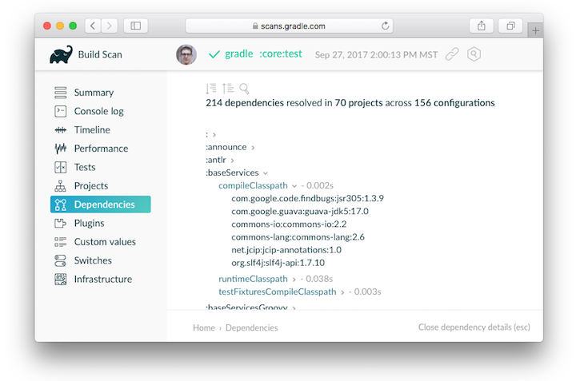
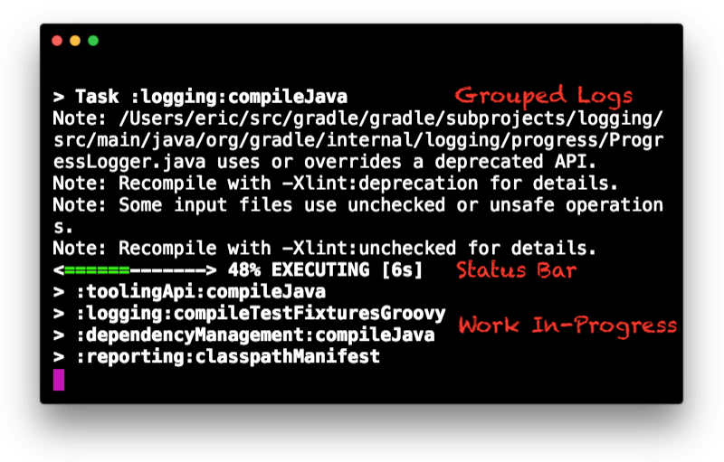

# 命令行界面

内容

  * [执行任务](#执行任务)
  * [常见任务](#常见任务)
  * [项目报告](#项目报告)
  * [命令行完成](#命令行完成)
  * [调试选项](#调试选项)
  * [性能选项](#性能选项)
  * [记录选项](#记录选项)
  * [执行选项](#执行选项)
  * [环境选项](#环境选项)
  * [引导新项目](#引导新项目)
  * [持续构建](#持续构建)

命令行界面是与Gradle交互的主要方法之一。以下内容作为执行和自定义Gradle使用命令行或编写脚本或配置持续集成时的参考。

强烈建议使用[Gradle Wrapper](/md/gradle_wrapper.md#gradle_wrapper)。您应该取代`./gradlew`或`gradlew.bat`为`gradle`使用包装时，在所有下面的例子。

在命令行上执行Gradle符合以下结构。任务名称之前和之后均允许使用选项。

    
    
    gradle [taskName ...] [--option-name ...]

如果指定了多个任务，则应以空格分隔。

可以`=`在选项和参数之间指定是否接受接受值的选项。但是，`=`建议使用。

    
    
    --console=plain

启用行为的选项具有长形式的选项，并带有由指定的反函数`--no-`。以下是相反的情况。

    
    
    --build-cache
    --no-build-cache

许多长格式期权具有短期权等价物。以下是等效的：

    
    
    --help
    -h

╔═════════════════════════════  

可以在其中指定许多命令行标志，`gradle.properties`以避免需要键入。有关详细信息，请参见《[配置构建环境指南](/md/Gradle环境搭建.md#Gradle属性)》。  
  
╚═════════════════════════════    
  
以下各节介绍了Gradle命令行界面的使用，大致按用户目标分组。一些插件还添加了自己的命令行选项，例如[`--tests`Java测试过滤](/md/在Java和JVM项目中进行测试.md#测试过滤)。有关为您自己的任务公开命令行选项的更多信息，请参阅《[声明和使用命令行选项》](/md/开发自定义Gradle任务类型.md#声明和使用命令行选项)。

## [执行任务](#执行任务)

您可以运行任务及其所有[依赖项](/md/构建脚本基础.md#任务依赖性)。

    
    
    $ gradle myTask

您可以在“[项目报告”部分中](#项目报告)了解哪些项目和任务可用。

大多数构建都支持一组常见的任务，称为[
_生命周期任务_](/md/处理任务.md#生命周期任务)
。这些措施包括`build`，`assemble`和`check`任务。

### [在多项目构建中执行任务](#在多项目构建中执行任务)

在[多项目构建中](/md/执行多项目构建.md#intro_multi_project_builds)，子项目任务可以使用“：”执行，以分隔子项目名称和任务名称。
_从根项目运行时_ ，以下内容等效。

    
    
    $ gradle：my-subproject：taskName
    $ gradle my-subproject：taskName

您也可以仅使用任务名称为所有子项目运行任务。例如，当从根项目目录中调用时，这将对所有子项目运行“测试”任务。

    
    
    $ gradle test

从子项目中调用Gradle时，应省略项目名称：

    
    
    $ cd my-subproject
    $ gradle taskName

╔═════════════════════════════  

从子项目执行Gradle Wrapper时，必须`gradlew`相对引用。例如：`../gradlew
taskName`。[gdub](http://www.gdub.rocks/)社区[项目](http://www.gdub.rocks/)旨在使此操作更加方便。  
  
╚═════════════════════════════    
  
### [执行多项任务](#执行多项任务)

您还可以指定多个任务。例如，以下命令将按命令行中列出的顺序执行`test`和`deploy`任务，还将执行每个任务的依赖关系。

    
    
    $ gradle test deploy

### [从执行中排除任务](#从执行中排除任务)

您可以使用`-x`或`--exclude-task`命令行选项并提供要排除的任务的名称来排除正在执行的任务。

图1.简单任务图

排除任务

    
    
    $ gradle dist --exclude-task test
    
    > Task :compile
    compiling source
    
    > Task :dist
    building the distribution
    
    BUILD SUCCESSFUL in 0s
    2 actionable tasks: 2 executed

您可以看到`test`任务没有执行，即使它是`dist`任务的依赖项。该`test`任务的相关性，如`compileTest`都不会执行。`test`诸如的其他任务所需的那些依赖关系`compile`仍将执行。

### [强制执行任务](#强制执行任务)

您可以使用以下选项强制Gradle执行所有任务，而忽略[最新检查](/md/处理任务.md#检查最新（又称增量构建）)`--rerun-
tasks`：

    
    
    $ gradle test --rerun-tasks

这将强制执行`test`和 _所有_ 任务相关性`test`。有点像运行`gradle clean test`，但是没有删除生成的生成输出。

### [发生故障时继续构建](#发生故障时继续构建)

默认情况下，Gradle将中止执行并在任何任务失败后立即使构建失败。这样可以使构建更快完成，但可以隐藏其他可能发生的故障。为了在一次构建执行中发现尽可能多的故障，可以使用该`--continue`选项。

    
    
    $ gradle test --continue

当执行`--continue`，Gradle将执行 _每一个_
将要执行的任务，所有的，而不是只要遇到第一个故障停止依赖该任务无故障完成。每个遇到的故障将在构建结束时报告。

如果任务失败，则将不执行任何依赖于该任务的后续任务。例如，如果被测代码中的编译失败，则测试将不会运行。因为测试任务（直接或间接）取决于编译任务。

### [名称缩写](#名称缩写)

在命令行上指定任务时，不必提供任务的全名。您只需要提供足够的任务名称即可唯一地标识任务。例如，`gradle
che`Gradle识别`check`任务就足够了。

项目名称也是如此。您可以使用命令`check`在`library`子项目中执行任务`gradle lib:che`。

您可以使用[驼峰大小写](https://en.wikipedia.org/wiki/Camel_case)模式来表示更复杂的缩写。这些模式被扩展以匹配骆驼案例和[烤肉串案例](https://en.wikipedia.org/wiki/Kebab_case)名称。例如，模式`foBa`（或什至`fB`）匹配`fooBar`和`foo-
bar`。

更具体地说，您可以使用以下命令`compileTest`在`my-awesome-library`子项目中运行任务`gradle mAL:cT`。

项目和任务名称的缩写

    
    
    $ gradle  mAL:cT
    
    > Task :my-awesome-library:compileTest
    compiling unit tests
    
    BUILD SUCCESSFUL in 0s
    1 actionable task: 1 executed

您也可以将这些缩写与-x命令行选项一起使用。

## [常见任务](#常见任务)

以下是内置和大多数主要Gradle插件应用的任务约定。

### [计算所有输出](#计算所有输出)

在Gradle构建中，通常的`build`任务是指定组装所有输出并运行所有检查。

    
    
    $ gradle build

### [运行应用程序](#运行应用程序)

应用程序通常与`run`任务一起运行，该任务将组装应用程序并执行一些脚本或二进制文件。

    
    
    $ gradle run

### [运行所有检查](#运行所有检查)

使用该任务执行 _所有_ 验证任务（包括测试和棉绒）是很常见的`check`。

    
    
    $ gradle check

### [清洁输出](#清洁输出)

您可以使用`clean`任务删除构建目录的内容，尽管这样做会导致丢失预先计算的输出，从而导致后续任务执行需要大量额外的构建时间。

    
    
    $ gradle clean

## [项目报告](#项目报告)

Gradle提供了一些内置任务，这些任务显示了构建的特定细节。这对于理解构建的结构和依赖性以及调试问题很有用。

您可以使用来获得有关可用报告选项的基本帮助`gradle help`。

### [上市项目](#上市项目)

通过运行`gradle projects`，您可以显示所选项目的子项目列表，以层次结构显示。

    
    
    $ gradle projects

您还可以在构建扫描中获得项目报告。了解有关[创建构建扫描的](https://scans.gradle.com/)更多信息。

### [上市任务](#上市任务)

通过运行`gradle tasks`，可以列出所选项目的主要任务。该报告显示项目的默认任务（如果有）以及每个任务的描述。

    
    
    $ gradle tasks

默认情况下，此报告仅显示已分配给任务组的那些任务。您可以使用该`--all`选项在任务列表中获取更多信息。

    
    
    $ gradle tasks --all

如果需要更精确，则可以使用该`--group`选项仅显示特定组中的任务。

    
    
    $ gradle tasks --group="build setup"

### [显示任务使用情况详细信息](#显示任务使用情况详细信息)

运行`gradle help --task someTask`为您提供有关特定任务的详细信息。

获取任务的详细帮助

    
    
    $ gradle -q help --task libs
    Detailed task information for libs
    
    Paths
         :api:libs
         :webapp:libs
    
    Type
         Task (org.gradle.api.Task)
    
    Description
         Builds the JAR
    
    Group
         build

此信息包括完整的任务路径，任务类型，可能的命令行选项以及给定任务的描述。

### [报告依赖性](#报告依赖性)

生成扫描会提供完整的可视化报告，说明哪些依赖项存在于哪些配置，可传递依赖项和依赖项版本选择中。

    
    
    $ gradle myTask --scan

这将为您提供基于Web的报告的链接，您可以在其中找到类似的依赖项信息。

在[查看和调试依赖项中](/md/查看和调试依赖项.md)了解更多信息。

### [列出项目依赖项](#列出项目依赖项)

“运行”`gradle
dependencies`为您提供了所选项目的依赖项列表，并按配置进行了细分。对于每种配置，该配置的直接和传递依赖性在树中显示。以下是此报告的示例：

    
    
    $ gradle dependencies

[查看和调试依赖项中](/md/查看和调试依赖项.md)提供了构建脚本和输出的具体示例。

运行`gradle buildEnvironment`可视化所选项目的buildscript依赖关系，类似于`gradle
dependencies`可视化所构建软件的依赖关系。

    
    
    $ gradle buildEnvironment

通过运行`gradle dependencyInsight`，您可以洞悉与指定输入匹配的特定依赖性。

    
    
    $ gradle dependencyInsight

由于依赖性报告可能会很大，因此将报告限制为特定配置可能很有用。这是通过可选`--configuration`参数实现的：

### [列出项目属性](#列出项目属性)

运行`gradle properties`将为您提供所选项目的属性列表。

有关属性的信息

    
    
    $ gradle -q api:properties
    
    ------------------------------------------------------------
    Project :api - The shared API for the application
    ------------------------------------------------------------
    
    allprojects: [project ':api']
    ant: org.gradle.api.internal.project.DefaultAntBuilder@12345
    antBuilderFactory: org.gradle.api.internal.project.DefaultAntBuilderFactory@12345
    artifacts: org.gradle.api.internal.artifacts.dsl.DefaultArtifactHandler_Decorated@12345
    asDynamicObject: DynamicObject for project ':api'
    baseClassLoaderScope: org.gradle.api.internal.initialization.DefaultClassLoaderScope@12345

### [软件模型报告](#软件模型报告)

您可以使用以下任务获得[软件模型](https://docs.gradle.org/6.7.1/userguide/software_model.html#software_model)项目的元素的层次结构视图`model`：

    
    
    $ gradle model

在软件模型文档中了解有关[模型报告的](https://docs.gradle.org/6.7.1/userguide/software_model.html#model-report)更多信息。

## [命令行完成](#命令行完成)

Gradle通过[gradle-completion](https://github.com/gradle/gradle-completion)（单独安装）为任务，选项和Gradle属性提供bash和zsh选项卡[补全支持](https://github.com/gradle/gradle-completion)。

图2. Gradle完成

## [调试选项](#调试选项)

`-?`，`-h`，`--help`

    

显示带有所有可用CLI选项的帮助消息。

`-v`， `--version`

    

打印Gradle，Groovy，Ant，JVM和操作系统版本信息。

`-S`， `--full-stacktrace`

    

打印出完整的（非常详细的）堆栈跟踪信息，以了解任何异常。另请参阅[日志记录选项](#记录选项)。

`-s`， `--stacktrace`

    

还打印出堆栈跟踪信息以了解用户异常（例如，编译错误）。另请参阅[日志记录选项](#记录选项)。

`--scan`

    

使用有关Gradle构建各个方面的详细信息创建[构建扫描](https://gradle.com/build-scans)。

`-Dorg.gradle.debug=true`

    

调试Gradle客户端（非守护程序）进程。`localhost:5005`默认情况下，Gradle将等待您附加调试器。

`-Dorg.gradle.daemon.debug=true`

    

调试[Gradle Daemon](/md/Gradle守护程序.md#gradle_daemon)进程。

## [性能选项](#性能选项)

优化构建性能时，请尝试以下选项。[在此处](https://guides.gradle.org/performance/)了解有关[提高Gradle构建的性能的](https://guides.gradle.org/performance/)更多信息。

可以在其中指定许多这些选项，`gradle.properties`因此不需要命令行标志。请参阅《[配置构建环境指南》](/md/Gradle环境搭建.md#Gradle属性)。

`--build-cache`， `--no-build-cache`

    

切换[Gradle构建缓存](/md/构建缓存.md#build_cache)。Gradle将尝试重用以前版本的输出。
_默认为关闭_ 。

`--configure-on-demand`， `--no-configure-on-demand`

    

切换[按需配置](/md/配置时间和执行时间.md#按需配置)。在此构建运行中仅配置相关项目。
_默认为关闭_ 。

`--max-workers`

    

设置Gradle可以使用的最大工人数。 _默认值为处理器数量_ 。

`--parallel`， `--no-parallel`

    

并行构建项目。有关此选项的限制，请参见[并行项目执行](/md/配置时间和执行时间.md#并行项目执行)。
_默认为关闭_ 。

`--priority`

    

指定Gradle守护程序及其启动的所有进程的调度优先级。值是`normal`或`low`。 _默认为正常_ 。

`--profile`

    

在`$buildDir/reports/profile`目录中生成高级性能报告。`--scan`是首选。

`--scan`

    

生成带有详细性能诊断的构建扫描。

`--watch-fs`， `--no-watch-fs`

    

切换[观看文件系统](/md/Gradle守护程序.md#观看文件系统)。允许Gradle在下一个版本中重用有关文件系统的信息。
_默认为关闭_ 。

### [Gradle守护程序选项](#Gradle守护程序选项)

您可以通过以下命令行选项管理[Gradle守护程序](/md/Gradle守护程序.md#gradle_daemon)。

`--daemon`， `--no-daemon`

    

使用[Gradle守护程序](/md/Gradle守护程序.md#gradle_daemon)运行构建。如果守护程序未运行或现有守护程序繁忙，则启动该守护程序。
_默认为on_ 。

`--foreground`

    

在前台进程中启动Gradle守护程序。

`--status` （独立命令）

    

运行`gradle --status`以列出正在运行的和最近停止的Gradle守护程序。仅显示相同Gradle版本的守护程序。

`--stop` （独立命令）

    

运行`gradle --stop`以停止所有相同版本的Gradle守护程序。

`-Dorg.gradle.daemon.idletimeout=(number of milliseconds)`

    

在这段毫秒的空闲时间后，Gradle守护程序将自行停止。 _默认值为10800000_ （3小时）。

## [记录选项](#记录选项)

### [设置日志级别](#设置日志级别)

您可以使用以下选项来自定义Gradle日志记录的详细程度，顺序从最小详细到最大详细。在[日志记录文档中](/md/使用记录.md#logging)了解更多[信息](/md/使用记录.md#logging)。

`-Dorg.gradle.logging.level=(quiet,warn,lifecycle,info,debug)`

    

通过Gradle属性设置日志记录级别。

`-q`， `--quiet`

    

仅记录错误。

`-w`， `--warn`

    

将日志级别设置为警告。

`-i`， `--info`

    

将日志级别设置为info。

`-d`， `--debug`

    

登录调试模式（包括正常的stacktrace）。

生命周期是默认日志级别。

### [自定义日志格式](#自定义日志格式)

您可以通过以下方式指定“控制台”模式来控制丰富输出（颜色和字体变体）的使用：

`-Dorg.gradle.console=(auto,plain,rich,verbose)`

    

通过Gradle属性指定控制台模式。下文将介绍不同的模式。

`--console=(auto,plain,rich,verbose)`

    

指定要生成的控制台输出的类型。

设置为`plain`仅生成纯文本。此选项禁用控制台输出中的所有颜色和其他丰富输出。当Gradle _未_ 连接到终端时，这是默认设置。

设置为`auto`（默认值）以在将构建过程附加到控制台时在控制台输出中启用颜色和其他丰富的输出，或者仅在未附加到控制台时才生成纯文本。
_当Gradle连接到终端时，这是默认设置。_

设置为`rich`在控制台输出中启用颜色和其他丰富的输出，而不管构建过程是否未附加到控制台。如果未附加到控制台，则构建输出将使用ANSI控制字符来生成丰富的输出。

设置为`verbose`启用颜色和其他丰富的输出（如）`rich`，但在生命周期日志级别输出任务名称和结果，如在Gradle
3.5和更早版本中的默认设置一样。

### [显示或隐藏警告](#显示或隐藏警告)

默认情况下，Gradle不会显示所有警告（例如，弃用警告）。相反，Gradle将收集它们并在构建结束时呈现摘要，如下所示：

    
    
    在此版本中使用了不推荐使用的Gradle功能，使其与Gradle 5.0不兼容。

您可以使用以下选项在控制台上控制警告的详细程度：

`-Dorg.gradle.warning.mode=(all,fail,none,summary)`

    

通过[Gradle属性](/md/Gradle环境搭建.md#Gradle属性)指定警告模式。下文将介绍不同的模式。

`--warning-mode=(all,fail,none,summary)`

    

指定如何记录警告。默认值为`summary`。

设置为`all`记录所有警告。

设置为`fail`记录所有警告，如果有警告，则使构建失败。

设置为`summary`禁止显示所有警告，并在构建结束时记录摘要。

设置为`none`禁止显示所有警告，包括构建结束时的摘要。

### [丰富控制台](#丰富控制台)

运行构建时，Gradle的丰富控制台会显示更多信息。

特征：

  * 进度条和计时器直观地描述了整体状态

  * 下面的并行工作行描述了现在正在发生的事情

  * 颜色和字体用于突出显示重要的输出和错误

## [执行选项](#执行选项)

以下选项通过更改生成的内容或解决依赖关系的方式来影响生成的执行方式。

`--include-build`

    

将构建作为组合运行，包括指定的构建。参见[Composite
Builds](/md/复合构建.md#composite_builds)。

`--offline`

    

指定构建应在不访问网络资源的情况下运行。了解有关[覆盖依赖项缓存的选项的](/md/处理随时间变化的版本.md#从命令行控制依赖项缓存)更多信息。

`--refresh-dependencies`

    

刷新依赖项状态。在[依赖管理文档中](/md/处理随时间变化的版本.md#从命令行控制依赖项缓存)了解有关如何使用它的更多信息。

`--dry-run`

    

在禁用所有任务操作的情况下运行Gradle。使用它来显示将要执行的任务。

`--write-locks`

    

表示所有 _可锁定的_ 已解析配置都应 _保留_
其锁定状态。了解更多有关[依赖锁定的信息](/md/锁定依赖版本.md#dependency-
locking)。

`--update-locks <group:name>[,<group:name>]*`

    

指示必须在锁定文件中更新指定模块的版本。该标志也暗示`--write-
locks`。了解更多有关[依赖锁定的信息](/md/锁定依赖版本.md#dependency-
locking)。

`--no-rebuild`

    

不要重建项目依赖项。对于[调试和微调`buildSrc`](/md/组织Gradle项目.md#用`buildSrc`抽象逻辑势在必行)很有用，但可能导致错误的结果。请谨慎使用！

## [环境选项](#环境选项)

您可以通过以下选项自定义许多方面，以了解构建脚本，设置，缓存等的位置。了解有关自定义[构建环境的](/md/Gradle环境搭建.md#build_environment)更多信息。

`-b`， `--build-file`

    

指定构建文件。例如：`gradle --build-
file=foo.gradle`。默认为`build.gradle`，然后`build.gradle.kts`，然后`myProjectName.gradle`。

`-c`， `--settings-file`

    

指定设置文件。例如：`gradle --settings-file=somewhere/else/settings.gradle`

`-g`， `--gradle-user-home`

    

指定Gradle用户的主目录。默认值为`.gradle`用户主目录中的目录。

`-p`， `--project-dir`

    

指定Gradle的起始目录。默认为当前目录。

`--project-cache-dir`

    

指定特定于项目的缓存目录。默认值`.gradle`在根项目目录中。

`-D`， `--system-prop`

    

设置JVM的系统属性，例如`-Dmyprop=myvalue`。请参阅[系统属性](/md/Gradle环境搭建.md#系统属性)。

`-I`， `--init-script`

    

指定初始化脚本。请参阅[初始化脚本](/md/初始化脚本.md#init_scripts)。

`-P`， `--project-prop`

    

设置根项目的项目属性，例如`-Pmyprop=myvalue`。请参阅[项目属性](/md/Gradle环境搭建.md#项目属性)。

`-Dorg.gradle.jvmargs`

    

设置JVM参数。

`-Dorg.gradle.java.home`

    

设置JDK主目录。

## [引导新项目](#引导新项目)

### [创建新的Gradle版本](#创建新的Gradle版本)

使用内置`gradle init`任务创建带有新项目或现有项目的新Gradle构建。

    
    
    $ gradle init

大多数情况下，您需要指定项目类型。可用的类型包括`basic`（默认）， ，`java-library`，`java-
application`和更多。有关详细信息，请参见[init插件文档](https://docs.gradle.org/6.7.1/userguide/build_init_plugin.html#build_init_plugin)。

    
    
    $ gradle init --type java-library

### [标准化和配置Gradle](#标准化和配置Gradle)

内置`gradle wrapper`任务生成一个脚本，该脚本`gradlew`调用Gradle的声明版本，并在必要时预先下载它。

    
    
    $ gradle wrapper --gradle-version = 4.4

您还可以指定`--distribution-type=(bin|all)`，`--gradle-distribution-url`，`--gradle-
distribution-sha256-sum`除了`--gradle-
version`。有关如何使用这些选项的完整详细信息，请参见[Gradle Wrapper部分](/md/gradle_wrapper.md#gradle_wrapper)。

## [持续构建](#持续构建)

连续构建允许您在任务输入更改时自动重新执行所请求的任务。

例如，您可以`test`通过运行以下命令连续运行任务和所有相关任务：

    
    
    $ gradle test --continuous

Gradle的行为就像您`gradle
test`在更改有助于所请求任务的源代码或测试之后运行时一样。这意味着无关的更改（例如，对构建脚本的更改）将不会触发重建。为了合并构建逻辑更改，必须手动重新启动连续构建。

### [终止连续构建](#终止连续构建)

如果Gradle附加到交互式输入源（例如终端），则可以通过按退出连续构建`CTRL-D`（在Microsoft
Windows上，还需要按`ENTER`或`RETURN`之后`CTRL-D`）。如果Gradle没有连接到交互式输入源（例如，作为脚本的一部分运行），则必须终止构建过程（例如，使用`kill`命令或类似命令）。如果构建是通过Tooling
API执行的，则可以使用Tooling API的取消机制来取消构建。

### [局限性和怪癖](#局限性和怪癖)

当前连续构建的实现要注意几个问题。这些可能会在将来的Gradle版本中解决。

#### [建造周期](#建造周期)

Gradle在任务执行之前就开始监视更改。如果任务在执行时修改了自己的输入，Gradle将检测到更改并触发新的构建。如果每次执行任务时都再次修改输入，则构建将再次触发。这对于连续构建并不是唯一的。如果没有连续构建而“正常”运行，修改其自身输入的任务将永远不会被认为是最新的。

如果您的构建进入这样的构建周期，则可以通过查看Gradle报告的已更改文件列表来跟踪任务。在确定每次构建过程中更改的文件后，您应该寻找一个以该文件为输入的任务。在某些情况下，这可能是显而易见的（例如，使用编译Java文件`compileJava`）。在其他情况下，您可以使用`--info`日志记录来查找由于标识文件而过时的任务。

#### [Java_9的限制](#持续构建_limitations_jdk9)

由于与Java 9相关的类访问限制，Gradle无法设置某些特定于操作系统的选项，这意味着：

  * 在macOS上，Gradle会每10秒而不是每2秒轮询一次文件更改。

  * 在Windows上，Gradle必须使用单独的文件监视（例如在Linux / Mac OS上），这可能会导致连续构建无法在非常大的项目上运行。

#### [性能稳定](#性能稳定)

JDK文件监视功能依赖于macOS上低效的文件系统轮询（请参阅：[JDK-7133447](https://bugs.openjdk.java.net/browse/JDK-7133447)）。这会大大延迟具有许多源文件的大型项目的更改通知。

另外，监视机制可能会在macOS上的 _高_
负载下死锁（请参阅：[JDK-8079620](https://bugs.openjdk.java.net/browse/JDK-8079620)）。这将显示为Gradle似乎没有注意到文件更改。如果您怀疑发生这种情况，请退出连续构建并重新开始。

在Linux上，OpenJDK的文件监视服务实现有时会丢失文件系统事件（请参阅：[JDK-8145981](https://bugs.openjdk.java.net/browse/JDK-8145981)）。

#### [更改符号链接](#更改符号链接)

  * 创建或删除文件的符号链接将启动构建。

  * 修改符号链接的目标不会导致重建。

  * 创建或删除目录的符号链接不会导致重建。

  * 在符号链接的目标目录中创建新文件不会导致重建。

  * 删除目标目录不会导致重建。

#### [不考虑更改构建逻辑](#不考虑更改构建逻辑)

当前的实现不会在后续构建中重新计算构建模型。这意味着有效地忽略了对任务配置的更改或对构建模型的任何其他更改。

