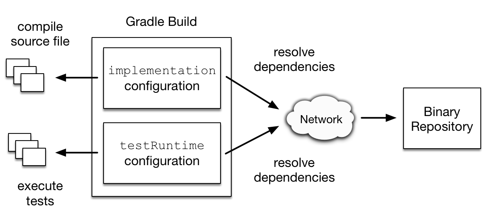
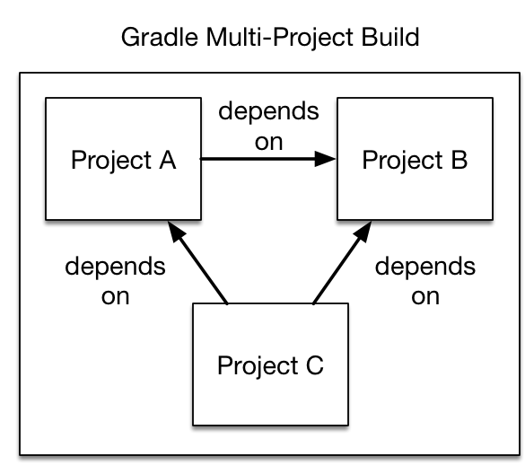

# 声明依赖

内容

  * [什么是依赖项配置](#%E4%BB%80%E4%B9%88%E6%98%AF%E4%BE%9D%E8%B5%96%E9%A1%B9%E9%85%8D%E7%BD%AE)
  * [可解析和消耗性配置](#%E5%8F%AF%E8%A7%A3%E6%9E%90%E5%92%8C%E6%B6%88%E8%80%97%E6%80%A7%E9%85%8D%E7%BD%AE)
  * [为依赖项选择正确的配置](#%E4%B8%BA%E4%BE%9D%E8%B5%96%E9%A1%B9%E9%80%89%E6%8B%A9%E6%AD%A3%E7%A1%AE%E7%9A%84%E9%85%8D%E7%BD%AE)
  * [定义自定义配置](#%E5%AE%9A%E4%B9%89%E8%87%AA%E5%AE%9A%E4%B9%89%E9%85%8D%E7%BD%AE)
  * [不同种类的依赖](#%E4%B8%8D%E5%90%8C%E7%A7%8D%E7%B1%BB%E7%9A%84%E4%BE%9D%E8%B5%96)
  * [记录依赖性](#%E8%AE%B0%E5%BD%95%E4%BE%9D%E8%B5%96%E6%80%A7)
  * [通过模块依赖性解决特定工件](#%E9%80%9A%E8%BF%87%E6%A8%A1%E5%9D%97%E4%BE%9D%E8%B5%96%E6%80%A7%E8%A7%A3%E5%86%B3%E7%89%B9%E5%AE%9A%E5%B7%A5%E4%BB%B6)
  * [支持的元数据格式](#%E6%94%AF%E6%8C%81%E7%9A%84%E5%85%83%E6%95%B0%E6%8D%AE%E6%A0%BC%E5%BC%8F)

在查看依赖项声明本身之前，需要定义 _依赖项配置_ 的概念。

## [什么是依赖项配置](#%E4%BB%80%E4%B9%88%E6%98%AF%E4%BE%9D%E8%B5%96%E9%A1%B9%E9%85%8D%E7%BD%AE)

为Gradle项目声明的每个依赖项都适用于特定范围。例如，某些依赖项应用于编译源代码，而其他依赖项仅需要在运行时可用。Gradle在[Configuration](https://docs.gradle.org/6.7.1/dsl/org.gradle.api.artifacts.Configuration.html)的帮助下表示依赖项的范围。每个配置都可以通过唯一的名称来标识。

许多Gradle插件会向您的项目添加预定义的配置。例如，Java插件添加了一些配置，以表示其用于源代码编译，执行测试等所需的各种类路径。有关示例，请参见[Java插件章节](https://docs.gradle.org/6.7.1/userguide/java_plugin.html#sec:java_plugin_and_dependency_management)。

图1.配置将声明的依赖项用于特定目的

有关使用配置导航，检查和后处理分配的依赖项的元数据和工件的更多示例，请查看[解析结果API](/md/%E4%BA%86%E8%A7%A3%E4%BE%9D%E8%B5%96%E6%80%A7%E8%A7%A3%E6%9E%90.md%23%E4%BB%A5%E7%BC%96%E7%A8%8B%E6%96%B9%E5%BC%8F%E8%AE%BF%E9%97%AE%E5%88%86%E8%BE%A8%E7%8E%87%E7%BB%93%E6%9E%9C)。

### [配置继承和组合](#%E9%85%8D%E7%BD%AE%E7%BB%A7%E6%89%BF%E5%92%8C%E7%BB%84%E5%90%88)

一个配置可以扩展其他配置以形成继承层次结构。子配置继承为其任何超配置声明的整个依赖项集。

Gradle核心插件（如[Java插件](https://docs.gradle.org/6.7.1/userguide/java_plugin.html#sec:java_plugin_and_dependency_management)）大量使用配置继承。例如，`testImplementation`配置扩展了`implementation`配置。配置层次结构有一个实际目的：编译测试需要在编写测试类所需的依赖之上加上被测源代码的依赖。如果将其类导入到生产源代码中，则使用JUnit编写和执行测试代码的Java项目也需要Guava。

图2. Java插件提供的配置继承

在[幕后](https://docs.gradle.org/6.7.1/dsl/org.gradle.api.artifacts.Configuration.html#org.gradle.api.artifacts.Configuration:extendsFrom\(org.gradle.api.artifacts.Configuration\[\]\))，`testImplementation`and`implementation`配置通过调用[Configuration.extendsFrom（org.gradle.api.artifacts.Configuration[]）](https://docs.gradle.org/6.7.1/dsl/org.gradle.api.artifacts.Configuration.html#org.gradle.api.artifacts.Configuration:extendsFrom\(org.gradle.api.artifacts.Configuration\[\]\))方法形成继承层次结构。配置可以扩展任何其他配置，无论其在构建脚本或插件中的定义如何。

假设您想编写一套烟雾测试。每个冒烟测试都会进行HTTP调用以验证Web服务端点。作为基础测试框架，该项目已使用JUnit。您可以定义一个名为的新配置`smokeTest`，该`testImplementation`配置从配置扩展为重用现有的测试框架依赖性。

示例1.从另一个配置扩展一个配置

`Groovy``Kotlin`

build.gradle

    
    
    configurations {
        smokeTest.extendsFrom testImplementation
    }
    
    dependencies {
        testImplementation 'junit:junit:4.13'
        smokeTest 'org.apache.httpcomponents:httpclient:4.5.5'
    }

build.gradle.kts

    
    
    val smokeTest by configurations.creating {
        extendsFrom(configurations.testImplementation.get())
    }
    
    dependencies {
        testImplementation("junit:junit:4.13")
        smokeTest("org.apache.httpcomponents:httpclient:4.5.5")
    }

## [可解析和消耗性配置](#%E5%8F%AF%E8%A7%A3%E6%9E%90%E5%92%8C%E6%B6%88%E8%80%97%E6%80%A7%E9%85%8D%E7%BD%AE)

配置是Gradle中依赖关系解析的基本部分。在依赖关系解析的上下文中，区分 _消费者_ 和 _生产者_ 非常有用。按照这些原则，配置至少具有3个不同的角色：

  1. 声明依赖

  2. 作为 _使用者_ ，解决对文件的一组依赖关系

  3. 作为 _生产者_ ，将工件及其依赖项公开以供其他项目使用（此类 _消耗性_ 配置通常表示生产者向其消费者提供的[变体](/md/使用变体属性.md)）

例如，要表达一个应用程序`app` _依赖_ library `lib`， _至少_ 需要一种配置：

例子2.配置用来声明依赖

`Groovy``Kotlin`

build.gradle

    
    
    configurations {
        // declare a "configuration" named "someConfiguration"
        someConfiguration
    }
    dependencies {
        // add a project dependency to the "someConfiguration" configuration
        someConfiguration project(":lib")
    }

build.gradle.kts

    
    
    // declare a "configuration" named "someConfiguration"
    val someConfiguration by configurations.creating
    
    dependencies {
        // add a project dependency to the "someConfiguration" configuration
        someConfiguration(project(":lib"))
    }

配置可以通过扩展从其他配置继承依赖关系。现在，请注意，上面的代码没有告诉我们有关此配置的目标 _使用者_ 的任何信息。特别是，它并没有告诉我们该配置是如何
_使用的_
。假设这`lib`是一个Java库：它可能会公开不同的内容，例如其API，实现或测试装置。可能有必要`app`根据我们正在执行的任务来改变我们解决依赖关系的方式（针对的API进行编译`lib`，执行应用程序，编译测试等）。为了解决这个问题，您经常会找到伴随的配置，这些配置旨在明确声明其用法：

例子3.代表具体依赖图的配置

`Groovy``Kotlin`

build.gradle

    
    
    configurations {
        // declare a configuration that is going to resolve the compile classpath of the application
        compileClasspath.extendsFrom(someConfiguration)
    
        // declare a configuration that is going to resolve the runtime classpath of the application
        runtimeClasspath.extendsFrom(someConfiguration)
    }

build.gradle.kts

    
    
    configurations {
        // declare a configuration that is going to resolve the compile classpath of the application
        compileClasspath.extendsFrom(someConfiguration)
    
        // declare a configuration that is going to resolve the runtime classpath of the application
        runtimeClasspath.extendsFrom(someConfiguration)
    }

在这一点上，我们有3种具有不同角色的不同配置：

  * `someConfiguration`声明我的应用程序的依赖关系。这只是一个可以保存依赖项列表的存储桶。

  * `compileClasspath`并且`runtimeClasspath`是 _要解析的_ 配置：解析后，它们应分别包含应用程序的编译类路径和运行时类路径。

这种区别由类型中的`canBeResolved`标志表示`Configuration`。是的配置 _可以解决_
是我们可以计算一个依赖关系图，因为它包含了所有分辨率发生的必要信息的配置。也就是说，我们将计算一个依赖图，解析图中的组件，并最终获得工件。`canBeResolved`设置为的配置`false`并不意味着要解决。这样的配置
_仅用于声明依赖项_ 。原因是根据使用情况（编译类路径，运行时类路径），它 _可以_
解析为不同的图。尝试解决已`canBeResolved`设置为的配置是错误的`false`。在某种程度上，这类似于不应实例化的 _抽象类_
（`canBeResolved`= false），以及扩展抽象类（`canBeResolved`=
true）的具体类。可解析的配置将扩展至少一个不可解析的配置（并且可能会扩展多个）。

另一方面，在Library项目方面（ _生产者_
），我们还使用配置来表示可以消耗的东西。例如，该库可能会公开一个API或运行时，并且我们会将工件附加到一个或多个。通常，要针对进行编译`lib`，我们需要的API
`lib`，但不需要其运行时依赖项。因此，该`lib`项目将公开一个`apiElements`配置，该配置针对正在寻找其API的消费者。这样的配置是消耗性的，但并不意味着必须解决。这通过a的
_canBeConsumed_ 标志表示`Configuration`：

示例4.设置配置

`Groovy``Kotlin`

build.gradle

    
    
    configurations {
        // A configuration meant for consumers that need the API of this component
        exposedApi {
            // This configuration is an "outgoing" configuration, it's not meant to be resolved
            canBeResolved = false
            // As an outgoing configuration, explain that consumers may want to consume it
            canBeConsumed = true
        }
        // A configuration meant for consumers that need the implementation of this component
        exposedRuntime {
            canBeResolved = false
            canBeConsumed = true
        }
    }

build.gradle.kts

    
    
    configurations {
        // A configuration meant for consumers that need the API of this component
        create("exposedApi") {
            // This configuration is an "outgoing" configuration, it's not meant to be resolved
            isCanBeResolved = false
            // As an outgoing configuration, explain that consumers may want to consume it
            isCanBeConsumed = true
        }
        // A configuration meant for consumers that need the implementation of this component
        create("exposedRuntime") {
            isCanBeResolved = false
            isCanBeConsumed = true
        }
    }

简而言之，配置的角色由`canBeResolved`和`canBeConsumed`标志组合确定：

表1.配置角色

配置角色|可以解决|可以食用  
---|---|---  
依赖桶|假|假  
解决某些用途|真正|假  
暴露给消费者|假|真正  
旧版，请勿使用|真正|真正  
  
为了向后兼容，两个标志的默认值均为`true`，但是作为插件作者，您应始终为这些标志确定正确的值，否则可能会意外引入解析错误。

## [为依赖项选择正确的配置](#%E4%B8%BA%E4%BE%9D%E8%B5%96%E9%A1%B9%E9%80%89%E6%8B%A9%E6%AD%A3%E7%A1%AE%E7%9A%84%E9%85%8D%E7%BD%AE)

声明依赖项的配置的选择很重要。但是，没有固定的规则必须将依赖项放入哪个配置中。它主要取决于配置的组织方式，这通常是所应用插件的属性。

例如，在`java`插件中，创建的配置已[记录在案，](https://docs.gradle.org/6.7.1/userguide/java_plugin.html#tab:configurations)并应根据其在代码中的作用，作为确定在哪里声明依赖项的基础。

作为建议，插件应明确记录其配置链接在一起的方式，并应尽最大努力隔离其[角色](#sec:resolvable-
consumable-configs)。

## [定义自定义配置](#%E5%AE%9A%E4%B9%89%E8%87%AA%E5%AE%9A%E4%B9%89%E9%85%8D%E7%BD%AE)

您可以自己定义配置，即所谓的 _自定义配置_ 。定制配置对于分离专用目的所需的依赖项范围很有用。

比方说，你想声明的依赖[碧玉Ant任务](https://tomcat.apache.org/tomcat-9.0-doc/jasper-howto.html)为应预编译JSP文件的目的 _不是_ 在classpath最终编译源代码。通过引入自定义配置并在任务中使用它来实现该目标相当简单。

例子5.声明和使用定制配置

`Groovy``Kotlin`

build.gradle

    
    
    configurations {
        jasper
    }
    
    repositories {
        mavenCentral()
    }
    
    dependencies {
        jasper 'org.apache.tomcat.embed:tomcat-embed-jasper:9.0.2'
    }
    
    task preCompileJsps {
        doLast {
            ant.taskdef(classname: 'org.apache.jasper.JspC',
                        name: 'jasper',
                        classpath: configurations.jasper.asPath)
            ant.jasper(validateXml: false,
                       uriroot: file('src/main/webapp'),
                       outputDir: file("$buildDir/compiled-jsps"))
        }
    }

build.gradle.kts

    
    
    val jasper by configurations.creating
    
    repositories {
        mavenCentral()
    }
    
    dependencies {
        jasper("org.apache.tomcat.embed:tomcat-embed-jasper:9.0.2")
    }
    
    tasks.register("preCompileJsps") {
        doLast {
            ant.withGroovyBuilder {
                "taskdef"("classname" to "org.apache.jasper.JspC",
                          "name" to "jasper",
                          "classpath" to jasper.asPath)
                "jasper"("validateXml" to false,
                         "uriroot" to file("src/main/webapp"),
                         "outputDir" to file("$buildDir/compiled-jsps"))
            }
        }
    }

项目的配置由`configurations`对象管理。配置具有名称，并且可以相互扩展。要了解有关此API的更多信息，请查看[ConfigurationContainer](https://docs.gradle.org/6.7.1/dsl/org.gradle.api.artifacts.ConfigurationContainer.html)。

## [不同种类的依赖](#%E4%B8%8D%E5%90%8C%E7%A7%8D%E7%B1%BB%E7%9A%84%E4%BE%9D%E8%B5%96)

### [模块依赖](#%E6%A8%A1%E5%9D%97%E4%BE%9D%E8%B5%96)

模块依赖性是最常见的依赖性。它们引用存储库中的模块。

例子6.模块依赖

`Groovy``Kotlin`

build.gradle

    
    
    dependencies {
        runtimeOnly group: 'org.springframework', name: 'spring-core', version: '2.5'
        runtimeOnly 'org.springframework:spring-core:2.5',
                'org.springframework:spring-aop:2.5'
        runtimeOnly(
            [group: 'org.springframework', name: 'spring-core', version: '2.5'],
            [group: 'org.springframework', name: 'spring-aop', version: '2.5']
        )
        runtimeOnly('org.hibernate:hibernate:3.0.5') {
            transitive = true
        }
        runtimeOnly group: 'org.hibernate', name: 'hibernate', version: '3.0.5', transitive: true
        runtimeOnly(group: 'org.hibernate', name: 'hibernate', version: '3.0.5') {
            transitive = true
        }
    }

build.gradle.kts

    
    
    dependencies {
        runtimeOnly(group = "org.springframework", name = "spring-core", version = "2.5")
        runtimeOnly("org.springframework:spring-aop:2.5")
        runtimeOnly("org.hibernate:hibernate:3.0.5") {
            isTransitive = true
        }
        runtimeOnly(group = "org.hibernate", name = "hibernate", version = "3.0.5") {
            isTransitive = true
        }
    }

有关更多示例和完整参考，请参阅API文档中的[DependencyHandler](https://docs.gradle.org/6.7.1/dsl/org.gradle.api.artifacts.dsl.DependencyHandler.html)类。

Gradle为模块依赖性提供了不同的表示法。有一个字符串符号和一个映射符号。模块依赖性具有允许进一步配置的API。看一看[ExternalModuleDependency，](https://docs.gradle.org/6.7.1/javadoc/org/gradle/api/artifacts/ExternalModuleDependency.html)以了解有关API的全部信息。该API提供了属性和配置方法。通过字符串符号，您可以定义属性的子集。使用地图符号可以定义所有属性。要使用映射或字符串表示法访问完整的API，可以将单个依赖项与闭包一起分配给配置。

╔═════════════════════════════  

如果要声明模块依赖，Gradle查找模块元数据文件（`.module`，`.pom`或`ivy.xml`）的存储库。如果存在这样的模块元数据文件，则对其进行解析，并下载该模块的工件（例如`hibernate-3.0.5.jar`）及其依赖项（例如`cglib`）。如果不存在这样的模块元数据文件，那么从Gradle
6.0开始，您需要配置[元数据源定义](/md/%E5%A3%B0%E6%98%8E%E5%AD%98%E5%82%A8%E5%BA%93.md%23%E6%94%AF%E6%8C%81%E7%9A%84%E5%85%83%E6%95%B0%E6%8D%AE%E6%BA%90)以查找`hibernate-3.0.5.jar`直接调用的工件文件。  
  
╚═════════════════════════════    
  
╔═════════════════════════════  

在Maven中，一个模块只能有一个工件。

在Gradle和Ivy中，一个模块可以具有多个工件。每个工件可以具有不同的依赖关系集。  
  
╚═════════════════════════════    
  
### [文件依赖](#%E6%96%87%E4%BB%B6%E4%BE%9D%E8%B5%96)

项目有时不依赖于二进制存储库产品（例如JFrog Artifactory或Sonatype
Nexus）来托管和解决外部依赖项。通常的做法是将这些依赖项托管在共享驱动器上，或者将其与项目源代码一起放入版本控制中。这些依赖项称为 _文件依赖项_
，原因是它们表示文件没有附加任何[元数据](/md/%E4%BE%9D%E8%B5%96%E7%AE%A1%E7%90%86%E6%9C%AF%E8%AF%AD.md%23%E6%A8%A1%E5%9D%97%EF%BC%88module%EF%BC%89_metadata)（例如有关传递性依赖项，来源或其作者的信息）。

图3.解决本地文件系统和共享驱动器中的文件依赖性

以下示例解析文件从目录的依赖`ant`，`libs`和`tools`。

例子7.声明多个文件依赖

`Groovy``Kotlin`

build.gradle

    
    
    configurations {
        antContrib
        externalLibs
        deploymentTools
    }
    
    dependencies {
        antContrib files('ant/antcontrib.jar')
        externalLibs files('libs/commons-lang.jar', 'libs/log4j.jar')
        deploymentTools(fileTree('tools') { include '*.exe' })
    }

build.gradle.kts

    
    
    configurations {
        create("antContrib")
        create("externalLibs")
        create("deploymentTools")
    }
    
    dependencies {
        "antContrib"(files("ant/antcontrib.jar"))
        "externalLibs"(files("libs/commons-lang.jar", "libs/log4j.jar"))
        "deploymentTools"(fileTree("tools") { include("*.exe") })
    }

在代码示例中可以看到，每个依赖项都必须定义其在文件系统中的确切位置。创建文件引用的最主要方法是
[Project.files（java.lang.Object…。）](https://docs.gradle.org/6.7.1/dsl/org.gradle.api.Project.html#org.gradle.api.Project:files\(java.lang.Object\[\]\))，
[ProjectLayout.files（java.lang.Object…。）](https://docs.gradle.org/6.7.1/javadoc/org/gradle/api/file/ProjectLayout.html#files-java.lang.Object...-)
和[Project.fileTree（java.lang.Object）。](https://docs.gradle.org/6.7.1/dsl/org.gradle.api.Project.html#org.gradle.api.Project:fileTree\(java.lang.Object\))
或者，您可以还以[平面目录存储库](/md/%E5%A3%B0%E6%98%8E%E5%AD%98%E5%82%A8%E5%BA%93.md%23%E5%B9%B3%E9%9D%A2%E7%9B%AE%E5%BD%95%E5%AD%98%E5%82%A8%E5%BA%93)的形式定义一个或多个文件依赖项的源目录。

╔═════════════════════════════  

`FileTree`中的文件顺序不稳定，即使在一台计算机上也是如此。这意味着以这种结构作为种子的依赖项配置可能会产生具有不同顺序的解析结果，可能会影响使用结果作为输入的任务的可缓存性。`files`建议尽可能使用更简单的方法。  
  
╚═════════════════════════════    
  
文件依赖性使您可以直接将一组文件添加到配置中，而无需先将它们添加到存储库中。如果您不能或不想将某些文件放在存储库中，这将很有用。或者，如果您根本不想使用任何存储库来存储依赖项。

要将某些文件添加为配置的依赖项，只需将[文件集合](/md/编写构建脚本.md#sec:file_collections)作为依赖项传递：

例子8.文件依赖

`Groovy``Kotlin`

build.gradle

    
    
    dependencies {
        runtimeOnly files('libs/a.jar', 'libs/b.jar')
        runtimeOnly fileTree('libs') { include '*.jar' }
    }

build.gradle.kts

    
    
    dependencies {
        runtimeOnly(files("libs/a.jar", "libs/b.jar"))
        runtimeOnly(fileTree("libs") { include("*.jar") })
    }

文件依赖项不包含在项目的已发布依赖项描述符中。但是，文件依赖关系包含在同一构建中的可传递项目依赖关系中。这意味着它们不能在当前版本之外使用，但可以在同一版本内使用。

╔═════════════════════════════  

`FileTree`中的文件顺序不稳定，即使在一台计算机上也是如此。这意味着以这种结构作为种子的依赖项配置可能会产生具有不同顺序的解析结果，可能会影响使用结果作为输入的任务的可缓存性。`files`建议尽可能使用更简单的方法。  
  
╚═════════════════════════════    
  
您可以声明产生文件依赖性的任务。例如，当文件由构建生成时，您可以执行此操作。

例子9.生成的文件依赖性

`Groovy``Kotlin`

build.gradle

    
    
    dependencies {
        implementation files("$buildDir/classes") {
            builtBy 'compile'
        }
    }
    
    task compile {
        doLast {
            println 'compiling classes'
        }
    }
    
    task list(dependsOn: configurations.compileClasspath) {
        doLast {
            println "classpath = ${configurations.compileClasspath.collect { File file -> file.name }}"
        }
    }

build.gradle.kts

    
    
    dependencies {
        implementation(files("$buildDir/classes") {
            builtBy("compile")
        })
    }
    
    tasks.register("compile") {
        doLast {
            println("compiling classes")
        }
    }
    
    tasks.register("list") {
        dependsOn(configurations["compileClasspath"])
        doLast {
            println("classpath = ${configurations["compileClasspath"].map { file: File -> file.name }}")
        }
    }
    
    
    $ gradle -q list
    compiling classes
    classpath = [classes]

#### [文件依赖关系的版本控制](#%E6%96%87%E4%BB%B6%E4%BE%9D%E8%B5%96%E5%85%B3%E7%B3%BB%E7%9A%84%E7%89%88%E6%9C%AC%E6%8E%A7%E5%88%B6)

建议明确表达其意图和文件依赖性的具体版本。Gradle的[版本冲突解决方案](/md/了解依赖性解析.md#sec:how-
gradle-downloads-deps)不考虑文件依赖性。因此，为文件名分配一个版本以指示其附带的不同更改集是非常重要的。例如，`commons-
beanutils-1.3.jar`让您通过发行说明跟踪库的更改。

因此，项目的依存关系更易于维护和组织。通过分配的版本发现潜在的API不兼容要容易得多。

### [项目依赖](#%E9%A1%B9%E7%9B%AE%E4%BE%9D%E8%B5%96)

软件项目通常将软件组件分解为模块，以提高可维护性并防止强耦合。模块可以定义彼此之间的依赖关系，以在同一项目中重用代码。

图4.项目之间的依赖关系

Gradle可以对模块之间的依赖关系进行建模。这些依赖关系称为 _项目依赖关系，_ 因为每个模块均由Gradle项目表示。

例子10.项目依赖

`Groovy``Kotlin`

build.gradle

    
    
    dependencies {
        implementation project(':shared')
    }

build.gradle.kts

    
    
    dependencies {
        implementation(project(":shared"))
    }

在运行时，该构建会自动确保以正确的顺序构建项目依赖项，并将其添加到类路径中以进行编译。“[创作多项目构建](/md/Gradle中的多项目构建.md#multi_project_builds)”一章讨论了如何更详细地设置和配置多项目构建。

有关更多信息，请参见[ProjectDependency](https://docs.gradle.org/6.7.1/javadoc/org/gradle/api/artifacts/ProjectDependency.html)的API文档。

以下示例从项目中声明对`utils`and`api`项目的依赖关系`web-
service`。方法[Project.project（java.lang.String）](https://docs.gradle.org/6.7.1/dsl/org.gradle.api.Project.html#org.gradle.api.Project:project\(java.lang.String\))通过路径创建对特定子项目的引用。

例子11.声明项目依赖

`Groovy``Kotlin`

网络服务/build.gradle

    
    
    dependencies {
        implementation project(':utils')
        implementation project(':api')
    }

web-service/build.gradle.kts

    
    
    dependencies {
        implementation(project(":utils"))
        implementation(project(":api"))
    }

### [模块依赖性的本地分支](#%E6%A8%A1%E5%9D%97%E4%BE%9D%E8%B5%96%E6%80%A7%E7%9A%84%E6%9C%AC%E5%9C%B0%E5%88%86%E6%94%AF)

如果模块本身是使用Gradle构建的，则模块依赖性可以由对该模块源的本地fork的依赖性替代。这可以通过使用[复合构建](/md/%E5%A4%8D%E5%90%88%E6%9E%84%E5%BB%BA.md%23%E5%AE%9A%E4%B9%89%E5%A4%8D%E5%90%88%E6%9E%84%E5%BB%BA)来完成。例如，这允许您通过使用和构建本地修补版本而不是已发布的二进制版本来解决在应用程序中使用的库中的问题。有关此内容的详细信息，请参见“[复合构建](/md/%E5%A4%8D%E5%90%88%E6%9E%84%E5%BB%BA.md%23%E5%AE%9A%E4%B9%89%E5%A4%8D%E5%90%88%E6%9E%84%E5%BB%BA)”部分。

### [Gradle特定于发行版的依赖性](#Gradle%E7%89%B9%E5%AE%9A%E4%BA%8E%E5%8F%91%E8%A1%8C%E7%89%88%E7%9A%84%E4%BE%9D%E8%B5%96%E6%80%A7)

#### [Gradle API依赖性](#Gradle+API%E4%BE%9D%E8%B5%96%E6%80%A7)

您可以使用[DependencyHandler.gradleApi（）](https://docs.gradle.org/6.7.1/dsl/org.gradle.api.artifacts.dsl.DependencyHandler.html#org.gradle.api.artifacts.dsl.DependencyHandler:gradleApi\(\))方法声明对当前版本的Gradle
API的[依赖关系](https://docs.gradle.org/6.7.1/dsl/org.gradle.api.artifacts.dsl.DependencyHandler.html#org.gradle.api.artifacts.dsl.DependencyHandler:gradleApi\(\))。在开发自定义Gradle任务或插件时，这很有用。

例子12. Gradle API依赖性

`Groovy``Kotlin`

build.gradle

    
    
    dependencies {
        implementation gradleApi()
    }

build.gradle.kts

    
    
    dependencies {
        implementation(gradleApi())
    }

#### [Gradle TestKit依赖性](#Gradle+TestKit%E4%BE%9D%E8%B5%96%E6%80%A7)

您可以使用[DependencyHandler.gradleTestKit（）](https://docs.gradle.org/6.7.1/dsl/org.gradle.api.artifacts.dsl.DependencyHandler.html#org.gradle.api.artifacts.dsl.DependencyHandler:gradleTestKit\(\))方法声明对当前版本的Gradle的TestKit
API的[依赖关系](https://docs.gradle.org/6.7.1/dsl/org.gradle.api.artifacts.dsl.DependencyHandler.html#org.gradle.api.artifacts.dsl.DependencyHandler:gradleTestKit\(\))。这对于编写和执行Gradle插件和构建脚本的功能测试很有用。

例子13. Gradle TestKit的依赖

`Groovy``Kotlin`

build.gradle

    
    
    dependencies {
        testImplementation gradleTestKit()
    }

build.gradle.kts

    
    
    dependencies {
        testImplementation(gradleTestKit())
    }

[TestKit一章](/md/使用TestKit测试构建逻辑.md#test_kit)通过示例解释了TestKit的用法。

#### [本地Groovy依赖](#%E6%9C%AC%E5%9C%B0Groovy%E4%BE%9D%E8%B5%96)

您可以使用[DependencyHandler.localGroovy（）](https://docs.gradle.org/6.7.1/dsl/org.gradle.api.artifacts.dsl.DependencyHandler.html#org.gradle.api.artifacts.dsl.DependencyHandler:localGroovy\(\))方法声明与Gradle一起分发的Groovy的[依赖关系](https://docs.gradle.org/6.7.1/dsl/org.gradle.api.artifacts.dsl.DependencyHandler.html#org.gradle.api.artifacts.dsl.DependencyHandler:localGroovy\(\))。在Groovy中开发自定义Gradle任务或插件时，这很有用。

例子14. Gradle的Groovy依赖

`Groovy``Kotlin`

build.gradle

    
    
    dependencies {
        implementation localGroovy()
    }

build.gradle.kts

    
    
    dependencies {
        implementation(localGroovy())
    }

## [记录依赖性](#%E8%AE%B0%E5%BD%95%E4%BE%9D%E8%B5%96%E6%80%A7)

声明依赖项或[依赖项约束时](/md/%E5%8D%87%E7%BA%A7%E4%BC%A0%E9%80%92%E4%BE%9D%E8%B5%96%E7%9A%84%E7%89%88%E6%9C%AC.md%23%E5%9C%A8%E4%BC%A0%E9%80%92%E4%BE%9D%E8%B5%96%E9%A1%B9%E4%B8%8A%E6%B7%BB%E5%8A%A0%E7%BA%A6%E6%9D%9F)，可以提供声明的自定义原因。这使构建脚本中的依赖项声明和[依赖项见解报告](/md/%E6%9F%A5%E7%9C%8B%E5%92%8C%E8%B0%83%E8%AF%95%E4%BE%9D%E8%B5%96%E9%A1%B9.md%23%E8%AF%86%E5%88%AB%E9%80%89%E6%8B%A9%E4%BA%86%E5%93%AA%E4%B8%AA%E4%BE%9D%E8%B5%96%E7%89%88%E6%9C%AC%E4%BB%A5%E5%8F%8A%E4%B8%BA%E4%BB%80%E4%B9%88)更易于解释。

例子15.给出在依赖声明中选择某个模块版本的原因

`Groovy``Kotlin`

build.gradle

    
    
    plugins {
        id 'java-library'
    }
    
    repositories {
        jcenter()
    }
    
    dependencies {
        implementation('org.ow2.asm:asm:7.1') {
            because 'we require a JDK 9 compatible bytecode generator'
        }
    }

build.gradle.kts

    
    
    plugins {
        `java-library`
    }
    
    repositories {
        jcenter()
    }
    
    dependencies {
        implementation("org.ow2.asm:asm:7.1") {
            because("we require a JDK 9 compatible bytecode generator")
        }
    }

### [示例：以自定义原因使用依赖关系洞察报告](#%E7%A4%BA%E4%BE%8B%EF%BC%9A%E4%BB%A5%E8%87%AA%E5%AE%9A%E4%B9%89%E5%8E%9F%E5%9B%A0%E4%BD%BF%E7%94%A8%E4%BE%9D%E8%B5%96%E5%85%B3%E7%B3%BB%E6%B4%9E%E5%AF%9F%E6%8A%A5%E5%91%8A)

输出 **`gradle -q dependencyInsight --dependency asm`**

    
    
    > gradle -q dependencyInsight --dependency asm
    org.ow2.asm:asm:7.1
       variant "compile" [
          org.gradle.status              = release (not requested)
          org.gradle.usage               = java-api
          org.gradle.libraryelements     = jar (compatible with: classes)
          org.gradle.category            = library
    
          Requested attributes not found in the selected variant:
             org.gradle.dependency.bundling = external
             org.gradle.jvm.version = 11
       ]
       Selection reasons:
          - Was requested : we require a JDK 9 compatible bytecode generator
    
    org.ow2.asm:asm:7.1
    \--- compileClasspath
    
    A web-based, searchable dependency report is available by adding the --scan option.

## [通过模块依赖性解决特定工件](#%E9%80%9A%E8%BF%87%E6%A8%A1%E5%9D%97%E4%BE%9D%E8%B5%96%E6%80%A7%E8%A7%A3%E5%86%B3%E7%89%B9%E5%AE%9A%E5%B7%A5%E4%BB%B6)

每当Gradle尝试从Maven或Ivy存储库解析模块时，它都会查找元数据文件和默认工件文件JAR。如果这些工件文件都无法解析，则构建将失败。在某些情况下，您可能需要调整Gradle解决依赖关系工件的方式。

  * 依赖项仅提供非标准工件，没有任何元数据（例如ZIP文件）。

  * 模块元数据声明了多个工件，例如，作为Ivy依赖描述符的一部分。

  * 您只想下载特定的工件，而无需在元数据中声明任何传递依赖项。

Gradle是一个多语言构建工具，不仅限于解析Java库。假设您想使用JavaScript作为客户端技术来构建Web应用程序。大多数项目将外部JavaScript库检入版本控制。外部JavaScript库与可重用Java库没有什么不同，那么为什么不从存储库中下载它呢？

[Google托管库](https://developers.google.com/speed/libraries/)是一个流行的开源JavaScript库的分发平台。借助仅工件的符号，您可以下载JavaScript库文件，例如JQuery。该`@`字符将依赖项的坐标与工件的文件扩展名分开。

例子16.为一个声明的依赖关系解析一个JavaScript工件

`Groovy``Kotlin`

build.gradle

    
    
    repositories {
        ivy {
            url 'https://ajax.googleapis.com/ajax/libs'
            patternLayout {
                artifact '[organization]/[revision]/[module].[ext]'
            }
            metadataSources {
                artifact()
            }
        }
    }
    
    configurations {
        js
    }
    
    dependencies {
        js 'jquery:jquery:3.2.1@js'
    }

build.gradle.kts

    
    
    repositories {
        ivy {
            url = uri("https://ajax.googleapis.com/ajax/libs")
            patternLayout {
                artifact("[organization]/[revision]/[module].[ext]")
            }
            metadataSources {
                artifact()
            }
        }
    }
    
    configurations {
        create("js")
    }
    
    dependencies {
        "js"("jquery:jquery:3.2.1@js")
    }

某些模块提供了相同工件的不同“风味”，或者它们发布了属于特定模块版本但目的不同的多个工件。Java库通常会发布带有已编译类文件的工件，另一个库中仅包含源代码，而第三个库中包含Javadocs。

在JavaScript中，库可能以未压缩或缩小的工件形式存在。在Gradle中，特定的工件标识符称为 _分类器_
，该术语通常在Maven和Ivy依赖管理中使用。

假设我们要下载JQuery库的精简构件，而不是未压缩的文件。您可以`min`在依赖项声明中提供分类器。

例子17.用分类器解析一个JavaScript工件以获得一个声明的依赖关系

`Groovy``Kotlin`

build.gradle

    
    
    repositories {
        ivy {
            url 'https://ajax.googleapis.com/ajax/libs'
            patternLayout {
                artifact '[organization]/[revision]/[module](.[classifier]).[ext]'
            }
            metadataSources {
                artifact()
            }
        }
    }
    
    configurations {
        js
    }
    
    dependencies {
        js 'jquery:jquery:3.2.1:min@js'
    }

build.gradle.kts

    
    
    repositories {
        ivy {
            url = uri("https://ajax.googleapis.com/ajax/libs")
            patternLayout {
                artifact("[organization]/[revision]/[module](.[classifier]).[ext]")
            }
            metadataSources {
                artifact()
            }
        }
    }
    
    configurations {
        create("js")
    }
    
    dependencies {
        "js"("jquery:jquery:3.2.1:min@js")
    }

## [支持的元数据格式](#%E6%94%AF%E6%8C%81%E7%9A%84%E5%85%83%E6%95%B0%E6%8D%AE%E6%A0%BC%E5%BC%8F)

外部模块依赖关系需要模块元数据（因此，Gradle通常可以确定模块的传递依赖关系）。为此，Gradle支持不同的元数据格式。

您还可以调整将在[存储库定义中](/md/%E5%A3%B0%E6%98%8E%E5%AD%98%E5%82%A8%E5%BA%93.md%23%E6%94%AF%E6%8C%81%E7%9A%84%E5%85%83%E6%95%B0%E6%8D%AE%E6%BA%90)查找哪种格式。

### [Gradle模块元数据文件](#Gradle%E6%A8%A1%E5%9D%97%E5%85%83%E6%95%B0%E6%8D%AE%E6%96%87%E4%BB%B6)

Gradle模块元数据经过专门设计，可支持Gradle依赖性管理模型的所有功能，因此是首选格式。
您可以[在此处](https://github.com/gradle/gradle/blob/master/subprojects/docs/src/docs/design/gradle-module-metadata-latest-specification.md)
找到其[规格](https://github.com/gradle/gradle/blob/master/subprojects/docs/src/docs/design/gradle-module-metadata-latest-specification.md)。

### [POM文件](#POM%E6%96%87%E4%BB%B6)

Gradle本机支持[Maven POM文件](https://maven.apache.org/pom.html)。值得注意的是，默认情况下，Gradle将首先查找POM文件，但是如果该文件包含特殊标记，
则Gradle将改为使用[Gradle Module元数据](#Gradle%E6%A8%A1%E5%9D%97%E5%85%83%E6%95%B0%E6%8D%AE%E6%96%87%E4%BB%B6)。

### [Ivy文件](#Ivy%E6%96%87%E4%BB%B6)

同样，Gradle支持[Apache Ivy元数据文件](http://ant.apache.org/ivy/)。同样，Gradle将首先查找`ivy.xml`文件，但是如果该文件包含特殊标记，则Gradle将改为使用[Gradle模块元数据](#Gradle%E6%A8%A1%E5%9D%97%E5%85%83%E6%95%B0%E6%8D%AE%E6%96%87%E4%BB%B6)。

