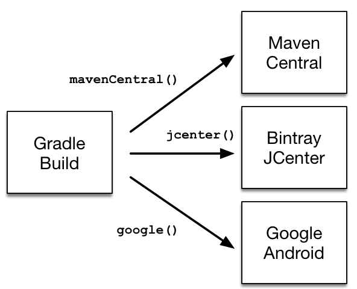

# 声明存储库

内容

  * [声明一个公共可用的存储库](#sec:declaring_public_repository)
  * [通过URL声明自定义存储库](#sec:declaring_custom_repository)
  * [声明多个存储库](#sec:declaring_multiple_repositories)
  * [支持的存储库类型](#sec:repository-types)
  * [Maven仓库](#sec:maven_repo)
  * [mavenLocal（）的情况](#sec:case-for-maven-local)
  * [常春藤仓库](#sec:ivy_repositories)
  * [储存库内容过滤](#sec:repository-content-filtering)
  * [支持的元数据源](#sec:supported_metadata_sources)
  * [插件存储库与构建存储库](#sec:plugin-vs-build-repos)
  * [支持的存储库传输协议](#sec:supported_transport_protocols)
  * [HTTP（S）身份验证方案配置](#sec:authentication_schemes)
  * [AWS S3存储库配置](#sec:s3-repositories)
  * [Google Cloud Storage储存库配置](#sec:gcs-repositories)
  * [处理凭证](#sec:handling_credentials)

Gradle可以基于Maven，Ivy或平面目录格式解析来自一个或多个存储库的依赖项。[有关所有信息](#sec:repository-types)，
请查看[所有类型存储库](#sec:repository-types)的[完整参考](#sec:repository-types)。

## [声明一个公共可用的存储库](#sec:declaring_public_repository)

构建软件的组织可能希望利用公共二进制存储库来下载和使用开源依赖项。流行的公共存储库包括[Maven Central](#sub:maven_central)，
[Bintray JCenter](#sub:maven_jcenter)和[Google Android](#sub:maven_google)存储库。
Gradle为这些广泛使用的存储库提供了内置的速记符号。

图1.借助简写方式声明存储库

在幕后，Gradle解析了由速记符号定义的公共存储库的相应URL中的依赖性。
所有速记符号可通过[RepositoryHandler](https://docs.gradle.org/6.7.1/dsl/org.gradle.api.artifacts.dsl.RepositoryHandler.html)
API获得。或者，您可以[拼出存储库的URL以](#sec:declaring_custom_repository)进行更细粒度的控制。

### [Maven Central存储库](#sub:maven_central)

Maven Central是一个流行的存储库，托管开放源代码库供Java项目使用。

要声明用于构建的[Maven Central存储库](https://repo.maven.apache.org/maven2/)，请将其添加到脚本中：

示例1.添加中央Maven存储库

`Groovy``Kotlin`

build.gradle

    
    
    repositories {
        mavenCentral()
    }

build.gradle.kts

    
    
    repositories {
        mavenCentral()
    }

### [JCenter Maven存储库](#sub:maven_jcenter)

[Bintray](http://bintray.com/)的JCenter是所有流行的Maven
OSS工件的最新集合，包括直接发布到Bintray的工件。

要声明[JCenter Maven存储库，](https://jcenter.bintray.com/)请将其添加到您的构建脚本中：

示例2.添加Bintray的JCenter Maven存储库

`Groovy``Kotlin`

build.gradle

    
    
    repositories {
        jcenter()
    }

build.gradle.kts

    
    
    repositories {
        jcenter()
    }

### [Google Maven存储库](#sub:maven_google)

Google存储库托管特定于Android的工件，包括Android
SDK。有关使用示例，请参阅[相关的Android文档](https://developer.android.com/studio/build/dependencies.html#google-maven)。

要声明[Google Maven存储库，](https://maven.google.com/)请将其添加到您的构建脚本中：

例子3.添加Google Maven仓库

`Groovy``Kotlin`

build.gradle

    
    
    repositories {
        google()
    }

build.gradle.kts

    
    
    repositories {
        google()
    }

## [通过URL声明自定义存储库](#sec:declaring_custom_repository)

大多数企业项目都建立了仅在Intranet中可用的二进制存储库。内部存储库使团队可以发布内部二进制文件，设置用户管理和安全措施并确保正常运行时间和可用性。如果要声明一个不太受欢迎但可公开使用的存储库，则指定自定义URL也很有用。

通过调用[RepositoryHandler](https://docs.gradle.org/6.7.1/dsl/org.gradle.api.artifacts.dsl.RepositoryHandler.html)
API上可用的相应方法，可以将具有自定义URL的存储库指定为Maven或Ivy存储[库](https://docs.gradle.org/6.7.1/dsl/org.gradle.api.artifacts.dsl.RepositoryHandler.html)。Gradle支持其他协议，而不是自定义URL`http`或`https`作为自定义URL的一部分，例如`file`，`sftp`或`s3`。有关完整信息，请参见[有关受支持的存储库类型](#sec:repository-types)的[部分](#sec:repository-types)。

您还[可以](#sub:defining_custom_pattern_layout_for_an_ivy_repository)通过使用`ivy
{
}`存储库来[定义自己的存储库布局](#sub:defining_custom_pattern_layout_for_an_ivy_repository)，因为它们在存储模块中模块的组织方式上非常灵活。

## [声明多个存储库](#sec:declaring_multiple_repositories)

您可以定义多个存储库来解决依赖关系。如果某些依赖项仅在一个存储库中可用而在另一个存储库中不可用，则声明多个存储库将很有帮助。您可以混合[参考部分中](#sec:repository-
types)描述的任何类型的存储库。

此示例演示了如何为项目声明各种命名和自定义URL存储库：

例子4.声明多个仓库

`Groovy``Kotlin`

build.gradle

    
    
    repositories {
        jcenter()
        maven {
            url "https://maven.springframework.org/release"
        }
        maven {
            url "https://maven.restlet.com"
        }
    }

build.gradle.kts

    
    
    repositories {
        jcenter()
        maven {
            url = uri("https://maven.springframework.org/release")
        }
        maven {
            url = uri("https://maven.restlet.com")
        }
    }

╔═════════════════════════════  

声明的顺序决定了Gradle在运行时如何检查依赖关系。如果Gradle在特定存储库中找到模块描述符，它将尝试从 _同一存储库_
下载该模块的所有工件。您可以了解有关[依赖项下载](https://docs.gradle.org/6.7.1/userguide/dependency_resolution.html#sec:how-gradle-downloads-deps)的内部工作的更多信息。  
  
╚═════════════════════════════    
  
### [严格限制已声明的存储库](#strict_limitation_to_declared_repositories)

Maven POM元数据可以引用其他存储库。这些将被Gradle _忽略_ ，Gradle将仅使用构建本身中声明的存储库。

╔═════════════════════════════  

这是可重现的安全保护措施，也是安全保护措施。没有它，依赖项的更新版本可能会将工件从任何地方拉入构建。  
  
╚═════════════════════════════    
  
## [支持的存储库类型](#sec:repository-types)

Gradle在格式和连接性方面都支持广泛的依赖源。您可以通过以下方式解决依赖关系：

  * 不同格式

    * 一个与[Maven兼容的](#sec:maven_repo)工件存储库（例如：Maven Central，JCenter等）

    * 一个[常青藤兼容](#sec:ivy_repositories)神器库（包括自定义布局）

    * [本地（平面）目录](#sub:flat_dir_resolver)

  * 具有不同的连接性

    * [认证存储库](#sec:authentication_schemes)

    * 各种[远程协议，](#sec:supported_transport_protocols)例如HTTPS，SFTP，AWS S3和Google Cloud Storage

### [平面目录存储库](#sub:flat_dir_resolver)

一些项目可能更喜欢将依赖项存储在共享驱动器上，或者作为项目源代码的一部分而不是二进制存储库产品来存储。如果要将（平面）文件系统目录用作存储库，只需键入：

例子5.平面存储库解析器

`Groovy``Kotlin`

build.gradle

    
    
    repositories {
        flatDir {
            dirs 'lib'
        }
        flatDir {
            dirs 'lib1', 'lib2'
        }
    }

build.gradle.kts

    
    
    repositories {
        flatDir {
            dirs("lib")
        }
        flatDir {
            dirs("lib1", "lib2")
        }
    }

这将添加存储库，这些存储库将查找一个或多个目录以查找依赖项。

这种类型的存储库不支持任何元数据格式，例如Ivy XML或Maven
POM文件。取而代之的是，Gradle将根据工件的存在情况动态生成模块描述符（不包含任何依赖项信息）。

╔═════════════════════════════  

由于Gradle倾向于使用其描述符是从真实的元数据创建而不是生成的模块，因此平面目录存储库无法用于覆盖来自在构建中声明的其他存储库中具有真实元数据的工件。

例如，如果Gradle仅`jmxri-1.2.1.jar`在平面目录存储库中找到，而`jmxri-1.2.1.pom`在另一个支持元数据的存储库中找到，它将使用第二个存储库来提供模块。

对于用本地对象覆盖远程工件的用例，请考虑使用Ivy或Maven存储库，而不是其URL指向本地目录。  
  
╚═════════════════════════════    
  
如果仅使用平面目录存储库，则无需设置依赖项的所有属性。

### [本地存储库](#sub:local-repos)

以下各节描述存储库格式（Maven或Ivy）。可以使用本地文件系统路径将它们声明为本地存储库。

平面目录存储库的不同之处在于它们确实遵循一种格式并包含元数据。

配置了这样的存储库后，Gradle将完全绕过它的[依赖项缓存](https://docs.gradle.org/6.7.1/userguide/dependency_resolution.html#sec:dependency_cache)，因为无法保证内容在两次执行之间不会更改。由于该限制，它们可能会对性能产生影响。

它们还使构建的可复制性变得更加难以实现，并且其使用应限于修补或制作原型。

## [Maven仓库](#sec:maven_repo)

许多组织将依赖项托管在内部Maven存储库中，该存储库只能在公司的网络中访问。Gradle可以通过URL声明Maven存储库。

要添加自定义Maven存储库，您可以执行以下操作：

例子6.添加定制的Maven仓库

`Groovy``Kotlin`

build.gradle

    
    
    repositories {
        maven {
            url "http://repo.mycompany.com/maven2"
        }
    }

build.gradle.kts

    
    
    repositories {
        maven {
            url = uri("http://repo.mycompany.com/maven2")
        }
    }

### [设置复合Maven存储库](#sub:custom-maven-repo)

有时，存储库会将POM发布到一个位置，并将JAR和其他工件发布到另一位置。要定义这样的存储库，您可以执行以下操作：

例子7.为JAR文件添加附加的Maven存储库

`Groovy``Kotlin`

build.gradle

    
    
    repositories {
        maven {
            // Look for POMs and artifacts, such as JARs, here
            url "http://repo2.mycompany.com/maven2"
            // Look for artifacts here if not found at the above location
            artifactUrls "http://repo.mycompany.com/jars"
            artifactUrls "http://repo.mycompany.com/jars2"
        }
    }

build.gradle.kts

    
    
    repositories {
        maven {
            // Look for POMs and artifacts, such as JARs, here
            url = uri("http://repo2.mycompany.com/maven2")
            // Look for artifacts here if not found at the above location
            artifactUrls("http://repo.mycompany.com/jars")
            artifactUrls("http://repo.mycompany.com/jars2")
        }
    }

Gradle将查看`url`POM和JAR的基本位置。如果在该处找不到JAR，则多余的`artifactUrls`部分用于查找JAR。

### [访问经过身份验证的Maven存储库](#sub:accessing_secured_maven_repositories)

您可以为通过不同类型的身份验证保护的Maven存储库指定凭据。

请参阅[支持的存储库传输协议](#sec:supported_transport_protocols)以获取认证选项。

### [本地Maven存储库](#sub:maven_local)

Gradle可以使用[本地Maven存储库中](https://maven.apache.org/guides/introduction/introduction-to-repositories.html)可用的依赖项。声明此存储库对于使用一个项目发布到本地Maven存储库并在另一个项目中使用Gradle消耗工件的团队来说是有益的。

╔═════════════════════════════  

Gradle将已解决的依赖性存储在[其自己的缓存中](https://docs.gradle.org/6.7.1/userguide/dependency_resolution.html#sec:dependency_cache)。即使您从基于Maven的远程存储库中解决依赖关系，构建也无需声明本地Maven存储库。  
  
╚═════════════════════════════    
  
╔═════════════════════════════  

在将Maven
local添加为存储库之前，您应[确保确实需要这样做](#sec:case-for-maven-local)。  
  
╚═════════════════════════════    
  
要将本地Maven缓存声明为存储库，请将其添加到构建脚本中：

示例8.将本地Maven缓存添加为存储库

`Groovy``Kotlin`

build.gradle

    
    
    repositories {
        mavenLocal()
    }

build.gradle.kts

    
    
    repositories {
        mavenLocal()
    }

Gradle使用与Maven相同的逻辑来标识本地Maven缓存的位置。如果在中定义了本地存储库位置`settings.xml`，则将使用该位置。在`settings.xml`中`
_USER_HOME_ /.m2`优先于`settings.xml`中` _M2_HOME_
/conf`。如果没有`settings.xml`可用的，Gradle将使用默认位置` _USER_HOME_ /.m2/repository`。

## [mavenLocal（）的情况](#sec:case-for-maven-local)

作为一般建议，应避免添加`mavenLocal()`为存储库。使用`mavenLocal()`时应注意不同的问题：

  * Maven将其用作缓存而不是存储库，这意味着它可以包含部分模块。

    * 例如，如果Maven从不下载给定模块的源文件或javadoc文件，则Gradle将不会找到它们，因为一旦找到模块，它就会[在单个存储库中搜索文件](https://docs.gradle.org/6.7.1/userguide/dependency_resolution.html#sec:how-gradle-downloads-deps)。

  * 作为[本地存储库](#sub:local-repos)，Gradle不信任其内容，因为：

    * 无法追踪工件的来源，这是正确性和安全性问题

    * 工件很容易被覆盖，这是一个安全性，正确性和可再现性问题

  * 为了减轻该元数据和/或伪影可以改变的，Gradle不执行的事实[任何缓存](https://docs.gradle.org/6.7.1/userguide/dependency_resolution.html#sec:dependency_cache)对[本地资源库](#sub:local-repos)

    * 因此，您的构建速度较慢

    * 鉴于存储库的顺序很重要，因此`mavenLocal()` _首先_ 添加意味着您的所有构建都将变慢

在某些情况下，您可能需要使用`mavenLocal()`：

  * 为了与Maven互操作

    * 例如，项目A使用Maven构建，项目B使用Gradle构建，并且您需要在开发过程中共享工件。

    * 它 _总是_ 最好使用一个内部功能齐全的仓库，而不是

    * 如果无法做到这一点，则应将其限制为 _仅本地构建_

  * 与Gradle本身的互操作性

    * 在多存储库环境中，您要检查对项目A所做的更改是否与项目B一起使用

    * 对于此用例，最好使用[复合构建](https://docs.gradle.org/6.7.1/userguide/composite_builds.html#composite_builds)

    * 如果由于某种原因，既无法构建复合版本，也无法使用功能全面的存储库，那么这`mavenLocal()`是最后的选择

在所有这些警告之后，如果最终使用过`mavenLocal()`，请考虑将其与[存储库过滤器](#sec:repository-content-filtering)结合使用。这将确保它仅提供预期的内容，而不提供其他任何内容。

## [常春藤仓库](#sec:ivy_repositories)

组织可能决定将依赖项托管在内部Ivy存储库中。Gradle可以通过URL声明Ivy存储库。

### [使用标准布局定义常春藤存储库](#sub:defining_an_ivy_repository_with_a_standard_layout)

要使用标准布局声明常春藤存储库，不需要其他自定义。您只需声明URL。

例子9.常春藤仓库

`Groovy``Kotlin`

build.gradle

    
    
    repositories {
        ivy {
            url "http://repo.mycompany.com/repo"
        }
    }

build.gradle.kts

    
    
    repositories {
        ivy {
            url = uri("http://repo.mycompany.com/repo")
        }
    }

### [定义常春藤存储库的命名布局](#sub:defining_a_named_layout_for_an_ivy_repository)

您可以使用命名布局来指定存储库符合Ivy或Maven默认布局。

例子10.具有命名布局的Ivy存储库

`Groovy``Kotlin`

build.gradle

    
    
    repositories {
        ivy {
            url "http://repo.mycompany.com/repo"
            layout "maven"
        }
    }

build.gradle.kts

    
    
    repositories {
        ivy {
            url = uri("http://repo.mycompany.com/repo")
            layout("maven")
        }
    }

有效的命名布局值是`'gradle'`（默认值）`'maven'`和`'ivy'`。有关这些命名布局的详细信息，请参见API文档中的[IvyArtifactRepository.layout（java.lang.String）](https://docs.gradle.org/6.7.1/dsl/org.gradle.api.artifacts.repositories.IvyArtifactRepository.html#org.gradle.api.artifacts.repositories.IvyArtifactRepository:layout\(java.lang.String\))。

### [定义常春藤存储库的自定义模式布局](#sub:defining_custom_pattern_layout_for_an_ivy_repository)

要使用非标准布局定义常春藤存储库，可以为存储库定义 _模式_ 布局：

例子11.具有模式布局的Ivy存储库

`Groovy``Kotlin`

build.gradle

    
    
    repositories {
        ivy {
            url "http://repo.mycompany.com/repo"
            patternLayout {
                artifact "[module]/[revision]/[type]/[artifact].[ext]"
            }
        }
    }

build.gradle.kts

    
    
    repositories {
        ivy {
            url = uri("http://repo.mycompany.com/repo")
            patternLayout {
                artifact("[module]/[revision]/[type]/[artifact].[ext]")
            }
        }
    }

要定义从不同位置获取Ivy文件和工件的Ivy存储库，可以定义单独的模式以用于定位Ivy文件和工件：

每个`artifact`或`ivy`为存储库指定的都添加了要使用的 _其他_ 模式。模式按照定义的顺序使用。

例子12.具有多个自定义模式的Ivy存储库

`Groovy``Kotlin`

build.gradle

    
    
    repositories {
        ivy {
            url "http://repo.mycompany.com/repo"
            patternLayout {
                artifact "3rd-party-artifacts/[organisation]/[module]/[revision]/[artifact]-[revision].[ext]"
                artifact "company-artifacts/[organisation]/[module]/[revision]/[artifact]-[revision].[ext]"
                ivy "ivy-files/[organisation]/[module]/[revision]/ivy.xml"
            }
        }
    }

build.gradle.kts

    
    
    repositories {
        ivy {
            url = uri("http://repo.mycompany.com/repo")
            patternLayout {
                artifact("3rd-party-artifacts/[organisation]/[module]/[revision]/[artifact]-[revision].[ext]")
                artifact("company-artifacts/[organisation]/[module]/[revision]/[artifact]-[revision].[ext]")
                ivy("ivy-files/[organisation]/[module]/[revision]/ivy.xml")
            }
        }
    }

（可选）具有模式布局的存储库可以`'organisation'`按Maven样式布置其部分，用正斜杠替换点作为分隔符。例如，该组织`my.company`将被表示为`my/company`。

例子13.具有Maven兼容布局的Ivy存储库

`Groovy``Kotlin`

build.gradle

    
    
    repositories {
        ivy {
            url "http://repo.mycompany.com/repo"
            patternLayout {
                artifact "[organisation]/[module]/[revision]/[artifact]-[revision].[ext]"
                m2compatible = true
            }
        }
    }

build.gradle.kts

    
    
    repositories {
        ivy {
            url = uri("http://repo.mycompany.com/repo")
            patternLayout {
                artifact("[organisation]/[module]/[revision]/[artifact]-[revision].[ext]")
                setM2compatible(true)
            }
        }
    }

### [访问经过身份验证的常春藤存储库](#sub:accessing_secured_ivy_repositories)

您可以为通过基本身份验证保护的Ivy存储库指定凭据。

例子14.具有身份验证的Ivy存储库

`Groovy``Kotlin`

build.gradle

    
    
    repositories {
        ivy {
            url "http://repo.mycompany.com"
            credentials {
                username "user"
                password "password"
            }
        }
    }

build.gradle.kts

    
    
    repositories {
        ivy {
            url = uri("http://repo.mycompany.com")
            credentials {
                username = "user"
                password = "password"
            }
        }
    }

请参阅[支持的存储库传输协议](#sec:supported_transport_protocols)以获取认证选项。

## [储存库内容过滤](#sec:repository-content-filtering)

Gradle公开了一个API，以声明存储库可能包含或不包含的内容。有不同的用例：

  * 性能，当您知道在特定存储库中永远找不到依赖项时

  * 通过避免泄漏私有项目中使用的依赖项来确保安全性

  * 可靠性，当某些存储库包含损坏的元数据或工件时

考虑到存储库的声明顺序很重要，这一点甚至更为重要。

### [声明存储库过滤器](#sec:declaring-repository-filter)

例子15.声明存储库内容

`Groovy``Kotlin`

build.gradle

    
    
    repositories {
        maven {
            url "https://repo.mycompany.com/maven2"
            content {
                // this repository *only* contains artifacts with group "my.company"
                includeGroup "my.company"
            }
        }
        jcenter {
            content {
                // this repository contains everything BUT artifacts with group starting with "my.company"
                excludeGroupByRegex "my\\.company.*"
            }
        }
    }

build.gradle.kts

    
    
    repositories {
        maven {
            url = uri("https://repo.mycompany.com/maven2")
            content {
                // this repository *only* contains artifacts with group "my.company"
                includeGroup("my.company")
            }
        }
        jcenter {
            content {
                // this repository contains everything BUT artifacts with group starting with "my.company"
                excludeGroupByRegex("my\\.company.*")
            }
        }
    }

默认情况下，存储库包含所有内容，不包含任何内容：

  * 如果声明包含，那么它排除了一切 _，但_ 包含的内容。

  * 如果声明排除，则它将包括 _除_ 排除之外的所有内容。

  * 如果声明包含和排除，则它仅包括显式包括但不排除的内容。

可以严格地或使用正则表达式按显式 _group_ ， _module_ 或 _version_
进行过滤。使用严格版本时，可以使用Gradle[支持的格式](https://docs.gradle.org/6.7.1/userguide/single_versions.html)来使用版本范围。此外，还有按分辨率上下文过滤的选项：配置名称甚至配置属性。有关详细信息，请参见[RepositoryContentDescriptor](https://docs.gradle.org/6.7.1/javadoc/org/gradle/api/artifacts/repositories/RepositoryContentDescriptor.html)。

### [声明仅在一个存储库中找到的内容](#declaring_content_exclusively_found_in_one_repository)

使用[存储库级内容过滤](#sec:declaring-repository-filter)器声明的[过滤器](#sec:declaring-repository-filter)不是唯一的。这意味着声明一个存储库 _包含_
一个工件并不意味着其他存储库也没有它：您必须声明扩展中每个存储库包含的内容。

另外，Gradle提供了一个API，可让您声明存储库 _专门包含_ 工件。如果这样做：

  * 在存储库声明的神器 _不能_ 在其他任何发现

  * 专有存储库内容必须在扩展中声明（就像[存储库级内容一样](#sec:declaring-repository-filter)）

例子16.声明专有存储库内容

`Groovy``Kotlin`

build.gradle

    
    
    repositories {
        // This repository will _not_ be searched for artifacts in my.company
        // despite being declared first
        jcenter()
        exclusiveContent {
            forRepository {
                maven {
                    url "https://repo.mycompany.com/maven2"
                }
            }
            filter {
                // this repository *only* contains artifacts with group "my.company"
                includeGroup "my.company"
            }
        }
    }

build.gradle.kts

    
    
    repositories {
        // This repository will _not_ be searched for artifacts in my.company
        // despite being declared first
        jcenter()
        exclusiveContent {
            forRepository {
                maven {
                    url = uri("https://repo.mycompany.com/maven2")
                }
            }
            filter {
                // this repository *only* contains artifacts with group "my.company"
                includeGroup("my.company")
            }
        }
    }

可以严格地或使用正则表达式按显式 _group_ ， _module_ 或 _version_
进行过滤。有关详细信息，请参见[InclusiveRepositoryContentDescriptor](https://docs.gradle.org/6.7.1/javadoc/org/gradle/api/artifacts/repositories/InclusiveRepositoryContentDescriptor.html)。

### [Maven存储库过滤](#maven_repository_filtering)

对于[Maven存储库](#sec:maven_repo)，通常情况下，存储库将包含发行版或快照。Gradle允许您声明使用此DSL在存储库中找到哪种工件：

例子17.分割快照和发行版

`Groovy``Kotlin`

build.gradle

    
    
    repositories {
        maven {
            url "https://repo.mycompany.com/releases"
            mavenContent {
                releasesOnly()
            }
        }
        maven {
            url "https://repo.mycompany.com/snapshots"
            mavenContent {
                snapshotsOnly()
            }
        }
    }

build.gradle.kts

    
    
    repositories {
        maven {
            url = uri("https://repo.mycompany.com/releases")
            mavenContent {
                releasesOnly()
            }
        }
        maven {
            url = uri("https://repo.mycompany.com/snapshots")
            mavenContent {
                snapshotsOnly()
            }
        }
    }

## [支持的元数据源](#sec:supported_metadata_sources)

在存储库中搜索模块时，默认情况下，Gradle检查该存储库中[受支持的元数据文件格式](https://docs.gradle.org/6.7.1/userguide/declaring_dependencies.html#sec:supported-
metadata-
formats)。在Maven存储库中，Gradle查找`.pom`文件，在常春藤存储库中查找`ivy.xml`文件，在平面目录存储库中直接查找`.jar`文件，因为它不需要任何元数据。从5.0开始，Gradle还会查找`.module`（Gradle模块元数据）文件。

但是，如果定义自定义存储库，则可能需要配置此行为。例如，您可以定义一个Maven存储库，不包含`.pom`文件，而仅包含jar。为此，您可以为任何存储库配置
_元数据源_ 。

例子18. Maven仓库支持没有元数据的工件

`Groovy``Kotlin`

build.gradle

    
    
    repositories {
        maven {
            url "http://repo.mycompany.com/repo"
            metadataSources {
                mavenPom()
                artifact()
            }
        }
    }

build.gradle.kts

    
    
    repositories {
        maven {
            url = uri("http://repo.mycompany.com/repo")
            metadataSources {
                mavenPom()
                artifact()
            }
        }
    }

您可以指定多个来源来告诉Gradle继续查找是否找不到文件。在这种情况下，检查源的顺序是预定义的。

支持以下元数据源：

表1.受支持的元数据源 

元数据源 | 描述 | 订购 | 马文 | 常春藤/平目录  
---|---  |---|---  |---  
`gradleMetadata()`|寻找Gradle`.module`文件|第一|是|是  
`mavenPom()`|查找Maven`.pom`文件|第二名|是|是  
`ivyDescriptor()`|查找`ivy.xml`文件|第二名|没有|是  
`artifact()`|直接寻找伪像|第三名|是|是  
  
╔═════════════════════════════  

Ivy和Maven存储库的默认值随Gradle
6.0更改。6.0之前的版本`artifact()`包含在默认值中。当模块完全丢失时，导致效率低下。要恢复此行为，例如，对于Maven
Central，可以使用`mavenCentral { metadataSources { mavenPom(); artifact() }
}`。以类似的方式，您可以使用以下方式选择旧版Gradle中的新行为`mavenCentral { metadataSources { mavenPom()
} }`  
  
╚═════════════════════════════    
  
从Gradle 5.3开始，解析元数据文件（无论是Ivy还是Maven）时，Gradle将寻找一个标记，指示存在匹配的Gradle
Module元数据文件。如果找到它，它将代替Ivy或Maven文件使用。

从Gradle
5.6开始，您可以通过添加`ignoreGradleMetadataRedirection()`到metadataSources声明来禁用此行为。

例子19.不使用gradle元数据重定向的Maven存储库

`Groovy``Kotlin`

build.gradle

    
    
    repositories {
        maven {
            url "http://repo.mycompany.com/repo"
            metadataSources {
                mavenPom()
                artifact()
                ignoreGradleMetadataRedirection()
            }
        }
    }

build.gradle.kts

    
    
    repositories {
        maven {
            url = uri("http://repo.mycompany.com/repo")
            metadataSources {
                mavenPom()
                artifact()
                ignoreGradleMetadataRedirection()
            }
        }
    }

## [插件存储库与构建存储库](#sec:plugin-vs-build-repos)

在构建期间，Gradle将在两个不同的阶段使用存储库。

第一阶段是[配置构建](https://docs.gradle.org/6.7.1/userguide/build_lifecycle.html#sec:build_phases)并加载其应用的插件时。为此，Gradle将使用一组特殊的存储库。

第二阶段是在依赖关系解析期间。此时，Gradle将使用项目中声明的存储库，如前几节所示。

### [插件存储库](#sub:plugin-repos)

默认情况下，Gradle将使用[Gradle插件门户](http://plugins.gradle.org/)来查找插件。

但是，由于不同的原因，在其他公共存储库或非公共存储库中都有可用的插件。当构建需要这些插件之一时，需要指定其他存储库，以便Gradle知道要在哪里搜索。

由于声明存储库的方式及其预期包含的内容取决于插件的应用方式，因此最好参考[Custom Plugin
Repositories](https://docs.gradle.org/6.7.1/userguide/plugins.html#sec:custom_plugin_repositories)。

## [支持的存储库传输协议](#sec:supported_transport_protocols)

Maven和Ivy存储库支持使用各种传输协议。目前支持以下协议：

表2.存储库传输协议
 
 类型 | 凭证类型 | 链接  
---|---|---  
`file`|没有|  
`http`|用户名密码|[文献资料](#sec:authentication_schemes)  
`https`|用户名密码|[文献资料](#sec:authentication_schemes)  
`sftp`|用户名密码|[文献资料](#sec:authentication_schemes)  
`s3`|访问密钥/秘密密钥/会话令牌或环境变量|[文献资料](#sec:s3-repositories)  
`gcs`|[默认应用程序凭据](https://developers.google.com/identity/protocols/application-default-credentials)来自知名文件，环境变量等。|[文献资料](#sec:gcs-repositories)  
  
╔═════════════════════════════  

用户名和密码永远不应作为构建文件的一部分以纯文本格式签入版本控制中。您可以将凭据存储在本地`gradle.properties`文件中，并使用开源Gradle插件之一来加密和使用凭据，例如[凭据插件](https://plugins.gradle.org/plugin/nu.studer.credentials)。  
  
╚═════════════════════════════    
  
传输协议是存储库URL定义的一部分。以下构建脚本演示了如何创建基于HTTP的Maven和Ivy存储库：

例子20.声明一个Maven和Ivy存储库

`Groovy``Kotlin`

build.gradle

    
    
    repositories {
        maven {
            url "http://repo.mycompany.com/maven2"
        }
    
        ivy {
            url "http://repo.mycompany.com/repo"
        }
    }

build.gradle.kts

    
    
    repositories {
        maven {
            url = uri("http://repo.mycompany.com/maven2")
        }
    
        ivy {
            url = uri("http://repo.mycompany.com/repo")
        }
    }

以下示例显示如何声明SFTP存储库：

例子21.将SFTP协议用于存储库

`Groovy``Kotlin`

build.gradle

    
    
    repositories {
        maven {
            url "sftp://repo.mycompany.com:22/maven2"
            credentials {
                username "user"
                password "password"
            }
        }
    
        ivy {
            url "sftp://repo.mycompany.com:22/repo"
            credentials {
                username "user"
                password "password"
            }
        }
    }

build.gradle.kts

    
    
    repositories {
        maven {
            url = uri("sftp://repo.mycompany.com:22/maven2")
            credentials {
                username = "user"
                password = "password"
            }
        }
    
        ivy {
            url = uri("sftp://repo.mycompany.com:22/repo")
            credentials {
                username = "user"
                password = "password"
            }
        }
    }

有关HTTP相关身份验证的详细信息，请参阅“
[HTTP（S）身份验证方案配置”部分](#sec:authentication_schemes)。

使用支持AWS
S3的存储库时，您需要使用[AwsCredentials](https://docs.gradle.org/6.7.1/dsl/org.gradle.api.credentials.AwsCredentials.html)进行身份验证，并提供访问密钥和私钥。以下示例显示了如何声明S3支持的存储库并提供AWS凭证：

例子22.声明一个由S3支持的Maven和Ivy存储库

`Groovy``Kotlin`

build.gradle

    
    
    repositories {
        maven {
            url "s3://myCompanyBucket/maven2"
            credentials(AwsCredentials) {
                accessKey "someKey"
                secretKey "someSecret"
                // optional
                sessionToken "someSTSToken"
            }
        }
    
        ivy {
            url "s3://myCompanyBucket/ivyrepo"
            credentials(AwsCredentials) {
                accessKey "someKey"
                secretKey "someSecret"
                // optional
                sessionToken "someSTSToken"
            }
        }
    }

build.gradle.kts

    
    
    repositories {
        maven {
            url = uri("s3://myCompanyBucket/maven2")
            credentials(AwsCredentials::class) {
                accessKey = "someKey"
                secretKey = "someSecret"
                // optional
                sessionToken = "someSTSToken"
            }
        }
    
        ivy {
            url = uri("s3://myCompanyBucket/ivyrepo")
            credentials(AwsCredentials::class) {
                accessKey = "someKey"
                secretKey = "someSecret"
                // optional
                sessionToken = "someSTSToken"
            }
        }
    }

您还可以使用AwsImAuthentication将所有凭证委派给AWS sdk。以下示例显示了如何：

示例23.使用IAM声明一个由S3支持的Maven和Ivy存储库

`Groovy``Kotlin`

build.gradle

    
    
    repositories {
        maven {
            url "s3://myCompanyBucket/maven2"
            authentication {
               awsIm(AwsImAuthentication) // load from EC2 role or env var
            }
        }
    
        ivy {
            url "s3://myCompanyBucket/ivyrepo"
            authentication {
               awsIm(AwsImAuthentication)
            }
        }
    }

build.gradle.kts

    
    
    repositories {
        maven {
            url = uri("s3://myCompanyBucket/maven2")
            authentication {
                create<AwsImAuthentication>("awsIm") // load from EC2 role or env var
            }
        }
    
        ivy {
            url = uri("s3://myCompanyBucket/ivyrepo")
            authentication {
                create<AwsImAuthentication>("awsIm")
            }
        }
    }

有关与AWS S3相关的身份验证的详细信息，请参阅“ [AWS S3存储库配置](#sec:s3-repositories)”部分。

使用Google Cloud Storage支持的存储库时，将使用默认的应用程序凭据，而无需进一步配置：

示例24.使用默认的应用程序凭证声明一个由Google Cloud Storage支持的Maven和Ivy存储库

`Groovy``Kotlin`

build.gradle

    
    
    repositories {
        maven {
            url "gcs://myCompanyBucket/maven2"
        }
    
        ivy {
            url "gcs://myCompanyBucket/ivyrepo"
        }
    }

build.gradle.kts

    
    
    repositories {
        maven {
            url = uri("gcs://myCompanyBucket/maven2")
        }
    
        ivy {
            url = uri("gcs://myCompanyBucket/ivyrepo")
        }
    }

有关与Google GCS相关的身份验证的详细信息，请参阅“ [Google Cloud Storage存储库配置”部分](#sec:gcs-
repositories)。

## [HTTP（S）身份验证方案配置](#sec:authentication_schemes)

使用HTTP或HTTPS传输协议配置存储库时，可以使用多种身份验证方案。默认情况下，Gradle会尝试使用Apache
HttpClient库支持的所有方案（在[此处记录）](http://hc.apache.org/httpcomponents-client-
ga/tutorial/html/authentication.html#d5e625)。在某些情况下，与远程服务器交换凭据时，最好明确指定应使用哪种身份验证方案。明确声明时，在对远程存储库进行身份验证时仅使用那些方案。

您可以使用[PasswordCredentials](https://docs.gradle.org/6.7.1/javadoc/org/gradle/api/credentials/PasswordCredentials.html)为通过基本身份验证保护的Maven存储库指定凭据。

例子25.访问受密码保护的Maven存储库

`Groovy``Kotlin`

build.gradle

    
    
    repositories {
        maven {
            url "http://repo.mycompany.com/maven2"
            credentials {
                username "user"
                password "password"
            }
        }
    }

build.gradle.kts

    
    
    repositories {
        maven {
            url = uri("http://repo.mycompany.com/maven2")
            credentials {
                username = "user"
                password = "password"
            }
        }
    }

以下示例显示如何将存储库配置为仅使用[DigestAuthentication](https://docs.gradle.org/6.7.1/javadoc/org/gradle/authentication/http/DigestAuthentication.html)：

示例26.将存储库配置为仅使用摘要认证

`Groovy``Kotlin`

build.gradle

    
    
    repositories {
        maven {
            url 'https://repo.mycompany.com/maven2'
            credentials {
                username "user"
                password "password"
            }
            authentication {
                digest(DigestAuthentication)
            }
        }
    }

build.gradle.kts

    
    
    repositories {
        maven {
            url = uri("https://repo.mycompany.com/maven2")
            credentials {
                username = "user"
                password = "password"
            }
            authentication {
                create<DigestAuthentication>("digest")
            }
        }
    }

当前支持的身份验证方案是：

[基本认证](https://docs.gradle.org/6.7.1/javadoc/org/gradle/authentication/http/BasicAuthentication.html)

    

通过HTTP的基本访问身份验证。使用此方案时，将抢先发送凭据。

[摘要认证](https://docs.gradle.org/6.7.1/javadoc/org/gradle/authentication/http/DigestAuthentication.html)

    

通过HTTP的摘要式访问身份验证。

[HttpHeaderAuthentication](https://docs.gradle.org/6.7.1/javadoc/org/gradle/authentication/http/HttpHeaderAuthentication.html)

    

基于任何自定义HTTP标头的身份验证，例如私有令牌，OAuth令牌等。

### [使用抢占式身份验证](#sub:preemptive_authentication)

Gradle的默认行为是仅在服务器使用HTTP
401响应形式的身份验证质询响应时提交凭据。在某些情况下，服务器将以不同的代码响应（例如，对于托管在GitHub上的存储库，返回404），从而导致依赖性解析失败。若要解决此问题，凭据可能会抢先发送到服务器。要启用抢占式身份验证，只需将您的存储库配置为显式使用[BasicAuthentication](https://docs.gradle.org/6.7.1/javadoc/org/gradle/authentication/http/BasicAuthentication.html)方案：

例子27.配置存储库以使用抢占式认证

`Groovy``Kotlin`

build.gradle

    
    
    repositories {
        maven {
            url 'https://repo.mycompany.com/maven2'
            credentials {
                username "user"
                password "password"
            }
            authentication {
                basic(BasicAuthentication)
            }
        }
    }

build.gradle.kts

    
    
    repositories {
        maven {
            url = uri("https://repo.mycompany.com/maven2")
            credentials {
                username = "user"
                password = "password"
            }
            authentication {
                create<BasicAuthentication>("basic")
            }
        }
    }

### [使用HTTP标头身份验证](#sub:http-header-auth)

您可以使用带有[HttpHeaderAuthentication的HttpHeaderCredentials](https://docs.gradle.org/6.7.1/javadoc/org/gradle/authentication/http/HttpHeaderAuthentication.html)为需要令牌，OAuth2或其他基于HTTP头的身份验证的[受](https://docs.gradle.org/6.7.1/javadoc/org/gradle/api/credentials/HttpHeaderCredentials.html)保护的Maven存储库指定任何HTTP头。

例子28.访问标头保护的Maven存储库

`Groovy``Kotlin`

build.gradle

    
    
    repositories {
        maven {
            url "http://repo.mycompany.com/maven2"
            credentials(HttpHeaderCredentials) {
                name = "Private-Token"
                value = "TOKEN"
            }
            authentication {
                header(HttpHeaderAuthentication)
            }
        }
    }

build.gradle.kts

    
    
    repositories {
        maven {
            url = uri("http://repo.mycompany.com/maven2")
            credentials(HttpHeaderCredentials::class) {
                name = "Private-Token"
                value = "TOKEN"
            }
            authentication {
                create<HttpHeaderAuthentication>("header")
            }
        }
    }

## [AWS S3存储库配置](#sec:s3-repositories)

### [S3配置属性](#sub:s3_configuration_properties)

以下系统属性可用于配置与s3存储库的交互：

`org.gradle.s3.endpoint`

    

使用不兼容AWS，S3 API的存储服务时，用于覆盖AWS S3终端节点。

`org.gradle.s3.maxErrorRetry`

    

指定在S3服务器以HTTP 5xx状态代码响应的情况下重试请求的最大次数。如果未指定，则使用默认值3。

### [S3 URL格式](#sub:s3_url_formats)

S3 URL是“虚拟主机样式”，并且必须采用以下格式

    
    
    s3：// <存储桶名称> [。<regionSpecificEndpoint>] / <s3Key>

例如 `s3://myBucket.s3.eu-central-1.amazonaws.com/maven/release`

  * `myBucket` 是AWS S3存储桶名称。

  * `s3.eu-central-1.amazonaws.com`是[特定](http://docs.aws.amazon.com/general/latest/gr/rande.html#s3_region)于[区域](http://docs.aws.amazon.com/general/latest/gr/rande.html#s3_region)的 _可选_ [端点](http://docs.aws.amazon.com/general/latest/gr/rande.html#s3_region)。

  * `/maven/release` 是AWS S3密钥（存储桶中对象的唯一标识符）

### [S3代理设置](#sub:s3_proxy_settings)

可以使用以下系统属性来配置S3的代理：

  * `https.proxyHost`

  * `https.proxyPort`

  * `https.proxyUser`

  * `https.proxyPassword`

  * `http.nonProxyHosts`

如果`org.gradle.s3.endpoint`已使用HTTP（不是HTTPS）URI指定了属性，则可以使用以下系统代理设置：

  * `http.proxyHost`

  * `http.proxyPort`

  * `http.proxyUser`

  * `http.proxyPassword`

  * `http.nonProxyHosts`

### [AWS S3 V4签名（AWS4-HMAC-SHA256）](#sub:s3_v4_signatures)

某些AWS S3地区（eu-central-1-Frankfurt）
要求所有HTTP请求均根据AWS的[签名版本4进行签名](http://docs.aws.amazon.com/general/latest/gr/signature-version-4.html)。当使用需要V4签名的存储桶时，建议指定包含区域特定端点的S3 URL。例如

    
    
    s3：//somebucket.s3.eu-central-1.amazonaws.com/maven/release

╔═════════════════════════════  

如果未为需要V4签名的存储桶指定特定于区域的终结点，则Gradle将使用默认的AWS区域（us-east-1），并且控制台上会出现以下警告：

> 尝试将请求重新发送给.... 使用AWS V4身份验证 为避免将来出现此警告，请使用特定于区域的终结点来访问需要V4签名的区域中的存储桶。

无法为需要V4签名的存储桶指定特定于区域的端点意味着：

  * 每次上传和下载文件时，AWS往返3次，而不是一次。

  * 根据位置-网络等待时间增加，构建速度变慢。

  * 传输失败的可能性增加。

  
  
╚═════════════════════════════    
  
#### [AWS S3跨账户访问](#sub:s3_cross_account)

一些组织可能有多个AWS账户，例如每个团队一个。存储桶拥有者的AWS账户通常与工件发布者和消费者不同。存储桶拥有者需要能够授予消费者访问权限，否则工件只能由发布者的帐户使用。这是通过将`bucket-
owner-full-control` [Canned ACL](https://docs.aws.amazon.com/AmazonS3/latest/dev/acl-overview.html#canned-acl)
添加到上载的对象来完成的。
Gradle将在每次上传中执行此操作。确保发布者直接或通过假定的IAM角色（取决于您的情况）具有所需的IAM权限`PutObjectAcl`
（以及`PutObjectVersionAcl`是否启用了存储桶版本控制）。您可以在[AWS S3访问权限中](https://docs.aws.amazon.com/AmazonS3/latest/dev/s3-access-control.html)阅读更多内容。

## [Google Cloud Storage储存库配置](#sec:gcs-repositories)

### [GCS配置属性](#sub:gcs_configuration_properties)

以下系统属性可用于配置与[Google Cloud Storage存储](https://cloud.google.com/storage/)库的交互：

`org.gradle.gcs.endpoint`

    

在使用非Google Cloud Platform兼容的Google Cloud Storage API的存储服务时，用于覆盖Google Cloud
Storage端点。

`org.gradle.gcs.servicePath`

    

用于覆盖Google Cloud Storage客户端从其生成请求的Google Cloud Storage根服务路径，默认为`/`。

### [GCS URL格式](#sub:gcs_url_formats)

Google Cloud Storage网址是“虚拟托管样式”，并且必须采用以下格式 `gcs://<bucketName>/<objectKey>`

例如 `gcs://myBucket/maven/release`

  * `myBucket` 是Google Cloud Storage存储桶名称。

  * `/maven/release` 是Google Cloud Storage密钥（存储桶中对象的唯一标识符）

## [处理凭证](#sec:handling_credentials)

存储库凭据永远不应成为构建脚本的一部分，而应保留在外部。Gradle[在工件存储库](https://docs.gradle.org/6.7.1/javadoc/org/gradle/api/artifacts/repositories/AuthenticationSupported.html#credentials-java.lang.Class-)
中提供了[一个API，该API](https://docs.gradle.org/6.7.1/javadoc/org/gradle/api/artifacts/repositories/AuthenticationSupported.html#credentials-java.lang.Class-)允许您仅声明所需凭据的类型。
在需要它们的构建期间，
将从[Gradle属性](https://docs.gradle.org/6.7.1/userguide/build_environment.html#sec:gradle_configuration_properties)中查找凭据值。

例如，给定的存储库配置：

例子29.外部化的存储库凭证

`Groovy``Kotlin`

build.gradle

    
    
        repositories {
            maven {
                name = 'mySecureRepository'
                credentials(PasswordCredentials)
                // url = uri(<<some repository url>>)
            }
        }

build.gradle.kts

    
    
        repositories {
            maven {
                name = "mySecureRepository"
                credentials(PasswordCredentials::class)
                // url = uri(<<some repository url>>)
            }
        }

用户名和密码将从`mySecureRepositoryUsername`和`mySecureRepositoryPassword`属性中查找。

请注意，配置属性前缀-身份-是从存储库名称确定的。然后可以以任何受支持的方式为Gradle Properties提供凭据-
`gradle.properties`文件，命令行参数，环境变量或这些选项的组合。

另外，请注意，只有在调用的构建需要凭据时才需要凭据。例如，如果将一个项目配置为将工件发布到受保护的存储库，但是该构建不调用发布任务，则Gradle将不需要提供发布凭据。另一方面，如果构建需要执行某个需要凭据的任务，那么Gradle将首先检查凭据是否存在，并且如果知道该构建稍后会失败，则不会开始运行任何任务。缺少凭据。

这是一个可[下载的示例](https://docs.gradle.org/6.7.1/samples/sample_publishing_credentials.html)，更详细地演示了该概念。

提供[AwsCredentials的](https://docs.gradle.org/6.7.1/javadoc/org/gradle/api/credentials/AwsCredentials.html)规则相同。

