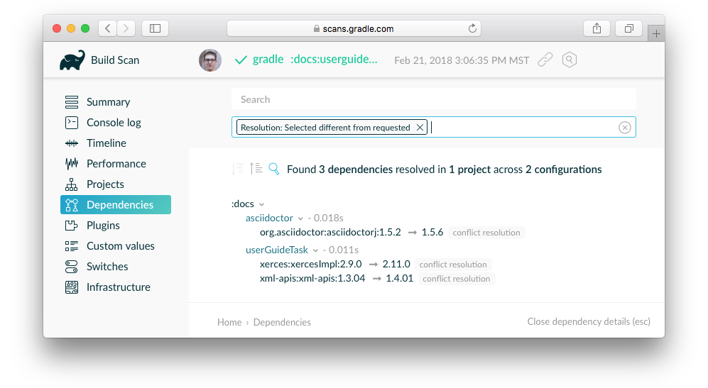
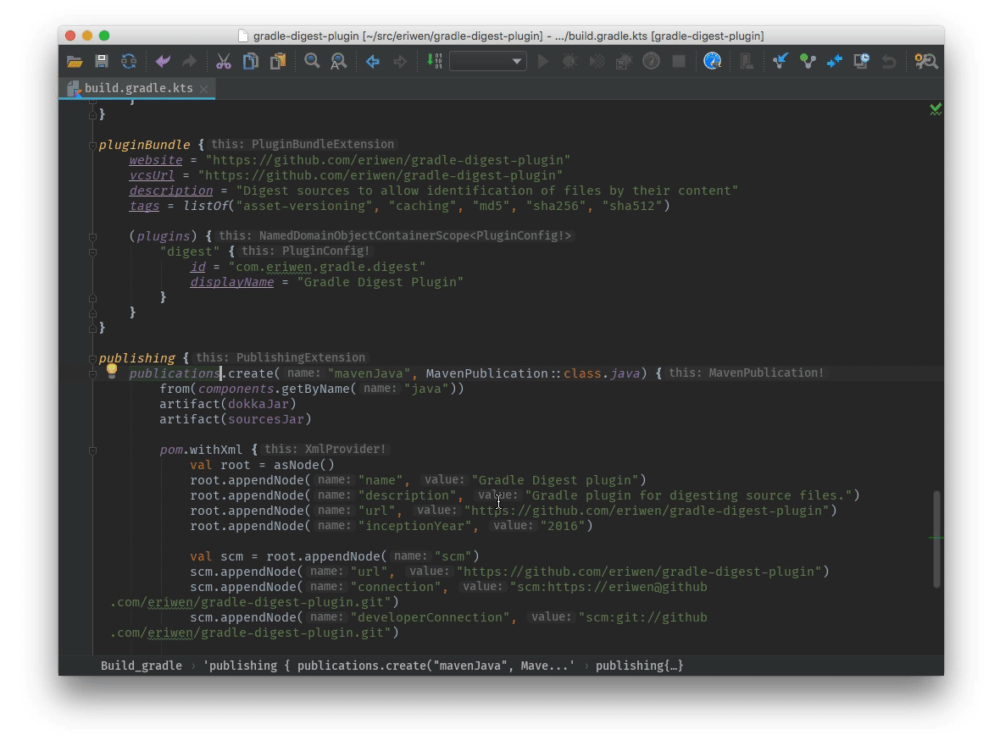
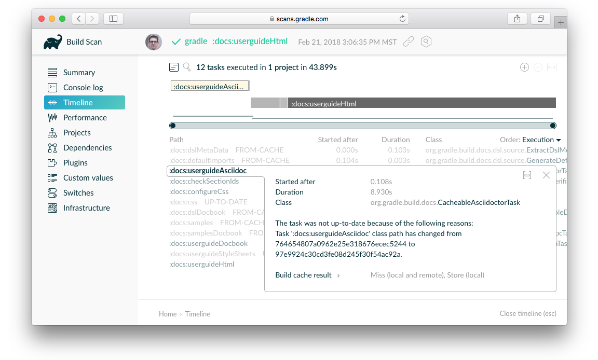
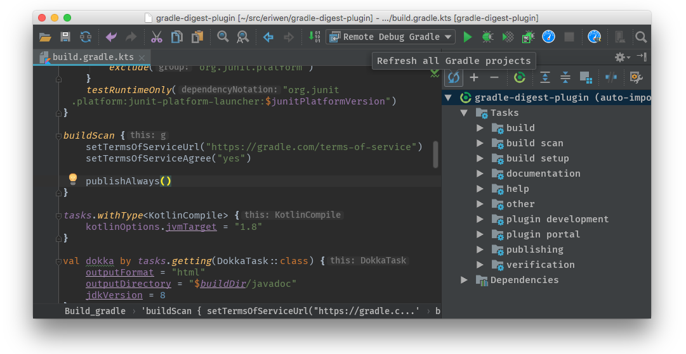
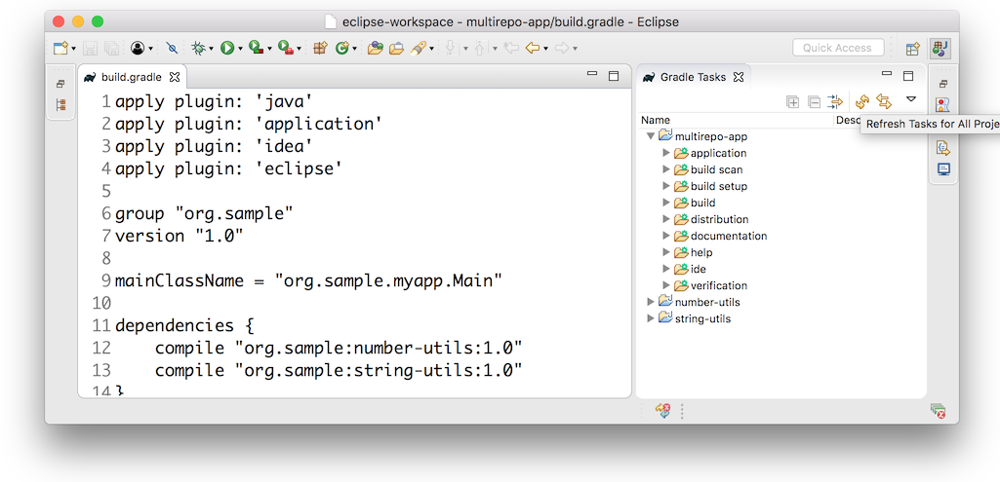

# 对构建进行故障排除

内容

  * [对Gradle安装进行故障排除](#sec_troubleshooting_installation)
  * [调试依赖项解析](#sec_troubleshooting_dependency_resolution)
  * [对缓慢的Gradle构建进行故障排除](#sec_troubleshooting_performance)
  * [调试构建逻辑](#sec_troubleshooting_build_logic)
  * [调试IDE集成](#sec_troubleshooting_ide_integration)
  * [获得更多帮助](#getting_additional_help)

以下是常见问题的集合以及解决这些问题的建议。您可以获取其他技巧，并搜索[Gradle论坛](https://discuss.gradle.org/c/help-discuss)和
[StackOverflow#gradle](https://stackoverflow.com/questions/tagged/gradle)答案以及来自
[help.gradle.org的](https://help.gradle.org/)Gradle文档。

<h2 id = '#sec_troubleshooting_installation'> <a href = '#sec_troubleshooting_installation'>对Gradle安装进行故障排除</a> </h2>

如果您按照[安装说明进行操作](https://docs.gradle.org/current/userguide/installation.html#installation)，并且无法执行Gradle构建，则以下一些技巧可能会有所帮助。

如果在调用[Gradle Wrapper](https://docs.gradle.org/current/userguide/gradle_wrapper.html#gradle_wrapper)之外安装了[Gradle](https://docs.gradle.org/current/userguide/gradle_wrapper.html#gradle_wrapper)，则可以通过`gradle --version`在终端中运行来检查Gradle的安装。

您应该会看到以下内容：

    
    
    ❯ gradle --version
    
    ------------------------------------------------------------
    Gradle 6.5
    ------------------------------------------------------------
    
    Build time:   2020-06-02 20:46:21 UTC
    Revision:     a27f41e4ae5e8a41ab9b19f8dd6d86d7b384dad4
    
    Kotlin:       1.3.72
    Groovy:       2.5.11
    Ant:          Apache Ant(TM) version 1.10.7 compiled on September 1 2019
    JVM:          14 (AdoptOpenJDK 14+36)
    OS:           Mac OS X 10.15.2 x86_64

如果没有，您可能会看到以下一些信息

<h3 id = '#command_not_found_gradle'> <a href = '#command_not_found_gradle'>找不到命令：gradle</a> </h3>

如果收到“找不到命令：gradle”，则需要确保Gradle已正确添加到您的中`PATH`。

<h3 id = '#java_home_is_set_to_an_invalid_directory'> <a href = '#java_home_is_set_to_an_invalid_directory'>JAVA_HOME设置为无效目录</a> </h3>

如果您得到以下信息：
    
    ERROR: JAVA_HOME is set to an invalid directory
    
    Please set the JAVA_HOME variable in your environment to match the location of your Java installation.

您需要确保[正确安装](https://www.java.com/en/download/help/index_installing.xml)了
[Java DevelopmentKit](https://jdk.java.net/)版本8或更高版本，设置了环境变量，并将Java添加到您的
[`JAVA_HOME` `PATH`](https://www.java.com/en/download/help/path.xml) 中。

<h3 id = '#permission_denied'> <a href = '#permission_denied'>没有权限</a> </h3>

如果您获得“权限被拒绝”，则意味着Gradle可能存在于正确的位置，但不可执行。您可以`chmod +x path/to/executable`在基于*
nix的系统上解决此问题。

<h3 id = '#other_installation_failures'> <a href = '#other_installation_failures'>其他安装失败</a> </h3>

如果`gradle --version`可行，但您的所有构建都失败并出现相同的错误，则您的Gradle构建配置脚本之一可能存在问题。

您可以通过运行`gradle help`配置脚本而不执行Gradle任务来验证问题是否出在Gradle脚本上。如果错误仍然存​​在，则构建配置存在问题。如果不是，则问题在于执行一个或多个请求的任务（Gradle首先执行配置脚本，然后执行构建步骤）。

<h2 id = '#sec_troubleshooting_dependency_resolution'> <a href = '#sec_troubleshooting_dependency_resolution'>调试依赖项解析</a> </h2>

[疑难解答依赖性解析](https://docs.gradle.org/current/userguide/viewing_debugging_dependencies.html)中介绍了常见的依赖性解析问题，例如解决版本冲突。

通过单击“ _Dependencies”_ 视图并使用搜索功能，并指定解决原因，您可以看到依赖关系树，并查看哪些已解决的依赖关系版本与请求的版本不同。

图1.调试依赖项与构建扫描冲突

可以使用带有筛选条件的[实际构建扫描](https://scans.gradle.com/s/sample/troubleshooting-userguide/dependencies?expandAll&filters=WzFd&toggled=W1swXSxbMF0sWzAsMF0sWzAsMV1d)进行探索。

<h2 id = '#sec_troubleshooting_performance'> <a href = '#sec_troubleshooting_performance'>对缓慢的Gradle构建进行故障排除</a> </h2>

有关构建性能问题（包括“同步速度慢”），请参阅《[改进Gradle构建的性能](https://guides.gradle.org/performance/)指南》。

Android开发人员应观看Android SDK工具团队的有关[加速Android Gradle构建](https://youtu.be/7ll-rkLCtyk)的演示。Android
Studio用户指南还介绍了许多[有关优化构建速度的](https://developer.android.com/studio/build/optimize-your-build.html)技巧。

<h2 id = '#sec_troubleshooting_build_logic'> <a href = '#sec_troubleshooting_build_logic'>调试构建逻辑</a> </h2>

<h3 id = '#attaching_a_debugger_to_your_build'> <a href = '#attaching_a_debugger_to_your_build'>将调试器附加到构建</a> </h3>

您可以通过将属性设置为“true”，然后将远程调试器附加到端口5005来设置断点并在Gradle构建自身中调试[buildSrc和独立插件](https://docs.gradle.org/current/userguide/custom_plugins.html#sec_packaging_a_plugin)`org.gradle.debug`。

    ❯ gradle help -Dorg.gradle.debug=true

另外，如果您采用了Kotlin DSL，则还可以自己调试构建脚本。

以下视频演示了如何使用IntelliJ IDEA调试示例构建。

图2.构建脚本的交互式调试

<h3 id = '#adding_and_changing_logging'> <a href = '#adding_and_changing_logging'>添加和更改日志记录</a> </h3>

除了[控制日志记录的详细程度之外](https://docs.gradle.org/current/userguide/command_line_interface.html#sec_command_line_logging)，您还可以使用[`--console=verbose`flag控制](https://docs.gradle.org/current/userguide/command_line_interface.html#sec_command_line_customizing_log_format)生命周期日志记录中任务结果的显示（例如“UP-TO-DATE”）。

您还可以通过注册各种事件侦听器，用自己的Gradle日志记录代替许多日志记录。[日志记录文档中说明](https://docs.gradle.org/current/userguide/logging.html#sec_changing_what_gradle_logs)了一个[自定义事件记录器的](https://docs.gradle.org/current/userguide/logging.html#sec_changing_what_gradle_logs)示例。您还可以[从外部工具控制日志记录](https://docs.gradle.org/current/userguide/logging.html#sec_external_tools)，使它们更加冗长，以便调试它们的执行。

     您可以在`GRADLE_USER_HOME/daemon/<gradle-version>/`下找到[Gradle Daemon的](https://docs.gradle.org/current/userguide/gradle_daemon.html#gradle_daemon)其他日志。  
  
  
<h3 id = '#task_executed_when_it_should_have_been_up_to_date'> <a href = '#task_executed_when_it_should_have_been_up_to_date'>任务应该在UP-TO-DATE执行</a> </h3>

`--info`日志解释了执行任务的原因，尽管构建扫描通过以下方式以可搜索的可视方式执行此操作：转到“ _Timeline”_ 视图，然后单击要检查的任务。

图3.使用构建扫描调试增量构建

您可以从此[清单中](https://docs.gradle.org/current/userguide/more_about_tasks.html#sec_task_outcomes)了解任务结果的含义。

<h2 id = '#sec_troubleshooting_ide_integration'> <a href = '#sec_troubleshooting_ide_integration'>调试IDE集成</a> </h2>

可以通过“刷新” Gradle解决IDE中许多不常见的错误。另请参阅有关[在IntelliJ IDEA](https://www.jetbrains.com/help/idea/gradle.html)和[Eclipse中](http://www.vogella.com/tutorials/EclipseGradle/article.html)使用Gradle的更多文档。

<h3 id = '#refreshing_intellij_idea'> <a href = '#refreshing_intellij_idea'>刷新IntelliJIDEA</a> </h3>

**注意：**
这仅适用于[链接到IntelliJ的](https://www.jetbrains.com/help/idea/gradle.html#link_gradle_project)Gradle项目。

在主菜单中，进入`View`> `Tool Windows`> `Gradle`。然后单击 _Refresh_ 图标。

图4.在IntelliJ IDEA中刷新Gradle项目

<h3 id = '#refreshing_eclipse_using_buildship'> <a href = '#refreshing_eclipse_using_buildship'>刷新Eclipse（使用Buildship）</a> </h3>

如果您将[Buildship](https://projects.eclipse.org/projects/tools.buildship)用于Eclipse IDE，则可以通过打开“ Gradle Tasks”视图并单击“ Refresh”图标，或者通过在编辑Gradle脚本时从上下文菜单执行`Gradle`>`Refresh Gradle Project`命令来重新同步Gradle构建。。

图5.在Eclipse Buildship中刷新Gradle项目

<h2 id = '#getting_additional_help'> <a href = '#getting_additional_help'>获得更多帮助</a> </h2>

如果您在此处未找到解决问题的解决方法，请在[帮助论坛](https://discuss.gradle.org/c/help-discuss)上与Gradle社区联系，或使用[help.gradle.org](https://help.gradle.org/)搜索相关的开发人员资源。

如果您认为自己在Gradle中发现了错误，请在GitHub上[提交问题](https://github.com/gradle/gradle/issues)。

