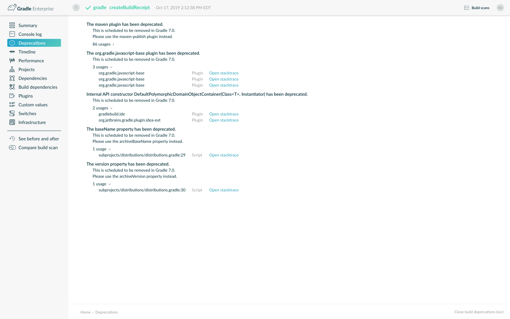

# 将您的构建从Gradle 4.x升级到5.0

内容

  * [对于所有用户](#for_all_users)
  * [从4.10及更早版本升级](#changes_5_0)
  * [从4.9或更早版本升级](#changes_4_10)
  * [从4.8或更早版本升级](#changes_4_9)
  * [从4.7或更早版本升级](#changes_4_8)
  * [从4.6及更早版本升级](#changes_4_7)
  * [从4.5或更早版本升级](#changes_4_6)
  * [从4.4及更早版本升级](#changes_4_5)
  * [从4.3或更早版本升级](#changes_4_4)
  * [从4.2或更早版本升级](#changes_4_3)
  * [从4.1及更早版本升级](#changes_4_2)
  * [从4.0升级](#changes_4_1)
  * [细节变化](#changes_in_detail)

本章提供了将较早的Gradle 4.x构建迁移到Gradle
5.0所需的信息。在大多数情况下，您将需要应用升级版本之后所有版本的更改。例如，如果您要从Gradle
4.3升级到5.0，则还需要应用4.4、4.5等最高5.0的更改。

╔═════════════════════════════    
如果您使用的是Android Gradle，则需要同时升级到Android Gradle插件和Android Studio的3.3版或更高版本。  
╚═════════════════════════════    
  
<h2 id = '#for_all_users'> <a href = '#for_all_users'>对于所有用户</a> </h2>

  1. 如果尚未使用最新的4.10.x版本，请阅读以下各节[，](#changes_4_10)以帮助您将项目升级到最新的4.10.x版本。我们建议升级到最新的4.10.x版本以获取最有用的警告和弃用信息，然后再升级到5.0。避免同时升级Gradle并迁移到Kotlin DSL，以便在出现潜在问题时简化故障排除。

  2. 尝试运行`gradle help --scan`并查看生成的构建扫描的[弃用视图](https://gradle.com/enterprise/releases/2018.4/#identify-usages-of-deprecated-gradle-functionality)。如果没有警告，则不会出现“弃用”选项卡。

这样一来，您就可以看到适用于您的构建的所有弃用警告。如果您尝试直接升级到Gradle 5.x，它将生成（可能不太明显）错误。

另外，您可能会`gradle help --warning-mode=all`在控制台中看到过时的信息，尽管它可能不会报告太多详细信息。

  3. 更新您的插件。

一些插件将随新版本的Gradle一起中断，例如，因为它们使用已被删除或更改的内部API。上一步将通过在插件确实尝试使用API​​弃用的部分时发出弃用警告来帮助您识别潜在的问题。

特别是，您将至少需要使用2.x版本的[ **Shadow
Plugin**](https://plugins.gradle.org/plugin/com.github.johnrengelman.shadow) 。

  4. 运行`gradle wrapper --gradle-version 5.0`以将项目更新到5.0

  5. 如果还没有，请转到Java 8或更高版本。而Gradle 4.x需要Java 7，Gradle 5需要Java 8才能运行。

  6. 阅读“[从4.10升级”](#changes_5_0)部分并进行任何必要的更改。

  7. 尝试使用《[故障排除指南》](/md/对构建进行故障排除.md#troubleshooting)运行项目并调试所有错误。

此外，Gradle还添加了一些重要的新功能和改进的功能，您应该在构建中考虑使用这些功能：

  * [Maven Publish和Ivy Publish插件](#rel4_8_switch_to_publishing_plugins)现在支持带有[签名插件的](https://docs.gradle.org/6.7.1/userguide/signing_plugin.html#signing_plugin)数字签名。

  * 在构建中使用本机[BOM导入](#rel5_0_bom_import)。

  * 用于使工作单元并行运行的[Worker API](/md/开发自定义Gradle任务类型.md#worker_api)。

  * 用于[延迟创建和配置任务的](#rel4_9_lazy_task_creation)新API ，可以显着缩短构建的配置时间。

需要注意的其他值得注意的更改可能会破坏您的构建，包括：

  * [使用POM时将编译和运行时依赖项分开](#rel5_0_pom_compile_runtime_separation)

  * 更改意味着您应该[配置现有任务`wrapper`和`init`任务，](#rel4_8_configure_internal_tasks)而不是定义自己的[任务](#rel4_8_configure_internal_tasks)。

  * 的[Maven中POM排除隐式通配符的表彰](#rel4_8_pom_wildcard_exclusions)，这可能会导致依赖性被排除那些不前。

  * 一[的方式来改变你添加Java注释处理器的一个项目](#rel4.6:annotation_processor_configuration)。

  * 命令行客户端Gradle守护程序以及所有工作程序（包括编译器和测试执行程序）的[默认内存设置](#rel5_0_default_memory_settings)已大大减少。

  * [几个代码质量插件](#rel5_0_default_tool_versions)的[默认版本](#rel5_0_default_tool_versions)已更新。

  * [Gradle使用的](#rel5_0_library_upgrades)几个[库版本](#rel5_0_library_upgrades)已升级。

<h2 id = '#changes_5_0'> <a href = '#changes_5_0'>从4.10及更早版本升级</a> </h2>

如果您尚未使用4.10版本，请跳至适用于当前Gradle版本的部分，然后逐步升级，直至到达此处。然后，从Gradle 4.10移至5.0时应用这些更改。

<h3 id = '#other_changes'> <a href = '#other_changes'>其他变化</a> </h3>

  * 在`enableFeaturePreview('IMPROVED_POM_SUPPORT')`和`enableFeaturePreview('STABLE_PUBLISHING')`标志不再是必要的。现在默认情况下启用了这些功能。

  * Gradle现在捆绑了Java 9及更高版本的[JAXB](#rel5_0_jaxb_and_java9)。您可以从中删除该`--add-modules java.xml.bind`选项`org.gradle.jvmargs`（如果已设置）。

<h3 id = '#potential_breaking_changes'> <a href = '#potential_breaking_changes'>潜在的重大变化</a> </h3>

本节中的更改有可能破坏您的构建，但是大多数版本已被弃用了相当长的时间，很少有构建会受到大量构建的影响。强烈建议您先升级到Gradle
4.10，以获取有关弃用会影响构建的报告。

以下重大变化不是因为弃用，而是行为变化的结果：

  * [使用POM时将编译和运行时依赖项分开](#rel5_0_pom_compile_runtime_separation)

  * 对该`publishing {}`块的评估不再推迟到需要时才执行，但其行为类似于任何其他块。`afterEvaluate {}`如果您需要推迟评估，请使用。

  * 在[`Javadoc`](https://docs.gradle.org/6.7.1/dsl/org.gradle.api.tasks.javadoc.Javadoc.html)和[`Groovydoc`](https://docs.gradle.org/6.7.1/dsl/org.gradle.api.tasks.javadoc.Groovydoc.html)任务现在执行之前删除的文件的目标目录。已添加此功能以从上一次任务执行中删除过时的输出文件。

  * 该[Java库分布插件](https://docs.gradle.org/6.7.1/userguide/java_library_distribution_plugin.html)现在是基于[Java库插件](/md/Java库插件.md)，而不是[Java插件](https://docs.gradle.org/6.7.1/userguide/java_plugin.html)。

在应用Java插件时，其行为略有不同（例如，它添加了`api`配置）。因此，请确保在升级后检查您的构建是否符合预期。

  * 该`html`物业`CheckstyleReport`和`FindBugsReport`现在返回一个[`CustomizableHtmlReport`](https://docs.gradle.org/6.7.1/dsl/org.gradle.api.reporting.CustomizableHtmlReport.html)实例，它是更容易从像Java和Kotlin静态类型语言配置。

  * 该[配置避免API](#rel5_0_configuration_avoidance)已更新，以防止从未使用任务的创建和配置。

  * 命令行客户端Gradle守护程序以及所有工作程序（包括编译器和测试执行程序）的[默认内存设置](#rel5_0_default_memory_settings)已大大减少。

  * [几个代码质量插件](#rel5_0_default_tool_versions)的[默认版本](#rel5_0_default_tool_versions)已更新。

  * [Gradle使用的](#rel5_0_library_upgrades)几个[库版本](#rel5_0_library_upgrades)已升级。

以下重大更改将在Gradle 4.10中作为弃用警告显示：

一般

    

  * `<<`任务定义不再有效。换句话说，您不能使用语法`task myTask << { …​ }`。

改用[Task.doLast（）](https://docs.gradle.org/6.7.1/dsl/org.gradle.api.Task.html#org.gradle.api.Task:doLast\(org.gradle.api.Action\))方法，如下所示：

    
        任务myTask {
        doLast {
            ...
        }
    }

  * 您不能再在域对象名称中使用以下任何字符，例如项目和任务名称：<space> `/ \ : < > " ? * |`。您也不应将其`.`用作前导或尾随字符。

运行Gradle和构建环境

    

  * 如前所述，Gradle不能再在Java 7上运行。但是，您仍然可以使用[派生的编译和测试](/md/构建Java和JVM项目.md#sec_java_cross_compilation)来构建和测试Java 6及更高版本的软件。

  * 该`-Dtest.single`命令行选项已被删除-使用[测试过滤](/md/在Java和JVM项目中进行测试.md#test_filtering)来代替。

  * 该`-Dtest.debug`命令行选项已被删除-使用[`--debug-jvm`选项](/md/在Java和JVM项目中进行测试.md#sec_debugging_java_tests)来代替。

  * 将`-u`/`--no-search-upward`命令行选项已被删除-确保所有的构建有 _settings.gradle_ 文件。

  * 该`--recompile-scripts`命令行选项已被删除。

  * 除非嵌套的构建具有 _settings.gradle_ 文件，否则您不能再将Gradle嵌套在另一个Gradle构建的子目录中。

  * 该`DirectoryBuildCache.setTargetSizeInMB(long)`方法已删除-使用[DirectoryBuildCache.removeUnusedEntriesAfterDays](https://docs.gradle.org/6.7.1/dsl/org.gradle.caching.local.DirectoryBuildCache.html#org.gradle.caching.local.DirectoryBuildCache:removeUnusedEntriesAfterDays)代替。

  * 该`org.gradle.readLoggingConfigFile`系统属性不再做任何事情-更新受影响的测试，你的工作`java.util.logging`设置。

处理文件

    

  * 您不再可以`FileCollection`使用`as`关键字或`asType()`方法将对象转换为其他类型。

  * 您不能再`null`作为[CopySpec.from（Object，Action）](https://docs.gradle.org/6.7.1/javadoc/org/gradle/api/file/CopySpec.html#from-java.lang.Object-org.gradle.api.Action-)的配置操作通过。

  * 为了与Kotlin DSL更好地兼容，[CopySpec.duplicatesStrategy](https://docs.gradle.org/6.7.1/javadoc/org/gradle/api/file/DuplicatesStrategy.html)不再可以为空。属性设置器不再接受`null`将其重置为默认值的方式。使用`DuplicatesStrategy.INHERIT`代替。

  * 该`FileCollection.stopExecutionIfEmpty()`方法已删除-在任务属性上使用[@SkipWhenEmpty](https://docs.gradle.org/6.7.1/javadoc/org/gradle/api/tasks/SkipWhenEmpty.html)批注`FileCollection`。

  * 该`FileCollection.add()`方法已删除-使用[Project.files（）](https://docs.gradle.org/6.7.1/dsl/org.gradle.api.Project.html#org.gradle.api.Project:files\(java.lang.Object\[\]\))和[Project.fileTree（）](https://docs.gradle.org/6.7.1/dsl/org.gradle.api.Project.html#org.gradle.api.Project:fileTree\(java.lang.Object\))创建可配置的文件集合/文件树，并通过[ConfigurableFileCollection.from（）](https://docs.gradle.org/6.7.1/javadoc/org/gradle/api/file/ConfigurableFileCollection.html#from-java.lang.Object...-)将其添加到其中。

  * `SimpleFileCollection`已被删除-使用[Project.files（Object ...）](https://docs.gradle.org/6.7.1/dsl/org.gradle.api.Project.html#org.gradle.api.Project:files\(java.lang.Object\[\]\))代替。

  * 没有自己的类扩展`AbstractFileCollection`-改用[Project.files（）](https://docs.gradle.org/6.7.1/dsl/org.gradle.api.Project.html#org.gradle.api.Project:files\(java.lang.Object\[\]\))方法。此问题可能显示为缺少的`getBuildDependencies()`方法。

Java构建

    

  * 该`CompileOptions.bootClasspath`属性已删除-使用[CompileOptions.bootstrapClasspath](https://docs.gradle.org/6.7.1/dsl/org.gradle.api.tasks.compile.CompileOptions.html#org.gradle.api.tasks.compile.CompileOptions:bootstrapClasspath)代替。

  * 您不能再`-source-path`用作通用编译器参数，而应改用[CompileOptions.sourcepath](https://docs.gradle.org/6.7.1/dsl/org.gradle.api.tasks.compile.CompileOptions.html#org.gradle.api.tasks.compile.CompileOptions:sourcepath)。

  * 您不能再`-processorpath`用作通用编译器参数，而应改用[CompileOptions.annotationProcessorPath](https://docs.gradle.org/6.7.1/dsl/org.gradle.api.tasks.compile.CompileOptions.html#org.gradle.api.tasks.compile.CompileOptions:annotationProcessorPath)。

  * Gradle将不再自动应用编译类路径上的注释处理器-改用[CompileOptions.annotationProcessorPath](https://docs.gradle.org/6.7.1/dsl/org.gradle.api.tasks.compile.CompileOptions.html#org.gradle.api.tasks.compile.CompileOptions:annotationProcessorPath)。

  * 该`testClassesDir`属性已从“[测试”](https://docs.gradle.org/6.7.1/dsl/org.gradle.api.tasks.testing.Test.html)任务中删除-改用[testClassesDirs](https://docs.gradle.org/6.7.1/dsl/org.gradle.api.tasks.testing.Test.html#org.gradle.api.tasks.testing.Test:testClassesDirs)。

  * 该`classesDir`属性已从 _JDepend_ 任务和[SourceSetOutput中删除](https://docs.gradle.org/6.7.1/dsl/org.gradle.api.tasks.SourceSetOutput.html)。请改用 _JDepend.classesDirs_ 和[SourceSetOutput.classesDirs](https://docs.gradle.org/6.7.1/dsl/org.gradle.api.tasks.SourceSetOutput.html#org.gradle.api.tasks.SourceSetOutput:classesDirs)属性。

  * `JavaLibrary(PublishArtifact, DependencySet)`构造函数已被删除[-Shadow Plugin](https://plugins.gradle.org/plugin/com.github.johnrengelman.shadow)使用了该构造函数，因此请确保至少升级到该插件的2.x版本。

  * 该`JavaBasePlugin.configureForSourceSet()`方法已被删除。

  * 您不再可以创建自己的[JavaPluginConvention](https://docs.gradle.org/6.7.1/javadoc/org/gradle/api/plugins/JavaPluginConvention.html)，[ApplicationPluginConvention](https://docs.gradle.org/6.7.1/javadoc/org/gradle/api/plugins/ApplicationPluginConvention.html)，[WarPluginConvention](https://docs.gradle.org/6.7.1/javadoc/org/gradle/api/plugins/WarPluginConvention.html)，[EarPluginConvention](https://docs.gradle.org/6.7.1/javadoc/org/gradle/plugins/ear/EarPluginConvention.html)，[BasePluginConvention](https://docs.gradle.org/6.7.1/javadoc/org/gradle/api/plugins/BasePluginConvention.html)和[ProjectReportsPluginConvention](https://docs.gradle.org/6.7.1/javadoc/org/gradle/api/plugins/ProjectReportsPluginConvention.html)实例。

  * 该`Maven`插件用于发布过时的Maven 2元数据格式。这已更改，现在将像`Maven Publish`插件一样发布Maven 3元数据。

随着对Maven 2支持的删除，配置唯一快照行为的方法也已删除。Maven 3仅支持唯一的快照，因此我们决定删除它们。

任务和属性

    

  * 删除了以下与[惰性属性](/md/延迟配置.md#lazy_properties)相关的旧类和方法-使用[ObjectFactory.property（）](https://docs.gradle.org/6.7.1/javadoc/org/gradle/api/model/ObjectFactory.html#property-java.lang.Class-)创建`Property`实例：

    * `PropertyState`

    * `DirectoryVar`

    * `RegularFileVar`

    * `ProjectLayout.newDirectoryVar()`

    * `ProjectLayout.newFileVar()`

    * `Project.property(Class)`

    * `Script.property(Class)`

    * `ProviderFactory.property(Class)`

  * 使用[任务配置避免](/md/避免任务配置.md#sec:task_configuration_avoidance_migration_guidelines)API配置和注册的[任务](/md/避免任务配置.md#sec:task_configuration_avoidance_migration_guidelines)对可以从配置操作中调用的其他方法有更多限制。

  * 内部`@Option`和`@OptionValues`注释（程序包`org.gradle.api.internal.tasks.options`）已被删除。请改用公共[@Option](https://docs.gradle.org/6.7.1/javadoc/org/gradle/api/tasks/options/Option.html)和[@OptionValues](https://docs.gradle.org/6.7.1/javadoc/org/gradle/api/tasks/options/OptionValues.html)批注。

  * 该`Task.deleteAllActions()`方法已删除，无法替代。

  * 该`Task.dependsOnTaskDidWork()`方法已删除-改用[声明的输入和输出](/md/处理任务.md#sec_up_to_date_checks)。

  * `TaskInternal`已删除以下属性和方法-使用任务依赖项，任务规则，可重用的实用程序方法或[Worker API](/md/开发自定义Gradle任务类型.md#worker_api)代替直接执行任务。

    * `execute()`

    * `executer`

    * `getValidators()`

    * `addValidator()`

  * 该[TaskInputs.file（对象）](https://docs.gradle.org/6.7.1/javadoc/org/gradle/api/tasks/TaskInputs.html#file-java.lang.Object-)方法可以不再用参数来调用解析为比一个常规文件的其他任何内容。

  * 该[TaskInputs.dir（对象）](https://docs.gradle.org/6.7.1/javadoc/org/gradle/api/tasks/TaskInputs.html#dir-java.lang.Object-)方法可以不再用参数来调用解析为多单目录以外的任何其他。

  * 您不再可以通过[TaskInputs](https://docs.gradle.org/6.7.1/javadoc/org/gradle/api/tasks/TaskInputs.html)和[TaskOutputs](https://docs.gradle.org/6.7.1/javadoc/org/gradle/api/tasks/TaskOutputs.html)注册无效的输入和输出。

  * 该`TaskDestroyables.file()`和`TaskDestroyables.files()`方法已被删除-使用[TaskDestroyables.register（）](https://docs.gradle.org/6.7.1/javadoc/org/gradle/api/tasks/TaskDestroyables.html#register-java.lang.Object...-)来代替。

  * `SimpleWorkResult`已被删除-使用[WorkResult.didWork](https://docs.gradle.org/6.7.1/javadoc/org/gradle/api/tasks/WorkResult.html#getDidWork--)。

  * 现在，覆盖[4.8](#deprecations_4_8)中[弃用的](#deprecations_4_8)内置任务会产生错误。

尝试替换内置任务将产生类似于以下错误：

    
        > Cannot add task 'wrapper' as a task with that name already exists.

Scala和Play

    

  * 不再支持Play 2.2-请升级您使用的Play版本。

  * 该`ScalaDocOptions.styleSheet`属性已被删除-Scala 2.11.8和更高版本中的Scaladoc Ant任务不再支持此属性。

Kotlin DSL

    

  * Artifact配置访问器现在具有类型，`NamedDomainObjectProvider<Configuration>`而不是`Configuration`

  * `PluginAware.apply<T>(to)`被重命名了`PluginAware.applyTo<T>(target)`。

这两个更改都可能导致脚本编译错误。请参阅[Gradle Kotlin DSL发行说明，](https://github.com/gradle/kotlin-
dsl-samples/releases/tag/v1.0.2#breaking-changes)以获取更多信息以及如何修复因上述更改而损坏的构建。

杂

    

  * 该`ConfigurableReport.setDestination(Object)`方法已删除-使用[ConfigurableReport.setDestination（File）](https://docs.gradle.org/6.7.1/javadoc/org/gradle/api/reporting/ConfigurableReport.html#setDestination-java.io.File-)代替。

  * 该`Signature.setFile(File)`方法已删除-Gradle不支持更改生成的签名的输出文件。

  * 只读`Signature.toSignArtifact`属性已被删除-永远不应成为公共API的一部分。

  * 该`@DeferredConfigurable`注释已被删除。

  * 该方法`isDeferredConfigurable()`已从中删除`ExtensionSchema`。

  * `IdeaPlugin.performPostEvaluationActions()`并`EclipsePlugin.performPostEvaluationActions()`已被删除。

  * `The `BroadcastingCollectionEventRegister.getAddAction()` 方法已删除，无法替代。

  * `org.gradle.util`默认情况下，不再导入内部软件包。

理想情况下，您不应该使用此软件包中的类，但是，作为快速解决方案，您可以将显式导入添加到这些类的构建脚本中。

  * [默认情况下](#rel5_0_gradle_plugin_portal_metadata)，`gradlePluginPortal()`存储库[不再查找没有POM的JAR](#rel5_0_gradle_plugin_portal_metadata)。

  * Tooling API不能再使用Gradle 2.6以下的Gradle版本连接到构建。通过TestKit运行的构建也是如此。

  * Gradle 5.0需要最低版本的Tooling API客户端3.0。较旧的客户端库无法再使用Gradle 5.0运行构建。

  * 所述IdeaModule模具API模型元素包含方法，所以这些元素是从结果移除以检索资源和测试资源`IdeaModule.getSourceDirs()`和`IdeaModule.getTestSourceDirs()`。

  * 在以前的Gradle版本中，可从子类访问中的`source`字段`SourceTask`。`source`现在不再是这种情况，因为该字段现在声明为`private`。

  * 在Worker API中，[不能再设置worker的工作目录](#rel5_0_worker_api)。

  * 与[依赖关系和版本约束](#rel5_0_dependency_constraints)有关的行为更改可能会影响少量用户。

  * [对DefaultTask](#rel5_0_changes_to_default_task)上的[属性工厂方法进行](#rel5_0_changes_to_default_task)了一些更改，这些更改可能会影响自定义任务的创建。

<h2 id = '#changes_4_10'> <a href = '#changes_4_10'>从4.9或更早版本升级</a> </h2>

如果您尚未安装4.9版，请跳至适用于当前Gradle版本的部分，然后逐步升级，直至到达此处。然后，在升级到Gradle 4.10时应用这些更改。

<h3 id = '#deprecated_classes_methods_and_properties'> <a href = '#deprecated_classes_methods_and_properties'>不推荐使用的类，方法和属性</a> </h3>

按照API链接了解如何处理这些弃用（如果此处未提供其他信息）：

  * `TaskContainer.add()`和`TaskContainer.addAll()`-使用[TaskContainer.create（）](https://docs.gradle.org/6.7.1/javadoc/org/gradle/api/tasks/TaskContainer.html#create-java.lang.String-java.lang.Class-org.gradle.api.Action-)或[TaskContainer.register（）](https://docs.gradle.org/6.7.1/javadoc/org/gradle/api/tasks/TaskContainer.html#register-java.lang.String-java.lang.Class-org.gradle.api.Action-)代替

<h3 id = '#potential_breaking_changes_2'> <a href = '#potential_breaking_changes_2'>潜在的重大变化</a> </h3>

  * Kotlin DSL中存在一些潜在的重大更改—请参阅该[项目的发行说明中](https://github.com/gradle/kotlin-dsl/releases/tag/v1.0-RC3)的 _“重大更改”_ 部分。

  * 您不能再使用具有惰性任务配置的任何[Project.beforeEvaluate（）](https://docs.gradle.org/6.7.1/dsl/org.gradle.api.Project.html#org.gradle.api.Project:beforeEvaluate\(org.gradle.api.Action\))或[Project.afterEvaluate（）](https://docs.gradle.org/6.7.1/dsl/org.gradle.api.Project.html#org.gradle.api.Project:afterEvaluate\(org.gradle.api.Action\))方法，例如在[TaskContainer.register（）](https://docs.gradle.org/6.7.1/javadoc/org/gradle/api/tasks/TaskContainer.html#register-java.lang.String-java.lang.Class-org.gradle.api.Action-)块内。

  * [发布到AWS S3需要新权限](#rel4_10_aws_s3_permissions)。

  * 无论[PluginUnderTestMetadata](https://docs.gradle.org/6.7.1/javadoc/org/gradle/plugin/devel/tasks/PluginUnderTestMetadata.html)和[GeneratePluginDescriptors](https://docs.gradle.org/6.7.1/javadoc/org/gradle/plugin/devel/tasks/GeneratePluginDescriptors.html) -由所使用的类[Java的Gradle插件开发插件](https://docs.gradle.org/6.7.1/userguide/java_gradle_plugin.html)-已更新为使用提供API。

使用[Property.set（）](https://docs.gradle.org/6.7.1/javadoc/org/gradle/api/provider/Property.html#set-T-)方法修改其值，而不要使用标准的属性分配语法，除非您在Groovy构建脚本中这样做。在这种情况下，标准属性分配仍然有效。

<h2 id = '#changes_4_9'> <a href = '#changes_4_9'>从4.8或更早版本升级</a> </h2>

  * [考虑尝试使用惰性API进行任务创建和配置](#rel4_9_lazy_task_creation)

<h3 id = '#potential_breaking_changes_3'> <a href = '#potential_breaking_changes_3'>潜在的重大变化</a> </h3>

  * 您不能再将GPath语法与[task.withType（）一起使用](https://docs.gradle.org/6.7.1/javadoc/org/gradle/api/tasks/TaskCollection.html#withType-java.lang.Class-)。

请改用[Groovy的传播算子](https://docs.groovy-
lang.org/latest/html/documentation/#_spread_operator)。例如，您将替换`tasks.withType(JavaCompile).name`为`tasks.withType(JavaCompile)*.name`。

<h2 id = '#changes_4_8'> <a href = '#changes_4_8'>从4.7或更早版本升级</a> </h2>

  * [切换到Maven Publish和Ivy Publish插件](#rel4_8_switch_to_publishing_plugins)

  * [将延迟配置与发布插件一起使用](#rel4_8_deferred_configuration)

  * [配置现有任务`wrapper`和`init`任务，](#rel4_8_configure_internal_tasks)而不是定义自己的[任务](#rel4_8_configure_internal_tasks)

  * 如果当前正在为此目的使用插件或自定义解决方案，请考虑迁移到内置的[依赖项锁定机制](/md/锁定依赖版本.md)

<h3 id = '#potential_breaking_changes_4'> <a href = '#potential_breaking_changes_4'>潜在的重大变化</a> </h3>

  * 现在，如果找不到指定的初始化脚本，构建将失败。

  * `TaskContainer.remove()` 现在实际上删除了给定的任务-一些插件可能不小心依赖了旧的行为。

  * [Gradle现在可以在Maven POM排除中使用隐式通配符](#rel4_8_pom_wildcard_exclusions)。

  * Kotlin DSL现在遵守JSR-305封装注释。

这将导致根据JSR-305注释的某些类型在以前被视为不可为空的情况下被视为可为空。这可能会导致生成脚本中的编译错误。有关详细信息，请参阅[相关的Kotlin
DSL发行说明](https://github.com/gradle/kotlin-dsl/releases/tag/v0.17.4)。

  * 错误消息现在将定向到标准错误而不是标准输出，除非将控制台同时附加到标准输出和标准错误。这可能会影响抓取构建的普通控制台输出的工具。如果要从较早版本的Gradle升级，请忽略此更改。

<h3 id = '#deprecations_4_8'> <a href = '#deprecations_4_8'>弃用</a> </h3>

在此版本之前，允许内部版本替换内置任务。[不推荐使用此功能](https://docs.gradle.org/4.8/release-
notes.html#overwriting-gradle's-built-in-tasks)。

内置的任务的完整列表不应该被替换为：
`wrapper`，`init`，`help`，`tasks`，`projects`，`buildEnvironment`，`components`，`dependencies`，`dependencyInsight`，`dependentComponents`，`model`，`properties`。

<h2 id = '#changes_4_7'> <a href = '#changes_4_7'>从4.6及更早版本升级</a> </h2>

<h3 id = '#potential_breaking_changes_5'> <a href = '#potential_breaking_changes_5'>潜在的重大变化</a> </h3>

  * 按照约定，Gradle现在将在根项目的 _config / checkstyle_ 目录中查找Checkstyle配置文件。

除非您通过[checkstyle.configDir](https://docs.gradle.org/6.7.1/dsl/org.gradle.api.plugins.quality.CheckstyleExtension.html#org.gradle.api.plugins.quality.CheckstyleExtension:configDir)或[checkstyle.config](https://docs.gradle.org/6.7.1/dsl/org.gradle.api.plugins.quality.CheckstyleExtension.html#org.gradle.api.plugins.quality.CheckstyleExtension:config)显式配置它们的路径，否则子项目中的Checkstyle配置文件（旧的约定场所）将被忽略。

  * Gradle[普通控制台输出](#rel4_7_plain_console_output)的结构已更改，这可能会破坏抓取该输出的工具。

  * 与编译，链接和安装相关的许多本机任务的API[发生了重大变化](#rel_4_6_native_task_api_changes)。

  * [Kotlin DSL]现在必须显式键入用于访问Gradle的构建属性的委托属性（例如，在 _gradle.properties中_ 定义）。

  * [Kotlin DSL]`plugins {}`现在，在嵌套作用域内声明一个块会引发异常。

  * [Kotlin DSL]`pluginManagement {}`现在仅允许一个块。

  * `org.gradle.api.artifacts.cache.*`接口提供的缓存控制DSL不再可用。

  * `getEnabledDirectoryReportDestinations()`，`getEnabledFileReportDestinations()`并且`getEnabledReportNames()`都已从中删除`org.gradle.api.reporting.ReportContainer`。

  * [StartParameter.projectProperties](https://docs.gradle.org/6.7.1/javadoc/org/gradle/StartParameter.html#getProjectProperties--)和[StartParameter.systemPropertiesArgs](https://docs.gradle.org/6.7.1/javadoc/org/gradle/StartParameter.html#getSystemPropertiesArgs--)现在返回不可变映射。

<h2 id = '#changes_4_6'> <a href = '#changes_4_6'>从4.5或更早版本升级</a> </h2>

<h3 id = '#deprecations'> <a href = '#deprecations'>弃用</a> </h3>

  * 您不应将注释处理器放在编译类路径上，也不要使用`-processorpath`编译器参数声明它们。

应该将它们添加到`annotationProcessor`配置中。如果您不希望进行任何处理，但是编译类路径无意中包含一个处理器（例如，作为您依赖的库的一部分），请使用`-proc:none`编译器参数将其忽略。

  * 使用[CommandLineArgumentProvider](https://docs.gradle.org/6.7.1/javadoc/org/gradle/process/CommandLineArgumentProvider.html)代替[CompilerArgumentProvider](https://docs.gradle.org/4.10.3/javadoc/org/gradle/api/tasks/compile/CompilerArgumentProvider.html)。

<h3 id = '#potential_breaking_changes_6'> <a href = '#potential_breaking_changes_6'>潜在的重大变化</a> </h3>

  * Java插件现在` _sourceSet_ AnnotationProcessor`为每个源集添加一个配置，如果其中任何一个与您现有的配置相匹配，则该配置可能会中断。我们建议您删除冲突的配置声明。

  * 该`StartParameter.taskOutputCacheEnabled`属性已由[StartParameter.setBuildCacheEnabled（boolean）](https://docs.gradle.org/6.7.1/javadoc/org/gradle/StartParameter.html#setBuildCacheEnabled-boolean-)替换。

  * 现在，Visual Studio集成仅为[构建中的所有组件配置一个解决方案](#rel4_6_visual_studio_single_solution)。

  * Gradle已用4.5.5版本替换了HttpClient 4.4.1。

  * Gradle现在捆绑了`kotlin-stdlib-jdk8`神器而不是`kotlin-stdlib-jre8`。这可能会影响您的构建。请参阅[Kotlin文档](http://kotlinlang.org/docs/reference/whatsnew12.html#kotlin-standard-library-artifacts-and-split-packages)以了解更多详细信息。

<h2 id = '#changes_4_5'> <a href = '#changes_4_5'>从4.4及更早版本升级</a> </h2>

  * 确保您具有 _settings.gradle_ 文件：它避免了性能下降，并允许您设置根项目的名称。

  * Gradle现在忽略包含的构建（[复合构建](/md/复合构建.md)）的构建缓存配置，而是对所有构建使用根构建的配置。

<h3 id = '#potential_breaking_changes_7'> <a href = '#potential_breaking_changes_7'>潜在的重大变化</a> </h3>

  * `ValidateTaskProperties.setOutputFile()`删除了两个重载方法。当从构建脚本访问任务时，它们会被自动生成的setter替换，但是构建脚本之外的插件和其他代码不会出现这种情况。

  * Maven Publish插件现在可以生成更完整的maven-metadata.xml文件，包括维护`<snapshotVersion>`元素列表。一些旧版本的Maven可能无法使用此元数据。

  * [`HttpBuildCache`不再遵循重定向](#rel4_5_http_build_cache_no_follow_redirects)。

  * 该`Depend`任务类型已被删除。

  * [Project.file（Object）](https://docs.gradle.org/6.7.1/dsl/org.gradle.api.Project.html#org.gradle.api.Project:file\(java.lang.Object\))不再规范不区分大小写的文件系统上文件路径的大小写。现在，在这种情况下，它会忽略大小写，并且不会影响文件系统。

  * [ListProperty](https://docs.gradle.org/6.7.1/javadoc/org/gradle/api/provider/ListProperty.html)不再扩展[Property](https://docs.gradle.org/6.7.1/javadoc/org/gradle/api/provider/Property.html)。

<h2 id = '#changes_4_4'> <a href = '#changes_4_4'>从4.3或更早版本升级</a> </h2>

<h3 id = '#potential_breaking_changes_8'> <a href = '#potential_breaking_changes_8'>潜在的重大变化</a> </h3>

  * 现在，非JVM测试任务以及[Test](https://docs.gradle.org/6.7.1/dsl/org.gradle.api.tasks.testing.Test.html)扩展了[AbstractTestTask](https://docs.gradle.org/6.7.1/dsl/org.gradle.api.tasks.testing.AbstractTestTask.html)。因此，插件应注意配置所有类型的任务`AbstractTestTask`。

  * [EclipseClasspath.defaultOutputDir](https://docs.gradle.org/6.7.1/dsl/org.gradle.plugins.ide.eclipse.model.EclipseClasspath.html#org.gradle.plugins.ide.eclipse.model.EclipseClasspath:defaultOutputDir)的默认输出位置已从 _`$projectDir` / bin_更改为 _`$projectDir` / bin / default_。

  * 不推荐使用的产品`InstallExecutable.setDestinationDir(Provider)`已删除-使用[InstallExecutable.installDirectory](https://docs.gradle.org/6.7.1/dsl/org.gradle.nativeplatform.tasks.InstallExecutable.html#org.gradle.nativeplatform.tasks.InstallExecutable:installDirectory)代替。

  * 已弃用的`InstallExecutable.setExecutable(Provider)`已删除-使用[InstallExecutable.executableFile](https://docs.gradle.org/6.7.1/dsl/org.gradle.nativeplatform.tasks.InstallExecutable.html#org.gradle.nativeplatform.tasks.InstallExecutable:executableFile)代替。

  * Gradle将不再喜欢在路径上找到的Visual Studio版本，而不是其他位置。现在是不得已了。

您可以通过[VisualCpp.setInstallDir（Object）](https://docs.gradle.org/6.7.1/dsl/org.gradle.nativeplatform.toolchain.VisualCpp.html#org.gradle.nativeplatform.toolchain.VisualCpp:installDir)指定所需的Visual
Studio版本的安装目录来绕过工具链发现。

  * `pluginManagement.repositories`现在的类型为[RepositoryHandler](https://docs.gradle.org/6.7.1/dsl/org.gradle.api.artifacts.dsl.RepositoryHandler.html)而不是`PluginRepositoriesSpec`已被删除的。

  * 依赖关系解决期间的5xx HTTP错误现在将触发构建中的异常。

  * 嵌入式Apache Ant已从1.9.6升级到1.9.9。

  * [Gradle使用的一些第三方库已升级，](#rel4_4_security_library_upgrades)可以解决安全问题。

<h2 id = '#changes_4_3'> <a href = '#changes_4_3'>从4.2或更早版本升级</a> </h2>

  * `plugins {}`现在，该块可以[用于子项目中](/md/使用Gradle插件.md#sec_subprojects_plugins_dsl)，也可以[用于](/md/使用Gradle插件.md#sec_subprojects_plugins_dsl)[ _buildSrc_](/md/使用Gradle插件.md#sec_buildsrc_plugins_dsl)[ 目录中的](/md/使用Gradle插件.md#sec_buildsrc_plugins_dsl)[插件 __](/md/使用Gradle插件.md#sec_buildsrc_plugins_dsl)。

<h3 id = '#other_deprecations'> <a href = '#other_deprecations'>其他折旧</a> </h3>

  * 您不应再通过Tooling API运行2.6之前的Gradle版本。

  * 您不应再通过比3.0更旧版本的Tooling API运行任何版本的Gradle。

  * 您不应再链接[TaskInputs.property（String，Object）](https://docs.gradle.org/6.7.1/javadoc/org/gradle/api/tasks/TaskInputs.html#property-java.lang.String-java.lang.Object-)和[TaskInputs.properties（Map）](https://docs.gradle.org/6.7.1/javadoc/org/gradle/api/tasks/TaskInputs.html#properties-java.util.Map-)方法。

<h3 id = '#potential_breaking_changes_9'> <a href = '#potential_breaking_changes_9'>潜在的重大变化</a> </h3>

  * [DefaultTask.newOutputDirectory（）](https://docs.gradle.org/6.7.1/javadoc/org/gradle/api/DefaultTask.html#newOutputDirectory--)现在返回`DirectoryProperty`而不是`DirectoryVar`。

  * [DefaultTask.newOutputFile（）](https://docs.gradle.org/6.7.1/javadoc/org/gradle/api/DefaultTask.html#newOutputFile--)现在返回`RegularFileProperty`而不是`RegularFileVar`。

  * [DefaultTask.newInputFile（）](https://docs.gradle.org/6.7.1/javadoc/org/gradle/api/DefaultTask.html#newInputFile--)现在返回`RegularFileProperty`而不是`RegularFileVar`。

  * [ProjectLayout.buildDirectory](https://docs.gradle.org/6.7.1/javadoc/org/gradle/api/file/ProjectLayout.html#getBuildDirectory--)现在返回`DirectoryProperty`而不是`DirectoryVar`。

  * 现在，[AbstractNativeCompileTask.compilerArgs](https://docs.gradle.org/6.7.1/dsl/org.gradle.language.nativeplatform.tasks.AbstractNativeCompileTask.html#org.gradle.language.nativeplatform.tasks.AbstractNativeCompileTask:compilerArgs)的类型`ListProperty<String>`为`List<String>`。

  * 现在，[AbstractNativeCompileTask.objectFileDir](https://docs.gradle.org/6.7.1/dsl/org.gradle.language.nativeplatform.tasks.AbstractNativeCompileTask.html#org.gradle.language.nativeplatform.tasks.AbstractNativeCompileTask:objectFileDir)的类型为`DirectoryProperty`而不是`File`。

  * 现在，[AbstractLinkTask.linkerArgs](https://docs.gradle.org/6.7.1/dsl/org.gradle.nativeplatform.tasks.AbstractLinkTask.html#org.gradle.nativeplatform.tasks.AbstractLinkTask:linkerArgs)的类型`ListProperty<String>`为`List<String>`。

  * `TaskDestroyables.getFiles()` 不再是公共API的一部分。

  * 现在，依赖项的版本范围重叠会导致Gradle选择一个满足所有声明范围的版本。

例如，如果`some-
module`找到了版本范围为的依存关系，`[3,6]`并且也可传递范围的范围为`[4,8]`，则Gradle现在选择版本6而不是版本8。先前的行为是选择版本8。

  * `Iterable`标记为`@OutputFiles`或`@OutputDirectories`现在的属性中元素的顺序很重要。如果顺序更改，则该属性不再被视为最新。

建议将单独的属性与`@OutputFile`/`@OutputDirectory`注释一起使用`Map`，或者将属性与`@OutputFiles`/一起使用`@OutputDirectories`。

  * 当存在可以检查的另一个存储库时，Gradle将不再忽略该存储库中的依赖项解决错误。依赖关系解析将失败。这导致相对于分辨率结果更具确定性的行为。

<h2 id = '#changes_4_2'> <a href = '#changes_4_2'>从4.1及更早版本升级</a> </h2>

<h3 id = '#potential_breaking_changes_10'> <a href = '#potential_breaking_changes_10'>潜在的重大变化</a> </h3>

  * [TaskFilePropertyBuilder](https://docs.gradle.org/6.7.1/javadoc/org/gradle/api/tasks/TaskFilePropertyBuilder.html)和[TaskOutputFilePropertyBuilder](https://docs.gradle.org/6.7.1/javadoc/org/gradle/api/tasks/TaskOutputFilePropertyBuilder.html)`withPathSensitivity()`上的方法已删除。

  * 捆绑包`bndlib`已从3.2.0升级到3.4.0。

  * FindBugs插件不再从其分析中呈现进度信息。如果您以任何方式依赖该输出，都可以使用 _FindBugs.showProgress_ 启用它。

<h2 id = '#changes_4_1'> <a href = '#changes_4_1'>从4.0升级</a> </h2>

  * 考虑使用新的[Worker API](/md/开发自定义Gradle任务类型.md#worker_api)来使构建中的工作单元并行运行。

<h3 id = '#deprecated_classes_methods_and_properties_2'> <a href = '#deprecated_classes_methods_and_properties_2'>不推荐使用的类，方法和属性</a> </h3>

按照API链接了解如何处理这些弃用（如果此处未提供其他信息）：

  * [可空](https://docs.gradle.org/4.10.3/javadoc/org/gradle/api/Nullable.html)

<h3 id = '#potential_breaking_changes_11'> <a href = '#potential_breaking_changes_11'>潜在的重大变化</a> </h3>

  * 与Java项目有[项目依赖性](/md/声明依赖.md#sub_project_dependencies)的非Java项目现在`runtimeElements`默认使用配置而不是`default`配置。

要覆盖此行为，您可以显式声明要在项目依赖项中使用的配置。例如：`project(path: ':myJavaProject', configuration:
'default')`。

  * 默认的Zinc编译器从0.3.13升级到0.3.15。

  * [Kotlin DSL]基本软件包从改名`org.gradle.script.lang.kotlin`为`org.gradle.kotlin.dsl`。

<h2 id = '#changes_in_detail'> <a href = '#changes_in_detail'>细节变化</a> </h2>

<h3 id = '#rel5_0_default_memory_settings'> <a href = '#rel5_0_default_memory_settings'>[5.0]默认内存设置已更改</a> </h3>

现在，命令行客户端从64MB的堆开始，而不是1GB。这可能会影响使用`--no-
daemon`模式在客户端VM内部直接运行的内部版本。我们不鼓励使用`--no-
daemon`，但是如果必须使用它，则可以使用`GRADLE_OPTS`环境变量来增加可用内存。

Gradle守护程序现在从512MB的堆而不是1GB的堆开始。大型项目可能必须使用该[`org.gradle.jvmargs`](/md/Gradle环境搭建.md#sec_configuring_jvm_memory)属性来增加此设置。

现在，所有工作程序（包括编译器和测试执行程序）都以512MB的堆开始。先前的默认值为物理内存的1/4。大型项目可能必须在相关任务上增加此设置，例如[`JavaCompile`](/md/Gradle环境搭建.md#sec_configuring_jvm_memory)或[`Test`](https://docs.gradle.org/6.7.1/dsl/org.gradle.api.tasks.testing.Test.html)。

<h3 id = '#rel5_0_default_tool_versions'> <a href = '#rel5_0_default_tool_versions'>[5.0]代码质量插件的新默认版本</a> </h3>

以下代码质量插件的默认工具版本已更新：

  * 该[Checkstyle的插件](http://checkstyle.sourceforge.net/)现在使用[8.12](http://checkstyle.sourceforge.net/releasenotes.html#Release_8.12)默认，而不是6.19。

  * 现在，默认情况下，[CodeNarc插件](http://codenarc.sourceforge.net/)使用[1.2.1](https://github.com/CodeNarc/CodeNarc/blob/master/CHANGELOG.md#version-121-aug-2018)而不是1.1。

  * 该[JaCoCo插件](https://www.jacoco.org/jacoco/)现在使用[0.8.2](https://www.jacoco.org/jacoco/trunk/doc/changes.html)，而不是0.8.1默认。

  * 现在，[PMD插件](https://pmd.github.io/)默认使用[6.8.0](https://pmd.github.io/pmd-6.8.0/pmd_release_notes.html#30-september-2018---680)而不是5.6.1。

此外，默认规则集已从现已弃用更改`java-basic`为`category/java/errorprone.xml`。

但是，我们建议显式配置规则集。

<h3 id = '#rel5_0_library_upgrades'> <a href = '#rel5_0_library_upgrades'>[5.0]库升级</a> </h3>

Gradle使用的一些库已升级：

  * Groovy从2.4.15升级到[2.5.4](https://groovy-lang.org/releasenotes/groovy-2.5.html)。

  * Ant已从1.9.11升级到[1.9.13](https://archive.apache.org/dist/ant/RELEASE-NOTES-1.9.13.html)。

  * 用于访问S3支持的Maven / Ivy存储库的AWS开发工具包已从1.11.267升级到[1.11.407](https://github.com/aws/aws-sdk-java/blob/master/CHANGELOG.md#111407-2018-09-11)。

  * OSGi插件使用的BND库已从3.4.0升级到[4.0.0](https://github.com/bndtools/bnd/wiki/Changes-in-4.0.0)。

  * 用于访问Google Cloud Storage支持的Maven / Ivy存储库的Google Cloud Storage JSON API客户端库已从v1-rev116-1.23.0升级到v1-rev136-1.25.0。

  * Ivy已从2.2.0升级到[2.3.0](http://ant.apache.org/ivy/history/2.3.0/release-notes.html)。

  * `Test`任务使用的JUnit Platform库已从1.0.3升级到1.3.1。

  * 用于访问Maven存储库的Maven Wagon库已从2.4升级到3.0.0。

  * SLF4J已从1.7.16升级到[1.7.25](https://www.slf4j.org/news.html)。

<h3 id = '#rel5_0_dependency_constraints'> <a href = '#rel5_0_dependency_constraints'>[5.0]改进了对依赖关系和版本限制的支持</a> </h3>

通过Gradle
4.x发行流，新`@Incubating`功能已添加到依赖关系解析引擎。这包括先进的版本约束（`prefer`，`strictly`，`reject`），依赖约束和`platform`依赖关系。

如果您一直在使用`IMPROVED_POM_SUPPORT`功能预览，使用约束条件或偏好，拒绝，以及其他特定版本指示，那么请确保对依赖关系解决方案的结果进行了仔细的研究。

<h3 id = '#rel5_0_bom_import'> <a href = '#rel5_0_bom_import'>[5.0]BOM导入</a> </h3>

Gradle现在为导入物料清单（BOM）文件提供支持，该文件是有效的POM文件，使用`<dependencyManagement>`部分来控制直接和传递依赖项的版本。您需要做的就是将POM声明为`platform`依赖项。

以下示例从声明的Spring Boot BOM中选择`gson`和和`dom4j`依赖项的版本：

    
    
    dependencies {
        // import a BOM
        implementation platform('org.springframework.boot:spring-boot-dependencies:1.5.8.RELEASE')
    
        // define dependencies without versions
        implementation 'com.google.code.gson:gson'
        implementation 'dom4j:dom4j'
    }

<h3 id = '#rel5_0_pom_compile_runtime_separation'> <a href = '#rel5_0_pom_compile_runtime_separation'>[5.0]使用POM时，将编译和运行时依赖项分开</a> </h3>

从Gradle 1.0开始，Java编译类路径中已包含运行时范围的依赖项，这具有一些缺点：

  * 编译类路径比其所需的要大得多，从而减慢了编译速度。

  * 编译类路径包括不会影响编译的运行时作用域文件，当这些文件更改时，会导致不必要的重新编译。

通过这种新行为，Java和Java库插件都可以[实现编译范围和运行时范围](/md/Java库插件.md#sec_java_library_separation)的[分离](/md/Java库插件.md#sec_java_library_separation)。这意味着编译类路径仅包含编译范围的依赖关系，而运行时类路径也添加了运行时范围的依赖关系。如果您使用Gradle开发和发布Java库，并且它们之间的依赖关系`api`和`implementation`依赖关系反映在已发布的范围中，则这特别有用。

<h3 id = '#rel5_0_changes_to_default_task'> <a href = '#rel5_0_changes_to_default_task'>[5.0]对属性工厂方法的更改`DefaultTask`</a> </h3>

<h4 id = '#property_factory_methods_on_defaulttask_are_now_final'> <a href = '#property_factory_methods_on_defaulttask_are_now_final'>物业工厂方法`DefaultTask`现已确定</a> </h4>

诸如此类的属性工厂方法`newInputFile()`旨在从extended类型的构造函数中调用`DefaultTask`。这些方法现在是最终方法，以避免子类覆盖这些方法并使用未初始化的状态。

<h4 id = '#inputs_and_outputs_are_not_automatically_registered'> <a href = '#inputs_and_outputs_are_not_automatically_registered'>输入和输出不会自动注册</a> </h4>

这些方法返回的Property实例不再自动注册为任务的输入或输出。需要以通常的方式将Property实例声明为输入或输出，例如附加注释，例如`@OutputFile`或使用运行时API来注册属性。

例如，您以前可能使用以下语法，并且将两个outputFile实例都注册为声明的输出：

`Groovy``Kotlin`

build.gradle

    
    
    class MyTask extends DefaultTask {
        // note: no annotation here
        final RegularFileProperty outputFile = newOutputFile()
    }
    
    task myOtherTask {
        def outputFile = newOutputFile()
        doLast { ... }
    }

build.gradle.kts

    
    
    open class MyTask : DefaultTask() {
        // note: no annotation here
        val outputFile: RegularFileProperty = newOutputFile()
    }
    
    task("myOtherTask") {
        val outputFile = newOutputFile()
        doLast { ... }
    }

现在，您必须显式注册`outputFile`，如下所示：

`Groovy``Kotlin`

build.gradle

    
    
    class MyTask extends DefaultTask {
        @OutputFile // property needs an annotation
        final RegularFileProperty outputFile = project.objects.fileProperty()
    }
    
    task myOtherTask {
        def outputFile = project.objects.fileProperty()
        outputs.file(outputFile) // or to be registered using the runtime API
        doLast { ... }
    }

build.gradle.kts

    
    
    open class MyTask : DefaultTask() {
        @OutputFile // property needs an annotation
        val outputFile: RegularFileProperty = project.objects.fileProperty()
    }
    
    task("myOtherTask") {
        val outputFile = project.objects.fileProperty()
        outputs.file(outputFile) // or to be registered using the runtime API
        doLast { ... }
    }

<h3 id = '#rel5_0_jaxb_and_java9'> <a href = '#rel5_0_jaxb_and_java9'>[5.0]Gradle现在捆绑了Java 9及更高版本的JAXB</a> </h3>

为了使用S3支持的工件存储库，您以前必须在Java 9及更高版本上运行时添加`--add-modules
java.xml.bind`到`org.gradle.jvmargs`。

由于Java 11不再包含该`java.xml.bind`模块，因此Gradle现在捆绑了JAXB
2.3.1（`com.sun.xml.bind:jaxb-impl`）并将其用于Java 9及更高版本。

请`--add-modules java.xml.bind`从中删除该选项`org.gradle.jvmargs`（如果已设置）。

<h3 id = '#rel5_0_gradle_plugin_portal_metadata'> <a href = '#rel5_0_gradle_plugin_portal_metadata'>[5.0]`gradlePluginPortal()`默认情况下，存储库不再查找没有POM的JAR</a> </h3>

通过这种新行为，如果在`gradlePluginPortal()`存储库中找到的插件或插件的传递依赖项没有Maven POM，它将无法解决。

在没有POM的情况下发布到Maven存储库的工件应得到修复。如果遇到此类工件，请让插件或库作者发布具有适当元数据的新版本。

如果您遇到了插件问题，可以通过重新启用JAR作为`gradlePluginPortal()`存储库的元数据源来解决：

`Groovy``Kotlin`

settings.gradle

    
    
    pluginManagement {
        repositories {
            gradlePluginPortal().tap {
                metadataSources {
                    mavenPom()
                    artifact()
                }
            }
        }
    }

settings.gradle.kts

    
    
    pluginManagement {
        repositories {
            gradlePluginPortal().apply {
                (this as MavenArtifactRepository).metadataSources {
                    mavenPom()
                    artifact()
                }
            }
        }
    }

<h3 id = '#rel5_0_java_library_distribution_plugin'> <a href = '#rel5_0_java_library_distribution_plugin'>Java库分发插件利用Java库插件</a> </h3>

该[Java库分布插件](https://docs.gradle.org/6.7.1/userguide/java_library_distribution_plugin.html)现在是基于
[Java库插件](/md/Java库插件.md)，而不是[Java插件](https://docs.gradle.org/6.7.1/userguide/java_plugin.html)。

另外，由插件创建的默认发行版将包含`runtimeClasspath`配置的所有工件，而不是已弃用的`runtime`配置。

<h3 id = '#rel5_0_configuration_avoidance'> <a href = '#rel5_0_configuration_avoidance'>配置回避API禁止常见的配置错误</a> </h3>

该[配置避免API](/md/避免任务配置.md)在Gradle4.9推出可以让你避免创建和配置是从未使用过的任务。

使用现有的API，此示例添加了两个任务（`foo`和`bar`）：

`Groovy``Kotlin`

build.gradle

    
    
    tasks.create("foo") {
        tasks.create("bar")
    }

build.gradle.kts

    
    
    tasks.create("foo") {
        tasks.create("bar")
    }

将其转换为使用新的API时，会发生一些令人惊讶的事情：`bar`不存在。新的API仅在必要时执行配置操作，因此`register()`for任务`bar`仅在`foo`配置时执行。

`Groovy``Kotlin`

build.gradle

    
    
    tasks.register("foo") {
        tasks.register("bar") // WRONG
    }

build.gradle.kts

    
    
    tasks.register("foo") {
        tasks.register("bar") // WRONG
    }

为避免这种情况，Gradle现在可以检测到这一点，并在使用新API时防止修改基础容器（通过`create()`或`register()`）。

<h3 id = '#rel5_0_worker_api'> <a href = '#rel5_0_worker_api'>[5.0] Worker API：无法再设置工人的工作目录</a> </h3>

由于JDK 11不再支持更改正在运行的进程的工作目录，因此现在禁止通过其fork选项设置工作程序的工作目录。

现在，所有工作程序都使用相同的工作目录来启用重用。

请改为将文件和目录作为参数传递。

<h3 id = '#rel4_10_aws_s3_permissions'> <a href = '#rel4_10_aws_s3_permissions'>[4.10]发布到AWS S3需要新权限</a> </h3>

S3存储库传输协议允许Gradle将工件发布到AWS S3存储桶。从此版本开始，每个上传到S3存储桶的工件都将配备`bucket-owner-full-
control`罐装ACL。确保用于发布工件的AWS账户具有`s3:PutObjectAcl`和`s3:PutObjectVersionAcl`权限，否则上传将失败。

    
    
    {
        "Version":"2012-10-17",
        "Statement":[
            // ...
            {
                "Effect":"Allow",
                "Action":[
                    "s3:PutObject", // necessary for uploading objects
                    "s3:PutObjectAcl", // required starting with this release
                    "s3:PutObjectVersionAcl" // if S3 bucket versioning is enabled
                ],
                "Resource":"arn:aws:s3:::myCompanyBucket/*"
            }
        ]
    }

有关更多信息，请参阅[AWS S3跨账户访问](/md/声明存储库.md#sub_s3_cross_account)。

<h3 id = '#rel4_9_lazy_task_creation'> <a href = '#rel4_9_lazy_task_creation'>[4.9]考虑尝试使用惰性API进行任务创建和配置</a> </h3>

Gradle
4.9引入了一种新的方式来创建和配置惰性工作的任务。当您将这种方法用于配置成本很高的任务时，或者当您有许多任务时，如果这些任务不运行，则构建配置时间会大大减少。

您可以在“[避免任务配置”](/md/避免任务配置.md#task_configuration_avoidance) 一章中了解有关延迟创建任务的更多信息。您也可以在[此博客文章中](https://blog.gradle.org/preview-avoiding-task-configuration-time)了解此新功能的背景。

<h3 id = '#rel4_8_switch_to_publishing_plugins'> <a href = '#rel4_8_switch_to_publishing_plugins'>[4.8]切换到Maven Publish和Ivy Publish插件</a> </h3>

现在，发布插件已经稳定了，我们建议您从标准Java项目（即基于[Java Plugin的](https://docs.gradle.org/6.7.1/userguide/java_plugin.html#java_plugin)那些）的[旧发布](https://docs.gradle.org/6.7.1/userguide/artifact_management.html#artifact_management)机制中迁移。其中包括使用以下任何一项的项目：[Java库插件](/md/Java库插件.md#java_library_plugin)，[应用程序插件](/md/Java应用插件.md#application_plugin)或[War插件](https://docs.gradle.org/6.7.1/userguide/war_plugin.html#war_plugin)。

要使用新方法，只需将任何`upload<Conf>`配置替换为一个`publishing
{}`块。有关更多信息，请参见[发布概述一章](/md/将项目发布为模块.md#publishing_overview)。

<h3 id = '#rel4_8_deferred_configuration'> <a href = '#rel4_8_deferred_configuration'>[4.8]使用延迟配置发布插件</a> </h3>

在Gradle 4.8之前，该`publishing
{}`块被隐式地视为在评估项目后就执行了其中的所有逻辑。这令人困惑，因为它是唯一以这种方式运行的块。作为Gradle
4.8稳定工作的一部分，我们将弃用此行为，并要求所有用户迁移其构建。

通过将以下内容添加到设置文件中，可以打开新的稳定行为：

`Groovy``Kotlin`

settings.gradle

    
    
    enableFeaturePreview('STABLE_PUBLISHING')

settings.gradle.kts

    
    
    enableFeaturePreview("STABLE_PUBLISHING")

我们建议对本地存储库进行测试运行，以查看所有工件是否仍具有预期的坐标。在大多数情况下，一切都应该像以前一样工作，您已完成。但是，您的发布块可能依赖于隐式延迟的配置，尤其是如果它依赖于在构建的配置阶段可能更改的值。

例如，在新行为下，以下逻辑假定设置`jar.archiveBaseName`后不会更改`artifactId`：

`Groovy``Kotlin`

build.gradle

    
    
    subprojects {
        publishing {
            publications {
                mavenJava {
                    from components.java
                    artifactId = jar.archiveBaseName
                }
            }
        }
    }

build.gradle.kts

    
    
    subprojects {
        publishing {
            publications {
                named<MavenPublication>("mavenJava") {
                    from(components["java"])
                    artifactId = tasks.jar.get().archiveBaseName.get()
                }
            }
        }
    }

如果该假设不正确或将来可能不正确，则`artifactId`必须在一个`afterEvaluate {}`块内进行设置，如下所示：

`Groovy``Kotlin`

build.gradle

    
    
    subprojects {
        publishing {
            publications {
                mavenJava {
                    from components.java
                    afterEvaluate {
                        artifactId = jar.archiveBaseName
                    }
                }
            }
        }
    }

build.gradle.kts

    
    
    subprojects {
        publishing {
            publications {
                named<MavenPublication>("mavenJava") {
                    from(components["java"])
                    afterEvaluate {
                        artifactId = tasks.jar.get().archiveBbaseName.get()
                    }
                }
            }
        }
    }

<h3 id = '#rel4_8_configure_internal_tasks'> <a href = '#rel4_8_configure_internal_tasks'>[4.8]配置现有`wrapper`和`init`任务</a> </h3>

您应该不会再定义自己`wrapper`和`init`任务。而是配置现有任务，例如，通过转换以下内容：

`Groovy``Kotlin`

build.gradle

    
    
    task wrapper(type: Wrapper) {
        ...
    }

build.gradle.kts

    
    
    task<Wrapper>("wrapper") {
        ...
    }

对此：

`Groovy``Kotlin`

build.gradle

    
    
    wrapper {
        ...
    }

build.gradle.kts

    
    
    tasks.wrapper {
        ...
    }

<h3 id = '#rel4_8_pom_wildcard_exclusions'> <a href = '#rel4_8_pom_wildcard_exclusions'>[4.8]Gradle现在可以在Maven POM排除中使用隐式通配符</a> </h3>

如果Maven POM中的排除项缺少`groupId`或`artifactId`，则Gradle会忽略该排除项。现在，丢失的元素被视为隐式通配符-
例如`<groupId>*</groupId>`，这意味着您的某些依赖项可能现在被排除在以前没有的地方。

您将需要显式声明所需的任何缺少的依赖项。

<h3 id = '#rel4_7_plain_console_output'> <a href = '#rel4_7_plain_console_output'>[4.7]更改了Gradle普通控制台输出的结构</a> </h3>

普通控制台模式现在与格式丰富的控制台一致地格式化输出，这意味着输出格式已更改。例如：

  * 现在，即使其他任务与其并行执行，由给定任务产生的输出也可以分组在一起。

  * 任务执行标头以“>”任务前缀打印。

  * 在生成执行过程中产生的所有输出都将写入标准输出文件句柄。这包括写入System.err的消息，除非您将标准错误重定向到文件或任何其他非控制台目标。

这可能会破坏从普通控制台输出中抓取详细信息的工具。

<h3 id = '#rel_4_6_native_task_api_changes'> <a href = '#rel_4_6_native_task_api_changes'>[4.6]与编译，链接和安装相关的本机任务的API更改</a> </h3>

与编译，链接和安装本机库和应用程序有关的许多任务已转换为Provider
API，以便它们支持[延迟配置](/md/延迟配置.md#lazy_configuration)。此转换对任务的API进行了一些重大更改，以使它们与Provider
API的约定相匹配。

以下任务已更改：

[AbstractLinkTask](https://docs.gradle.org/6.7.1/dsl/org.gradle.nativeplatform.tasks.AbstractLinkTask.html)及其子类

    

  * `getDestinationDir()`被替换为`getDestinationDirectory()`。

  * `getBinaryFile()`，`getOutputFile()`由取代`getLinkedFile()`。

  * `setOutputFile(File)`去掉了。使用`Property.set()`代替。

  * `setOutputFile(Provider)`去掉了。使用`Property.set()`代替。

  * `getTargetPlatform()`已更改为返回`Property`。

  * `setTargetPlatform(NativePlatform)`去掉了。使用`Property.set()`代替。

  * `getToolChain()`已更改为返回`Property`。

  * `setToolChain(NativeToolChain)`去掉了。使用`Property.set()`代替。

[CreateStaticLibrary](https://docs.gradle.org/6.7.1/dsl/org.gradle.nativeplatform.tasks.CreateStaticLibrary.html)

    

  * `getOutputFile()`已更改为返回`Property`。

  * `setOutputFile(File)`去掉了。使用`Property.set()`代替。

  * `setOutputFile(Provider)`去掉了。使用`Property.set()`代替。

  * `getTargetPlatform()`已更改为返回`Property`。

  * `setTargetPlatform(NativePlatform)`去掉了。使用`Property.set()`代替。

  * `getToolChain()`已更改为返回`Property`。

  * `setToolChain(NativeToolChain)`去掉了。使用`Property.set()`代替。

  * `getStaticLibArgs()`已更改为返回`ListProperty`。

  * `setStaticLibArgs(List)`去掉了。使用`ListProperty.set()`代替。

[InstallExecutable](https://docs.gradle.org/6.7.1/dsl/org.gradle.nativeplatform.tasks.InstallExecutable.html)

    

  * `getSourceFile()`被替换为`getExecutableFile()`。

  * `getPlatform()`被替换为`getTargetPlatform()`。

  * `setTargetPlatform(NativePlatform)`去掉了。使用`Property.set()`代替。

  * `getToolChain()`已更改为返回`Property`。

  * `setToolChain(NativeToolChain)`去掉了。使用`Property.set()`代替。

以下还看到了类似的更改：

  * [组装](https://docs.gradle.org/6.7.1/dsl/org.gradle.language.assembler.tasks.Assemble.html)

  * [WindowsResourceCompile](https://docs.gradle.org/6.7.1/dsl/org.gradle.language.rc.tasks.WindowsResourceCompile.html)

  * [带状符号](https://docs.gradle.org/6.7.1/javadoc/org/gradle/nativeplatform/tasks/StripSymbols.html)

  * [提取符号](https://docs.gradle.org/6.7.1/javadoc/org/gradle/nativeplatform/tasks/ExtractSymbols.html)

  * [Swift编译](https://docs.gradle.org/6.7.1/javadoc/org/gradle/language/swift/tasks/SwiftCompile.html)

  * [LinkMachOBundle](https://docs.gradle.org/6.7.1/javadoc/org/gradle/nativeplatform/tasks/LinkMachOBundle.html)

<h3 id = '#rel4_6_visual_studio_single_solution'> <a href = '#rel4_6_visual_studio_single_solution'>[4.6] Visual Studio集成仅对构建的所有组件支持单个解决方案文件</a> </h3>

[VisualStudioExtension](https://docs.gradle.org/6.7.1/dsl/org.gradle.ide.visualstudio.VisualStudioExtension.html)不再具有`solutions`属性。相反，您可以通过根项目中的[VisualStudioRootExtension](https://docs.gradle.org/6.7.1/dsl/org.gradle.ide.visualstudio.VisualStudioRootExtension.html)配置单个解决方案，如下所示：

build.gradle

    
    
    model {
        visualStudio {
            solution {
                solutionFile.location = "vs/${name}.sln"
            }
        }
    }

此外，不再需要为每个组件生成解决方案文件的单个`visualStudio`任务，而可以生成包含构建中所有组件的解决方案文件的单个任务。

<h3 id = '#rel4_5_http_build_cache_no_follow_redirects'> <a href = '#rel4_5_http_build_cache_no_follow_redirects'>[4.5]`HttpBuildCache`不再遵循重定向</a> </h3>

当通过连接到HTTP构建缓存后端时`HttpBuildCache`，Gradle不再跟随重定向，而是将其视为错误。从构建缓存后端获取重定向主要是配置错误（例如，使用“
http” URL而不是“ https”），这会对性能产生负面影响。

<h3 id = '#rel4_4_security_library_upgrades'> <a href = '#rel4_4_security_library_upgrades'>[4.4]第三方依赖项升级</a> </h3>

此版本包括第三方依赖项的多个升级：

  * 杰克逊：2.6.6→2.8.9

  * plexus-utils：2.0.6→2.1

  * xercesImpl：2.9.1→2.11.0

  * bsh：2.0b4→2.0b6

  * 弹力城堡：1.57→1.58

这可以修复以下安全问题：

  * [CVE-2017-7525](http://cve.mitre.org/cgi-bin/cvename.cgi?name=CVE-2017-7525)（关键）

  * SONATYPE-2017-0359（关键）

  * SONATYPE-2017-0355（严重）

  * SONATYPE-2017-0398（关键）

  * [CVE-2013-4002](https://cve.mitre.org/cgi-bin/cvename.cgi?name=CVE-2013-4002)（严重）

  * [CVE-2016-2510](https://cve.mitre.org/cgi-bin/cvename.cgi?name=CVE-2016-2510)（严重）

  * SONATYPE-2016-0397（严重）

  * [CVE-2009-2625](https://cve.mitre.org/cgi-bin/cvename.cgi?name=CVE-2009-2625)（严重）

  * SONATYPE-2017-0348（严重）

Gradle没有公开针对这些第三方依赖的公共API，但是那些自定义Gradle的人会希望知道。

