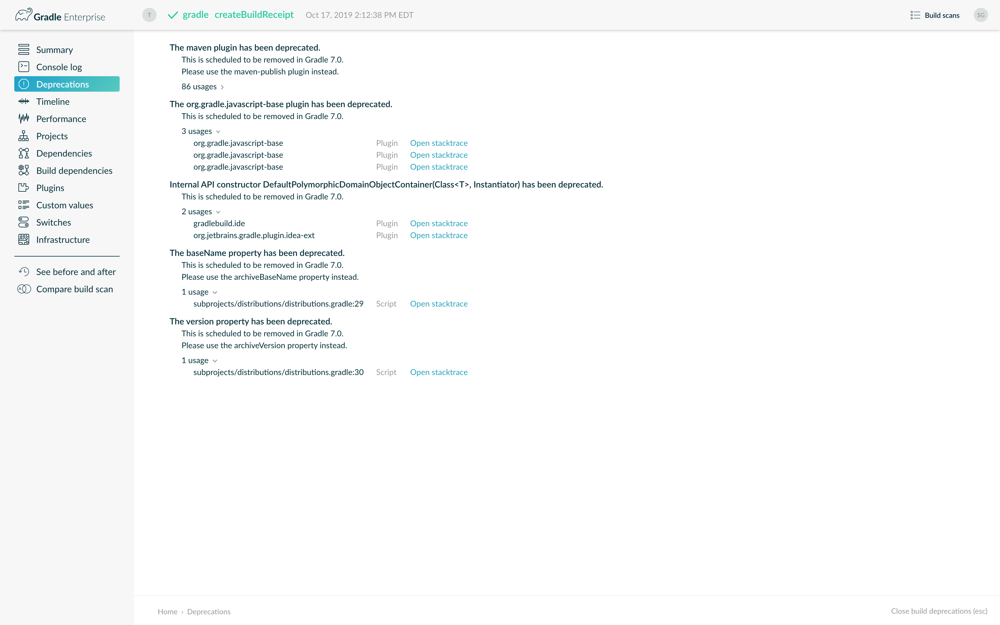

# 将您的构建从Gradle 5.x升级到6.0

内容

  * [从5.6及更早版本升级](#%E4%BB%8E5.6%E5%8F%8A%E6%9B%B4%E6%97%A9%E7%89%88%E6%9C%AC%E5%8D%87%E7%BA%A7)
  * [从5.5或更早版本升级](#%E4%BB%8E5.5%E6%88%96%E6%9B%B4%E6%97%A9%E7%89%88%E6%9C%AC%E5%8D%87%E7%BA%A7)
  * [从5.4或更早版本升级](#%E4%BB%8E5.4%E6%88%96%E6%9B%B4%E6%97%A9%E7%89%88%E6%9C%AC%E5%8D%87%E7%BA%A7)
  * [从5.3或更早版本升级](#%E4%BB%8E5.3%E6%88%96%E6%9B%B4%E6%97%A9%E7%89%88%E6%9C%AC%E5%8D%87%E7%BA%A7)
  * [从5.2或更早版本升级](#%E4%BB%8E5.2%E6%88%96%E6%9B%B4%E6%97%A9%E7%89%88%E6%9C%AC%E5%8D%87%E7%BA%A7)
  * [从5.1或更早版本升级](#%E4%BB%8E5.1%E6%88%96%E6%9B%B4%E6%97%A9%E7%89%88%E6%9C%AC%E5%8D%87%E7%BA%A7)
  * [从5.0或更早版本升级](#%E4%BB%8E5.0%E6%88%96%E6%9B%B4%E6%97%A9%E7%89%88%E6%9C%AC%E5%8D%87%E7%BA%A7)

本章提供了将Gradle 5.x构建迁移到Gradle 6.0所需的信息。要从Gradle
4.x迁移，请先完成从[4.x到5.0的指南](/md/将您的构建从Gradle 4.md#upgrading_version_4)。

我们建议所有用户执行以下步骤：

  1. 尝试运行`gradle help --scan`并查看生成的构建扫描的[弃用视图](https://gradle.com/enterprise/releases/2018.4/#identify-usages-of-deprecated-gradle-functionality)。

这样一来，您就可以看到适用于您的构建的所有弃用警告。

另外，您可能会`gradle help --warning-mode=all`在控制台中看到过时的信息，尽管它可能不会报告太多详细信息。

  2. 更新您的插件。

一些插件将随新版本的Gradle一起中断，例如，因为它们使用已被删除或更改的内部API。上一步将通过在插件确实尝试使用API​​弃用的部分时发出弃用警告来帮助您识别潜在的问题。

  3. 运行`gradle wrapper --gradle-version 6.7.1`以将项目更新为6.7.1。

  4. 尝试使用《[故障排除指南》](/md/对构建进行故障排除.md#troubleshooting)运行项目并调试所有错误。

## [从5.6及更早版本升级](#%E4%BB%8E5.6%E5%8F%8A%E6%9B%B4%E6%97%A9%E7%89%88%E6%9C%AC%E5%8D%87%E7%BA%A7)

### [弃用](#%E5%BC%83%E7%94%A8)

#### [不再应该使用`compile`和`runtime`配置声明依赖项](#%E4%B8%8D%E5%86%8D%E5%BA%94%E8%AF%A5%E4%BD%BF%E7%94%A8%60compile%60%E5%92%8C%60runtime%60%E9%85%8D%E7%BD%AE%E5%A3%B0%E6%98%8E%E4%BE%9D%E8%B5%96%E9%A1%B9)

从[Gradle 3.4](https://docs.gradle.org/3.4/release-notes.html#the-java-library-plugin)开始，不鼓励在Java生态系统插件中使用`compile`和`runtime`配置。

这些配置用于从`main`源集中编译和运行代码。其他源集创建类似的配置（例如`testCompile`和`testRuntime`用于`test`源集），也不应使用。的`implementation`，`api`，`compileOnly`和`runtimeOnly`配置应该用于依赖性和申报`compileClasspath`和`runtimeClasspath`配置，以解决依赖关系。请参阅[这些配置的关系](/md/Java库插件.md#sec:java_library_configurations_graph)。

#### [旧版发布系统已弃用，并替换为`*-publish`插件](#%E6%97%A7%E7%89%88%E5%8F%91%E5%B8%83%E7%B3%BB%E7%BB%9F%E5%B7%B2%E5%BC%83%E7%94%A8%EF%BC%8C%E5%B9%B6%E6%9B%BF%E6%8D%A2%E4%B8%BA%60*-publish%60%E6%8F%92%E4%BB%B6)

该`uploadArchives`任务和`maven`插件已被弃用。

用户应使用或插件迁移到Gradle的[发布系统](/md/将项目发布为模块.md)。自Gradle
4.8起，这些插件一直稳定。[`maven-publish`](/md/Maven发布插件.md) [`ivy-publish`](/md/Ivy发布插件.md)

发布系统也是确保[Gradle Module元数据](/md/了解Gradle模块元数据.md)发布的唯一方法。

#### [任务问题会发出弃用警告](#%E4%BB%BB%E5%8A%A1%E9%97%AE%E9%A2%98%E4%BC%9A%E5%8F%91%E5%87%BA%E5%BC%83%E7%94%A8%E8%AD%A6%E5%91%8A)

当Gradle检测到任务定义问题（例如错误定义的输入或输出）时，它将在控制台上显示以下消息：

    
    
    Deprecated Gradle features were used in this build, making it incompatible with Gradle 7.0.
    Use '--warning-mode all' to show the individual deprecation warnings.
    See https://docs.gradle.org/6.0/userguide/command_line_interface.html#sec:command_line_warnings

无论使用哪个命令行开关，都将在每个版本的[构建扫描中](https://scans.gradle.com/s/txrptciitl2ha/deprecations)显示不赞成使用警告。

当使用构建执行时`--warning-mode all`，将显示单个警告：

    
    
    > Task :myTask
    Property 'inputDirectory' is declared without normalization specified. Properties of cacheable work must declare their normalization via @PathSensitive, @Classpath or @CompileClasspath. Defaulting to PathSensitivity.ABSOLUTE. This behaviour has been deprecated and is scheduled to be removed in Gradle 7.0.
    Property 'outputFile' is not annotated with an input or output annotation. This behaviour has been deprecated and is scheduled to be removed in Gradle 7.0.

如果您拥有相关任务的代码，则可以[按照建议](/md/处理任务.md#sec:task_input_validation)进行修复。您还可以`--stacktrace`用来查看每个警告的源代码。

否则，您需要将问题报告给相关任务或插件的维护者。

#### [`IncrementalTaskInputs`不推荐使用用于增量任务的旧API，](#%60IncrementalTaskInputs%60%E4%B8%8D%E6%8E%A8%E8%8D%90%E4%BD%BF%E7%94%A8%E7%94%A8%E4%BA%8E%E5%A2%9E%E9%87%8F%E4%BB%BB%E5%8A%A1%E7%9A%84%E6%97%A7API%EF%BC%8C)

在Gradle
5.4中，我们引入了用于实现[增量任务](/md/开发自定义Gradle任务类型.md#incremental_tasks)的新API
：[InputChanges](https://docs.gradle.org/6.7.1/dsl/org.gradle.work.InputChanges.html)。基于的旧API`IncrementalTaskInputs`已被弃用。

#### [强制依赖](#%E5%BC%BA%E5%88%B6%E4%BE%9D%E8%B5%96)

不建议`force = true`在第一级依赖项上使用强制性依赖项版本。

强制同时具有语义和顺序问题，可以通过使用[严格的版本约束](/md/声明丰富版本.md#rich-
version-constraints)来避免。

#### [`StartParameter`不建议使用向上搜索相关的API](#%60StartParameter%60%E4%B8%8D%E5%BB%BA%E8%AE%AE%E4%BD%BF%E7%94%A8%E5%90%91%E4%B8%8A%E6%90%9C%E7%B4%A2%E7%9B%B8%E5%85%B3%E7%9A%84API)

在Gradle 5.0中，我们删除了`--no-search-upward`CLI参数。

`StartParameter`（如`isSearchUpwards()`）中的相关API现在已弃用。

#### [API`BuildListener.buildStarted`和`Gradle.buildStarted`已被弃用](#API%60BuildListener.buildStarted%60%E5%92%8C%60Gradle.buildStarted%60%E5%B7%B2%E8%A2%AB%E5%BC%83%E7%94%A8)

这些方法当前无法按预期方式工作，因为在构建开始之后将永远不会调用回调。

不推荐使用这些方法以避免混淆。

#### [不建议使用隐式重复策略`Copy`或存档任务](#%E4%B8%8D%E5%BB%BA%E8%AE%AE%E4%BD%BF%E7%94%A8%E9%9A%90%E5%BC%8F%E9%87%8D%E5%A4%8D%E7%AD%96%E7%95%A5%60Copy%60%E6%88%96%E5%AD%98%E6%A1%A3%E4%BB%BB%E5%8A%A1)

存档任务`Tar`，`Zip`默认情况下允许在创建的存档中存在同一路径的多个条目。这可能会导致[“严重无效的zip文件”，从而触发zip炸弹检测](https://github.com/gradle/gradle/issues/9990)。

为了防止这种情况的意外发生，创建存档时遇到重复项现在会产生不赞成使用的消息，并且将使从Gradle 7.0开始的构建失败。

`Copy`任务还可以愉快地将具有相同相对路径的多个源复制到目标目录。此行为也已被弃用。

如果要允许重复，则可以明确指定：

    
    
    task archive(type: Zip) {
        duplicatesStrategy = DuplicatesStrategy.INCLUDE // allow duplicates
        ...
    }

#### [在不使用设置文件的情况下执行Gradle已被弃用](#%E5%9C%A8%E4%B8%8D%E4%BD%BF%E7%94%A8%E8%AE%BE%E7%BD%AE%E6%96%87%E4%BB%B6%E7%9A%84%E6%83%85%E5%86%B5%E4%B8%8B%E6%89%A7%E8%A1%8CGradle%E5%B7%B2%E8%A2%AB%E5%BC%83%E7%94%A8)

Gradle构建由`settings.gradle[.kts]`当前或父目录中的文件定义。没有设置文件，Gradle构建是未定义的，并且将发出弃用警告。

在Gradle 7.0中，Gradle仅允许您使用未定义的构建调用`init`任务或诊断命令行标志，例如`--version`。

#### [不建议调用`Project.afterEvaluate`评估项目](#%E4%B8%8D%E5%BB%BA%E8%AE%AE%E8%B0%83%E7%94%A8%60Project.afterEvaluate%60%E8%AF%84%E4%BC%B0%E9%A1%B9%E7%9B%AE)

评估项目后，Gradle会忽略传递给它的所有配置`Project#afterEvaluate`并发出弃用警告。这种情况将成为Gradle 7.0中的错误。

#### [不推荐使用的插件](#%E4%B8%8D%E6%8E%A8%E8%8D%90%E4%BD%BF%E7%94%A8%E7%9A%84%E6%8F%92%E4%BB%B6)

以下捆绑插件从未发布过，它们将在Gradle的下一个主要版本中删除：

  * `org.gradle.coffeescript-base`

  * `org.gradle.envjs`

  * `org.gradle.javascript-base`

  * `org.gradle.jshint`

  * `org.gradle.rhino`

其中一些插件可能会在[插件门户](https://plugins.gradle.org/)上进行替换。

### [潜在的重大变化](#%E6%BD%9C%E5%9C%A8%E7%9A%84%E9%87%8D%E5%A4%A7%E5%8F%98%E5%8C%96)

#### [不再支持Android Gradle Plugin 3.3和更早版本](#%E4%B8%8D%E5%86%8D%E6%94%AF%E6%8C%81Android+Gradle+Plugin+3.3%E5%92%8C%E6%9B%B4%E6%97%A9%E7%89%88%E6%9C%AC)

Gradle 6.0支持Android Gradle插件版本3.4及更高版本。

#### [不再支持构建扫描插件2.x](#%E4%B8%8D%E5%86%8D%E6%94%AF%E6%8C%81%E6%9E%84%E5%BB%BA%E6%89%AB%E6%8F%8F%E6%8F%92%E4%BB%B62.x)

对于Gradle 6，必须使用Gradle
Enterprise插件替换对构建扫描插件的使用。这还需要更改插件的应用方式。请参阅[https://gradle.com/help/gradle-6-build-scan-plugin](https://gradle.com/help/gradle-6-build-scan-plugin)了解更多信息。

#### [更新捆绑的Gradle依赖项](#%E6%9B%B4%E6%96%B0%E6%8D%86%E7%BB%91%E7%9A%84Gradle%E4%BE%9D%E8%B5%96%E9%A1%B9)

  * Groovy已更新为[Groovy 2.5.8](http://groovy-lang.org/changelogs/changelog-2.5.8.html)。

  * Kotlin已更新至[Kotlin 1.3.50](https://blog.jetbrains.com/kotlin/2019/08/kotlin-1-3-50-released/)。

  * Ant已更新为[Ant 1.10.7](https://archive.apache.org/dist/ant/RELEASE-NOTES-1.10.7.html)。

#### [更新为默认集成版本](#%E6%9B%B4%E6%96%B0%E4%B8%BA%E9%BB%98%E8%AE%A4%E9%9B%86%E6%88%90%E7%89%88%E6%9C%AC)

  * Checkstyle已更新至[Checkstyle 8.24](https://checkstyle.org/releasenotes.html#Release_8.24)。

  * CodeNarc已更新为[CodeNarc 1.4](https://github.com/CodeNarc/CodeNarc/blob/master/CHANGELOG.md#version-14---may-2019)。

  * PMD已更新至[PMD 6.17.0](https://pmd.github.io/latest/pmd_release_notes.html#28-july-2019---6170)。

  * JaCoCo已更新至[0.8.5](http://www.jacoco.org/jacoco/trunk/doc/changes.html)。由[Evgeny Mandrikov](https://github.com/Godin)贡献

#### [复合构建中对构建和任务名称的更改](#%E5%A4%8D%E5%90%88%E6%9E%84%E5%BB%BA%E4%B8%AD%E5%AF%B9%E6%9E%84%E5%BB%BA%E5%92%8C%E4%BB%BB%E5%8A%A1%E5%90%8D%E7%A7%B0%E7%9A%84%E6%9B%B4%E6%94%B9)

以前，Gradle使用根项目的名称作为所包含构建的构建名称。现在，使用构建的根目录名称，并且如果不相同，则不考虑根项目名称。如果通过设置文件包含构建，则可以为构建指定其他名称。

    
    
    includeBuild("some-other-build") {
        name = "another-name"
    }

先前的行为是有问题的，因为它导致在构建期间的不同时间使用不同的名称。

#### [现在，将buildSrc保留为项目和子项目的内部版本名称](#%E7%8E%B0%E5%9C%A8%EF%BC%8C%E5%B0%86buildSrc%E4%BF%9D%E7%95%99%E4%B8%BA%E9%A1%B9%E7%9B%AE%E5%92%8C%E5%AD%90%E9%A1%B9%E7%9B%AE%E7%9A%84%E5%86%85%E9%83%A8%E7%89%88%E6%9C%AC%E5%90%8D%E7%A7%B0)

以前，Gradle并未阻止将名称“ buildSrc”用于多项目构建的子项目或包含的构建的名称。现在，这是不允许的。现在，将名称“
buildSrc”保留给构建额外构建逻辑的常规buildSrc项目。

buildSrc的典型用法不受此更改的影响。仅当您的设置文件指定`include("buildSrc")`或时，您才会受到影响`includeBuild("buildSrc")`。

#### [Scala Zinc编译器](#Scala+Zinc%E7%BC%96%E8%AF%91%E5%99%A8)

Zinc编译器已升级到版本1.3.0。Gradle不再支持为Scala 2.9构建。

Gradle支持的最小Zinc编译器为1.2.0，最大测试版本为1.3.0。

为了使选择Zinc编译器的版本更加容易，您现在可以配置一个`zincVersion`属性：

    
    
    scala {
        zincVersion = "1.2.1"
    }

请删除您添加到`zinc`配置中的所有显式依赖项，并改用此属性。如果您尝试使用`com.typesafe.zinc:zinc`依赖项，Gradle将切换到新的Zinc实现。

#### [对构建缓存的更改](#%E5%AF%B9%E6%9E%84%E5%BB%BA%E7%BC%93%E5%AD%98%E7%9A%84%E6%9B%B4%E6%94%B9)

#### [本地构建缓存始终是目录缓存](#%E6%9C%AC%E5%9C%B0%E6%9E%84%E5%BB%BA%E7%BC%93%E5%AD%98%E5%A7%8B%E7%BB%88%E6%98%AF%E7%9B%AE%E5%BD%95%E7%BC%93%E5%AD%98)

过去，可以将任何构建高速缓存实现用作`local`高速缓存。由于本地缓存必须始终为，因此不再允许这样做`DirectoryBuildCache`。

`BuildCacheConfiguration.local(Class)`使用除`DirectoryBuildCache`type作为类型以外的任何内容进行调用都会使构建失败。使用`DirectoryBuildCache`类型调用这些方法将产生弃用警告。

使用`getLocal()`和`local(Action)`代替。

#### [无法打包或解包缓存的结果现在将使构建失败](#%E6%97%A0%E6%B3%95%E6%89%93%E5%8C%85%E6%88%96%E8%A7%A3%E5%8C%85%E7%BC%93%E5%AD%98%E7%9A%84%E7%BB%93%E6%9E%9C%E7%8E%B0%E5%9C%A8%E5%B0%86%E4%BD%BF%E6%9E%84%E5%BB%BA%E5%A4%B1%E8%B4%A5)

过去，当Gradle在打包缓存任务的结果时遇到问题时，Gradle会忽略该问题并继续运行构建。

当遇到损坏的缓存工件时，Gradle会删除已解包的所有内容，然后重新执行任务以确保构建有成功的机会。

尽管此行为旨在使构建成功，但会产生隐藏问题的不利影响，并导致缓存性能下降。

在Gradle 6.0中，打包和解包错误都会导致构建失败，因此这些问题将更容易得到解决。

#### [buildSrc项目自动使用构建缓存配置](#buildSrc%E9%A1%B9%E7%9B%AE%E8%87%AA%E5%8A%A8%E4%BD%BF%E7%94%A8%E6%9E%84%E5%BB%BA%E7%BC%93%E5%AD%98%E9%85%8D%E7%BD%AE)

以前，为了将构建缓存用于buildSrc构建，您需要在buildSrc构建中复制构建缓存配置。现在，它会自动使用顶级设置脚本定义的构建缓存配置。

#### [依赖管理的变化](#%E4%BE%9D%E8%B5%96%E7%AE%A1%E7%90%86%E7%9A%84%E5%8F%98%E5%8C%96)

#### [Gradle模块元数据总是发布](#Gradle%E6%A8%A1%E5%9D%97%E5%85%83%E6%95%B0%E6%8D%AE%E6%80%BB%E6%98%AF%E5%8F%91%E5%B8%83)

在Gradle5.3正式出台，[Gradle模块元数据](https://blog.gradle.org/gradle-
metadata-1.0)的建立是为了解决许多有多年困扰依赖管理，特别是问题，但不完全是在Java生态系统。

在Gradle 6.0中，默认情况下启用了Gradle模块元数据。

这意味着，如果要使用Gradle发布库并使用[maven-publish](/md/Maven发布插件.md)或[ivy-publish](/md/Ivy发布插件.md)插件，则
**除** 传统元数据 **外，还将** 始终发布Gradle Module元数据文件。

传统的元数据文件将包含一个标记，以便Gradle知道还有其他元数据要使用。

#### [Gradle模块元数据具有更严格的验证](#Gradle%E6%A8%A1%E5%9D%97%E5%85%83%E6%95%B0%E6%8D%AE%E5%85%B7%E6%9C%89%E6%9B%B4%E4%B8%A5%E6%A0%BC%E7%9A%84%E9%AA%8C%E8%AF%81)

发布Gradle模块元数据时，将验证以下规则：

  * 变体名称必须唯一，

  * 每个变体必须至少具有[一个属性](/md/了解变体选择.md)，

  * 两个变体不能具有[完全相同的属性和功能](/md/使用变体属性.md)，

  * 如果存在依赖性，则所有变体中的至少一个必须携带[版本信息](/md/声明丰富版本.md)。

这些也记录在[规范](https://github.com/gradle/gradle/blob/master/subprojects/docs/src/docs/design/gradle-
module-metadata-latest-specification.md)中。

#### [默认情况下，不再向Maven或Ivy存储库查询没有元数据的工件](#%E9%BB%98%E8%AE%A4%E6%83%85%E5%86%B5%E4%B8%8B%EF%BC%8C%E4%B8%8D%E5%86%8D%E5%90%91Maven%E6%88%96Ivy%E5%AD%98%E5%82%A8%E5%BA%93%E6%9F%A5%E8%AF%A2%E6%B2%A1%E6%9C%89%E5%85%83%E6%95%B0%E6%8D%AE%E7%9A%84%E5%B7%A5%E4%BB%B6)

如果Gradle无法在本节中定义的存储库中找到模块的元数据文件（`.pom`或`ivy.xml`）`repositories {
}`，则现在假定该模块在该存储库中不存在。

对于动态版本，`maven-metadata.xml`需要在Maven存储库中提供对应模块的。

以前，Gradle还将寻找默认的工件（`.jar`）。当使用多个存储库减慢构建速度时，此行为通常会导致大量不必要的请求。

您可以通过添加`artifact()`
[元数据源](/md/声明存储库.md#sec:supported_metadata_sources)来选择选定存储库的旧行为。

#### [更改pom`packaging`属性不再更改工件扩展](#%E6%9B%B4%E6%94%B9pom%60packaging%60%E5%B1%9E%E6%80%A7%E4%B8%8D%E5%86%8D%E6%9B%B4%E6%94%B9%E5%B7%A5%E4%BB%B6%E6%89%A9%E5%B1%95)

以前，如果pom包装不是 _jar_ ， _ejb_ ， _bundle_ 或 _maven-plugin_
，则在发布过程中会更改发布到Maven存储库的主要工件的扩展名，以匹配pom包装。

此行为导致损坏的Gradle模块元数据，并且由于处理不同的包装类型而难以理解。

创建工件时，构建作者可以更改工件名称，以获得与以前相同的结果-
例如，通过`jar.archiveExtension.set(pomPackaging)`显式设置。

#### [`ivy.xml`Java库的出版物包含更多信息](#%60ivy.xml%60Java%E5%BA%93%E7%9A%84%E5%87%BA%E7%89%88%E7%89%A9%E5%8C%85%E5%90%AB%E6%9B%B4%E5%A4%9A%E4%BF%A1%E6%81%AF)

已进行了许多修复，以`ivy.xml`在`ivy-publish`插件中生成更正确的元数据。

结果，`ivy.xml`文件的内部结构发生了变化。`runtime`现在，该配置包含更多信息，这些信息与Java库的 _runtimeElements_
变体相对应。该`default`配置应产生与以前相同的结果。

通常，建议用户从迁移`ivy.xml`到新的Gradle模块元数据格式。

#### [插件和构建脚本的更改](#%E6%8F%92%E4%BB%B6%E5%92%8C%E6%9E%84%E5%BB%BA%E8%84%9A%E6%9C%AC%E7%9A%84%E6%9B%B4%E6%94%B9)

#### [`buildSrc`设置脚本不再可见来自的类](#%60buildSrc%60%E8%AE%BE%E7%BD%AE%E8%84%9A%E6%9C%AC%E4%B8%8D%E5%86%8D%E5%8F%AF%E8%A7%81%E6%9D%A5%E8%87%AA%E7%9A%84%E7%B1%BB)

以前，buildSrc项目是在应用项目的设置脚本之前构建的，并且其类在脚本中可见。现在，在设置脚本及其类对它不可见之后，将构建buildSrc。buildSrc类对于项目构建脚本和脚本插件仍然可见。

可以通过[声明外部依赖项](/md/构建脚本基础.md#sec:build_script_external_dependencies)从设置脚本中使用自定义逻辑。

#### [`pluginManagement`现在隔离了设置脚本中的块](#%60pluginManagement%60%E7%8E%B0%E5%9C%A8%E9%9A%94%E7%A6%BB%E4%BA%86%E8%AE%BE%E7%BD%AE%E8%84%9A%E6%9C%AC%E4%B8%AD%E7%9A%84%E5%9D%97)

以前，`pluginManagement {}`设置脚本中的所有块都是在脚本的正常执行期间执行的。

现在，它们以与`buildscript {}`或类似的方式更早地执行`plugins {}`。这意味着该块中的代码无法引用脚本中其他地方声明的任何内容。

进行了此更改，以便`pluginManagement`在解析设置脚本本身的插件时也可以应用配置。

#### [设置脚本中加载的插件和类对项目脚本可见，并且`buildSrc`](#%E8%AE%BE%E7%BD%AE%E8%84%9A%E6%9C%AC%E4%B8%AD%E5%8A%A0%E8%BD%BD%E7%9A%84%E6%8F%92%E4%BB%B6%E5%92%8C%E7%B1%BB%E5%AF%B9%E9%A1%B9%E7%9B%AE%E8%84%9A%E6%9C%AC%E5%8F%AF%E8%A7%81%EF%BC%8C%E5%B9%B6%E4%B8%94%60buildSrc%60)

以前，通过使用脚本添加到a设置脚本中的任何类`buildscript {}`在脚本外部都不可见。现在，它们对于所有项目构建脚本都是可见的。

它们对于`buildSrc`构建脚本及其设置脚本也是可见的。

进行了此更改，以便应用于设置脚本的插件可以为整个构建贡献逻辑。

#### [插件验证更改](#%E6%8F%92%E4%BB%B6%E9%AA%8C%E8%AF%81%E6%9B%B4%E6%94%B9)

  * `validateTaskProperties`现在不推荐使用该任务，请`validatePlugins`改用。新名称更好地反映了以下事实：它还可以验证工件转换参数和其他非属性定义。

  * 该`ValidateTaskProperties`类型被替换`ValidatePlugins`。

  * 该`setClasses()`方法现已删除。使用`getClasses().setFrom()`代替。

  * 该`setClasspath()`方法也被删除。使用`getClasspath().setFrom()`代替。

  * 该[failOnWarning](https://docs.gradle.org/6.7.1/javadoc/org/gradle/plugin/devel/tasks/ValidatePlugins.html#getFailOnWarning--)选项现在是默认启用的。

  * 现在，以下任务验证错误将在运行时使构建失败，并被提升为[ValidatePlugins的](https://docs.gradle.org/6.7.1/javadoc/org/gradle/plugin/devel/tasks/ValidatePlugins.html)错误：

    * 任务属性带有不允许用于任务的属性注释，例如`@InputArtifact`。

#### [对Kotlin DSL的更改](#%E5%AF%B9Kotlin+DSL%E7%9A%84%E6%9B%B4%E6%94%B9)

#### [`embedded-kotlin`现在使用插件需要一个存储库](#%60embedded-kotlin%60%E7%8E%B0%E5%9C%A8%E4%BD%BF%E7%94%A8%E6%8F%92%E4%BB%B6%E9%9C%80%E8%A6%81%E4%B8%80%E4%B8%AA%E5%AD%98%E5%82%A8%E5%BA%93)

就像使用`kotlin-dsl`插件时一样，现在需要声明一个存储库，如果您应用该`embedded-kotlin`插件，则可以在其中找到Kotlin依赖项。

    
    
    plugins {
        `embedded-kotlin`
    }
    
    repositories {
        jcenter()
    }

#### [Kotlin DSL IDE支持现在需要> = 1.3.50的Kotlin IntelliJ插件](#Kotlin+DSL+IDE%E6%94%AF%E6%8C%81%E7%8E%B0%E5%9C%A8%E9%9C%80%E8%A6%81%3E+%3D+1.3.50%E7%9A%84Kotlin+IntelliJ%E6%8F%92%E4%BB%B6)

对于1.3.50之前的Kotlin IntelliJ插件版本，当 _Gradle JVM_ 设置为不同于 _Project SDK中_
的版本时，将错误地突出显示Kotlin DSL脚本。只需将您的IDE插件升级到> = 1.3.50，即可恢复正确的Kotlin DSL脚本突出显示行为。

#### [Kotlin DSL脚本基本类型不再扩展`Project`，`Settings`或者`Gradle`](#Kotlin+DSL%E8%84%9A%E6%9C%AC%E5%9F%BA%E6%9C%AC%E7%B1%BB%E5%9E%8B%E4%B8%8D%E5%86%8D%E6%89%A9%E5%B1%95%60Project%60%EF%BC%8C%60Settings%60%E6%88%96%E8%80%85%60Gradle%60)

在以前的版本中，Kotlin
DSL脚本被编译为实现三个Gradle核心配置接口之一的类，以便向脚本隐式公开其API。`org.gradle.api.Project`用于项目脚本，`org.gradle.api.initialization.Settings`设置脚本和`org.gradle.api.invocation.Gradle`初始化脚本。

让脚本实例实现应该配置的模型对象的核心Gradle接口非常方便，因为它使模型对象API立即可用于脚本主体，但是这也是一个谎言，每当脚本实例执行时，它都会引起各种麻烦。脚本本身是用来代替模型对象的，项目脚本
**不是** 适当的`Project`实例，仅因为它实现了核心`Project`接口，设置和初始化脚本也是如此。

在6.0中，所有Kotlin
DSL脚本都被编译为实现新引入的`org.gradle.kotlin.dsl.KotlinScript`接口的类，并且相应的模型对象现在可以作为脚本主体中的
_隐式接收器_ 使用。换句话说，项目脚本的行为就像脚本的主体被封闭在一个`with(project) { …​
}`块中，设置脚本的行为就像脚本的主体被封闭在一个`with(settings) { …​
}`块中，而初始化脚本的行为就像脚本的主体被封闭在其中一样。一个`with(gradle) { …​
}`街区。这意味着相应的模型对象也可以用作脚本主体中的`project`属性，项目脚本的`settings`属性，设置脚本的`gradle`属性和初始化脚本的属性。

作为更改的一部分，该`SettingsScriptApi`接口不再由设置脚本实现，并且该`InitScriptApi`接口不再由初始化脚本实现。应将它们替换为相应的模型对象接口`Settings`和`Gradle`。

#### [miscellaneous](#miscellaneous)

#### [Javadoc和Groovydoc默认不包含时间戳](#Javadoc%E5%92%8CGroovydoc%E9%BB%98%E8%AE%A4%E4%B8%8D%E5%8C%85%E5%90%AB%E6%97%B6%E9%97%B4%E6%88%B3)

生成的文档中的时间戳实际用途非常有限，但是它们使得无法构建可重复的文档。因此，`Javadoc`和`Groovydoc`任务现在已配置为默认情况下不再包括时间戳。

#### [用户提供的'config_loc'属性被Checkstyle忽略](#%E7%94%A8%E6%88%B7%E6%8F%90%E4%BE%9B%E7%9A%84%27config_loc%27%E5%B1%9E%E6%80%A7%E8%A2%ABCheckstyle%E5%BF%BD%E7%95%A5)

`configDirectory`运行Checkstyle时，Gradle始终将其用作“ config_loc”的值。

#### [新的Tooling API进度事件](#%E6%96%B0%E7%9A%84Tooling+API%E8%BF%9B%E5%BA%A6%E4%BA%8B%E4%BB%B6)

在Gradle
6.0中，我们引入了一个新的进度事件（[org.gradle.tooling.events.test.TestOutputEvent](https://docs.gradle.org/6.7.1/javadoc/org/gradle/tooling/events/test/TestOutputEvent.html)）以公开测试执行的输出。这个新事件打破了用`StartEvent`-`FinisEvent`对表示进度的惯例。`TaskOutputEvent`很简单`ProgressEvent`。

#### [任务容器行为的更改](#%E4%BB%BB%E5%8A%A1%E5%AE%B9%E5%99%A8%E8%A1%8C%E4%B8%BA%E7%9A%84%E6%9B%B4%E6%94%B9)

现在，任务容器上的以下不推荐使用的方法会导致错误：

  * `TaskContainer.add()`

  * `TaskContainer.addAll()`

  * `TaskContainer.remove()`

  * `TaskContainer.removeAll()`

  * `TaskContainer.retainAll()`

  * `TaskContainer.clear()`

  * `TaskContainer.iterator().remove()`

此外，以下不推荐使用的功能现在会导致错误：

  * 替换已经实现的任务。

  * 用不兼容的类型替换已注册（未实现）的任务。兼容类型是注册类型的相同类型或子类型。

  * 替换从未注册的任务。

#### [替换和删除的API](#%E6%9B%BF%E6%8D%A2%E5%92%8C%E5%88%A0%E9%99%A4%E7%9A%84API)

#### [方法打开`DefaultTask`并`ProjectLayout`替换为`ObjectFactory`](#%E6%96%B9%E6%B3%95%E6%89%93%E5%BC%80%60DefaultTask%60%E5%B9%B6%60ProjectLayout%60%E6%9B%BF%E6%8D%A2%E4%B8%BA%60ObjectFactory%60)

使用`ObjectFactory.fileProperty()`代替现在已删除的以下方法：

  * `DefaultTask.newInputFile()`

  * `DefaultTask.newOutputFile()`

  * `ProjectLayout.fileProperty()`

使用`ObjectFactory.directoryProperty()`代替现在已删除的以下方法：

  * `DefaultTask.newInputDirectory()`

  * `DefaultTask.newOutputDirectory()`

  * `ProjectLayout.directoryProperty()`

#### [注释`@Nullable`已删除](#%E6%B3%A8%E9%87%8A%60%40Nullable%60%E5%B7%B2%E5%88%A0%E9%99%A4)

该`org.gradle.api.Nullable`注释类型已被删除。请改用`javax.annotation.Nullable`JSR-305。

#### [FindBugs插件已被删除](#FindBugs%E6%8F%92%E4%BB%B6%E5%B7%B2%E8%A2%AB%E5%88%A0%E9%99%A4)

不推荐使用的FindBugs插件已被删除。作为替代方案，可以使用[SpotBugs插件](https://plugins.gradle.org/plugin/com.github.spotbugs)从[Gradle插件门户](https://plugins.gradle.org/search?term=spotbugs)。

#### [JDepend插件已被删除](#JDepend%E6%8F%92%E4%BB%B6%E5%B7%B2%E8%A2%AB%E5%88%A0%E9%99%A4)

不推荐使用的JDepend插件已被删除。[Gradle插件门户](https://plugins.gradle.org/)上有许多社区提供的用于代码和体系结构分析的[插件](https://plugins.gradle.org/)。

#### [OSGI插件已被删除](#OSGI%E6%8F%92%E4%BB%B6%E5%B7%B2%E8%A2%AB%E5%88%A0%E9%99%A4)

不推荐使用的OSGI插件已被删除。[Gradle插件门户](https://plugins.gradle.org/search?term=osgi)上有许多社区提供的OSGI插件。

#### [公告和构建公告插件已被删除](#%E5%85%AC%E5%91%8A%E5%92%8C%E6%9E%84%E5%BB%BA%E5%85%AC%E5%91%8A%E6%8F%92%E4%BB%B6%E5%B7%B2%E8%A2%AB%E5%88%A0%E9%99%A4)

不推荐使用的announce和build-
announcements插件已被删除。[Gradle插件门户](https://plugins.gradle.org/)上有许多社区提供的用于发送通知的[插件](https://plugins.gradle.org/)。

#### [比较Gradle构建插件已被删除](#%E6%AF%94%E8%BE%83Gradle%E6%9E%84%E5%BB%BA%E6%8F%92%E4%BB%B6%E5%B7%B2%E8%A2%AB%E5%88%A0%E9%99%A4)

不推荐使用的Compare Gradle
Builds插件已被删除。请使用[构建扫描](https://scans.gradle.com/)进行构建分析和比较。

#### [Play插件已被删除](#Play%E6%8F%92%E4%BB%B6%E5%B7%B2%E8%A2%AB%E5%88%A0%E9%99%A4)

不推荐使用的Play插件已被删除。可从插件门户网站获得外部替代品[Play
Framework插件](https://gradle.github.io/playframework)。

#### [方法`AbstractCompile.compile()`method已删除](#%E6%96%B9%E6%B3%95%60AbstractCompile.compile%28%29%60method%E5%B7%B2%E5%88%A0%E9%99%A4)

`compile()`不再声明abstract方法`AbstractCompile`。

任务扩展`AbstractCompile`可以`@TaskAction`使用自己选择的名称实现自己的方法。

他们还可以自由添加一种`@TaskAction`使用`InputChanges`参数进行注释的方法，而不必也实现无参数方法。

#### [其他不建议使用的行为和API](#%E5%85%B6%E4%BB%96%E4%B8%8D%E5%BB%BA%E8%AE%AE%E4%BD%BF%E7%94%A8%E7%9A%84%E8%A1%8C%E4%B8%BA%E5%92%8CAPI)

  * 在`org.gradle.util.GUtil.savePropertiesNoDateComment`已被删除。此内部方法没有公共替代方法。

  * 不推荐使用的类`org.gradle.api.tasks.compile.CompilerArgumentProvider`已被删除。请改用[org.gradle.process.CommandLineArgumentProvider](https://docs.gradle.org/6.7.1/javadoc/org/gradle/process/CommandLineArgumentProvider.html)。

  * 不推荐使用的类`org.gradle.api.ConventionProperty`已被删除。使用[提供程序](https://docs.gradle.org/6.7.1/javadoc/org/gradle/api/provider/Provider.html)而不是约定属性。

  * 不推荐使用的类`org.gradle.reporting.DurationFormatter`已被删除。

  * `org.gradle.api.tasks.TaskInputs.property(String name, @Nullable Object value)`返回的桥接方法`TaskInputs`已删除。必须使用Gradle 4.3编译使用该方法的插件才能在Gradle 6.0上运行。

  * 以下设置手已从中删除`JacocoReportBase`：

    * [executionData-](https://docs.gradle.org/6.7.1/dsl/org.gradle.testing.jacoco.tasks.JacocoReport.html#org.gradle.testing.jacoco.tasks.JacocoReport:executionData)`getExecutionData().setFrom()`改为使用。

    * [sourceDirectories](https://docs.gradle.org/6.7.1/dsl/org.gradle.testing.jacoco.tasks.JacocoReport.html#org.gradle.testing.jacoco.tasks.JacocoReport:sourceDirectories) -使用`getSourceDirectories().setFrom()`来代替。

    * [classDirectories-](https://docs.gradle.org/6.7.1/dsl/org.gradle.testing.jacoco.tasks.JacocoReport.html#org.gradle.testing.jacoco.tasks.JacocoReport:classDirectories)使用`getClassDirectories().setFrom()`代替。

    * [AdditionalClassDirs-](https://docs.gradle.org/6.7.1/dsl/org.gradle.testing.jacoco.tasks.JacocoReport.html#org.gradle.testing.jacoco.tasks.JacocoReport:additionalClassDirs)使用`getAdditionalClassDirs().setFrom()`代替。

    * [AdditionalSourceDirs-](https://docs.gradle.org/6.7.1/dsl/org.gradle.testing.jacoco.tasks.JacocoReport.html#org.gradle.testing.jacoco.tasks.JacocoReport:additionalSourceDirs)使用`getAdditionalSourceDirs().setFrom()`代替。

  * 上的`append`属性`JacocoTaskExtension`已被删除。 `append`现在对于Jacoco代理始终配置为true。

  * 上的`configureDefaultOutputPathForJacocoMerge`方法`JacocoPlugin`已被删除。该方法从未打算公开。

  * Ear插件的[部署描述符文件名](https://docs.gradle.org/6.7.1/javadoc/org/gradle/plugins/ear/descriptor/DeploymentDescriptor.html#getFileName--)中的文件路径不再被允许。请使用简单的名称，例如`application.xml`。

  * 该`org.gradle.testfixtures.ProjectBuilder`构造已被删除。请`ProjectBuilder.builder()`改用。

  * 当[增量Groovy的编译](/md/Groovy插件.md#sec:incremental_groovy_compilation)启用后，源根的错误配置或启用Java注释对Groovy现在失败的构建。在这些情况下要进行编译时，请禁用增量Groovy编译。

  * `ComponentSelectionRule`不再可以注入元数据或Ivy描述符。请改用[`ComponentSelection`参数](/md/处理随时间变化的版本.md#sec:component_selection_rules)上的方法。

  * 声明的[增量任务](/md/开发自定义Gradle任务类型.md#incremental_tasks)不宣而输出现在是一个错误。声明文件输出或改用[TaskOutputs.upToDateWhen（）](https://docs.gradle.org/6.7.1/javadoc/org/gradle/api/tasks/TaskOutputs.html#upToDateWhen-groovy.lang.Closure-)。

  * 该`getEffectiveAnnotationProcessorPath()`方法已从`JavaCompile`和`ScalaCompile`任务中删除。

  * `Property<T>`现在，在任务开始执行后，使用type更改任务属性的值会导致错误。

  * 该`isLegacyLayout()`方法已从中删除`SourceSetOutput`。

  * `TaskInputs.getProperties()`现在返回的地图不可修改。尝试修改它会导致`UnsupportedOperationException`被抛出。

  * 5.6中引入的孵化[功能解析](/md/处理互斥依赖性.md#sub:selecting-between-candidates)API进行了细微更改，以允许根据变体名称选择变体

## [从5.5或更早版本升级](#%E4%BB%8E5.5%E6%88%96%E6%9B%B4%E6%97%A9%E7%89%88%E6%9C%AC%E5%8D%87%E7%BA%A7)

### [弃用](#%E5%BC%83%E7%94%A8)

#### [`ConfigurableFileCollection`任务开始执行后更改任务属性的内容](#%60ConfigurableFileCollection%60%E4%BB%BB%E5%8A%A1%E5%BC%80%E5%A7%8B%E6%89%A7%E8%A1%8C%E5%90%8E%E6%9B%B4%E6%94%B9%E4%BB%BB%E5%8A%A1%E5%B1%9E%E6%80%A7%E7%9A%84%E5%86%85%E5%AE%B9)

当task属性具有type时`ConfigurableFileCollection`，一旦任务开始执行，该属性引用的文件集合将忽略对该集合内容所做的更改。这有两个好处。首先，这可以防止在任务执行期间意外更改属性值，这可能导致Gradle进行最新检查并使用与任务操作使用的值不同的值来构建缓存查找。其次，这提高了性能，因为Gradle可以一次计算值并缓存结果。

这将成为Gradle 6.0中的错误。

#### [创建`SignOperation`实例](#%E5%88%9B%E5%BB%BA%60SignOperation%60%E5%AE%9E%E4%BE%8B)

`SignOperation`现在不建议直接创建实例。而是`SigningExtension`应使用方法来创建这些实例。

这将成为Gradle 6.0中的错误。

#### [声明没有输出的增量任务](#%E5%A3%B0%E6%98%8E%E6%B2%A1%E6%9C%89%E8%BE%93%E5%87%BA%E7%9A%84%E5%A2%9E%E9%87%8F%E4%BB%BB%E5%8A%A1)

现在不建议声明[增量任务](/md/开发自定义Gradle任务类型.md#incremental_tasks)而不声明输出。声明文件输出或改用[TaskOutputs.upToDateWhen（）](https://docs.gradle.org/6.7.1/javadoc/org/gradle/api/tasks/TaskOutputs.html#upToDateWhen-
groovy.lang.Closure-)。

这将成为Gradle 6.0中的错误。

#### [方法`WorkerExecutor.submit()`已弃用](#%E6%96%B9%E6%B3%95%60WorkerExecutor.submit%28%29%60%E5%B7%B2%E5%BC%83%E7%94%A8)

`WorkerExecutor.submit()`现在不建议使用该方法。新的`noIsolation()`，`classLoaderIsolation()`和`processIsolation()`方法现在应该用于提交工作。见[的userguide](/md/开发自定义Gradle任务类型.md#using-
the-worker-api)上使用这些方法的详细信息。

`WorkerExecutor.submit()` 将在Gradle 7.0中删除。

### [潜在的重大变化](#%E6%BD%9C%E5%9C%A8%E7%9A%84%E9%87%8D%E5%A4%A7%E5%8F%98%E5%8C%96)

#### [任务依赖关系受其`@Input`值为a的任务属性的尊重`Property`](#%E4%BB%BB%E5%8A%A1%E4%BE%9D%E8%B5%96%E5%85%B3%E7%B3%BB%E5%8F%97%E5%85%B6%60%40Input%60%E5%80%BC%E4%B8%BAa%E7%9A%84%E4%BB%BB%E5%8A%A1%E5%B1%9E%E6%80%A7%E7%9A%84%E5%B0%8A%E9%87%8D%60Property%60)

以前，任务相关`@Input`性对于type的任务属性将被忽略`Property<T>`。现在，这些已被接受，因此可以将任务输出属性附加到任务`@Input`属性。

这可能会在任务依赖关系图中引入意外的周期，在该图中，输出属性的值将被映射以产生输入属性的值。

#### [使用`Provider`不代表任务输出的文件声明任务依赖关系](#%E4%BD%BF%E7%94%A8%60Provider%60%E4%B8%8D%E4%BB%A3%E8%A1%A8%E4%BB%BB%E5%8A%A1%E8%BE%93%E5%87%BA%E7%9A%84%E6%96%87%E4%BB%B6%E5%A3%B0%E6%98%8E%E4%BB%BB%E5%8A%A1%E4%BE%9D%E8%B5%96%E5%85%B3%E7%B3%BB)

此前，有可能通过`Task.dependsOn()`一个`Provider<File>`，`Provider<RegularFile>`或`Provider<Directory>`实例并不代表任务输出。这些提供程序将被默默忽略。

现在这是一个错误，因为Gradle不知道如何生成不是任务输出的文件。

**请注意**
，它仍然有可能通过`Task.dependsOn()`一个`Provider`返回一个文件，并表示任务的输出，例如`myTask.dependsOn(jar.archiveFile)`或`myTask.dependsOn(taskProvider.flatMap
{ it.outputDirectory
})`，当`Provider`是一个注释`@OutputFile`或`@OutputDirectory`任务的性质。

#### [设置`Property`值以`null`使用属性约定](#%E8%AE%BE%E7%BD%AE%60Property%60%E5%80%BC%E4%BB%A5%60null%60%E4%BD%BF%E7%94%A8%E5%B1%9E%E6%80%A7%E7%BA%A6%E5%AE%9A)

以前，调用`Property.set(null)`总是将属性的值重置为“未定义”。现在，将使用该`convention()`方法与属性相关联的约定来确定属性的值。

#### [`publishing.publications`和的名称验证得到增强`publishing.repositories`](#%60publishing.publications%60%E5%92%8C%E7%9A%84%E5%90%8D%E7%A7%B0%E9%AA%8C%E8%AF%81%E5%BE%97%E5%88%B0%E5%A2%9E%E5%BC%BA%60publishing.repositories%60)

存储库名称和发布名称用于构造要发布的任务名称。可以提供一个导致无效任务名称的名称。出版物和存储库的名称现在限制为`[A-Za-z0-9_\\-.]+`。

#### [受限制的Worker API类加载器和进程类路径](#%E5%8F%97%E9%99%90%E5%88%B6%E7%9A%84Worker+API%E7%B1%BB%E5%8A%A0%E8%BD%BD%E5%99%A8%E5%92%8C%E8%BF%9B%E7%A8%8B%E7%B1%BB%E8%B7%AF%E5%BE%84)

Gradle现在可以防止内部依赖项（例如Guava）泄漏到Worker
API操作使用的类路径中。这解决了工作者需要使用Gradle内部也使用的依赖项[的问题](https://github.com/gradle/gradle/issues/3698)。

在以前的版本中，可能依赖于这些泄漏的类。现在，依赖此行为的插件将失败。要修复插件，工作程序应在其类路径中明确包含所有必需的依赖项。

#### [默认PMD版本已升级到6.15.0](#%E9%BB%98%E8%AE%A4PMD%E7%89%88%E6%9C%AC%E5%B7%B2%E5%8D%87%E7%BA%A7%E5%88%B06.15.0)

默认情况下[，PMD插件](https://docs.gradle.org/6.7.1/userguide/pmd_plugin.html#pmd_plugin)已升级为使用[PMD版本6.15.0](https://pmd.github.io/pmd-6.15.0/pmd_release_notes.html)而不是6.8.0。

由[wreulicke](https://github.com/wreulicke)贡献

#### [配置副本具有唯一的名称](#%E9%85%8D%E7%BD%AE%E5%89%AF%E6%9C%AC%E5%85%B7%E6%9C%89%E5%94%AF%E4%B8%80%E7%9A%84%E5%90%8D%E7%A7%B0)

以前，配置的所有副本始终使用名称`<OriginConfigurationName>Copy`。现在，当创建多个副本时，通过从第二个副本开始添加索引，每个副本将具有唯一的名称。（例如`CompileOnlyCopy2`）

#### [更改了Eclipse的类路径过滤](#%E6%9B%B4%E6%94%B9%E4%BA%86Eclipse%E7%9A%84%E7%B1%BB%E8%B7%AF%E5%BE%84%E8%BF%87%E6%BB%A4)

Gradle
5.6不再在Eclipse模型中提供自定义类路径属性。相反，它提供了[Eclipse测试源](https://www.eclipse.org/eclipse/news/4.8/jdt.php#jdt-
test-sources)的属性。此更改需要Buildship 3.1.1或更高版本。

#### [嵌入式Kotlin升级到1.3.41](#%E5%B5%8C%E5%85%A5%E5%BC%8FKotlin%E5%8D%87%E7%BA%A7%E5%88%B01.3.41)

`kotlin-dsl`现在使用Kotlin 1.3.41编译使用该插件编写的Gradle Kotlin DSL脚本和Gradle插件。

请参阅Kotlin[博客文章](https://blog.jetbrains.com/kotlin/2019/06/kotlin-1-3-40-released/)和[changelog](https://github.com/JetBrains/kotlin/blob/1.3.40/ChangeLog.md)以获取有关所包含更改的更多信息。

现在支持的最低Kotlin Gradle插件版本为1.2.31。以前是1.2.21。

#### [自动能力冲突解决](#%E8%87%AA%E5%8A%A8%E8%83%BD%E5%8A%9B%E5%86%B2%E7%AA%81%E8%A7%A3%E5%86%B3)

如果发生功能冲突，Gradle的早期版本将自动选择具有最高功能版本的模块。从5.6开始，这是一种可以选择使用以下行为激活的行为：

    
    
    configurations.all {
       resolutionStrategy.capabilitiesResolution.all { selectHighestVersion() }
    }

有关更多选项，请参见[文档的功能部分](/md/处理互斥依赖性.md#sub:capabilities)。

#### [文件删除操作不遵循符号链接目录](#%E6%96%87%E4%BB%B6%E5%88%A0%E9%99%A4%E6%93%8D%E4%BD%9C%E4%B8%8D%E9%81%B5%E5%BE%AA%E7%AC%A6%E5%8F%B7%E9%93%BE%E6%8E%A5%E7%9B%AE%E5%BD%95)

当Gradle由于各种原因不得不删除任务的输出文件时，它将不会遵循符号链接目录。符号链接本身将被删除，但链接目录的内容将保持不变。

### [禁用JavaExec中的调试参数解析](#%E7%A6%81%E7%94%A8JavaExec%E4%B8%AD%E7%9A%84%E8%B0%83%E8%AF%95%E5%8F%82%E6%95%B0%E8%A7%A3%E6%9E%90)

Gradle
5.6引入了一个新的DSL元素（`JavaForkOptions.debugOptions(Action<JavaDebugOptions>)`），用于配置分支Java进程的调试属性。由于此更改，Gradle不再解析与调试相关的JVM参数。因此，如果为流程指定或参数，则`JavaForkOptions.getDebu()`不再返回。`true``-Xrunjdwp:transport=dt_socket,server=y,suspend=y,address=5005``-agentlib:jdwp=transport=dt_socket,server=y,suspend=y,address=5005`

### [Scala 2.9和Zinc编译器](#Scala+2.9%E5%92%8CZinc%E7%BC%96%E8%AF%91%E5%99%A8)

Gradle不再支持使用Scala 2.9构建应用程序。

## [从5.4或更早版本升级](#%E4%BB%8E5.4%E6%88%96%E6%9B%B4%E6%97%A9%E7%89%88%E6%9C%AC%E5%8D%87%E7%BA%A7)

### [弃用](#%E5%BC%83%E7%94%A8)

#### [玩](#%E7%8E%A9)

内置的[Play插件](https://docs.gradle.org/6.7.1/userguide/play_plugin.html#%E7%8E%A9_plugin) 被弃用，将由插件门户提供的新的[Play Framework插件](https://gradle.github.io/playframework)代替。

#### [构建比较](#%E6%9E%84%E5%BB%BA%E6%AF%94%E8%BE%83)

该 _构造比较_ 插件已经被弃用，并将在Gradle的下一个主要版本中删除。

[构建扫描](https://gradle.com/build-scans)显示了对[构建的](https://gradle.com/build-scans) 更深入了解，您可以使用[Gradle Enterprise](https://gradle.com/)直接比较两个构建的构建扫描。

### [潜在的重大变化](#%E6%BD%9C%E5%9C%A8%E7%9A%84%E9%87%8D%E5%A4%A7%E5%8F%98%E5%8C%96)

#### [用户提供的Eclipse项目名称可能在冲突时被忽略](#%E7%94%A8%E6%88%B7%E6%8F%90%E4%BE%9B%E7%9A%84Eclipse%E9%A1%B9%E7%9B%AE%E5%90%8D%E7%A7%B0%E5%8F%AF%E8%83%BD%E5%9C%A8%E5%86%B2%E7%AA%81%E6%97%B6%E8%A2%AB%E5%BF%BD%E7%95%A5)

[`EclipseProject.setName(…​)`](https://docs.gradle.org/6.7.1/javadoc/org/gradle/plugins/ide/eclipse/model/EclipseProject.html)即使在名称引起冲突和导入/同步错误的情况下，在所有情况下，Gradle和Buildship都会使用通过配置的项目名称来纪念。

如果这些名称与Eclipse工作空间中的其他项目名称冲突，那么Gradle现在可以对这些名称进行重复数据删除。对于具有用户指定名称的项目，这可能导致不同的Eclipse项目名称。

要利用此行为，需要即将发布的Buildship 3.1.1版本。

由[ChristianFränkel](https://github.com/fraenkelc) 贡献

#### [JaCoCo的默认版本已升级到0.8.4](#JaCoCo%E7%9A%84%E9%BB%98%E8%AE%A4%E7%89%88%E6%9C%AC%E5%B7%B2%E5%8D%87%E7%BA%A7%E5%88%B00.8.4)

[JaCoCo插件](https://docs.gradle.org/6.7.1/userguide/jacoco_plugin.html#jacoco_plugin)已升级为默认使用[JaCoCo版本0.8.4](http://www.jacoco.org/jacoco/trunk/doc/changes.html)而不是0.8.3。

由[Evgeny Mandrikov](https://github.com/Godin)贡献

#### [嵌入式Ant版本已升级到1.9.14](#%E5%B5%8C%E5%85%A5%E5%BC%8FAnt%E7%89%88%E6%9C%AC%E5%B7%B2%E5%8D%87%E7%BA%A7%E5%88%B01.9.14)

与Gradle分发的Ant版本已经升级到了[14年9月1日](https://archive.apache.org/dist/ant/RELEASE-
NOTES-1.9.14.html)从1.9.13。

#### [键入`DependencyHandler`现在静态自曝`ExtensionAware`](#%E9%94%AE%E5%85%A5%60DependencyHandler%60%E7%8E%B0%E5%9C%A8%E9%9D%99%E6%80%81%E8%87%AA%E6%9B%9D%60ExtensionAware%60)

这会影响Kotlin DSL构建脚本，该脚本使用`ExtensionAware`扩展成员，例如块`extra`内的属性访问器`dependencies
{}`。这些成员的接收者将不再是封闭的`Project`实例，而是`dependencies`对象本身，即最内在的`ExtensionAware`接收者。为了解决接收器`Project`内部`dependencies
{}`的其他属性，必须显式地限定接收器，`project.extra`而不是just
`extra`。受影响的扩展名还包括`the<T>()`和`configure<T>(T.() → Unit)`。

#### [改进的依赖性处理排除](#%E6%94%B9%E8%BF%9B%E7%9A%84%E4%BE%9D%E8%B5%96%E6%80%A7%E5%A4%84%E7%90%86%E6%8E%92%E9%99%A4)

当存在大量排除项时，在某些复杂的依赖图中，Gradle的早期版本可能会产生错误的结果或随机的依赖顺序。为了减轻这种情况，计算排除的算法已被重写。在少数情况下，由于正确性的改变，这可能会导致分辨率有所不同。

#### [改进了工作进程的类路径分离](#%E6%94%B9%E8%BF%9B%E4%BA%86%E5%B7%A5%E4%BD%9C%E8%BF%9B%E7%A8%8B%E7%9A%84%E7%B1%BB%E8%B7%AF%E5%BE%84%E5%88%86%E7%A6%BB)

使用隔离时由[Worker
API](/md/开发自定义Gradle任务类型.md#worker_api)启动的工作守护程序的系统类路径`PROCESS`已减少为Gradle基础结构的最小集合。用户代码仍被隔离到单独的类加载器中，以将其与Gradle运行时隔离。对于使用worker
API的任务，这应该是透明的更改，但是Gradle的早期版本在worker进程中混合了用户代码和Gradle内部。依赖于`java.class.path`系统属性`java.class.path`之类的工作者动作可能会受到影响，因为现在仅代表Gradle内部结构的类路径。

## [从5.3或更早版本升级](#%E4%BB%8E5.3%E6%88%96%E6%9B%B4%E6%97%A9%E7%89%88%E6%9C%AC%E5%8D%87%E7%BA%A7)

### [弃用](#%E5%BC%83%E7%94%A8)

#### [使用自定义本地构建缓存实现](#%E4%BD%BF%E7%94%A8%E8%87%AA%E5%AE%9A%E4%B9%89%E6%9C%AC%E5%9C%B0%E6%9E%84%E5%BB%BA%E7%BC%93%E5%AD%98%E5%AE%9E%E7%8E%B0)

现在不建议将自定义生成缓存实现用于本地生成缓存。唯一允许的类型将是`DirectoryBuildCache`前进。使用自定义构建缓存实现作为远程构建缓存的支持没有变化。

### [潜在的重大变化](#%E6%BD%9C%E5%9C%A8%E7%9A%84%E9%87%8D%E5%A4%A7%E5%8F%98%E5%8C%96)

#### [通过配置Google托管库时使用HTTPS `googleApis()`](#%E9%80%9A%E8%BF%87%E9%85%8D%E7%BD%AEGoogle%E6%89%98%E7%AE%A1%E5%BA%93%E6%97%B6%E4%BD%BF%E7%94%A8HTTPS+%60googleApis%28%29%60)

通过可以访问的Google Hosted Libraries
URL`JavaScriptRepositoriesExtension#GOOGLE_APIS_REPO_URL`已更改为使用HTTPS协议。更改还会影响通过进行配置的Ivy存储库`googleApis()`。

## [从5.2或更早版本升级](#%E4%BB%8E5.2%E6%88%96%E6%9B%B4%E6%97%A9%E7%89%88%E6%9C%AC%E5%8D%87%E7%BA%A7)

### [潜在的重大变化](#%E6%BD%9C%E5%9C%A8%E7%9A%84%E9%87%8D%E5%A4%A7%E5%8F%98%E5%8C%96)

#### [修复了平台分辨率中的错误](#%E4%BF%AE%E5%A4%8D%E4%BA%86%E5%B9%B3%E5%8F%B0%E5%88%86%E8%BE%A8%E7%8E%87%E4%B8%AD%E7%9A%84%E9%94%99%E8%AF%AF)

从Gradle
5.0到5.2.1（包括）存在一个错误，其中强制平台可能包含依赖性而不是约束。只要POM文件同时定义了依赖关系和“约束”（通过`<dependencyManagement>`）并且您使用了它，就会发生这种情况`enforcedPlatform`。Gradle
5.3修复了此错误，这意味着如果您依赖此无效行为，则分辨率结果可能会有所不同。同样，Gradle 5.3将不再尝试下载jar`platform`和和jars
`enforcedPlatform`（因为它们只能引入约束）。

#### [自动目标JVM版本](#%E8%87%AA%E5%8A%A8%E7%9B%AE%E6%A0%87JVM%E7%89%88%E6%9C%AC)

如果您使用任何Java插件，Gradle现在将尽力选择与正在编译的模块的目标兼容性相匹配的依赖项。实际上，这意味着如果您具有为Java
8构建的模块A和为Java 8构建的模块B，则没有任何变化。但是，如果B是为Java 9+构建的，则它不再与二进制兼容，并且Gradle会抱怨如下错误消息：

    
    
    Unable to find a matching variant of project :producer:
      - Variant 'apiElements' capability test:producer:unspecified:
          - Provides org.gradle.dependency.bundling 'external'
          - Required org.gradle.jvm.version '8' and found incompatible value '9'.
          - Required org.gradle.usage 'java-api' and found value 'java-api-jars'.
      - Variant 'runtimeElements' capability test:producer:unspecified:
          - Provides org.gradle.dependency.bundling 'external'
          - Required org.gradle.jvm.version '8' and found incompatible value '9'.
          - Required org.gradle.usage 'java-api' and found value 'java-runtime-jars'.

通常，这表明您的项目配置错误并且您的依赖项不兼容。但是，在某些情况下，您仍然可能想要这样做，例如，当模块的类的 _子集_ 实际上实际上需要Java
9依赖项，并且不打算在早期版本中使用时。Java通常不鼓励您这样做（您应该拆分模块），但是如果遇到此问题，可以通过在使用者方面禁用此新行为来解决：

    
    
    java {
       disableAutoTargetJvm()
    }

#### [通过依赖替换在Maven/Ivy互操作性中的错误修复](#%E9%80%9A%E8%BF%87%E4%BE%9D%E8%B5%96%E6%9B%BF%E6%8D%A2%E5%9C%A8Maven%2FIvy%E4%BA%92%E6%93%8D%E4%BD%9C%E6%80%A7%E4%B8%AD%E7%9A%84%E9%94%99%E8%AF%AF%E4%BF%AE%E5%A4%8D)

如果你有一个Maven依赖指向Ivy依赖在`default`配置依赖性不匹配`compile`\+ `runtime`+`master`那些 _和_
Ivy依赖性取代（使用`resolutionStrategy.force`，`resolutionStrategy.eachDependency`或`resolutionStrategy.dependencySubstitution`），则此修复程序会影响你。5.0之前的Gradle的旧行为仍然存在，而不是被改进的pom支持所引入的更改所取代。

#### [删除操作可以正确处理Windows上的符号链接](#%E5%88%A0%E9%99%A4%E6%93%8D%E4%BD%9C%E5%8F%AF%E4%BB%A5%E6%AD%A3%E7%A1%AE%E5%A4%84%E7%90%86Windows%E4%B8%8A%E7%9A%84%E7%AC%A6%E5%8F%B7%E9%93%BE%E6%8E%A5)

在存在连接点和符号链接的情况下，Gradle不再忽略`followSymlink`Windows上的`clean`任务，所有`Delete`任务和`project.delete
{}`操作选项。

#### [修复其他工件的发布](#%E4%BF%AE%E5%A4%8D%E5%85%B6%E4%BB%96%E5%B7%A5%E4%BB%B6%E7%9A%84%E5%8F%91%E5%B8%83)

在以前的Gradle版本中，在项目级别注册的其他工件没有被发布，`maven-publish`或者`ivy-
publish`除非它们也已作为工件添加到发布配置中，否则不会发布。

使用Gradle 5.3，现在可以正确解释和发布这些工件了。

这意味着在项目 _和_ 发布（Ivy或Maven）上都注册的工件会导致发布失败，因为它将创建重复的条目。解决方法是从发布配置中删除这些工件。

## [从5.1或更早版本升级](#%E4%BB%8E5.1%E6%88%96%E6%9B%B4%E6%97%A9%E7%89%88%E6%9C%AC%E5%8D%87%E7%BA%A7)

### [潜在的重大变化](#%E6%BD%9C%E5%9C%A8%E7%9A%84%E9%87%8D%E5%A4%A7%E5%8F%98%E5%8C%96)

没有

## [从5.0或更早版本升级](#%E4%BB%8E5.0%E6%88%96%E6%9B%B4%E6%97%A9%E7%89%88%E6%9C%AC%E5%8D%87%E7%BA%A7)

### [弃用](#%E5%BC%83%E7%94%A8)

按照API链接了解如何处理这些弃用（如果此处未提供其他信息）：

  * setter方法`classes`和`classpath`上[`ValidateTaskProperties`](https://docs.gradle.org/6.7.1/javadoc/org/gradle/plugin/devel/tasks/ValidateTaskProperties.html)

  * 不应设置诸如的惰性属性的设置器[`ConfigurableFileCollection`](https://docs.gradle.org/6.7.1/javadoc/org/gradle/api/file/ConfigurableFileCollection.html)。使用`setFrom`代替。例如，

    
    
        validateTaskProperties.getClasses（）。setFrom（fileCollection）
        validateTaskProperties.getClasspath（）。setFrom（fileCollection）

### [潜在的重大变化](#%E6%BD%9C%E5%9C%A8%E7%9A%84%E9%87%8D%E5%A4%A7%E5%8F%98%E5%8C%96)

以前不建议过以下更改：

#### [签名API更改](#%E7%AD%BE%E5%90%8DAPI%E6%9B%B4%E6%94%B9)

`Sign`现在分别通过`Signature.getToSign()`和跟踪任务的输入和输出文件`Signature.getFile()`。

#### [集合属性默认为空集合](#%E9%9B%86%E5%90%88%E5%B1%9E%E6%80%A7%E9%BB%98%E8%AE%A4%E4%B8%BA%E7%A9%BA%E9%9B%86%E5%90%88)

在Gradle
5.0中，使用创建的collection属性实例`ObjectFactory`将没有定义值，要求插件作者明确设置初始值。事实证明这很尴尬且容易出错，因此`ObjectFactory`现在返回带有空集合的实例作为其初始值。

#### [Worker API：无法再设置工人的工作目录](#Worker+API%EF%BC%9A%E6%97%A0%E6%B3%95%E5%86%8D%E8%AE%BE%E7%BD%AE%E5%B7%A5%E4%BA%BA%E7%9A%84%E5%B7%A5%E4%BD%9C%E7%9B%AE%E5%BD%95)

由于JDK
11不再支持更改正在运行的进程的工作目录，因此现在禁止通过其fork选项设置工作程序的工作目录。现在，所有工作程序都使用相同的工作目录来启用重用。请改为将文件和目录作为参数传递。请参阅[Worker
API文档](/md/开发自定义Gradle任务类型.md#worker_api)中的示例。

#### [更改本机链接任务](#%E6%9B%B4%E6%94%B9%E6%9C%AC%E6%9C%BA%E9%93%BE%E6%8E%A5%E4%BB%BB%E5%8A%A1)

为了扩展我们惯用的[Provider
API](/md/延迟配置.md)做法，`org.gradle.nativeplatform.tasks.LinkSharedLibrary`此更改将影响from的安装名称属性。

  * `getInstallName()`已更改为返回`Property`。

  * `setInstallName(String)`去掉了。使用`Property.set()`代替。

#### [将参数传递给Windows Resource Compiler](#%E5%B0%86%E5%8F%82%E6%95%B0%E4%BC%A0%E9%80%92%E7%BB%99Windows+Resource+Compiler)

为了扩展我们惯用的[Provider
API](/md/延迟配置.md)实践，`WindowsResourceCompile`已将任务转换为使用Provider
API。

现在，传递附加的编译器参数遵循与`CppCompile`和其他任务相同的模式。

#### [复制的配置不再`beforeResolve`与原始配置共享操作列表](#%E5%A4%8D%E5%88%B6%E7%9A%84%E9%85%8D%E7%BD%AE%E4%B8%8D%E5%86%8D%60beforeResolve%60%E4%B8%8E%E5%8E%9F%E5%A7%8B%E9%85%8D%E7%BD%AE%E5%85%B1%E4%BA%AB%E6%93%8D%E4%BD%9C%E5%88%97%E8%A1%A8)

`beforeResolve`操作列表不再在复制的配置和原始配置之间共享。取而代之的是，复制的配置会在进行复制时接收`beforeResolve`操作的复制。`beforeResolve`复制后（添加到任一配置）添加的任何操作都不会在原始副本和副本之间共享。这可能会破坏依赖于先前行为的插件。

#### [孵化POM定制类型的更改](#%E5%AD%B5%E5%8C%96POM%E5%AE%9A%E5%88%B6%E7%B1%BB%E5%9E%8B%E7%9A%84%E6%9B%B4%E6%94%B9)

  * 的类型`MavenPomDeveloper.properties`已从更改`Property<Map<String, String>>`为`MapProperty<String, String>`。

  * 的类型`MavenPomContributor.properties`已从更改`Property<Map<String, String>>`为`MapProperty<String, String>`。

#### [对本机项目指定操作系统的更改](#%E5%AF%B9%E6%9C%AC%E6%9C%BA%E9%A1%B9%E7%9B%AE%E6%8C%87%E5%AE%9A%E6%93%8D%E4%BD%9C%E7%B3%BB%E7%BB%9F%E7%9A%84%E6%9B%B4%E6%94%B9)

`operatingSystems`本地组件的孵化属性已替换为[targetMachines](https://docs.gradle.org/6.7.1/javadoc/org/gradle/language/cpp/CppComponent.html#getTargetMachines\(\))属性。

#### [归档任务的变化（`Zip`，`Jar`，`War`，`Ear`，`Tar`）](#%E5%BD%92%E6%A1%A3%E4%BB%BB%E5%8A%A1%E7%9A%84%E5%8F%98%E5%8C%96%EF%BC%88%60Zip%60%EF%BC%8C%60Jar%60%EF%BC%8C%60War%60%EF%BC%8C%60Ear%60%EF%BC%8C%60Tar%60%EF%BC%89)

##### [行为变化以扩展任务 `AbstractArchiveTask`](#%E8%A1%8C%E4%B8%BA%E5%8F%98%E5%8C%96%E4%BB%A5%E6%89%A9%E5%B1%95%E4%BB%BB%E5%8A%A1+%60AbstractArchiveTask%60)

在`AbstractArchiveTask`具有使用了一些新的特性[提供API](/md/延迟配置.md#lazy_configuration_reference)。扩展这些类型并从基类覆盖方法的插件可能不再具有相同的行为。在内部，相`AbstractArchiveTask`对于新属性，更喜欢新属性和方法，例如`getArchiveName()`外观。

如果您的插件/内部版本仅使用这些类型（而不扩展它们），则没有任何改变。

