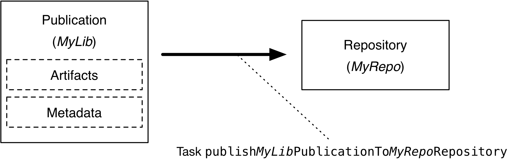

# 将项目发布为模块

内容

  * [设置基本发布](#%E8%AE%BE%E7%BD%AE%E5%9F%BA%E6%9C%AC%E5%8F%91%E5%B8%83)

绝大多数软件项目都旨在以某种方式使用某种东西。它可以是其他软件项目使用的库，也可以是最终用户的应用程序。 _发布_ 是将构建的东西提供给消费者的过程。

在Gradle中，该过程如下所示：

  1. 定义[什么](#publishing_overview:what)发布

  2. 定义[将](#publishing_overview:where)其发布到的位置

  3. [做](#publishing_overview:how)出版

这些步骤中的每个步骤都取决于要向其发布工件的存储库的类型。两种最常见的类型是Maven兼容和Ivy兼容的存储库，或者简称为Maven和Ivy存储库。

从Gradle
6.0开始，[Gradle模块元数据](/md/了解Gradle模块元数据.md#sec:understanding-gradle-module-md)将始终与Ivy XML或Maven POM元数据文件一起发布。

╔═════════════════════════════  

寻找有关上传任务和`archives`配置的信息？请参阅“[旧版发布”](https://docs.gradle.org/6.7.1/userguide/artifact_management.html#artifact_management)一章，该功能现已弃用，并计划将其删除。  
  
╚═════════════════════════════    
  
Gradle通过以[Maven Publish插件](/md/Maven发布插件.md#publishing_maven)和[Ivy Publish插件](/md/Ivy发布插件.md#publishing_ivy)的形式提供一些预打包的基础结构，使发布到这些类型的存储库变得容易。这些插件使您可以配置要发布的内容并以最小的努力执行发布。

图1.发布过程

让我们更详细地看一下这些步骤：

发表什么

    

Gradle需要知道要发布哪些文件和信息，以便消费者可以使用您的项目。这通常是Gradle称为[出版物](/md/依赖管理术语.md#作品（publication）)的[工件](/md/依赖管理术语.md#artifact)和元数据的组合。出版物中包含的内容确切取决于要发布到的存储库的类型。

例如，发往Maven存储库的出版物包括：

  * 一个或多个工件（通常由项目构建）

  * Gradle模块元数据文件，将描述已发布组件的变体，

  * Maven POM文件将标识主要工件及其依赖关系。主要工件通常是项目的生产JAR，辅助工件可能由“ -sources”和“ -javadoc” JAR组成。

另外，Gradle将发布上述所有内容的校验和，并在配置时发布[签名](/md/签名作品.md)。从Gradle
6.0开始，其中包括`SHA256`和`SHA512`校验和。

在哪里发布

    

Gradle需要知道在哪里发布工件，以便消费者可以掌握它们。这是通过[存储库](/md/依赖管理术语.md#repository)完成的，该存储[库](/md/依赖管理术语.md#repository)存储并提供了各种工件。Gradle还需要与存储库进行交互，因此必须提供存储库的类型及其位置。

发行方式

    

Gradle会自动为发布和存储库的所有可能组合生成发布任务，从而使您可以将任何工件发布到任何存储库。如果要发布到Maven存储库，则任务的类型为[PublishToMavenRepository](https://docs.gradle.org/6.7.1/dsl/org.gradle.api.publish.maven.tasks.PublishToMavenRepository.html)，而对于Ivy存储库，任务的类型为[PublishToIvyRepository](https://docs.gradle.org/6.7.1/dsl/org.gradle.api.publish.ivy.tasks.PublishToIvyRepository.html)。

下面是一个实际的示例，演示了整个发布过程。

## [设置基本发布](#%E8%AE%BE%E7%BD%AE%E5%9F%BA%E6%9C%AC%E5%8F%91%E5%B8%83)

无论您的项目类型如何，发布的第一步都是应用适当的发布插件。如简介中所述，Gradle通过以下插件支持Maven和Ivy存储库：

  * [Maven发布插件](/md/Maven发布插件.md#publishing_maven)

  * [Ivy发布插件](/md/Ivy发布插件.md#publishing_ivy)

它们提供了配置相应存储库类型的发布所需的特定发布和存储库类。由于Maven存储库是最常用的存储库，因此它们将成为本示例和本章其他示例的基础。不用担心，我们将说明如何为Ivy存储库调整单个样本。

假设我们正在使用一个简单的Java库项目，因此仅应用以下插件：

例子1.应用必要的插件

`Groovy``Kotlin`

build.gradle

    
    
    plugins {
        id 'java-library'
        id 'maven-publish'
    }

build.gradle.kts

    
    
    plugins {
        `java-library`
        `maven-publish`
    }

一旦应用了适当的插件，就可以配置发布和存储库。对于此示例，我们想将项目的生产JAR文件（由`jar`任务生成的文件）发布到自定义的Maven存储库。我们使用以下代码`publishing
{}`块来完成此操作，该代码块由[PublishingExtension](https://docs.gradle.org/6.7.1/dsl/org.gradle.api.publish.PublishingExtension.html)支持：

例子2.配置一个用于发布的Java库

`Groovy``Kotlin`

build.gradle

    
    
    group = 'org.example'
    version = '1.0'
    
    publishing {
        publications {
            myLibrary(MavenPublication) {
                from components.java
            }
        }
    
        repositories {
            maven {
                name = 'myRepo'
                url = "file://${buildDir}/repo"
            }
        }
    }

build.gradle.kts

    
    
    group = "org.example"
    version = "1.0"
    
    publishing {
        publications {
            create<MavenPublication>("myLibrary") {
                from(components["java"])
            }
        }
    
        repositories {
            maven {
                name = "myRepo"
                url = uri("file://${buildDir}/repo")
            }
        }
    }

这定义了一个称为“
myLibrary”的发布，该发布可以凭借其类型：[MavenPublication](https://docs.gradle.org/6.7.1/dsl/org.gradle.api.publish.maven.MavenPublication.html)发布到Maven存储库。该出版物仅包含生产JAR工件及其元数据，这些组合在一起由项目的`java`
[组件](/md/依赖管理术语.md#component)表示。

╔═════════════════════════════    组件是定义发布的标准方法。它们是由插件提供的，通常是各种语言或平台的插件。例如，Java插件定义了`components.java`
[SoftwareComponent](https://docs.gradle.org/6.7.1/javadoc/org/gradle/api/component/SoftwareComponent.html)，而War插件定义了`components.web`。  
╚═════════════════════════════    
  
该示例还定义了一个名为“
myRepo”的基于文件的Maven存储库。这样的基于文件的存储库对于示例来说很方便，但实际构建通常可以与基于HTTPS的存储库服务器（例如Maven
Central或内部公司服务器）一起使用。

╔═════════════════════════════    您可以定义一个（只有一个）没有名称的存储库。对于Maven存储库，这将转换为隐式名称“
Maven”，对于Ivy存储库，将转换为隐式名称。必须为所有其他存储库定义指定一个明确的名称。  
╚═════════════════════════════    
  
与项目的`group`和结合使用`version`，发布和存储库定义提供了Gradle发布项目的生产JAR所需的所有内容。然后Gradle将创建一个专门的`publishMyLibraryPublicationToMyRepoRepository`任务来完成该任务。其名称基于模板。请参阅相应的发布插件的文档，以获取有关此任务以及您可能可用的任何其他任务的性质的更多详细信息。`publish
_PubName_ PublicationTo _RepoName_ Repository`

您可以直接执行单个发布任务，也可以执行`publish`，它将运行所有可用的发布任务。在此示例中，`publish`将运行`publishMyLibraryPublicationToMavenRepository`。

╔═════════════════════════════  

基本发布到Ivy库非常类似：您只需使用Ivy发布插件，替换
`MavenPublication`与[IvyPublication](https://docs.gradle.org/6.7.1/dsl/org.gradle.api.publish.ivy.IvyPublication.html)，并使用`ivy`，而不是`maven`存储库中的定义。

两种类型的存储库之间存在差异，尤其是每种存储库都支持的额外元数据之间存在差异（例如，Maven存储库需要一个POM文件，而Ivy存储库则具有自己的元数据格式），因此，请参阅插件章节以获取有关如何配置这两种存储库的全面信息。您正在使用的任何存储库类型的出版物和存储库。  
  
╚═════════════════════════════    
  
这就是基本用例的全部内容。但是，许多项目需要对发布的内容进行更多控制，因此我们在以下各节中介绍几种常见方案。

