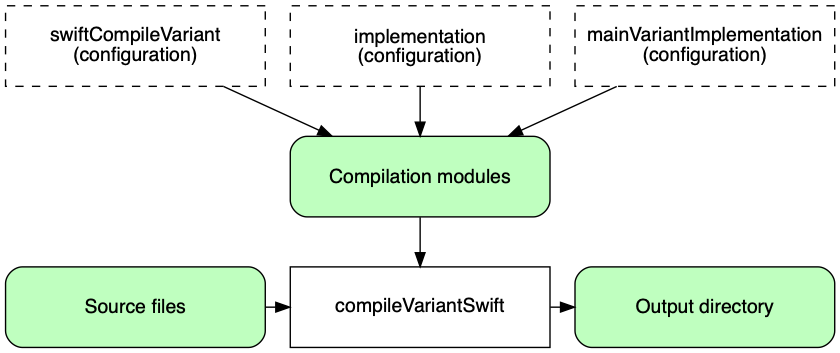

# 建立Swift项目

内容

  * [介绍](#%E4%BB%8B%E7%BB%8D)
  * [引入构建变体](#%E5%BC%95%E5%85%A5%E6%9E%84%E5%BB%BA%E5%8F%98%E4%BD%93)
  * [声明您的源文件](#%E5%A3%B0%E6%98%8E%E6%82%A8%E7%9A%84%E6%BA%90%E6%96%87%E4%BB%B6)
  * [管理你的依赖](#%E7%AE%A1%E7%90%86%E4%BD%A0%E7%9A%84%E4%BE%9D%E8%B5%96)
  * [编译和链接代码](#%E7%BC%96%E8%AF%91%E5%92%8C%E9%93%BE%E6%8E%A5%E4%BB%A3%E7%A0%81)
  * [包装出版](#%E5%8C%85%E8%A3%85%E5%87%BA%E7%89%88)
  * [清理构建](#%E6%B8%85%E7%90%86%E6%9E%84%E5%BB%BA)
  * [构建Swift库](#%E6%9E%84%E5%BB%BASwift%E5%BA%93)
  * [构建Swift应用程序](#%E6%9E%84%E5%BB%BASwift%E5%BA%94%E7%94%A8%E7%A8%8B%E5%BA%8F)

Gradle使用约定优于配置的方法来构建本机项目。如果您来自另一个本机构建系统，那么这些概念起初可能并不陌生，但它们的目的是简化构建脚本的编写。

我们将在本章中详细介绍Swift项目，但是大多数主题也将适用于其他受支持的本地语言。

## [介绍](#%E4%BB%8B%E7%BB%8D)

Swift项目的最简单构建脚本将应用Swift应用程序插件或Swift库插件，并可以选择设置项目版本：

例子1.应用Swift插件

`Groovy``Kotlin`

build.gradle

    
    
    plugins {
        id 'swift-application' // or 'swift-library'
    }
    
    version = '1.2.1'

build.gradle.kts

    
    
    plugins {
        `swift-application` // or `swift-library`
    }
    
    version = "1.2.1"

通过应用这两个Swift插件，您可以获得许多功能：

  * `compileDebugSwift`以及分别`compileReleaseSwift`为 _src / main / swift_ 编译Swift源文件的任务，以分别用于著名的调试和发布构建类型。

  * `linkDebug`以及`linkRelease`将编译后的Swift对象文件链接到应用程序的可执行文件或共享库的库，这些库具有调试和发布构建类型的共享链接。

  * `createDebug`以及`createRelease`将编译后的Swift对象文件组装到静态库中的任务，这些库具有针对调试和发布构建类型的静态链接。

对于任何不平凡的斯威夫特项目，你可能有一些文件相关的和额外的配置具体到 _你的_ 项目。

Swift插件还将上述任务集成到标准[生命周期任务中](https://docs.gradle.org/6.7.1/userguide/base_plugin.html#sec:base_tasks)。产生开发二进制文件的任务附加到`assemble`。默认情况下，开发二进制文件是调试变量。

本章的其余部分介绍了在构建库和应用程序时根据需要自定义构建的不同方法。

## [引入构建变体](#%E5%BC%95%E5%85%A5%E6%9E%84%E5%BB%BA%E5%8F%98%E4%BD%93)

本机项目通常可以产生几种不同的二进制文件，例如调试或发布的二进制文件，或针对特定平台和处理器体系结构的二进制文件。Gradle通过 _维度_ 和 _变体_
的概念来进行管理。

维度只是一个类别，每个类别都与其余类别正交。例如，“构建类型”维是包括调试和发布的类别。“架构”维度涵盖了x86-64和x86之类的处理器架构。

变体是这些维度的值的组合，每个维度恰好由一个值组成。您可能具有“调试x86-64”或“发行版x86”变体。

Gradle内置支持多个维度以及每个维度中的多个值。您可以在本[机插件参考章节中](/md/插件参考.md#native_languages)找到它们的列表。

## [声明您的源文件](#%E5%A3%B0%E6%98%8E%E6%82%A8%E7%9A%84%E6%BA%90%E6%96%87%E4%BB%B6)

Gradle的Swift支持使用`ConfigurableFileCollection`直接来自[应用程序](https://docs.gradle.org/6.7.1/dsl/org.gradle.language.swift.SwiftApplication.html)或[库](https://docs.gradle.org/6.7.1/dsl/org.gradle.language.swift.SwiftLibrary.html)脚本块的代码来配置要编译的源集。

库区分私有（实现细节）和公共（导出到用户）头。

对于仅在某些目标计算机上编译源的情况，您还可以为每个二进制版本配置源。

图1.源代码和Swift编译

## [管理你的依赖](#%E7%AE%A1%E7%90%86%E4%BD%A0%E7%9A%84%E4%BE%9D%E8%B5%96)

绝大多数项目都依赖于其他项目，因此管理项目的依存关系是构建任何项目的重要组成部分。依赖管理是一个大话题，因此我们在这里仅关注Swift项目的基础知识。如果您想深入了解细节，请查看[依赖管理简介](/md/Gradle中的依赖管理.md)。

Gradle提供了对使用Gradle [[1](#_footnotedef_1"查看脚注。") ]发布的Maven存储库中的预构建二进制文件的支持。

我们将介绍如何在多构建项目中的项目之间添加依赖项。

为您的Swift项目指定依赖项需要两条信息：

  * 识别依赖项的信息（项目路径，Maven GAV）

  * 它需要什么，例如编译，链接，运行时或以上所有。

此信息`dependencies
{}`在Swift`application`或`library`脚本块的块中指定。例如，要告诉Gradle您的项目需要库`common`来编译和链接生产代码，可以使用以下片段：

例子2.声明依赖

`Groovy``Kotlin`

build.gradle

    
    
    application {
        dependencies {
            implementation project(':common')
        }
    }

build.gradle.kts

    
    
    application {
        dependencies {
            implementation(project(":common"))
        }
    }

三个元素的Gradle术语如下：

  * _配置_ （例如：`implementation`）-命名的依赖项集合，针对特定目标（如编译或链接模块）分组在一起

  * _项目引用_ （例如：`project(':common')`）-指定路径引用的项目

您可以[在此处](/md/依赖管理术语.md)找到更全面的依赖项管理术语表。

就配置而言，主要感兴趣的是：

  * `implementation` -用于编译，链接和运行时

  * `swiftCompile _Variant_` -对于编译生产代码所必需的依赖关系，但不应该包含在链接或运行时过程中

  * `nativeLink _Variant_` -对于链接代码所必需的依赖关系，但不应该包含在编译或运行时过程中

  * `nativeRuntime _Variant_` -对于运行组件所需的依赖关系，但不应该包含在编译或链接过程中

您可以在本[机插件参考章节中](/md/插件参考.md#native_languages)了解有关它们的更多信息以及它们之间的关系。

请注意，[Swift库插件](https://docs.gradle.org/6.7.1/userguide/swift_library_plugin.html)`api`为编译和链接模块以及依赖该模块的任何模块所需的依赖项创建了一个附加配置。

我们仅在此处进行了介绍，因此，一旦您熟悉使用Gradle构建Swift项目的基础知识，我们建议您阅读[专用的依赖管理章节](/md/Gradle中的依赖管理.md)。

需要进一步阅读的一些常见方案包括：

  * 定义与[Maven兼容](/md/声明存储库.md#支持的存储库类型)的自定义存储库

  * 使用[变化的版本](/md/处理随时间变化的版本.md#声明版本变更)（例如SNAPSHOT）和[动态的](/md/处理随时间变化的版本.md#声明动态版本)（范围）声明依赖项

  * 将同级[项目](/md/声明依赖.md#项目依赖)声明[为依赖项](/md/声明依赖.md#项目依赖)

  * [控制传递依赖及其版本](/md/升级传递依赖的版本.md)

  * 通过[组合构建](/md/复合构建.md)测试对第三方依赖关系的修复（这是发布到[Maven Local](/md/声明存储库.md#本地Maven存储库)和从[Maven Local](/md/声明存储库.md#本地Maven存储库)消费的更好的替代方法）

您会发现Gradle具有丰富的API用于处理依赖关系-一种需要花费时间来掌握的API，但对于常见的情况却很容易使用。

## [编译和链接代码](#%E7%BC%96%E8%AF%91%E5%92%8C%E9%93%BE%E6%8E%A5%E4%BB%A3%E7%A0%81)

如果遵循以下约定，则编译两个代码都非常容易：

  1. 将您的源代码放在 _src / main / swift_ 目录下

  2. 在`implementation`配置中声明您的编译依赖性（请参阅上一节）

  3. 运行`assemble`任务

我们建议您尽可能遵循这些约定，但不必这样做。

有几种自定义选项，您将在接下来看到。

╔═════════════════════════════  
所有[SwiftCompile](https://docs.gradle.org/6.7.1/dsl/org.gradle.language.swift.tasks.SwiftCompile.html)任务都是增量的且可缓存的。  
╚═════════════════════════════    
  
### [支持的工具链](#%E6%94%AF%E6%8C%81%E7%9A%84%E5%B7%A5%E5%85%B7%E9%93%BE)

Gradle支持[适用于macOS和Linux](https://swift.org/download/)的[官方Swift工具链](https://swift.org/download/)。当您构建本机二进制文件时，Gradle会尝试找到您的计算机上安装的可以构建二进制文件的工具链。Gradle选择可以为目标操作系统，体系结构和Swift语言支持构建的第一个工具链。

╔═════════════════════════════    
Gradle将使用系统PATH发现工具链。  
╚═════════════════════════════    
  
### [自定义文件和目录位置](#%E8%87%AA%E5%AE%9A%E4%B9%89%E6%96%87%E4%BB%B6%E5%92%8C%E7%9B%AE%E5%BD%95%E4%BD%8D%E7%BD%AE)

假设您要迁移遵循Swift Package
Manager布局的库项目（例如，生产代码目录）。传统的目录结构不起作用，因此您需要告诉Gradle在哪里可以找到源文件。您可以通过或脚本块执行此操作。`Sources/
_ModuleName_ _``application``library`

每个组件脚本块以及每个二进制文件都定义了其源代码所在的位置。您可以使用以下语法覆盖约定值：

例子3.设置Swift源集

`Groovy``Kotlin`

build.gradle

    
    
    library {
        source.from file('src')
    }

build.gradle.kts

    
    
    extensions.configure<SwiftLibrary> {
        source.from(file("Sources/Common"))
    }

现在Gradle将仅在 _Sources / Common中_ 直接搜索源。

### [更改编译器和链接器选项](#%E6%9B%B4%E6%94%B9%E7%BC%96%E8%AF%91%E5%99%A8%E5%92%8C%E9%93%BE%E6%8E%A5%E5%99%A8%E9%80%89%E9%A1%B9)

大多数的编译器和连接选项是通过相应的任务访问，如，和。这些任务分别为[SwiftCompile](https://docs.gradle.org/6.7.1/dsl/org.gradle.language.swift.tasks.SwiftCompile.html)，[LinkSharedLibrary](https://docs.gradle.org/6.7.1/dsl/org.gradle.nativeplatform.tasks.LinkSharedLibrary.html)和[CreateStaticLibrary](https://docs.gradle.org/6.7.1/dsl/org.gradle.nativeplatform.tasks.CreateStaticLibrary.html)类型。阅读任务参考以获取最新，最全面的选项列表。`compile
_Variant_ Swift``link _Variant_``create
_Variant_`

例如，如果要更改编译器为所有变体生成的警告级别，则可以使用以下配置：

示例4.为所有变体设置Swift编译器选项

`Groovy``Kotlin`

build.gradle

    
    
    tasks.withType(SwiftCompile).configureEach {
        // Define a preprocessor macro for every binary
        macros.add("NDEBUG")
    
        // Define a compiler options
        compilerArgs.add '-O'
    }

build.gradle.kts

    
    
    tasks.withType(SwiftCompile::class.java).configureEach {
        // Define a preprocessor macro for every binary
        macros.add("NDEBUG")
    
        // Define a compiler options
        compilerArgs.add("-O")
    }

也可以通过`BinaryCollection`on`application`或`library`script块找到特定变体的实例：

例子5.为每个变量设置Swift编译器选项

`Groovy``Kotlin`

build.gradle

    
    
    application {
        binaries.configureEach(SwiftStaticLibrary) {
            // Define a preprocessor macro for every binary
            compileTask.get().macros.add("NDEBUG")
    
            // Define a compiler options
            compileTask.get().compilerArgs.add '-O'
        }
    }

build.gradle.kts

    
    
    application {
        binaries.configureEach(SwiftStaticLibrary::class.java) {
            // Define a preprocessor macro for every binary
            compileTask.get().macros.add("NDEBUG")
    
            // Define a compiler options
            compileTask.get().compilerArgs.add("-O")
        }
    }

### [选择目标机器](#%E9%80%89%E6%8B%A9%E7%9B%AE%E6%A0%87%E6%9C%BA%E5%99%A8)

默认情况下，Gradle将尝试为主机操作系统和体系结构创建Swift二进制变体。通过`TargetMachine`在`application`或`library`脚本块上指定的设置，可以覆盖此设置：

例子6.设置目标机器

`Groovy``Kotlin`

build.gradle

    
    
    application {
        targetMachines = [
            machines.linux.x86_64,
            machines.macOS.x86_64
        ]
    }

build.gradle.kts

    
    
    application {
        targetMachines.set(listOf(machines.linux.x86_64, machines.macOS.x86_64))
    }

## [包装出版](#%E5%8C%85%E8%A3%85%E5%87%BA%E7%89%88)

在本地环境中，打包和发布Swift项目的方式有很大不同。Gradle带有默认值，但是可以实现自定义打包而没有任何问题。

  * 可执行文件直接发布到Maven存储库。

  * 共享库和静态库文件以及公共标头的zip文件直接发布到Maven存储库。

  * 对于应用程序，Gradle还支持在已知位置安装和运行具有所有共享库依赖项的可执行文件。

## [清理构建](#%E6%B8%85%E7%90%86%E6%9E%84%E5%BB%BA)

Swift应用程序和库插件`clean`通过使用[基本插件](https://docs.gradle.org/6.7.1/userguide/base_plugin.html)将任务添加到您的项目中。此任务只是删除`$buildDir`目录中的所有内容，因此为什么要始终将构建生成的文件放在其中。该任务是Delete的一个实例，您可以通过设置其`dir`属性来更改其删除的目录。

## [构建Swift库](#%E6%9E%84%E5%BB%BASwift%E5%BA%93)

库项目的独特之处在于它们被其他Swift项目使用（或“消耗”）。这意味着以二进制文件和标头发布的依赖元数据（以Gradle
Module元数据的形式）至关重要。特别是，库的使用者应能够区分两种不同类型的依赖关系：仅依赖于编译库的依赖关系和也依赖于编译使用者的依赖关系。

Gradle通过[Swift Library Plugin](https://docs.gradle.org/6.7.1/userguide/swift_library_plugin.html)来管理这种区别，
[Swift Library Plugin](https://docs.gradle.org/6.7.1/userguide/swift_library_plugin.html)在本章中曾经介绍过的
_实现_ 之外，还引入了 _api_ 配置。如果依赖项的类型显示为静态库的未解析符号或在公共头文件中，则该依赖项通过库的公共API公开，因此应将其添加到
_api_ 配置中。否则，依赖项是内部实现细节，应将其添加到 _Implementation中_ 。 __ __ __

如果不确定API和实现依赖项之间的区别，请参阅[Swift库插件](https://docs.gradle.org/6.7.1/userguide/swift_library_plugin.html#sec:swift_library_api_vs_implementation)一章中的详细说明。另外，您可以在相应的[样本中](https://docs.gradle.org/6.7.1/samples/sample_building_swift_libraries.html)看到构建Swift库的基本，实际[示例](https://docs.gradle.org/6.7.1/samples/sample_building_swift_libraries.html)。

## [构建Swift应用程序](#%E6%9E%84%E5%BB%BASwift%E5%BA%94%E7%94%A8%E7%A8%8B%E5%BA%8F)

有关更多详细信息，请参见“
[Swift应用程序插件”](https://docs.gradle.org/6.7.1/userguide/swift_application_plugin.html)一章，但这是您所获得的快速摘要：

  * `install` 创建一个目录，其中包含运行该目录所需的一切

  * Shell和Windows Batch脚本启动应用程序

您可以在相应的[示例中](https://docs.gradle.org/6.7.1/samples/sample_building_swift_applications.html)看到构建Swift应用程序的基本[示例](https://docs.gradle.org/6.7.1/samples/sample_building_swift_applications.html)。

* * *

[1](#_footnoteref_1)。不幸的是，Cocoapods仓库尚未被支持为核心功能

