# 改善Gradle构建的性能

version 6.9-20201126230040+0000

内容

  * [构建扫描](#%E6%9E%84%E5%BB%BA%E6%89%AB%E6%8F%8F)
  * [轻松改进](#%E8%BD%BB%E6%9D%BE%E6%94%B9%E8%BF%9B)
  * [使用构建扫描进行性能分析](#%E4%BD%BF%E7%94%A8%E6%9E%84%E5%BB%BA%E6%89%AB%E6%8F%8F%E8%BF%9B%E8%A1%8C%E6%80%A7%E8%83%BD%E5%88%86%E6%9E%90)
  * [组态](#%E7%BB%84%E6%80%81)
  * [依赖解析](#%E4%BE%9D%E8%B5%96%E8%A7%A3%E6%9E%90)
  * [任务执行](#%E4%BB%BB%E5%8A%A1%E6%89%A7%E8%A1%8C)
  * [守护进程](#%E5%AE%88%E6%8A%A4%E8%BF%9B%E7%A8%8B)
  * [Java项目建议](#Java%E9%A1%B9%E7%9B%AE%E5%BB%BA%E8%AE%AE)
  * [低级分析](#%E4%BD%8E%E7%BA%A7%E5%88%86%E6%9E%90)
  * [Android版本建议](#Android%E7%89%88%E6%9C%AC%E5%BB%BA%E8%AE%AE)
  * [概要](#%E6%A6%82%E8%A6%81)

╔═════════════════════════════  需要更快的Gradle构建？[在此处注册](https://gradle.com/training/build-cache-deep-
dive/?bid=guides-performance)我们的构建缓存培训课程，以了解Gradle Enterprise如何将构建速度提高多达90％。  
╚═════════════════════════════  
  
构建性能对您的生产力至关重要。构建花费的时间越长，您从开发流程中退出的可能性就越大。最重要的是，由于您每天都要运行该构建多次，因此即使是很少的等待时间也可能导致严重的中断。在CI上运行的构建也是如此：它们越快，您对新问题的反应就越快，您进行创新实验的能力也就越大。

所有这些都意味着值得花费一些时间和精力来使构建速度尽可能快。本节提供了几种方法可以探索以加快构建速度，并提供大量详细信息，说明哪些因素会降低构建性能以及原因。

## [构建扫描](#%E6%9E%84%E5%BB%BA%E6%89%AB%E6%8F%8F)

[构建扫描](https://gradle.com/build-
scans)是运行构建时发生的事情的持久且可共享的记录。通过构建扫描，您可以获得有关构建的深刻见解，以识别和修复性能瓶颈。

如果您使用的是Gradle 4.3+，则可以使用`--scan`命令行选项（例如）轻松创建构建扫描`gradle build
--scan`。对于较早的Gradle版本，请参阅《[Build Scan
Plugin用户手册》，](https://docs.gradle.com/build-scan-
plugin/#getting_set_up)以了解如何启用构建扫描。

Gradle在构建执行结束时显示可进行构建扫描的URL：

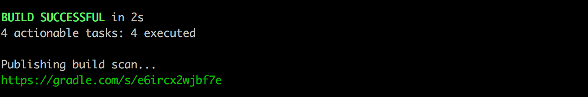

图1.构建输出末尾的构建扫描链接

接下来，本节将介绍一些快速改进，这些改进可以提高构建的性能。之后，将更深入地研究如何使用构建扫描对构建进行概要分析。

## [轻松改进](#%E8%BD%BB%E6%9D%BE%E6%94%B9%E8%BF%9B)

关于性能调优的部分通常从概要分析开始，而过早优化则是万恶之源。性能分析绝对重要，本节稍后将进行讨论，但是您可以做一些事情，这些事情会影响您的所有构建，因此只需轻轻一点就可以使性能更好。

### [使用最新的Gradle和JVM版本](#%E4%BD%BF%E7%94%A8%E6%9C%80%E6%96%B0%E7%9A%84Gradle%E5%92%8CJVM%E7%89%88%E6%9C%AC)

Gradle团队不断致力于提高Gradle构建各个方面的性能。如果您使用的是Gradle的旧版本，则会错过该工作的好处。始终跟上Gradle版本升级。这样做是低风险的，因为Gradle团队可确保Gradle的次要版本之间向后兼容。保持最新状态也使过渡到下一个主要版本更加容易，因为您会收到早期弃用警告。

升级到主要版本通常很容易。在这些边界上，只有以前不推荐使用的API和不推荐使用的行为才成为失败。因此，请务必修复这些弃用警告！如果它们是由第三方插件引起的，请立即通知作者，因此当下一个主要版本发布时，您不会受到阻碍。

当Gradle在JVM上运行时，后者性能的提高通常会使Gradle受益。因此，您应该考虑使用JVM的最新主要版本运行Gradle。

### [并行执行](#%E5%B9%B6%E8%A1%8C%E6%89%A7%E8%A1%8C)

大多数构建包含一个以上的项目，其中一些项目通常彼此独立。然而，无论项目结构如何，默认情况下，Gradle一次只能运行一项任务（此问题将很快得到改善）。通过使用该`--parallel`开关，您可以强制Gradle并行执行任务，只要这些任务位于不同的项目中即可。

启用并行构建后，您可能会看到构建时间的巨大改进。这些改进的程度取决于您的项目结构以及它们之间有多少依赖关系。例如，执行时间由单个项目控制的构建根本不会带来太多好处。或者，由于项目间存在大量依存关系，因此几乎没有可以并行执行的任务。但是大多数多项目构建应该看到有价值的构建时间增长。

╔═════════════════════════════
并行构建要求项目在执行时解耦，即，不同项目中的任务不得修改共享状态。在广泛使用之前，请在[多项目部分中](https://docs.gradle.org/nightly/userguide/multi_project_%E7%BB%84%E6%80%81_and_execution.html#sec:%E5%B9%B6%E8%A1%8C%E6%89%A7%E8%A1%8C)阅读有关该主题的更多信息`--parallel`。还应注意，4.0之前的Gradle版本可能会运行`clean`并`build`并行执行任务，从而导致失败。在这些较旧的版本上，最好分别调用`clean`。  
╚═════════════════════════════  
  
您还可以通过将以下设置添加到项目的 _gradle.properties_ 文件中，将并行构建作为项目的默认设置：

gradle.properties

    
    
    org.gradle.parallel=true

构建扫描使您可以直观地看到任务执行的时间表，并快速了解当前的并行度，从而可以识别和消除瓶颈。

例如，在下面的示例构建中，您可以在构建的开始和结束时看到长期运行的任务，它们是唯一要执行的任务：

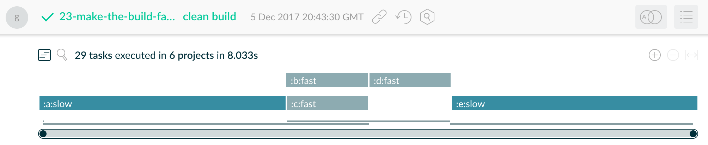

图2.并行执行中的瓶颈

调整构建配置以尽早并并行运行两个缓慢的任务，将整个构建时间从8秒减少到5秒：

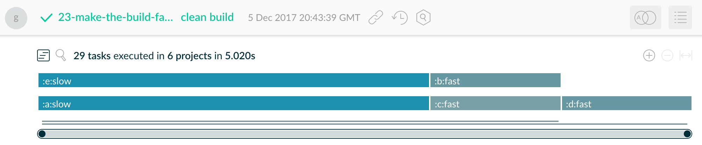

图3.优化的并行执行

那就是快速胜利的终点。从现在开始，提高构建性能将需要一些肘部润滑脂。首先，也许是最重要的步骤：找出构建过程中哪些缓慢，为什么？

### [启用文件系统监视](#%E5%90%AF%E7%94%A8%E6%96%87%E4%BB%B6%E7%B3%BB%E7%BB%9F%E7%9B%91%E8%A7%86)

Gradle与文件系统进行了大量交谈，尤其是在尝试解析构建的输入和输出状态时。为了避免不必要的I / O，在整个构建过程中都会维护内存中的 _虚拟文件系统_
。该 _文件系统看_ 功能允许Gradle保持这个内存数据之间架起，进一步减少I
/以显著方式O操作。影响取决于许多因素，但与构建的最新程度成正比。因此，它对于逐步构建小的更改最有用。

启用该功能的典型方法是通过在项目`gradle.properties`文件中添加以下设置来添加：

gradle.properties

    
    
    org.gradle.vfs.watch=true

在[相应的部分中](https://docs.gradle.org/nightly/userguide/gradle_%E5%AE%88%E6%8A%A4%E8%BF%9B%E7%A8%8B.html#sec:%E5%AE%88%E6%8A%A4%E8%BF%9B%E7%A8%8B_watch_fs)阅读有关此功能的更多信息。

## [使用构建扫描进行性能分析](#%E4%BD%BF%E7%94%A8%E6%9E%84%E5%BB%BA%E6%89%AB%E6%8F%8F%E8%BF%9B%E8%A1%8C%E6%80%A7%E8%83%BD%E5%88%86%E6%9E%90)

在对构建进行概要分析的情况下使用构建扫描时，在诊断的早期阶段主要关注的领域是性能页面。要到达此位置，请  在左侧导航菜单中单击 _“性能”_
，或单击构建扫描主页的以下屏幕截图中突出显示的链接：

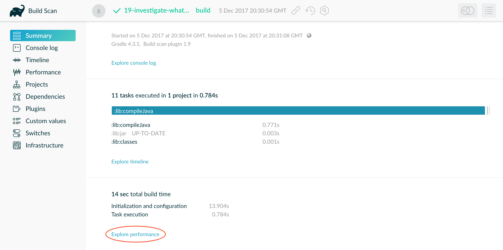

图4.构建扫描主页上的Performance页面链接

性能页面为您提供了构建不同阶段完成所需时间的细分。从下面的屏幕快照中可以看到，您将看到Gradle启动，配置构建项目，解决依赖关系以及执行任务所花费的时间。您还将获得有关环境属性的详细信息，例如是否使用了守护程序。

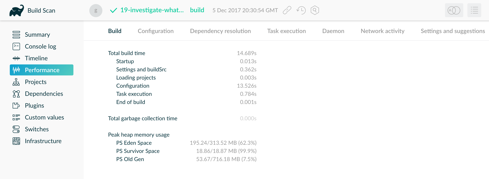

图5.构建扫描性能页面

除了构建执行的顶级性能摘要之外，您还可以在性能页面的不同选项卡中进一步深入研究影响构建性能的各个方面。

## [组态](#%E7%BB%84%E6%80%81)

如[构建生命周期一章所述](https://docs.gradle.org/nightly/userguide/build_lifecycle.html)，Gradle的构建经历三个阶段：初始化，配置和执行。这里要了解的重要一点是，无论要运行哪些任务，配置代码始终会执行。这意味着在配置过程中执行的所有昂贵工作都会降低每次调用的速度，即使是像`gradle
help`和这样的简单调用也是如此`gradle tasks`。

在上面的[构建扫描性能页面中](#build-
scan-performance)，您可以看到构建配置耗时超过16秒。单击  页面顶部的 _“配置”_
选项卡将把此阶段分解为各个组成部分，以揭示造成任何缓慢的原因。

图6.构建扫描配置分解

在这里，您可以查看应用到项目的脚本和插件，这些脚本和插件的应用时间以降序排列。最慢的插件和脚本应用程序是进行优化的最佳选择，您可以在列表中进一步深入研究。例如，脚本`script-b.gradle`只应用了一次，但是却花了3秒钟-
您可以扩展该行，以查看将其应用于构建的方式和位置。

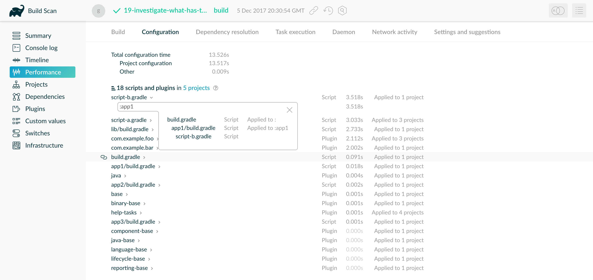

图7.显示脚本-b.gradle在构建中的应用

您可以看到项目`:app1`从该项目的`build.gradle`文件内部一次应用了此脚本。

接下来的几小节将介绍有助于缩短配置时间并解释其工作原理的技术。

### [明智地应用插件](#%E6%98%8E%E6%99%BA%E5%9C%B0%E5%BA%94%E7%94%A8%E6%8F%92%E4%BB%B6)

您应用于项目的每个插件和脚本都会增加总体配置时间。一些插件比其他插件具有更大的影响。这并不意味着您应该避免使用插件，但应注意仅在需要的地方应用它们。例如，很容易通过对插件适用于所有项目`allprojects
{}`或`subprojects {}`即使不是每一个项目都需要它们。

在上面的构建扫描示例中，您可以看到该脚本`script-a.gradle`已应用于构建中的3个项目：

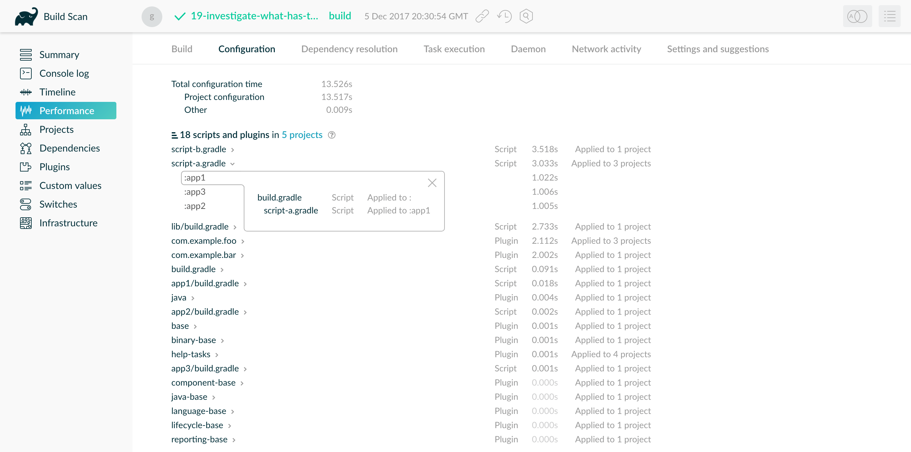

图8.显示script-a.gradle在构建中的应用

该脚本需要1秒钟来运行，并且由于它已从根构建脚本应用于3个项目，因此在配置阶段引入了3秒钟的延迟。

理想情况下，插件和脚本不应花费大量的配置时间。如果这样做，重点应该放在改进它们上。尽管如此，在具有许多模块和大量配置时间的项目中，您应该花一点时间来确定所有具有显着影响的插件。

### [避免昂贵或阻碍工作](#%E9%81%BF%E5%85%8D%E6%98%82%E8%B4%B5%E6%88%96%E9%98%BB%E7%A2%8D%E5%B7%A5%E4%BD%9C)

如您所见，您将希望避免在配置阶段进行耗时的工作，但是有时它可能会在不明显的地方潜入您的构建中。如果代码在构建文件中，则在配置过程中加密数据或调用远程服务时通常很清楚。但是类似的逻辑通常在插件和自定义任务类中找到。插件的`apply()`方法或任务的构造函数中任何昂贵的工作都应该是一个危险信号。最常见且不太明显的错误是在配置时解决依赖关系，这将在下面的单独章节中介绍。

### [静态编译任务和插件](#%E9%9D%99%E6%80%81%E7%BC%96%E8%AF%91%E4%BB%BB%E5%8A%A1%E5%92%8C%E6%8F%92%E4%BB%B6)

╔═════════════════════════════  如果您的构建逻辑由用静态编译的JVM语言（例如Java或Kotlin）编写的插件以及使用Gradle Kotlin
DSL编写的构建脚本组成，那么您可以跳过此步骤并继续进行[下一部分](#%E4%BE%9D%E8%B5%96%E8%A7%A3%E6%9E%90)。  
╚═════════════════════════════  
  
插件和偶尔的任务在配置阶段执行工作。这些通常用Groovy编写，因为其语法简洁，对JDK的API扩展以及使用闭包的函数方法。但是，重要的是要记住，动态Groovy中与方法调用相关的开销很小。当您在许多项目中重复执行许多方法调用时，成本可能会增加。

可以通过`@CompileStatic`在Groovy类上使用（如果可能）或以静态编译语言（例如Java）编写这些类来降低成本。这仅真正适用于大型项目或您公开发布的插件（因为其他用户可能将其应用于大型项目）。如果确实需要随时使用动态Groovy，则只需使用`@CompileDynamic`相关方法即可。

**注意：**
在构建脚本中使用的DSL很大程度上依赖于Groovy的动态功能，因此，如果要在插件中使用静态编译，则必须切换到更传统的类似于Java的语法。例如，要创建一个新的复制任务，您将使用如下代码：

src / main / groovy / MyPlugin.groovy

    
    
    project.tasks.register('copyFiles', Copy) { Task t ->
        t.into(project.layout.buildDirectory.dir('output'))
        t.from(project.%E7%BB%84%E6%80%81s.getByName('compile'))
    }

您可以看到该示例如何使用`register()`和`getByName()`方法，这些方法在所有Gradle“域对象容器”上都可用，例如任务，配置，依赖项，扩展等。某些集合具有专用的类型（`TaskContainer`其中之一）具有有用的额外方法。就像`create()`上面采用任务类型的方法一样。

如果您决定使用静态编译，则由于类型，属性和方法无法识别，使用IDE可以快速显示错误。您还将获得自动完成功能，这总是很方便的。

## [依赖解析](#%E4%BE%9D%E8%B5%96%E8%A7%A3%E6%9E%90)

软件项目依靠依赖关系解析来简化第三方库和其他依赖关系到构建中的集成。这确实是有代价的，因为Gradle必须联系远程服务器以查找这些依赖项并在必要时下载它们。高级缓存有助于极大地加快处理速度，但是您仍然需要注意接下来要讨论的一些陷阱。

### [最小化动态和快照版本](#%E6%9C%80%E5%B0%8F%E5%8C%96%E5%8A%A8%E6%80%81%E5%92%8C%E5%BF%AB%E7%85%A7%E7%89%88%E6%9C%AC)

动态版本（例如“ 2.
+”）和快照（或更改）版本会强制Gradle与远程存储库联系，以查找是否有新版本或快照可用。默认情况下，Gradle只会每24小时执行一次检查，但是可以更改。查找出`cacheDynamicVersionsFor`与`cacheChangingModulesFor`在你的情况下生成文件和初始化脚本将它们设置为非常短的时间或完全禁用。否则，您可能会谴责构建用户使用比正常情况更慢的构建，而不是每天进行一次比正常情况更慢的构建。

您可以通过构建扫描找到具有动态版本的所有依赖项：

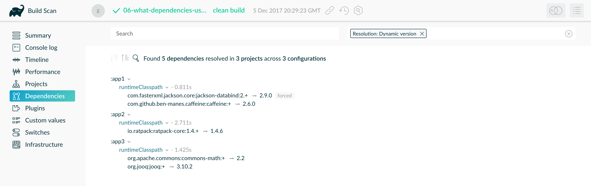

图9.查找具有动态版本的依赖项

您可能可以使用固定版本，例如“ 1.2”和“
3.0.3.GA”，在这种情况下，Gradle将始终使用缓存的版本。但是，如果您需要使用动态版本和快照版本，请确保调整缓存设置以最好地满足您的需求。

### [不要在配置时解决依赖关系](#dont_resolve_dependencies_at_%E7%BB%84%E6%80%81_time)

无论是在I /
O还是计算方面，依赖性解析都是一个昂贵的过程。Gradle通过明智的缓存减少了（并在某些情况下消除了）所需的网络流量，但是仍然需要做一些工作。为什么这很重要？因为如果在配置阶段触发依赖项解析，那么您将对运行的每个构建都增加一个损失。

要回答的关键问题是什么触发依赖性解析？最常见的原因是评估组成配置的文件。这通常是完成任务的工作，因为在准备好执行任务操作中的文件之前，通常不需要文件。但是，假设您正在进行一些调试，并且想要显示构成配置的文件。一种方法是通过插入打印语句：

`Groovy``Kotlin`

build.gradle

    
    
    tasks.register('copyFiles', Copy) {
        println ">> Compilation deps: ${%E7%BB%84%E6%80%81s.compileClasspath.files}"
        into(layout.buildDirectory.dir('output'))
        from(%E7%BB%84%E6%80%81s.compileClasspath)
    }

build.gradle.kts

    
    
    tasks.register<Copy>("copyFiles") {
        println(">> Compilation deps: ${%E7%BB%84%E6%80%81s.compileClasspath.get().files}")
        into(layout.buildDirectory.dir("output"))
        from(%E7%BB%84%E6%80%81s.compileClasspath)
    }

该`files`属性将强制Gradle解析依赖关系，并且在此示例中，这是在配置阶段发生的。现在，每次运行构建时，无论执行什么任务，都会从该配置的依赖项解析中获得性能上的损失。最好将其添加到`doFirst()`操作中。

`Groovy``Kotlin`

build.gradle

    
    
    tasks.register('copyFiles', Copy) {
        into(layout.buildDirectory.dir('output'))
        from(%E7%BB%84%E6%80%81s.compileClasspath)
        doFirst {
            println ">> Compilation deps: ${%E7%BB%84%E6%80%81s.compileClasspath.files}"
        }
    }

build.gradle.kts

    
    
    tasks.register<Copy>("copyFiles") {
        into(layout.buildDirectory.dir("output"))
        from(%E7%BB%84%E6%80%81s.compileClasspath)
        doFirst {
            println(">> Compilation deps: ${%E7%BB%84%E6%80%81s.compileClasspath.get().files}")
        }
    }

请注意，`from()`声明不会解析依赖关系，因为您将[依赖关系配置](https://docs.gradle.org/nightly/userguide/declaring_dependencies.html#sec:what-
are-dependency-
%E7%BB%84%E6%80%81s)本身用作参数，而不是其文件。该`Copy`任务处理配置本身的任务执行，而这正是你想要的东西时的分辨率。

构建扫描的性能页面上的“依赖关系解决方案”选项卡明确显示了如何在项目配置和任务执行之间分配依赖关系解决时间：

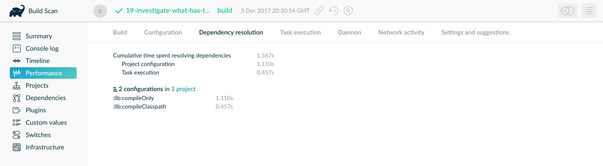

图10.配置时的依赖关系解析

在这里，您可以快速确定造成此特定性能问题的原因。在 _“项目配置”_ 期间解决依赖关系所花费的时间
应为0秒，并且此示例显示构建在生命周期的早期解决依赖关系。同样在“性能”页面上是“设置和建议”选项卡，该选项卡将向您显示在项目配置过程中正在解决哪些依赖关系。

### [避免不必要和未使用的依赖项](#%E9%81%BF%E5%85%8D%E4%B8%8D%E5%BF%85%E8%A6%81%E5%92%8C%E6%9C%AA%E4%BD%BF%E7%94%A8%E7%9A%84%E4%BE%9D%E8%B5%96%E9%A1%B9)

有时您会遇到仅使用第三方库中一个或两个方法或类的情况。发生这种情况时，您应该认真考虑在项目中自己实现所需的代码，或者如果可以的话，可以从开源库中复制所需的代码。请记住，管理第三方库及其可传递依赖项不会增加项目维护和构建时间的成本。

需要注意的另一件事是 _未使用的依赖项_ 的存在。代码重构后，当第三方库停止使用但未从依赖项列表中删除时，很容易发生这种情况。您可以使用[Gradle
Lint插件](https://github.com/nebula-plugins/gradle-lint-plugin)来识别此类依赖性。

### [最小化仓库数量](#%E6%9C%80%E5%B0%8F%E5%8C%96%E4%BB%93%E5%BA%93%E6%95%B0%E9%87%8F)

当Gradle尝试解决依赖关系时，它将按照声明它们的顺序搜索每个存储库，直到找到该依赖关系为止。通常，这意味着您要先声明存储最大数量依赖关系的存储库，以便在大多数情况下仅搜索该存储库。您还应将已声明的存储库数量限制为最小可用数量，以使构建正常工作。

如果您使用的是自定义存储库服务器，则可用的一种技术是创建将多个实际存储库聚合在一起的虚拟存储库。然后，您可以仅将该存储库添加到您的构建文件中，从而进一步减少Gradle在依赖关系解析期间发送的HTTP请求的数量。

### [注意自定义依赖项解析逻辑](#be_careful_with_custom_%E4%BE%9D%E8%B5%96%E8%A7%A3%E6%9E%90_logic)

依赖性解析是一个很难解决的问题，要使其表现良好，只会增加挑战。但是，Gradle仍然需要允许用户以最适合他们的方式对依赖关系解析进行建模。这就是为什么它具有强大的API来自定义依赖项解析如何工作的原因。

简单的自定义（例如，强制使用特定版本的依赖关系或将一个依赖关系替换为另一个依赖关系）不会对依赖关系解决时间产生重大影响。但是，例如，如果自定义逻辑涉及下载和解析额外的POM，则影响可能很大。

您应该使用构建扫描或概要文件报告来检查构建中具有的任何自定义依赖关系解析逻辑不会对依赖关系解析时间产生重大不利影响。请注意，这可能是您自己编写的自定义逻辑，也可能是您正在使用的插件的一部分。

### [识别缓慢或意外的依赖项下载](#%E8%AF%86%E5%88%AB%E7%BC%93%E6%85%A2%E6%88%96%E6%84%8F%E5%A4%96%E7%9A%84%E4%BE%9D%E8%B5%96%E9%A1%B9%E4%B8%8B%E8%BD%BD)

依赖项下载速度慢（可能是由于Internet连接速度慢，存储库服务器过载或类似原因引起的）会影响整体构建性能。构建扫描在“​​性能”页面上提供了“网络活动”选项卡，其中列出了有用的信息，例如花费时间下载依赖关系，整个构建中依赖关系下载的总体传输率以及按下载时间排序的下载列表。

在这里，您可以看到两次缓慢的依赖项下载，耗时分别为20和40秒，并降低了构建的整体性能：

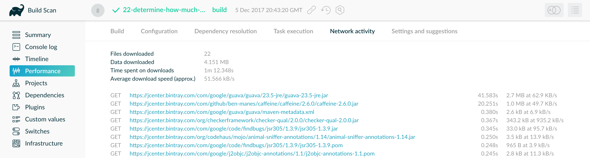

图11.识别慢速依赖项下载

您还可以检查下载列表，以确保在构建执行过程中没有意外的依赖项下载。例如，您可能会看到由使用动态版本的依赖项引起的意外下载。

## [任务执行](#%E4%BB%BB%E5%8A%A1%E6%89%A7%E8%A1%8C)

最快的任务是不执行的任务。如果您找到了跳过不需要运行的任务的方法，那么最终将获得更快的总体构建速度。本节将讨论在Gradle构建中实现避免任务的几种方法。

### [不同的人，不同的体形](#%E4%B8%8D%E5%90%8C%E7%9A%84%E4%BA%BA%EF%BC%8C%E4%B8%8D%E5%90%8C%E7%9A%84%E4%BD%93%E5%BD%A2)

将构建视为全包或全包似乎是很普遍的。每个用户必须学习由构建定义的相同任务集。在许多情况下，这没有任何意义。想象一下，您同时拥有前端和后端开发人员：他们是否希望从构建中获得相同的东西？当然不是，特别是如果一侧是HTML，CSS和JavaScript，而另一侧是Java和servlet。

重要的是，单个任务图将为构建提供基础，以确保一致性。但是您不需要将整个任务图公开给所有人。取而代之的是，根据在任务图上形成受限视图的任务集来思考，每个视图都针对特定的用户组。前端开发人员是否需要运行服务器端单元测试？不，因此，将成本强加给那些用户没有必要。

考虑到这一点，请考虑每个不同的用户组所需的不同工作流程，并尝试确保他们拥有适当的“视图”，而不会执行不必​​要的任务。Gradle有几种方法可以帮助您实现这一目标：

  * 将任务分配给适当的组

  * 创建有用的汇总任务（不执行任何操作，仅依赖于一组其他任务的任务，例如`assemble`）

  * 通过`gradle.taskGraph.whenReady()`和其他方式推迟配置，因此只有在必要时才可以执行验证

肯定需要一些努力和时间上的投入以制定合适的构建视图，但要考虑用户运行构建的频率。如果可以每天节省用户时间，那么投资无疑是值得的。

### [增量构建](#%E5%A2%9E%E9%87%8F%E6%9E%84%E5%BB%BA)

您可以避免执行任务，即使用户需要执行任务也是如此。如果自上次运行以来任务的输入或输出均未更改，则Gradle将不会再次运行它。

增量构建是Gradle赋予此功能的名称，它检查输入和输出以确定是否需要再次运行任务。Gradle提供的大多数任务都参与增量构建，因为它们是通过这种方式定义的。您还可以使自己的任务与增量构建集成。基本思想是标记任务的属性，这些属性会影响任务是否需要运行。您可以[在关于增量任务的部分中](https://docs.gradle.org/nightly/userguide/more_about_tasks.html#sec:up_to_date_checks)了解更多[信息](https://docs.gradle.org/nightly/userguide/more_about_tasks.html#sec:up_to_date_checks)。

您可以通过在构建扫描中查看时间轴视图来轻松地确定参与增量构建的优秀候选人，并了解为什么任务没有达到您期望的最新状态：

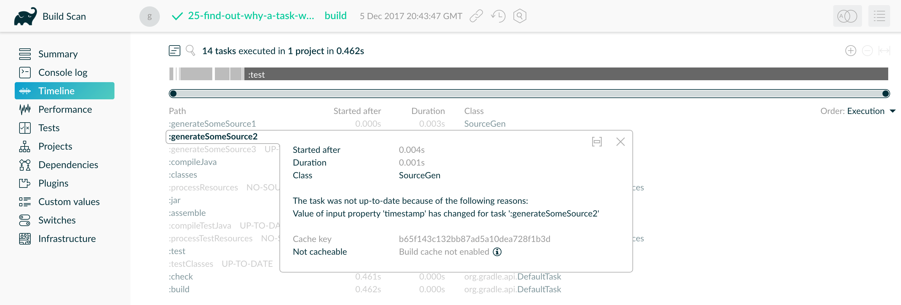

图12.时间线视图可以帮助进行增量构建检查

如您在上面的构建扫描中所看到的，该任务不是最新的，因为它的输入 _“时间戳”之一_   已更改，并迫使该任务重新运行。

还可以先按最长持续时间对任务进行排序，从而轻松挑选最慢的任务。选择最慢的自定义任务，使其参与增量构建，然后再次进行测量并重复。

### [缓存任务输出](#%E7%BC%93%E5%AD%98%E4%BB%BB%E5%8A%A1%E8%BE%93%E5%87%BA)

基于任务的先前执行，增量构建在本地工作。Gradle还可以将任务输出存储在 _构建缓存中，_
并在稍后将执行具有相同输入的相同任务时检索它们。您可以使用本地缓存在计算机上重用任务输出。这有助于减少切换分支时的构建时间。

也可以使用共享的构建缓存服务，例如[Gradle Enterprise提供的](https://gradle.com/build-
cache/)服务。共享缓存可以通过重用其他位置已经生成的输出来减少您需要执行的任务数量。这可以大大减少CI和开发人员的构建时间。

有关在构建中利用构建缓存的大量信息，请查阅有关[使用构建缓存](https://docs.gradle.org/nightly/userguide/build_cache_use_cases.html)的文档。它涵盖了可以改善缓存的不同方案，并详细讨论了为构建启用缓存时需要注意的不同警告。

同样，构建扫描可以帮助您调查任务的缓存情况。在性能屏幕中，有一个标题为 _“ Build cache”_ 的选项卡：

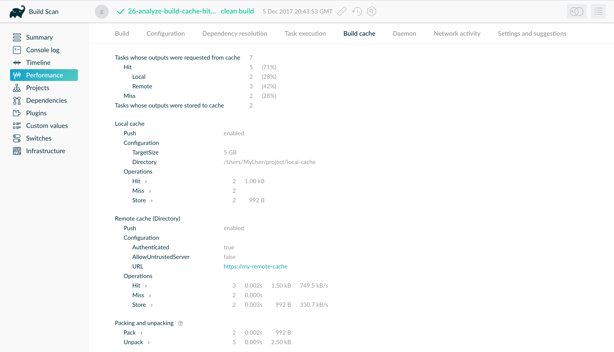

图13.检查构建的构建缓存的性能

这将显示有关与一个缓存交互的任务数量，使用了哪个缓存的统计信息，以及这些缓存条目的传输率和打包/解压缩率。

还有一个 _“任务执行”_   选项卡，显示了包括已执行任务的可缓存性在内的详细信息。单击任何类别将带您进入“时间轴”屏幕，其中仅突出显示该类别的任务。

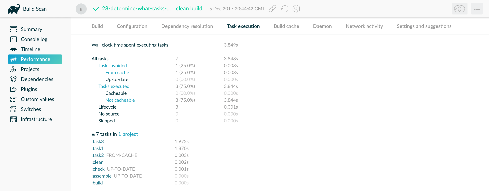

图14.面向任务的性能视图

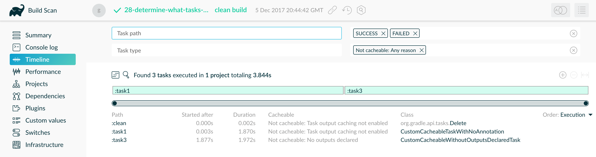

图15.仅带有“不可缓存”任务的时间线屏幕

随后，在“时间轴”屏幕上按任务持续时间排序将突出显示具有极大节省时间潜力的任务。上面的构建扫描显示了，`:task1`并且`:task3`可以对其进行改进并使其可缓存，并明确说明了将其视为不可缓存的原因。

## [守护进程](#%E5%AE%88%E6%8A%A4%E8%BF%9B%E7%A8%8B)

### [在旧的Gradle版本上启用守护程序](#%E5%9C%A8%E6%97%A7%E7%9A%84Gradle%E7%89%88%E6%9C%AC%E4%B8%8A%E5%90%AF%E7%94%A8%E5%AE%88%E6%8A%A4%E7%A8%8B%E5%BA%8F)

Gradle守护程序是一种用于提高Gradle性能的机制。从Gradle
3.0开始，该守护程序默认情况下处于启用状态，但是如果您使用的是旧版本，则一定要在本地开发人员计算机上启用它。这样，您会发现构建速度有了很大的提高。您可以在[本节中](https://docs.gradle.org/nightly/userguide/gradle_%E5%AE%88%E6%8A%A4%E8%BF%9B%E7%A8%8B.html)学习如何做。

在CI计算机上，可以从守护程序获得的收益取决于您的设置。如果您拥有长期的CI代理，并且构建了许多都使用相同Gradle版本和JVM参数的小型项目，那么该守护程序可以减少周转时间。如果您的项目规模更大或更多样化，那么您可能不会看到太多好处。通常，保留守护程序是安全的，因为Gradle
3.0引入了运行状况监视，它将关闭守护程序以减少内存压力。

### [调整守护程序的堆大小](#adjust_the_%E5%AE%88%E6%8A%A4%E8%BF%9B%E7%A8%8Bs_heap_size)

默认情况下，Gradle将为您的构建保留1GB的堆空间，这对于大多数项目来说已经足够了，尤其是如果您在本节的后续部分中遵循我们对分叉编译的建议。但是，某些非常大的构建可能需要更多内存来保存Gradle的模型和缓存。如果是这种情况，则可以在
_gradle.properties_ 文件中检入更大的内存要求：

gradle.properties

    
    
    org.gradle.jvmargs=-Xmx2048M

## [Java项目建议](#Java%E9%A1%B9%E7%9B%AE%E5%BB%BA%E8%AE%AE)

以下建议特定于使用`java`插件或其他JVM语言之一的项目。

### [运行测试](#%E8%BF%90%E8%A1%8C%E6%B5%8B%E8%AF%95)

在许多项目中，大部分构建时间都由运行的测试任务组成。这些可能是单元测试和集成测试的混合，后者通常要慢得多。构建扫描可以帮助您确定最慢的测试，这应该是性能改进的主要重点。

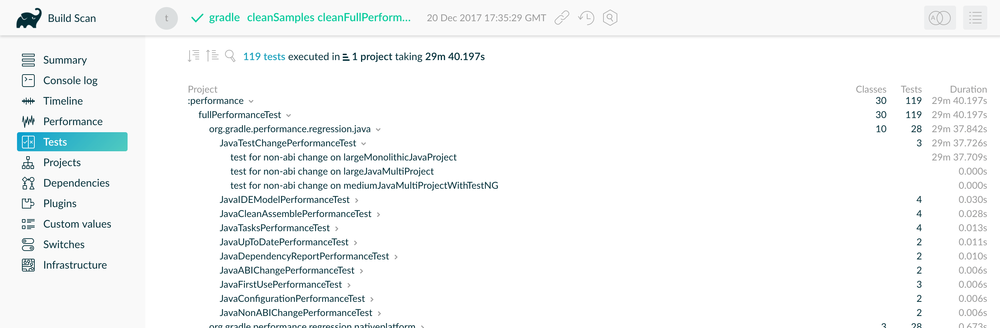

图16. Tests屏幕，其中包含按项目进行的测试，并按持续时间排序

如上所示，构建扫描为运行测试的所有项目提供了交互式测试报告。

Gradle有几种方法可以帮助您更快地完成测试：

  * 并行测试执行

  * 流程分叉选项

  * 禁用报告生成

让我们依次看看这些。

#### [并行测试执行](#%E5%B9%B6%E8%A1%8C%E6%B5%8B%E8%AF%95%E6%89%A7%E8%A1%8C)

Gradle会愉快地并行运行多个测试用例，当您有多个CPU内核并且不想浪费它们中的大多数时，这很有用。要启用此功能，只需在相关`Test`任务上使用以下配置设置：

`Groovy``Kotlin`

build.gradle

    
    
    tasks.withType(Test).configureEach {
        maxParallelForks = 4
    }

build.gradle.kts

    
    
    tasks.withType<Test>().configureEach {
        maxParallelForks = 4
    }

通常的方法是使用一些小于或等于您拥有的CPU内核数的数字，例如以下算法：

`Groovy``Kotlin`

build.gradle

    
    
    tasks.withType(Test).configureEach {
        maxParallelForks = Runtime.runtime.availableProcessors().intdiv(2) ?: 1
    }

build.gradle.kts

    
    
    tasks.withType<Test>().configureEach {
        maxParallelForks = (Runtime.getRuntime().availableProcessors() / 2).takeIf { it > 0 } ?: 1
    }

请注意，如果确实并行运行测试，则必须确保它们是独立的，即不共享资源，无论是文件，数据库还是其他资源。否则，测试可能会以随机且不可预测的方式相互干扰。

#### [分叉选项](#%E5%88%86%E5%8F%89%E9%80%89%E9%A1%B9)

默认情况下，Gradle将在单个分叉的VM中运行所有测试。如果有很多测试或一些非常消耗内存的测试，这可能会成问题。一种选择是使用大堆运行测试，但是您仍然会受到系统内存的限制，并且可能会遇到大量垃圾回收，从而降低了测试速度。

另一个选择是在运行一定数量的测试后派生新的测试VM。您可以使用以下`forkEvery`设置执行此操作：

`Groovy``Kotlin`

build.gradle

    
    
    tasks.withType(Test).configureEach {
        forkEvery = 100
    }

build.gradle.kts

    
    
    tasks.withType<Test>().configureEach {
        setForkEvery(100)
    }

请注意，分叉VM是一项相对昂贵的操作，因此此处的小值将严重影响测试的性能。

#### [报告生成](#%E6%8A%A5%E5%91%8A%E7%94%9F%E6%88%90)

Gradle默认会自动创建测试报告，无论您是否要查看它们。生成报告需要时间，从而降低了总体构建速度。报表肯定有用，但是每次运行构建时都需要报表吗？也许您只关心测试是否成功。另外，如果您使用的是构建扫描，则无需在本地生成报告。

要禁用测试报告，只需添加以下配置：

`Groovy``Kotlin`

build.gradle

    
    
    tasks.withType(Test).configureEach {
        reports.html.enabled = false
        reports.junitXml.enabled = false
    }

build.gradle.kts

    
    
    tasks.withType<Test>().configureEach {
        reports.html.isEnabled = false
        reports.junitXml.isEnabled = false
    }

此示例适用于`Test`Java插件添加的默认任务，但您也可以将配置应用于`Test`您拥有的任何其他任务。

要记住的一件事是，您可能需要有条件地禁用或启用报告，否则您将不得不编辑构建文件以查看它们。例如，您可以基于项目属性启用报告：

`Groovy``Kotlin`

build.gradle

    
    
    tasks.withType(Test).configureEach {
        if (!project.hasProperty("createReports")) {
            reports...
        }
    }

build.gradle.kts

    
    
    tasks.withType<Test>().configureEach {
        if (!project.hasProperty("createReports")) {
            reports...
        }
    }

### [编译Java](#%E7%BC%96%E8%AF%91Java)

Java编译器非常快，特别是与JVM上的其他语言相比。但是，如果您要编译数百个非平凡的Java类，那么即使是很短的编译时间也会加起来很重要。当然，您可以升级硬件以加快编译速度，但这可能是一个昂贵的解决方案。Gradle提供了一些基于软件的解决方案，可能更适合您：

  * 编译器守护程序

  * 避免编译和Java库插件

  * 增量编译

### [编译器守护程序](#%E7%BC%96%E8%AF%91%E5%99%A8%E5%AE%88%E6%8A%A4%E7%A8%8B%E5%BA%8F)

Gradle Java插件允许您通过对任何`JavaCompile`任务使用以下配置，将编译器作为单独的进程运行：

`Groovy``Kotlin`

build.gradle

    
    
    <task>.options.fork = true

build.gradle.kts

    
    
    <task>.options.isFork = true

或者，更常见的是将配置应用于 _所有_ Java编译任务：

`Groovy``Kotlin`

build.gradle

    
    
    tasks.withType(JavaCompile).configureEach {
        options.fork = true
    }

build.gradle.kts

    
    
    tasks.withType<JavaCompile>().configureEach {
        options.isFork = true
    }

此过程在构建期间将被重用，因此分叉开销很小。分叉的好处是，内存密集型编译是在不同的进程中进行的，从而导致主Gradle守护程序中的垃圾回收量大大减少。守护程序中较少的垃圾收集意味着Gradle的基础架构可以运行得更快，尤其是在您还使用的情况下`--parallel`。

它对于小型项目不太可能有用，但是如果单个任务将近一千个或更多的源文件一起编译，则一定要考虑使用它。

### [避免编译](#%E9%81%BF%E5%85%8D%E7%BC%96%E8%AF%91)

很多时候，您只是在更改代码的内部实现细节，例如，编辑方法主体。从Gradle
3.4开始，这些所谓的ABI兼容更改不再触发下游项目的重新编译。在具有深层依赖链的大型多项目构建中，这尤其可以缩短构建时间。

注意：如果使用注释处理器，则需要显式声明它们，以便避免编译。在[避免编译](https://docs.gradle.org/nightly/userguide/java_plugin.html#sec:java_%E9%81%BF%E5%85%8D%E7%BC%96%E8%AF%91)部分中了解更多有关此内容的信息。

### [Java库插件](#Java%E5%BA%93%E6%8F%92%E4%BB%B6)

长期以来，您将使用该`compile`配置声明您的编译时依赖关系，所有这些依赖关系都将泄漏到下游项目中。从Gradle
3.4开始，您现在可以清楚地区分哪些依赖项是您的一部分，`api`而哪些只是`implementation`细节。实现依赖项不会泄漏到下游项目的编译类路径中，这意味着当此类实现细节发生更改时，它们将不再被重新编译。

`Groovy``Kotlin`

build.gradle

    
    
    dependencies {
       api project('my-utils')
       implementation 'com.google.guava:guava:21.0'
    }

build.gradle.kts

    
    
    dependencies {
       api(project("my-utils"))
       implementation("com.google.guava:guava:21.0")
    }

这可以大大减少大型多项目构建中的单个更改的“涟漪”效应。该`implementation`配置在`java`插件中可用。
`api`依赖只能由应该使用[`java-
library`](https://docs.gradle.org/nightly/userguide/java_library_plugin.html)插件的库定义。

### [增量编译](#%E5%A2%9E%E9%87%8F%E7%BC%96%E8%AF%91)

Gradle可以分析直至单个类级别的依赖关系，以便仅重新编译受更改影响的类。自Gradle 4.10起，增量编译是默认设置。在旧版本中，您可以这样激活它：

`Groovy``Kotlin`

build.gradle

    
    
    tasks.withType(JavaCompile).configureEach {
        options.incremental = true
    }

build.gradle.kts

    
    
    tasks.withType<JavaCompile>().configureEach {
        options.incremental = true
    }

## [低级分析](#%E4%BD%8E%E7%BA%A7%E5%88%86%E6%9E%90)

有时，即使您的构建脚本可以正确完成所有工作，您的构建也会变慢。这通常归结为插件和自定义任务效率低下或资源受限。查找此类瓶颈的最佳方法是使用[Gradle
Profiler](https://github.com/gradle/gradle-profiler)。Gradle
Profiler允许您定义诸如“在进行ABI重大更改后运行'汇编'”之类的方案，然后自动运行构建几次以对其进行预热并收集性能分析数据。它可用于生成构建扫描，或与其他主要的探查器（如JProfiler和YourKit）一起使用。使用这些方法级别的探查器通常可以帮助您在自定义插件中找到效率低下的算法。如果您发现Gradle本身的某些功能在减慢您的构建速度，请不要犹豫在以下位置发送探查器快照：[performance@gradle.com](mailto:performance@gradle.com)。

### [个人资料报告](#%E4%B8%AA%E4%BA%BA%E8%B5%84%E6%96%99%E6%8A%A5%E5%91%8A)

如果您无法访问互联网或出于其他原因不使用构建扫描，则可以使用`--profile`命令行选项：

    
    
    $ gradle --profile <任务>

这将导致生成HTML报告，您可以在 _根_ 项目的 _build / reports / profile_ 目录中找到该 _报告_
。每个配置文件报告的名称中都有一个时间戳，以避免覆盖现有的时间戳。 __

该报告显示了运行构建所花费的时间的详细信息，尽管没有构建扫描详细得多。这是真实配置文件报告的屏幕截图，显示了Gradle使用的不同类别：

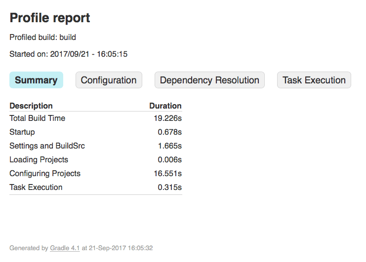

图17.一个示例概要报告

### [了解效果类别](#%E4%BA%86%E8%A7%A3%E6%95%88%E6%9E%9C%E7%B1%BB%E5%88%AB)

构建扫描和本地配置文件报告都将构建执行划分为相同的类别，下面将对其进行详细说明。

#### [启动](#%E5%90%AF%E5%8A%A8)

这反映了Gradle的初始化时间，其中主要包括

  * JVM初始化和类加载

  * 如果使用包装器，则下载Gradle发行版

  * 如果尚未运行合适的守护程序，则启动守护程序

  * 执行任何Gradle初始化脚本所花费的时间

即使构建执行的启动时间很长，通常在后续运行中启动时间也会急剧下降。构建的启动时间持续缓慢的主要原因是您的初始化脚本中存在问题。仔细检查您正在做的工作是否必要且性能尽可能好。

#### [设置和 _buildSrc_](#%E8%AE%BE%E7%BD%AE%E5%92%8C+_buildSrc_)

Gradle启动并运行后不久，它将初始化您的项目。这通常仅意味着处理设置文件，但是如果您在 _buildSrc_
目录中具有自定义构建逻辑，则也将对其进行构建。

样本概要文件报告显示了该类别的时间超过1.6秒，其中绝大部分时间用于构建 _buildSrc_ 项目。幸运的是，一旦 _buildSrc_
构建一次，该部分就不会花很长时间，因为Gradle会考虑到它是最新的。最新的检查仍然需要花费一些时间，但相差无几。如果确实在持续耗时的 _buildSrc_
阶段遇到问题，则应考虑将其分解到一个单独的项目中，该项目的JAR工件会添加到构建的类路径中。

设置文件中很少包含计算或IO昂贵的代码。如果发现Gradle需要大量时间来处理它，则应使用更传统的配置方法，例如[Gradle
Profiler](https://github.com/gradle/gradle-profiler)来确定原因。

#### [载入项目](#%E8%BD%BD%E5%85%A5%E9%A1%B9%E7%9B%AE)

通常，加载项目不会花费大量时间，您也无法对其进行任何控制。花费的时间基本上取决于构建中项目的数量。

## [Android版本建议](#Android%E7%89%88%E6%9C%AC%E5%BB%BA%E8%AE%AE)

到目前为止讨论的所有内容也适用于Android构建，因为它们基于Gradle。Android也引入了自己的性能因素。Android
Studio团队已编写了自己的出色[性能指南](https://developer.android.com/studio/build/optimize-
your-build.html)。您还可以[观看](https://www.youtube.com/watch?v=7ll-rkLCtyk)Google
IO 2017[附带的演讲](https://www.youtube.com/watch?v=7ll-rkLCtyk)。

## [概要](#%E6%A6%82%E8%A6%81)

性能并不是构建过程中的事后考虑，它是影响团队生产力和幸福感的关键功能。Gradle团队专注于尽可能快地实现Gradle构建，因为他们知道您的时间很宝贵。即使这样，Gradle也支持各种各样的构建，这意味着有时默认设置并不总是适合
_您的_ 项目。为了帮助您优化构建，本节向您介绍了设置和选项，使您可以自定义Gradle的行为以最适合您的特定构建。

除了这些设置之外，请记住，构建时间的两个主要因素是配置和任务执行，尽管前者的基本成本几乎随Gradle的每个主要发行版而下降。就配置阶段而言，您现在应该对需要避免的陷阱有了一个很好的了解。使用任务执行，您可以控制更多，因为您可以避免运行任务或过于频繁地运行它们。您还可以编写自己的任务以使其效率更高。

您还可以利用构建扫描在构建和配置过程中深入了解性能热点。此外，构建扫描使您可以轻松共享构建的特定方面，并与同事进行协作。

