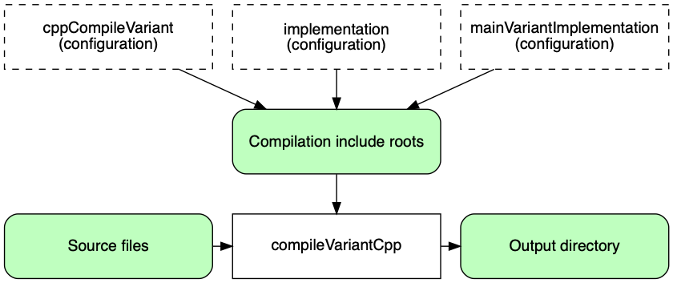

[ Gradle ](https://docs.gradle.org "Gradle Docs")

User Manual

  * Community Open Community Menu

[ Community Home ](https://gradle.org/)

[ Community Forums ](https://discuss.gradle.org/)

[ Community Plugins ](https://plugins.gradle.org)

  * [Training](https://gradle.com/training/)
  * News Open Community Menu

[ Newsletter ](https://newsletter.gradle.com)

[ Blog ](https://blog.gradle.org)

[ Twitter ](https://twitter.com/gradle)

  * [Enterprise](https://gradle.com)
  * [github](https://github.com/gradle/gradle "Gradle on GitHub")

  * [Docs Home](../userguide/userguide.html)
  * [Samples](../samples/index.html)
  * [Release Notes](../release-notes.html)
  * Gradle API
    * [Javadoc](../javadoc/index.html?overview-summary.html)
    * [Groovy DSL Reference](../dsl/index.html)
    * [Groovy DSL Primer](../userguide/groovy_build_script_primer.html)
    * [Kotlin DSL API](https://gradle.github.io/kotlin-dsl-docs/api/)
    * [Kotlin DSL Primer](../userguide/kotlin_dsl.html)

### User Manual

[ PDF ](../userguide/userguide.pdf)

  * [What is Gradle?](../userguide/what_is_gradle.html)
  * [Getting Started](../userguide/getting_started.html)
  * [Installing Gradle](../userguide/installation.html)
  * Upgrading Gradle...
    * [version 6.X to latest](../userguide/upgrading_version_6.html)
    * [version 5.X to 6.0](../userguide/upgrading_version_5.html)
    * [version 4.X to 5.0](../userguide/upgrading_version_4.html)
    * [Gradle's Feature Lifecycle](../userguide/feature_lifecycle.html)
  * Migrating to Gradle...
    * [from Maven](../userguide/migrating_from_maven.html)
    * [from Ant](../userguide/migrating_from_ant.html)
  * [Compatibility Notes](../userguide/compatibility.html)
  * [Troubleshooting Builds](../userguide/troubleshooting.html)

### Running Gradle Builds

  * Customizing Execution
    * [Configuring the Build Environment](../userguide/build_environment.html)
    * [Configuring the Gradle Daemon](../userguide/gradle_daemon.html)
    * [Using Initialization Scripts](../userguide/init_scripts.html)
  * [Executing Multi-Project Builds](../userguide/intro_multi_project_builds.html)
  * [Inspecting Gradle Builds](https://scans.gradle.com/)
  * Optimizing Build Times
    * [Build Performance Guide](https://guides.gradle.org/performance/)
    * [Enabling and Configuring the Build Cache](../userguide/build_cache.html)
    * [Using the Configuration Cache](../userguide/configuration_cache.html)

### Authoring Gradle Builds

  * Learning the Basics
    * [Introducing the Basics of Build Scripts](../userguide/tutorial_using_tasks.html)
    * [Working with Tasks](../userguide/more_about_tasks.html)
    * [Learning More About Build Scripts](../userguide/writing_build_scripts.html)
    * [Working with Files](../userguide/working_with_files.html)
    * [Using Gradle Plugins](../userguide/plugins.html)
    * [Understanding the Build Lifecycle](../userguide/build_lifecycle.html)
    * [Working with Logging](../userguide/logging.html)
    * [Avoiding Traps](../userguide/potential_traps.html)
  * Authoring Multi-Project Builds
    * [Creating a Basic Multi-Project Build](../userguide/multi_project_builds.html)
    * [Declaring Dependencies between Subprojects](../userguide/declaring_dependencies_between_subprojects.html)
    * [Sharing Build Logic between Subprojects](../userguide/sharing_build_logic_between_subprojects.html)
    * [Fine Tuning the Project Layout](../userguide/fine_tuning_project_layout.html)
    * [Understanding Configuration and Execution](../userguide/multi_project_configuration_and_execution.html)
  * Authoring Sustainable Builds
    * [Organizing Build Logic](../userguide/organizing_gradle_projects.html)
    * [Following Best Practices](../userguide/authoring_maintainable_build_scripts.html)
  * Advanced Techniques
    * [Developing Parallel Tasks](https://guides.gradle.org/using-the-worker-api/)
    * [Testing a Build with TestKit](../userguide/test_kit.html)
    * [Using Ant from Gradle](../userguide/ant.html)

### Authoring JVM Builds

  * [Building Java & JVM projects](../userguide/building_java_projects.html)
  * [Testing Java & JVM projects](../userguide/java_testing.html)
  * [Toolchains for Java projects](../userguide/toolchains.html)
  * [Managing Dependencies](../userguide/dependency_management_for_java_projects.html)
  * JVM Plugins
    * [Java Library Plugin](../userguide/java_library_plugin.html)
    * [Java Application Plugin](../userguide/application_plugin.html)
    * [Java Platform Plugin](../userguide/java_platform_plugin.html)
    * [Groovy Plugin](../userguide/groovy_plugin.html)
    * [Scala Plugin](../userguide/scala_plugin.html)

### Authoring C++/Swift Builds

  * [Building C++ projects](../userguide/building_cpp_projects.html)
  * [Testing C++ projects](../userguide/cpp_testing.html)
  * [Building Swift projects](../userguide/building_swift_projects.html)
  * [Testing Swift projects](../userguide/swift_testing.html)

### Working with Dependencies

  * Learning the Basics
    * [What is Dependency Management?](../userguide/core_dependency_management.html)
    * [Declaring Repositories](../userguide/declaring_repositories.html)
    * [Declaring Dependencies](../userguide/declaring_dependencies.html)
    * [Understanding Library and Application Differences](../userguide/library_vs_application.html)
    * [Viewing and Debugging Dependencies](../userguide/viewing_debugging_dependencies.html)
    * [Understanding Resolution](../userguide/dependency_resolution.html)
    * [Verifying dependencies](../userguide/dependency_verification.html)
  * Declaring Versions
    * [Declaring Versions and Ranges](../userguide/single_versions.html)
    * [Declaring Rich Versions](../userguide/rich_versions.html)
    * [Handling Changing Versions](../userguide/dynamic_versions.html)
    * [Locking Versions](../userguide/dependency_locking.html)
  * Controlling Transitives
    * [Upgrading Versions](../userguide/dependency_constraints.html)
    * [Downgrading and Excluding](../userguide/dependency_downgrade_and_exclude.html)
    * [Sharing Versions](../userguide/platforms.html)
    * [Aligning Dependencies](../userguide/dependency_version_alignment.html)
    * [Handling Mutually Exclusive Dependencies](../userguide/dependency_capability_conflict.html)
    * [Fixing Metadata](../userguide/component_metadata_rules.html)
    * [Customizing Resolution](../userguide/resolution_rules.html)
    * [Preventing accidental upgrades](../userguide/resolution_strategy_tuning.html)
  * Producing and Consuming Variants of Libraries
    * [Declaring Capabilities of a Library](../userguide/component_capabilities.html)
    * [Modeling Feature Variants and Optional Dependencies](../userguide/feature_variants.html)
    * [Understanding Variant Selection](../userguide/variant_model.html)
    * [Declaring Variant Attributes](../userguide/variant_attributes.html)
    * [Sharing Outputs of Projects](../userguide/cross_project_publications.html)
    * [Transforming Artifacts](../userguide/artifact_transforms.html)
  * Working in a Multi-repo Environment
    * [Composing Builds](../userguide/composite_builds.html)
  * Publishing Libraries
    * [Setting up Publishing](../userguide/publishing_setup.html)
    * [Understanding Gradle Module Metadata](../userguide/publishing_gradle_module_metadata.html)
    * [Signing Artifacts](../userguide/publishing_signing.html)
    * [Customizing Publishing](../userguide/publishing_customization.html)
    * [Maven Publish Plugin](../userguide/publishing_maven.html)
    * [Ivy Publish Plugin](../userguide/publishing_ivy.html)
  * [Terminology](../userguide/dependency_management_terminology.html)

### Extending Gradle

  * [Plugin Development Tutorials](https://gradle.org/guides/?q=Plugin%20Development)
  * [Writing Gradle Task Types](../userguide/custom_tasks.html)
  * [Writing Gradle Plugins](../userguide/custom_plugins.html)
  * [Writing Custom Gradle Types](../userguide/custom_gradle_types.html)
  * [Configuring Tasks Lazily](../userguide/lazy_configuration.html)
  * [Using Task Configuration Avoidance](../userguide/task_configuration_avoidance.html)

### Reference

  * [Core Plugins](../userguide/plugin_reference.html)
  * [Command-Line Interface](../userguide/command_line_interface.html)
  * [Gradle & Third-party Tools](../userguide/third_party_integration.html)
  * [The Gradle Wrapper](../userguide/gradle_wrapper.html)
  * [Gradle-managed Directories](../userguide/directory_layout.html)

# Building C++ projects

version 6.7.1

Contents

  * Introduction
  * Introducing build variants
  * Declaring your source files
  * Managing your dependencies
  * Compiling and linking your code
  * Packaging and publishing
  * Cleaning the build
  * Building C++ libraries
  * Building C++ applications

Gradle uses a convention-over-configuration approach to building native
projects. If you are coming from another native build system, these concepts
may be unfamiliar at first, but they serve a purpose to simplify build script
authoring.

We will look at C++ projects in detail in this chapter, but most of the topics
will apply to other supported native languages as well. If you don’t have much
experience with building native projects with Gradle, take a look at the C++
tutorials for step-by-step instructions on how to build various types of basic
C++ projects as well as some common use cases.

The C++ plugins covered in this chapter were [introduced in
2018](https://blog.gradle.org/introducing-the-new-cpp-plugins) and we
recommend users to use those plugins over [the older Native
plugins](native_software.html) that you may find references to.

## Introduction

The simplest build script for a C++ project applies the C++ application plugin
or the C++ library plugin and optionally sets the project version:

Example 1. Applying the C++ Plugin

build.gradle

    
    
    plugins {
        id 'cpp-application' // or 'cpp-library'
    }
    
    version = '1.2.1'

build.gradle.kts

    
    
    plugins {
        `cpp-application` // or `cpp-library`
    }
    
    version = "1.2.1"

By applying either of the C++ plugins, you get a whole host of features:

  * `compileDebugCpp` and `compileReleaseCpp` tasks that compiles the C++ source files under _src/main/cpp_ for the well-known debug and release build types, respectively.

  * `linkDebug` and `linkRelease` tasks that link the compiled C++ object files into an executable for applications or shared library for libraries with shared linkage for the debug and release build types.

  * `createDebug` and `createRelease` tasks that assemble the compiled C++ object files into a static library for libraries with static linkage for the debug and release build types.

For any non-trivial C++ project, you’ll probably have some file dependencies
and additional configuration specific to _your_ project.

The C++ plugins also integrates the above tasks into the standard [lifecycle
tasks](base_plugin.html#sec:base_tasks). The task that produces the
development binary is attached to `assemble`. By default, the development
binary is the debug variant.

The rest of the chapter explains the different ways to customize the build to
your requirements when building libraries and applications.

## Introducing build variants

Native projects can typically produce several different binaries, such as
debug or release ones, or ones that target particular platforms and processor
architectures. Gradle manages this through the concepts of _dimensions_ and
_variants_.

A dimension is simply a category, where each category is orthogonal to the
rest. For example, the "build type" dimension is a category that includes
debug and release. The "architecture" dimension covers processor architectures
like x86-64 and PowerPC.

A variant is a combination of values for these dimensions, consisting of
exactly one value for each dimension. You might have a "debug x86-64" or a
"release PowerPC" variant.

Gradle has built-in support for several dimensions and several values within
each dimension. You can find a list of them in the [native plugin reference
chapter](plugin_reference.html#native_languages).

## Declaring your source files

Gradle’s C++ support uses a `ConfigurableFileCollection` directly from the
[application](../dsl/org.gradle.language.cpp.CppApplication.html) or
[library](../dsl/org.gradle.language.cpp.CppLibrary.html) script block to
configure the set of sources to compile.

Libraries make a distinction between private (implementation details) and
public (exported to consumer) headers.

You can also configure sources for each binary build for those cases where
sources are compiled only on certain target machines.

Figure 1. Sources and C++ compilation

Test sources are configured on each test suite script block. See [Testing C++
projects](cpp_testing.html) chapter.

## Managing your dependencies

The vast majority of projects rely on other projects, so managing your
project's dependencies is an important part of building any project.
Dependency management is a big topic, so we will only focus on the basics for
C++ projects here. If you’d like to dive into the details, check out the
[introduction to dependency management](core_dependency_management.html).

Gradle provides support for consuming pre-built binaries from Maven
repositories published by Gradle [1].

We will cover how to add dependencies between projects within a multi-build
project.

Specifying dependencies for your C++ project requires two pieces of
information:

  * Identifying information for the dependency (project path, Maven GAV)

  * What it’s needed for, e.g. compilation, linking, runtime or all of the above.

This information is specified in a `dependencies {}` block of the C++
`application` or `library` script block. For example, to tell Gradle that your
project requires library `common` to compile and link your production code,
you can use the following fragment:

Example 2. Declaring dependencies

build.gradle

    
    
    application {
        dependencies {
            implementation project(':common')
        }
    }

build.gradle.kts

    
    
    application {
        dependencies {
            implementation(project(":common"))
        }
    }

The Gradle terminology for the three elements is as follows:

  * _Configuration_ (ex: `implementation`) - a named collection of dependencies, grouped together for a specific goal such as compiling or linking a module

  * _Project reference_ (ex: `project(':common')`) - the project referenced by the specified path

You can find a more comprehensive glossary of dependency management terms
[here](dependency_management_terminology.html).

As far as configurations go, the main ones of interest are:

  * `implementation` \- used for compilation, linking and runtime

  * `cppCompile _Variant_` \- for dependencies that are necessary to compile your production code but shouldn’t be part of the linking or runtime process

  * `nativeLink _Variant_` \- for dependencies that are necessary to link your code but shouldn’t be part of the compilation or runtime process

  * `nativeRuntime _Variant_` \- for dependencies that are necessary to run your component but shouldn’t be part of the compilation or linking process

You can learn more about these and how they relate to one another in the
[native plugin reference chapter](plugin_reference.html#native_languages).

Be aware that the [C++ Library Plugin](cpp_library_plugin.html) creates an
additional configuration — `api` — for dependencies that are required for
compiling and linking both the module and any modules that depend on it.

We have only scratched the surface here, so we recommend that you read the
[dedicated dependency management chapters](core_dependency_management.html)
once you’re comfortable with the basics of building C++ projects with Gradle.

Some common scenarios that require further reading include:

  * Defining a custom [Maven-compatible](declaring_repositories.html#sec:maven_repo) repository

  * Declaring dependencies with [changing](dynamic_versions.html#sub:declaring_dependency_with_changing_version) (e.g. SNAPSHOT) and [dynamic](dynamic_versions.html#sub:declaring_dependency_with_dynamic_version) (range) versions

  * Declaring a sibling [project as a dependency](declaring_dependencies.html#sub:project_dependencies)

  * [Controlling transitive dependencies and their versions](dependency_constraints.html)

  * Testing your fixes to 3rd-party dependency via [composite builds](composite_builds.html#composite_builds) (a better alternative to publishing to and consuming from [Maven Local](declaring_repositories.html#sub:maven_local))

You’ll discover that Gradle has a rich API for working with dependencies — one
that takes time to master, but is straightforward to use for common scenarios.

## Compiling and linking your code

Compiling both your code can be trivially easy if you follow the conventions:

  1. Put your source code under the _src/main/cpp_ directory

  2. Declare your compile dependencies in the `implementation` configurations (see the previous section)

  3. Run the `assemble` task

We recommend that you follow these conventions wherever possible, but you
don’t have to.

There are several options for customization, as you’ll see next.

__ |  All [CppCompile](../dsl/org.gradle.language.cpp.tasks.CppCompile.html)
tasks are incremental and cacheable.  
---|---  
  
### Supported tool chain

Gradle offers the ability to execute the same build using different tool
chains. When you build a native binary, Gradle will attempt to locate a tool
chain installed on your machine that can build the binary. Gradle select the
first tool chain that can build for the target operating system and
architecture. In the future, Gradle will consider source and ABI compatibility
when selecting a tool chain.

Gradle has general support for the three major tool chains on major operating
system: Clang [2], GCC [3] and Visual C++ [4] (Windows-only). GCC and Clang
installed using Macports and Homebrew have been reported to work fine, but
this isn’t tested continuously.

#### Windows

To build on Windows, install a compatible version of Visual Studio. The C++
plugins will discover the Visual Studio installations and select the latest
version. There is no need to mess around with environment variables or batch
scripts. This works fine from a Cygwin shell or the Windows command-line.

Alternatively, you can install Cygwin or MinGW with GCC. Clang is currently
not supported.

#### macOS

To build on macOS, you should install Xcode. The C++ plugins will discover the
Xcode installation using the system PATH.

The C++ plugins also work with GCC and Clang installed with Macports or
Homebrew [5]. To use one of the Macports or Homebrew, you will need to add
Macports/Homebrew to the system PATH.

#### Linux

To build on Linux, install a compatible version of GCC or Clang. The C++
plugins will discover GCC or Clang using the system PATH.

### Customizing file and directory locations

Imagine you have a legacy library project that uses an _src_ directory for the
production code and private headers and _include_ directory for exported
headers. The conventional directory structure won’t work, so you need to tell
Gradle where to find the source and header files. You do that via the
`application` or `library` script block.

Each component script block, as well as each binary, defines where it’s source
code resides. You can override the convention values by using the following
syntax:

Example 3. Setting C++ source set

build.gradle

    
    
    library {
        source.from file('src')
        privateHeaders.from file('src')
        publicHeaders.from file('include')
    }

build.gradle.kts

    
    
    library {
        source.from(file("src"))
        privateHeaders.from(file("src"))
        publicHeaders.from(file("include"))
    }

Now Gradle will only search directly in _src_ for the source and private
headers and in _include_ for public headers.

### Changing compiler and linker options

Most of the compiler and linker options are accessible through the
corresponding task, such as `compile _Variant_ Cpp`, `link _Variant_` and
`create _Variant_`. These tasks are of type
[CppCompile](../dsl/org.gradle.language.cpp.tasks.CppCompile.html),
[LinkSharedLibrary](../dsl/org.gradle.nativeplatform.tasks.LinkSharedLibrary.html)
and
[CreateStaticLibrary](../dsl/org.gradle.nativeplatform.tasks.CreateStaticLibrary.html)
respectively. Read the task reference for an up-to-date and comprehensive list
of the options.

For example, if you want to change the warning level generated by the compiler
for all variants, you can use this configuration:

Example 4. Setting C++ compiler options for all variants

build.gradle

    
    
    tasks.withType(CppCompile).configureEach {
        // Define a preprocessor macro for every binary
        macros.put("NDEBUG", null)
    
        // Define a compiler options
        compilerArgs.add '-W3'
    
        // Define toolchain-specific compiler options
        compilerArgs.addAll toolChain.map { toolChain ->
            if (toolChain in [ Gcc, Clang ]) {
                return ['-O2', '-fno-access-control']
            } else if (toolChain in VisualCpp) {
                return ['/Zi']
            }
            return []
        }
    }

build.gradle.kts

    
    
    tasks.withType(CppCompile::class.java).configureEach {
        // Define a preprocessor macro for every binary
        macros.put("NDEBUG", null)
    
        // Define a compiler options
        compilerArgs.add("-W3")
    
        // Define toolchain-specific compiler options
        compilerArgs.addAll(toolChain.map { toolChain ->
            when (toolChain) {
                is Gcc, is Clang -> listOf("-O2", "-fno-access-control")
                is VisualCpp -> listOf("/Zi")
                else -> listOf()
            }
        })
    }

It’s also possible to find the instance for a specific variant through the
`BinaryCollection` on the `application` or `library` script block:

Example 5. Setting C++ compiler options per variant

build.gradle

    
    
    application {
        binaries.configureEach(CppStaticLibrary) {
            // Define a preprocessor macro for every binary
            compileTask.get().macros.put("NDEBUG", null)
    
            // Define a compiler options
            compileTask.get().compilerArgs.add '-W3'
    
            // Define toolchain-specific compiler options
            if (toolChain in [ Gcc, Clang ]) {
                compileTask.get().compilerArgs.addAll(['-O2', '-fno-access-control'])
            } else if (toolChain in VisualCpp) {
                compileTask.get().compilerArgs.add('/Zi')
            }
        }
    }

build.gradle.kts

    
    
    application {
        binaries.configureEach(CppStaticLibrary::class.java) {
            // Define a preprocessor macro for every binary
            compileTask.get().macros.put("NDEBUG", null)
    
            // Define a compiler options
            compileTask.get().compilerArgs.add("-W3")
    
            // Define toolchain-specific compiler options
            when (toolChain) {
                is Gcc, is Clang -> compileTask.get().compilerArgs.addAll(listOf("-O2", "-fno-access-control"))
                is VisualCpp -> compileTask.get().compilerArgs.add("/Zi")
            }
        }
    }

### Selecting target machines

By default, Gradle will attempt to create a C++ binary variant for the host
operating system and architecture. It is possible to override this by
specifying the set of `TargetMachine` on the `application` or `library` script
block:

Example 6. Setting target machines

build.gradle

    
    
    application {
        targetMachines = [
            machines.linux.x86_64,
            machines.windows.x86, machines.windows.x86_64,
            machines.macOS.x86_64
        ]
    }

build.gradle.kts

    
    
    application {
        targetMachines.set(listOf(machines.windows.x86, machines.windows.x86_64, machines.macOS.x86_64, machines.linux.x86_64))
    }

## Packaging and publishing

How you package and potentially publish your C++ project varies greatly in the
native world. Gradle comes with defaults, but custom packaging can be
implemented without any issues.

  * Executable files are published directly to Maven repositories.

  * Shared and static library files are published directly to Maven repositories along with a zip of the public headers.

  * For applications, Gradle also supports installing and running the executable with all of its shared library dependencies in a known location.

## Cleaning the build

The C++ Application and Library Plugins add a `clean` task to you project by
using the [base plugin](base_plugin.html). This task simply deletes everything
in the `$buildDir` directory, hence why you should always put files generated
by the build in there. The task is an instance of Delete and you can change
what directory it deletes by setting its `dir` property.

## Building C++ libraries

The unique aspect of library projects is that they are used (or "consumed") by
other C++ projects. That means the dependency metadata published with the
binaries and headers — in the form of Gradle Module Metadata — is crucial. In
particular, consumers of your library should be able to distinguish between
two different types of dependencies: those that are only required to compile
your library and those that are also required to compile the consumer.

Gradle manages this distinction via the [C++ Library
Plugin](cpp_library_plugin.html), which introduces an _api_ configuration in
addition to the _implementation_ once covered in this chapter. If the types
from a dependency appear as unresolved symbols of the static library or within
the public headers then that dependency is exposed via your library’s public
API and should, therefore, be added to the _api_ configuration. Otherwise, the
dependency is an internal implementation detail and should be added to
_implementation_.

If you’re unsure of the difference between an API and implementation
dependency, the [C++ Library
Plugin](cpp_library_plugin.html#sec:cpp_library_api_vs_implementation) chapter
has a detailed explanation. In addition, you can see a basic, practical
example of building a C++ library in the corresponding
[sample](../samples/sample_building_cpp_libraries.html).

## Building C++ applications

See the [C++ Application Plugin](cpp_application_plugin.html) chapter for more
details, but here’s a quick summary of what you get:

  * `install` create a directory containing everything needed to run it

  * Shell and Windows Batch scripts to start the application

You can see a basic example of building a C++ application in the corresponding
[sample](../samples/sample_building_cpp_applications.html).

* * *

1. Unfortunately, Conan and Nuget repositories aren’t yet supported as core features 

2. Installed with Xcode on macOS 

3. Installed through Cygwin and MinGW for 32- and 64-bits architecture on Windows 

4. Installed with Visual Studio 2010 to 2019 

5. Macports and Homebrew installation of GCC and Clang is not officially supported 

**Docs**

  * [User Manual](/userguide/userguide.html)
  * [DSL Reference](/dsl/)
  * [Release Notes](/release-notes.html)
  * [Javadoc](/javadoc/)

**News**

  * [Blog](https://blog.gradle.org/)
  * [Newsletter](https://newsletter.gradle.com/)
  * [Twitter](https://twitter.com/gradle)
  * [Status Page](https://status.gradle.com/)

**Products**

  * [Build Scans](https://gradle.com/build-scans/)
  * [Build Cache](https://gradle.com/build-cache/)
  * [Enterprise Docs](https://gradle.com/enterprise/resources/)

**Get Help**

  * [Forums](https://discuss.gradle.org/c/help-discuss)
  * [GitHub](https://github.com/gradle/)
  * [Training](https://gradle.com/training/)
  * [Services](https://gradle.org/services/)

##### Stay `UP-TO-DATE` on new features and news

By entering your email, you agree to our
[Terms](https://gradle.com/legal/terms-of-service/) and [Privacy
Policy](https://gradle.com/legal/privacy/), including receipt of emails. You
can unsubscribe at any time.

Subscribe

© [Gradle Inc.](https://gradle.com) 2020 All rights reserved.

[ gradle ](/)

[Careers](https://gradle.com/careers/) |
[Privacy](https://gradle.com/legal/privacy/) | [Terms of
Service](https://gradle.com/legal/terms-of-service/) |
[Contact](https://gradle.org/contact/)

