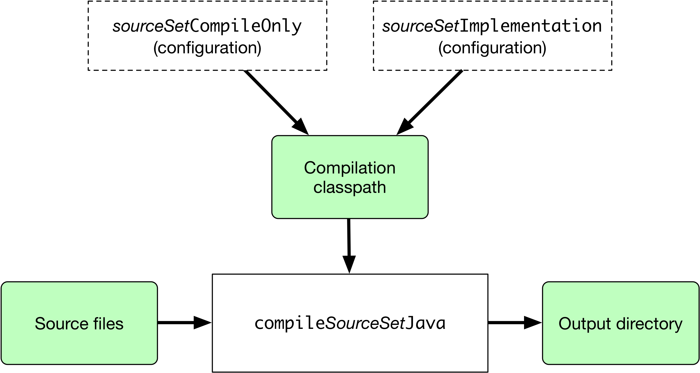

# 构建Java和JVM项目

内容

  * [介绍](#%E4%BB%8B%E7%BB%8D)
  * [通过源集声明源文件](#%E9%80%9A%E8%BF%87%E6%BA%90%E9%9B%86%E5%A3%B0%E6%98%8E%E6%BA%90%E6%96%87%E4%BB%B6)
  * [管理你的依赖](#%E7%AE%A1%E7%90%86%E4%BD%A0%E7%9A%84%E4%BE%9D%E8%B5%96)
  * [编译代码](#%E7%BC%96%E8%AF%91%E4%BB%A3%E7%A0%81)
  * [管理资源](#%E7%AE%A1%E7%90%86%E8%B5%84%E6%BA%90)
  * [运行测试](#%E8%BF%90%E8%A1%8C%E6%B5%8B%E8%AF%95)
  * [包装出版](#%E5%8C%85%E8%A3%85%E5%87%BA%E7%89%88)
  * [生成API文档](#%E7%94%9F%E6%88%90API%E6%96%87%E6%A1%A3)
  * [清理构建](#%E6%B8%85%E7%90%86%E6%9E%84%E5%BB%BA)
  * [构建JVM组件](#%E6%9E%84%E5%BB%BAJVM%E7%BB%84%E4%BB%B6)
  * [构建Java库](#%E6%9E%84%E5%BB%BAJava%E5%BA%93)
  * [构建Java应用程序](#%E6%9E%84%E5%BB%BAJava%E5%BA%94%E7%94%A8%E7%A8%8B%E5%BA%8F)
  * [构建Java Web应用程序](#%E6%9E%84%E5%BB%BAJavaWeb%E5%BA%94%E7%94%A8%E7%A8%8B%E5%BA%8F)
  * [构建Java EE应用程序](#%E6%9E%84%E5%BB%BAJava+EE%E5%BA%94%E7%94%A8%E7%A8%8B%E5%BA%8F)
  * [构建Java平台](#%E6%9E%84%E5%BB%BAJava%E5%B9%B3%E5%8F%B0)
  * [启用Java预览功能](#%E5%90%AF%E7%94%A8Java%E9%A2%84%E8%A7%88%E5%8A%9F%E8%83%BD)
  * [构建其他JVM语言项目](#%E6%9E%84%E5%BB%BA%E5%85%B6%E4%BB%96JVM%E8%AF%AD%E8%A8%80%E9%A1%B9%E7%9B%AE)

Gradle使用基于配置的约定方法来构建基于JVM的项目，该方法借鉴了Apache
Maven的几种约定。特别是，它对源文件和资源使用相同的默认目录结构，并且可与Maven兼容的存储库一起使用。

我们将在本章中详细介绍Java项目，但是大多数主题也适用于其他受支持的JVM语言，例如[Kotlin](https://kotlinlang.org/docs/reference/using-
gradle.html#targeting-the-
jvm)，[Groovy](/md/Groovy插件.md#groovy_plugin)和[Scala](/md/Scala插件.md#scala_plugin)。如果您没有使用Gradle构建基于JVM的项目的丰富经验，请查看[Java示例](https://docs.gradle.org/6.7.1/samples/index.html#java)以获取有关如何构建各种类型的基本Java项目的逐步说明。

╔═════════════════════════════  

本节中的示例使用Java库插件。但是，所有JVM插件都共享所描述的功能。不同插件的详细信息可在其专用文档中找到。  
  
╚═════════════════════════════    
  
╔═════════════════════════════  

您可以探索[Java](https://docs.gradle.org/6.7.1/samples/index.html#java)，
[Groovy](https://docs.gradle.org/6.7.1/samples/index.html#groovy)，
[Scala](https://docs.gradle.org/6.7.1/samples/index.html#scala)和
[Kotlin](https://docs.gradle.org/6.7.1/samples/index.html#kotlin)的许多动手样本。
  
  
╚═════════════════════════════    
  
## [介绍](#%E4%BB%8B%E7%BB%8D)

Java项目的最简单构建脚本将应用[Java库插件，](/md/Java库插件.md)并可以选择设置项目版本并选择要使用的[Java工具链](/md/JVM项目的工具链.md)：

例子1.应用Java库插件

`Groovy``Kotlin`

build.gradle

    
    
    plugins {
        id 'java-library'
    }
    
    java {
        toolchain {
            languageVersion = JavaLanguageVersion.of(11)
        }
    }
    
    version = '1.2.1'

build.gradle.kts

    
    
    plugins {
        `java-library`
    }
    
    java {
        toolchain {
            languageVersion.set(JavaLanguageVersion.of(11))
        }
    }
    
    version = "1.2.1"

通过应用Java库插件，您可以获得许多功能：

  * `compileJava`，编译src/main/java下的所有Java源文件任务  
  * 对src/test/java在下的源文件`compileTestJava`任务 
  *`test`任务 ， 运行src/test/java的测试
  * 一个将src/main/resources中的主要编译类和资源打包成一个名为<project>-<version>.jar的JAR任务。
  * `javadoc`为`main`类生成Javadoc的任务

这还不足以构建任何重要的Java项目-至少，您可能会有一些文件依赖性。但它意味着你的构建脚本只需要特定于信息 _的_ 项目。

╔═════════════════════════════  

尽管示例中的属性是可选的，但我们建议您在项目中指定它们。工具链选项可防止使用不同Java版本构建的项目出现问题。版本字符串对于跟踪项目的进度很重要。默认情况下，项目版本也用于归档名称中。  
  
╚═════════════════════════════    
  
Java库插件还将上述任务集成到标准的[基础插件生命周期任务中](https://docs.gradle.org/6.7.1/userguide/base_plugin.html#sec:base_tasks)：

  * `jar`附加到`assemble` [ [1](#_footnotedef_1 "查看脚注。") ]

  * `test` 连接到 `check`

本章的其余部分介绍了根据需要自定义构建的不同方法。稍后，您还将看到如何调整库，应用程序，Web应用程序和企业应用程序的构建。

## [通过源集声明源文件](#%E9%80%9A%E8%BF%87%E6%BA%90%E9%9B%86%E5%A3%B0%E6%98%8E%E6%BA%90%E6%96%87%E4%BB%B6)

Gradle对Java的支持是第一个引入用于构建基于源代码的项目的新概念的方法： _源代码集_
。主要思想是源文件和资源通常按类型进行逻辑分组，例如应用程序代码，单元测试和集成测试。每个逻辑组通常都有其自己的文件依赖项集，类路径等。重要的是，构成源集的文件
_不必位于同一目录中_ ！

源集是一个强大的概念，将编译的几个方面联系在一起：

  * 源文件及其位置

  * 编译类路径，包括任何必需的依赖项（通过Gradle[配置](/md/%E4%BE%9D%E8%B5%96%E7%AE%A1%E7%90%86%E6%9C%AF%E8%AF%AD.md%23%E9%85%8D%E7%BD%AE%EF%BC%88configuration%EF%BC%89)）

  * 放置已编译的类文件的位置

您可以在此图中看到它们之间的相互关系：

图1.源集和Java编译

阴影框表示源集本身的属性。最重要的是，Java库插件会自动为您或插件定义的每个源集（名为）以及几个[依赖项配置](https://docs.gradle.org/6.7.1/userguide/java_plugin.html#java_source_set_configurations)创建一个编译任务。`compile_SourceSet_Java`

╔═════════════════════════════  

该`main`源集

大多数语言插件（包括Java）会自动创建一个名为的源集`main`，该源集用于项目的生产代码。此源组的特殊之处在于它的名字没有在配置和任务的名称包括在内，因此为什么你只是一个`compileJava`任务，`compileOnly`和`implementation`配置，而不是`compileMainJava`，`mainCompileOnly`和`mainImplementation`分别。  
  
╚═════════════════════════════    
  
Java项目通常包含源文件以外的资源（例如属性文件），这些资源可能需要处理（例如，通过替换文件中的标记）并打包在最终JAR中。Java库插件自动创建一个名为每个定义的源组的专用任务处理这个（或为源集）。下图显示了源集如何适合此任务：`process
_SourceSet_ Resources``processResources``main`

图2.处理源集的非源文件

与以前一样，阴影框表示源集的属性，在这种情况下，该属性包括资源文件的位置以及将它们复制到的位置。

除了`main`源集之外，Java库插件还定义了`test`代表项目测试的源集。该源集由`test`运行测试的任务使用。您可以在[Java测试](/md/在Java和JVM项目中进行测试.md#java_testing)一章中了解有关此任务和相关主题的更多信息。

项目通常使用此源集进行单元测试，但如果需要，也可以将其用于集成，验收和其他类型的测试。另一种方法是为其他每种测试类型[定义一个新的源集](#%E5%88%86%E5%88%AB%E7%BC%96%E8%AF%91%E7%8B%AC%E7%AB%8B%E7%9A%84%E6%BA%90)，通常是出于以下两个或多个原因之一：

  * 您想要使测试彼此分开，以保持美观和可管理性

  * 不同的测试类型需要不同的编译或运行时类路径或设置上的其他差异

您可以在Java测试一章中看到这种方法的示例，该示例向您[展示了如何](/md/%E5%9C%A8Java%E5%92%8CJVM%E9%A1%B9%E7%9B%AE%E4%B8%AD%E8%BF%9B%E8%A1%8C%E6%B5%8B%E8%AF%95.md%23%E9%85%8D%E7%BD%AE%E9%9B%86%E6%88%90%E6%B5%8B%E8%AF%95)在项目中[设置集成测试](/md/%E5%9C%A8Java%E5%92%8CJVM%E9%A1%B9%E7%9B%AE%E4%B8%AD%E8%BF%9B%E8%A1%8C%E6%B5%8B%E8%AF%95.md%23%E9%85%8D%E7%BD%AE%E9%9B%86%E6%88%90%E6%B5%8B%E8%AF%95)。

您将了解有关源集及其提供的功能的更多信息：

  * [自定义文件和目录位置](#%E8%87%AA%E5%AE%9A%E4%B9%89%E6%96%87%E4%BB%B6%E5%92%8C%E7%9B%AE%E5%BD%95%E4%BD%8D%E7%BD%AE)

  * [配置Java集成测试](/md/%E5%9C%A8Java%E5%92%8CJVM%E9%A1%B9%E7%9B%AE%E4%B8%AD%E8%BF%9B%E8%A1%8C%E6%B5%8B%E8%AF%95.md%23%E9%85%8D%E7%BD%AE%E9%9B%86%E6%88%90%E6%B5%8B%E8%AF%95)

## [管理你的依赖](#%E7%AE%A1%E7%90%86%E4%BD%A0%E7%9A%84%E4%BE%9D%E8%B5%96)

绝大多数Java项目都依赖于库，因此管理项目的依赖关系是构建Java项目的重要组成部分。依赖管理是一个大话题，因此我们将在这里重点介绍Java项目的基础知识。如果您想深入研究细节，请查看[依赖管理](/md/Gradle中的依赖管理.md)的[介绍](/md/Gradle中的依赖管理.md)。

为Java项目指定依赖项仅需要三点信息：

  * 您需要哪个依赖项，例如名称和版本

  * 它需要什么，例如编译或运行

  * 在哪里寻找

前两个在`dependencies {}`块中指定，第三个在`repositories
{}`块中指定。例如，要告诉Gradle您的项目需要3.6.7版的[Hibernate](http://hibernate.org/)
Core来编译和运行生产代码，并且要从Maven Central存储库下载该库，可以使用以下片段：

例子2.声明依赖

`Groovy``Kotlin`

build.gradle

    
    
    repositories {
        mavenCentral()
    }
    
    dependencies {
        implementation 'org.hibernate:hibernate-core:3.6.7.Final'
    }

build.gradle.kts

    
    
    repositories {
        mavenCentral()
    }
    
    dependencies {
        implementation("org.hibernate:hibernate-core:3.6.7.Final")
    }

三个元素的Gradle术语如下：

  * _存储库（Repository）_ （例如：`mavenCentral()`）—在哪里查找声明为依赖项的模块

  * _配置（Configuration ）_ （例如：`implementation`）-命名的依赖项集合，针对特定目标（如编译或运行模块）分组在一起-一种更灵活的Maven范围形式

  * _模块坐标（Module coordinate）_ （ex：`org.hibernate:hibernate-core-3.6.7.Final`）—依赖项的ID，通常采用' _< group>_： _< module>_： _< version>_ '的形式（或在Maven术语中为' _< groupId>_： _< artifactId>_： _< version>_ '）

您可以[在此处](/md/依赖管理术语.md)找到更全面的依赖项管理术语表。

就配置而言，主要感兴趣的是：

  * `compileOnly` —用于编译生产代码所必需的依赖关系，但不应该属于运行时类路径的一部分

  * `implementation`（取代`compile`）-用于编译和运行时

  * `runtimeOnly`（取代`runtime`）-仅在运行时使用，不用于编译

  * `testCompileOnly`—与`compileOnly`测试相同

  * `testImplementation` —测试相当于 `implementation`

  * `testRuntimeOnly` —测试相当于 `runtimeOnly`

您可以在[插件参考一章中](https://docs.gradle.org/6.7.1/userguide/java_plugin.html#sec:java_plugin_and_dependency_management)了解有关它们的更多信息以及它们之间的关系。

请注意，[Java库插件](/md/Java库插件.md#java_library_plugin)提供了两个附加配置-`api`和`compileOnlyApi`-编译模块和依赖该模块的任何模块所需的依赖项。

╔═════════════════════════════  

为什么没有`compile`配置？

Java库插件在历史上一直使用该`compile`配置作为编译和运行项目生产代码所需的依赖项。现在已弃用它，并且在使用时会发出警告，因为它不能区分影响Java库项目的公共API的依赖项和不影响Java库项目的公共API的依赖项。您可以在[构建Java库中](#%E6%9E%84%E5%BB%BAJava%E5%BA%93)了解有关此区别的重要性的更多信息。  
  
╚═════════════════════════════    
  
我们仅在此处进行了介绍，因此，一旦您熟悉使用Gradle构建Java项目的基础知识，我们建议您阅读专用的依赖管理章节。需要进一步阅读的一些常见方案包括：

  * 定义与[Maven](/md/%E5%A3%B0%E6%98%8E%E5%AD%98%E5%82%A8%E5%BA%93.md%23Maven%E4%BB%93%E5%BA%93)或[Ivy兼容](/md/%E5%A3%B0%E6%98%8E%E5%AD%98%E5%82%A8%E5%BA%93.md%23Ivy%E4%BB%93%E5%BA%93)的自定义存储库

  * 使用[本地文件系统目录中的](/md/%E5%A3%B0%E6%98%8E%E5%AD%98%E5%82%A8%E5%BA%93.md%23%E5%B9%B3%E9%9D%A2%E7%9B%AE%E5%BD%95%E5%AD%98%E5%82%A8%E5%BA%93)依赖项

  * 使用[变化的版本](/md/%E5%A4%84%E7%90%86%E9%9A%8F%E6%97%B6%E9%97%B4%E5%8F%98%E5%8C%96%E7%9A%84%E7%89%88%E6%9C%AC.md%23%E5%A3%B0%E6%98%8E%E7%89%88%E6%9C%AC%E5%8F%98%E6%9B%B4)（例如SNAPSHOT）和[动态的](/md/%E5%A4%84%E7%90%86%E9%9A%8F%E6%97%B6%E9%97%B4%E5%8F%98%E5%8C%96%E7%9A%84%E7%89%88%E6%9C%AC.md%23%E5%A3%B0%E6%98%8E%E5%8A%A8%E6%80%81%E7%89%88%E6%9C%AC)（范围）声明依赖项

  * 将同级[项目](/md/%E5%A3%B0%E6%98%8E%E4%BE%9D%E8%B5%96.md%23%E9%A1%B9%E7%9B%AE%E4%BE%9D%E8%B5%96)声明[为依赖项](/md/%E5%A3%B0%E6%98%8E%E4%BE%9D%E8%B5%96.md%23%E9%A1%B9%E7%9B%AE%E4%BE%9D%E8%B5%96)

  * [控制传递依赖及其版本](/md/升级传递依赖的版本.md)

  * 通过[组合构建](/md/复合构建.md#composite_builds)测试对第三方依赖关系的修复（这是发布到[Maven Local](/md/%E5%A3%B0%E6%98%8E%E5%AD%98%E5%82%A8%E5%BA%93.md%23%E6%9C%AC%E5%9C%B0Maven%E5%AD%98%E5%82%A8%E5%BA%93)和从[Maven Local](/md/%E5%A3%B0%E6%98%8E%E5%AD%98%E5%82%A8%E5%BA%93.md%23%E6%9C%AC%E5%9C%B0Maven%E5%AD%98%E5%82%A8%E5%BA%93)消费的更好的替代方法）

您会发现Gradle具有丰富的API用于处理依赖关系-一种需要花费时间来掌握的API，但对于常见的情况却很容易使用。

## [编译代码](#%E7%BC%96%E8%AF%91%E4%BB%A3%E7%A0%81)

如果遵循以下约定，则可以同时轻松地对生产和测试代码进行编译：

  1. 将生产源代码放在 _src / main / java_ 目录下

  2. 将您的测试源代码放在 _src / test / java下_

  3. 在`compileOnly`或`implementation`配置中声明您的生产编译依赖项（请参见上一节）

  4. 在`testCompileOnly`或`testImplementation`配置中声明您的测试编译依赖项

  5. 运行`compileJava`生产代码和`compileTestJava`测试的任务

其他JVM语言插件，例如[Groovy的](/md/Groovy插件.md#groovy_plugin)插件，遵循相同的约定模式。我们建议您尽可能遵循这些约定，但是不必这样做。有几个自定义选项，您将在下面看到。

### [自定义文件和目录位置](#%E8%87%AA%E5%AE%9A%E4%B9%89%E6%96%87%E4%BB%B6%E5%92%8C%E7%9B%AE%E5%BD%95%E4%BD%8D%E7%BD%AE)

假设您有一个旧项目，该项目使用 _src_ 目录存储生产代码并 _测试_
测试代码。传统的目录结构不起作用，因此您需要告诉Gradle在哪里可以找到源文件。您可以通过源集配置来实现。

每个源集都定义其源代码所在的位置，以及类文件的资源和输出目录。您可以使用以下语法覆盖约定值：

例子3.声明自定义源目录

`Groovy``Kotlin`

build.gradle

    
    
    sourceSets {
        main {
             java {
                srcDirs = ['src']
             }
        }
    
        test {
            java {
                srcDirs = ['test']
            }
        }
    }

build.gradle.kts

    
    
    sourceSets {
        main {
            java {
                setSrcDirs(listOf("src"))
            }
        }
    
        test {
            java {
                setSrcDirs(listOf("test"))
            }
        }
    }

现在Gradle将只在 _src中_ 直接搜索并 _测试_ 相应的源代码。如果您不想覆盖约定，而只想 _添加_
一个额外的源目录，该目录可能包含一些您想分开的第三方源代码，该怎么办？语法类似：

例子4.附加地声明自定义源目录

`Groovy``Kotlin`

build.gradle

    
    
    sourceSets {
        main {
            java {
                srcDir 'thirdParty/src/main/java'
            }
        }
    }

build.gradle.kts

    
    
    sourceSets {
        main {
            java {
                srcDir("thirdParty/src/main/java")
            }
        }
    }

至关重要的是，我们在此处使用此 _方法_
`srcDir()`来附加目录路径，而设置`srcDirs`属性将替换所有现有值。这是Gradle中的常见约定：设置属性将替换值，而相应的方法将附加值。

您可以在DSL参考中的[SourceSet](https://docs.gradle.org/6.7.1/dsl/org.gradle.api.tasks.SourceSet.html)和[SourceDirectorySet](https://docs.gradle.org/6.7.1/dsl/org.gradle.api.file.SourceDirectorySet.html)上查看源集上可用的所有属性和方法。请注意，`srcDirs`和`srcDir()`都在`SourceDirectorySet`。

### [更改编译器选项](#%E6%9B%B4%E6%94%B9%E7%BC%96%E8%AF%91%E5%99%A8%E9%80%89%E9%A1%B9)

可通过相应的任务（例如`compileJava`和）访问大多数编译器选项`compileTestJava`。这些任务的类型为[JavaCompile](https://docs.gradle.org/6.7.1/dsl/org.gradle.api.tasks.compile.JavaCompile.html)，因此，请阅读任务参考以获取最新，最全面的选项列表。

例如，如果要为编译器使用单独的JVM进程并防止编译失败使构建失败，则可以使用以下配置：

例子5.设置Java编译器选项

`Groovy``Kotlin`

build.gradle

    
    
    compileJava {
        options.incremental = true
        options.fork = true
        options.failOnError = false
    }

build.gradle.kts

    
    
    tasks.compileJava {
        options.isIncremental = true
        options.isFork = true
        options.isFailOnError = false
    }

这也是您可以更改编译器的详细程度，禁用字节码中的调试输出以及配置编译器可以在何处找到注释处理器的方式。

### [定位特定的Java版本](#%E5%AE%9A%E4%BD%8D%E7%89%B9%E5%AE%9A%E7%9A%84Java%E7%89%88%E6%9C%AC)

默认情况下，Gradle将Java代码编译为运行Gradle的JVM的语言级别。通过使用[Java工具链](/md/JVM项目的工具链.md)，您可以通过确保由构建定义的给定Java版本用于编译，执行和文档编制来断开该链接。但是，可以在任务级别覆盖某些编译器和执行选项。

从版本9开始，可以将Java编译器配置为生成旧Java版本的字节码，同时确保该代码不使用更新版本的任何API。Gradle现在直接在Java编译上支持此[发行](https://docs.gradle.org/6.7.1/dsl/org.gradle.api.tasks.compile.CompileOptions.html#org.gradle.api.tasks.compile.CompileOptions:release)标志`CompileOptions`。此选项优先于下面描述的属性。

例子6.设置Java发布标志

`Groovy``Kotlin`

build.gradle

    
    
    compileJava {
        options.release = 7
    }

build.gradle.kts

    
    
    tasks.compileJava {
        options.release.set(7)
    }

Java编译器的历史选项仍然可用：

`sourceCompatibility`

    

定义应将源文件视为Java的语言版本。

`targetCompatibility`

    

定义您的代码应在其上运行的最低JVM版本，即，它确定编译器生成的字节码的版本。

这些选项可以使用相同名称的属性针对每个[JavaCompile](https://docs.gradle.org/6.7.1/dsl/org.gradle.api.tasks.compile.JavaCompile.html)任务或在`java
{ }`所有编译任务的扩展名上进行设置。

╔═════════════════════════════  

使用工具链使在扩展级别配置`sourceCompatibility`或非法。`targetCompatibility``java { }`  
  
╚═════════════════════════════    
  
但是，这些选项不能防止使用Java更高版本中引入的API。

#### [编译和测试Java 6/7](#%E7%BC%96%E8%AF%91%E5%92%8C%E6%B5%8B%E8%AF%95Java+6%2F7)

Gradle只能在Java版本8或更高版本上运行。Gradle仍然支持Java 6和Java
7的编译，测试，生成Javadoc并执行应用程序。不支持Java 5及以下版本。

╔═════════════════════════════  

如果使用Java 9+，则使用`release`标志可能是一个更简单的解决方案，请参见上文。  
  
╚═════════════════════════════    
  
要使用Java 6或Java 7，需要配置以下任务：

  * `JavaCompile` 分叉并使用正确的Java主页的任务

  * `Javadoc`使用正确的`javadoc`可执行文件的任务

  * `Test`以及`JavaExec`使用正确的`java`可执行文件的任务。

通过使用Java工具链，可以按以下步骤进行操作：

#### [示例：配置Java 7构建](#%E7%A4%BA%E4%BE%8B%EF%BC%9A%E9%85%8D%E7%BD%AEJava+7%E6%9E%84%E5%BB%BA)

`Groovy``Kotlin`

build.gradle

    
    
    java {
        toolchain {
            languageVersion = JavaLanguageVersion.of(7)
        }
    }

build.gradle.kts

    
    
    java {
        toolchain {
            languageVersion.set(JavaLanguageVersion.of(7))
        }
    }

唯一的要求是必须安装Java 7，并且该Java
7必须[位于Gradle可以自动检测](/md/JVM%E9%A1%B9%E7%9B%AE%E7%9A%84%E5%B7%A5%E5%85%B7%E9%93%BE.md%23%E8%87%AA%E5%8A%A8%E6%A3%80%E6%B5%8B%E5%B7%B2%E5%AE%89%E8%A3%85%E7%9A%84%E5%B7%A5%E5%85%B7%E9%93%BE)或[显式配置的位置](/md/JVM%E9%A1%B9%E7%9B%AE%E7%9A%84%E5%B7%A5%E5%85%B7%E9%93%BE.md%23%E8%87%AA%E5%AE%9A%E4%B9%89%E5%B7%A5%E5%85%B7%E9%93%BE%E4%BD%8D%E7%BD%AE)。

### [分别编译独立的源](#%E5%88%86%E5%88%AB%E7%BC%96%E8%AF%91%E7%8B%AC%E7%AB%8B%E7%9A%84%E6%BA%90)

大多数项目至少有两个独立的源集：生产代码和测试代码。Gradle已经将此场景作为其Java约定的一部分，但是如果您有其他来源的话该怎么办？最常见的情况之一是当您进行某种形式或其他形式的单独集成测试时。在这种情况下，自定义源集可能正是您所需要的。

您可以在[Java测试一章中](/md/%E5%9C%A8Java%E5%92%8CJVM%E9%A1%B9%E7%9B%AE%E4%B8%AD%E8%BF%9B%E8%A1%8C%E6%B5%8B%E8%AF%95.md%23%E9%85%8D%E7%BD%AE%E9%9B%86%E6%88%90%E6%B5%8B%E8%AF%95)看到设置集成测试的完整示例。您可以设置以相同方式担当不同角色的其他源集。问题就变成了：您何时应该定义自定义源集？

要回答该问题，请考虑以下来源：

  1. 需要使用唯一的类路径进行编译

  2. 生成与`main`和处理不同的`test`类

  3. 构成项目的自然组成部分

如果您对3和其他任何一个的回答都是肯定的，那么自定义源集可能是正确的方法。例如，集成测试通常是项目的一部分，因为它们测试中的代码`main`。此外，它们通常具有独立于`test`源集的自己的依赖关系，或者需要与自定义`Test`任务一起运行。

其他常见方案不太明确，可能有更好的解决方案。例如：

  * 单独的API和实现JAR –将它们作为单独的项目可能是有意义的，特别是如果您已经具有多项目构建

  * 生成的源-如果生成的源应使用生产代码进行编译，则将其路径添加到`main`源集中，并确保`compileJava`任务依赖于生成源的任务

如果不确定是否要创建自定义源集，请继续进行操作。它应该简单明了，如果不是，那么可能不是正确的工具。

## [管理资源](#%E7%AE%A1%E7%90%86%E8%B5%84%E6%BA%90)

许多Java项目都使用源文件以外的资源，例如图像，配置文件和本地化数据。有时，这些文件只需要原封不动地打包，有时需要将它们作为模板文件或以其他方式进行处理。无论哪种方式，Java库插件都会为处理其相关资源处理的每个源集添加特定的[复制](https://docs.gradle.org/6.7.1/dsl/org.gradle.api.tasks.Copy.html)任务。

任务名称如下的约定-或为源集-它会自动复制任何文件 _的src / [sourceSet] /资源_
到将被包括在生产JAR的目录。该目标目录也将包含在测试的运行时类路径中。`process _SourceSet_
Resources``processResources``main` __

由于`processResources`是`Copy`任务的一个实例，因此您可以执行“[使用文件”](/md/编写构建脚本.md#sec:copying_files)一章中描述的任何处理。

### [Java属性文件和可复制的内部版本](#Java%E5%B1%9E%E6%80%A7%E6%96%87%E4%BB%B6%E5%92%8C%E5%8F%AF%E5%A4%8D%E5%88%B6%E7%9A%84%E5%86%85%E9%83%A8%E7%89%88%E6%9C%AC)

您可以通过[WriteProperties](https://docs.gradle.org/6.7.1/dsl/org.gradle.api.tasks.WriteProperties.html)任务轻松创建Java属性文件，该任务解决了一个众所周知的问题，`Properties.store()`即降低[增量构建](/md/%E5%A4%84%E7%90%86%E4%BB%BB%E5%8A%A1.md%23%E6%9C%80%E6%96%B0%E6%A3%80%E6%9F%A5%EF%BC%88%E5%8F%88%E7%A7%B0%E5%A2%9E%E9%87%8F%E6%9E%84%E5%BB%BA%EF%BC%89)的用处。

即使使用相同的属性和值，用于编写属性文件的标准Java
API也会每次生成一个唯一的文件，因为注释中包括了时间戳。`WriteProperties`如果所有属性均未更改，则Gradle的任务逐字节生成完全相同的输出。这是通过对属性文件的生成方式进行一些调整来实现的：

  * 没有时间戳注释添加到输出

  * 行分隔符与系统无关，但是可以显式配置（默认为`'\n'`）

  * 属性按字母顺序排序

有时可能需要在不同的计算机上以字节为单位重新创建档案。您要确保从源代码构建工件，无论在何时何地构建，都逐字节产生相同的结果。这对于诸如reproducible-
builds.org之类的项目是必需的。

这些调整不仅可以导致更好的增量构建集成，而且还有助于可[复制的构建](https://reproducible-
builds.org/)。本质上，可重现的构建可确保您无论在何时何地在什么系统上运行，都可以从构建执行中看到相同的结果，包括测试结果和生产二进制文件。

## [运行测试](#%E8%BF%90%E8%A1%8C%E6%B5%8B%E8%AF%95)

除了在 _src / test / java中_ 提供单元测试的自动编译功能外，Java库插件还对运行使用JUnit
3、4和5的测试提供了本机支持（[Gradle 4.6中](https://docs.gradle.org/4.6/release-
notes.html#junit-5-support)提供[了对](https://docs.gradle.org/4.6/release-
notes.html#junit-5-support)JUnit 5的支持）和TestNG。你得到：

  * 使用源集的[Test](https://docs.gradle.org/6.7.1/dsl/org.gradle.api.tasks.testing.Test.html)`test`类型的自动任务`test`

  * HTML测试报告，其中包含 _所有_ `Test`运行任务的结果

  * 轻松过滤要运行的测试

  * 精细控制测试的运行方式

  * 有机会创建自己的测试执行和测试报告任务

您
_不会_`Test`为声明的每个源集获得任务，因为不是每个源集都代表测试！这就是为什么您通常需要为集成和验收测试之类的东西[创建自己的`Test`任务](#%E5%88%86%E5%88%AB%E7%BC%96%E8%AF%91%E7%8B%AC%E7%AB%8B%E7%9A%84%E6%BA%90)，如果它们不包含在`test`源集中。

由于涉及测试的内容很多，因此该主题有其[自己的章节](/md/在Java和JVM项目中进行测试.md#java_testing)，我们在其中进行介绍：

  * 测试如何运行

  * 如何通过过滤运行测试的子集

  * Gradle如何发现测试

  * 如何配置测试报告并添加自己的报告任务

  * 如何利用特定的JUnit和TestNG功能

您还可以在DSL参考中的[Test上](https://docs.gradle.org/6.7.1/dsl/org.gradle.api.tasks.testing.Test.html)了解有关配置测试的更多信息。

## [包装出版](#%E5%8C%85%E8%A3%85%E5%87%BA%E7%89%88)

如何打包和潜在地发布Java项目取决于它是什么类型的项目。库，应用程序，Web应用程序和企业应用程序都有不同的要求。在本节中，我们将重点介绍Java库插件提供的基础知识。

默认情况下，Java库插件提供了`jar`将所有已编译的生产类和资源打包到单个JAR中的任务。该JAR也由`assemble`任务自动构建。此外，如果需要，可以将插件配置为提供`javadocJar`和`sourcesJar`任务，以打包Javadoc和源代码。如果使用发布插件，这些任务将在发布期间自动运行或可以直接调用。

示例7.配置一个项目以发布Javadoc和源

`Groovy``Kotlin`

build.gradle

    
    
    java {
        withJavadocJar()
        withSourcesJar()
    }

build.gradle.kts

    
    
    java {
        withJavadocJar()
        withSourcesJar()
    }

如果要创建“超级”（又称“胖”）JAR，则可以使用如下任务定义：

例子8.创建一个Java uber或fat JAR

`Groovy``Kotlin`

build.gradle

    
    
    plugins {
        id 'java'
    }
    
    version = '1.0.0'
    
    repositories {
        mavenCentral()
    }
    
    dependencies {
        implementation 'commons-io:commons-io:2.6'
    }
    
    task uberJar(type: Jar) {
        archiveClassifier = 'uber'
    
        from sourceSets.main.output
    
        dependsOn configurations.runtimeClasspath
        from {
            configurations.runtimeClasspath.findAll { it.name.endsWith('jar') }.collect { zipTree(it) }
        }
    }

build.gradle.kts

    
    
    plugins {
        java
    }
    
    version = "1.0.0"
    
    repositories {
        mavenCentral()
    }
    
    dependencies {
        implementation("commons-io:commons-io:2.6")
    }
    
    tasks.register<Jar>("uberJar") {
        archiveClassifier.set("uber")
    
        from(sourceSets.main.get().output)
    
        dependsOn(configurations.runtimeClasspath)
        from({
            configurations.runtimeClasspath.get().filter { it.name.endsWith("jar") }.map { zipTree(it) }
        })
    }

有关可用配置选项的更多详细信息，请参见[Jar](https://docs.gradle.org/6.7.1/dsl/org.gradle.api.tasks.bundling.Jar.html)。请注意，您需要使用`archiveClassifier`而不是`archiveAppendix`此处来正确发布JAR。

您可以使用发布插件之一来发布由Java项目创建的JAR：

  * [Maven发布插件](/md/Maven发布插件.md#publishing_maven)

  * [Ivy发布插件](/md/Ivy发布插件.md#publishing_ivy)

### [修改JAR清单](#%E4%BF%AE%E6%94%B9JAR%E6%B8%85%E5%8D%95)

`Jar`，`War`和`Ear`任务的每个实例都有一个`manifest`属性，可让您自定义进入相应归档文件的 _MANIFEST.MF_
文件。下面的示例演示如何在JAR清单中设置属性：

例子9.自定义MANIFEST.MF

`Groovy``Kotlin`

build.gradle

    
    
    jar {
        manifest {
            attributes("Implementation-Title": "Gradle",
                       "Implementation-Version": archiveVersion)
        }
    }

build.gradle.kts

    
    
    tasks.jar {
        manifest {
            attributes(
                "Implementation-Title" to "Gradle",
                "Implementation-Version" to archiveVersion
            )
        }
    }

请参阅[清单](https://docs.gradle.org/6.7.1/javadoc/org/gradle/api/java/archives/Manifest.html)以获取其提供的配置选项。

您还可以创建的独立实例`Manifest`。这样做的原因之一是在JAR之间共享清单信息。下面的示例演示如何在JAR之间共享通用属性：

示例10.创建清单对象。

`Groovy``Kotlin`

build.gradle

    
    
    ext.sharedManifest = manifest {
        attributes("Implementation-Title": "Gradle",
                   "Implementation-Version": version)
    }
    task fooJar(type: Jar) {
        manifest = project.manifest {
            from sharedManifest
        }
    }

build.gradle.kts

    
    
    val sharedManifest = the<JavaPluginConvention>().manifest {
        attributes (
            "Implementation-Title" to "Gradle",
            "Implementation-Version" to version
        )
    }
    
    tasks.register<Jar>("fooJar") {
        manifest = project.the<JavaPluginConvention>().manifest {
            from(sharedManifest)
        }
    }

您可以使用的另一种选择是将清单合并到单个`Manifest`对象中。这些源清单可以采用文本形式或其他`Manifest`对象形式。在以下示例中，源清单是除上一个示例中`sharedManifest`的`Manifest`对象之外的所有文本文件：

例子11.单独MANIFEST.MF存放一个特定的档案

`Groovy``Kotlin`

build.gradle

    
    
    task barJar(type: Jar) {
        manifest {
            attributes key1: 'value1'
            from sharedManifest, 'src/config/basemanifest.txt'
            from(['src/config/javabasemanifest.txt', 'src/config/libbasemanifest.txt']) {
                eachEntry { details ->
                    if (details.baseValue != details.mergeValue) {
                        details.value = baseValue
                    }
                    if (details.key == 'foo') {
                        details.exclude()
                    }
                }
            }
        }
    }

build.gradle.kts

    
    
    tasks.register<Jar>("barJar") {
        manifest {
            attributes("key1" to "value1")
            from(sharedManifest, "src/config/basemanifest.txt")
            from(listOf("src/config/javabasemanifest.txt", "src/config/libbasemanifest.txt")) {
                eachEntry(Action<ManifestMergeDetails> {
                    if (baseValue != mergeValue) {
                        value = baseValue
                    }
                    if (key == "foo") {
                        exclude()
                    }
                })
            }
        }
    }

清单按照`from`语句中声明的顺序合并。如果基本清单和合并清单都为同一个键定义值，则默认情况下，合并清单将获胜。您可以通过添加`eachEntry`操作来完全自定义合并行为，在操作中您可以访问结果清单的每个条目的[ManifestMergeDetails](https://docs.gradle.org/6.7.1/javadoc/org/gradle/api/java/archives/ManifestMergeDetails.html)实例。请注意，合并是懒洋洋地生成JAR时或完成后，无论是在`Manifest.writeTo()`或`Manifest.getEffectiveManifest()`调用。

说到`writeTo()`，您可以使用它随时轻松地将清单写入磁盘，如下所示：

例子12.将一个MANIFEST.MF保存到磁盘

`Groovy``Kotlin`

build.gradle

    
    
    jar.manifest.writeTo("$buildDir/mymanifest.mf")

build.gradle.kts

    
    
    tasks.named<Jar>("jar") { manifest.writeTo("$buildDir/mymanifest.mf") }

## [生成API文档](#%E7%94%9F%E6%88%90API%E6%96%87%E6%A1%A3)

Java库插件提供了[Javadoc](https://docs.gradle.org/6.7.1/dsl/org.gradle.api.tasks.javadoc.Javadoc.html)`javadoc`类型的任务，它将为您的所有生产代码（即，源集中的任何源代码）生成标准Javadocs
。该任务支持[Javadoc参考文档中](https://docs.oracle.com/javase/8/docs/technotes/tools/windows/javadoc.html#options)描述的核心Javadoc和标准doclet选项。有关这些选项的完整列表，请参见[CoreJavadocOptions](https://docs.gradle.org/6.7.1/javadoc/org/gradle/external/javadoc/CoreJavadocOptions.html)和[StandardJavadocDocletOptions](https://docs.gradle.org/6.7.1/javadoc/org/gradle/external/javadoc/StandardJavadocDocletOptions.html)。`main`

作为您可以做的事的一个例子，想象一下您想在Javadoc注释中使用Asciidoc语法。为此，您需要将Asciidoclet添加到Javadoc的doclet路径。这是一个执行此操作的示例：

例子13.将自定义doclet与Javadoc一起使用

`Groovy``Kotlin`

build.gradle

    
    
    configurations {
        asciidoclet
    }
    
    dependencies {
        asciidoclet 'org.asciidoctor:asciidoclet:1.+'
    }
    
    task configureJavadoc {
        doLast {
            javadoc {
                options.doclet = 'org.asciidoctor.Asciidoclet'
                options.docletpath = configurations.asciidoclet.files.toList()
            }
        }
    }
    
    javadoc {
        dependsOn configureJavadoc
    }

build.gradle.kts

    
    
    val asciidoclet by configurations.creating
    
    dependencies {
        asciidoclet("org.asciidoctor:asciidoclet:1.+")
    }
    
    tasks.register("configureJavadoc") {
        doLast {
            tasks.javadoc {
                options.doclet = "org.asciidoctor.Asciidoclet"
                options.docletpath = asciidoclet.files.toList()
            }
        }
    }
    
    tasks.javadoc {
        dependsOn("configureJavadoc")
    }

您不必为此创建配置，但这是一种处理独特目的所需依赖项的绝妙方法。

您可能还想创建自己的Javadoc任务，例如为测试生成API文档：

例子14.定义一个自定义Javadoc任务

`Groovy``Kotlin`

build.gradle

    
    
    task testJavadoc(type: Javadoc) {
        source = sourceSets.test.allJava
    }

build.gradle.kts

    
    
    tasks.register<Javadoc>("testJavadoc") {
        source = sourceSets.test.get().allJava
    }

这些只是您可能会遇到的两个不重要但常见的自定义。

## [清理构建](#%E6%B8%85%E7%90%86%E6%9E%84%E5%BB%BA)

Java库插件`clean`通过应用[基本插件](https://docs.gradle.org/6.7.1/userguide/base_plugin.html#base_plugin)将任务添加到项目中。此任务只是删除`$buildDir`目录中的所有内容，因此为什么要始终将构建生成的文件放在其中。该任务是[Delete的](https://docs.gradle.org/6.7.1/dsl/org.gradle.api.tasks.Delete.html)一个实例，您可以通过设置其`dir`属性来更改其删除的目录。

## [构建JVM组件](#%E6%9E%84%E5%BB%BAJVM%E7%BB%84%E4%BB%B6)

所有特定的JVM插件都构建在[Java插件](https://docs.gradle.org/6.7.1/userguide/java_plugin.html)之上。上面的示例仅说明了此基本插件提供的概念，并与所有JVM插件共享。

继续阅读以了解哪些插件适合哪种项目类型，因为建议选择特定的插件而不是直接应用Java插件。

## [构建Java库](#%E6%9E%84%E5%BB%BAJava%E5%BA%93)

库项目的独特之处在于它们被其他Java项目使用（或“消耗”）。这意味着与JAR文件一起发布的依赖项元数据（通常以Maven
POM的形式）至关重要。特别是，库的使用者应能够区分两种不同类型的依赖关系：仅依赖于编译库的依赖关系和也依赖于编译使用者的依赖关系。

Gradle通过[Java库插件](/md/Java库插件.md#java_library_plugin)来管理这一区别，该[插件](/md/Java库插件.md#java_library_plugin)除了本章介绍的
_实现_ 之外，还引入了 _api_ 配置。如果依赖项的类型出现在库的公共类的公共字段或方法中，则该依赖项将通过库的公共API公开，因此应将其添加到
_api_ 配置中。否则，依赖项是内部实现细节，应将其添加到 _Implementation中_ 。 __ __ __

如果不确定API和实现依赖项之间的区别，请参阅[Java库插件一章](/md/Java%E5%BA%93%E6%8F%92%E4%BB%B6.md%23%E8%AF%86%E5%88%ABAPI%E5%92%8C%E5%AE%9E%E7%8E%B0%E4%BE%9D%E8%B5%96%E6%80%A7)中的详细说明。另外，您可以探索[构建Java库](https://docs.gradle.org/6.7.1/samples/sample_building_java_libraries.html)的基本，实际[示例](https://docs.gradle.org/6.7.1/samples/sample_building_java_libraries.html)。

## [构建Java应用程序](#%E6%9E%84%E5%BB%BAJava%E5%BA%94%E7%94%A8%E7%A8%8B%E5%BA%8F)

无法将打包为JAR的Java应用程序设置为易于从命令行或桌面环境启动。该[应用程序插件](/md/Java应用插件.md#application_plugin)通过创建一个分布，其包括生产JAR，它的依赖和启动脚本类Unix和Windows系统解决了命令行方面。

有关更多详细信息，请参见插件的章节，但这是您所获得的快速摘要：

  * `assemble` 创建应用程序的ZIP和TAR发行版，其中包含运行它所需的一切

  * 一个`run`是开始从构建的应用程序（简单的测试）的任务

  * Shell和Windows Batch脚本启动应用程序

您可以在相应的[示例中](https://docs.gradle.org/6.7.1/samples/building-
java-
applications.html)看到构建Java应用程序的基本[示例](https://docs.gradle.org/6.7.1/samples/building-
java-applications.html)。

## [构建JavaWeb应用程序](#%E6%9E%84%E5%BB%BAJavaWeb%E5%BA%94%E7%94%A8%E7%A8%8B%E5%BA%8F)

Java Web应用程序可以根据您使用的技术以多种方式打包和部署。例如，您可以将[Spring Boot](https://projects.spring.io/spring-boot/)与胖JAR或[Netty上](https://netty.io/)运行的基于[Reactive](https://www.reactivemanifesto.org/)的系统一起使用。无论您使用哪种技术，Gradle及其庞大的插件社区都可以满足您的需求。但是，Core
Gradle仅直接支持部署为WAR文件的传统基于Servlet的Web应用程序。

该支持来自[War插件](https://docs.gradle.org/6.7.1/userguide/war_plugin.html#war_plugin)，该[插件](https://docs.gradle.org/6.7.1/userguide/war_plugin.html#war_plugin)会自动应用Java插件并添加一个额外的打包步骤，该步骤执行以下操作：

  * 将静态资源从 _src / main / webapp_ 复制到WAR的根目录中

  * 将编译后的生产类复制到WAR的 _WEB-INF / classes_ 子目录中

  * 将库依赖项复制到WAR的 _WEB-INF / lib_ 子目录中

这是由`war`任务完成的，它有效地替换了`jar`任务（尽管该任务仍然存在）并附加到`assemble`生命周期任务上。有关更多详细信息和配置选项，请参见插件的章节。

没有直接从内部版本运行Web应用程序的核心支持，但是我们建议您尝试使用[Gretty](https://plugins.gradle.org/plugin/org.gretty)社区插件，该插件提供了嵌入式Servlet容器。

## [构建Java EE应用程序](#%E6%9E%84%E5%BB%BAJava+EE%E5%BA%94%E7%94%A8%E7%A8%8B%E5%BA%8F)

多年来，Java企业系统已经发生了很大的变化，但是如果您仍要部署到JEE应用服务器，则可以使用[Ear Plugin](https://docs.gradle.org/6.7.1/userguide/ear_plugin.html#ear_plugin)。这增加了约定和构建EAR文件的任务。插件的章节有更多详细信息。

## [构建Java平台](#%E6%9E%84%E5%BB%BAJava%E5%B9%B3%E5%8F%B0)

Java平台代表了一组依赖项声明和约束，这些声明和约束形成了要在消费项目上应用的内聚单元。该平台没有来源，也没有自己的工件。它在Maven世界中映射到[BOM](https://maven.apache.org/guides/%E4%BB%8B%E7%BB%8D/%E4%BB%8B%E7%BB%8D-
to-dependency-mechanism.html#Dependency_Management)。

该支持来自[Java
Platform插件](/md/Java平台插件.md)，该[插件](/md/Java平台插件.md)设置了不同的配置和发布组件。

╔═════════════════════════════  

该插件是例外，因为它不应用Java插件。  
  
╚═════════════════════════════    
  
## [启用Java预览功能](#%E5%90%AF%E7%94%A8Java%E9%A2%84%E8%A7%88%E5%8A%9F%E8%83%BD)

╔═════════════════════════════  

使用Java预览功能很可能使您的代码与没有功能预览的编译代码不兼容。因此，我们强烈建议您不要发布使用预览功能编译的库，并将功能预览的使用限制在玩具项目中。  
  
╚═════════════════════════════    
  
要启用Java[预览功能](https://openjdk.java.net/jeps/12)进行编译，测试执行和运行时，可以使用以下DSL代码段：

例子15.启用Java功能预览

`Groovy``Kotlin`

build.gradle

    
    
    tasks.withType(JavaCompile) {
        options.compilerArgs += "--enable-preview"
    }
    tasks.withType(Test) {
        jvmArgs += "--enable-preview"
    }
    tasks.withType(JavaExec) {
        jvmArgs += "--enable-preview"
    }

build.gradle.kts

    
    
    tasks.withType<JavaCompile> {
        options.compilerArgs.add("--enable-preview")
    }
    tasks.withType<Test> {
        jvmArgs("--enable-preview")
    }
    tasks.withType<JavaExec> {
        jvmArgs("--enable-preview")
    }

## [构建其他JVM语言项目](#%E6%9E%84%E5%BB%BA%E5%85%B6%E4%BB%96JVM%E8%AF%AD%E8%A8%80%E9%A1%B9%E7%9B%AE)

如果要利用JVM的多语言方面，此处描述的大多数内容仍然适用。

Gradle本身提供了[Groovy](/md/Groovy插件.md)和[Scala](/md/Scala插件.md)插件。插件会自动提供对Java代码编译的支持，并且可以通过将其与`java-
library`插件结合来进一步增强。

### [语言之间的编译依赖性](#%E8%AF%AD%E8%A8%80%E4%B9%8B%E9%97%B4%E7%9A%84%E7%BC%96%E8%AF%91%E4%BE%9D%E8%B5%96%E6%80%A7)

这些插件在Groovy /
Scala编译和Java编译（源代码`java`文件夹中的源代码）之间创建了依赖关系。您可以通过调整涉及的编译任务的类路径来更改此默认行为，如以下示例所示：

例子16.改变编译任务的类路径

`Groovy``Kotlin`

build.gradle

    
    
    tasks.named('compileGroovy') {
        // Groovy only needs the declared dependencies
        // (and not longer the output of compileJava)
        classpath = sourceSets.main.compileClasspath
    }
    tasks.named('compileJava') {
        // Java also depends on the result of Groovy compilation
        // (which automatically makes it depend of compileGroovy)
        classpath += files(sourceSets.main.groovy.classesDirectory)
    }

build.gradle.kts

    
    
    tasks.named<AbstractCompile>("compileGroovy") {
        // Groovy only needs the declared dependencies
        // (and not longer the output of compileJava)
        classpath = sourceSets.main.get().compileClasspath
    }
    tasks.named<AbstractCompile>("compileJava") {
        // Java also depends on the result of Groovy compilation
        // (which automatically makes it depend of compileGroovy)
        classpath += files(sourceSets.main.get().withConvention(GroovySourceSet::class) { groovy }.classesDirectory)
    }

  1. 通过将`compileGroovy`classpath设置为only `sourceSets.main.compileClasspath`，我们有效地消除了先前对`compileJava`classpath的依赖，方法是将classpath也考虑在内`sourceSets.main.java.classesDirectory`

  2. 通过添加`sourceSets.main.groovy.classesDirectory`到`compileJava` `classpath`，我们有效申报的依赖`compileGroovy`任务

所有这些都可以通过使用[目录属性来实现](/md/延迟配置.md)。

### [额外的语言支持](#%E9%A2%9D%E5%A4%96%E7%9A%84%E8%AF%AD%E8%A8%80%E6%94%AF%E6%8C%81)

除了核心Gradle之外，还有其他[很棒的插件可](https://plugins.gradle.org/search?term=jvm)用于更多JVM语言！

* * *

[1](#_footnoteref_1)。实际上，添加到`archives`配置中的任何工件都将由`assemble`

