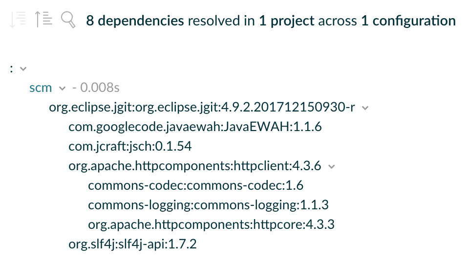

# 查看和调试依赖项

内容

  * [构建扫描](#构建扫描)
  * [列出项目中的依赖项](#列出项目中的依赖项)
  * [识别选择了哪个依赖版本以及为什么](#识别选择了哪个依赖版本以及为什么)
  * [解决版本冲突](#解决版本冲突)
  * [解决变量选择错误](#解决变量选择错误)
  * [解决不安全的配置解析错误](#解决不安全的配置解析错误)

Gradle提供了足够的工具来导航较大的依赖图并缓解可能导致[依赖地狱的情况](https://en.wikipedia.org/wiki/Dependency_hell)。用户可以选择呈现完整的依赖关系图，还可以确定依赖的选择原因和来源。依赖性的来源可以是构建脚本中已声明的依赖性，也可以是图形中的传递性依赖性及其相应的配置。Gradle通过构建扫描的可视化表示和命令行工具提供了两种功能。

## [构建扫描](#构建扫描)

╔═════════════════════════════  

如果您不知道什么是[构建扫描](https://scans.gradle.com/)，请确保将其签出！  
  
╚═════════════════════════════    
  
构建扫描可以将依赖项可视化为可导航的可搜索树。通过单击图形中的特定依赖项，可以呈现其他上下文信息。

图1.构建扫描中的依赖树

## [列出项目中的依赖项](#列出项目中的依赖项)

Gradle可以可视化项目中每个可用[配置](/md/声明依赖.md#什么是依赖项配置)的整个依赖树。

如果您想确定在运行时已解决了哪些依赖关系，则呈现依赖关系树特别有用。它还为您提供有关该过程中发生的任何依赖项冲突解决方案的信息，并清楚地指示所选版本。依赖性报告始终包含已声明和可传递的依赖性。

╔═════════════════════════════  

该`dependencies`任务将仅在 _单个_
项目上执行。如果您在根项目上运行任务，它将显示根项目而不是任何子项目的依赖项。确保在运行时始终以[正确的项目](/md/命令行界面.md#在多项目构建中执行任务)为目标`dependencies`。  
  
╚═════════════════════════════    
  
假设您要为使用[JGit库](https://www.eclipse.org/jgit/)执行SCM操作（例如，为发布过程建模）的项目创建任务。您可以在[自定义配置](/md/声明依赖.md#什么是依赖项配置)的帮助下声明任何外部工具的依赖关系，这样它就不会污染其他上下文，例如生产源代码的编译类路径。

每个Gradle项目都提供从命令行`dependencies`渲染所谓的 _依赖项报告_
的任务。默认情况下，相关性报告会呈现所有配置的相关性。要专注于有关一种配置的信息，请提供可选参数`--configuration`。

例如，要显示Java项目中测试运行时类路径上的依赖关系，请运行：

    
    
    gradle -q依赖项-配置testRuntimeClasspath

╔═════════════════════════════  
要查看该`java`插件添加的所有预定义配置的列表，请参阅[Java插件的文档](https://docs.gradle.org/6.7.1/userguide/java_plugin.html#sec:java_plugin_and_dependency_management)。  
╚═════════════════════════════    
  
示例1.使用自定义配置声明JGit依赖项

`Groovy``Kotlin`

build.gradle

    
    
    repositories {
        jcenter()
    }
    
    configurations {
        scm
    }
    
    dependencies {
        scm 'org.eclipse.jgit:org.eclipse.jgit:4.9.2.201712150930-r'
    }

build.gradle.kts

    
    
    repositories {
        jcenter()
    }
    
    configurations {
        create("scm")
    }
    
    dependencies {
        "scm"("org.eclipse.jgit:org.eclipse.jgit:4.9.2.201712150930-r")
    }

### [示例：呈现自定义配置的依赖性报告](#示例：呈现自定义配置的依赖性报告)

输出 **``**

    
    
    > gradle -q dependencies --configuration scm
    
    ------------------------------------------------------------
    Root project
    ------------------------------------------------------------
    
    scm
    \--- org.eclipse.jgit:org.eclipse.jgit:4.9.2.201712150930-r
         +--- com.jcraft:jsch:0.1.54
         +--- com.googlecode.javaewah:JavaEWAH:1.1.6
         +--- org.apache.httpcomponents:httpclient:4.3.6
         |    +--- org.apache.httpcomponents:httpcore:4.3.3
         |    +--- commons-logging:commons-logging:1.1.3
         |    \--- commons-codec:commons-codec:1.6
         \--- org.slf4j:slf4j-api:1.7.2
    
    A web-based, searchable dependency report is available by adding the --scan option.

依赖性报告提供了有关图形中可用依赖性的详细信息。任何无法解决的依赖项都`FAILED`以红色标记。图表中可能多次出现的具有相同坐标的依赖项被省略，并用星号表示。必须进行冲突解决的依赖项会以右箭头字符分隔请求和选定的版本。

## [识别选择了哪个依赖版本以及为什么](#识别选择了哪个依赖版本以及为什么)

大型软件项目不可避免地会通过直接或传递依赖关系来处理越来越多的依赖关系。该[依赖性报告](#列出项目中的依赖项)为您提供具有相关性的原始名单，但并没有解释
_为什么_ 它们已经被选择或者 _其_ 依赖性负责拉他们到图形。

让我们看一个具体的例子。一个项目可以请求相同依赖项的两个不同版本，无论是直接依赖项还是传递依赖项。Gradle应用[版本冲突解决方案](/md/了解依赖性解析.md#解决版本冲突)来确保依赖关系图中仅存在一个版本的依赖关系。在此示例中，冲突的依赖关系由表示`commons-codec:commons-codec`。

例子2.声明JGit依赖和冲突的依赖

`Groovy``Kotlin`

build.gradle

    
    
    repositories {
        jcenter()
    }
    
    configurations {
        scm
    }
    
    dependencies {
        scm 'org.eclipse.jgit:org.eclipse.jgit:4.9.2.201712150930-r'
        scm 'commons-codec:commons-codec:1.7'
    }

build.gradle.kts

    
    
    repositories {
        jcenter()
    }
    
    configurations {
        create("scm")
    }
    
    dependencies {
        "scm"("org.eclipse.jgit:org.eclipse.jgit:4.9.2.201712150930-r")
        "scm"("commons-codec:commons-codec:1.7")
    }

如果单击依赖项并选择“ Required
By”选项卡，则[构建扫描中](https://scans.gradle.com/)的依赖项树将呈现选择原因（冲突解决）以及依赖项的来源。

图2.构建扫描中的依赖关系洞察能力

每个Gradle项目都提供了从命令行`dependencyInsight`呈现所谓的 _依赖关系洞察报告_
的任务。给定依赖关系图中的一个依赖关系，您可以识别选择原因并跟踪依赖关系选择的来源。您可以将依赖关系洞察报告视为给定依赖关系的依赖关系报告的逆表示。

该任务采用以下参数：

`--dependency <dependency>` （必填）

    

指示要关注的依赖项。它可以是完整的`group:name`或一部分。如果多个依赖项匹配，它们都将打印在报告中。

`--configuration <name>` （必填）

    

指示要解决的用于显示依赖性信息的配置。请注意，[Java插件将](https://docs.gradle.org/6.7.1/userguide/java_plugin.html)一个约定与value关联起来`compileClasspath`，使该参数成为可选参数。

`--singlepath` （可选的）

    

指示仅呈现到依赖项的单个路径。这对于缩小大图中的输出可能很有用。

╔═════════════════════════════  

该`dependencyInsight`任务将仅在 _单个_
项目上执行。如果您在根项目上运行任务，它将显示根项目而不是任何子项目的依赖项信息。确保在运行时始终以[正确的项目](/md/命令行界面.md#在多项目构建中执行任务)为目标`dependencyInsight`。  
  
╚═════════════════════════════    
  
### [示例：对给定依赖项使用依赖关系洞察报告](#示例：对给定依赖项使用依赖关系洞察报告)

输出 **`gradle -q dependencyInsight --dependency commons-codec --configuration
scm`**

    
    
    > gradle -q dependencyInsight --dependency commons-codec --configuration scm
    commons-codec:commons-codec:1.7
       variant "default" [
          org.gradle.status = release (not requested)
       ]
       Selection reasons:
          - By conflict resolution : between versions 1.7 and 1.6
    
    commons-codec:commons-codec:1.7
    \--- scm
    
    commons-codec:commons-codec:1.6 -> 1.7
    \--- org.apache.httpcomponents:httpclient:4.3.6
         \--- org.eclipse.jgit:org.eclipse.jgit:4.9.2.201712150930-r
              \--- scm
    
    A web-based, searchable dependency report is available by adding the --scan option.

如上所述，`--configuration`在不是Java项目的项目中省略该参数将导致错误：

    
    
    > Dependency insight report cannot be generated because the input configuration was not specified.
      It can be specified from the command line, e.g: ':dependencyInsight --configuration someConf --dependency someDep'

有关配置的更多信息，请参阅有关声明依赖项的文档，该文档描述了[什么是依赖项配置](/md/声明依赖.md#什么是依赖项配置)。

### [了解选择原因](#了解选择原因)

依赖关系洞察报告的“选择原因”部分将列出有关为什么选择依赖关系的不同原因。请查看下表，以了解所用不同术语的含义：

表1.选择原因术语 

原因 | 含义  
---|---    
（缺席）|这意味着除了引用（直接或传递）外，没有其他原因  
要求：<文本>|依存关系出现在图形中，包含项带有[`because`文本](/md/声明依赖.md#记录依赖性)。  
要求：与版本<versions>不匹配|该依赖关系将显示在图形中，并带有[动态版本](/md/处理随时间变化的版本.md#声明动态版本)，其中不包括列出的版本。这之后也可以是`because`文本。  
要求：拒绝版本<versions>|依赖关系显示在图中，其中包含一个或多个[丰富版本](/md/声明丰富版本.md)`reject`。这之后也可以是`because`文本。  
通过冲突解决：版本之间<version>|依赖关系在图中出现了多次，具有不同的版本请求。这样可以[解决冲突，](/md/了解依赖性解析.md#解决版本冲突)从而选择最合适的版本。  
受约束|一个[依赖约束](/md/升级传递依赖的版本.md#在传递依赖项上添加约束)参加了版本选择。这之后也可以是`because`文本。  
由祖先|图中有一个带有的[丰富版本](/md/声明丰富版本.md)，`strictly`用于强制执行此依赖项的版本。  
按规则选择|一个[依赖解决规则](/md/直接自定义依赖项的解析.md)推翻默认选择过程。这之后也可以是`because`文本。  
拒绝：根据规则，<版本>，因为<文本>|一个`ComponentSelection.reject`[拒绝给定版本](https://docs.gradle.org/6.7.1/dsl/org.gradle.api.artifacts.ComponentSelection.html#org.gradle.api.artifacts.ComponentSelection:reject\(java.lang.String\))的依赖  
拒绝：版本<版本>：<属性信息>|依赖项具有动态版本，某些版本与[请求的属性](/md/使用变体属性.md#sec:variant-aware-matching)不匹配。  
被迫|该构建会[强制执行](/md/降级版本并排除依赖项.md#强制依赖与严格依赖)依赖项的版本。  
 
请注意，如果图形中存在多个选择原因，则将全部列出。

## [解决版本冲突](#解决版本冲突)

如果所选版本与您的期望不符，则Gradle提供了一系列工具来帮助您[控制传递依赖](/md/升级传递依赖的版本.md)。

## [解决变量选择错误](#解决变量选择错误)

有时会在[变体选择级别上](/md/使用变体属性.md)发生选择错误。请查看[专用部分](/md/使用变体属性.md#sec:variant-select-errors)以了解这些错误以及如何解决它们。

## [解决不安全的配置解析错误](#解决不安全的配置解析错误)

跨项目边界时，必须安全地解决配置问题，因为解决配置问题会对Gradle的项目模型产生副作用。Gradle可以管理此安全访问，但是需要以使Gradle能够进行访问的方式来访问配置。有多种方法可以不安全地解决配置，并且Gradle会针对每个不安全的访问产生弃用警告。

例如：

  * 一个项目中的任务直接解决另一个项目中的配置。

  * 任务将另一个项目中的配置指定为输入文件集合。

  * 一个项目的构建脚本在评估期间解析另一个项目中的配置。

如果您的构建具有不安全的访问弃用警告，则需要对其进行修复。这是这些不良做法的征兆，可能会导致奇怪且不确定的错误。

在大多数情况下，可以通过在另一个项目上创建跨项目的依赖关系来解决此问题。有关更多信息，请参见用于[在项目之间共享输出](/md/在项目之间共享输出.md#cross_project_publications)的文档。如果您发现使用这些技术无法解决的用例，请通过提交遵循我们的发行准则的[GitHub发行](https://github.com/gradle/gradle/issues)让我们知道。

