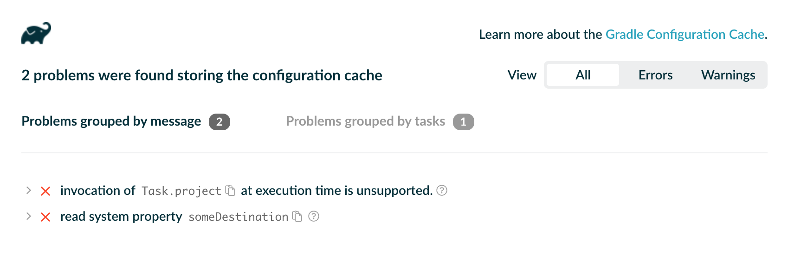

[ Gradle ](https://docs.gradle.org "Gradle Docs")

User Manual

  * Community Open Community Menu

[ Community Home ](https://gradle.org/)

[ Community Forums ](https://discuss.gradle.org/)

[ Community Plugins ](https://plugins.gradle.org)

  * [Training](https://gradle.com/training/)
  * News Open Community Menu

[ Newsletter ](https://newsletter.gradle.com)

[ Blog ](https://blog.gradle.org)

[ Twitter ](https://twitter.com/gradle)

  * [Enterprise](https://gradle.com)
  * [github](https://github.com/gradle/gradle "Gradle on GitHub")

  * [Docs Home](../userguide/userguide.html)
  * [Samples](../samples/index.html)
  * [Release Notes](../release-notes.html)
  * Gradle DSLs and API
    * [Javadoc](../javadoc/index.html?overview-summary.html)
    * [Groovy DSL Reference](../dsl/index.html)
    * [Groovy DSL Primer](../userguide/groovy_build_script_primer.html)
    * [Kotlin DSL API](https://gradle.github.io/kotlin-dsl-docs/api/)
    * [Kotlin DSL Primer](../userguide/kotlin_dsl.html)
    * [Groovy to Kotlin DSL Migration](../userguide/migrating_from_groovy_to_kotlin_dsl.html)

### User Manual

[ PDF ](../userguide/userguide.pdf)

  * [What is Gradle?](../userguide/what_is_gradle.html)
  * [Getting Started](../userguide/getting_started.html)
  * [Installing Gradle](../userguide/installation.html)
  * Upgrading Gradle...
    * [version 6.X to latest](../userguide/upgrading_version_6.html)
    * [version 5.X to 6.0](../userguide/upgrading_version_5.html)
    * [version 4.X to 5.0](../userguide/upgrading_version_4.html)
    * [Gradle's Feature Lifecycle](../userguide/feature_lifecycle.html)
  * Migrating to Gradle...
    * [from Maven](../userguide/migrating_from_maven.html)
    * [from Ant](../userguide/migrating_from_ant.html)
  * [Compatibility Notes](../userguide/compatibility.html)
  * [Troubleshooting Builds](../userguide/troubleshooting.html)

### Running Gradle Builds

  * Customizing Execution
    * [Configuring the Build Environment](../userguide/build_environment.html)
    * [Configuring the Gradle Daemon](../userguide/gradle_daemon.html)
    * [Using Initialization Scripts](../userguide/init_scripts.html)
  * [Executing Multi-Project Builds](../userguide/intro_multi_project_builds.html)
  * [Inspecting Gradle Builds](https://scans.gradle.com/)
  * Using the Build Cache
    * [Enabling and Configuring](../userguide/build_cache.html)
    * [Why use the Build Cache?](../userguide/build_cache_use_cases.html)
    * [Understanding the Impact](../userguide/build_cache_performance.html)
    * [Learning Basic Concepts](../userguide/build_cache_concepts.html)
    * [Caching Java Project](../userguide/caching_java_projects.html)
    * [Caching Android Project](../userguide/caching_android_projects.html)
    * [Debugging Caching Issues](../userguide/build_cache_debugging.html)
    * [Troubleshooting](../userguide/common_caching_problems.html)
  * Optimizing Build Times
    * [Improving Performance of Gradle Builds](../userguide/performance.html)
    * [Using the Configuration Cache](../userguide/configuration_cache.html)

### Authoring Gradle Builds

  * Learning the Basics
    * [Writing Build Scripts](../userguide/tutorial_using_tasks.html)
    * [Working with Tasks](../userguide/more_about_tasks.html)
    * [Learning More About Build Scripts](../userguide/writing_build_scripts.html)
    * [Working with Files](../userguide/working_with_files.html)
    * [Using Gradle Plugins](../userguide/plugins.html)
    * [Understanding the Build Lifecycle](../userguide/build_lifecycle.html)
    * [Working with Logging](../userguide/logging.html)
    * [Avoiding Traps](../userguide/potential_traps.html)
  * Structuring Individual Builds
    * [Creating a Basic Multi-Project Build](../userguide/multi_project_builds.html)
    * [Declaring Dependencies between Subprojects](../userguide/declaring_dependencies_between_subprojects.html)
    * [Sharing Build Logic between Subprojects](../userguide/sharing_build_logic_between_subprojects.html)
    * [Fine Tuning the Project Layout](../userguide/fine_tuning_project_layout.html)
    * [Understanding Configuration and Execution](../userguide/multi_project_configuration_and_execution.html)
  * Structuring Software Products
    * [Structuring large Projects](../userguide/structuring_software_products.html)
    * [Tweaking Project Structure](../userguide/structuring_software_products_details.html)
    * [Composing Builds](../userguide/composite_builds.html)
  * Authoring Sustainable Builds
    * [Organizing Build Logic](../userguide/organizing_gradle_projects.html)
    * [Following Best Practices](../userguide/authoring_maintainable_build_scripts.html)
  * Advanced Techniques
    * [Testing a Build with TestKit](../userguide/test_kit.html)
    * [Using Ant from Gradle](../userguide/ant.html)

### Authoring JVM Builds

  * [Building Java & JVM projects](../userguide/building_java_projects.html)
  * [Testing Java & JVM projects](../userguide/java_testing.html)
  * [Toolchains for Java projects](../userguide/toolchains.html)
  * [Managing Dependencies](../userguide/dependency_management_for_java_projects.html)
  * JVM Plugins
    * [Java Library Plugin](../userguide/java_library_plugin.html)
    * [Java Application Plugin](../userguide/application_plugin.html)
    * [Java Platform Plugin](../userguide/java_platform_plugin.html)
    * [Groovy Plugin](../userguide/groovy_plugin.html)
    * [Scala Plugin](../userguide/scala_plugin.html)

### Authoring C++/Swift Builds

  * [Building C++ projects](../userguide/building_cpp_projects.html)
  * [Testing C++ projects](../userguide/cpp_testing.html)
  * [Building Swift projects](../userguide/building_swift_projects.html)
  * [Testing Swift projects](../userguide/swift_testing.html)

### Working with Dependencies

  * Learning the Basics
    * [What is Dependency Management?](../userguide/core_dependency_management.html)
    * [Declaring Repositories](../userguide/declaring_repositories.html)
    * [Declaring Dependencies](../userguide/declaring_dependencies.html)
    * [Understanding Library and Application Differences](../userguide/library_vs_application.html)
    * [Viewing and Debugging Dependencies](../userguide/viewing_debugging_dependencies.html)
    * [Understanding Resolution](../userguide/dependency_resolution.html)
    * [Verifying dependencies](../userguide/dependency_verification.html)
  * Declaring Versions
    * [Declaring Versions and Ranges](../userguide/single_versions.html)
    * [Declaring Rich Versions](../userguide/rich_versions.html)
    * [Handling Changing Versions](../userguide/dynamic_versions.html)
    * [Locking Versions](../userguide/dependency_locking.html)
  * Controlling Transitives
    * [Upgrading Versions](../userguide/dependency_constraints.html)
    * [Downgrading and Excluding](../userguide/dependency_downgrade_and_exclude.html)
    * [Sharing Versions](../userguide/platforms.html)
    * [Aligning Dependencies](../userguide/dependency_version_alignment.html)
    * [Handling Mutually Exclusive Dependencies](../userguide/dependency_capability_conflict.html)
    * [Fixing Metadata](../userguide/component_metadata_rules.html)
    * [Customizing Resolution](../userguide/resolution_rules.html)
    * [Preventing accidental upgrades](../userguide/resolution_strategy_tuning.html)
  * Producing and Consuming Variants of Libraries
    * [Declaring Capabilities of a Library](../userguide/component_capabilities.html)
    * [Modeling Feature Variants and Optional Dependencies](../userguide/feature_variants.html)
    * [Understanding Variant Selection](../userguide/variant_model.html)
    * [Declaring Variant Attributes](../userguide/variant_attributes.html)
    * [Sharing Outputs of Projects](../userguide/cross_project_publications.html)
    * [Transforming Artifacts](../userguide/artifact_transforms.html)
  * Publishing Libraries
    * [Setting up Publishing](../userguide/publishing_setup.html)
    * [Understanding Gradle Module Metadata](../userguide/publishing_gradle_module_metadata.html)
    * [Signing Artifacts](../userguide/publishing_signing.html)
    * [Customizing Publishing](../userguide/publishing_customization.html)
    * [Maven Publish Plugin](../userguide/publishing_maven.html)
    * [Ivy Publish Plugin](../userguide/publishing_ivy.html)
  * [Terminology](../userguide/dependency_management_terminology.html)

### Extending Gradle

  * Developing Gradle Plugins
    * [Starting Plugin Development](../userguide/custom_plugins.html)
    * [Designing Plugins](../userguide/designing_gradle_plugins.html)
    * [Implementing Plugins](../userguide/implementing_gradle_plugins.html)
    * [Testing Plugins](../userguide/testing_gradle_plugins.html)
    * [Publishing Plugins](../userguide/publishing_gradle_plugins.html)
  * Developing Gradle Tasks
    * [Writing Gradle Task Types](../userguide/custom_tasks.html)
    * [Configuring Tasks Lazily](../userguide/lazy_configuration.html)
    * [Avoiding Unnecessary Task Configuration](../userguide/task_configuration_avoidance.html)
    * [Developing Parallel Tasks](../userguide/worker_api.html)
  * [Writing Custom Gradle Types](../userguide/custom_gradle_types.html)

### Reference

  * [Core Plugins](../userguide/plugin_reference.html)
  * [Command-Line Interface](../userguide/command_line_interface.html)
  * Gradle & Third-party Tools
    * [Third-party Tools](../userguide/third_party_integration.html)
    * [Jenkins](../userguide/jenkins.html)
    * [TeamCity](../userguide/teamcity.html)
    * [Travis CI](../userguide/travis-ci.html)
  * 
  * [The Gradle Wrapper](../userguide/gradle_wrapper.html)
  * [Gradle-managed Directories](../userguide/directory_layout.html)

# Configuration cache

version 6.9-20201126230040+0000

Contents

  * Introduction
  * Using the configuration cache
  * IDE support
  * Supported plugins
  * Troubleshooting
  * Adoption steps
  * Testing your build logic
  * Requirements
  * Not yet implemented

__ |

The configuration cache is an
[incubating](feature_lifecycle.html#feature_lifecycle) feature, and the
details described here may change.  
  
---|---  
  
## Introduction

The configuration cache is a feature that significantly improves build
performance by caching the result of the [configuration
phase](build_lifecycle.html#build_lifecycle) and reusing this for subsequent
builds. Using the configuration cache, Gradle can skip the configuration phase
entirely when nothing that affects the build configuration, such as build
scripts, has changed. Gradle also applies some performance improvements to
task execution as well.

The configuration cache is conceptually similar to the [build
cache](build_cache.html#build_cache), but caches different information. The
build cache takes care of caching the outputs and intermediate files of the
build, such as task outputs or artifact transform outputs. The configuration
cache takes care of caching the build configuration for a particular set of
tasks. In other words, the configuration cache saves the output of the
configuration phase, and the build cache saves the outputs of the execution
phase.

__ |

This feature is currently **_highly experimental_** and not enabled by
default.

Not all core Gradle plugins are supported. Your build and the plugins you
depend on might require changes to fulfil the requirements. Some Gradle
features are not yet implemented. Importing and syncing Gradle builds in IDEs
is not improved by configuration caching yet.  
  
---|---  
  
### How does it work?

When the configuration cache is enabled and you run Gradle for a particular
set of tasks, for example by running `gradlew check`, Gradle checks whether a
configuration cache entry is available for the requested set of tasks. If
available, Gradle uses this entry instead of running the configuration phase.
The cache entry contains information about the set of tasks to run, along with
their configuration and dependency information.

The first time you run a particular set of tasks, there will be no entry in
the configuration cache for these tasks and so Gradle will run the
configuration phase as normal:

  1. Run init scripts.

  2. Run the settings script for the build, applying any requested settings plugins.

  3. Configure and build the `buildSrc` project, if present.

  4. Run the builds scripts for the build, applying any requested project plugins.

  5. Calculate the task graph for the requested tasks, running any deferred configuration actions.

Following the configuration phase, Gradle writes the state of the task graph
to the configuration cache, taking a snapshot for later Gradle invocations.
The execution phase then runs as normal. This means you will not see any build
performance improvement the first time you run a particular set of tasks.

When you subsequently run Gradle with this same set of tasks, for example by
running `gradlew check` again, Gradle will load the tasks and their
configuration directly from the configuration cache and skip the configuration
phase entirely. Before using a configuration cache entry, Gradle checks that
none of the "build configuration inputs", such as build scripts, for the entry
have changed. If a build configuration input has changed, Gradle will not use
the entry and will run the configuration phase again as above, saving the
result for later reuse.

Build configuration inputs include:

  * Init scripts, settings scripts, build scripts.

  * System properties, Gradle properties and configuration files used during the configuration phase, accessed using value suppliers such as providers for properties, environment variables etc…​

  * `buildSrc` build configuration inputs and source files.

### Performance improvements

Apart from skipping the configuration phase, the configuration cache provides
some additional performance improvements:

  * All tasks run in parallel by default.

  * Dependency resolution is cached.

### Configuration caching in action

## Using the configuration cache

It is recommended to get started with the simplest task invocation possible.
Running `help` with the configuration cache enabled is a good first step:

    
    
    ❯ gradle --configuration-cache help
    Calculating task graph as no configuration cache is available for tasks: help
    ...
    BUILD SUCCESSFUL in 4s
    1 actionable task: 1 executed
    Configuration cache entry stored.

Running this for the first time, the configuration phase is executed,
calculating the task graph.

Then, run the same command again. This will reuse the cached configuration:

    
    
    ❯ gradle --configuration-cache help
    Reusing configuration cache.
    ...
    BUILD SUCCESSFUL in 500ms
    1 actionable task: 1 executed
    Configuration cache entry reused.

If it succeeds on your build, congratulations, you can now try with more
useful tasks. You should target your development loop. A good example is
running tests after making incremental changes.

If any problem is found caching or reusing the configuration, an HTML report
is generated to help you diagnose and fix the issues. See the Troubleshooting
section below for more information.

Keep reading to learn how to tweak the configuration cache, manually
invalidate the state if something goes wrong and use the configuration cache
from an IDE.

### Enabling the configuration cache

By default, the configuration cache is not enabled. It can be enabled from the
command line:

    
    
    ❯ gradle --configuration-cache

It can also be enabled persistently in a `gradle.properties` file:

    
    
    org.gradle.unsafe.configuration-cache=true

If it is enabled in a `gradle.properties` file, it can be disabled on the
command line for one build invocation:

    
    
    ❯ gradle --no-configuration-cache

### Ignoring problems

By default, Gradle will fail the build if any configuration cache problems are
encountered. When gradually improving your plugin or build logic to support
the configuration cache it can be useful to temporarily turn problems into
warnings.

This can be done from the command line:

    
    
    ❯ gradle --configuration-cache-problems=warn

or in a `gradle.properties` file:

    
    
    org.gradle.unsafe.configuration-cache-problems=warn

### Allowing a maximum number of problems

When configuration cache problems are turned into warnings, Gradle will fail
the build if `512` problems are found by default.

This can be adjusted by specifying an allowed maximum number of problems on
the command line:

    
    
    ❯ gradle -Dorg.gradle.unsafe.configuration-cache.max-problems=5

or in a `gradle.properties` file:

    
    
    org.gradle.unsafe.configuration-cache.max-problems=5

### Invalidating the cache

The configuration cache is automatically invalidated when inputs to the
configuration phase change. However, certain inputs are not tracked yet, so
you may have to manually invalidate the configuration cache when untracked
inputs to the configuration phase change. This can happen if you ignored
problems. See the Requirements and Not yet implemented sections below for more
information.

The configuration cache state is stored on disk in a directory named
`.gradle/configuration-cache` in the root directory of the Gradle build in
use. If you need to invalidate the cache, simply delete that directory:

    
    
    ❯ rm -rf .gradle/configuration-cache

Configuration cache entries are checked periodically (at most every 24 hours)
for whether they are still in use. They are deleted if they haven't been used
for 7 days.

## IDE support

If you enable and configure the configuration cache from your
`gradle.properties` file, then the configuration cache will be enabled when
your IDE delegates to Gradle. There's nothing more to do.

`gradle.properties` is usually checked in source control. If you don't want to
enable the configuration cache for your whole team yet you can also enable the
configuration cache from your IDE only as explained below.

Note that syncing a build from an IDE doesn't benefit from the configuration
cache, only running tasks does.

### IntelliJ based IDEs

In IntelliJ IDEA or Android Studio this can be done in two ways, either
globally or per run configuration.

To enable it for the whole build, go to `Run > Edit configurations…​`. This
will open the IntelliJ IDEA or Android Studio dialog to configure Run/Debug
configurations. Select `Templates > Gradle` and add the necessary system
properties to the `VM options` field.

For example to enable the configuration cache, turning problems into warnings,
add the following:

    
    
    -Dorg.gradle.unsafe.configuration-cache=true -Dorg.gradle.unsafe.configuration-cache-problems=warn

You can also choose to only enable it for a given run configuration. In this
case, leave the `Templates > Gradle` configuration untouched and edit each run
configuration as you see fit.

Combining these two ways you can enable globally and disable for certain run
configurations, or the opposite.

__ |

You can use the [gradle-idea-ext-plugin](https://github.com/JetBrains/gradle-
idea-ext-plugin) to configure IntelliJ run configurations from your build.
This is a good way to enable the configuration cache only for the IDE.  
  
---|---  
  
### Eclipse IDEs

In Eclipse IDEs you can enable and configure the configuration cache through
Buildship in two ways, either globally or per run configuration.

To enable it globally, go to `Preferences > Gradle`. You can use the
properties described above as system properties. For example to enable the
configuration cache, turning problems into warnings, add the following JVM
arguments:

  * `-Dorg.gradle.unsafe.configuration-cache=true`

  * `-Dorg.gradle.unsafe.configuration-cache-problems=warn`

To enable it for a given run configuration, go to `Run configurations…​`, find
the one you want to change, go to `Project Settings`, tick the `Override
project settings` checkbox and add the same system properties as a `JVM
argument`.

Combining these two ways you can enable globally and disable for certain run
configurations, or the opposite.

## Supported plugins

The configuration cache is brand new and introduces new requirements for
plugin implementations. As a result, both core Gradle plugins, and community
plugins need to be adjusted. This section provides information about the
current support in core Gradle plugins and community plugins.

### Core Gradle plugins

Not all [core Gradle plugins](plugin_reference.html#plugin_reference) support
configuration caching yet.

JVM languages and frameworks

|

Native languages

|

Packaging and distribution  
  
---|---|---  
  
|  [✓](https://github.com/gradle/gradle/issues/13455) |

[Java](java_plugin.html#java_plugin)  
  
---|---  
[✓](https://github.com/gradle/gradle/issues/13455) |

[Java Library](java_library_plugin.html#java_library_plugin)  
  
[✓](https://github.com/gradle/gradle/issues/13455) |

[Java Platform](java_platform_plugin.html#java_platform_plugin)  
  
[⚠](https://github.com/gradle/gradle/issues/13460) |

[Groovy](groovy_plugin.html#groovy_plugin)  
  
[✖](https://github.com/gradle/gradle/issues/13461) |

[Scala](scala_plugin.html#scala_plugin)  
  
[⚠](https://github.com/gradle/gradle/issues/13462) |

[ANTLR](antlr_plugin.html#antlr_plugin)  
  
|  [✖](https://github.com/gradle/gradle/issues/13484) |

[C++ Application](cpp_application_plugin.html#cpp_application_plugin)  
  
---|---  
[✖](https://github.com/gradle/gradle/issues/13485) |

[C++ Library](cpp_library_plugin.html#cpp_library_plugin)  
  
[✖](https://github.com/gradle/gradle/issues/13514) |

[C++ Unit Test](cpp_unit_test_plugin.html#cpp_unit_test_plugin)  
  
[✖](https://github.com/gradle/gradle/issues/13515) |

[Swift Application](swift_application_plugin.html#swift_application_plugin)  
  
[✖](https://github.com/gradle/gradle/issues/13487) |

[Swift Library](swift_library_plugin.html#swift_library_plugin)  
  
[✖](https://github.com/gradle/gradle/issues/13488) |

[XCTest](xctest_plugin.html#xctest_plugin)  
  
|  [✓](https://github.com/gradle/gradle/issues/13455) |

[Application](application_plugin.html#application_plugin)  
  
---|---  
[✓](https://github.com/gradle/gradle/issues/13455) |

[WAR](war_plugin.html#war_plugin)  
  
[✓](https://github.com/gradle/gradle/issues/13455) |

[EAR](ear_plugin.html#ear_plugin)  
  
[⚠](https://github.com/gradle/gradle/issues/13468) |

[Maven Publish](publishing_maven.html#publishing_maven)  
  
[✖](https://github.com/gradle/gradle/issues/13469) |

[Ivy Publish](publishing_ivy.html#publishing_ivy)  
  
🚫 |

[Legacy Maven Plugin](maven_plugin.html#maven_plugin)  
  
[✓](https://github.com/gradle/gradle/issues/13455) |

[Distribution](distribution_plugin.html#distribution_plugin)  
  
[✓](https://github.com/gradle/gradle/issues/13455) |

[Java Library
Distribution](java_library_distribution_plugin.html#java_library_distribution_plugin)  
  
Code analysis

|

IDE integration

|

Utility  
  
|  [✓](https://github.com/gradle/gradle/issues/13475) |

[Checkstyle](checkstyle_plugin.html#checkstyle_plugin)  
  
---|---  
[✓](https://github.com/gradle/gradle/issues/13476) |

[PMD](pmd_plugin.html#pmd_plugin)  
  
[✓](https://github.com/gradle/gradle/issues/13477) |

[JaCoCo](jacoco_plugin.html#jacoco_plugin)  
  
[✓](https://github.com/gradle/gradle/issues/13478) |

[CodeNarc](codenarc_plugin.html#codenarc_plugin)  
  
|  [✖](https://github.com/gradle/gradle/issues/13479) |

[Eclipse](eclipse_plugin.html#eclipse_plugin)  
  
---|---  
[✖](https://github.com/gradle/gradle/issues/13480) |

[IntelliJ IDEA](idea_plugin.html#idea_plugin)  
  
[✖](https://github.com/gradle/gradle/issues/13482) |

[Visual Studio](visual_studio_plugin.html#visual_studio_plugin)  
  
[✖](https://github.com/gradle/gradle/issues/13483) |

[Xcode](xcode_plugin.html#xcode_plugin)  
  
|  [✓](https://github.com/gradle/gradle/issues/13455) |

[Base](base_plugin.html#base_plugin)  
  
---|---  
[⚠](https://github.com/gradle/gradle/issues/13466) |

[Build Init](build_init_plugin.html#build_init_plugin)  
  
[✖](https://github.com/gradle/gradle/issues/13470) |

[Signing](signing_plugin.html#signing_plugin)  
  
[✓](https://github.com/gradle/gradle/issues/13455) |

[Java Plugin Development](java_gradle_plugin.html#java_gradle_plugin)  
  
[✖](https://github.com/gradle/gradle/issues/13472) |

[Groovy DSL Plugin Development](custom_plugins.html#sec:precompiled_plugins)  
  
[✖](https://github.com/gradle/gradle/issues/13472) |

[Kotlin DSL Plugin Development](kotlin_dsl.html#sec:kotlin-dsl_plugin)  
  
[✖](https://github.com/gradle/gradle/issues/13473) |

[Project Report Plugin](project_report_plugin.html#project_report_plugin)  
  
✓ |

Supported plugin  
  
---|---  
⚠ |

Partially supported plugin  
  
✖ |

Unsupported plugin  
  
🚫 |

Won't fix  
  
### Community plugins

Please refer to issue
[gradle/gradle#13490](https://github.com/gradle/gradle/issues/13490) to learn
about the status of community plugins.

## Troubleshooting

The following sections will go through some general guidelines on dealing with
problems with the configuration cache. This applies to both your build logic
and to your Gradle plugins.

Upon failure to serialize the state required to run the tasks, an HTML report
of detected problems is generated. The Gradle failure output includes a
clickable link to the report. This report is useful and allows you to drill
down into problems, understand what is causing them.

Let's look at a simple example build script that contains a couple problems:

build.gradle

    
    
    tasks.register('someTask') {
        def destination = System.getProperty('someDestination') __**(1)**
        inputs.dir('source')
        outputs.dir(destination)
        doLast {
            project.copy { __**(2)**
                from 'source'
                into destination
            }
        }
    }

build.gradle.kts

    
    
    tasks.register("someTask") {
        val destination = System.getProperty("someDestination") __**(1)**
        inputs.dir("source")
        outputs.dir(destination)
        doLast {
            project.copy { __**(2)**
                from("source")
                into(destination)
            }
        }
    }

__**1** | Undeclared system property read at configuration time  
---|---  
__**2** | Using the `Project` object at execution time  
  
Running that task fails and print the following in the console:

    
    
    ❯ gradle --configuration-cache someTask -DsomeDestination=dest
    ...
    * What went wrong:
    Configuration cache problems found in this build.
    
    2 problems were found storing the configuration cache.
    - Build file 'build.gradle': read system property 'someDestination'
      See https://docs.gradle.org/0.0.0/userguide/configuration_cache.html#config_cache:requirements:undeclared_sys_prop_read
    - Build file 'build.gradle': invocation of 'Task.project' at execution time is unsupported.
      See https://docs.gradle.org/0.0.0/userguide/configuration_cache.html#config_cache:requirements:use_project_during_execution
    
    See the complete report at file:///home/user/gradle/samples/build/reports/configuration-cache/<hash>/configuration-cache-report.html
    > Read system property 'someDestination'
    > Invocation of 'Task.project' by task ':someTask' at execution time is unsupported.
    
    * Try:
    Run with --stacktrace option to get the stack trace. Run with --info or --debug option to get more log output. Run with --scan to get full insights.
    
    * Get more help at https://help.gradle.org
    
    BUILD FAILED in 0s
    1 actionable task: 1 executed
    Configuration cache entry discarded with 2 problems.

The configuration cache entry was discarded because of the found problems
failing the build.

Details can be found in the linked HTML report:

The report displays the set of problems twice. First grouped by problem
message, then grouped by task. The former allows you to quickly see what
classes of problems your build is facing. The latter allows you to quickly see
which tasks are problematic. In both cases you can expand the tree in order to
discover where the culprit is in the object graph.

__ |

Problems displayed in the report have links to the corresponding requirement
where you can find guidance on how to fix the problem or to the corresponding
not yet implemented feature.

When changing your build or plugin to fix the problems you should consider
testing your build logic with TestKit.  
  
---|---  
  
At this stage, you can decide to either turn the problems into warnings and
continue exploring how your build reacts to the configuration cache, or fix
the problems at hand.

Let's ignore the reported problems, and run the same build again twice to see
what happens when reusing the cached problematic configuration:

    
    
    ❯ gradle --configuration-cache --configuration-cache-problems=warn someTask -DsomeDestination=dest
    Calculating task graph as no configuration cache is available for tasks: someTask
    > Task :someTask
    
    2 problems were found storing the configuration cache.
    - Build file 'build.gradle': read system property 'someDestination'
      See https://docs.gradle.org/0.0.0/userguide/configuration_cache.html#config_cache:requirements:undeclared_sys_prop_read
    - Build file 'build.gradle': invocation of 'Task.project' at execution time is unsupported.
      See https://docs.gradle.org/0.0.0/userguide/configuration_cache.html#config_cache:requirements:use_project_during_execution
    
    See the complete report at file:///home/user/gradle/samples/build/reports/configuration-cache/<hash>/configuration-cache-report.html
    
    BUILD SUCCESSFUL in 0s
    1 actionable task: 1 executed
    Configuration cache entry stored with 2 problems.
    ❯ gradle --configuration-cache --configuration-cache-problems=warn someTask -DsomeDestination=dest
    Reusing configuration cache.
    > Task :someTask
    
    1 problem was found reusing the configuration cache.
    - Build file 'build.gradle': invocation of 'Task.project' at execution time is unsupported.
      See https://docs.gradle.org/0.0.0/userguide/configuration_cache.html#config_cache:requirements:use_project_during_execution
    
    See the complete report at file:///home/user/gradle/samples/build/reports/configuration-cache/<hash>/configuration-cache-report.html
    
    BUILD SUCCESSFUL in 0s
    1 actionable task: 1 executed
    Configuration cache entry reused with 1 problem.

The two builds succeed reporting the observed problems, storing then reusing
the configuration cache. The first problem, that happens at configuration time
when storing, is not reported on the second run, reusing the configuration
cache. The configuration phase was skipped. The second problem about using
`Project` at execution time is reported in both when storing and reusing. Both
builds did execute the task.

With the help of the links present in the console problem summary and in the
HTML report we can fix our problems. Here's some fixed version of the build
script:

build.gradle

    
    
    abstract class MyCopyTask extends DefaultTask { __**(1)**
    
        @InputDirectory abstract DirectoryProperty getSource() __**(2)**
    
        @OutputDirectory abstract DirectoryProperty getDestination() __**(2)**
    
        @Inject abstract FileSystemOperations getFs() __**(3)**
    
        @TaskAction
        void action() {
            fs.copy { __**(3)**
                from source
                into destination
            }
        }
    }
    
    tasks.register('someTask', MyCopyTask) {
        def projectDir = layout.projectDirectory
        source = projectDir.dir('source')
        destination = projectDir.dir(
            providers.systemProperty('someDestination').forUseAtConfigurationTime().get() __**(4)**
        )
    }

build.gradle.kts

    
    
    abstract class MyCopyTask : DefaultTask() { __**(1)**
    
        @get:InputDirectory abstract val source: DirectoryProperty __**(2)**
    
        @get:OutputDirectory abstract val destination: DirectoryProperty __**(2)**
    
        @get:Inject abstract val fs: FileSystemOperations __**(3)**
    
        @TaskAction
        fun action() {
            fs.copy { __**(3)**
                from(source)
                into(destination)
            }
        }
    }
    
    tasks.register<MyCopyTask>("someTask") {
        val projectDir = layout.projectDirectory
        source.set(projectDir.dir("source"))
        destination.set(projectDir.dir(
            providers.systemProperty("someDestination").forUseAtConfigurationTime().get() __**(4)**
        ))
    }

__**1** | We turned our ad-hoc task into a proper task class,  
---|---  
__**2** | with inputs and outputs declaration,  
__**3** | and injected with the `FileSystemOperations` service, a supported
replacement for `project.copy {}`.  
__**4** | Finally, we declared the system property used at configuration time
as a build configuration input, and wire it to our task input.  
  
Running the task twice now succeeds without reporting any problem and reusing
the configuration cache on the second run:

    
    
    ❯ gradle --configuration-cache someTask -DsomeDestination=dest
    Calculating task graph as no configuration cache is available for tasks: someTask
    > Task :someTask
    
    BUILD SUCCESSFUL in 0s
    1 actionable task: 1 executed
    Configuration cache entry stored.
    ❯ gradle --configuration-cache someTask -DsomeDestination=dest
    Reusing configuration cache.
    > Task :someTask
    
    BUILD SUCCESSFUL in 0s
    1 actionable task: 1 executed
    Configuration cache entry reused.

But, what if we change the value of the system property?

    
    
    ❯ gradle --configuration-cache someTask -DsomeDestination=another
    Calculating task graph as configuration cache cannot be reused because system property 'someDestination' has changed.
    > Task :someTask
    
    BUILD SUCCESSFUL in 0s
    1 actionable task: 1 executed
    Configuration cache entry stored.

The previous configuration cache entry could not be reused, and the task graph
had to be calculated and stored again. This is because we read the system
property at configuration time, hence requiring Gradle to run the
configuration phase again when the value of that property changes. Fixing that
is as simple as wiring the system property directly, without reading it at
configuration time.

build.gradle

    
    
    tasks.register('someTask', MyCopyTask) {
        def projectDir = layout.projectDirectory
        source = projectDir.dir('source')
        destination = projectDir.dir(providers.systemProperty('someDestination')) __**(1)**
    }

build.gradle.kts

    
    
    tasks.register<MyCopyTask>("someTask") {
        val projectDir = layout.projectDirectory
        source.set(projectDir.dir("source"))
        destination.set(projectDir.dir(providers.systemProperty("someDestination"))) __**(1)**
    }

__**1** | We wired the declared system property directly, without reading it
at configuration time.  
---|---  
  
With this simple change in place we can run the task any number of time,
change the system property value, and reuse the configuration cache:

    
    
    ❯ gradle --configuration-cache someTask -DsomeDestination=dest
    Calculating task graph as no configuration cache is available for tasks: someTask
    > Task :someTask
    
    BUILD SUCCESSFUL in 0s
    1 actionable task: 1 executed
    Configuration cache entry stored.
    ❯ gradle --configuration-cache someTask -DsomeDestination=another
    Reusing configuration cache.
    > Task :someTask
    
    BUILD SUCCESSFUL in 0s
    1 actionable task: 1 executed
    Configuration cache entry reused.

We're now done with fixing the problems with this simple task.

Keep reading to learn how to adopt the configuration cache for your build or
your plugins.

## Adoption steps

An important prerequisite is to keep your Gradle and plugins versions up to
date. The following explores the recommended steps for a successful adoption.
It applies both to builds and plugins. While going through these steps, keep
in mind the HTML report and the solutions explained in the requirements
chapter below.

Start with `:help`

    

Always start by trying your build or plugin with the simplest task `:help`.
This will exercise the minimal configuration phase of your build or plugin.

Progressively target useful tasks

    

Don't go with running `build` right away. You can also use `--dry-run` to
discover more configuration time problems first.

When working on a build, progressively target your development feedback loop.
For example, running tests after making some changes to the source code.

When working on a plugin, progressively target the contributed or configured
tasks.

Explore by turning problems into warnings

    

Don't stop at the first build failure and turn problems into warnings to
discover how your build and plugins behave. If a build fails, use the HTML
report to reason about the reported problems related to the failure. Continue
running more useful tasks.

This will give you a good overview of the nature of the problems your build
and plugins are facing. Remember that when turning problems into warnings you
might need to manually invalidate the cache in case of troubles.

Step back and fix problems iteratively

    

When you feel you know enough about what needs to be fixed, take a step back
and start iteratively fixing the most important problems. Use the HTML report
and this documentation to help you in this journey.

Start with problems reported when _storing_ the configuration cache. Once
fixed, you can rely on a valid cached configuration phase and move on to
fixing problems reported when _loading_ the configuration cache if any.

Report encountered issues

    

If you face a problem with a Gradle feature or with a Gradle core plugin that
is not covered by this documentation, please report an issue on
[`gradle/gradle`](https://github.com/gradle/gradle/issues/new/choose).

If you face a problem with a community Gradle plugin, see if it is already
listed at [gradle/gradle#13490](https://github.com/gradle/gradle/issues/13490)
and consider reporting the issue to the plugin's issue tracker.

A good way to report such issues is by providing information such as:

  * a link to this very documentation,

  * the plugin version you tried,

  * the custom configuration of the plugin if any, or ideally a reproducer build,

  * a description of what fails, for example problems with a given task

  * a copy of the build failure,

  * the self-contained `configuration-cache-report.html` file.

Test, test, test

    

Consider adding tests for your build logic. See the below section on testing
your build logic for the configuration cache. This will help you while
iterating on the required changes and prevent future regressions.

Roll it out to your team

    

Once you have your developer workflow working, for example running tests from
the IDE, you can consider enabling it for your team. A faster turnaround when
changing code and running tests could be worth it. You'll probably want to do
this as an opt-in first.

If needed, turn problems into warnings and set the maximum number of allowed
problems in your build `gradle.properties` file. Keep the configuration cache
disabled by default. Let your team know they can opt-in by, for example,
enabling the configuration cache on their IDE run configurations for the
supported workflow.

Later on, when more workflows are working, you can flip this around. Enable
the configuration cache by default, configure CI to disable it, and if
required communicate the unsupported workflow(s) for which the configuration
cache needs to be disabled.

## Testing your build logic

The Gradle TestKit (a.k.a. just TestKit) is a library that aids in testing
Gradle plugins and build logic generally. For general guidance on how to use
TestKit, see the [dedicated chapter](test_kit.html#test_kit).

To enable configuration caching in your tests, you can pass the
`--configuration-cache` argument to
[GradleRunner](../javadoc/org/gradle/testkit/runner/GradleRunner.html) or use
one of the other methods described in Enabling the configuration cache.

You need to run your tasks twice. Once to prime the configuration cache. Once
to reuse the configuration cache.

Example 1. Testing the configuration cache

src/test/groovy/org/example/BuildLogicFunctionalTest.groovy

    
    
        def "my task can be loaded from the configuration cache"() {
            given:
            buildFile << """
                plugins {
                    id 'org.example.my-plugin'
                }
            """
    
            when:
            runner()
                .withArguments('--configuration-cache', 'myTask')    __**(1)**
                .build()
    
            and:
            def result = runner()
                .withArguments('--configuration-cache', 'myTask')    __**(2)**
                .build()
    
            then:
            result.output.contains('Reusing configuration cache.')      __**(3)**
            // ... more assertions on your task behavior
        }

src/test/kotlin/org/example/BuildLogicFunctionalTest.kt

    
    
        @Test
        fun `my task can be loaded from the configuration cache`() {
    
            buildFile.writeText("""
                plugins {
                    id 'org.example.my-plugin'
                }
            """)
    
            runner()
                .withArguments("--configuration-cache", "myTask")        __**(1)**
                .build()
    
            val result = runner()
                .withArguments("--configuration-cache", "myTask")        __**(2)**
                .build()
    
            require(result.output.contains("Reusing configuration cache.")) __**(3)**
            // ... more assertions on your task behavior
        }

__**1** | First run primes the configuration cache.  
---|---  
__**2** | Second run reuses the configuration cache.  
__**3** | Assert that the configuration cache gets reused.  
  
If problems with the configuration cache are found then Gradle will fail the
build reporting the problems, and the test will fail.

__ |

A good testing strategy for a Gradle plugin is to run its whole test suite
with the configuration cache enabled. This requires testing the plugin with a
supported Gradle version.

If the plugin already supports a range of Gradle versions it might already
have tests for multiple Gradle versions. In that case we recommend enabling
the configuration cache starting with the Gradle version that supports it.

If this can’t be done right away, using tests that runs all tasks contributed
by the plugin several times, for e.g. asserting the `UP_TO_DATE` and
`FROM_CACHE` behavior, is also a good strategy.  
  
---|---  
  
## Requirements

In order to capture the state of the task graph to the configuration cache and
reload it again in a later build, Gradle applies certain requirements to tasks
and other build logic. Each of these requirements is treated as a
configuration cache "problem" and fails the build if violations are present.

For the most part these requirements are actually surfacing some undeclared
inputs. In other words, using the configuration cache is an opt-in to more
strictness, correctness and reliability for all builds.

The following sections describe each of the requirements and how to change
your build to fix the problems.

### Certain types must not be referenced by tasks

There are a number of types that task instances must not reference from their
fields. The same applies to task actions as closures such as `doFirst {}` or
`doLast {}`.

These types fall into some categories as follows:

  * Live JVM state types

  * Gradle model types

  * Dependency management types

In all cases the reason these types are disallowed is that their state cannot
easily be stored or recreated by the configuration cache.

Live JVM state types (e.g. `ClassLoader`, `Thread`, `OutputStream`, `Socket`
etc…​) are simply disallowed. These types almost never represent a task input
or output.

Gradle model types (e.g. `Gradle`, `Settings`, `Project`, `SourceSet`,
`Configuration` etc…​) are usually used to carry some task input that should
be explicitly and precisely declared instead.

For example, if you reference a `Project` in order to get the
`project.version` at execution time, you should instead directly declare the
_project version_ as an input to your task using a `Property<String>`. Another
example would be to reference a `SourceSet` to later get the source files, the
compilation classpath or the outputs of the source set. You should instead
declare these as a `FileCollection` input and reference just that.

The same requirement applies to dependency management types with some nuances.

Some types, such as `Configuration`, don't make good task input parameters, as
they hold a lot of irrelevant state, and it is better to model these inputs as
something more precise. We don't intend to make these types serializable at
all. For example, if you reference a `Configuration` to later get the resolved
files, you should instead declare a `FileCollection` as an input to your task.

Referencing dependency resolution results is also disallowed (e.g.
`ArtifactResolutionQuery`, `ResolvedArtifact`, `ArtifactResult` etc…​). For
example, if you reference some `ResolvedArtifactResult` instances, you should
instead declare some `ArtifactCollection` as an input to your task. The rule
of thumb is that tasks must not reference _resolved_ results, but lazy
specifications instead, in order to do the dependency resolution at execution
time. Some APIs are missing and cannot yet be used as task inputs, for example
it is currently not possible for task actions to reason about the dependency
_graph_ , see
[gradle/gradle#12871](https://github.com/gradle/gradle/issues/12871).

Some types, such as `Publication` or `Dependency` are not serializable, but
could be. We may, if necessary, allow these to be used as task inputs
directly.

Here's an example of a problematic task type referencing a `SourceSet`:

build.gradle

    
    
    abstract class SomeTask extends DefaultTask {
    
        @Input SourceSet sourceSet __**(1)**
    
        @TaskAction
        void action() {
            def classpathFiles = sourceSet.compileClasspath.files
            // ...
        }
    }

build.gradle.kts

    
    
    abstract class SomeTask : DefaultTask() {
    
        @get:Input lateinit var sourceSet: SourceSet __**(1)**
    
        @TaskAction
        fun action() {
            val classpathFiles = sourceSet.compileClasspath.files
            // ...
        }
    }

__**1** | this will be reported as a problem because referencing `SourceSet`
is not allowed  
---|---  
  
The following is how it should be done instead:

build.gradle

    
    
    abstract class SomeTask extends DefaultTask {
    
        @InputFiles @Classpath
        abstract ConfigurableFileCollection getClasspath() __**(1)**
    
        @TaskAction
        void action() {
            def classpathFiles = classpath.files
            // ...
        }
    }

build.gradle.kts

    
    
    abstract class SomeTask : DefaultTask() {
    
        @get:InputFiles @get:Classpath
        abstract val classpath: ConfigurableFileCollection __**(1)**
    
        @TaskAction
        fun action() {
            val classpathFiles = classpath.files
            // ...
        }
    }

__**1** | no more problems reported, we now reference the supported type
`FileCollection`  
---|---  
  
In the same vein, if you encounter the same problem with an ad-hoc task
declared in a script as follows:

build.gradle

    
    
    tasks.register('someTask') {
        doLast {
            def classpathFiles = sourceSets.main.compileClasspath.files __**(1)**
        }
    }

build.gradle.kts

    
    
    tasks.register("someTask") {
        doLast {
            val classpathFiles = sourceSets.main.get().compileClasspath.files __**(1)**
        }
    }

__**1** | this will be reported as a problem because the `doLast {}` closure
is capturing a reference to the `SourceSet`  
---|---  
  
You still need to fulfil the same requirement, that is not referencing a
disallowed type. Here's how the task declaration above can be fixed:

build.gradle

    
    
    tasks.register('someTask') {
        def classpath = sourceSets.main.compileClasspath __**(1)**
        doLast {
            def classpathFiles = classpath.files
        }
    }

build.gradle.kts

    
    
    tasks.register("someTask") {
        val classpath = sourceSets.main.get().compileClasspath __**(1)**
        doLast {
            val classpathFiles = classpath.files
        }
    }

__**1** | no more problems reported, the `doLast {}` closure now only captures
`classpath` which is of the supported `FileCollection` type  
---|---  
  
Note that sometimes the disallowed type is indirectly referenced. For example,
you could have a task reference some type from a plugin that is allowed. That
type could reference another allowed type that in turn references a disallowed
type. The hierarchical view of the object graph provided in the HTML reports
for problems should help you pinpoint the offender.

### Using the `Project` object

A task must not use any `Project` objects at execution time. This includes
calling `Task.getProject()` while the task is running.

Some cases can be fixed in the same way as for disallowed types.

Often, similar things are available on both `Project` and `Task`. For example
if you need a `Logger` in your task actions you should use `Task.logger`
instead of `Project.logger`.

Otherwise, you can use [injected
services](custom_gradle_types.html#service_injection) instead of the methods
of `Project`.

Here's an example of a problematic task type using the `Project` object at
execution time:

build.gradle

    
    
    abstract class SomeTask extends DefaultTask {
        @TaskAction
        void action() {
            project.copy { __**(1)**
                from 'source'
                into 'destination'
            }
        }
    }

build.gradle.kts

    
    
    abstract class SomeTask : DefaultTask() {
        @TaskAction
        fun action() {
            project.copy { __**(1)**
                from("source")
                into("destination")
            }
        }
    }

__**1** | this will be reported as a problem because the task action is using
the `Project` object at execution time  
---|---  
  
The following is how it should be done instead:

build.gradle

    
    
    abstract class SomeTask extends DefaultTask {
    
        @Inject abstract FileSystemOperations getFs() __**(1)**
    
        @TaskAction
        void action() {
            fs.copy {
                from 'source'
                into 'destination'
            }
        }
    }

build.gradle.kts

    
    
    abstract class SomeTask : DefaultTask() {
    
        @get:Inject abstract val fs: FileSystemOperations __**(1)**
    
        @TaskAction
        fun action() {
            fs.copy {
                from("source")
                into("destination")
            }
        }
    }

__**1** | no more problem reported, the injected `FileSystemOperations`
service is supported as a replacement for `project.copy {}`  
---|---  
  
In the same vein, if you encounter the same problem with an ad-hoc task
declared in a script as follows:

build.gradle

    
    
    tasks.register('someTask') {
        doLast {
            project.copy { __**(1)**
                from 'source'
                into 'destination'
            }
        }
    }

build.gradle.kts

    
    
    tasks.register("someTask") {
        doLast {
            project.copy { __**(1)**
                from("source")
                into("destination")
            }
        }
    }

__**1** | this will be reported as a problem because the task action is using
the `Project` object at execution time  
---|---  
  
Here's how the task declaration above can be fixed:

build.gradle

    
    
    interface Injected {
        @Inject FileSystemOperations getFs() __**(1)**
    }
    tasks.register('someTask') {
        def injected = project.objects.newInstance(Injected) __**(2)**
        doLast {
            injected.fs.copy { __**(3)**
                from 'source'
                into 'destination'
            }
        }
    }

build.gradle.kts

    
    
    interface Injected {
        @get:Inject val fs: FileSystemOperations __**(1)**
    }
    tasks.register("someTask") {
        val injected = project.objects.newInstance<Injected>() __**(2)**
        doLast {
            injected.fs.copy { __**(3)**
                from("source")
                into("destination")
            }
        }
    }

__**1** | services can't be injected directly in scripts, we need an extra
type to convey the injection point  
---|---  
__**2** | create an instance of the extra type using `project.object` outside
the task action  
__**3** | no more problem reported, the task action references `injected` that
provides the `FileSystemOperations` service, supported as a replacement for
`project.copy {}`  
  
As you can see above, fixing ad-hoc tasks declared in scripts requires quite a
bit of ceremony. It is a good time to think about extracting your task
declaration as a proper task class as shown previously.

The following table shows what APIs or injected service should be used as a
replacement for each of the `Project` methods.

Instead of: | Use:  
---|---  
  
`project.rootDir`

|

A task input or output property or a script variable to capture the result of
using `project.rootDir` to calculate the actual parameter.  
  
`project.projectDir`

|

A task input or output property or a script variable to capture the result of
using `project.projectDir` to calculate the actual parameter.  
  
`project.buildDir`

|

A task input or output property or a script variable to capture the result of
using `project.buildDir` to calculate the actual parameter.  
  
`project.name`

|

A task input or output property or a script variable to capture the result of
using `project.name` to calculate the actual parameter.  
  
`project.description`

|

A task input or output property or a script variable to capture the result of
using `project.description` to calculate the actual parameter.  
  
`project.group`

|

A task input or output property or a script variable to capture the result of
using `project.group` to calculate the actual parameter.  
  
`project.version`

|

A task input or output property or a script variable to capture the result of
using `project.version` to calculate the actual parameter.  
  
`project.properties`, `project.property(name)`, `project.hasProperty(name)`,
`project.getProperty(name)` or `project.findProperty(name)`

|

Value providers for Gradle properties  
  
`project.logger`

|

[Task.logger](../javadoc/org/gradle/api/Task.html#getLogger--)  
  
`project.provider {}`

|

[ProviderFactory.provider
{}](../javadoc/org/gradle/api/provider/ProviderFactory.html#provider-
java.util.concurrent.Callable-)  
  
`project.file(path)`

|

A task input or output property or a script variable to capture the result of
using `project.file(file)` to calculate the actual parameter.  
  
`project.uri(path)`

|

A task input or output property or a script variable to capture the result of
using `project.uri(path)` to calculate the actual parameter. Otherwise,
`File.toURI()` or some other JVM API can be used.  
  
`project.relativePath(path)`

|

[ProjectLayout.projectDirectory](../javadoc/org/gradle/api/file/ProjectLayout.html#getProjectDirectory--).[file(path)](../javadoc/org/gradle/api/file/Directory.html#file-
java.lang.String-)  
  
`project.files(paths)`

|

[ObjectFactory.fileCollection()](../javadoc/org/gradle/api/model/ObjectFactory.html#fileCollection--).[from(paths)](../javadoc/org/gradle/api/file/ConfigurableFileCollection.html#from-
java.lang.Object…​-)  
  
`project.fileTree(paths)`

|

[ObjectFactory.fileTree()](../javadoc/org/gradle/api/model/ObjectFactory.html#fileTree--).[from(dir)](../javadoc/org/gradle/api/file/ConfigurableFileTree.html#from-
java.lang.Object-)  
  
`project.zipTree(path)`

|

[ArchiveOperations.zipTree(path)](../javadoc/org/gradle/api/file/ArchiveOperations.html#zipTree-
java.lang.Object-)  
  
`project.tarTree(path)`

|

[ArchiveOperations.tarTree(path)](../javadoc/org/gradle/api/file/ArchiveOperations.html#tarTree-
java.lang.Object-)  
  
`project.resources`

|

A task input or output property or a script variable to capture the result of
using `project.resource` to calculate the actual parameter.  
  
`project.copySpec {}`

|

A task input or output property or a script variable to capture the result of
using `project.copySpec {}` to calculate the actual parameter.  
  
`project.copy {}`

|

[FileSystemOperations.copy
{}](../javadoc/org/gradle/api/file/FileSystemOperations.html#copy-
org.gradle.api.Action-)  
  
`project.sync {}`

|

[FileSystemOperations.sync
{}](../javadoc/org/gradle/api/file/FileSystemOperations.html#sync-
org.gradle.api.Action-)  
  
`project.delete {}`

|

[FileSystemOperations.delete
{}](../javadoc/org/gradle/api/file/FileSystemOperations.html#delete-
org.gradle.api.Action-)  
  
`project.mkdir(path)`

|

The Kotlin, Groovy or Java API available to your build logic.  
  
`project.exec {}`

|

[ExecOperations.exec
{}](../javadoc/org/gradle/process/ExecOperations.html#exec-
org.gradle.api.Action-)  
  
`project.javaexec {}`

|

[ExecOperations.javaexec
{}](../javadoc/org/gradle/process/ExecOperations.html#javaexec-
org.gradle.api.Action-)  
  
`project.ant {}`

|

[Task.ant](../javadoc/org/gradle/api/Task.html#getAnt--)  
  
`project.createAntBuilder()`

|

[Task.ant](../javadoc/org/gradle/api/Task.html#getAnt--)  
  
### Accessing a task instance from another instance

Tasks should not directly access the state of another task instance. Instead,
tasks should be connected using [inputs and outputs
relationships](lazy_configuration.html#working_with_task_dependencies_in_lazy_properties).

Note that this requirement makes it unsupported to write tasks that configure
other tasks at execution time.

### Using build listeners

Plugins and build scripts must not register any build listeners. That is
listeners registered at configuration time that get notified at execution
time. For example a `BuildListener` or a `TaskExecutionListener`.

These should be replaced by [build
services](build_services.html#build_services), registered to receive
information about [task execution](build_services.html#operation_listener) if
needed.

### Undeclared reading of Gradle properties

Plugins and build scripts should not read Gradle properties directly at
configuration time. Instead, these Gradle properties must be declared as a
potential build configuration input by using the value supplier APIs.

This problem is caused by build logic similar to this:

build.gradle

    
    
    def enabled = project.findProperty('some-property') != null

build.gradle.kts

    
    
    val enabled = project.findProperty("some-property") != null

To fix this problem, read Gradle properties using
[providers.gradleProperty()](../javadoc/org/gradle/api/provider/ProviderFactory.html#gradleProperty-
java.lang.String-) instead:

build.gradle

    
    
    def enabled = providers.gradleProperty('some-property').forUseAtConfigurationTime().present

build.gradle.kts

    
    
    val enabled = providers.gradleProperty("some-property").forUseAtConfigurationTime().isPresent

In general, you should avoid reading the value of Gradle properties at
configuration time, to avoid invalidating configuration cache entries when the
Gradle property value changes. Instead, you can connect the `Provider`
returned by
[providers.gradleProperty()](../javadoc/org/gradle/api/provider/ProviderFactory.html#gradleProperty-
java.lang.String-) to task properties.

### Undeclared reading of system properties

Plugins and build scripts should not read system properties directly using the
Java APIs at configuration time. Instead, these system properties must be
declared as a potential build configuration input by using the value supplier
APIs.

This problem is caused by build logic similar to this:

build.gradle

    
    
    def enabled = System.getProperty('some-property') != null

build.gradle.kts

    
    
    val enabled = System.getProperty("some-property") != null

To fix this problem, read system properties using
[providers.systemProperty()](../javadoc/org/gradle/api/provider/ProviderFactory.html#systemProperty-
java.lang.String-) instead:

build.gradle

    
    
    def enabled = providers.systemProperty('some-property').forUseAtConfigurationTime().present

build.gradle.kts

    
    
    val enabled = providers.systemProperty("some-property").forUseAtConfigurationTime().isPresent

In general, you should avoid reading the value of system properties at
configuration time, to avoid invalidating configuration cache entries when the
system property value changes. Instead, you can connect the `Provider`
returned by
[providers.systemProperty()](../javadoc/org/gradle/api/provider/ProviderFactory.html#systemProperty-
java.lang.String-) to task properties.

### Undeclared reading of environment variables

Plugins and build scripts should not read environment variables directly using
the Java APIs at configuration time. Instead, declare environment variables as
potential build configuration inputs using the value supplier APIs.

This problem is caused by build logic similar to this:

build.gradle

    
    
    def enabled = System.getenv('SOME_ENV_VAR') != null

build.gradle.kts

    
    
    val enabled = System.getenv("SOME_ENV_VAR") != null

To fix this problem, read environment variables using
[providers.environmentVariable()](../javadoc/org/gradle/api/provider/ProviderFactory.html#environmentVariable-
java.lang.String-) instead:

build.gradle

    
    
    def enabled = providers.environmentVariable('SOME_ENV_VAR').forUseAtConfigurationTime().present

build.gradle.kts

    
    
    val enabled = providers.environmentVariable("SOME_ENV_VAR").forUseAtConfigurationTime().isPresent

In general, you should avoid reading the value of environment variables at
configuration time, to avoid invalidating configuration cache entries when the
environment variable value changes. Instead, you can connect the `Provider`
returned by
[providers.environmentVariable()](../javadoc/org/gradle/api/provider/ProviderFactory.html#environmentVariable-
java.lang.String-) to task properties.

### Undeclared reading of files

Plugins and build scripts should not read files directly using the Java,
Groovy or Kotlin APIs at configuration time. Instead, declare files as
potential build configuration inputs using the value supplier APIs.

This problem is caused by build logic similar to this:

build.gradle

    
    
    def config = file('some.conf').text

build.gradle.kts

    
    
    val config = file("some.conf").readText()

To fix this problem, read files using
[providers.fileContents()](../javadoc/org/gradle/api/provider/ProviderFactory.html#fileContents-
org.gradle.api.file.RegularFile-) instead:

build.gradle

    
    
    def config = providers.fileContents(layout.projectDirectory.file('some.conf'))
        .asText.forUseAtConfigurationTime()

build.gradle.kts

    
    
    val config = providers.fileContents(layout.projectDirectory.file("some.conf"))
        .asText.forUseAtConfigurationTime()

In general, you should avoid reading files at configuration time, to avoid
invalidating configuration cache entries when the file content changes.
Instead, you can connect the `Provider` returned by
[providers.fileContents()](../javadoc/org/gradle/api/provider/ProviderFactory.html#fileContents-
org.gradle.api.file.RegularFile-) to task properties.

## Not yet implemented

Support for using configuration caching with certain Gradle features is not
yet implemented. Support for these features will be added in later Gradle
releases.

### Sharing the configuration cache

The configuration cache is currently stored locally only. It can be reused by
hot or cold local Gradle daemons. But it can't be shared between developers or
CI machines.

See [gradle/gradle#13510](https://github.com/gradle/gradle/issues/13510).

### Parallel task execution on cache misses

When there's no configuration cache available and the work graph needs to be
calculated, tasks are not executed in parallel by default. Only builds that
reuse the configuration cache currently execute all tasks in parallel by
default.

See [gradle/gradle#14624](https://github.com/gradle/gradle/issues/14624).

### Custom input normalization

Custom [input
normalization](more_about_tasks.html#sec:configure_input_normalization) is not
captured when using the configuration cache. If your build has configuration
for input normalization, i.e. `normalization { }`, it will be ignored, no
problem will be reported. Builds reusing the configuration cache might see
build cache misses but will stay reliable.

See [gradle/gradle#13706](https://github.com/gradle/gradle/issues/13706).

### Source dependencies

Support for [source dependencies](https://blog.gradle.org/introducing-source-
dependencies) is not yet implemented. With the configuration cache enabled, no
problem will be reported and the build will fail.

See [gradle/gradle#13506](https://github.com/gradle/gradle/issues/13506).

### Using a Java agent with builds run using TestKit

When running builds using [TestKit](test_kit.html#test_kit), the configuration
cache can interfere with Java agents, such as the Jacoco agent, that are
applied to these builds.

### Java Object Serialization

Gradle allows objects that support the [Java Object
Serialization](https://docs.oracle.com/javase/8/docs/platform/serialization/spec/serialTOC.html)
protocol to be stored in the configuration cache.

The implementation is currently limited to serializable classes that implement
the `java.io.Serializable` interface and define one of the following
combination of methods:

  * a `writeObject` method combined with a `readObject` method to control exactly which information to store;

  * a `writeObject` method with no corresponding `readObject`; `writeObject` must eventually call `ObjectOutputStream.defaultWriteObject`;

  * a `readObject` method with no corresponding `writeObject`; `readObject` must eventually call `ObjectInputStream.defaultReadObject`;

  * a `writeReplace` method to allow the class to nominate a replacement to be written;

  * a `readResolve` method to allow the class to nominate a replacement for the object just read;

The following _Java Object Serialization_ features are **not** supported:

  * serializable classes implementing the `java.io.Externalizable` interface; objects of such classes are discarded by the configuration cache during serialization and reported as problems;

  * the `serialPersistentFields` member to explicitly declare which fields are serializable; the member, if present, is ignored; the configuration cache considers all but `transient` fields serializable;

  * the following methods of `ObjectOutputStream` are not supported and will throw `UnsupportedOperationException`:

    * `reset()`, `writeFields()`, `putFields()`, `writeChars(String)`, `writeBytes(String)` and `writeUnshared(Any?)`.

  * the following methods of `ObjectInputStream` are not supported and will throw `UnsupportedOperationException`:

    * `readLine()`, `readFully(ByteArray)`, `readFully(ByteArray, Int, Int)`, `readUnshared()`, `readFields()`, `transferTo(OutputStream)` and `readAllBytes()`.

  * validations registered via `ObjectInputStream.registerValidation` are simply ignored;

  * the `readObjectNoData` method, if present, is never invoked;

See [gradle/gradle#13588](https://github.com/gradle/gradle/issues/13588).

**Docs**

  * [User Manual](/userguide/userguide.html)
  * [DSL Reference](/dsl/)
  * [Release Notes](/release-notes.html)
  * [Javadoc](/javadoc/)

**News**

  * [Blog](https://blog.gradle.org/)
  * [Newsletter](https://newsletter.gradle.com/)
  * [Twitter](https://twitter.com/gradle)
  * [Status Page](https://status.gradle.com/)

**Products**

  * [Build Scans](https://gradle.com/build-scans/)
  * [Build Cache](https://gradle.com/build-cache/)
  * [Enterprise Docs](https://gradle.com/enterprise/resources/)

**Get Help**

  * [Forums](https://discuss.gradle.org/c/help-discuss)
  * [GitHub](https://github.com/gradle/)
  * [Training](https://gradle.com/training/)
  * [Services](https://gradle.org/services/)

##### Stay `UP-TO-DATE` on new features and news

By entering your email, you agree to our
[Terms](https://gradle.com/legal/terms-of-service/) and [Privacy
Policy](https://gradle.com/legal/privacy/), including receipt of emails. You
can unsubscribe at any time.

Subscribe

© [Gradle Inc.](https://gradle.com) 2020 All rights reserved.

[ gradle ](/)

[Careers](https://gradle.com/careers/) |
[Privacy](https://gradle.com/legal/privacy/) | [Terms of
Service](https://gradle.com/legal/terms-of-service/) |
[Contact](https://gradle.org/contact/)

