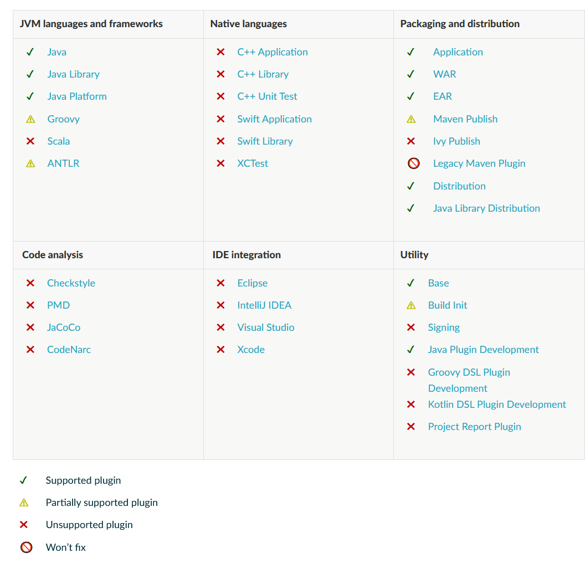

# 配置缓存

内容

  * [介绍](#config_cache:intro)
  * [使用配置缓存](#config_cache:usage)
  * [IDE支持](#config_cache:ide)
  * [支持的插件](#config_cache:plugins)
  * [故障排除](#config_cache:troubleshooting)
  * [领养步骤](#config_cache:adoption)
  * [测试您的构建逻辑](#config_cache:testing)
  * [要求](#config_cache:requirements)
  * [尚未实现](#config_cache:not_yet_implemented)

╔═════════════════════════════  

配置缓存是一个[孵化](/md/功能生命周期.md#feature_lifecycle)功能，此处描述的详细信息可能会更改。  
  
╚═════════════════════════════  
  
## [介绍](#config_cache:intro)

配置缓存是一项功能，可通过缓存[配置阶段](/md/构建生命周期.md#build_lifecycle)的结果并将其重新用于以后的构建，从而显着提高构建性能。使用配置缓存，Gradle可以在没有影响构建配置的任何内容（例如构建脚本）发生变化的情况下完全跳过配置阶段。Gradle还对任务执行应用了一些性能改进。

配置缓存在概念上与[构建缓存](/md/构建缓存.md#build_cache)类似，但是缓存不同的信息。构建缓存负责缓存构建的输出和中间文件，例如任务输出或工件转换输出。配置缓存负责为特定任务集缓存构建配置。换句话说，配置缓存缓存配置阶段的输出，而构建缓存缓存执行阶段的输出。

╔═════════════════════════════  

此功能目前处于 ** _高度试验阶段_** ，默认情况下未启用。

并非所有[核心Gradle插件](#config_cache:plugins:core)都受支持。您的内部版本和所依赖的插件可能需要更改才能满足[要求](#config_cache:requirements)。一些Gradle功能[尚未实现](#config_cache:not_yet_implemented)。尚未通过配置缓存改进在IDE中导入和同步Gradle构建。  
  
╚═════════════════════════════  
  
### [它是如何工作的？](#config_cache:intro:how_does_it_work)

启用配置缓存后，如果您针对特定的任务集运行Gradle（例如通过运行）`gradlew
check`，则Gradle会检查配置缓存条目是否可用于请求的任务集。如果可用，Gradle将使用该条目而不是运行配置阶段。缓存条目包含有关要运行的任务集的信息，以及它们的配置和相关性信息。

首次运行特定任务集时，配置高速缓存中将没有这些任务的条目，因此Gradle将照常运行配置阶段：

  1. 运行初始化脚本。

  2. 应用所有请求的设置插件，运行构建的设置脚本。

  3. 配置并构建`buildSrc`项目（如果存在）。

  4. 应用任何请求的项目插件，运行构建的构建脚本。

  5. 计算请求的任务的任务图，并运行所有延迟的配置操作。

在配置阶段之后，Gradle将任务图的状态写入配置缓存，并为以后的Gradle调用创建快照。然后执行阶段将正常运行。这意味着您第一次运行特定任务集时将看不到任何构建性能的提高。

当您随后使用相同的任务集（例如`gradlew
check`再次运行）运行Gradle时，Gradle将直接从配置缓存中加载任务及其配置，并完全跳过配置阶段。在使用配置缓存条目之前，Gradle会检查该条目的“构建配置输入”（例如构建脚本）是否都未更改。如果构建配置输入已更改，则Gradle将不使用该条目，并将如上所述再次运行配置阶段，保存结果供以后重用。

构建配置输入包括：

  * 初始化脚本，设置脚本，构建脚本。

  * 在配置阶段使用的系统属性，Gradle属性和配置文件，可通过值提供者（例如属性，环境变量的提供者）进行访问...

  * `buildSrc` 构建配置输入和源文件。

### [性能提升](#config_cache:intro:performance_improvements)

除了跳过配置阶段之外，配置缓存还提供了其他一些性能改进：

  * 默认情况下，所有任务并行运行。

  * 依赖关系解析被缓存。

### [进行配置缓存](#config_cache:in_action)

## [使用配置缓存](#config_cache:usage)

建议从最简单的任务调用入手。`help`在启用配置缓存的情况下运行是一个不错的第一步：

    
    
    ❯ gradle --configuration-cache help
    Calculating task graph as no configuration cache is available for tasks: help
    ...
    BUILD SUCCESSFUL in 4s
    1 actionable task: 1 executed
    Configuration cache entry stored.

首次运行此命令，将执行配置阶段，计算任务图。

然后，再次运行相同的命令。这将重用缓存的配置：

    
    
    ❯ gradle --configuration-cache help
    Reusing configuration cache.
    ...
    BUILD SUCCESSFUL in 500ms
    1 actionable task: 1 executed
    Configuration cache entry reused.

祝贺您，如果编译成功，您现在可以尝试执行更多有用的任务。您应该针对您的开发循环。一个很好的例子是在进行增量更改后运行测试。

如果在缓存或重用配置时发现任何问题，则会生成HTML报告来帮助您诊断和解决问题。有关更多信息，请参见下面的“[故障排除”](#config_cache:troubleshooting)部分。

继续阅读以了解如何调整配置缓存，在出现问题时手动使状态无效，并使用IDE中的配置缓存。

### [启用配置缓存](#config_cache:usage:enable)

默认情况下，未启用配置缓存。可以从命令行启用它：

    
    
    ❯ gradle --configuration-cache

也可以在`gradle.properties`文件中永久启用它：

    
    
    org.gradle.unsafe.configuration-cache=true

如果在`gradle.properties`文件中启用了此功能，则可以在命令行中禁用一次构建调用：

    
    
    ❯gradle --no-configuration-cache

### [忽略问题](#config_cache:usage:ignore_problems)

默认情况下，如果遇到任何配置缓存问题，Gradle将使构建失败。在逐步改进插件或构建逻辑以支持配置缓存时，将问题暂时变为警告会很有用。

可以从命令行完成：

    
    
    ❯gradle --configuration-cache-problems =warn

或在`gradle.properties`文件中：

    
    
    org.gradle.unsafe.configuration-cache-problems=warn

### [允许最大数量的问题](#config_cache:usage:max_problems)

当配置缓存问题变成警告时，如果`512`默认情况下发现问题，Gradle将使构建失败。

可以通过在命令行上指定允许的最大问题数来进行调整：

    
    
    ❯gradle -Dorg.gradle.unsafe.configuration-cache.max-problems = 5

或在`gradle.properties`文件中：

    
    
    org.gradle.unsafe.configuration-cache.max-problems=5

### [使缓存无效](#config_cache:usage:invalidate)

当配置阶段的输入发生更改时，配置缓存将自动失效。但是，某些输入尚未被跟踪，因此当未跟踪到配置阶段的输入发生更改时，您可能必须手动使配置缓存无效。如果您[忽略问题，](#config_cache:usage:ignore_problems)可能会发生这种情况。有关更多信息，请参见下面的“[需求](#config_cache:requirements)和[尚未实现”](#config_cache:not_yet_implemented)部分。

配置缓存状态存储在磁盘上`.gradle/configuration-
cache`使用的Gradle构建的根目录中命名的目录中。如果您需要使缓存无效，只需删除该目录：

    
    
    ❯rm -rf .gradle/configuration-cache

定期（最多每24小时）检查配置缓存项是否仍在使用中。如果7天未使用它们，则将其删除。

## [IDE支持](#config_cache:ide)

如果您从`gradle.properties`文件启用并配置配置缓存，那么当您的IDE委托给Gradle时，将启用配置缓存。没什么可做的了。

`gradle.properties`通常在源代码管理中检查。如果您不想为整个团队启用配置缓存，那么也可以仅从IDE中启用配置缓存，如下所述。

请注意，从IDE同步内部版本不会从配置缓存中受益，只有正在运行的任务会受益。

### [基于IntelliJ的IDE](#config_cache:ide:intellij)

在IntelliJ IDEA或Android Studio中，这可以通过两种方式来完成，无论是全局配置还是每次运行配置。

要在整个构建中启用它，请转到`Run > Edit configurations…​`。这将打开IntelliJ IDEA或Android
Studio对话框来配置运行/调试配置。选择`Templates > Gradle`并将必要的系统属性添加到该`VM options`字段。

例如，要启用配置缓存，将问题变成警告，请添加以下内容：

    
    
    -Dorg.gradle.unsafe.configuration-cache = true -Dorg.gradle.unsafe.configuration-cache-problems =warn

您也可以选择仅针对给定的运行配置启用它。在这种情况下，请保持`Templates > Gradle`配置不变，并根据需要编辑每个运行配置。

结合这两种方式，可以全局启用和禁用某些运行配置，或者相反。

╔═════════════════════════════  

您可以使用[gradle-idea-ext-plugin](https://github.com/JetBrains/gradle-idea-ext-
plugin)从构建中配置IntelliJ运行配置。这是仅为IDE启用配置缓存的好方法。  
  
╚═════════════════════════════  
  
### [Eclipse
IDE](#config_cache:ide:eclipse)

在Eclipse IDE中，您可以通过Buildship以两种方式启用和配置配置缓存，即全局配置或每次运行配置。

要全局启用它，请转到`Preferences >
Gradle`。您可以将上述属性用作系统属性。例如，要启用配置缓存，将问题转变为警告，请添加以下JVM参数：

  * `-Dorg.gradle.unsafe.configuration-cache=true`

  * `-Dorg.gradle.unsafe.configuration-cache-problems=warn`

要为给定的运行配置启用它，请转到`Run configurations…​`，找到要更改的配置，转到`Project
Settings`，勾选`Override project settings`复选框并添加与相同的系统属性`JVM argument`。

结合这两种方式，可以全局启用和禁用某些运行配置，或者相反。

## [支持的插件](#config_cache:plugins)

配置缓存是全新的，并引入了插件实现的新要求。结果，核心Gradle插件和社区插件都需要进行调整。本节提供有关[Gradle核心插件](#config_cache:plugins:core)和[社区插件](#config_cache:plugins:community)当前支持的信息。

### [Core
Gradle插件](#config_cache:plugins:core)
并非所有的[Gradle核心插件都](/md/插件参考.md#plugin_reference)支持配置缓存。

  
### [社区插件](#config_cache:plugins:community)

请参阅问题[gradle /
gradle＃13490](https://github.com/gradle/gradle/issues/13490)了解社区插件的状态。

## [故障排除](#config_cache:troubleshooting)

以下各节将介绍一些有关处理配置缓存问题的一般准则。这适用于您的构建逻辑和Gradle插件。

如果无法序列​​化运行任务所需的状态，则会生成检测到问题的HTML报告。Gradle故障输出包括指向该报告的可单击链接。此报告非常有用，可让您深入分析问题，了解导致问题的原因。

让我们看一个简单的示例构建脚本，其中包含几个问题：

`Groovy``Kotlin`

build.gradle

    
    
    tasks.register('someTask') {
        def destination = System.getProperty('someDestination') __**( 1)**
        inputs.dir('source')
        outputs.dir(destination)
        doLast {
            project.copy { __**( 2)**
                from 'source'
                into destination
            }
        }
    }

build.gradle.kts

    
    
    tasks.register("someTask") {
        val destination = System.getProperty("someDestination") __**( 1)**
        inputs.dir("source")
        outputs.dir(destination)
        doLast {
            project.copy { __**( 2)**
                from("source")
                into(destination)
            }
        }
    }

① [在配置时读取未声明的系统属性](#config_cache:requirements:undeclared_sys_prop_read)  

② [`Project`在执行时使用对象](#config_cache:requirements:use_project_during_execution)  
  
运行该任务失败，并在控制台中打印以下内容：

    
    
      ❯ gradle --configuration-cache someTask -DsomeDestination=dest
      ...
      * What went wrong:
      Configuration cache problems found in this build.
      
      2 problems were found storing the configuration cache.
      - Build file 'build.gradle': read system property 'someDestination'
        See https://docs.gradle.org/0.0.0/userguide/configuration_cache.html#config_cache:requirements:undeclared_sys_prop_read
      - Build file 'build.gradle': invocation of 'Task.project' at execution time is unsupported.
        See https://docs.gradle.org/0.0.0/userguide/configuration_cache.html#config_cache:requirements:use_project_during_execution
      
      See the complete report at file:///home/user/gradle/samples/build/reports/configuration-cache/<hash>/configuration-cache-report.html
      > Read system property 'someDestination'
      > Invocation of 'Task.project' by task ':someTask' at execution time is unsupported.
      
      * Try:
      Run with --stacktrace option to get the stack trace. Run with --info or --debug option to get more log output. Run with --scan to get full insights.
      
      * Get more help at https://help.gradle.org
      
      BUILD FAILED in 0s
      1 actionable task: 1 executed
      Configuration cache entry discarded with 2 problems.

由于发现问题构建失败，配置缓存条目被丢弃。

可以在链接的HTML报告中找到详细信息：

该报告两次显示问题集。首先按问题消息分组，然后按任务分组。前者使您可以快速查看构建所面临的问题类别。后者使您可以快速查看哪些任务有问题。在这两种情况下，您都可以展开树以发现罪魁祸首在对象图中的位置。

╔═════════════════════════════  

报告中显示的问题具有指向相应[要求的](#config_cache:requirements)链接，您可以在其中找到有关解决问题的指南或[尚未实现](#config_cache:not_yet_implemented)的相应功能。

在更改构建或插件以解决问题时，应考虑[使用TestKit测试构建逻辑](#config_cache:testing)。  
  
╚═════════════════════════════  
  
在此阶段，您可以决定[将问题变成警告，](#config_cache:usage:ignore_problems)然后继续探索构建对配置缓存的反应，或者解决当前的问题。

让我们忽略报告的问题，然后再次运行相同的构建两次，以查看重用缓存的有问题的配置时会发生什么：

    
    ❯ gradle --configuration-cache --configuration-cache-problems=warn someTask -DsomeDestination=dest
    Calculating task graph as no configuration cache is available for tasks: someTask
    > Task :someTask
    
    2 problems were found storing the configuration cache.
    - Build file 'build.gradle': read system property 'someDestination'
      See https://docs.gradle.org/0.0.0/userguide/configuration_cache.html#config_cache:requirements:undeclared_sys_prop_read
    - Build file 'build.gradle': invocation of 'Task.project' at execution time is unsupported.
      See https://docs.gradle.org/0.0.0/userguide/configuration_cache.html#config_cache:requirements:use_project_during_execution
    
    See the complete report at file:///home/user/gradle/samples/build/reports/configuration-cache/<hash>/configuration-cache-report.html
    
    BUILD SUCCESSFUL in 0s
    1 actionable task: 1 executed
    Configuration cache entry stored with 2 problems.
    ❯ gradle --configuration-cache --configuration-cache-problems=warn someTask -DsomeDestination=dest
    Reusing configuration cache.
    > Task :someTask
    
    1 problem was found reusing the configuration cache.
    - Build file 'build.gradle': invocation of 'Task.project' at execution time is unsupported.
      See https://docs.gradle.org/0.0.0/userguide/configuration_cache.html#config_cache:requirements:use_project_during_execution
    
    See the complete report at file:///home/user/gradle/samples/build/reports/configuration-cache/<hash>/configuration-cache-report.html
    
    BUILD SUCCESSFUL in 0s
    1 actionable task: 1 executed
    Configuration cache entry reused with 1 problem.
这两个版本成功报告了观察到的问题，进行了存储，然后重新使用了配置缓存。第一个问题在存储时在配置时发生，在第二次运行时未报告，重新使用了配置缓存。配置阶段被跳过。`Project`在存储和重用时都报告了在执行时使用的第二个问题。两个版本都执行了任务。

借助控制台问题摘要和HTML报告中提供的链接，我们可以解决问题。这是构建脚本的一些固定版本：

`Groovy``Kotlin`

build.gradle

    
    
    import javax.inject.Inject
    
    abstract class MyCopyTask extends DefaultTask { __**( 1)**
    
        @InputDirectory abstract DirectoryProperty getSource() __**( 2)**
    
        @OutputDirectory abstract DirectoryProperty getDestination() __**( 2)**
    
        @Inject abstract FileSystemOperations getFs() __**( 3)**
    
        @TaskAction
        void action() {
            fs.copy { __**( 3)**
                from source
                into destination
            }
        }
    }
    
    tasks.register('someTask', MyCopyTask) {
        def projectDir = layout.projectDirectory
        source = projectDir.dir('source')
        destination = projectDir.dir(
            providers.systemProperty('someDestination').forUseAtConfigurationTime().get() __**( 4)**
        )
    }

build.gradle.kts

    
    
    import javax.inject.Inject
    
    abstract class MyCopyTask : DefaultTask() { __**( 1)**
    
        @get:InputDirectory abstract val source: DirectoryProperty __**( 2)**
    
        @get:OutputDirectory abstract val destination: DirectoryProperty __**( 2)**
    
        @get:Inject abstract val fs: FileSystemOperations __**( 3)**
    
        @TaskAction
        fun action() {
            fs.copy { __**( 3)**
                from(source)
                into(destination)
            }
        }
    }
    
    tasks.register<MyCopyTask>("someTask") {
        val projectDir = layout.projectDirectory
        source.set(projectDir.dir("source"))
        destination.set(projectDir.dir(
            providers.systemProperty("someDestination").forUseAtConfigurationTime().get() __**( 4)**
        ))
    }
╔═════════════════════════════  

①  我们将临时任务变成了适当的任务类，  
②  带有输入和输出声明，  
③  并在`FileSystemOperations`服务中注入了的受支持替代[`project.copy{}`](#config_cache:requirements:use_project_during_execution)。  
④  最后，我们将[在配置时使用](#config_cache:requirements:undeclared_sys_prop_read)的[系统属性](#config_cache:requirements:undeclared_sys_prop_read)声明为构建配置输入，并将其连接到我们的任务输入。  
  
╚═════════════════════════════  
现在，两次运行任务成功了，没有报告任何问题，并且在第二次运行时重新使用了配置缓存：

    
    ❯ gradle --configuration-cache someTask -DsomeDestination=dest
    Calculating task graph as no configuration cache is available for tasks: someTask
    > Task :someTask
    
    BUILD SUCCESSFUL in 0s
    1 actionable task: 1 executed
    Configuration cache entry stored.
    ❯ gradle --configuration-cache someTask -DsomeDestination=dest
    Reusing configuration cache.
    > Task :someTask
    
    BUILD SUCCESSFUL in 0s
    1 actionable task: 1 executed
    Configuration cache entry reused.
但是，如果我们更改系统属性的值怎么办？

    
    ❯ gradle --configuration-cache someTask -DsomeDestination=another
    Calculating task graph as configuration cache cannot be reused because system property 'someDestination' has changed.
    > Task :someTask
    
    BUILD SUCCESSFUL in 0s
    1 actionable task: 1 executed
    Configuration cache entry stored.

先前的配置缓存条目无法重复使用，必须重新计算并存储任务图。这是因为我们在配置时读取了系统属性，因此要求Gradle在该属性的值更改时再次运行配置阶段。修复就像直接连接系统属性一样简单，而无需在配置时读取它。

`Groovy``Kotlin`

build.gradle

    
    
    tasks.register('someTask', MyCopyTask) {
        def projectDir = layout.projectDirectory
        source = projectDir.dir('source')
        destination = projectDir.dir(providers.systemProperty('someDestination')) __**( 1)**
    }

build.gradle.kts

    
    
    tasks.register<MyCopyTask>("someTask") {
        val projectDir = layout.projectDirectory
        source.set(projectDir.dir("source"))
        destination.set(projectDir.dir(providers.systemProperty("someDestination"))) __**( 1)**
    }
╔═════════════════════════════  
①  我们直接连接已声明的系统属性，而无需在配置时读取它。  
╚═════════════════════════════  
  
有了这个简单的更改，我们可以在任意时间运行任务，更改系统属性值并重新使用配置缓存：

    
    
    ❯ gradle --configuration-cache someTask -DsomeDestination=dest
    Calculating task graph as no configuration cache is available for tasks: someTask
    > Task :someTask
    
    BUILD SUCCESSFUL in 0s
    1 actionable task: 1 executed
    Configuration cache entry stored.
    ❯ gradle --configuration-cache someTask -DsomeDestination=another
    Reusing configuration cache.
    > Task :someTask
    
    BUILD SUCCESSFUL in 0s
    1 actionable task: 1 executed
    Configuration cache entry reused.
现在，我们已通过此简单任务解决了问题。

继续阅读以了解如何为您的构建或插件采用配置缓存。

## [Adoption steps （采纳步骤)](#config_cache:adoption)

一个重要的前提条件是使Gradle和插件版本保持最新。以下内容探讨了成功采用的推荐步骤。它适用于构建和插件。在执行这些步骤时，请记住下面的[需求](#config_cache:requirements)一章中解释的HTML报告和解决方案。

Start with :help

始终从尝试使用最简单的任务进行构建或插件开始`:help`。这将执行构建或插件的最小配置阶段。

逐步确定有用的任务

    

不要`build`马上跑步。您还可以用来`--dry-run`首先发现更多的配置时间问题。

在进行构建时，逐步针对您的开发反馈循环。例如，在对源代码进行一些更改之后运行测试。

使用插件时，请逐步确定已贡献或已配置的任务。

通过将问题变成警告来进行探索

    

不要在第一次构建失败时停止，而是[将问题变成警告，](#config_cache:usage:ignore_problems)以发现您的构建和插件的行为。如果构建失败，请使用HTML报告来推断与失败有关的报告问题。继续运行更多有用的任务。

这将使您对构建和插件面临的问题的性质有一个很好的了解。请记住，将问题转变为警告时，如果出现问题，可能需要[手动使缓存无效](#config_cache:usage:invalidate)。

后退一步一步地解决问题

    

当您对所要解决的问题了解得足够多时，请退后一步，开始迭代地解决最重要的问题。使用HTML报告和此文档可在此过程中为您提供帮助。

从 _存储_ 配置缓存时报告的问题开始。修复后，您可以依靠有效的缓存配置阶段，并继续解决在 _加载_ 配置缓存时报告的问题（如果有）。

报告遇到的问题

    

如果您遇到[Gradle功能](#config_cache:not_yet_implemented)或本文档未涵盖的[Gradle核心插件](#config_cache:plugins:core)的问题，请在上报告问题[`gradle/gradle`](https://github.com/gradle/gradle/issues/new/choose)。

如果您遇到社区Gradle插件的问题，请查看它是否已在[gradle /
gradle＃13490中](https://github.com/gradle/gradle/issues/13490)列出，并考虑将问题报告给插件的问题跟踪器。

报告此类问题的一种好方法是提供以下信息：

  * 此文档的链接，

  * 您尝试的插件版本，

  * 插件的自定义配置（如果有的话），或者最好是复制者的版本，

  * 对失败的描述，例如给定任务的问题

  * 复制失败的副本，

  * 自包含`configuration-cache-report.html`文件。

测试，测试，测试

    

考虑为构建逻辑添加测试。请参阅以下有关[测试](#config_cache:testing)配置缓存的[构建逻辑的](#config_cache:testing)部分。这将在迭代所需的更改时为您提供帮助，并防止将来发生退化。

向您的团队推广

    

一旦开发人员工作流程正常运行（例如，从IDE运行测试），就可以考虑为团队启用它。更改代码和运行测试时更快的周转时间是值得的。您可能首先要选择加入。

如果需要，将问题转换为警告，并在构建`gradle.properties`文件中设置允许的最大问题数。默认情况下，禁用配置缓存。让您的团队知道他们可以选择加入，例如，在支持的工作流程的IDE运行配置中启用配置缓存。

稍后，当更多工作流在工作时，您可以进行翻转。默认情况下启用配置缓存，将CI配置为禁用它，并在需要时传达需要禁用配置缓存的不受支持的工作流。

## [测试您的构建逻辑](#config_cache:testing)

Gradle
TestKit（也称为TestKit）是一个有助于测试Gradle插件和一般构建逻辑的库。有关如何使用TestKit的一般指导，请参见[专用章节](/md/使用TestKit测试构建逻辑.md#test_kit)。

要在测试中启用配置缓存，可以将`--configuration-
cache`参数传递给[GradleRunner](https://docs.gradle.org/6.7.1/javadoc/org/gradle/testkit/runner/GradleRunner.html)或使用[启用配置缓存中](#config_cache:usage:enable)描述的其他方法之一。

您需要运行两次任务。一次启动配置缓存。一次重用配置缓存。

例子1.测试配置缓存

`Groovy``Kotlin`

src / test / groovy / org / example / BuildLogicFunctionalTest.groovy

    
    
        def "my task can be loaded from the configuration cache"() {
            given:
            buildFile << """
                plugins {
                    id 'org.example.my-plugin'
                }
            """
    
            when:
            runner()
                .withArguments('--configuration-cache', 'myTask')    __**( 1)**
                .build()
    
            and:
            def result = runner()
                .withArguments('--configuration-cache', 'myTask')    __**( 2)**
                .build()
    
            then:
            result.output.contains('Reusing configuration cache.')      __**( 3)**
            // ... more assertions on your task behavior
        }

src/test/kotlin/org/example/BuildLogicFunctionalTest.kt

    
    
        @Test
        fun `my task can be loaded from the configuration cache`() {
    
            buildFile.writeText("""
                plugins {
                    id 'org.example.my-plugin'
                }
            """)
    
            runner()
                .withArguments("--configuration-cache", "myTask")        __**( 1)**
                .build()
    
            val result = runner()
                .withArguments("--configuration-cache", "myTask")        __**( 2)**
                .build()
    
            require(result.output.contains("Reusing configuration cache.")) __**( 3)**
            // ... more assertions on your task behavior
        }
╔═════════════════════════════   
①  首次运行会​​启动配置缓存。  
②  第二次运行将重用配置缓存。  
③  断言配置缓存已被重用。  
╚═════════════════════════════  
如果发现配置缓存有问题，那么Gradle将使生成失败并报告问题，并且测试将失败。

## [要求](#config_cache:requirements)

为了将任务图的状态捕获到配置缓存中并在以后的构建中再次重新加载，Gradle将某些要求应用于任务和其他构建逻辑。这些要求中的每一个都被视为配置缓存“问题”，如果存在违规，则构建失败。

在大多数情况下，这些要求实际上掩盖了一些未声明的输入。换句话说，对于所有构建，使用配置高速缓存都可以选择更严格，更正确和更可靠。

以下各节描述了每个要求以及如何更改构建以解决问题。

### [某些类型不能被任务引用](#config_cache:requirements:disallowed_types)

任务实例不能从其字段中引用许多类型。对于任务操作，例如`doFirst {}`或，也是如此`doLast {}`。

这些类型分为以下几类：

  * 实时JVM状态类型

  * Gradle模型类型

  * 依赖管理类型

在所有情况下，均不允许使用这些类型的原因是它们的状态无法通过配置缓存轻松存储或重新创建。

直播JVM状态类型（例如`ClassLoader`，`Thread`，`OutputStream`，`Socket`等...），只是不允许。这些类型几乎从不代表任务输入或输出。

Gradle模型类型（例如`Gradle`，`Settings`，`Project`，`SourceSet`，`Configuration`等...）通常用来进行一些任务的输入，应该是明确和精确声明来代替。

例如，如果引用a`Project`以便`project.version`在执行时获取，则应改为使用来直接将 _项目版本_
声明为任务的输入`Property<String>`。另一个示例是引用a`SourceSet`以便以后获取源文件，编译类路径或源集的输出。相反，您应该将它们声明为`FileCollection`输入，并仅引用它。

相同要求适用于具有某些细微差别的依赖项管理类型。

某些类型（例如）`Configuration`不能作为良好的任务输入参数，因为它们具有许多不相关的状态，因此最好将这些输入建模为更精确的参数。我们完全不打算使这些类型可序列化。例如，如果您引用a`Configuration`以后再获取已解析的文件，则应改为将a声明`FileCollection`为任务的输入。

引用依赖性解析结果也不允许（例如`ArtifactResolutionQuery`，`ResolvedArtifact`，`ArtifactResult`等...）。例如，如果引用某些`ResolvedArtifactResult`实例，则应声明一些实例`ArtifactCollection`作为任务的输入。经验法则是任务必须不引用已
_解析的_
结果，而应引用惰性规范，以便在执行时进行依赖关系解析。某些API已丢失，尚不能用作任务输入，例如，当前任务动作无法[推断](https://github.com/gradle/gradle/issues/12871)依赖关系
_图_ ，请参阅[gradle /
gradle＃12871](https://github.com/gradle/gradle/issues/12871)。

某些类型，例如`Publication`或`Dependency`不可序列化，但是可以。如果有必要，我们可以允许将它们直接用作任务输入。

这是一个有问题的任务类型引用的示例`SourceSet`：

`Groovy``Kotlin`

build.gradle

    
    
    abstract class SomeTask extends DefaultTask {
    
        @Input SourceSet sourceSet __**( 1)**
    
        @TaskAction
        void action() {
            def classpathFiles = sourceSet.compileClasspath.files
            // ...
        }
    }

build.gradle.kts

    
    
    abstract class SomeTask : DefaultTask() {
    
        @get:Input lateinit var sourceSet: SourceSet __**( 1)**
    
        @TaskAction
        fun action() {
            val classpathFiles = sourceSet.compileClasspath.files
            // ...
        }
    }
╔═════════════════════════════  
①  这将被报告为问题，因为`SourceSet`不允许引用  
╚═════════════════════════════  
  
下面是应如何做：

`Groovy``Kotlin`

build.gradle

    
    
    abstract class SomeTask extends DefaultTask {
    
        @InputFiles @Classpath
        abstract ConfigurableFileCollection getClasspath() __**( 1)**
    
        @TaskAction
        void action() {
            def classpathFiles = classpath.files
            // ...
        }
    }

build.gradle.kts

    
    
    abstract class SomeTask : DefaultTask() {
    
        @get:InputFiles @get:Classpath
        abstract val classpath: ConfigurableFileCollection __**( 1)**
    
        @TaskAction
        fun action() {
            val classpathFiles = classpath.files
            // ...
        }
    }
╔═════════════════════════════  
①  不再报告任何问题，我们现在参考支持的类型 `FileCollection`  
╚═════════════════════════════  
  
同样，如果在脚本中声明的临时任务遇到相同的问题，如下所示：

`Groovy``Kotlin`

build.gradle

    
    
    tasks.register('someTask') {
        doLast {
            def classpathFiles = sourceSets.main.compileClasspath.files __**( 1)**
        }
    }

build.gradle.kts

    
    
    tasks.register("someTask") {
        doLast {
            val classpathFiles = sourceSets.main.get().compileClasspath.files __**( 1)**
        }
    }
╔═════════════════════════════  
①  这将被报告为问题，因为`doLast {}`闭包正在捕获对`SourceSet`  
╚═════════════════════════════  
  
您仍然需要满足相同的要求，即不引用不允许的类型。上面的任务声明的固定方法如下：

`Groovy``Kotlin`

build.gradle

    
    
    tasks.register('someTask') {
        def classpath = sourceSets.main.compileClasspath __**( 1)**
        doLast {
            def classpathFiles = classpath.files
        }
    }

build.gradle.kts

    
    
    tasks.register("someTask") {
        val classpath = sourceSets.main.get().compileClasspath __**( 1)**
        doLast {
            val classpathFiles = classpath.files
        }
    }
╔═════════════════════════════  
①  不再报告任何问题，`doLast {}`闭包现在仅捕获`classpath`受支持`FileCollection`类型的闭包  
╚═════════════════════════════  
  
请注意，有时会间接引用不允许的类型。例如，您可以让任务从允许的插件中引用某种类型的任务。该类型可以引用另一个允许的类型，而后者又引用一个不允许的类型。HTML报告中提供的对象图层次结构视图中的问题应可帮助您查明违规者。

### [使用`Project`对象](#config_cache:requirements:use_project_during_execution)

任务`Project`在执行时不得使用任何对象。这包括`Task.getProject()`在任务运行时调用。

某些情况下可以采用与[不允许类型](#config_cache:requirements:disallowed_types)相同的方式进行修复。

通常情况下，类似的事情上都可用`Project`和`Task`。例如，如果您需要`Logger`在任务中执行操作，则应使用`Task.logger`而不是`Project.logger`。

否则，您可以使用[注入服务](/md/开发自定义Gradle类型.md#service_injection)代替的方法`Project`。

这是`Project`在执行时使用对象的有问题的任务类型的示例：

`Groovy``Kotlin`

build.gradle

    
    
    abstract class SomeTask extends DefaultTask {
        @TaskAction
        void action() {
            project.copy { __**( 1)**
                from 'source'
                into 'destination'
            }
        }
    }

build.gradle.kts

    
    
    abstract class SomeTask : DefaultTask() {
        @TaskAction
        fun action() {
            project.copy { __**( 1)**
                from("source")
                into("destination")
            }
        }
    }
╔═════════════════════════════  
①  这将被报告为问题，因为任务操作正在`Project`执行时使用对象  
╚═════════════════════════════  
  
下面是应如何做：

`Groovy``Kotlin`

build.gradle

    
    
    import javax.inject.Inject
    
    abstract class SomeTask extends DefaultTask {
    
        @Inject abstract FileSystemOperations getFs() __**( 1)**
    
        @TaskAction
        void action() {
            fs.copy {
                from 'source'
                into 'destination'
            }
        }
    }

build.gradle.kts

    
    
    import javax.inject.Inject
    
    abstract class SomeTask : DefaultTask() {
    
        @get:Inject abstract val fs: FileSystemOperations __**( 1)**
    
        @TaskAction
        fun action() {
            fs.copy {
                from("source")
                into("destination")
            }
        }
    }
╔═════════════════════════════  
①  不再报告任何问题，`FileSystemOperations`支持注入服务替代`project.copy {}`  
╚═════════════════════════════  
  
同样，如果在脚本中声明的临时任务遇到相同的问题，如下所示：

`Groovy``Kotlin`

build.gradle

    
    
    tasks.register('someTask') {
        doLast {
            project.copy { __**( 1)**
                from 'source'
                into 'destination'
            }
        }
    }

build.gradle.kts

    
    
    tasks.register("someTask") {
        doLast {
            project.copy { __**( 1)**
                from("source")
                into("destination")
            }
        }
    }
╔═════════════════════════════  
①  这将被报告为问题，因为任务操作正在`Project`执行时使用对象  
╚═════════════════════════════  
  
上面的任务声明的固定方法如下：

`Groovy``Kotlin`

build.gradle

    
    
    import javax.inject.Inject
    
    interface Injected {
        @Inject FileSystemOperations getFs() __**( 1)**
    }
    tasks.register('someTask') {
        def injected = project.objects.newInstance(Injected) __**( 2)**
        doLast {
            injected.fs.copy { __**( 3)**
                from 'source'
                into 'destination'
            }
        }
    }

build.gradle.kts

    
    
    import javax.inject.Inject
    
    interface Injected {
        @get:Inject val fs: FileSystemOperations __**( 1)**
    }
    tasks.register("someTask") {
        val injected = project.objects.newInstance<Injected>() __**( 2)**
        doLast {
            injected.fs.copy { __**( 3)**
                from("source")
                into("destination")
            }
        }
    }
╔═════════════════════════════  
①  服务不能直接在脚本中注入，我们需要一个额外的类型来传达注入点  
②  `project.object`在任务动作之外创建额外类型的实例  
③ 不再报告任何问题`injected`，提供该`FileSystemOperations`服务的任务操作参考作为替代的支持`project.copy {}`  
╚═════════════════════════════  
正如您在上面看到的，修复脚本中声明的临时任务需要相当多的仪式。现在是考虑将任务声明提取为适当的任务类的好时机，如上所示。

下表显示了应使用哪些API或注入的服务替代每种`Project`方法。
 
代替： | 使用：
  ----  | ---- 
`project.rootDir`|任务输入或输出属性或脚本变量，以捕获`project.rootDir`用于计算实际参数的结果。
`project.projectDir`|任务输入或输出属性或脚本变量，以捕获`project.projectDir`用于计算实际参数的结果.
`project.buildDir`|任务输入或输出属性或脚本变量，以捕获`project.buildDir`用于计算实际参数的结果。  
`project.name`|任务输入或输出属性或脚本变量，以捕获`project.name`用于计算实际参数的结果。 
`project.description`|任务输入或输出属性或脚本变量，以捕获`project.description`用于计算实际参数的结果。  
`project.group`|任务输入或输出属性或脚本变量，以捕获`project.group`用于计算实际参数的结果。  
`project.version`|任务输入或输出属性或脚本变量，以捕获`project.version`用于计算实际参数的结果。  
`project.properties`，`project.property(name)`，`project.hasProperty(name)`，`project.getProperty(name)`或者`project.findProperty(name)`|[Gradle属性的价值提供者](#config_cache:requirements:undeclared_gradle_prop_read)  
`project.logger`|[Task.logger](https://docs.gradle.org/6.7.1/javadoc/org/gradle/api/Task.html#getLogger--)   
`project.provider {}`|[ProviderFactory.provider{}](https://docs.gradle.org/6.7.1/javadoc/org/gradle/api/provider/ProviderFactory.html#provider-java.util.concurrent.Callable-)  
`project.file(path)`|任务输入或输出属性或脚本变量，以捕获`project.file(file)`用于计算实际参数的结果。  
`project.uri(path)`|任务输入或输出属性或脚本变量，以捕获`project.uri(path)`用于计算实际参数的结果。否则，`File.toURI()`或可以使用其他一些JVMAPI。  
`project.relativePath(path)`|[ProjectLayout.projectDirectory](https://docs.gradle.org/6.7.1/javadoc/org/gradle/api/file/ProjectLayout.html#getProjectDirectory--)。[文件路径）](https://docs.gradle.org/6.7.1/javadoc/org/gradle/api/file/Directory.html#file-java.lang.String-)  
`project.files(paths)`|[ObjectFactory.fileCollection（）](https://docs.gradle.org/6.7.1/javadoc/org/gradle/api/model/ObjectFactory.html#fileCollection--)。[来自（路径）](https://docs.gradle.org/6.7.1/javadoc/org/gradle/api/file/ConfigurableFileCollection.html#from-java.lang.Object%E2%80%A6%E2%80%8B-)  
`project.fileTree(paths)`|[ObjectFactory.fileTree（）](https://docs.gradle.org/6.7.1/javadoc/org/gradle/api/model/ObjectFactory.html#fileTree--)。[从（目录）](https://docs.gradle.org/6.7.1/javadoc/org/gradle/api/file/ConfigurableFileTree.html#from-java.lang.Object-)  
`project.zipTree(path)`|[ArchiveOperations.zipTree（路径）](https://docs.gradle.org/6.7.1/javadoc/org/gradle/api/file/ArchiveOperations.html#zipTree-java.lang.Object-)  
`project.tarTree(path)`|[ArchiveOperations.tarTree（路径）](https://docs.gradle.org/6.7.1/javadoc/org/gradle/api/file/ArchiveOperations.html#tarTree-java.lang.Object-)  
`project.resources`|任务输入或输出属性或脚本变量，以捕获`project.resource`用于计算实际参数的结果。  
`project.copySpec {}`|任务输入或输出属性或脚本变量，以捕获`project.copySpec {}`用于计算实际参数的结果。  
`project.copy {}`|[FileSystemOperations.copy{}](https://docs.gradle.org/6.7.1/javadoc/org/gradle/api/file/FileSystemOperations.html#copy-org.gradle.api.Action-)  
`project.sync {}`|[FileSystemOperations.sync{}](https://docs.gradle.org/6.7.1/javadoc/org/gradle/api/file/FileSystemOperations.html#sync-org.gradle.api.Action-)  
`project.delete {}`|[FileSystemOperations.delete{}](https://docs.gradle.org/6.7.1/javadoc/org/gradle/api/file/FileSystemOperations.html#delete-org.gradle.api.Action-)  
`project.mkdir(path)`|Kotlin，Groovy或Java API可用于您的构建逻辑。  
`project.exec {}`|[ExecOperations.exec{}](https://docs.gradle.org/6.7.1/javadoc/org/gradle/process/ExecOperations.html#exec-org.gradle.api.Action-)  
`project.javaexec {}`|[ExecOperations.javaexec{}](https://docs.gradle.org/6.7.1/javadoc/org/gradle/process/ExecOperations.html#javaexec-org.gradle.api.Action-)  
`project.ant {}`|[任务代理](https://docs.gradle.org/6.7.1/javadoc/org/gradle/api/Task.html#getAnt--)  
`project.createAntBuilder()`|[任务代理](https://docs.gradle.org/6.7.1/javadoc/org/gradle/api/Task.html#getAnt--)  
  
### [从另一个实例访问任务实例](#config_cache:requirements:task_access)

任务不应直接访问另一个任务实例的状态。相反，应该使用[输入和输出关系](/md/延迟配置.md#working_with_task_dependencies_in_lazy_properties)来连接任务。

请注意，此要求使其不支持编写在执行时配置其他任务的任务。

### [使用构建监听器](#config_cache:requirements:build_listeners)

插件和构建脚本不得注册任何构建侦听器。也就是说，在配置时注册的侦听器会在执行时得到通知。例如a`BuildListener`或a
`TaskExecutionListener`。

这些应该由[构建服务](https://docs.gradle.org/6.7.1/userguide/build_services.html#build_services)代替，如果需要，注册[服务可以](https://docs.gradle.org/6.7.1/userguide/build_services.html#build_services)注册以接收有关[任务执行的](https://docs.gradle.org/6.7.1/userguide/build_services.html#operation_listener)信息。

### [未声明阅读Gradle属性](#config_cache:requirements:undeclared_gradle_prop_read)

插件和构建脚本不应在配置时直接读取Gradle属性。相反，必须使用值提供者API将这些Gradle属性声明为潜在的构建配置输入。

此问题是由类似于以下内容的生成逻辑引起的：

`Groovy``Kotlin`

build.gradle

    
    
    def enabled = project.findProperty('some-property') != null

build.gradle.kts

    
    
    val enabled = project.findProperty("some-property") != null

若要解决此问题，请改为使用[provider.gradleProperty（）](https://docs.gradle.org/6.7.1/javadoc/org/gradle/api/provider/ProviderFactory.html#gradleProperty-
java.lang.String-)阅读Gradle属性：

`Groovy``Kotlin`

build.gradle

    
    
    def enabled = providers.gradleProperty('some-property').forUseAtConfigurationTime().present

build.gradle.kts

    
    
    val enabled = providers.gradleProperty("some-property").forUseAtConfigurationTime().isPresent

通常，应避免在配置时读取Gradle属性的值，以避免在Gradle属性值更改时使配置缓存条目无效。而是可以将[provider.gradleProperty（）](https://docs.gradle.org/6.7.1/javadoc/org/gradle/api/provider/ProviderFactory.html#gradleProperty-
java.lang.String-)`Provider`返回的值连接到任务属性。

### [未经声明的读取系统属性](#config_cache:requirements:undeclared_sys_prop_read)

在配置时，插件和构建脚本不应直接使用Java API读取系统属性。相反，必须使用值提供者API将这些系统属性声明为潜在的构建配置输入。

此问题是由类似于以下内容的生成逻辑引起的：

`Groovy``Kotlin`

build.gradle

    
    
    def enabled = System.getProperty('some-property') != null

build.gradle.kts

    
    
    val enabled = System.getProperty("some-property") != null

要解决此问题，请改为使用[provider.systemProperty（）](https://docs.gradle.org/6.7.1/javadoc/org/gradle/api/provider/ProviderFactory.html#systemProperty-
java.lang.String-)读取系统属性：

`Groovy``Kotlin`

build.gradle

    
    
    def enabled = providers.systemProperty('some-property').forUseAtConfigurationTime().present

build.gradle.kts

    
    
    val enabled = providers.systemProperty("some-property").forUseAtConfigurationTime().isPresent

通常，应避免在配置时读取系统属性的值，以避免在系统属性值更改时使配置缓存条目无效。相反，您可以将[provider.systemProperty（）](https://docs.gradle.org/6.7.1/javadoc/org/gradle/api/provider/ProviderFactory.html#systemProperty-
java.lang.String-)`Provider`返回的值连接到任务属性。

### [未经声明的读取环境变量](#config_cache:requirements:undeclared_env_var_read)

在配置时，插件和构建脚本不应直接使用Java API读取环境变量。而是使用值提供者API将环境变量声明为潜在的构建配置输入。

此问题是由类似于以下内容的生成逻辑引起的：

`Groovy``Kotlin`

build.gradle

    
    
    def enabled = System.getenv('SOME_ENV_VAR') != null

build.gradle.kts

    
    
    val enabled = System.getenv("SOME_ENV_VAR") != null

要解决此问题，请改用[providers.environmentVariable（）](https://docs.gradle.org/6.7.1/javadoc/org/gradle/api/provider/ProviderFactory.html#environmentVariable-
java.lang.String-)读取环境变量：

`Groovy``Kotlin`

build.gradle

    
    
    def enabled = providers.environmentVariable('SOME_ENV_VAR').forUseAtConfigurationTime().present

build.gradle.kts

    
    
    val enabled = providers.environmentVariable("SOME_ENV_VAR").forUseAtConfigurationTime().isPresent

通常，应避免在配置时读取环境变量的值，以避免在环境变量值更改时使配置缓存条目无效。相反，您可以将[provider.environmentVariable（）](https://docs.gradle.org/6.7.1/javadoc/org/gradle/api/provider/ProviderFactory.html#environmentVariable-
java.lang.String-)`Provider`返回的值连接到任务属性。

### [未声明读取文件](#config_cache:requirements:undeclared_file_read)

在配置时，插件和构建脚本不应使用Java，Groovy或Kotlin API直接读取文件。而是使用价值提供者API将文件声明为潜在的构建配置输入。

此问题是由类似于以下内容的生成逻辑引起的：

`Groovy``Kotlin`

build.gradle

    
    
    def config = file('some.conf').text

build.gradle.kts

    
    
    val config = file("some.conf").readText()

要解决此问题，请改用[provider.fileContents（）](https://docs.gradle.org/6.7.1/javadoc/org/gradle/api/provider/ProviderFactory.html#fileContents-
org.gradle.api.file.RegularFile-)读取文件：

`Groovy``Kotlin`

build.gradle

    
    
    def config = providers.fileContents(layout.projectDirectory.file('some.conf'))
        .asText.forUseAtConfigurationTime()

build.gradle.kts

    
    
    val config = providers.fileContents(layout.projectDirectory.file("some.conf"))
        .asText.forUseAtConfigurationTime()

通常，应避免在配置时读取文件，以避免在文件内容更改时使配置缓存条目无效。相反，您可以将[provider.fileContents（）](https://docs.gradle.org/6.7.1/javadoc/org/gradle/api/provider/ProviderFactory.html#fileContents-
org.gradle.api.file.RegularFile-)`Provider`返回的值连接到任务属性。

## [尚未实现](#config_cache:not_yet_implemented)

使用某些Gradle功能使用配置缓存的支持尚未实现。这些功能的支持将在以后的Gradle版本中添加。

### [构建扫描支持](#config_cache:not_yet_implemented:build_scan)

启用配置缓存的构建扫描功能需要Gradle Enterprise插件版本3.4或更高版本。使用早期版本时，使用配置缓存时将自动禁用内部版本扫描发布。

### [共享配置缓存](#config_cache:not_yet_implemented:sharing)

配置缓存当前仅存储在本地。热的或冷的本地Gradle守护程序都可以重用它。但是它不能在开发人员或CI计算机之间共享。

参见[gradle / gradle＃13510](https://github.com/gradle/gradle/issues/13510)。

### [自定义输入标准化](#config_cache:not_yet_implemented:normalization)

使用配置缓存时，不会捕获自定义[输入归一化](/md/处理任务.md#sec:configure_input_normalization)。如果您的构建具有用于输入归一化的配置，即`normalization
{ }`，它将被忽略，则不会报告任何问题。重复使用配置缓存的构建可能会看到构建缓存未命中，但将保持可靠。

参见[gradle / gradle＃13706](https://github.com/gradle/gradle/issues/13706)。

### [复合体](#config_cache:not_yet_implemented:composite_builds)

在[复合构建](/md/复合构建.md#composite_builds)上使用配置缓存时，将报告问题。如果您[忽略问题，](#config_cache:usage:ignore_problems)则在重新使用配置缓存时，将跳过包含的内部版本。

参见[gradle / gradle＃13503](https://github.com/gradle/gradle/issues/13503)。

### [源依赖](#config_cache:not_yet_implemented:source_dependencies)

尚未实现对[源依赖性的](https://blog.gradle.org/introducing-source-
dependencies)支持。启用配置缓存后，将不会报告任何问题，并且构建将失败。

参见[gradle / gradle＃13506](https://github.com/gradle/gradle/issues/13506)。

### [将Java代理与使用TestKit运行的构建一起使用](#config_cache:not_yet_implemented:testkit_build_with_java_agent)

使用[TestKit](/md/使用TestKit测试构建逻辑.md#test_kit)运行内部版本时，配置缓存可能会干扰应用于这些内部版本的Java代理（例如Jacoco代理）。

### [Java对象序列化](#config_cache:not_yet_implemented:java_serialization)

Gradle允许将支持[Java对象序列化](https://docs.oracle.com/javase/8/docs/platform/serialization/spec/serialTOC.html)协议的[对象](https://docs.oracle.com/javase/8/docs/platform/serialization/spec/serialTOC.html)存储在配置缓存中。

当前，该实现仅限于可序列化的类，这些类可实现`java.io.Serializable`接口并定义以下方法组合之一：

  * `writeObject`与`readObject`精确控制要存储的信息的方法相结合的方法；

  * 一个`writeObject`没有对应的方法`readObject`; `writeObject`最终必须致电`ObjectOutputStream.defaultWriteObject`;

  * 一个`readObject`没有对应的方法`writeObject`; `readObject`最终必须致电`ObjectInputStream.defaultReadObject`;

  * 一种`writeReplace`允许类指定要编写的替换的方法；

  * 一种`readResolve`允许类指定刚读取的对象的替换的方法；

**不** 支持以下 _Java对象序列化_ 功能： ****

  * 实现`java.io.Externalizable`接口的可序列化类；此类的对象在序列化期间被配置高速缓存丢弃，并报告为问题；

  * 该`serialPersistentFields`构件以显式声明哪些字段是可序列化; 该成员（如果存在）将被忽略；配置缓存会考虑除`transient`字段之外的所有可序列化内容；

  * `ObjectOutputStream`不支持以下方法，并且将抛出`UnsupportedOperationException`：

    * `reset()`，`writeFields()`，`putFields()`，`writeChars(String)`，`writeBytes(String)`和`writeUnshared(Any?)`。

  * `ObjectInputStream`不支持以下方法，并且将抛出`UnsupportedOperationException`：

    * `readLine()`，`readFully(ByteArray)`，`readFully(ByteArray, Int, Int)`，`readUnshared()`，`readFields()`，`transferTo(OutputStream)`和`readAllBytes()`。

  * 通过注册的验证将`ObjectInputStream.registerValidation`被忽略；

  * 该`readObjectNoData`方法（如果存在）永远不会被调用；

参见[gradle / gradle＃13588](https://github.com/gradle/gradle/issues/13588)。

