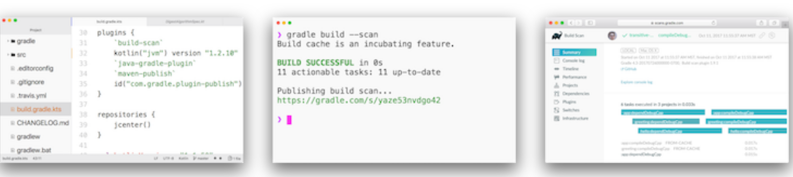

# Gradle用户手册

> 是否想学习顶尖工程团队用来保持构建快速和高性能的提示和技巧？[在此处注册](https://gradle.com/training/build-cache-deep-dive/?bid=docs-userguide)以获取我们的构建缓存培训。

Gradle是专注于灵活性和性能的开源构建自动化工具。Gradle构建脚本是使用[Groovy](https://groovy-lang.org/)或[Kotlin](https://kotlinlang.org/)DSL编写的。阅读有关[Gradle功能的信息，](https://gradle.org/features/)以了解[Gradle的功能](https://gradle.org/features/)。

* **高度可定制**\-Gradle以最基本的方式可定制和可扩展的方式建模。
* **快速**\-Gradle通过重新使用以前执行的输出，仅处理已更改的输入以及并行执行任务来**快速**完成任务。
* **强大**\-Gradle是Android的官方构建工具，并支持许多流行的语言和技术。

## [Gradle的新项目](#Gradle的新项目)

Gradle入门很容易！首先，按照我们的指南[下载并安装Gradle](/md/安装Gradle.md)，然后查看[我们的示例](https://docs.gradle.org/current/samples/index.html) 以创建您的第一个版本。

如果您当前正在使用Maven，请查看[Gradle与Maven](https://gradle.org/maven-vs-gradle/)的直观[对比，](https://gradle.org/maven-vs-gradle/)
并按照[从Maven迁移到Gradle](/md/从Apache%20Maven迁移.md)的指南进行操作。

## [使用现有的Gradle构建](#使用现有的Gradle构建)

Gradle支持许多主要的IDE，
包括**Android Studio，Eclipse，IntelliJ IDEA，Visual Studio 2019和XCode**。
您也可以通过终端中的
[命令行界面](/md/命令行界面.md#command_line_interface) 或持续集成服务器来调用Gradle。
[Gradle构建扫描可](https://scans.gradle.com/) 帮助您了解构建结果，提高构建性能并协作以更快地解决问题。

## [获得帮助](#获得帮助)

* **论坛**\-获得帮助的最快方法是通过[Gradle论坛](https://discuss.gradle.org "Gradle帮助和讨论论坛")。社区成员和核心贡献者回答您的问题。
* **培训**\-Gradle开发人员每月都会进行免费的基于Web的Gradle培训。前往[培训页面](https://gradle.com/training/ "Gradle训练时间表")进行注册。
* **企业服务**\-可以与[Gradle Enterprise](https://gradle.com)订阅一起购买支持和培训。

## [执照](#执照)

Gradle构建工具的源代码是开放的，并根据[Apache License 2.0](https://github.com/gradle/gradle/blob/master/LICENSE)获得[许可](https://github.com/gradle/gradle/blob/master/LICENSE)。Gradle用户手册和DSL参考已获得[Creative Commons Attribution-NonCommercial-ShareAlike 4.0 International License的许可](https://creativecommons.org/licenses/by-nc-sa/4.0/)。
